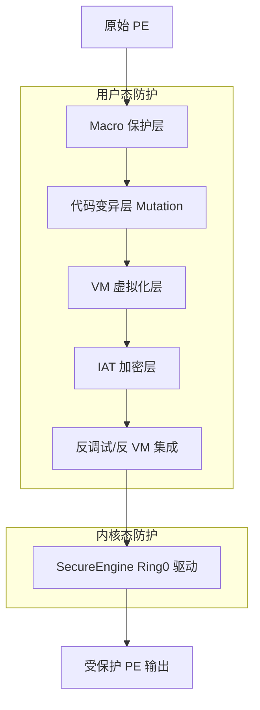
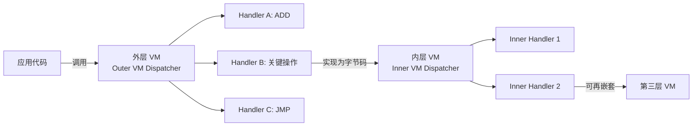
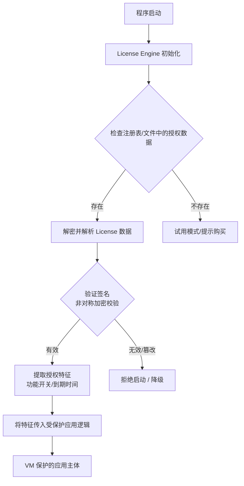
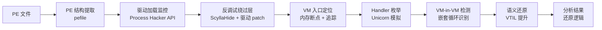

---
tags:
  - WASM
  - 虚拟化壳
  - tier3
  - themida
  - 脱壳
---
# Themida 与 WinLicense 逆向实战

> [!abstract] TL;DR
> Themida 与 WinLicense 是 Oreans Technologies 出品的顶级商业 VM 壳，核心差异在于多层次立体防护体系：用户态虚拟机（含 CISC/FISH/TIGER 三档 Handler）、VM-in-VM 嵌套虚拟化、Ring0 内核驱动（SecureEngine）、代码变异（Mutation）、IAT 加密、反调试/反 VM 集成，形成难以线性突破的防护纵深。WinLicense 在 Themida 基础上增加了授权许可引擎。逆向研究需要按层剥离：先用 ScyllaHide + x64dbg 绕过反调试，再定位 VM 入口，最后结合 Unicorn 模拟或追踪框架还原 VM 语义。本章重点覆盖架构差异、攻击面划分与分析策略，与第 09–13 章的 VMProtect 路线形成互补。

## 概述与定位

### Oreans 产品线全景

Themida 与 WinLicense 均出自以色列软件保护公司 **Oreans Technologies**。二者共享同一底层保护引擎（称为 **SecureEngine**），区别仅在于上层功能集：

| 产品 | 核心定位 | 附加功能 |
|------|---------|---------|
| **Themida** | 代码/数据虚拟化保护，防逆向 | 无许可管理 |
| **WinLicense** | Themida 全功能 + 内置许可/激活引擎 | 试用期、注册码、在线激活 |
| **Code Virtualizer** | Oreans 轻量版 VM 壳 | 仅 VM，无 Macro/其他防护 |

WinLicense 面向需要授权管理的商业软件发行商；Themida 面向只需要防逆向的场景。两者在逆向层面几乎等价——WinLicense 只是多了一个独立的许可校验模块（License Engine），该模块本身也受 VM 保护。

当前（2024 年后）主流部署版本为 **Themida/WinLicense 3.x**，相比 2.x 有以下重要变化：
- VM 层新增了基于 FISH 和 TIGER 类型的多态 Handler
- SecureEngine 驱动支持 Windows 10/11 DSE（驱动签名强制执行）环境
- 新增云端校验接口（Anti-Analysis 部分在远程服务器执行，本地无法完整模拟）

### 与 VMProtect 的关键差异

第 12 章分析了 VMProtect（见 `[[12.VMProtect逆向实战]]`），在开始 Themida 研究前先建立清晰的产品差异认知：

| 维度 | VMProtect | Themida/WinLicense |
|------|----------|--------------------|
| 架构层数 | 单层 VM（可选 Mutation） | VM + Mutation + Macro + Ring0 驱动 **多层并联** |
| Handler 类型 | 相对统一（x86→自定义 ISA） | CISC/FISH/TIGER 三档，同一段代码可混合 |
| 内核驱动 | 无（纯用户态） | **SecureEngine 驱动**（Ring0 级别钩子） |
| 反调试集成 | 内嵌反调试代码（用户态） | 用户态 + 内核态双层反调试 |
| 反 VM 集成 | 较弱 | 强，含环境指纹采集 |
| IAT 处理 | API Wrapping（入口替换） | IAT 加密 + API Wrapping 双重处理 |
| VM 嵌套 | 极少见（通常单层） | **VM-in-VM 常见**（多层嵌套） |

这些差异决定了逆向策略的根本差异：VMProtect 可以相对直接地定位 VM 入口并追踪 Handler；Themida 必须首先剥离内核驱动、绕过反调试，才能触及 VM 层本体。

### 在逆向研究中的地位

Themida/WinLicense 广泛部署于：
- 游戏防作弊（早期 Counter-Strike 1.6 分发包、多款韩国网游）
- 商业 CAD/EDA 软件（授权模块保护）
- 安全产品自身保护
- 高价值工具软件（部分 PE 工具、加密工具）

从防御角度，Themida 是研究"最强工业级 VM 壳"的理想样本——其 VM-in-VM 架构、驱动级反调试、代码变异组合代表了商业保护的当前技术边界。

## 原理与机制

### SecureEngine 整体架构

Themida 的保护机制不是单一技术，而是多个独立防护层的有机叠加。下图展示其整体架构：



各层职责如下：

**Macro 保护层（宏保护）**：Themida 的宏（Macro）是开发者在源代码中插入的特殊标记（`THEMIDA_START` / `THEMIDA_END` 或 SDK 函数），标记需要保护的代码区间。编译后，这些区间会被替换为 VM 字节码或 Mutation 变体。"宏"本身不是 VM，而是一种保护范围指示机制。

**代码变异层（Mutation）**：指令级变换，原始 x86 指令被替换为功能等价但结构不同的指令序列（如 `MOV eax, 1` 可能变成一段利用算术恒等式的多条指令序列）。变异后的代码仍在 x86/x64 CPU 上原生执行，不需要解释器——这是 Mutation 与 VM 的本质区别。Mutation 主要用于保护 VM 自身的 Dispatcher/Handler 代码，形成"用 Mutation 保护 VM，用 VM 保护应用逻辑"的嵌套结构。

**VM 虚拟化层**：核心保护，后文详解。

**IAT 加密层**：对被保护 PE 的导入地址表（IAT）进行加密，阻止静态分析者通过 IAT 直接识别 API 调用。

**反调试/反 VM 集成**：内嵌大量检测逻辑，在整个保护代码中分散分布（不集中在单一位置），逐步检测调试器/虚拟机环境并触发干扰行为（崩溃、挂起、数据破坏）。

**SecureEngine 内核驱动**：最强防线，后文详解。

### VM 字节码架构与三种复杂度

Themida 的 VM 是一个自定义 ISA 解释器，与 VMProtect 的单一 ISA 不同，Themida 提供三种复杂度级别的 VM，这三种级别在 Oreans 内部文档中通常被研究者命名为 **CISC、FISH、TIGER**（非官方命名，源自逆向社区的分析文献）：

**CISC 模式**（低复杂度）：
- Handler 对应较为规整的 x86 语义，每个 Handler 的功能可以相对直接地映射到原始操作
- 字节码指令较长，语义密度低
- 适合对不太关键的代码块使用，性能损耗相对小
- 逆向难度：中等。Handler 枚举（参见 `[[10.VM字节码与Handler分析]]`）可以相对直接地工作

**FISH 模式**（中复杂度）：
- Handler 设计引入了多态（Polymorphic）：同一逻辑操作对应多种 Handler 实现，彼此功能等价但二进制不同
- Dispatcher 使用间接跳转，跳转目标在运行时计算
- 字节码操作数被额外加密，需要在 Handler 内部解密
- 逆向难度：高。需要动态追踪才能观察实际 Handler 序列，静态枚举失效

**TIGER 模式**（最高复杂度，基于 Mutation 的 Handler）：
- Handler 本身受 Mutation 保护：每个 Handler 的实现代码被变异（Mutation），使得两个功能相同的 Handler 在二进制层面完全不同
- VM 字节码与 Handler 之间的映射关系在构建期随机化，无法通过特征匹配复用
- 引入 VM-in-VM：关键 Handler 的实现本身被另一层 VM 保护（详见下节）
- 逆向难度：极高。Handler 识别需要语义等价分析而非结构匹配

实际部署中，同一受保护程序可能混合使用三种模式：对授权校验等关键路径使用 TIGER，对界面逻辑等次要路径使用 CISC，形成差异化防护。

### VM-in-VM 嵌套虚拟机

这是 Themida 对抗自动化分析的核心技术，也是与 VMProtect 最大的架构差异。

**原理**：外层 VM（Outer VM）的某些 Handler，其实现本身是另一套 VM 的字节码程序（Inner VM）。分析者追踪外层 VM 时，在某些 Handler 的执行阶段会"陷入"内层 VM 解释循环，而内层 VM 可能还有第三层（理论上可无限嵌套，实际常见 2–3 层）。



**对分析工具的影响**：
- **追踪工具**（Pin、DynamoRIO）：追踪层数不限，但追踪量指数级增加——原本 1000 条指令的操作，经 3 层 VM 可能产生数十万条追踪记录，信息密度极低
- **符号执行**（angr/Triton）：路径爆炸加剧，内层 VM 的状态空间嵌套使约束求解器超时
- **Unicorn 模拟**：可以运行，但必须正确模拟外层 VM 的内存布局才能进入内层 VM，配置难度高
- **静态分析**：仅能看到外层 VM 框架，内层 VM 的字节码程序存储在外层 VM 的"数据段"中，静态工具无法区分"VM 指令"和"VM 数据"

**识别 VM-in-VM 的经验特征**：
- 在外层 VM 的某个 Handler 执行过程中，观察到一个新的"解释循环"进入（PC 回到某个固定地址反复执行，但那个地址是 Handler 代码，不是外层 Dispatcher）
- 栈深度在特定 Handler 执行时异常增加
- 内层 VM 往往有自己独立的虚拟寄存器组（不复用外层 VM 的 vReg 数组），可通过内存访问模式识别

### SecureEngine 内核驱动（Ring0 联防）

这是 Themida 相对于 VMProtect 最重要的额外防护层，也是逆向分析中最难绕过的部分。

**驱动加载机制**：受保护程序启动时，会尝试加载 SecureEngine 驱动（`.sys` 文件，通常以随机名称释放到临时目录）。在 64 位 Windows 上，驱动必须有效签名（DSE 强制执行），Oreans 使用合法的代码签名证书，因此驱动可以正常加载。

**驱动提供的反调试能力**：

1. **内核调试器检测**：检测 `KdDebuggerEnabled`（内核调试标志），用户态无法修改此标志（KernelHide 等工具可以，但需要自己也是驱动级别）

2. **DKOM（Direct Kernel Object Manipulation）**：驱动可以枚举进程的 EPROCESS 结构，检测进程列表中是否有已知调试器（x64dbg、Ollydbg 等）；也可以检测当前进程的 DebugPort 字段

3. **内核态 API 钩子**：在 `NtReadVirtualMemory`、`NtWriteVirtualMemory`、`NtSetContextThread` 等 Nt 系统调用的内核实现上安装钩子，检测对受保护进程的内存读写操作（调试器会调用这些 API 读取/写入内存）

4. **时序验证**：驱动周期性地向用户态程序发送"心跳"消息；如果用户态程序因为被调试器暂停而无法及时响应，驱动触发保护逻辑（崩溃、数据清零或加密变换）

5. **代码完整性校验**：驱动保存受保护代码段的哈希值，周期性地重新计算并比对（检测内存补丁）

**驱动通信机制**：用户态受保护程序与驱动通过 `DeviceIoControl` 通信（IOCTL），通信数据经加密（密钥在保护时确定）。研究者无法通过仅分析用户态代码理解驱动行为——必须同时逆向驱动本身。

### IAT 加密与 API Wrapping

受保护 PE 的导入表（Import Directory）被完全改造：

**IAT 加密**：原始 IAT 中的函数地址被替换为加密值，程序启动时由 SecureEngine 解密（在驱动已加载的保证下）。如果调试器在解密完成前中断，看到的 IAT 全是无效值。

**API Wrapping**：对关键 API（尤其是 `CreateFile`、`VirtualAlloc`、`IsDebuggerPresent` 等安全相关 API），不是直接调用原始函数，而是调用 SecureEngine 注入的包装函数（Wrapper）。包装函数执行安全检查后，才调用真实 API。这样分析者无法通过在 `kernel32!IsDebuggerPresent` 上设断点来检测反调试代码——因为 Themida 从不直接调用这个符号名的函数，而是通过内核驱动直接读取 `PEB.BeingDebugged` 字段。

**Thunk 混淆**：调用 API 的 `CALL` 指令不直接调用 IAT 中的地址，而是调用一个"蹦床"（Thunk）函数，Thunk 内部有动态计算的跳转逻辑，每次调用路径不固定（依赖运行时状态），使追踪具体 API 调用非常困难。

### 反调试与反 VM 集成

Themida 的反调试检测不集中在启动时运行一次，而是**分散分布**在整个保护代码中，在被保护代码执行的各个阶段持续运行。主要检测技术：

**用户态检测**：
- `IsDebuggerPresent` / `NtQueryInformationProcess(ProcessDebugPort)` 检测
- PEB.NtGlobalFlag 检测（调试环境下此字段值为 0x70）
- Heap 标志检测（调试器存在时 `NtGlobalFlag` 影响堆分配行为）
- `OutputDebugString` 异常检测（调试器不存在时调用会触发异常）
- 硬件断点检测（读取 `CONTEXT.Dr0–Dr3`）
- 时序检测：`RDTSC` 差值，检测单步执行导致的时间异常

**内核态检测**（驱动辅助）：
- `KdDebuggerEnabled` 标志
- EPROCESS.DebugPort 字段
- 对 `NtSetContextThread` 的钩子（检测调试器设置线程上下文）

**反 VM 检测**：
- `CPUID` 检测：检查 Hypervisor 存在位（Bit 31 of ECX when CPUID leaf=1）
- VMware/VirtualBox 后门端口检测（`IN 0x5658` 等）
- 注册表特征检测（VirtualBox 安装注册表键）
- 进程列表检测（vmtoolsd.exe 等 VM 工具进程）
- 屏幕分辨率/颜色深度等 UI 特征（沙箱通常使用低分辨率）
- MAC 地址 OUI 检测（VMware 使用固定 OUI 前缀）

**代码变异（Mutation）对反调试代码的保护**：这些检测代码本身受 Mutation 保护，因此静态分析无法直接找到"IsDebuggerPresent 调用"——它被变换成了一段功能等价但形式完全不同的代码。这形成了一个防护闭环：反调试代码在 VM 层之外（Mutation 层），既不需要进 VM 解释，也难以静态识别。

## 结构/算法/伪代码详解

### VM Dispatcher 结构

Themida VM 的 Dispatcher 与 VMProtect 有结构相似之处，但在细节上有重要差异。以下为研究社区通过逆向分析重建的典型 Dispatcher 伪代码（CISC 模式简化版）：

```c
// 虚拟寄存器组（位于堆分配的 VM 上下文结构中）
struct VMContext {
    uint64_t vReg[16];   // 虚拟通用寄存器
    uint8_t* vPC;        // 虚拟程序计数器（指向字节码）
    uint64_t* vSP;       // 虚拟栈指针
    uint64_t vFlags;     // 虚拟标志寄存器
    uint8_t  decryptKey; // 字节码解密密钥（逐字节滚动 XOR）
    // ... 其他状态
};

// 主解释循环（简化，实际代码受 Mutation 保护）
void VM_Dispatch(VMContext* ctx) {
    while (1) {
        // 1. 取字节码操作码（带解密）
        uint8_t opcode = *(ctx->vPC) ^ ctx->decryptKey;
        ctx->vPC++;
        ctx->decryptKey = /* 基于 opcode 和当前状态的滚动更新 */;

        // 2. 根据操作码跳转到 Handler
        //    注意：实际使用跳转表，且跳转地址经混淆（非直接查表）
        switch (opcode) {
            case 0x3A: VM_Handler_ADD(ctx); break;
            case 0x71: VM_Handler_PUSH(ctx); break;
            case 0x2C: VM_Handler_MOV(ctx); break;
            // ... 数十到数百个 Handler
            case 0xF0: return; // VM_EXIT
        }
        // 3. FISH/TIGER 模式下，Handler 执行后可能修改 decryptKey
        //    使后续操作码解密方式改变（动态密钥流）
    }
}
```

**关键细节——动态操作码解密**：与 VMProtect 的静态字节码不同，Themida 的字节码在取出后需要经过一个"动态密钥流"解密，密钥状态随每条指令的执行而更新（类似流密码 RC4 的密钥流，但密钥更新方式更复杂）。这意味着：
- 不能直接从内存 dump 字节码然后静态解析
- 必须在运行时追踪解密后的操作码序列

### FISH 模式的多态 Handler 机制

FISH 模式 Handler 的一个典型特征是"同一操作，多种实现"。以虚拟 ADD 操作为例：

```
// Handler ADD 实现 #1（可能分配到奇数编号区域）
Handler_ADD_v1:
    mov rax, [rsi + vReg_A_offset]  ; 读 vReg[A]
    add rax, [rsi + vReg_B_offset]  ; 加 vReg[B]
    mov [rsi + vReg_C_offset], rax  ; 写 vReg[C]
    ; 更新 vFlags...
    jmp [rdx + next_handler_offset]  ; 跳转到下一 Handler

// Handler ADD 实现 #2（功能等价，但代码结构不同）
Handler_ADD_v2:
    push rbx
    mov rbx, [rsi + vReg_B_offset]
    mov rax, [rsi + vReg_A_offset]
    xchg rax, rbx          ; 不同的指令序列实现同样逻辑
    add rax, rbx
    pop rbx
    mov [rsi + vReg_C_offset], rax
    jmp [rdx + next_handler_offset]
```

在 FISH 模式下，字节码中"选择哪个实现"由操作码本身决定（高位 bit 用于选择变体），且选择可能依赖运行时状态（使分析者无法离线预测将执行哪个变体）。

### TIGER 模式：Mutation 化 Handler

TIGER 模式的 Handler 受 Mutation 保护，Mutation 将 Handler 代码变换为功能等价但形式完全不同的代码。典型的 Mutation 变换包括：

**常数折叠逆转**（将常数操作展开）：
```nasm
; 原始
mov eax, 0x100

; Mutation 后（等价，但形式不同）
xor eax, eax
add eax, 0x50
shl eax, 1
add eax, 0x10
xor eax, 0x90
; ... 最终 eax = 0x100，但经过多步
```

**控制流变形**：
```nasm
; 原始（顺序执行）
inst_1
inst_2
inst_3

; Mutation 后（等价，通过 JMP 跳转重组）
inst_1
jmp block_2

block_3:
inst_3
; Handler 实际逻辑结束

block_2:
inst_2
jmp block_3
```

**等价指令替换**：
```nasm
; 原始
not eax     ; eax = ~eax

; 等价替换
xor eax, 0xFFFFFFFF  ; 等价
```

TIGER 模式的 Handler 经过上述多种变换的叠加，使得 Handler 的"指纹"（可用于识别的结构特征）消失，自动化的 Handler 语义识别（依赖结构匹配的工具）失效。

### WinLicense 许可引擎结构

WinLicense 在 Themida 的 VM 保护之外，增加了一个独立的许可校验模块。该模块的典型逻辑结构：



**关键设计**：授权数据的签名校验使用非对称加密（通常为 RSA 或 ECC），公钥硬编码在受保护程序中（公钥本身受 VM 保护），私钥由 Oreans 管理（或由软件发行商持有）。因此即使逆向者完整还原了校验逻辑，也无法伪造有效签名——必须针对具体实现寻找绕过点（如直接跳过签名校验跳转、或找到返回值篡改点），而不是重建签名算法。

**授权特征存储**：有效的 License 通常存储在注册表（`HKCU\Software\[厂商名]\...`）或独立文件，数据经过额外加密（密钥来自机器指纹，绑定机器）。

### Handler 跳转表与间接调度

Dispatcher 中的 Handler 调度机制在不同 Themida 版本中有所不同，但常见的一种模式是**双重间接跳转**：

```nasm
; Dispatcher 核心调度（简化）
; rdx = Handler 跳转表基址
; rax = 解密后的操作码

mov rbx, [rdx + rax*8]   ; 取 Handler 地址（一次间接）
add rbx, [rdx + rbx]     ; 再加一个偏移（二次间接，运行时计算）
jmp rbx                  ; 跳转到 Handler
```

这种双重间接跳转使得静态分析无法从 Dispatcher 代码直接恢复所有 Handler 的地址（第二次间接的偏移依赖运行时状态）。逆向者必须在运行时记录实际跳转目标，才能枚举 Handler 集合。

## 工具视角与实战

### 分析前置准备

**环境隔离**：Themida 的 SecureEngine 驱动会检测 VM 环境，直接在 VMware/VirtualBox 中运行可能触发保护逻辑。推荐选项：
1. 物理机（最可靠，但需要配置分析环境）
2. Hyper-V + HVCI（部分 Themida 版本对 Hyper-V 检测较弱）
3. 使用 VMware 配合 VMware 指纹抹除工具（如 VBoxHardenedLoader 的 VMware 版本），但成功率不稳定

**工具链准备**：
- **x64dbg** + **ScyllaHide 插件**（用于绕过用户态反调试）
- **Cheat Engine**（内存搜索，定位关键数据结构）
- **WinObj / Process Hacker**（分析 SecureEngine 驱动加载状态）
- **API Monitor / Procmon**（监控 API 调用和文件/注册表操作）
- **Unicorn Engine**（模拟执行，用于 Handler 语义还原）
- **Python + pefile**（PE 结构分析）
- **IDA Pro / Ghidra**（静态分析基础）

### 第一阶段：识别保护层次

**步骤 1：PE 结构分析**

受 Themida 保护的 PE 有一些典型特征：
```
.themida 段（或随机名称段）：包含加密的字节码和 VM 引擎
导入表：极度精简，通常只剩 kernel32 中少量函数
节区数量：通常增加 2-4 个加密节区
EP（入口点）：跳转到保护代码入口，而非原始 OEP
```

使用 `pefile` 检查节区：
```python
import pefile

pe = pefile.PE("target.exe")
for section in pe.sections:
    print(f"{section.Name.decode().strip(chr(0))}: "
          f"VirtualSize=0x{section.Misc_VirtualSize:X}, "
          f"Entropy={section.get_entropy():.2f}")
# Themida 的加密节区通常有极高熵值（>7.5）
```

**步骤 2：驱动检测**

使用 Process Hacker 或 `sc query type= driver` 查看系统驱动，在受保护程序运行期间检测是否有新驱动加载（随机名称，签发给 Oreans 的证书）。

**步骤 3：反调试探测**

不使用任何反调试绕过工具，直接附加调试器，观察程序行为：
- 立即崩溃 → 用户态反调试有效
- 延迟崩溃（几秒后） → 可能是驱动心跳超时
- 启动后正常，操作特定功能时崩溃 → 反调试代码分散在功能逻辑中

### 第二阶段：绕过反调试

**ScyllaHide 配置**：ScyllaHide 是 x64dbg 的插件，通过 Hook 用户态 API 实现反调试绕过：

```
// ScyllaHide 推荐配置（针对 Themida）
PEB Patching: 是（修改 PEB.BeingDebugged 为 0）
NtQueryInformationProcess Hook: 是（ProcessDebugPort 返回 0）
NtSetInformationThread Hook: 是（防止线程隐藏）
OutputDebugString: 是
RDTSC Patch: 是（阻止时序检测）
GetTickCount Hook: 是
NtQuerySystemTime Hook: 是
Remove Debug Privileges: 否
```

ScyllaHide 的原理是在 x64dbg 的进程内 Hook 上述 API，使得被调试进程在调用这些 API 时得到"无调试器"的结果。然而，ScyllaHide 的限制在于它是**用户态钩子**，无法绕过 SecureEngine 驱动的内核态检测。

**绕过驱动级反调试的方法**：

1. **加载反驱动（驱动级绕过）**：使用同样具有内核权限的工具（如 PCHunter、Cheat Engine 驱动模式）来 patch 内核中 SecureEngine 的检测逻辑。需要启动调试签名模式（BCDEdit）或使用 BYOVD（带自己的脆弱驱动）。

2. **分析驱动的 IOCTL 接口**：逆向 SecureEngine 驱动（在受保护程序运行时从 `%TEMP%` 获取 `.sys` 文件），理解驱动与用户态的通信协议，伪造"心跳"响应，使驱动认为用户态程序正常运行。

3. **绕过驱动加载**：在驱动加载前（程序启动早期）拦截驱动安装操作（`NtLoadDriver`），阻止驱动加载。这会导致部分保护功能失效，但程序本身通常会在没有驱动时降级到纯用户态保护模式。

### 第三阶段：VM 入口定位

绕过反调试后，需要定位 VM 的 Dispatcher 入口点。

**方法 1：API 调用追踪**

许多受保护函数在进入 VM 保护区域前，会有一个标准的"VM 调用序列"（类似函数调用约定，用于传递参数给 VM 引擎）。通过 API Monitor 记录程序运行期间的 API 调用，在调用序列中寻找进入保护区域的"突变点"（之前是正常 API 调用序列，之后 API 调用突然消失或变成不寻常的 API）。

**方法 2：内存访问断点**

VM 字节码通常存储在一个专用的内存区域。找到该区域（通过 PE 节区分析或追踪初始化代码），在该区域首字节设置**内存读取断点**（硬件断点，不触发检测）：
```
在 x64dbg 中：在字节码区域起始地址设置 "Memory on access (1 byte)" 硬件断点
首次触发时即为 Dispatcher 读取字节码，此时 ESP/RSP 指向的调用栈即为 VM 调用路径
```

**方法 3：特征字符串搜索**

部分 Themida 版本在 Dispatcher 区域附近有特定的魔术字节序列（基于对大量样本分析总结的签名）。Cheat Engine 的内存搜索可以扫描这些序列：
```
常见特征（非绝对）：
- VM 上下文初始化时会将虚拟寄存器清零（大段 XOR/MOV 序列）
- Dispatcher 跳转表（一段连续的 64 位指针数组）
```

### 第四阶段：Handler 枚举与语义还原

找到 Dispatcher 后，需要枚举 Handler 并还原其语义（参见 `[[10.VM字节码与Handler分析]]` 的通用方法，以下补充 Themida 特有要点）。

**动态追踪方案（Pin/Unicorn）**：

```python
# 使用 Unicorn 模拟追踪 Handler 序列（概念性伪代码）
from unicorn import *
from unicorn.x86_const import *

# 初始化模拟环境（需要先从内存 dump 出 VM 代码和字节码区域）
mu = Uc(UC_ARCH_X86, UC_MODE_64)

# 映射内存（VM 代码段、栈、字节码段）
mu.mem_map(VM_CODE_BASE, VM_CODE_SIZE)
mu.mem_map(VM_BYTECODE_BASE, VM_BYTECODE_SIZE)
mu.mem_map(STACK_BASE, STACK_SIZE)

# 写入从真实进程 dump 的数据
mu.mem_write(VM_CODE_BASE, vm_code_data)
mu.mem_write(VM_BYTECODE_BASE, bytecode_data)

# 设置钩子：记录每次 Dispatcher 跳转到 Handler
def on_jmp_hook(uc, address, size, user_data):
    if is_handler_entry(address):
        handler_trace.append({
            'handler_addr': address,
            'vPC': uc.reg_read(UC_X86_REG_RSI),  # vPC 寄存器
            'opcode': user_data['last_opcode']
        })

mu.hook_add(UC_HOOK_CODE, on_jmp_hook)

# 开始模拟
mu.emu_start(VM_DISPATCHER_ENTRY, VM_EXIT_POINT)
```

**VM-in-VM 的识别**：在追踪过程中，当 Unicorn 进入一个 Handler 后，如果观察到执行流进入了一个新的"解释循环"（特征：PC 在某个小范围内反复跳转，且这个范围不是原始 Dispatcher 的地址），即识别到了 VM-in-VM。需要递归地对内层 VM 也进行同样的追踪分析。

**CISC Handler 的语义还原示例**：

假设追踪到一个 Handler，其执行模式为：
```
取 vReg[A]（读 rsi+offset_A）
取 vReg[B]（读 rsi+offset_B）
执行某操作
写 vReg[C]（写 rsi+offset_C）
更新 vFlags
```

通过追踪多个不同操作数的执行实例，分析操作数与结果的关系，可以推断出该 Handler 的语义（如 ADD、XOR、MUL 等）。这是第 11 章 VTIL 框架（`[[11.VTIL与提升框架]]`）中"语义提取"步骤的具体应用。

### 第五阶段：WinLicense 授权校验定位

对于 WinLicense 保护的程序，在完成 VM 分析基础上，还需要定位许可校验逻辑：

**方法：License 数据流追踪**

1. 定位 License 存储位置（注册表或文件，可通过 Procmon 记录）
2. 在读取 License 数据的 API（`RegQueryValueEx`、`ReadFile` 等）上设断点
3. 追踪 License 数据的流向，找到传入 VM 执行的节点
4. 在 VM 执行完成后，观察结果如何影响后续控制流（成功/失败分支）

**关键绕过点**：License 校验通常在 VM 内部执行 RSA/ECC 验签，验签结果通过一个虚拟标志位（vReg 中的某位）传出。追踪到这个传出点后，可以通过修改 VM 上下文（在调试器中直接修改虚拟寄存器）来绕过校验——**仅用于自有软件测试/授权评估场景**。

### 自动化分析框架思路

基于以上步骤，可以构建半自动化的 Themida 分析框架：



目前没有一个公开的、完全自动化的 Themida 分析工具（与 VMProtect 的 VMPDump 等工具不同），主要原因是 Themida 的 VM-in-VM 和内核驱动联防使得全自动化分析极为困难。现有的分析工具（如私下流传的部分脱壳机）通常只针对特定版本有效，且不公开。

## 安全性与正确使用

> [!caution]
> **本章内容的合法使用边界**
>
> Themida 与 WinLicense 逆向分析技术仅应用于以下场景：
> - **自有软件研究**：你是该软件的版权所有者，分析自己用 Themida 保护的程序以理解保护强度
> - **授权安全评估**：受软件发行商委托，对其受保护程序进行安全测试（渗透测试授权书覆盖此范围）
> - **恶意软件分析**：恶意软件作者可能使用 Themida 保护其恶意代码，安全研究员分析这类样本时需要上述技术
> - **学术/CTF 研究**：使用专门设计的练习样本（如公开的 crackme 挑战）学习和研究保护技术
>
> **明确禁止的用途**：
> - 破解商业软件的注册/授权限制（无论是否为个人使用）
> - 移除受保护软件的 DRM（数字版权管理）保护
> - 为盗版分发目的进行脱壳
> - 在未获授权的他人软件上进行任何分析
>
> 不合法使用上述技术可能违反《计算机软件保护条例》（中国）、DMCA（美国）、欧盟软件指令及其他司法管辖区的相关法律。**本章的目标是帮助安全研究人员理解保护机制本身，而非提供破解工具。**

### 防御性视角：开发者如何使用 Themida

理解保护机制有助于开发者做出更好的保护决策：

**Themida 保护的有效范围**：
- 有效阻止低/中级逆向分析（工具直接转储、静态分析）
- 对 0-day 逆向研究者的攻击，Themida 可提供数周到数月的有效保护期（取决于分析者能力和目标吸引力）
- **无法提供永久保护**：任何基于软件的保护最终都可以被足够耐心的分析者绕过，这是保护软件领域的基本共识

**保护建议**：
- 对高价值代码，考虑将核心逻辑移到服务端（云端执行，客户端无法分析服务端代码）
- Themida + 服务端校验的组合比纯 Themida 更强
- 授权校验逻辑的关键判断应在服务端完成，客户端 License 验证作为"第一道门"

**已知 Themida 的局限性**：
- 性能开销：VM 保护会导致 3x–100x 的执行速度降低（取决于保护密度），不适合性能敏感代码
- 与部分安全软件的兼容性问题（SecureEngine 驱动有时与其他内核驱动冲突）
- 针对新版本 Windows 的适配存在延迟

### 安全研究的正确姿势

在进行授权的 Themida 分析时，建议遵循以下研究规范：

1. **文档化目的**：在分析前记录分析目的（自有软件 / 委托评估 / 恶意软件分析），保存相关文件
2. **环境隔离**：在专用分析机（或隔离 VM）上进行，避免影响生产环境
3. **不传播绕过工具**：分析过程中开发的针对特定版本的绕过工具，不应在未经授权的情况下传播
4. **负责任披露**：如果在分析中发现 Themida 本身的漏洞（如可被利用的设计缺陷），应通过负责任披露渠道（Oreans 安全邮件 / CERT）报告，而非直接公开利用方法

## 小结

Themida 与 WinLicense 代表了商业 VM 壳的当前技术边界，其核心竞争力在于**多防护层的有机组合**，而非单一技术的极致强化：

1. **SecureEngine 内核驱动**是其与 VMProtect 最大的架构差异，将防护从用户态延伸到内核态，使纯用户态分析工具的绕过能力显著受限

2. **VM-in-VM 嵌套虚拟机**使分析工作量指数级增加，因为每多一层 VM，追踪量乘以 Handler 平均执行指令数的倍数

3. **CISC/FISH/TIGER 三档 VM 复杂度**允许保护开发者按代码重要性差异化配置，高价值代码用 TIGER（最难分析），普通代码用 CISC（减少性能损耗）

4. **代码变异（Mutation）作为 VM 的上层保护**，使 VM 引擎本身的逆向难度与受保护代码相当，消除了"先分析 VM 引擎，再批量解析字节码"的捷径

5. **逆向策略的核心**是"层剥离"：先绕过驱动（最外层），再突破反调试（次外层），再定位 VM 入口，再追踪 Handler，再处理 VM-in-VM——每一层都是独立的研究课题

与第 09–13 章的 VMProtect 分析路线相比，Themida 的分析需要额外掌握内核驱动逆向技能（Ring0 环境分析），并且 Unicorn 模拟方案的初始化配置更复杂（需要正确重建 VM 上下文结构体，包括 SecureEngine 驱动提供的部分运行时数据）。

从防御角度，Themida 代表了"软件纵深防御"的典型实践，值得安全研究人员深入研究其设计理念——将多种技术组合形成协同防御，而非依赖单一强技术。

## 相关阅读

- `[[09.虚拟化保护壳总览]]` —— VM 壳分类体系、四大组件定义，Themida 架构入门
- `[[10.VM字节码与Handler分析]]` —— Dispatcher 定位、Handler 枚举通用方法
- `[[11.VTIL与提升框架]]` —— Handler 语义还原的 IR 提升路线（VTIL）
- `[[12.VMProtect逆向实战]]` —— VMProtect 实战对照参考，理解两大产品架构差异
- `[[13.VM壳自动化分析]]` —— Unicorn 模拟、angr 符号执行在 VM 分析中的应用
- `[[15.传统加壳Enigma与Obsidium与Armadillo]]` —— 非 VM 类壳分析，扩展壳知识谱系
- Oreans Technologies 官方文档（需注册）：Themida SDK 使用指南
- 逆向社区资源：Tuts4You "Themida & WinLicense" 分版块（历史样本和分析报告存档）
- "The Rootkit Arsenal" (Bill Blunden) —— 内核驱动技术背景，辅助理解 SecureEngine 驱动机制
- UnpackMe 系列训练样本：CrackLatinos、ReverseMe.de 上的 Themida 练习样本

---

[[00.WASM与虚拟化壳逆向总览|⬆ 系列总览]] | [[13.VM壳自动化分析|← 上一章]] | [[15.传统加壳Enigma与Obsidium与Armadillo|→ 下一章]]
