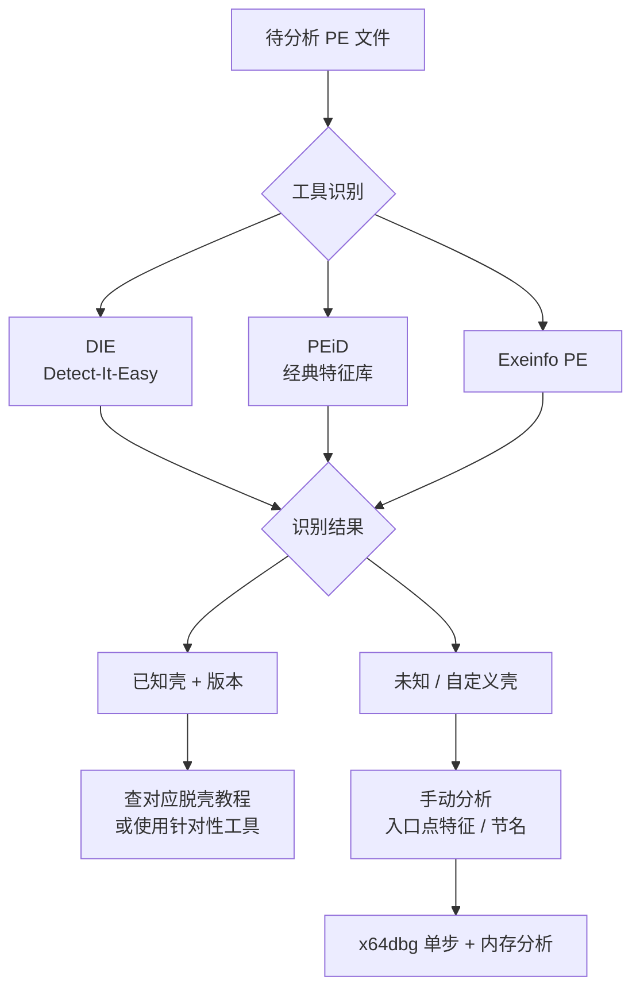
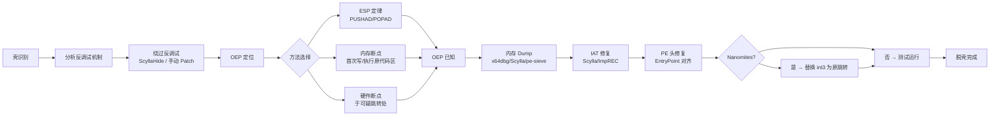

---
tags:
  - WASM
  - 虚拟化壳
  - tier3
  - 加壳
  - 脱壳
---
# 传统加壳：Enigma、Obsidium 与 Armadillo

> [!abstract] TL;DR
> 传统壳（压缩壳、加密壳、混合壳）是虚拟化壳出现之前保护 PE 可执行文件的主流技术。Armadillo 以双进程 Debug-Blocker 和 Nanomites（int3 替换跳转）著称；Enigma Protector 将 License 机制与内置 VM 融为一体；Obsidium 以多态解压 stub 和 IAT 重加密为核心。分析传统壳的核心路径是：壳识别 → OEP 定位 → 内存 Dump → IAT 重建，与 VM 壳的 Handler 枚举路径有本质区别。理解传统壳是学习 VM 壳的必要前置，也是恶意软件分析和授权研究的基础技能。

## 概述与定位

### 壳的历史脉络

可执行文件保护技术的演进大致经历了三个阶段。1990 年代初期，UPX、PKLite 等**压缩壳**（Compression Packer）出现，目的是缩小磁盘体积，顺带防止静态分析。2000 年前后，Armadillo、ASProtect 等**加密壳**（Encryption Packer）兴起，引入了注册保护、反调试、代码加密等机制，保护重心从体积压缩转向知识产权防护。2005 年以后，VMProtect、Themida 等**虚拟化壳**登场，将原生指令转换为私有字节码，彻底重构执行模型。

本篇聚焦第二阶段的代表作——Enigma Protector、Obsidium 和 Armadillo——以及压缩壳的基础知识，形成对传统壳谱系的系统认识。

### 壳的分类谱系

```
PE 保护壳
├── 压缩壳（Compression Packer）
│   ├── UPX（开源，通用标准）
│   ├── PECompact
│   ├── ASPack
│   └── FSG（Fast Small Good）
├── 加密壳（Encryption Packer）
│   ├── Armadillo（双进程守护、Nanomites、CopyMem-II）
│   ├── ASProtect（SEH 链混淆、多态）
│   ├── Enigma Protector（License + 内置 VM）
│   └── Obsidium（IAT 重加密、多态 stub）
├── 虚拟化壳（VM Packer）——见系列其他章节
│   ├── VMProtect
│   ├── Themida / WinLicense
│   └── Code Virtualizer
└── 混合壳（Hybrid）
    ├── 加密壳 + 局部 VM（Enigma v6+ 有此选项）
    └── 压缩 + 反调试（PESpin）
```

从逆向视角看，分类的意义在于决定分析路径：压缩壳只需找到解压 stub 的结尾（OEP）再 dump；加密壳还需要对抗反调试、修复 IAT；VM 壳则要枚举字节码 Handler，重建语义。

### 与 VM 壳的本质区别

VM 壳将被保护代码替换为私有字节码，原始指令在运行时由解释器执行，静态分析几乎无从下手。传统加密壳则不同：原始代码仍然以 x86/x64 指令的形式存在于内存中（只是在运行前处于加密状态），一旦壳完成自解密并跳转到 OEP，内存中便存在完整的原始代码镜像，可以整体 dump。这一根本差异决定了"OEP + Dump + IAT 修复"的传统脱壳路线在传统壳上是可行的，而在完全虚拟化的 VM 壳上几乎没有价值。

---

## 原理与机制

### 压缩壳的工作原理：以 UPX 为例

UPX（Ultimate Packer for eXecutables）是最广为人知的压缩壳，其工作原理极具代表性。

**加壳阶段**（离线，由 upx 工具完成）：

1. 读取原始 PE 文件的各 Section 数据。
2. 用 LZ 系列算法（UPX 自有的 UCL 库）对 `.text`、`.data` 等 Section 进行压缩，合并为一个或多个新 Section（如 `UPX0`、`UPX1`）。
3. 在新 PE 中注入一段**解压 stub**（通常 300–800 字节的汇编代码），并将 PE 头的 `AddressOfEntryPoint` 指向该 stub。

**运行阶段**（在内存中动态完成）：

1. Windows 加载器按新的 PE 结构将文件映射进内存。
2. 执行权交给解压 stub。Stub 执行以下步骤：
   - 保存寄存器（`PUSHAD`）。
   - 将压缩数据解压到目标内存区域（覆盖 `UPX0` Section）。
   - 修复 Import Table（重新填写 IAT 中各 DLL 函数的真实地址，因为压缩后原 IAT 已被破坏）。
   - 恢复寄存器（`POPAD`）。
   - 执行一个长跳转（`JMP OEP`）或返回，将控制权交给原始入口点（OEP，Original Entry Point）。
3. 此后程序按原始逻辑正常执行。

**ESP 定律**：`PUSHAD` / `POPAD` 序列是解压 stub 的典型标志。在 stub 执行 `PUSHAD` 时，ESP 寄存器指向栈顶的某个地址；对该地址设置**硬件写断点**（Hardware Breakpoint on Write），当 `POPAD` 将寄存器弹回时该断点触发，此时距 `JMP OEP` 只有几条指令的距离。这就是"ESP 定律"的原理，是定位 UPX 类压缩壳 OEP 的最快方法。

### 加密壳的通用结构

相比压缩壳，加密壳的 stub 要复杂得多，通常包含以下层次：

```
壳入口（EP stub）
  ├── 反调试检查层（第一道，早期）
  │     ├── IsDebuggerPresent / CheckRemoteDebuggerPresent
  │     ├── NtQueryInformationProcess（ProcessDebugPort）
  │     └── TLS 回调中的额外检查
  ├── 自解密层
  │     ├── 解密密钥生成（可能依赖时间戳、硬件特征）
  │     └── 逐块解密原始代码到内存
  ├── 反调试检查层（第二道，解密后）
  ├── IAT 重建层
  │     ├── 动态解析 API 地址（GetProcAddress 或自实现解析）
  │     └── 填写 IAT（可能使用跳板函数而非真实地址）
  ├── License 校验层（加密壳特有）
  └── 跳转到 OEP
```

IAT 的处理方式是加密壳与压缩壳的重要区别。压缩壳通常在解压完成后直接调用标准的 `LoadLibrary`/`GetProcAddress` 填写 IAT。而加密壳（尤其是 Obsidium、ASProtect）可能使用**跳板函数（Trampoline）**：IAT 中存储的不是真实的 API 地址，而是指向壳代码内一段小 stub 的指针，该 stub 在运行时才真正调用目标 API。这导致直接 dump 后的程序在调用 IAT 时会跳入已被 dump 的无效壳代码区域，即"IAT 损坏"问题，需要用 Scylla 等工具修复。

### 多态与变形技术

多态（Polymorphism）和变形（Metamorphism）是加密壳对抗特征识别的关键技术。

**多态**：壳的解密 stub 每次打包时使用不同的加密密钥和指令编排，但解密逻辑不变。PE 分析工具（如 PEiD）依赖固定的字节特征码（signature）来识别壳，多态让特征码失效。Obsidium 的 stub 尤其以多态著称，每次打包生成的 stub 字节序列几乎完全不同。

**变形**：更激进的手段，不仅改密钥，还改实现逻辑（在语义等价的前提下替换指令序列、插入垃圾指令、打乱指令顺序）。Armadillo 的部分版本在 stub 中使用了变形技术。

---

## 结构/算法/伪代码详解

### Armadillo 深度解析

Armadillo（原名 Software Passport，Silicon Realms Toolworks 出品）是 2000 年代最难脱的壳之一，其三项核心保护机制至今仍有教学价值。

#### 机制一：双进程调试守护（Debug-Blocker）

这是 Armadillo 最具代表性的反调试技术。

**原理**：受保护程序启动时，自身并不直接运行，而是先启动一个**父进程**（通常也是同一个 EXE 的第二个实例）。父进程调用 `CreateProcess` 并传入 `DEBUG_PROCESS` 标志，将子进程（真正的业务逻辑进程）作为调试目标启动。父进程随即进入一个消息循环，监听子进程产生的调试事件（`WaitForDebugEvent`）。

```c
// 父进程伪代码
PROCESS_INFORMATION pi;
CreateProcess(
    self_path,              // 同一个 EXE
    "--child",              // 通过命令行标志区分父子
    NULL, NULL, FALSE,
    DEBUG_PROCESS,          // 关键：以调试模式启动
    NULL, NULL,
    &si, &pi
);

DEBUG_EVENT de;
while (WaitForDebugEvent(&de, INFINITE)) {
    // 处理子进程的调试事件
    // 包括 Nanomites 处理（见后文）
    ContinueDebugEvent(de.dwProcessId, de.dwThreadId, DBG_CONTINUE);
}
```

**效果**：Windows 的调试模型规定，一个进程同一时刻只能有一个调试器附加。由于父进程已经以 `DEBUG_PROCESS` 方式附加到子进程，逆向工程师（如 OllyDbg/x64dbg）无法再附加到子进程——操作系统会拒绝第二次附加请求，返回"进程已被调试"的错误。

**绕过策略**：

1. **替换父进程**：找到父进程（通常是第二个同名进程），用调试器附加父进程而非子进程，在父进程的 `WaitForDebugEvent` 循环处拦截，修改其调试权限，或者杀掉父进程并用自写的"假父进程"替代（即接管调试权）。

2. **Patch `CreateProcess` 调用**：在父进程启动子进程之前，patch `CreateProcess` 的 `DEBUG_PROCESS` 标志，改为普通创建，子进程就不再被任何调试器占用，可以自由附加。

3. **使用 ScyllaHide 插件**：现代 x64dbg + ScyllaHide 可以自动处理 Armadillo 的 Debug-Blocker，通过 NtQueryInformationProcess 钩子欺骗子进程"认为"自己没有父调试器。

#### 机制二：CopyMem-II 页保护

Armadillo 的 CopyMem-II 选项将原始代码页在运行时以加密方式存储于一个独立的内存区域（"备份区"），而在可执行的地址空间中，对应的内存页被标记为 `PAGE_NOACCESS`。

```
内存布局（CopyMem-II 启用时）
┌──────────────────────────────┐
│ 正常数据段（可访问）          │
├──────────────────────────────┤
│ 代码段（PAGE_NOACCESS）      │ ← 访问即触发 EXCEPTION_ACCESS_VIOLATION
├──────────────────────────────┤
│ Armadillo 壳区域             │
│  ├── 解密后代码备份（加密）   │
│  ├── 页管理表                │
│  └── SEH/VEH 处理器          │
└──────────────────────────────┘
```

当 CPU 尝试执行代码段的某个地址时，触发访问违例（`EXCEPTION_ACCESS_VIOLATION`）。Armadillo 注册了一个 **VEH（Vectored Exception Handler）**，在异常处理程序中：

1. 确定触发异常的代码页地址。
2. 从备份区解密对应的代码页数据。
3. 将解密后的内容写入原页面，并将页面权限改为 `PAGE_EXECUTE_READ`。
4. 继续执行（`EXCEPTION_CONTINUE_EXECUTION`）。
5. 执行完毕后，再次将页面改回 `PAGE_NOACCESS` 并清空内容，防止内存 dump。

**效果**：内存中的代码区在绝大多数时刻都不可读、不可访问，使得普通的内存 dump 只能得到全零的代码段。

**绕过策略**：在代码段被解密并设为可执行的那一瞬间（步骤 3 之后、步骤 5 之前）进行 dump。方法是用 `VirtualProtect` 的内核钩子（通过 x64dbg 的内存断点或 API 断点）捕捉页面权限变更事件，在权限变为可执行时暂停并 dump 当前页。工具 pe-sieve 可以扫描进程内存，自动识别并 dump 已被解密的页面。

#### 机制三：Nanomites（纳米机器码）

Nanomites 是 Armadillo 最精妙也最具学术价值的技术，通过将条件跳转替换为 `int 3` 指令，将跳转逻辑外包给父进程处理。

**加壳阶段**：Armadillo 扫描原始代码中的所有**条件跳转指令**（`JE`、`JNE`、`JL`、`JGE` 等），记录每条跳转的：
- 原始地址（VA）
- 跳转类型（哪种条件）
- 跳转目标（VA）
- 跳转不成立时的下一条指令地址

将这些信息编码进一张**Nanomites 查找表**，存储在壳的数据区。然后用单字节 `int 3`（opcode `0xCC`）替换每一条条件跳转指令（原指令通常 2 字节，多余字节填 `NOP`）。

**运行阶段**：

```
子进程执行到被 0xCC 替换的位置
    │
    ▼
产生 EXCEPTION_BREAKPOINT（调试事件）
    │
    ▼
父进程的 WaitForDebugEvent 捕获
    │
    ▼
父进程查询子进程 CONTEXT（读取 EIP/RIP、EFLAGS）
    │
    ▼
在 Nanomites 表中查找 EIP-1（实际 int3 地址）
    │
    ▼
根据 EFLAGS 中的条件标志（ZF、SF、OF 等）判断跳转是否应成立
    │
    ├── 跳转成立 → 修改子进程 CONTEXT.EIP = 跳转目标地址
    └── 跳转不成立 → 修改子进程 CONTEXT.EIP = int3 后的下一条指令
    │
    ▼
父进程 SetThreadContext 更新子进程寄存器
    │
    ▼
ContinueDebugEvent → 子进程从新 EIP 继续执行
```

**效果**：

1. 脱离调试器（即绕过 Debug-Blocker）后，子进程执行到 `int 3` 会触发未处理异常并崩溃，因为没有父进程来处理这些调试事件。即使强行 dump 子进程，代码中大量的条件跳转都变成了 `0xCC`，dump 后的程序无法正常运行。

2. 反静态分析：反汇编器（IDA/Ghidra）在遇到 `0xCC` 时通常将其识别为函数终止或数据，大量的 `int 3` 会严重干扰反汇编结果，让代码流图变得支离破碎。

**修复 Nanomites 的方法**：

需要将 Nanomites 表（父进程中存储跳转信息的数据结构）提取出来，然后逐条将 `0xCC` 替换回原始条件跳转指令。Armadillo 的 Nanomites 表格式在不同版本有所不同，通常通过以下步骤定位：

1. 在父进程中找到 `WaitForDebugEvent` 调用处，跟踪其对子进程 EIP 的读取和修改逻辑。
2. 找到查表逻辑中访问的数据区，即为 Nanomites 表的起始地址。
3. 解析表结构，通常每条记录 12–16 字节（VA、类型标志、目标 VA）。
4. 用脚本（IDAPython 或 Python + ctypes）遍历表，在子进程的内存 dump 中逐条替换 `0xCC` 为正确的条件跳转指令和目标。

### Enigma Protector 深度解析

Enigma Protector（The Enigma Protector 开发组，俄罗斯）是一款将**软件 License 管理**与**代码保护**深度融合的商业壳。

#### 整体架构

Enigma 的保护层次从外到内依次为：

```
┌─────────────────────────────────────────────────────┐
│  壳入口 stub                                         │
│    ├── 反调试（IsDebuggerPresent, RDTSC, 硬件断点检测）│
│    ├── 完整性校验（PE 头 CRC、关键段哈希）            │
│    └── License 校验触发                              │
├─────────────────────────────────────────────────────┤
│  License 引擎                                        │
│    ├── 密钥解析（RSA/ECC 公钥验签）                  │
│    ├── 硬件指纹绑定（CPU ID、HDD SN、MAC）           │
│    └── 功能开关（按模块授权）                        │
├─────────────────────────────────────────────────────┤
│  代码加密层                                          │
│    ├── 分段加密（每个保护块独立加密）                 │
│    └── 内置迷你 VM（v5.x+）                          │
├─────────────────────────────────────────────────────┤
│  文件虚拟化（File Virtualization）                   │
│    ├── 将资源文件嵌入加密容器                        │
│    └── 运行时虚拟文件系统拦截                        │
└─────────────────────────────────────────────────────┘
```

#### License 机制

Enigma 的 License 系统是其商业价值核心。密钥通常是一段 Base32 或十六进制字符串，其结构包含：

- **产品 ID**（4 字节）：标识具体产品。
- **用户信息哈希**（可选，用于绑定用户名）。
- **授权范围位图**：哪些模块/功能被授权。
- **有效期**：过期时间戳（0 表示永久）。
- **硬件指纹**（可选，绑定特定机器）。
- **RSA 签名**：用开发者私钥对以上内容签名。

验证时，壳内嵌开发者公钥，对输入的密钥字符串进行 RSA 验签。只有私钥签名的密钥才能通过验证，因此 Enigma 的 License 系统在密码学层面是安全的（前提是密钥保护得当，不依赖客户端可逆验证）。

**逆向分析重点**：分析 License 机制的目的通常是**理解授权流程**（用于恶意软件分析或自有软件的 License 实现参考），而非破解。关键的分析点在于：

1. 定位 RSA 验签代码（通常在壳内的 License 引擎区域，可通过特征码——如 Montgomery 模乘算法的结构——识别）。
2. 理解公钥的存储位置（硬编码在壳内的数据段，可能经过简单混淆）。
3. 分析验签失败的跳转路径，理解授权状态如何传递给业务逻辑。

#### 文件虚拟化

Enigma 的文件虚拟化功能允许开发者将任意文件（DLL、资源、配置文件）加密打包进被保护的 EXE。在运行时，壳通过 Windows API Hook（`CreateFileW`、`ReadFile`、`FindFirstFileW` 等）拦截文件访问请求，将对虚拟路径的访问重定向到内存中的解密数据。

```
应用代码: CreateFileW("plugin.dll", ...)
    │
    ▼
Enigma Hook 拦截
    │
    ├── 路径在虚拟文件表中？
    │     ├── 是 → 从加密容器解密数据，返回内存文件句柄
    │     └── 否 → 转发给真实 CreateFileW
    │
    ▼
应用代码获得文件句柄（实际指向内存缓冲区）
```

**逆向意义**：分析嵌入 EXE 的资源（如恶意软件分析中需要提取内嵌的 payload）时，需要理解文件虚拟化的容器格式。通常可以通过在 `CreateFileW` 等 API 上下断点来拦截虚拟文件被解密后的内容。

#### 内置迷你 VM（v5.x+）

Enigma v5.x 及以后的版本引入了一个轻量级 VM，可以将特定代码块（由开发者用 `ENIGMA_START` / `ENIGMA_END` 宏标记）编译为私有字节码。这个 VM 比 VMProtect/Themida 的 VM 要简单得多，Handler 数量有限，通常只保护 License 验证等少量关键逻辑。

分析这个迷你 VM 的方法与第 10 章（VM 字节码与 Handler 分析）基本相同：定位 Dispatcher → 枚举 Handler → 建立语义映射 → 提升为伪代码。区别在于 Enigma VM 的字节码格式（操作码宽度、操作数编码）更规整，往往可以直接模式匹配识别。

### Obsidium 深度解析

Obsidium（Obsidium Software）是一款强调**多态**和**IAT 保护**的商业壳，其识别特征是 stub 入口处的极度混淆与对 Import Table 的深度篡改。

#### 多态解压 Stub

Obsidium 的 stub 在每次打包时通过变形引擎重新生成，包含大量：

- **垃圾指令插入**：无语义影响的 `NOP` 序列、`LEA reg, [reg+0]`、无用的 `PUSH/POP` 对。
- **等价指令替换**：`XOR eax, eax` ↔ `SUB eax, eax`，`MOV eax, 0` ↔ `AND eax, 0` 等。
- **控制流混淆**：大量短跳转（`JMP next_instr+2`）分割指令流，使反汇编工具产生错误的跳转图。
- **花指令（Junk Code）**：以 `call` + `pop` 模拟 PIC 寻址，或用异常处理流程执行正常逻辑。

**识别方法**：尽管 stub 字节变化，Obsidium 的 PE 结构特征相对稳定：入口节名通常为 `.obs`（较老版本）或无特征节名但节的 `VirtualSize` 远大于 `SizeOfRawData`（代码/数据在运行时展开）。DIE（Detect-It-Easy）通过启发式规则（入口点 stub 的指令模式分布、节特征）识别 Obsidium。

#### IAT 加密与跳板

Obsidium 对 Import Table 的处理是其最重要的保护特征：

1. **原始 IAT 替换**：打包后，原始 IAT（记录各 API 地址的指针表）被清空或填入无效值。

2. **跳板函数注入**：在壳的代码区为每个被导入的 API 生成一个独立的**跳板 stub**（Trampoline Stub），大约 15–30 字节，包含：
   - 反调试检查（可选，如检查父进程是否为调试器）。
   - 真实的 API 调用（动态解析到 `kernel32!GetProcAddress` 或直接 `call [真实地址]`）。
   - 返回结果。

3. **IAT 指向跳板**：IAT 中填入各 API 对应跳板 stub 的地址，而非真实 API 地址。

```
被保护代码调用 MessageBoxA:
  call [IAT_entry_MessageBoxA]     ; IAT 中存的是跳板地址
         │
         ▼
  跳板 Stub（在壳的代码区）:
    pushad
    ; 反调试检查
    call  get_api_address           ; 动态获取真实 MessageBoxA 地址
    popad
    jmp   [real_MessageBoxA]        ; 跳至真实 API
```

**脱壳后的 IAT 问题**：即使找到 OEP 并成功 dump，dump 后程序的所有 API 调用都指向已被 dump 截断的跳板 stub，无法运行。Scylla（ImpREC 的现代继承者）通过以下方式修复：

1. 遍历 dump 后程序的所有 IAT 条目（当前为跳板地址）。
2. 对每个跳板地址，在内存中追踪其最终的跳转目标（真实 API 地址），通常通过单步或内存读取跳板末尾的 `jmp [addr]` 来获得。
3. 将 IAT 中的跳板地址替换为真实 API 地址。
4. 同时修复 PE 头中 Import Directory 的 RVA，使其指向重建后的 IAT。

---

## 工具视角与实战

### 壳识别工具



**DIE（Detect-It-Easy）** 是目前最活跃维护的壳检测工具，支持通过 Python 脚本编写自定义签名，识别率在主流壳中达到 95% 以上。其检测逻辑分为两层：静态字节签名 + 启发式（节特征、入口点附近指令模式、PE 头异常字段）。

**PEiD** 年代较老但特征库庞大，尤其对 2000–2010 年代的壳版本识别准确。其签名格式（`.db` 文件）已被社区扩展到 10000+ 条。

**手动识别要点**：

| 特征 | 可能的壳 |
|------|---------|
| 节名 `UPX0`、`UPX1` | UPX |
| 节名 `.aspack` | ASPack |
| 入口点在最后一个 Section | 多数加密壳 |
| 节数量为 1 且 Raw Size 远小于 Virtual Size | 压缩壳 |
| 导入表只有 `LoadLibraryA`、`GetProcAddress` | 加密壳（动态解析 API） |
| 导入表完全为空 | 极度混淆的壳（如 Themida） |
| TLS 回调存在 | 使用 TLS 反调试 |

### 通用脱壳流程



### 针对各壳的专项技巧

**针对 UPX**：
- 最简单：直接 `upx -d target.exe` 即可解压（前提是壳未被修改）。
- 若壳被改动（节名修改、头字段被 patch 以绕过 upx 工具）：用 x64dbg 的 ESP 定律找 OEP，在 `JMP OEP` 前 dump，Scylla 修复 IAT。

**针对 Armadillo（有 Debug-Blocker）**：
1. 附加到父进程（而非子进程）。
2. 在父进程的 `WaitForDebugEvent` 后、`ContinueDebugEvent` 前设断。
3. 接管调试权或 patch 子进程创建标志。
4. 若有 Nanomites：从父进程内存中导出 Nanomites 表，脚本化替换 `0xCC`。

**针对 Enigma**：
1. ScyllaHide 绕过反调试。
2. 在壳完成 License 检查后、跳转 OEP 前设内存断点（对原代码段设 `PAGE_EXECUTE` 访问断点）。
3. Dump + Scylla 修复 IAT。
4. 若使用了文件虚拟化：在 `CreateFileA/W` 上下断，截获虚拟文件内容。

**针对 Obsidium**：
1. 入口点处用 OllyDbg / x64dbg 的"运行到用户代码"功能直接跳过多态 stub。
2. OEP 通常位于第一次访问原始代码段的跳转处（在壳完成解密后可观察到一个大的 `JMP` 或 `RET` 指向原代码区）。
3. 关键：Scylla 的 IAT Autosearch 需要配合"Trace Level 2"才能追踪跳板链，获取真实 API 地址。

### x64dbg 实战要点

```
常用命令序列（Armadillo Debug-Blocker 场景）：

1. 附加父进程（tasklist 找 PID）：
   File → Attach → [父进程 PID]

2. 在 kernel32!CreateProcess 下 BP，观察子进程创建

3. 在子进程 PID 找到后，附加或通过 PhantOm 插件注入

4. 对子进程代码段设内存执行断点：
   右键 Memory Map → 原代码区 → Set Memory Breakpoint (Execute)

5. 运行，断在 OEP

6. Scylla → Dump → Fix Dump
```

---

## 安全性与正确使用

> [!caution]
> **传统壳分析的法律与伦理边界**
>
> 本章所有技术（OEP 定位、Dump、IAT 修复、Nanomites 还原、License 机制逆向）仅应用于以下合法场景：
>
> 1. **自有软件研究**：分析自己开发或公司拥有版权的软件，理解所用保护机制的强度，或迁移/升级保护方案。
>
> 2. **恶意软件分析**：在隔离环境中对恶意代码样本（勒索软件、木马等）进行脱壳，提取原始 payload 以分析 IoC、溯源攻击链，属于安全研究必须技能。
>
> 3. **授权的安全评估**：受被评估方委托，测试其软件保护机制的强度，出具评估报告。
>
> 4. **学术与 CTF 研究**：逆向工程竞赛（CTF）题目分析，以及高校/研究机构的保护机制学术研究。
>
> **以下行为是违法的，本文档不提供支持**：
>
> - 对商业软件进行脱壳以绕过 License 验证，使用未购买的功能（侵犯著作权）。
> - 传播脱壳后的商业软件，无论是否牟利（盗版侵权）。
> - 对竞争对手软件逆向以仿制其算法（违反 DMCA、反不正当竞争法）。
>
> **壳分析的价值在于理解保护原理、提升防御能力**，而非提供破坏软件保护的工具。如需分析商业软件中是否存在恶意代码，应通过正规的沙箱分析平台（如 Any.run、Hybrid Analysis）或在法律顾问指导下进行，并明确授权边界。

### 正确使用方法的补充说明

**恶意软件分析场景**：脱壳是 SOC/DFIR 分析师的日常工作。勒索软件和 RAT 大量使用 UPX、Enigma 等壳来逃避 AV 检测。正确做法是在**隔离的虚拟机**中运行，使用 Cuckoo Sandbox 或 CAPE Sandbox 的自动脱壳功能，或用 pe-sieve 扫描内存 dump。脱壳后的 payload 应在该虚拟机内分析，不应在主机环境运行。

**软件开发者视角**：理解传统壳的工作原理，有助于评估是否值得为自己的软件选择传统壳（Armadillo 已停止更新，Obsidium 仍活跃）。从防御角度，结合 VM 壳（如 VMProtect）对关键 License 验证逻辑进行虚拟化保护，要比单纯使用传统壳更难被静态脱壳。

---

## 小结

传统加壳技术构成了现代保护壳的历史基础，理解它们是掌握虚拟化壳的必要前提。

**核心知识点回顾**：

| 壳 | 标志性技术 | 分析难点 | 主要绕过工具 |
|----|-----------|---------|------------|
| UPX | PUSHAD/POPAD + LZ 解压 | 几乎无难度 | `upx -d`、ESP 定律 |
| ASPack / PECompact | 分段解压、简单反调试 | 低 | ESP 定律 + Scylla |
| Armadillo | Debug-Blocker、Nanomites、CopyMem-II | 高（Nanomites 修复耗时） | x64dbg + PhantOm / 手工修 Nanomites |
| Enigma Protector | RSA License + 文件虚拟化 + 迷你 VM | 中高（License RSA 不可破，VM 较简单） | ScyllaHide + Scylla |
| Obsidium | 多态 stub + IAT 跳板 | 中（IAT 修复是重点） | Scylla Trace Level 2 |
| ASProtect | SEH 链混淆、多态 | 中 | OllyDbg + StrongOD |

**方法论要点**：

1. **先识别，再制定策略**：DIE/Exeinfo 识别版本，决定使用 ESP 定律还是内存断点，是否需要处理 Nanomites。
2. **OEP 定位是核心**：无论何种传统壳，找到 OEP 就能 dump 出原始代码。
3. **IAT 修复是最后一公里**：Scylla 是目前最可靠的 IAT 修复工具，但多层跳板需要配合追踪选项。
4. **Nanomites 是额外工序**：如果 Armadillo 启用了 Nanomites，dump 后还需脚本化批量还原 `0xCC`，这是最耗时的步骤。
5. **传统壳已有成熟对抗方法**：相比 VM 壳，传统壳的分析路径相对固定，工具链成熟，研究价值更多在于理解保护机制原理，而非解决未知难题。

---

## 相关阅读

- **同系列**：[[09.虚拟化保护壳总览|第09章 虚拟化保护壳总览]] — 虚拟化壳与传统壳的对比定位
- **同系列**：[[14.Themida与WinLicense逆向实战|第14章 Themida/WinLicense]] — 同时代商业壳中虚拟化能力最强的代表
- **同系列**：[[16.脱壳实战OEP与Dump与IAT重建|第16章 脱壳实战]] — OEP 定位与 IAT 修复的完整操作细节
- **推荐工具**：
  - DIE（Detect-It-Easy）：`https://github.com/horsicq/DIE-engine`
  - Scylla（IAT 修复）：`https://github.com/NtQuery/Scylla`
  - pe-sieve（内存 Dump）：`https://github.com/hasherezade/pe-sieve`
  - ScyllaHide（反反调试插件）：`https://github.com/x64dbg/ScyllaHide`
- **延伸阅读**：
  - "The Art of Unpacking" — Mark Vincent Yason，IBM X-Force（经典脱壳论文）
  - "Practical Malware Analysis" — Michael Sikorski & Andrew Honig（第18章 壳与反混淆）
  - tuts4you.com Unpacking 论坛（包含大量 Armadillo/Obsidium 针对性教程）

---

[[00.WASM与虚拟化壳逆向总览|⬆ 系列总览]] | [[14.Themida与WinLicense逆向实战|← 上一章]] | [[16.脱壳实战OEP与Dump与IAT重建|→ 下一章]]
