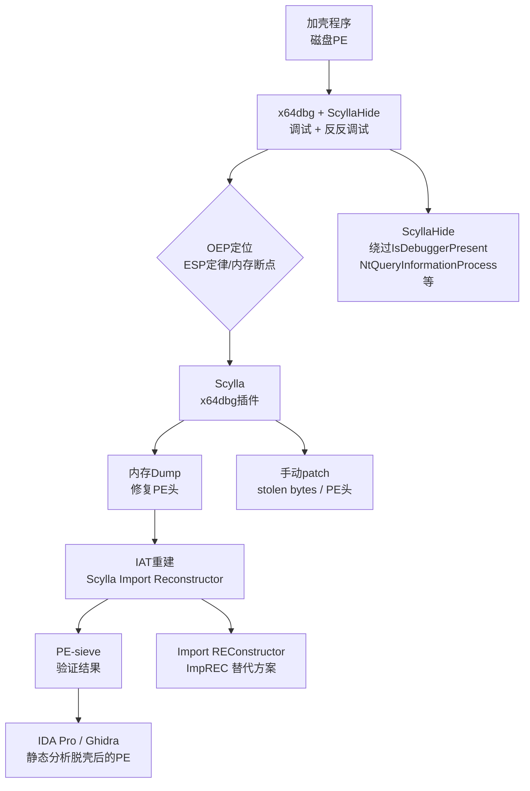

---
tags:
  - WASM
  - 虚拟化壳
  - tier3
  - 脱壳
  - OEP
---
# 脱壳实战：OEP、Dump 与 IAT 重建

> [!abstract] TL;DR
> 脱壳是将受保护二进制还原为可分析原始代码的核心技能，分为三个紧密连接的阶段：**定位 OEP**（Original Entry Point，原始入口点）、**内存 Dump**（从进程虚拟地址空间转储还原后的代码）、**IAT 重建**（Import Address Table，修复导入表使程序可独立运行）。本篇系统拆解每个阶段的原理、算法与工具链，覆盖 ESP 定律、内存断点法、stolen bytes 还原、Scylla IAT 扫描算法、Anti-dump 对抗等完整技术栈，并提供手动脱壳完整示例流程。

## 概述与定位

### 壳的本质与脱壳的目标

加壳软件在运行时呈现双重身份：磁盘上的 PE 文件是被压缩或加密过的密文，内存中的进程在壳代码自解压/自解密完成后才会展现出原始的可执行代码段。脱壳的本质是在这两个状态的边界点——即原始程序即将获得控制权的瞬间——拍一张内存快照，再将快照重新打包为可分析的 PE 文件。

整个过程被拆分为四个线性阶段：

```
磁盘PE(加壳) → [壳自解压/解密] → 内存(原始代码已展开)
                                         ↓
                               找到OEP（原始入口点）
                                         ↓
                               Dump内存 → 修复PE头
                                         ↓
                               重建IAT（修复导入表）
                                         ↓
                               重定位修复（可选）→ 可运行/可分析的PE
```

### 与 VM 壳的区别

第 09~13 章讨论的虚拟化壳（VMProtect、Themida）将原始指令翻译为自定义字节码，其"脱壳"等价于"还原 Handler 语义"，是反虚拟化问题而非经典脱壳问题。本篇聚焦**传统加密/压缩壳**（UPX、ASPack、Enigma、PECompact、Obsidium 等）的脱壳方法。这类壳的核心特征是：壳代码运行结束后，原始 x86/x64 指令完整地出现在内存中——只要找到跳转时机即可捕获。

### 知识体系定位

本篇承接第 15 篇（Enigma/Obsidium/Armadillo 传统壳分析），为其提供通用脱壳技术支撑；同时为第 17 篇（OLLVM 混淆对抗）打基础——OLLVM 混淆的二进制往往也需要先过壳才能分析。

---

## 原理与机制

### PE 文件加壳后的内存布局

Windows 加载器根据壳 PE 的节表将文件映射到进程虚拟内存，AddressOfEntryPoint 指向**壳的入口**，而非原始程序的入口。壳在获得控制后执行以下动作：

1. **解压/解密**：将原始代码（可能分布在多个自定义节）还原到分配的内存区域（`VirtualAlloc` 或在原节内原地解密）。
2. **修复原始导入表**：遍历原始 PE 的 IAT，调用 `GetProcAddress` 将每个导入函数的真实地址填回 IAT 槽位。
3. **跳转 OEP**：以 `jmp/push-ret/call` 形式跳转到原始程序入口点，将执行权交还。

逆向分析者的目标：**在第 3 步即将发生之前介入**。

### OEP 的识别特征

OEP 通常位于以下位置之一：

- 原始 `.text` 节（内存权限 `PAGE_EXECUTE_READ`，地址在壳解压后才被写入）
- 与壳代码所在节不同的另一节（节名、对齐、特征码都不同）
- 对于 MSVC 编译的程序：OEP 处常见 `push ebp; mov ebp, esp` 或 64 位的 `sub rsp, 0x28`
- 对于 Delphi/BCB：OEP 处常见 `push ebp; mov ebp, esp; add esp, ...` 紧接大段字符串引用
- 壳跳转指令本身：`jmp 0x401000`（32 位）或长跳，目标地址落在原始代码区

### IAT 的加壳损坏原理

壳会在磁盘文件阶段**清空或替换 IAT**：
- **清空式**：将 IAT 数组填零，运行时由壳自行调用 `LoadLibrary`/`GetProcAddress` 并填入真实地址。
- **替换式**：将 IAT 中所有指针替换为壳自己的 thunk 地址（如 `jmp [壳跳转表]`），实现 IAT 加密或访问控制。
- **加密式**：IAT 值以 XOR/ROL 等形式加密存储，壳在调用前解密。

脱壳后 IAT 在内存中通常已经包含正确的函数地址（因为壳已经完成修复工作），问题在于磁盘 dump 的 PE 文件的 Import Directory 可能已被清除，需要重新构建。

### 重定位表与地址无关代码

如果原始程序有重定位表（`.reloc` 节），壳可能已经按当前 ImageBase 完成重定位。脱壳后如果 dump 时 ImageBase 与磁盘 PE 期望的 ImageBase 不同，重定位将错位。解决方案：

- 以实际加载 ImageBase 为准，dump 后在 PE Optional Header 中将 `ImageBase` 字段改为实际值。
- 或重建完整的重定位表（复杂，通常不必要）。

---

## 结构/算法/伪代码详解

### OEP 定位方法体系

#### 方法一：ESP 定律（最常用）

ESP 定律基于以下观察：绝大多数壳入口处第一条指令是 `pushad`（保存所有通用寄存器，等价于依次 push 8 个寄存器），在壳完成解压后执行 `popad` 恢复寄存器状态，然后跳转 OEP。

```
壳入口:
    pushad              ; ESP 减少 32 字节（32位），此时 ESP 指向保存的寄存器块
    ...壳解压代码...
    popad               ; 恢复寄存器
    jmp OEP             ; ← 目标
```

操作步骤：

1. 在 x64dbg 中运行到壳入口（通常是 `System breakpoint` 后单步几次到 `pushad`）
2. 执行 `pushad` 后，**在当前 ESP 地址设置硬件写入断点**（Hardware Breakpoint on Write，大小 4 字节）
3. 继续运行（F9），程序在 `popad` 执行时触发断点（因为 `popad` 写入了 ESP 指向的内存）
4. 单步几次即到 `jmp OEP`，目标地址即为 OEP

ESP 定律适用前提：壳使用 `pushad/popad` 模式，且中间无额外 `pushad`。对于复杂壳（多层解压、TLS 回调）需要配合其他方法。

#### 方法二：内存访问断点（在目标节设置）

适用于壳解压后执行 OEP 处代码时触发断点：

1. 分析 PE 节表，确定原始代码期望在哪个节（通常是第一节 `.text`）
2. 在该节起始地址设置**内存访问执行断点**（Memory Breakpoint on Execution）
3. 壳解压完成后 CPU 执行到该区域时断下，当前 EIP 即为 OEP（或非常接近）

x64dbg 操作：右键内存映射中目标节 → Set Memory Execute Breakpoint

#### 方法三：单步跟踪法（Step-over 追踪）

适用于简单壳或调试复杂壳的最后阶段：

1. 运行到壳代码区域（高地址，如 `0x7xxxxxxx`）
2. 持续 Step-over（F8），观察 EIP 是否突然跳到低地址（原始代码区，如 `0x00401xxx`）
3. EIP 跳到低地址的瞬间即为 OEP

缺点：对于解压代码很长的壳（循环解压数千次）效率极低。

#### 方法四：异常法（SFX 壳/SEH 壳）

部分壳利用异常机制转跳：

1. 在 x64dbg 中关闭"自动处理异常"选项（Options → Exceptions → 勾选"pass exceptions to program"）
2. 运行程序，壳触发访问违例（如读取解密前内存），SEH 处理后跳到 OEP 附近
3. 观察 SEH 链（`!exchain` 或 x64dbg 的 SEH 视图）找到真实处理程序

#### 方法五：区段特征匹配

利用编译器生成的 OEP 特征码：

```python
# MSVC x86 OEP 特征
OEP_PATTERNS = [
    b'\x55\x8B\xEC',           # push ebp; mov ebp, esp
    b'\x55\x8B\xEC\x83\xEC',   # push ebp; mov ebp, esp; sub esp, N
    b'\x6A\x00\x68',           # push 0; push offset (WinMain stub)
]

# MSVC x64 OEP 特征
OEP_PATTERNS_64 = [
    b'\x40\x55\x53\x56',       # push rbp; push rbx; push rsi
    b'\x48\x83\xEC',           # sub rsp, N
]
```

在内存解压后扫描原始节区，匹配特征字节序列定位 OEP。

#### 方法六：TLS 回调检测

若程序有 TLS（Thread Local Storage）回调，TLS 回调在 OEP 之前执行。壳可能在 TLS 回调中加入反调试或触发解压。处理方法：

1. 在 x64dbg 中勾选"在 TLS 回调处停下"（Options → Events → TLS Callbacks）
2. 逐个分析 TLS 回调，判断是壳代码还是原始程序代码

### 内存 Dump 算法

Dump 的核心是将进程虚拟内存中已解压的 PE 内容提取为文件。以下是 Scylla（x64dbg 插件）的 Dump 流程伪代码：

```python
def dump_process(pid: int, oep_rva: int, output_path: str):
    # 1. 打开进程句柄（PROCESS_ALL_ACCESS）
    hProcess = OpenProcess(PROCESS_ALL_ACCESS, False, pid)
    
    # 2. 读取 PE 头（从 ImageBase 处）
    image_base = get_image_base(hProcess)  # 从 PEB.Ldr 读取
    dos_header = read_memory(hProcess, image_base, 0x40)
    pe_header_offset = struct.unpack('<I', dos_header[0x3c:0x40])[0]
    pe_header = read_memory(hProcess, image_base + pe_header_offset, 0x200)
    
    # 3. 解析节表，确定每个节的虚拟地址和大小
    sections = parse_sections(pe_header)
    
    # 4. 修正 OptionalHeader.AddressOfEntryPoint 为 OEP RVA
    pe_header = patch_oep(pe_header, oep_rva)
    
    # 5. 逐节读取内存内容
    with open(output_path, 'wb') as f:
        f.write(build_pe_header(dos_header, pe_header, sections))
        for section in sections:
            raw_data = read_memory(hProcess, image_base + section.va, section.raw_size)
            f.write(raw_data)
    
    CloseHandle(hProcess)
```

关键细节：

- **SizeOfImage 伪造对抗**：部分壳修改 `SizeOfImage` 为错误值，阻止 Scylla 计算总大小。解决：手动查看 VirtualQuery 的实际提交内存范围。
- **PE 头擦除（Anti-Dump）**：部分壳在解压后将 ImageBase 处的 DOS/PE 头清零，阻止读取节表。解决：从 PEB 中的模块列表获取节信息，或从进程的内存映射中推断。
- **PointerToRawData 修正**：Dump 后文件中节的 `PointerToRawData` 应与文件实际偏移一致（通常设为 `VirtualAddress` 对齐到 0x200 的值，因为 Dump 时节内容连续写入）。

### IAT 重建算法（Scylla 核心逻辑）

IAT 重建的目标是将内存中已解析的函数地址映射回 `DLL名称!函数名称` 的形式，并重建 Import Directory：

```python
def rebuild_iat(dump_path: str, pid: int):
    hProcess = OpenProcess(PROCESS_ALL_ACCESS, False, pid)
    
    # 1. 扫描 IAT 候选区域
    #    策略：在 dump 后的 PE 数据段中，找到连续的指针数组
    #    每个指针指向一个已加载 DLL 的函数（落在某 DLL 的内存范围内）
    iat_candidates = []
    for addr in scan_pointer_arrays(hProcess, image_base):
        target = read_ptr(hProcess, addr)
        if is_in_loaded_module(hProcess, target):
            dll_name, func_name, ordinal = resolve_ptr_to_export(hProcess, target)
            iat_candidates.append(IATEntry(addr, target, dll_name, func_name, ordinal))
    
    # 2. 聚类：将候选 IAT 入口按 DLL 分组，形成 Import Descriptor
    import_descriptors = cluster_by_dll(iat_candidates)
    
    # 3. 构建新的 Import Directory
    import_dir_data = build_import_directory(import_descriptors)
    
    # 4. 将 Import Directory 写入 dump 文件（通常追加到末尾或写入空白节）
    patch_dump_file(dump_path, import_dir_data)
    
    # 5. 更新 OptionalHeader.DataDirectory[IMAGE_DIRECTORY_ENTRY_IMPORT]
    update_data_directory(dump_path, IMPORT_DIR, new_rva, new_size)
```

`resolve_ptr_to_export` 的实现依赖遍历每个已加载 DLL 的 Export Directory：

```python
def resolve_ptr_to_export(hProcess, func_ptr: int):
    # 找到 func_ptr 落在哪个 DLL 的内存范围
    module = find_module_by_address(hProcess, func_ptr)
    if not module:
        return None
    
    # 读取该 DLL 的 Export Directory
    export_dir = read_export_directory(hProcess, module.base)
    
    # 遍历 AddressOfFunctions 数组，找到与 func_ptr 偏移匹配的项
    for i, export_rva in enumerate(export_dir.functions):
        if module.base + export_rva == func_ptr:
            # 在 AddressOfNameOrdinals 中找对应名称
            ordinal = export_dir.name_ordinals[i]
            name = export_dir.names[ordinal] if ordinal < len(export_dir.names) else None
            return module.name, name, export_dir.base_ordinal + i
    
    return None  # 无法解析（可能是转发导出或加密 thunk）
```

### Stolen Bytes（偷取字节）还原

高级壳会将 OEP 处的前几条指令（通常 5~20 字节）**移到壳代码内部执行**，然后跳转回 OEP+N（N 是被偷取的字节数）。Dump 后的 OEP 处开头是 `nop` 或乱码：

```
内存布局（偷取字节后）：
OEP:    90 90 90 90 90   ; 原始前5字节被清零/NOP填充
OEP+5:  <原始第6字节开始>

壳代码（某处）：
    push ebp             ; 被偷取的原始指令（第1字节）
    mov ebp, esp         ; 第2字节
    sub esp, 0x50        ; 第3-5字节
    jmp OEP+5            ; 跳回OEP后的代码
```

还原步骤：

1. 在单步跟踪到 OEP 之前，记录壳代码内执行的最后几条"看起来不像壳代码"的指令
2. 确认这些指令是原始程序开头（通过函数 prologue 特征）
3. 将这些字节 patch 回 Dump 文件的 OEP 处

自动化工具（如 Scylla 的 "Rebuild PE" 功能）通常无法自动处理 stolen bytes，需要手动操作。

### Anti-Dump 技术与对抗

#### 技术一：PE 头清除

壳在完成解压后，用 `memset` 将 ImageBase 处的 4096 字节（完整 PE 头）清零：

```c
// 壳代码片段（伪代码）
VirtualProtect(image_base, 0x1000, PAGE_READWRITE, &old_protect);
memset((void*)image_base, 0, 0x1000);
VirtualProtect(image_base, 0x1000, PAGE_READONLY, &old_protect);
```

对抗：Dump 前先手动修复 PE 头，或使用 `pe-sieve` 的 `--imp_rec` 选项（pe-sieve 会从 PEB 模块信息重建节表）。

#### 技术二：SizeOfImage 伪造

将 `OptionalHeader.SizeOfImage` 设为极大值（如 `0xFFFFFFFF`），Scylla 读取时计算 dump 大小失败：

对抗：在 Dump 之前手动 patch SizeOfImage（在 x64dbg 的内存视图中直接修改 PE 头字段）。

#### 技术三：双进程守护（Armadillo 典型技术）

父进程监控子进程，检测到内存被读取时立即向子进程注入代码使其崩溃：

```
父进程（守护） ←→ 子进程（实际运行）
     ↑                    ↑
  监控调试器          实际解压执行
  检测ReadProcessMemory   OEP在这里
```

对抗：
1. 使用内核级调试器（WinDbg + KD）绕过用户态监控
2. 或先附加父进程，用条件断点中断其 `ReadProcessMemory` 调用
3. 或使用 `CreateProcess` 以 `DEBUG_ONLY_THIS_PROCESS` 标志启动，防止父进程建立调试连接

#### 技术四：TLS 反调试陷阱

在 TLS 回调中加入检测代码，若检测到调试器则提前跳到错误 OEP（蜜罐）：

```c
VOID NTAPI TLS_Callback(PVOID DllHandle, DWORD Reason, PVOID Reserved) {
    if (Reason == DLL_PROCESS_ATTACH) {
        if (IsDebuggerPresent()) {
            // 将真实OEP修改为错误地址
            g_fake_oep = 0xDEADBEEF;
        }
    }
}
```

对抗：在 x64dbg 中选项勾选"在 TLS 回调停下"，逐个检查每个回调的逻辑。

---

## 工具视角与实战

### 工具链总览



### x64dbg 实战操作详解

#### 配置 ScyllaHide

ScyllaHide 是 x64dbg 的反反调试插件，加载后在 Plugins → ScyllaHide → Options 中启用：

- `PEB`: 清除 `PEB.NtGlobalFlag`、`PEB.BeingDebugged`
- `NtQueryInformationProcess`: Hook 使调试端口查询返回 0
- `NtSetInformationThread`: 防止 `ThreadHideFromDebugger`
- `RDTSC`: 使时间戳查询返回固定值（防时序检测）
- `Heap Flags`: 清除调试堆标志

#### 完整脱壳流程示例（以 UPX 变种为例）

UPX 是最经典的压缩壳，但变种 UPX（修改了 magic 字节）不能直接用 `upx -d` 脱壳，需手动处理：

**第一步：识别壳**

```
工具：PE-bear 或 DIE（Detect-It-Easy）
特征：节名为 UPX0/UPX1（或被重命名），UPX0节 VirtualSize >> RawSize，UPX1节 VirtualSize << RawSize
```

**第二步：到达 pushad**

用 x64dbg 加载程序，按 F9 运行到系统断点后，按 F8 单步几次，到达程序 OEP（此时在壳代码，高地址区），找到第一条 `pushad` 指令。

**第三步：设置 ESP 硬件断点**

```
执行 pushad（F8）
此时 ESP 寄存器窗口显示新的栈顶地址，如 0x0019FF98
右键该地址 → 硬件访问断点 → 写入 → 双字（4字节）
```

**第四步：运行到 popad**

按 F9，程序断在 `popad` 处（因为 popad 写入了 [ESP] 等内存，触发硬件断点）。

**第五步：单步到 OEP**

按 F8 执行完 `popad`，观察下一条指令。通常是：

```asm
popad
jmp 0x00401000    ; ← 这就是 OEP 的跳转
```

按 F8 执行 jmp，EIP 跳到 `0x00401000`（OEP）。验证：OEP 处应该是正常的函数 prologue。

**第六步：使用 Scylla Dump**

1. Plugins → Scylla → Dump
2. IAT Autosearch（自动搜索 IAT 起始地址和大小）
3. Get Imports（解析所有导入函数）
4. 检查结果，修复无法解析的项（右键 → Refresh Selected / Trace）
5. Dump（选择保存路径）
6. Fix Dump（将重建的 IAT 写入 dump 文件）

**第七步：验证**

使用 `pe-sieve --pid <PID>` 或直接在 IDA Pro 中打开 dump 文件，检查：

- Import Directory 是否存在且合理
- 函数名是否正确解析
- 运行 dump 文件是否能正常执行（对于无反调试的简单程序）

### Scylla IAT 重建的边界情况

**情况一：IAT 中存在转发导出（Forwarder）**

某些 API 实际上是转发：如 `ntdll!RtlAllocateHeap` 被 `kernel32!HeapAlloc` 转发。Scylla 会正确处理，将其解析为实际的目标函数。

**情况二：IAT 加密（IAT Encryption）**

Obsidium 等壳不直接将真实地址填入 IAT，而是将每个函数调用替换为 `call [thunk]`，thunk 处有壳自己的跳转表（加密或混淆）。此时 Scylla 扫描 IAT 时找到的是壳的 thunk 地址而非 DLL 函数地址。

解决方案：追踪 thunk 调用链，确认最终目标（`jmp [真实地址]` 或 `push 真实地址; ret`），手动在 Scylla 的 IAT 列表中编辑。

**情况三：动态导入（Runtime Import）**

程序通过 `GetProcAddress` 动态获取 API，这些调用不在 IAT 中，无法被 Scylla 自动重建。分析时：
- 在 `GetProcAddress` 设断点，记录调用序列
- 或使用 APIMonitor 记录完整 API 调用日志

### pe-sieve：进程内存扫描与自动 Dump

`pe-sieve` 是命令行工具，专注于扫描进程内存中的可疑 PE 模块（已被 hook、修改或注入的模块）：

```bat
# 扫描 PID 1234 的所有模块，重建 IAT
pe-sieve.exe --pid 1234 --imp_rec 3 --out dump_dir

# 参数说明：
# --imp_rec 3  : 最激进的 IAT 重建模式（mode 3：trace + resolve）
# --out        : 输出目录（每个模块一个 dump 文件）
```

pe-sieve 的特点：无需手动找 OEP，直接扫描内存中所有 PE 模块，适合分析注入型恶意软件（Hollow Process Injection、PE Injection）。

### Import REConstructor（ImpREC）

ImpREC 是 32 位时代的经典 IAT 重建工具，仍在分析旧壳时有用：

1. 选择目标进程
2. 输入 OEP（RVA 格式）
3. IAT Autosearch → Get Imports
4. 修复无效条目（Fix Dump）

ImpREC 相比 Scylla 的局限：不支持 64 位进程，部分现代壳的 IAT 扫描失败率较高。

### Universal Unpacker 与脱壳脚本

部分常见壳有专用脱壳脚本（OllyDBG/x64dbg Script 格式）：

```
// x64dbg 脚本示例：自动 ESP 定律脱壳
var pushad_addr
findop eip, #60#      // 搜索 pushad（0x60）
msg "Found pushad at: {pushad_addr}"
bphws esp, "w"        // ESP 硬件写断点
run
bphwc esp             // 触发后清除断点
sto                   // Step over（执行完 popad）
sto                   // 再 Step over（到 jmp OEP）
sto                   // 进入 OEP
msg "Arrived at OEP: {cip}"
```

---

## 安全性与正确使用

> [!caution] 法律与伦理边界
> 脱壳技术具有强烈的双重用途属性。本篇所有技术内容**仅适用于以下合法场景**：
>
> - **自有软件分析**：分析你自己编写或合法拥有的程序（如分析自己部署的壳保护效果）
> - **恶意软件分析与应急响应**：在隔离的沙箱环境中分析勒索软件、木马等恶意样本，提取 IoC 并编写检测规则
> - **授权的渗透测试与安全研究**：持有书面授权的合同下分析第三方系统
> - **CTF 竞赛**：在比赛框架下分析组织方提供的样本
> - **学术研究**：发表在同行评审期刊/会议的安全研究
>
> **明确禁止的行为**：
> - 脱壳商业软件以绕过授权验证（License Key / 激活码机制）——这违反《计算机软件保护条例》（中国）、DMCA（美国）及 EULA 合同约定
> - 将脱壳后的代码再分发或销售
> - 分析他人系统而无书面授权
>
> 研究者在进行恶意软件分析时应在**物理隔离或严格管控的虚拟化环境**中操作，防止样本在分析过程中逃逸或建立 C2 连接。

### 检测与防御视角

了解脱壳技术同样有助于加强保护：

- **Anti-Dump 加强**：壳在解压后清除 PE 头，并定期校验（哈希）PE 头区域，若被恢复则立即退出
- **IAT 加密**：将所有 IAT 调用替换为间接 thunk，thunk 使用运行时解密的跳转地址，提高 Scylla 的解析失败率
- **Stolen Bytes 扩展**：从 OEP 处偷取尽可能多的字节（30~50 字节），并分散到壳代码多处执行，还原难度倍增
- **时序校验**：周期性检查关键函数执行时间，若超阈值（调试器单步造成的时间膨胀）则自销毁
- **虚拟机检测**：检查 CPUID、VMware BIOS 字符串、沙箱特征文件，在虚拟化环境中拒绝运行（阻碍自动化脱壳沙箱）

---

## 小结

脱壳是逆向工程中最核心的基础技能之一，其三段式流程（OEP → Dump → IAT）本质上是在与壳的状态机博弈：

1. **OEP 定位**是时机问题——在原始代码获得控制权的精确瞬间介入。ESP 定律利用 `pushad/popad` 的栈不变式；内存断点利用代码从不可执行变为可执行的状态转换；单步追踪是蛮力穷举。三者互补，高级壳需要组合使用。

2. **内存 Dump** 是状态快照问题——将进程虚拟内存中已展开的 PE 重新序列化为文件。关键在于 PE 头的重建（被壳擦除时需手动补全）和节偏移的修正。

3. **IAT 重建**是符号解析问题——将内存中的函数地址（数字）还原为 DLL+函数名的语义表示，并重建 Import Directory 数据结构。Scylla 的自动化扫描覆盖了大多数情况；加密 IAT 需要追踪 thunk 调用链手动处理。

对于 stolen bytes 和 Anti-Dump 的高级对抗，需要结合调试经验和对特定壳特征的先验知识。理解这些技术的防御者能够设计出更难被静态分析的保护机制；理解这些技术的分析者能够在恶意软件分析和漏洞研究中快速还原保护层，专注于核心逻辑。

---

## 相关阅读

- **第 09 章**：《虚拟化保护壳总览》——VM 壳与传统壳的架构差异，理解为什么 VM 壳不能直接用本篇方法脱壳
- **第 12 章**：《VMProtect 逆向实战》——VM 壳的"脱壳"（反虚拟化）与本篇的对比
- **第 15 章**：《传统加壳：Enigma、Obsidium、Armadillo》——本篇技术的应用对象详解
- **第 17 章**：《代码混淆对抗：OLLVM 与 Tigress》——脱壳后仍可能面临的第二层混淆

**推荐外部资源**：

- `x64dbg` 官方文档：ScyllaHide 与调试器脚本 API
- `Scylla` GitHub：PE Dump 与 IAT 重建工具源码
- `pe-sieve` GitHub：进程内存扫描与模块 Dump 工具
- OpenRCE 文章（Ilfak Guilfanov）：PE 格式结构与手动修复方法
- "The Art of Unpacking"（Mark Vincent Yason，IBM X-Force）：OEP 定位方法系统综述

---

[[00.WASM与虚拟化壳逆向总览|⬆ 系列总览]] | [[15.传统加壳Enigma与Obsidium与Armadillo|← 上一章]] | [[17.代码混淆对抗OLLVM与Tigress|→ 下一章]]
