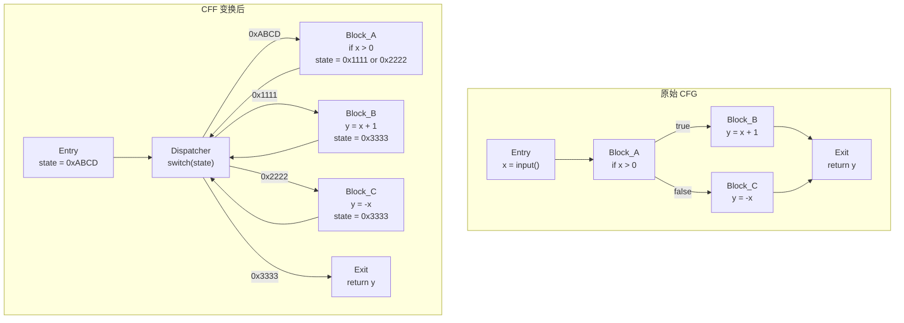

---
tags:
  - WASM
  - 虚拟化壳
  - tier3
  - 混淆
  - OLLVM
---
# 代码混淆对抗：OLLVM 与 Tigress

> [!abstract] TL;DR
> 代码混淆是与 VM 壳并列的另一大 native 层保护技术体系。VM 壳将原始指令替换为自定义字节码并以解释器执行，而 OLLVM/Tigress 等混淆器则保持 native 指令形态不变，转而从控制流结构、数据编码、指令语义三个维度对代码施加干扰，使静态分析工具无法直接还原程序逻辑。本章系统剖析 OLLVM 的三大 Pass（控制流平坦化、虚假控制流、指令替换）及 Tigress 的多种变换，并给出基于符号执行、污点分析和专用 IDA 插件的反混淆方法论。

## 概述与定位

### 混淆与 VM 壳：两种截然不同的保护思路

在 native 代码保护领域，存在两条主要技术路线，二者目标相同（阻碍逆向分析），但实现路径根本不同：

**VM 壳（Virtualization Protector）**：以第 09 章所述的 VMProtect、Themida 为代表。其核心思路是"替换"——将原始 x86/x64 指令提取出来，翻译成私有字节码格式，运行时由内嵌的软件解释器（Dispatcher + Handler 架构）模拟执行。逆向分析者必须首先定位 Dispatcher，然后逐一恢复每个 Handler 的语义，最终才能理解被保护函数的行为。分析难点在于"虚拟机架构的认知"。

**代码混淆（Code Obfuscation）**：以 OLLVM、Tigress 为代表。其核心思路是"变形"——保留 native 指令集不变，但通过控制流重组、假分支插入、指令等价替换等手段，让代码在逻辑上等价于原始程序，但在结构上面目全非，使静态反汇编与 F5 伪代码分析极度困难。逆向分析者面对的是真实的 x86/x64 汇编，只是这些汇编代码的控制流图（CFG）已被深度变形。分析难点在于"从变形的 CFG 中还原真实逻辑"。

两者可以叠加：先用 OLLVM 混淆，再套 VM 壳，是高强度保护的常见组合。理解这两条路线各自的工作原理与反制方法，是逆向工程师的必备技能。

### OLLVM 的历史与现状

OLLVM（Obfuscator-LLVM）由瑞士西北应用科技大学（HEIG-VD）安全实验室于 2013 年发布，基于 LLVM 编译器框架实现，以 LLVM Pass 的形式工作——即在编译时，于 IR（中间表示）层面对代码施加混淆变换，最终生成的 native 二进制已经携带混淆后的逻辑。

OLLVM 的关键优势在于语言无关性：只要目标语言能编译到 LLVM IR（C、C++、Rust、Swift 等），就可以应用 OLLVM 混淆。这使其在 Android Native（.so 文件）、iOS（Mach-O）和 macOS 软件保护领域得到了极为广泛的应用。

原版 OLLVM 项目已停止维护（最后支持到 LLVM 4.0），但社区存在大量适配新版本 LLVM 的 fork，如 HikariObfuscator（支持 LLVM 12+）、goron（支持 LLVM 10+）、ollvm-17+（社区适配）等，其核心 Pass 逻辑基本延续原版设计。

### Tigress 的定位差异

Tigress 是由美国亚利桑那大学开发的 C 到 C 的源码级混淆工具（source-to-source obfuscator）。与 OLLVM 在 IR 层面工作不同，Tigress 在 C 源代码层面进行变换，输出同样是 C 代码，可再经任意编译器编译。Tigress 提供的变换种类远多于 OLLVM，包括虚拟化（virtualization）、JIT 编译（jitting）、编码（encoding）、平坦化（flatten）等，并支持将多种变换组合应用。Tigress 是学术界混淆研究的重要平台，也在一些商业工具中有技术借鉴。

---

## 原理与机制

### OLLVM Pass 一：控制流平坦化（Control Flow Flattening，CFF）

控制流平坦化是 OLLVM 最具标志性、影响最广的 Pass，也是实战中遭遇频率最高的混淆手段。

**原始控制流结构**

一个正常函数的控制流图（CFG）通常呈树形或有向无环图结构：基本块（Basic Block）按自然顺序排列，`if/else` 形成分支，`for/while` 形成回边，函数的执行路径清晰可见。

**平坦化变换原理**

CFF 将函数的所有基本块"提取"出来，置于一个大型 `switch` 语句内，由一个中央 `Dispatcher` 统一调度。原始函数中块与块之间的直接跳转关系被打断，改由一个**状态变量（state variable）**编码"当前应跳转到哪个块"，每次执行完一个块后，更新状态变量，然后跳回 Dispatcher，由 Dispatcher 根据状态变量值选择下一个块执行。

变换前后的控制流结构对比：

```
原始 CFG（示意）：
  入口块 → 块A → 块B → 块C → 出口块
                  ↘ 块D ↗

CFF 后：
  入口块 → PreDispatcher
                ↓
           Dispatcher（switch state）
          ↙    ↓    ↓    ↘
       块A   块B   块C   块D
       ↓     ↓    ↓     ↓
      （各自更新 state，跳回 PreDispatcher）
```

**关键识别特征**

在反汇编中识别 CFF 的特征：

1. 函数内存在一个大型 `switch` 分支，case 数量等于（或接近）原始基本块数量。
2. 存在一个明显的**状态变量**，通常是一个局部变量（或寄存器 + 内存位置），其值在每个 case 块末尾被更新，然后函数跳转回 switch 入口。
3. CFG 呈"花朵"形或"轮辐"形：所有块都从同一个 Dispatcher 出发，执行完后又都汇回 Dispatcher，而非自然的线性 / 树形布局。
4. 大量无条件跳转（`jmp`）指向同一目标（即 Dispatcher 入口）。
5. IDA 生成的伪代码中出现形如 `while(1) { switch(state) { case 0x1234: ...; state = 0x5678; break; ... } }` 的结构。

**状态变量可能的混淆变体**

简单的 CFF 直接用整数作状态变量；高级版本还会对状态值进行运算变换（如 `state = next_state ^ 0xDEADBEEF`），或使用**混合布尔算术（MBA）**表达式（详见第 18 章）来混淆状态值的计算，使得仅凭静态分析难以追踪控制流。

### OLLVM Pass 二：虚假控制流（Bogus Control Flow，BCF）

**原理**

BCF 在函数中插入"永远不会被执行"的假分支。具体操作是在真实代码块前插入一个条件跳转，条件基于**不透明谓词（opaque predicate）**——这是一个对编译器而言"看起来是运行时条件"、但实际上在任意输入下结果恒定的布尔表达式。不透明谓词的典型例子：

```c
// 恒真：对所有整数 x，x*(x+1) 必然是偶数
if ((x * (x + 1)) % 2 == 0) {  // 真分支：执行真实代码
    real_code();
} else {                          // 假分支：永远不执行，填充垃圾代码
    bogus_code();
}
```

由于编译器无法在不知道 `x` 具体值的情况下判断该条件恒真（尤其当谓词更复杂时），所以这个分支在编译时不会被优化消除，在反汇编时看起来像合法分支。

**识别特征**

1. 假分支块通常包含无意义的计算（随机算术、对未使用变量的操作）或对已知全局变量的读写（但结果不被使用）。
2. 假分支块常以无条件跳转回真分支入口结束（形成伪循环），或跳转到函数中某个不相关位置。
3. 基于不透明谓词的条件跳转，其条件表达式往往含有特征性的数学运算（乘法、模运算、位运算的组合），且操作的变量与该基本块的真实逻辑无关。
4. 使用 Hex-Rays 反编译时，假分支中的代码会产生逻辑上明显无意义的 `if` 块，有经验的逆向工程师能通过代码语义快速识别。

**BCF 的反制**

由于不透明谓词在运行时结果恒定，动态分析方法天然有效：对目标函数进行全路径 trace（如使用 Intel PIN、DynamoRIO 或 Frida），记录所有被实际执行的基本块，未被执行的块即为死码（假分支）。结合符号执行也可判定：对分支条件求解，若 SMT Solver 证明条件恒真或恒假，则对应分支为假分支。

### OLLVM Pass 三：指令替换（Instruction Substitution，SUB）

**原理**

指令替换将常见的算术/逻辑运算替换为语义等价但形式复杂的指令序列。OLLVM 提供了针对以下运算的替换规则（共约 14 条默认规则）：

| 原始指令 | 等价替换示例 |
|---------|-------------|
| `a = b + c` | `a = b - (~c) - 1`（利用补码恒等式） |
| `a = b - c` | `a = b + (~c) + 1` |
| `a = a & b` | `a = (a ^ b) ^ (a \| b)` 的变体 |
| `a = a \| b` | `a = (a & ~b) + b` |
| `a = a ^ b` | `a = (~a & b) \| (a & ~b)` |

这些替换基于布尔代数恒等式，语义完全等价，但对阅读汇编的人而言，会显著增加理解复杂度。SUB 通常与 CFF 叠加使用——CFF 破坏控制流结构，SUB 破坏单个块内部的逻辑可读性。

**SUB 的影响评估**

SUB 单独使用时，反混淆相对容易：逐条分析指令序列，找到等价的简单形式即可。然而，若与**混合布尔算术（MBA）**结合（即使用更复杂的多项式表达式进行等价替换），复杂度会指数级上升。MBA 混淆本质上是 SUB 的高阶版本，是当前业界和学术界的热点研究方向（详见第 18 章）。

### 字符串加密（String Encryption）

OLLVM 及其 fork 版本（如 HikariObfuscator）常附带字符串加密功能：将函数中的字符串字面量替换为运行时解密的密文，解密逻辑内联在函数入口处。

**识别方式**：函数入口处出现一段对栈上数组逐字节异或或加减运算的代码，之后才是函数的实际逻辑。解密后的字符串通常存储在栈上（而非 `.rodata` 段），通过动态分析可以在解密函数返回后提取明文。

**工具化方案**：使用 Frida hook `malloc` 及字符串相关函数，配合内存扫描，可自动化提取运行时解密后的字符串。

---

## 结构/算法/伪代码详解

### CFF 去除算法：符号执行驱动的 CFG 还原

去除控制流平坦化的核心问题是：在不运行程序的情况下，确定哪些 case 块是 Dispatcher 基础设施（不携带原始逻辑），哪些 case 块是真实块（携带原始逻辑）。

**算法步骤**

**步骤 1：识别 Dispatcher 和 PreDispatcher**

扫描 CFG，找到满足如下条件的节点：
- 入度（predecessor 数量）远大于出度，且其所有 predecessor 基本上都是其 successor（即形成"辐轮"结构）。
- 或者：某节点 N 满足，函数内大多数基本块都以无条件跳转到 N 结尾。

该节点即为 Dispatcher（或 PreDispatcher）。

**步骤 2：识别状态变量**

分析 Dispatcher 节点的 switch 条件操作数（通常是一个局部变量的 load 指令），该变量即为状态变量。

**步骤 3：静态分析各 case 块的状态更新**

遍历所有 case 块，找到每个块末尾对状态变量的 store 指令，提取其写入值。若该值是常量（无条件跳转到确定的 case），则该块与其后继块之间的跳转是确定的；若该值依赖条件（if-else 分支），则还原为条件跳转。

**步骤 4：重建真实 CFG**

根据步骤 3 提取的跳转关系，在真实块之间重建 CFG 边，移除 Dispatcher 节点及 PreDispatcher 节点，得到去平坦化后的 CFG。

**步骤 5：Patch 函数**

使用 NOP 或直接跳转指令，将原始 case 块末尾的"更新 state + 跳回 Dispatcher"序列替换为直接跳转到后继块的指令（或条件跳转）。

**伪代码实现（Python + ida_hexrays）**

```python
import idaapi, idc, idautils

def find_dispatcher(func_ea):
    """找到函数中的 Dispatcher 节点（入度最大的基本块）"""
    cfg = idaapi.FlowChart(idaapi.get_func(func_ea))
    max_preds = 0
    dispatcher = None
    for block in cfg:
        pred_count = sum(1 for _ in block.preds())
        if pred_count > max_preds:
            max_preds = pred_count
            dispatcher = block
    return dispatcher

def extract_state_assignments(func_ea, state_var_offset):
    """
    遍历所有基本块，提取状态变量赋值
    state_var_offset: 状态变量在栈帧中的偏移（负值）
    返回 {block_start_ea: next_state_value or (cond_ea, true_state, false_state)}
    """
    result = {}
    cfg = idaapi.FlowChart(idaapi.get_func(func_ea))
    for block in cfg:
        # 在块末尾附近查找 mov [rbp+state_var_offset], imm 指令
        ea = block.end_ea - 1
        while ea >= block.start_ea:
            if idc.get_operand_type(ea, 0) == idc.o_displ:  # 内存操作数
                offset = idc.get_operand_value(ea, 0)
                if offset == state_var_offset:
                    val = idc.get_operand_value(ea, 1)
                    result[block.start_ea] = val
                    break
            ea = idc.prev_head(ea)
    return result

def deflat_function(func_ea):
    """主控流程：识别 Dispatcher，提取状态转移，Patch 函数"""
    dispatcher = find_dispatcher(func_ea)
    print(f"[+] Dispatcher @ 0x{dispatcher.start_ea:x}, preds={sum(1 for _ in dispatcher.preds())}")
    # ... 后续步骤（完整实现见 D-810 / deflat 项目）
```

### D-810 插件与 deflat 脚本

**D-810**（IDA Pro 插件，开源）是目前最完善的 OLLVM 去混淆工具，支持：
- 自动识别 CFF、BCF 并生成去混淆后的伪代码（在 Hex-Rays 级别工作，无需修改二进制）
- 基于模式匹配的不透明谓词识别与消除
- MBA 表达式化简

D-810 的工作层次在 Hex-Rays microcode（微码）层面，而非汇编层面，因此其去混淆结果直接体现在 F5 伪代码输出中，无需手动 patch 二进制。

**deflat**（开源 Python 脚本，基于 angr）的工作流程：
1. 使用 angr 加载目标二进制，构建 CFG。
2. 识别 CFF 结构（Dispatcher + 状态变量）。
3. 使用 angr 符号执行，从每个 case 块出发，求解状态变量的后继值。
4. 使用 keystone 汇编器，将 case 块末尾的状态更新 + 跳回 Dispatcher 序列 patch 为直接 jmp。
5. 输出 patch 后的二进制，可直接用 IDA 重新分析。

### Tigress 变换详解

Tigress 的变换集远比 OLLVM 丰富，以下列出核心变换：

**1. Flatten（平坦化）**：功能与 OLLVM CFF 类似，但 Tigress 的调度结构在 C 语言层面生成，编译后的形态取决于所用编译器的优化策略，有时比 OLLVM 更难识别。

**2. Virtualize（虚拟化）**：将 C 函数转换为虚拟机架构——类似 VMProtect，但在 C 源码层实现。生成的 C 代码包含一个解释器 main loop 和一个字节码数组，编译后即成为一个微型虚拟机。

**3. Jit（JIT 编译）**：将函数逻辑在运行时动态生成为 native 机器码，并执行。反混淆需要在运行时 hook JIT 代码生成点，dump 出生成的 native 代码再分析。

**4. EncodeArithmetic（算术编码）**：类似于 MBA 混淆，对算术运算进行多项式等价替换。

**5. SplitBasicBlocks（基本块分割）**：将单个基本块分割为多个块（插入无条件跳转），增加块数量，配合 CFF 使 Dispatcher 的 switch 更庞大。

**6. AddOpaquePredicates（插入不透明谓词）**：与 BCF 类似，在函数中插入恒真/恒假条件。

**Tigress 变换组合示例**

```bash
tigress --Environment=x86_64:Linux:Gcc:2.6 \
        --Transform=Flatten --Functions=target_func \
        --Transform=EncodeArithmetic --Functions=target_func \
        --Transform=AddOpaquePredicates --Functions=target_func \
        --out=obfuscated.c input.c
```

### 控制流图对比 Mermaid 示例

以下展示一个含 4 个基本块的简单函数（`func_a → func_b → (func_c 或 func_d)`）在 CFF 变换前后的 CFG 对比：



---

## 工具视角与实战

### 静态识别 OLLVM 混淆的工作流

**第一步：整体感知**

在 IDA 中打开目标二进制，观察函数图视图：若某函数 CFG 呈现"轮辐状"（大量块汇向一个中心节点）、且函数体量远大于正常同类函数，高度怀疑 CFF。函数列表中，OLLVM 保护的函数通常体积异常大（数十 KB 至数百 KB 的单函数不罕见）。

**第二步：定位 Dispatcher**

在 IDA 的 Graph Overview 中寻找入度最高的节点；或使用 Ctrl+F5 查看 Hex-Rays 伪代码，寻找 `while(1) { switch(...) { ... } }` 结构。

**第三步：确认状态变量**

在 switch 的条件操作数上右键 → "Rename"，记录为 `state_var`；追踪所有对 `state_var` 的写入点，即各 case 块的出口。

**第四步：使用 D-810 自动去混淆**

安装 D-810 插件后，在目标函数上按 D-810 的快捷键触发去平坦化。D-810 会：
1. 在 microcode 层识别 Dispatcher 结构
2. 消除不透明谓词（BCF）
3. 化简 MBA 表达式（部分）
4. 输出近似原始逻辑的伪代码

D-810 的局限：对状态变量被 MBA 混淆的高级 CFF 效果下降；对 Tigress Virtualize 变换无效（因为 Tigress Virtualize 产生的是真正的虚拟机架构，需要走 VM 壳分析路线）。

**第五步：若 D-810 失效，使用 angr + deflat**

```bash
# 安装依赖
pip install angr keystone-engine

# 运行 deflat（以 Android so 为例）
python3 deflat.py --file libprotected.so --addr 0x12345 \
                  --start 0x12345 --end 0x178AB
```

deflat 的 `--addr` 参数指定目标函数起始地址，`--start`/`--end` 可进一步限制分析范围。对复杂函数，符号执行可能遭遇路径爆炸（path explosion），需要配合 `angr` 的 `veritesting` 或 `DDSE` 策略。

### Android Native（.so）中 OLLVM 分析实战

Android 生态是 OLLVM 最大的应用场景。典型目标：某 APP 的 `libprotect.so` 包含签名校验、licenseCheck、反调试逻辑，编译时使用了 OLLVM 混淆。

**环境准备**

```bash
# 使用 adb pull 提取 so 文件
adb pull /data/app/com.target.app-1/lib/arm64/libprotect.so

# 使用 file 命令确认架构
file libprotect.so  # ELF 64-bit LSB shared object, ARM aarch64
```

**IDA 静态分析入口**

1. 用 IDA Pro（64-bit）打开，等待自动分析完成。
2. 使用 `Edit → Functions → Function Properties` 过滤出 size > 5000 bytes 的函数，这些通常是 CFF 保护的函数。
3. 对可疑函数激活 D-810 插件进行去混淆。

**Frida 动态辅助分析**

```javascript
// frida-trace 记录目标函数的执行轨迹
// 提取 case 块被实际执行的序列（即真实控制流）
Interceptor.attach(Module.findExportByName("libprotect.so", "JNI_OnLoad"), {
    onEnter: function(args) {
        // 注入 trace 逻辑：hook 每个 case 块的第一条指令
        // 实际实现使用 Stalker API
        Stalker.follow(Process.getCurrentThreadId(), {
            events: { call: false, ret: false, exec: true },
            onReceive: function(events) {
                const ranges = Stalker.parse(events);
                ranges.forEach(r => console.log("[trace] 0x" + r.begin.toString(16)));
            }
        });
    }
});
```

Frida Stalker（基于 DynamoRIO）可以记录每条执行的指令地址，通过对比函数内所有基本块地址，找出从未被执行的基本块（即 BCF 插入的假分支和 Dispatcher 基础设施块），从而辅助去混淆。

### 使用 miasm 进行符号化去混淆

miasm 是一个纯 Python 的反编译框架，具备符号执行和 IR 化简能力，特别适合自定义去混淆脚本。

```python
from miasm.analysis.machine import Machine
from miasm.analysis.binary import Container
from miasm.ir.symbexec import SymbolicExecutionEngine

# 加载目标 so（ARM64）
cont = Container.from_stream(open("libprotect.so", "rb"))
machine = Machine("aarch64l")
mdis = machine.dis_engine(cont.bin_stream)

# 对目标函数做控制流图分析
asmcfg = mdis.dis_multiblock(func_start_addr)
lifter = machine.lifter(mdis.loc_db)
ircfg = lifter.new_ircfg_from_asmcfg(asmcfg)

# 符号执行：从函数入口追踪 state 变量的值
sb = SymbolicExecutionEngine(lifter)
for ir_block in ircfg.blocks:
    sb.run_at(ircfg, ir_block.loc_key)
    # 提取 state 变量的符号值
    state_sym = sb.eval_expr(state_var_expr)
    print(f"Block {ir_block.loc_key}: state → {state_sym}")
```

### Tigress 分析实战

Tigress 生成的代码通常先编译为 C 再用 GCC/Clang 编译为 native 二进制。其识别方式与 OLLVM 有所不同：

1. **Tigress Flatten**：CFG 结构与 OLLVM CFF 高度相似，但状态变量命名和更新模式有差异（Tigress 默认使用 `switch_variable` 等更规则的命名，经 C 编译优化后可能被 register 化）。
2. **Tigress Virtualize**：产生内嵌虚拟机，识别方式类似 VMProtect（第 12 章）——寻找字节码数组和解释循环。
3. **Tigress JIT**：运行时有动态代码生成行为（`mmap` + `mprotect` + 将代码写入可执行内存 + `call`），通过 `ptrace` 或 Frida 的 `MemoryAccessMonitor` 检测。

### 不透明谓词的 SMT 求解识别

对于 BCF 插入的条件跳转，可以使用 Z3 SMT Solver 自动判断是否为不透明谓词：

```python
from z3 import *

x = BitVec('x', 32)

# 测试 OLLVM 常见不透明谓词：(x*(x+1)) % 2 == 0 恒真
expr = (x * (x + 1)) % 2
solver = Solver()
# 验证"存在 x 使得 expr != 0"是否可满足
solver.add(expr != 0)
if solver.check() == unsat:
    print("不透明谓词（恒真）：此条件跳转的 else 分支是死码")
else:
    print("非不透明谓词，可能是真实条件分支")
```

对于更复杂的谓词（涉及多变量、位运算的 MBA 表达式），需要配合 MBA 化简工具（如 `msynth`、`arybo`）先化简表达式，再用 Z3 判断。

---

## 安全性与正确使用

### 代码混淆的合法应用场景

代码混淆技术本身是中性的，以下是其正当应用场景：

**软件知识产权保护**：商业软件开发商（游戏、金融、安全产品）使用 OLLVM/Tigress 保护核心算法、授权校验逻辑，防止竞争对手逆向复制。这是 OLLVM 在 Android 生态最主流的正当用途。

**安全研究与教育**：学术界使用 Tigress 生成标准化的混淆测试集，用于评估反混淆工具的效果（Tigress 官方提供了基准测试集）。

**恶意软件分析**：安全研究人员需要理解 OLLVM/Tigress 的混淆机制，才能分析使用了这些技术的恶意软件（真实世界中，APT 组织已有使用 OLLVM 混淆的 RAT/rootkit 样本）。

**CTF 竞赛**：CFF 去混淆是各大 CTF 赛事中 Reverse 方向的经典题型，Pwn2Own、DEFCON CTF Finals 中均出现过 OLLVM 保护的题目。

### 混淆强度与性能代价

混淆不是免费的——每种 OLLVM Pass 都会带来显著的性能开销：

| Pass | 代码体积膨胀 | 运行时性能开销 |
|------|------------|--------------|
| SUB（指令替换） | ~1.2x | ~5%（额外指令） |
| BCF（虚假控制流） | ~2-4x | ~10-30%（额外分支） |
| CFF（控制流平坦化） | ~2-5x | ~30-100%（每次转移需经 Dispatcher） |
| 三者叠加 | ~4-10x | ~50-200% |

因此实际项目中通常只对**关键函数**（授权校验、核心算法）开启 CFF，对普通函数仅开启 SUB 或 BCF，以在保护强度与性能之间取得平衡。

### 混淆的局限性

**混淆不能完全阻止逆向**：只要程序在目标机器上运行，其逻辑就可以通过动态分析（Frida、PIN、调试器）提取。混淆只是提高了逆向的时间成本，而非构建了信息论意义上的安全屏障。

**混淆不是秘密管理的替代方案**：不应将硬编码的 API Key、密码、私钥放入混淆代码中，期望混淆来"保护"它们——动态分析总能在运行时提取这些值。

**混淆应与其他保护手段结合**：反调试（第 18 章）、完整性检验、网络侧校验是混淆的有效补充，纵深防御才能达到实际的保护效果。

### 反混淆工具的使用伦理

**合法场景**：分析自有代码的安全性、安全审计（在授权范围内）、恶意软件分析、学术研究。

**应避免的场景**：对未授权的商业软件进行反混淆分析，可能违反 DMCA（数字千年版权法）或《计算机软件保护条例》。应在相关法律框架和授权条件下进行。

---

## 小结

本章系统梳理了以 OLLVM 和 Tigress 为代表的 native 代码混淆技术，以及对应的反混淆方法论，要点如下：

**技术理解层面**

- OLLVM 通过三大 Pass（CFF / BCF / SUB）从控制流结构、假分支插入、指令等价替换三个维度干扰静态分析，各 Pass 可独立或叠加使用，强度随叠加层数递增。
- CFF 是最核心的 Pass：所有基本块被置于 `switch` + Dispatcher 框架内，由状态变量调度执行顺序，原始控制流图被完全打散。
- BCF 利用不透明谓词插入永远不执行的假分支，增加 CFG 复杂度；其死码性质可由符号执行证明。
- Tigress 在 C 源码层实现更丰富的变换，Virtualize 变换产生真正的虚拟机架构，需要走 VM 壳分析路线。

**反混淆方法层面**

- 静态方法：D-810（IDA 插件，microcode 层去混淆）适合 IDA 工作流集成；对标准 OLLVM CFF 效果最佳。
- 半静态方法：angr + deflat 脚本，通过符号执行确定状态变量的传播路径，patch 掉 Dispatcher 跳转。
- 动态方法：Frida Stalker 记录执行轨迹，区分真实块与死码块；适合混淆变种或工具失效场景。
- 混合方法：动态 trace 引导符号执行，规避路径爆炸，是处理高强度混淆的最佳实践。
- SMT Solver（Z3）可自动判断不透明谓词，配合 MBA 化简工具处理复杂的 SUB 变换。

**与系列其他章节的关联**

- 第 09 章（VM 壳总览）：OLLVM/Tigress 与 VM 壳是并列的两大保护体系，理解二者差异是本章的核心出发点。
- 第 18 章（反调试与 MBA）：MBA 混淆是 OLLVM SUB Pass 的高阶版本；反调试是混淆保护的重要补充手段。
- 第 13 章（VM 壳自动化分析）：angr 符号执行框架在去 CFF 和 VM 壳分析中均有核心作用，技术路线高度复用。

---

## 相关阅读

- **OLLVM 原始论文**：Junod, P., et al. "Obfuscator-LLVM: Software Protection for the Masses." IEEE SPRO, 2015.
- **D-810 项目**：`hexrayssa/d810`（GitHub），IDA Pro 去混淆插件，支持 CFF / BCF / MBA。
- **deflat 脚本**：`crawler/deflat`（GitHub），基于 angr 的 CFF 去除脚本，适配 x86/x86_64/ARM/ARM64。
- **Tigress 官方网站**：`tigress.cs.arizona.edu`，含文档、API 参考和基准测试集。
- **miasm 框架**：`cea-sec/miasm`（GitHub），支持多架构的符号执行与去混淆框架。
- **arybo / msynth**：MBA 表达式化简工具，配合 Z3 使用，处理高阶指令替换。
- **《加密与解密（第四版）》段钢**：第 11 章详述 OLLVM 混淆特征识别与手工去混淆流程。
- **USENIX Security 2021: "OBSAN"**：基于动态分析的 OLLVM 去混淆研究论文。
- **HikariObfuscator**：`HikariProject/Hikari`（GitHub），OLLVM 社区高版本 fork，新增字符串加密、函数封装等 Pass。

---

[[00.WASM与虚拟化壳逆向总览|⬆ 系列总览]] | [[16.脱壳实战OEP与Dump与IAT重建|← 上一章]] | [[18.反调试与反虚拟机检测全景|→ 下一章]]
