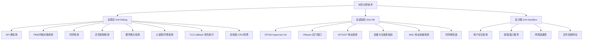
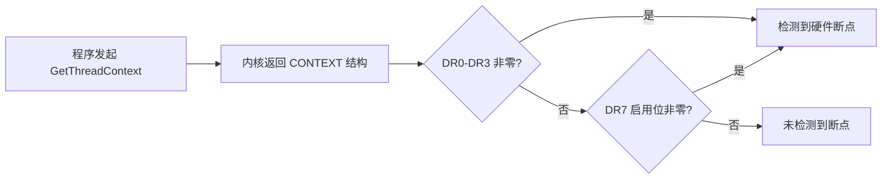
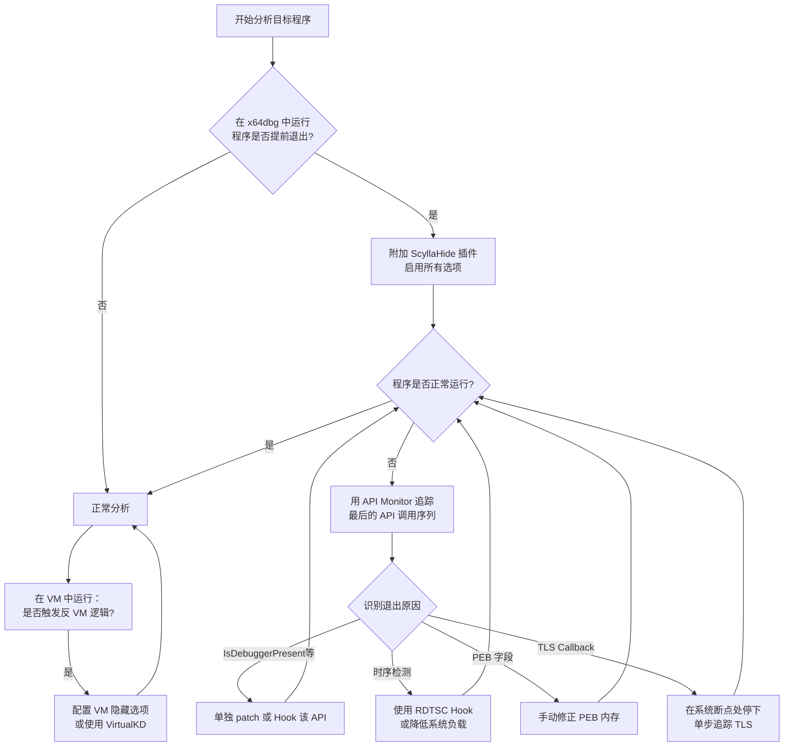

---
tags:
  - WASM
  - 虚拟化壳
  - tier3
  - 反调试
  - 反虚拟机
---
# 反调试与反虚拟机检测全景

> [!abstract] TL;DR
> 反调试（Anti-Debug）与反虚拟机（Anti-VM）检测是现代商业壳、恶意软件和安全产品对抗逆向分析的核心防线。两者目标不同：反调试针对交互式调试器（WinDbg、x64dbg、OllyDbg等），反虚拟机针对沙箱与自动化分析环境（VMware、VirtualBox、Cuckoo等）。本章系统梳理两大类检测的全部主流技术——从 Windows API 层、PEB 内部字段、时序侧信道、异常处理机制、硬件断点寄存器，到 CPUID hypervisor 位、VMware 后门端口、SIDT/SGDT 内存描述符表探测、设备/注册表指纹、用户行为熵检测——并逐一讲解其工作原理与对应的绕过手段，最后从防御视角讨论分析者如何系统性剥离这些干扰层。

## 概述与定位

反调试与反虚拟机检测技术诞生于软件保护与恶意软件领域，但两者的动机略有差异。商业保护壳（VMProtect、Themida、Enigma Protector 等）部署反调试的目的是阻止逆向工程师动态分析被保护程序、提取密钥校验逻辑或还原算法；恶意软件（勒索软件、银行木马、间谍程序）则额外需要识别沙箱/自动化分析环境，在检测到分析环境时选择休眠或伪装行为，从而躲避自动化检测系统。

从逆向分析者的视角，这两类检测构成了进入真正分析工作之前必须突破的"防线层"。如果不了解这些技术的原理，分析器将频繁遭遇程序提前退出、崩溃、行为被篡改，或者在沙箱中观察不到恶意行为。

本章的定位是技术全景与原理详解，而非单一工具使用手册。每种技术都会覆盖三个维度：
1. **原理**：为什么这个技术能检测到调试器/VM？底层依赖什么系统特性？
2. **检测实现**：典型代码形态（汇编或伪代码级）
3. **绕过策略**：逆向分析者如何对抗

本章覆盖的技术谱系如下图所示：



## 原理与机制

### 一、API 类反调试检测

#### 1.1 IsDebuggerPresent

`IsDebuggerPresent` 是 Windows 提供的最简单的调试器检测 API，其实现极为简单：直接读取当前进程的进程环境块（PEB）中的 `BeingDebugged` 字节并返回。

```asm
; IsDebuggerPresent 内核实现等效（64位）
; TEB（GS:[0x30]）→ PEB → BeingDebugged（偏移 0x02）
mov eax, gs:[0x60]       ; 读取 PEB 指针
movzx eax, byte ptr [eax+0x02]  ; BeingDebugged 字节
ret
```

当进程被调试器附加时，Windows 内核会将 PEB 的 `BeingDebugged` 字段置为 1；进程自行创建（正常启动）时为 0。这个 API 在代码保护中被大量使用，通常以如下形态出现：

```c
if (IsDebuggerPresent()) {
    // 自毁、输出假结果、崩溃
    TerminateProcess(GetCurrentProcess(), 0);
}
```

**绕过**：直接在内存中将 PEB+0x02 处的字节补丁为 0，或通过 ScyllaHide 自动 hook 此 API 返回 0。

#### 1.2 CheckRemoteDebuggerPresent

`CheckRemoteDebuggerPresent` 封装了 `NtQueryInformationProcess` 的 `ProcessDebugPort` 查询（信息类 7），检测进程是否被外部调试器附加（远程调试）。

```c
BOOL bDebug = FALSE;
CheckRemoteDebuggerPresent(GetCurrentProcess(), &bDebug);
if (bDebug) {
    // 检测到调试器
}
```

其底层等效于：

```c
DWORD_PTR debugPort = 0;
NtQueryInformationProcess(hProcess, ProcessDebugPort, &debugPort, sizeof(debugPort), NULL);
// 若 debugPort != 0，则进程正在被调试
```

调试器附加到进程时，内核会为该进程维护一个调试端口（`EPROCESS.DebugPort`），`ProcessDebugPort` 查询返回此端口的非零值。

**绕过**：Hook `NtQueryInformationProcess`，在 `ProcessDebugPort` 查询时强制写回 0。

#### 1.3 NtQueryInformationProcess 的其他利用方式

`NtQueryInformationProcess` 提供了多个信息类可被用于检测调试器：

| 信息类（值） | 字段 | 说明 |
|---|---|---|
| ProcessDebugPort (7) | DWORD_PTR | 调试端口句柄，被调试时非 0 |
| ProcessDebugFlags (31) | ULONG | EPROCESS.NoDebugInherit 标志，正常为 1，被调试为 0 |
| ProcessDebugObjectHandle (30) | HANDLE | 调试对象句柄，未被调试时返回 STATUS_PORT_NOT_SET |

`ProcessDebugObjectHandle` 是较难绕过的一种：通过查询调试对象句柄，若进程处于调试状态则返回非 NULL 句柄，即使 `BeingDebugged` 字节已被清零，此查询仍可检测到调试器。

```c
HANDLE hDebugObj = NULL;
ULONG ret;
NtQueryInformationProcess(GetCurrentProcess(), 30, &hDebugObj, sizeof(hDebugObj), &ret);
if (hDebugObj != NULL) {
    // 调试对象句柄存在 → 处于调试状态
}
```

**绕过**：需要同时 hook 多个查询路径，或使用内核级驱动（如 TitanHide）在内核层屏蔽所有相关查询。

### 二、PEB 字段与堆标志检测

#### 2.1 BeingDebugged 字节

如前所述，PEB+0x02 处的 `BeingDebugged` 字段是最常见的检测点。许多程序不通过 API 调用，而是直接读取该字段：

```asm
; 32位直接读取 PEB
mov eax, fs:[0x30]        ; PEB 基址（32位进程）
movzx eax, byte ptr [eax+0x02]  ; BeingDebugged
test eax, eax
jnz .debugger_detected
```

#### 2.2 NtGlobalFlag

调试器附加进程时，`PEB.NtGlobalFlag`（偏移 0x68，64位 PEB 为 0xBC）会被设置特定标志组合：`FLG_HEAP_ENABLE_TAIL_CHECK (0x10)`、`FLG_HEAP_ENABLE_FREE_CHECK (0x20)`、`FLG_HEAP_VALIDATE_PARAMETERS (0x40)`，合计 0x70。

```asm
; 检查 NtGlobalFlag（64位）
mov rax, gs:[0x60]        ; PEB 指针
mov eax, [rax+0xBC]       ; NtGlobalFlag
and eax, 0x70
cmp eax, 0x70
je .debugger_detected
```

正常进程的 `NtGlobalFlag` 不会包含这三个标志的组合（除非通过 gflags.exe 手动启用）。这是比 `BeingDebugged` 更难通过简单内存补丁绕过的检测，因为这些标志影响堆管理器行为，盲目清除可能导致堆操作崩溃。

#### 2.3 堆标志（Heap Flags）

Windows 调试堆（Debug Heap）在被调试时会在堆头部设置额外标志。堆的起始结构（`_HEAP`）中有 `Flags` 和 `ForceFlags` 两个字段：

| 条件 | Flags | ForceFlags |
|---|---|---|
| 正常进程 | 2 (HEAP_GROWABLE) | 0 |
| 调试器附加 | 0x50000062 | 0x40000060 |

检测代码通常遍历堆列表（通过 PEB.ProcessHeaps）并检查这两个字段：

```c
PHEAP pHeap = (PHEAP)GetProcessHeap();
// 64位 Windows：Flags @ 0x70, ForceFlags @ 0x74
if (*(DWORD*)((BYTE*)pHeap + 0x70) & ~2) {
    // 非标准标志 → 调试堆
}
```

**绕过**：ScyllaHide 的"Fix PEB"功能可自动修正这些字段。

### 三、时序类检测

#### 3.1 RDTSC 差值检测

`rdtsc`（Read Time-Stamp Counter）指令返回自处理器上电以来的时钟周期计数器值。在调试器单步执行时，每一步骤都会产生大量额外的时钟周期消耗（调试器自身逻辑、用户界面更新等），导致两次 `rdtsc` 之间的差值远大于正常执行时的差值。

```asm
rdtsc
mov esi, eax              ; 保存低32位
rdtsc
sub eax, esi              ; 计算差值
cmp eax, 0x200000         ; 阈值（约 200 万时钟周期）
ja .debugger_detected
```

正常执行时两个 `rdtsc` 之间的差值通常在几十到几百个时钟周期；单步调试时差值可轻松超过数百万周期。

时序检测的变种非常丰富，恶意软件常采用"隐蔽时序检测"——在两次时序采样之间插入大量无关代码，使得分析者难以识别采样点：

```c
uint64_t t1 = __rdtsc();
// 执行大量"正常"业务逻辑
do_legit_looking_work();
uint64_t t2 = __rdtsc();
uint64_t delta = t2 - t1;
if (delta > THRESHOLD) {
    // 可能处于调试状态
}
```

**绕过**：
- 修改 `rdtsc` 指令为 `xor eax,eax; xor edx,edx`（返回0差值）
- 使用 ScyllaHide 的 RDTSC Hook（虚拟化时间戳）
- 在 VT-x 层（VMware/VirtualBox）截获 RDTSC 并返回连续值

#### 3.2 GetTickCount / QueryPerformanceCounter

高层 API 的时序检测原理与 RDTSC 相同，但更易于编写：

```c
DWORD t1 = GetTickCount();
// 断点处理逻辑
do_something();
DWORD t2 = GetTickCount();
if (t2 - t1 > 500) {  // 500毫秒阈值
    // 单步/断点导致执行延迟
}
```

`QueryPerformanceCounter` 精度更高（纳秒级），使阈值更难绕过：

```c
LARGE_INTEGER freq, t1, t2;
QueryPerformanceFrequency(&freq);
QueryPerformanceCounter(&t1);
sensitive_code();
QueryPerformanceCounter(&t2);
double elapsed_ms = (t2.QuadPart - t1.QuadPart) * 1000.0 / freq.QuadPart;
if (elapsed_ms > 50.0) {
    // 检测到断点或单步
}
```

**绕过**：Hook `GetTickCount`/`QueryPerformanceCounter`，使每次调用返回递增但"正常"的值。

#### 3.3 INT 3 扫描（代码完整性时序结合）

通过扫描自身代码段，检测是否存在被调试器插入的软件断点（`0xCC`，即 INT 3 操作码）：

```c
BYTE *codePtr = (BYTE *)&function_to_protect;
for (int i = 0; i < code_size; i++) {
    if (codePtr[i] == 0xCC) {
        // 软件断点！
    }
}
```

软件断点的工作原理是调试器将目标位置的字节替换为 `0xCC`（INT 3），CPU 执行到此处时产生 `EXCEPTION_BREAKPOINT` 异常并通知调试器。扫描自身内存即可发现。

### 四、异常处理机制检测

#### 4.1 INT 3 异常劫持

一种更精妙的变种：程序主动触发 INT 3，通过自己的异常处理器（SEH 或 VEH）捕获。如果调试器存在，`EXCEPTION_BREAKPOINT` 会被调试器截获，异常处理器不会被调用：

```c
// 注册 VEH（向量异常处理）
LONG WINAPI veh_handler(EXCEPTION_POINTERS *ep) {
    if (ep->ExceptionRecord->ExceptionCode == EXCEPTION_BREAKPOINT) {
        // 我们自己的 INT3，说明没有调试器
        g_no_debugger = TRUE;
        ep->ContextRecord->Rip++;  // 跳过 INT3
        return EXCEPTION_CONTINUE_EXECUTION;
    }
    return EXCEPTION_CONTINUE_SEARCH;
}

AddVectoredExceptionHandler(1, veh_handler);
g_no_debugger = FALSE;
__asm { int 3 }
if (!g_no_debugger) {
    // 调试器截获了我们的 INT3
}
```

#### 4.2 INT 2D 检测

`INT 2D` 在内核态是调试服务例程入口（`DebugService`），在用户态被调试器特殊处理。具体地，调试器（OllyDbg、WinDbg）通常跳过 `INT 2D` 后的一个字节（因为 `INT 2D` 在某些调试器中与单步行为有特殊交互），导致执行流与预期不符：

```asm
int 0x2d       ; 触发 INT 2D
nop            ; 调试器会跳过此 NOP
; 以下代码：若跳过了 NOP 则进入反调试分支
```

在没有调试器时，`INT 2D` 抛出 `EXCEPTION_BREAKPOINT`，通过 SEH 捕获后继续执行下一字节（NOP）；在调试器下，行为因调试器种类而异，部分调试器会使 EIP 偏移 1 字节，使程序进入意外路径。

#### 4.3 单步异常检测（Trap Flag）

通过修改 EFLAGS 的陷阱位（TF，bit 8），程序可使 CPU 在执行每条指令后触发 `EXCEPTION_SINGLE_STEP`。若调试器消费了这个异常，程序侧的 SEH 就收不到通知：

```c
LONG WINAPI seh_handler(EXCEPTION_POINTERS *ep) {
    if (ep->ExceptionRecord->ExceptionCode == EXCEPTION_SINGLE_STEP) {
        g_trap_received = TRUE;
        return EXCEPTION_CONTINUE_EXECUTION;
    }
    return EXCEPTION_CONTINUE_SEARCH;
}

// 设置陷阱标志
__asm {
    pushfd
    or dword ptr [esp], 0x100  ; 设置 TF
    popfd
    nop  ; 触发单步异常
}
if (!g_trap_received) {
    // 调试器消费了单步异常
}
```

### 五、硬件断点检测（DR0-DR7）

x86/x64 处理器提供 4 个硬件断点寄存器（DR0-DR3）用于存储断点地址，DR7 为控制寄存器（启用/禁用各断点及设置触发条件），DR6 为状态寄存器。

调试器设置硬件断点时会修改这些寄存器。程序可通过以下方式读取：

```c
CONTEXT ctx;
ctx.ContextFlags = CONTEXT_DEBUG_REGISTERS;
GetThreadContext(GetCurrentThread(), &ctx);

if (ctx.Dr0 || ctx.Dr1 || ctx.Dr2 || ctx.Dr3) {
    // 硬件断点已被设置
}
if (ctx.Dr7 & 0xFF) {
    // DR7 中有启用位
}
```

硬件断点检测相比软件断点扫描有明显优势：不依赖代码内存扫描，对加密/压缩代码同样有效；且硬件断点是调试器隐藏断点的常用手段（因为不修改代码），这使得硬件断点检测成为高级保护的标配。



**绕过**：
- 使用 ScyllaHide 的 "Remove Hardware Breakpoints" 功能（Hook `GetThreadContext`，清零 DR 字段）
- 使用异常传递技巧：在硬件断点触发前，通过 VEH 清空 DR 寄存器
- 在不使用硬件断点的情况下调试（仅用软件断点，但同时绕过软件断点扫描）

### 六、父进程检测

正常运行时，用户双击程序，其父进程通常是 Explorer.exe（PID 对应）。调试器附加或以调试方式启动时，父进程是调试器进程（x64dbg.exe、OllyDbg.exe 等）。

```c
ULONG parentPid = 0;
PROCESS_BASIC_INFORMATION pbi;
NtQueryInformationProcess(GetCurrentProcess(), ProcessBasicInformation, &pbi, sizeof(pbi), NULL);
parentPid = (ULONG)(ULONG_PTR)pbi.InheritedFromUniqueProcessId;

// 获取父进程名称
HANDLE hParent = OpenProcess(PROCESS_QUERY_INFORMATION | PROCESS_VM_READ, FALSE, parentPid);
char parentName[MAX_PATH];
GetModuleFileNameExA(hParent, NULL, parentName, MAX_PATH);

// 检查是否为已知调试器
const char* debuggers[] = {"x64dbg", "ollydbg", "windbg", "ida", "ghidra"};
for (auto& d : debuggers) {
    if (StrStrIA(parentName, d)) {
        // 父进程是调试器
    }
}
```

**绕过**：使用调试器的"附加到已运行进程"模式（父进程保持 Explorer），而非以调试方式启动目标程序。

### 七、TLS Callback 抢先执行

TLS（Thread Local Storage）回调在进程/线程创建时、主入口点执行之前被调用。商业保护壳常将反调试检测放入 TLS 回调，使其在 IDA/Ghidra 的默认入口点（main/WinMain）之前已经运行，绕过了分析者在 main 处设置的初始断点。

PE 结构中 `IMAGE_DIRECTORY_ENTRY_TLS`（数据目录第 9 项）指向 `IMAGE_TLS_DIRECTORY`，其 `AddressOfCallBacks` 字段指向回调函数指针数组：

```
PE 加载顺序：
1. 映射各 Section 到内存
2. 处理 Import Table（IAT 填充）
3. 执行 TLS 回调（按数组顺序）  ← 反调试代码在此运行
4. 跳转到 AddressOfEntryPoint（真正的 main）
```

调试器通常在 OEP（原始入口点）处停下，此时 TLS 回调已执行完毕，如果回调中执行了 `TerminateProcess`，调试器根本看不到这一过程。

**绕过**：
- 在 x64dbg 的"系统断点"（进程创建事件）处停下，此时早于 TLS 回调
- IDA Pro 的"Try to detect and define additional entry points"选项会识别 TLS 回调
- 使用 ScyllaHide 的 "Break on TLS callbacks" 功能

### 八、自校验（CRC/哈希完整性验证）

程序在关键时刻对自身代码段执行 CRC32 或 MD5 校验，若校验值与编译时内嵌的期望值不符（因为调试器插入了 INT 3 或分析者 patch 了指令），则判定代码被篡改：

```c
uint32_t crc = crc32_compute(code_start, code_length);
if (crc != EXPECTED_CRC) {
    // 代码被修改（软件断点或 patch）
}
```

高级变种将期望 CRC 值本身加密存储，解密密钥依赖另一段代码的正确执行，形成链式校验。

**绕过**：
- 在内存中移除所有软件断点后再让程序执行校验代码
- 用硬件断点代替软件断点（不修改代码内容）
- Patch 校验跳转指令（但需先绕过其他反 patch 保护）

## 结构/算法/伪代码详解

### 反虚拟机检测技术体系

#### CPUID hypervisor bit

`CPUID` 指令的叶子 `0x1`（功能信息）返回的 ECX 寄存器第 31 位（hypervisor bit）在虚拟机环境中通常为 1，在物理机上为 0。这是最规范的 hypervisor 检测机制，由 Intel/AMD 规范定义：

```asm
mov eax, 0x1
cpuid
bt ecx, 31           ; 检查 bit 31（hypervisor present）
jc .is_vm
```

进一步地，在 hypervisor 存在时，`CPUID 0x40000000` 返回 hypervisor 供应商 ID：

```c
int regs[4];
__cpuid(regs, 0x40000000);
// regs[1..3] 包含供应商字符串
// "VMwareVMware" → VMware
// "Microsoft Hv" → Hyper-V
// "KVMKVMKVM\0\0\0" → KVM
// "VBoxVBoxVBox" → VirtualBox
char vendor[13];
memcpy(vendor, &regs[1], 4);
memcpy(vendor + 4, &regs[2], 4);
memcpy(vendor + 8, &regs[3], 4);
```

**绕过**：修改 VMware/VirtualBox 配置以隐藏 hypervisor bit（VMware 可在 .vmx 文件中设置 `hypervisor.cpuid.v0 = "FALSE"`）；或使用 KVM 的 `kvm_intel` 模块配置 `cpuid_mask_ecx_leaf1` 掩码。

#### VMware 后门端口（I/O Port 0x5658）

VMware 实现了一个特殊的 I/O 端口（0x5658，ASCII "VX"），用于 guest-host 通信（如剪贴板共享、时间同步）。在物理机上访问此端口会触发 `EXCEPTION_PRIVILEGED_INSTRUCTION`；在 VMware guest 中可以正常读取且返回特定魔数（0x564D5868，即 "VMXh"）：

```asm
; VMware 后门检测（32位）
mov eax, 0x564D5868   ; 魔数 "VMXh"
mov ecx, 0x0A         ; 获取版本信息命令
mov dx, 0x5658        ; VMware I/O 端口
in eax, dx            ; 读取端口

; 若在 VMware 中：EBX = 0x564D5868（"VMXh"魔数回显）
; 若在物理机上：触发 #GP 异常
cmp ebx, 0x564D5868
je .is_vmware
```

实际使用中需要 SEH/VEH 包裹此代码以捕获物理机上的异常：

```c
__try {
    __asm {
        mov eax, 0x564D5868
        mov ecx, 0x0A
        mov dx, 0x5658
        in eax, dx
        mov vmware_magic, ebx
    }
} __except(EXCEPTION_EXECUTE_HANDLER) {
    vmware_magic = 0;
}
if (vmware_magic == 0x564D5868) {
    // 在 VMware 中运行
}
```

**绕过**：Intercept VMware I/O port 并返回非魔数值。在现代 VMware 版本中可通过 `monitor_control.disable_directexec = "TRUE"` 等配置项控制。

#### Red Pill：SIDT/SGDT 内存描述符表地址检测

`SIDT`（Store Interrupt Descriptor Table Register）和 `SGDT` 指令将 IDT/GDT 的基地址和限制读入内存。在 x86 保护模式下（非虚拟化），IDT 基址是固定的系统地址（Windows 32位通常为 0x8003F400 或类似内核地址）。

在旧式 VMware（非硬件辅助虚拟化时代），由于虚拟机 IDT 位于不同地址空间，检测到的基址会落入"用户地址空间"或异常地址，以此识别 VM：

```c
// Red Pill 技术（经典版，主要针对 VMware 4.x 时代）
typedef struct { unsigned short limit; unsigned long base; } IDTR;
IDTR idtr;
__asm { sidt idtr }
if (idtr.base > 0xC0000000) {
    // 正常内核 IDT（物理机或现代 VT-x 虚拟化）
} else {
    // IDT 在低地址 → 老式虚拟化环境
}
```

注意：现代 VT-x/AMD-V 硬件辅助虚拟化已使 Red Pill 在大多数现代 VMware/VirtualBox 配置下失效，因为 IDT 地址对 guest 透明呈现为"正常"内核地址。Red Pill 技术主要作为历史案例讲解。

#### 设备与注册表指纹

VMware、VirtualBox 等虚拟机软件会在 guest 系统中安装特征性设备（驱动、虚拟网卡等）和注册表键：

```c
// 检查 VMware 相关注册表项
const char* vmware_keys[] = {
    "HARDWARE\\DEVICEMAP\\Scsi\\Scsi Port 0\\Scsi Bus 0\\Target Id 0\\Logical Unit Id 0",
    "SOFTWARE\\VMware, Inc.\\VMware Tools",
    "SYSTEM\\CurrentControlSet\\Services\\vmmouse",
    "SYSTEM\\CurrentControlSet\\Services\\vmhgfs",
};

for (auto& key : vmware_keys) {
    HKEY hKey;
    if (RegOpenKeyExA(HKEY_LOCAL_MACHINE, key, 0, KEY_READ, &hKey) == ERROR_SUCCESS) {
        // VMware 注册表键存在
        RegCloseKey(hKey);
        return TRUE;
    }
}
```

对于 VirtualBox：

```c
// VirtualBox 注册表检测
const char* vbox_keys[] = {
    "SOFTWARE\\Oracle\\VirtualBox Guest Additions",
    "SYSTEM\\CurrentControlSet\\Services\\VBoxGuest",
    "SYSTEM\\CurrentControlSet\\Services\\VBoxMouse",
};
```

设备对象检测（通过 `CreateFile` 尝试打开虚拟机专属设备）：

```c
// VMware 工具驱动设备
HANDLE h = CreateFileA("\\\\.\\vmci", GENERIC_READ, 0, NULL, OPEN_EXISTING, 0, NULL);
if (h != INVALID_HANDLE_VALUE) {
    CloseHandle(h);
    // VMware 环境
}

// VirtualBox 设备
h = CreateFileA("\\\\.\\VBoxMiniRdrDN", GENERIC_READ, 0, NULL, OPEN_EXISTING, 0, NULL);
```

#### MAC 地址前缀检测

虚拟机使用特定 OUI（Organizationally Unique Identifier，MAC 地址前三字节）：

| OUI 前缀 | 虚拟化平台 |
|---|---|
| 00:0C:29 / 00:50:56 | VMware |
| 08:00:27 | VirtualBox |
| 00:03:FF | Hyper-V (Microsoft) |
| 00:1C:42 | Parallels |
| 52:54:00 | QEMU/KVM |

```c
IP_ADAPTER_INFO adapterInfo[16];
DWORD bufLen = sizeof(adapterInfo);
GetAdaptersInfo(adapterInfo, &bufLen);

PIP_ADAPTER_INFO adapter = adapterInfo;
while (adapter) {
    // 检查 MAC 前三字节
    if (adapter->Address[0] == 0x00 &&
        adapter->Address[1] == 0x0C &&
        adapter->Address[2] == 0x29) {
        // VMware MAC
    }
    adapter = adapter->Next;
}
```

**绕过**：修改虚拟机 MAC 地址（VMware 可在设置中手动指定）。

### 反沙箱检测：用户行为探测

#### 鼠标移动检测

自动化沙箱系统（Cuckoo Sandbox、Any.Run 等）通常不模拟真实用户鼠标输入，或鼠标移动轨迹极为简单（匀速直线）。恶意软件通过多次采样鼠标位置，判断是否有真实用户交互：

```c
POINT pts[10];
for (int i = 0; i < 10; i++) {
    GetCursorPos(&pts[i]);
    Sleep(200);
}

int unique_positions = 0;
for (int i = 1; i < 10; i++) {
    if (pts[i].x != pts[0].x || pts[i].y != pts[0].y) {
        unique_positions++;
    }
}
if (unique_positions < 3) {
    // 鼠标几乎不动 → 可能在沙箱中
}
```

#### 剪贴板内容检测

真实用户的系统剪贴板通常包含最近复制的内容（文字、图片路径等）；沙箱的剪贴板往往为空：

```c
OpenClipboard(NULL);
HANDLE hData = GetClipboardData(CF_TEXT);
if (!hData) {
    // 剪贴板为空 → 沙箱迹象
}
CloseClipboard();
```

#### 进程枚举与窗口检测

检测是否存在沙箱特征进程或缺少正常用户环境进程（如 explorer.exe、常见浏览器进程）：

```c
// 检测已知沙箱进程
const char* sandbox_processes[] = {
    "cuckoo", "python.exe", "wireshark.exe",
    "procmon.exe", "procexp.exe", "autoruns.exe"
};

HANDLE hSnap = CreateToolhelp32Snapshot(TH32CS_SNAPPROCESS, 0);
PROCESSENTRY32 pe32;
pe32.dwSize = sizeof(pe32);
Process32First(hSnap, &pe32);
do {
    for (auto& sp : sandbox_processes) {
        if (StrStrIA(pe32.szExeFile, sp)) {
            // 发现沙箱相关进程
        }
    }
} while (Process32Next(hSnap, &pe32));
```

#### 系统运行时间检测

沙箱通常在样本提交后立即启动分析，导致系统运行时间（uptime）极短（往往 < 5 分钟）；真实用户的机器通常已运行数小时至数天：

```c
DWORD uptimeSec = GetTickCount() / 1000;  // 以秒为单位（注意32位溢出约49天）
if (uptimeSec < 300) {
    // 系统运行不足5分钟 → 沙箱迹象
}
```

### 综合检测框架伪代码

将上述所有检测技术组合成一个决策框架：

```c
typedef struct {
    BOOL api_debug;         // IsDebuggerPresent / NtQueryInformationProcess
    BOOL peb_debug;         // BeingDebugged / NtGlobalFlag / HeapFlags
    BOOL timing_debug;      // RDTSC / GetTickCount 时序异常
    BOOL exception_debug;   // INT3/INT2D/TF 异常被截获
    BOOL hwbp_active;       // 硬件断点 DR 寄存器非零
    BOOL parent_suspicious; // 父进程为已知调试器
    BOOL vmware_detected;   // VMware 后门端口 / CPUID
    BOOL vbox_detected;     // VirtualBox 注册表 / MAC
    BOOL sandbox_detected;  // 用户行为 / 进程 / uptime
} DetectionResult;

void run_all_checks(DetectionResult *r) {
    r->api_debug    = check_api_debug();
    r->peb_debug    = check_peb_fields();
    r->timing_debug = check_timing();
    r->exception_debug = check_exception_hijacking();
    r->hwbp_active  = check_hardware_breakpoints();
    r->parent_suspicious = check_parent_process();
    r->vmware_detected = check_vmware_backdoor() || check_cpuid_hypervisor("VMwareVMware");
    r->vbox_detected   = check_vbox_registry() || check_mac_prefix(0x080027);
    r->sandbox_detected = check_mouse_entropy() || check_uptime() || check_sandbox_processes();
}

int compute_threat_score(DetectionResult *r) {
    int score = 0;
    if (r->api_debug)       score += 10;
    if (r->peb_debug)       score += 8;
    if (r->timing_debug)    score += 6;
    if (r->exception_debug) score += 7;
    if (r->hwbp_active)     score += 9;
    if (r->parent_suspicious) score += 5;
    if (r->vmware_detected) score += 4;
    if (r->vbox_detected)   score += 4;
    if (r->sandbox_detected)score += 3;
    return score;
}

// score > 10 → 激活保护（退出/自毁/假装正常）
```

实际商业壳（如 Themida）会将这些检测分散在代码各处，使其难以整体定位和 patch。

## 工具视角与实战

### ScyllaHide：最全面的用户态反反调试插件

ScyllaHide 是 x64dbg/OllyDbg/IDA 的开源插件，系统性 hook 以下内容以绕过常见反调试：

| 绕过项目 | 实现机制 |
|---|---|
| NtSetInformationThread (HideFromDebugger) | Hook 并过滤 ThreadHideFromDebugger 信息类 |
| IsDebuggerPresent | Hook 返回 0 |
| CheckRemoteDebuggerPresent | Hook 返回 FALSE |
| NtQueryInformationProcess (DebugPort/Flags/Object) | Hook 并返回"未调试"值 |
| OutputDebugString | Hook 返回，防止通过异常行为检测 |
| BlockInput | Hook 防止鼠标/键盘被封锁 |
| NtSetDebugFilterState | Hook |
| GetTickCount / QueryPerformanceCounter | 使时间戳递增但无异常延迟 |
| FindWindow / EnumWindows | 过滤调试器窗口 |
| Fix PEB | 将 BeingDebugged、NtGlobalFlag、HeapFlags 恢复正常值 |
| 硬件断点清除 | Hook GetThreadContext，清零 DR0-DR7 |
| RDTSC | 可选择性替换为固定/单调递增值 |

ScyllaHide 配置界面允许逐项启用，实战中建议全部启用后按需关闭（过度 hook 可能影响目标程序正常功能）。

### TitanHide：内核级反反调试驱动

ScyllaHide 在用户态 hook，高级壳可通过直接系统调用（syscall）绕过用户态 hook。TitanHide 是内核驱动级方案，通过 SSDT Hook 或 DKOM（Direct Kernel Object Manipulation）在内核层屏蔽调试器标记：

```
用户态 NtQueryInformationProcess 调用链：
程序代码 → [ScyllaHide UserMode Hook] → ntdll.NtQueryInformationProcess → syscall → 内核

直接 syscall 绕过用户态：
程序代码 → 直接 syscall 0x22 → 内核  ← ScyllaHide 无效

TitanHide 工作层：
程序代码 → syscall → [TitanHide SSDT Hook] → 屏蔽 ← 任何调用路径均有效
```

TitanHide 需要以管理员权限加载驱动，且可能与某些安全软件冲突。

### Pafish：检测能力测试框架

Pafish（Paranoid Fish）是一个开源的虚拟机/调试器检测测试工具，实现了数十种检测技术并输出检测结果，可用于验证绕过方案的有效性：

```
pafish.exe 输出示例：
[*] Debugger detection
  [-] Checking IsDebuggerPresent ... GIVEUP
  [-] Checking BeingDebugged PEB flag ... GIVEUP
  [-] Checking NtGlobalFlag PEB flag ... GIVEUP
  [-] Checking DebugPort ... GIVEUP
  [-] Checking Hardware BP (via GetThreadContext) ... GIVEUP
[*] VM detection
  [-] Checking CPUID hypervisor bit ... DETECTED
  [-] Checking VMware I/O port ... NOT DETECTED
  [-] Checking VirtualBox ... NOT DETECTED
```

"GIVEUP" 表示检测失败（未发现调试器），"DETECTED" 表示检测成功（发现虚拟机）。分析者可用 Pafish 逐步验证 ScyllaHide + VM 配置的有效性。

### 实战工作流程



### 识别反调试代码的静态分析技巧

在 IDA/Ghidra 中静态定位反调试代码：

1. **交叉引用法**：搜索对 `IsDebuggerPresent`、`CheckRemoteDebuggerPresent`、`NtQueryInformationProcess` 的调用（XREF），分析调用点周围的跳转逻辑。

2. **系统调用号搜索**：直接 syscall 绕过不会出现 API 符号。搜索 `0x22`（NtQueryInformationProcess syscall 号，Win10 64位）或 `mov eax, 0x22`+`syscall` 序列。

3. **特征字节搜索**：
   - `65 48 8B 04 25 60 00 00 00`（`mov rax, gs:[0x60]`，PEB 读取，64位）
   - `64 A1 30 00 00 00`（`mov eax, fs:[0x30]`，PEB 读取，32位）
   - `0F 31`（`rdtsc` 指令）
   - `ED`（`in eax, dx`，I/O 端口读取）

4. **IDA FLIRT 签名**：使用 tilib 生成包含 ScyllaHide 绕过函数的签名，自动标注已知反调试函数。

## 安全性与正确使用

### 合法保护用途

反调试与反虚拟机技术在合法软件保护场景中有广泛应用：

**商业软件许可保护**：软件厂商将授权校验逻辑保护在反调试壳中，防止逆向工程师跳过许可检查、提取注册算法或构造破解补丁。这是商业保护壳（VMProtect、Themida、Enigma Protector）的核心价值主张。

**游戏反作弊**：游戏公司（Battleye、Easy Anti-Cheat、Ricochet 等）使用反调试技术阻止作弊程序通过调试器钩入游戏进程、修改内存中的弹药/HP数值或注入 DLL。硬件断点检测、内核级保护在此类场景中尤为关键。

**安全产品自保护**：杀毒软件、EDR（端点检测与响应）系统需要保护自身组件不被恶意软件通过调试手段卸载或绕过。反调试机制是安全产品可信执行基础的一部分。

**BIOS/固件保护**：现代 UEFI 固件使用时序检测和代码完整性校验防止调试工具（如 RWEverything、UEFITool）在分析期间修改固件逻辑。

### 恶意软件中的对抗性使用

恶意软件（勒索软件、APT 工具、银行木马）使用这些技术的目的则更具对抗性：

**逃避沙箱分析**：通过检测 VM、鼠标行为、运行时间等特征，恶意软件在沙箱环境中休眠或表现正常，只在真实用户环境中激活恶意负载。这直接对抗了安全厂商的自动化样本分析系统。

**阻碍事件响应**：在企业环境中，安全分析人员在响应入侵时需要动态分析恶意软件行为。反调试技术延长了分析时间，为攻击者争取持久化和横向移动的窗口。

**反取证**：TLS 回调自毁、时序触发删除等技术使取证人员难以在受控环境中复现恶意行为。

### 分析者的防御性立场

从安全研究和事件响应的角度，理解反调试/反虚拟机技术并非为了绕过保护机制进行破解，而是为了：

1. **安全产品评测**：评估商业安全产品的反调试保护是否有效覆盖已知技术，发现潜在弱点供厂商改进。
2. **恶意软件分析**：在受控沙箱中完整还原恶意软件行为，需要克服其自保护机制。
3. **CTF 与漏洞研究**：理解保护机制是分析被保护软件漏洞的前提。
4. **安全工具开发**：ScyllaHide、TitanHide 等工具本身需要深入理解所有反调试技术才能实现有效的对抗。

研究者在学习和使用这些技术时应遵守适用的法律法规（如《计算机欺诈和滥用法》/CFAA、中国《网络安全法》等），仅在授权范围内对目标系统进行分析。

### 沙箱加固建议

沙箱系统设计者可以从本章技术中汲取加固思路：

- **时序欺骗**：在虚拟化层虚拟化 TSC，使 `rdtsc` 看起来连续且"正常"
- **MAC 地址随机化**：每次创建 VM 实例时随机生成 MAC 地址，避免已知 OUI 指纹
- **CPUID 掩码**：配置 hypervisor 屏蔽 CPUID hypervisor bit（部分 KVM 版本支持）
- **用户行为仿真**：注入随机鼠标移动和键盘输入，提高用户行为熵
- **进程环境填充**：在沙箱中启动常见用户进程（浏览器、Office 等），模拟真实系统
- **系统运行时间填充**：修改 `GetTickCount` 返回较长的"运行时间"

## 小结

反调试与反虚拟机技术构成了一个层次分明、相互补充的防御体系。API 类检测（`IsDebuggerPresent`、`NtQueryInformationProcess`）是最基础的一层，容易被用户态 hook 绕过；PEB 字段和堆标志检测略深入一些，需要内存补丁才能解决；时序检测和异常处理检测则利用调试行为的"副作用"，绕过难度更高；硬件断点检测直接针对分析工具的内部状态，只有驱动级 hook 才能可靠绕过；TLS 回调则从时序角度"抢在"分析者布置防线之前运行。

反虚拟机检测同样层次丰富：CPUID 和后门端口利用硬件指令的可探测性；注册表和设备指纹则依赖虚拟机软件的可见痕迹；用户行为检测则是针对自动化分析系统的行为指纹。

对抗博弈永无止境：ScyllaHide 绕过了用户态 API 检测，恶意软件转向直接 syscall；TitanHide 覆盖了内核调用路径，新型保护又在驱动加载时机之前部署；VM 配置项可以隐藏 hypervisor bit，恶意软件又转向时序和行为特征。真正的分析实践中，分析者需要掌握这一完整技术栈，能够针对具体目标的具体检测手法选择合适的绕过工具和策略，而不是依赖单一工具"一键绕过"。

从保护者视角，真正高质量的反调试实现应具备以下特征：多层检测互相补充（没有单点绕过可覆盖全部）、检测逻辑散布于代码各处（难以整体定位）、检测结果延迟触发（而非立即退出，使分析者难以定位检测点）、与业务逻辑深度耦合（使得 patch 检测代码会破坏程序正常功能）。这四点原则在高级商业壳（Themida 内核驱动联防）和顶级 APT 工具中均有体现。

## 相关阅读

- [[09.虚拟化保护壳总览|09. 虚拟化保护壳总览]] — 商业壳架构概览，包含 Themida/VMProtect 的反调试集成方式
- [[12.VMProtect逆向实战|12. VMProtect 逆向实战]] — VMProtect 具体的 RDTSC 反调试实现分析
- [[17.代码混淆对抗OLLVM与Tigress|17. 代码混淆对抗OLLVM与Tigress]] — OLLVM 混淆与反调试的结合使用
- [[19.Unicorn与Qiling模拟脱壳|19. Unicorn 与 Qiling 模拟脱壳]] — 模拟执行绕过反调试的一种思路
- Peter Ferrie, "The 'Ultimate' Anti-Debugging Reference" — 覆盖 400+ 种反调试技术的经典文献
- Check Point Research, "Evasion Techniques" — 恶意软件反沙箱技术现状分析
- al-khaser 项目（GitHub: LordNoteworthy/al-khaser）— 最完整的反调试/反虚拟机检测技术测试集，代码即文档

---

[[00.WASM与虚拟化壳逆向总览|⬆ 系列总览]] | [[17.代码混淆对抗OLLVM与Tigress|← 上一章]] | [[19.Unicorn与Qiling模拟脱壳|→ 下一章]]
