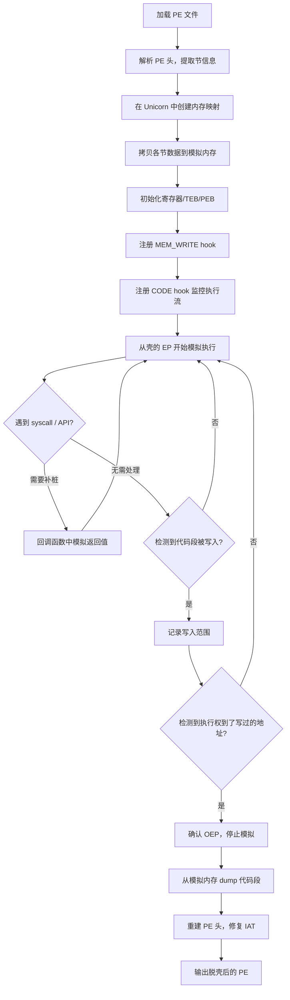
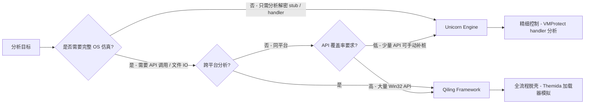

---
tags:
  - WASM
  - 虚拟化壳
  - tier3
  - unicorn
  - qiling
---
# Unicorn 与 Qiling 模拟脱壳

> [!abstract] TL;DR
> 模拟脱壳的核心思路是：不在真实操作系统上运行被保护程序，而是把壳的解密 stub 载入 CPU 模拟器，让模拟器"跑完"解密逻辑，再从模拟内存里 dump 还原后的原始代码段。Unicorn Engine 提供轻量的纯 CPU 模拟层（基于 QEMU TCG），Qiling Framework 在其上叠加完整的操作系统仿真（syscall / Win32 API / rootfs），两者形成"裸 CPU 层"与"全系统层"的互补组合。模拟执行天然规避反调试检测，特别适合 VMProtect / Themida handler 语义提取、批量样本脱壳和跨平台分析。本章对原理、架构、脚本骨架和实战要点进行完整梳理，并与第 13 章 VM 壳自动化分析框架形成方法论呼应。

## 概述与定位

### 为什么需要"模拟执行脱壳"

传统脱壳依赖调试器在真实系统上单步运行被保护程序，直到壳把原始代码解密到内存，再 dump 出来重建 PE。这种方式行之有效，但有两个根本性痛点：

1. **反调试对抗持续升级**：VMProtect、Themida 等现代 VM 壳内置数十种反调试检测（IsDebuggerPresent、NtQueryInformationProcess、RDTSC 时序检测、硬件断点检测等，详见第 18 章）。即便借助 ScyllaHide 插件绕过大多数检测，仍有基于内核驱动的检测点无法被用户态插件屏蔽。
2. **批量分析效率低下**：分析恶意软件家族时，往往需要对数百个样本提取 payload。在真实系统上逐一运行既危险（沙箱逃逸风险）又缓慢。

模拟执行脱壳绕过了上述瓶颈：CPU 模拟器本身不是真实的调试环境，没有调试器进程可以检测，没有真实的操作系统调度可以干扰，执行环境完全可控且隔离。模拟器内存随时可读写，hook 机制可以在任意地址插入回调，天然具备"观测者"能力。

### Unicorn 与 Qiling 的定位分层

```
┌──────────────────────────────────────┐
│   Qiling Framework（全系统仿真层）    │
│  OS Emulation / Syscall / Win32 API  │
│  rootfs / snapshot / cross-platform  │
├──────────────────────────────────────┤
│   Unicorn Engine（纯 CPU 模拟层）     │
│  x86/x64/ARM/MIPS/RISC-V TCG JIT    │
│  uc_hook / 寄存器 API / 内存 API     │
├──────────────────────────────────────┤
│   QEMU TCG（动态二进制翻译核心）      │
└──────────────────────────────────────┘
```

- **Unicorn**：只模拟 CPU 和内存。没有操作系统概念，遇到 syscall / INT 0x80 / SYSENTER 等会触发 hook 或直接抛出异常，需要手动补桩。适合分析壳的纯计算 stub（解密算法、VM handler 语义提取）。
- **Qiling**：在 Unicorn 之上实现了 OS 仿真层，能够模拟 Linux、Windows（PE 加载器 + Win32 API）、macOS、Android、iOS 等多平台程序的执行，大部分 syscall / API 有内置实现，只有极少数需要手动补桩。适合模拟完整的壳加载流程直至 OEP。

两者互补：Unicorn 精度高、控制粒度细、学习成本低；Qiling 开箱即用、跨平台、适合整体分析。本章均做深入覆盖。

---

## 原理与机制

### Unicorn Engine 内核原理

Unicorn 的前身是 QEMU，它复用了 QEMU 的 TCG（Tiny Code Generator）动态二进制翻译引擎。TCG 的工作流程如下：

1. 取指：从虚拟内存读取目标架构指令（x86、ARM 等）。
2. 前端翻译：TCG 前端将目标指令解码为 TCG IR（中间表示，与架构无关的三地址码）。
3. 后端翻译：TCG 后端将 IR 翻译为宿主机原生指令（例如 x64 汇编），生成"翻译块"（Translation Block，TB）。
4. 执行：直接执行宿主机原生指令，速度接近原生，远快于逐条解释。
5. 链接：相邻 TB 被缓存并链接，跨 TB 跳转无需重新翻译。

Unicorn 在 QEMU TCG 基础上进行了库化（去掉设备模拟层、网络层等），暴露出简洁的 C API，并提供 Python / Go / Rust 等绑定。

**核心 API 体系**（Python 绑定）：

```python
from unicorn import *
from unicorn.x86_const import *

# 创建模拟引擎（x86 64位）
mu = Uc(UC_ARCH_X86, UC_MODE_64)

# 内存映射：地址, 大小, 权限
mu.mem_map(BASE, 0x1000, UC_PROT_ALL)
mu.mem_write(BASE, shellcode)

# 寄存器读写
mu.reg_write(UC_X86_REG_RIP, BASE)
mu.reg_read(UC_X86_REG_RAX)

# 启动模拟（起始地址, 结束地址）
mu.emu_start(BASE, BASE + len(shellcode))

# 停止模拟
mu.emu_stop()
```

### uc_hook：代码与内存钩子

uc_hook 是 Unicorn 最强大的机制，允许在特定事件发生时调用 Python 回调函数：

| Hook 类型 | 常量 | 触发时机 |
|-----------|------|----------|
| 指令执行 | `UC_HOOK_CODE` | 每条指令执行前 |
| 基本块 | `UC_HOOK_BLOCK` | 每个基本块开头 |
| 内存读 | `UC_HOOK_MEM_READ` | 内存读操作前 |
| 内存写 | `UC_HOOK_MEM_WRITE` | 内存写操作前 |
| 内存无效 | `UC_HOOK_MEM_UNMAPPED` | 访问未映射内存 |
| 中断 | `UC_HOOK_INTR` | INT 指令触发 |
| INSN_INVALID | `UC_HOOK_INSN_INVALID` | 无效指令 |

```python
def hook_code(uc, address, size, user_data):
    print(f">>> 执行 0x{address:x}, 指令大小 {size}")

def hook_mem_write(uc, access, address, size, value, user_data):
    print(f">>> 内存写: 0x{address:x} = 0x{value:x}")

mu.hook_add(UC_HOOK_CODE, hook_code)
mu.hook_add(UC_HOOK_MEM_WRITE, hook_mem_write)
```

监控内存写操作是模拟脱壳的核心手段：壳解密原始代码时必然向内存写入，通过 `UC_HOOK_MEM_WRITE` 可以精确记录哪些地址被写入，从而定位解密后的代码段范围。

### Qiling Framework 架构原理

Qiling 在 Unicorn 的 CPU 模拟基础上实现了完整的操作系统抽象层：

```
用户态代码（PE/ELF）
    ↓ 调用 Win32 API / Linux syscall
Qiling OS 仿真层
    ├── Windows：LoadLibrary / GetProcAddress / VirtualAlloc 等 ~800 个 API
    ├── Linux：read / write / mmap / mprotect 等 syscall
    ├── 文件系统仿真（rootfs 目录映射）
    └── 线程 / TLS / 异常分发仿真
    ↓
Unicorn Engine（CPU + 内存）
    ↓
宿主机 OS（Linux/macOS/Windows）
```

**关键设计**：

1. **rootfs**：Qiling 使用一个目录作为虚拟根文件系统，被模拟程序对文件系统的操作（打开 DLL、读取注册表项的文件映射等）被重定向到 rootfs 目录。分析 Windows 程序时需要提供真实 Windows 的 System32 目录（可从 Windows 安装拷出或用 wine 替代）。

2. **snapshot**：Qiling 支持内存快照，可以在某一执行点保存完整的 CPU 寄存器状态 + 内存状态，之后随时恢复。这对分析分支逻辑（"走哪条路能到 OEP"）极为实用。

3. **cross-platform**：在 Linux 宿主机上模拟 Windows PE、在 Windows 宿主机上模拟 Linux ELF，这种跨平台能力是 Pin / Frida 无法提供的。

### 模拟执行天然绕过反调试

模拟执行规避反调试的机制是结构性的，不是逐条绕过：

| 反调试技术 | 真实系统上的绕过难度 | 模拟执行的天然状态 |
|------------|---------------------|-------------------|
| IsDebuggerPresent | 需要 PEB 修补 | PEB 由 Qiling 构造，默认无调试标志 |
| NtQueryInformationProcess | 需要 API hook | Qiling 实现中直接返回"未调试"结果 |
| 硬件断点检测（DR0-DR3） | 需要小心不设 DR 断点 | 调试寄存器不存在对应硬件设备 |
| RDTSC 时序检测 | 需要单步加速或 hook RDTSC | 可 hook UC_HOOK_INSN 对 RDTSC 返回固定值 |
| 调试器窗口检测 | 需要隐藏调试器进程/窗口 | 模拟环境无 GUI，FindWindow 返回 NULL |
| 父进程检测 | 需要欺骗父进程 PID | Qiling 可构造任意父进程 PID |
| 反沙箱（鼠标移动检测） | 需要自动化鼠标 | 可 mock GetCursorPos 返回动态坐标 |

唯一需要额外处理的是 CPUID 反虚拟机检测（VMware/VBOX hypervisor bit），可通过 `UC_HOOK_INSN` hook `CPUID` 指令并修改返回值清除 hypervisor bit。

---

## 结构/算法/伪代码详解

### 模拟脱壳完整流程

以脱取一个简单加密壳（将原始代码加密后存放，运行时解密到 .text 节）为例，完整流程如下：



### PE 加载到模拟内存

```python
import pefile
from unicorn import *
from unicorn.x86_const import *

def load_pe_to_unicorn(pe_path: str) -> tuple:
    """
    加载 PE 文件到 Unicorn 内存，返回 (mu, image_base, ep)
    """
    pe = pefile.PE(pe_path)
    image_base = pe.OPTIONAL_HEADER.ImageBase
    image_size = pe.OPTIONAL_HEADER.SizeOfImage

    # 按 SizeOfImage 对齐分配内存
    mu = Uc(UC_ARCH_X86, UC_MODE_64)
    mu.mem_map(image_base, align_up(image_size, 0x1000))

    # 写入 PE 头（DOS + PE + 节表）
    mu.mem_write(image_base, pe.header)

    # 逐节写入原始数据（按 VirtualAddress 放置）
    for section in pe.sections:
        va = image_base + section.VirtualAddress
        raw = section.get_data()
        mu.mem_write(va, raw)

    ep = image_base + pe.OPTIONAL_HEADER.AddressOfEntryPoint
    return mu, image_base, ep

def align_up(value: int, align: int) -> int:
    return (value + align - 1) & ~(align - 1)
```

### 写-执行检测算法：定位 OEP

壳解密后会跳转到原始代码的 OEP 执行。OEP 检测的核心算法是"先被写入、后被执行"：

```python
written_ranges = set()      # 记录被写过的内存页
executed_after_write = None # 首个在写过的地址上执行的地址

def hook_mem_write(uc, access, address, size, value, user_data):
    # 记录写入的内存页
    page = address & ~0xFFF
    written_ranges.add(page)

def hook_code(uc, address, size, user_data):
    global executed_after_write
    page = address & ~0xFFF
    if page in written_ranges and executed_after_write is None:
        # 在之前被写过的地址上开始执行 → 极可能是 OEP
        executed_after_write = address
        print(f"[!] 可能的 OEP: 0x{address:x}")
        uc.emu_stop()

mu.hook_add(UC_HOOK_MEM_WRITE, hook_mem_write)
mu.hook_add(UC_HOOK_CODE, hook_code)
mu.emu_start(ep, ep + 0x100000, timeout=30 * UC_SECOND_SCALE)
```

### API 补桩策略

Unicorn 无 OS 仿真层，遇到 `CALL [IAT]` 时会跳转到一个未映射地址（或未实现的 DLL 地址），触发 `UC_HOOK_MEM_UNMAPPED`。需要预先建立 API stub 表：

```python
# 在模拟内存中分配一块 stub 区域
STUB_BASE = 0x7FF00000
STUB_SIZE = 0x10000
mu.mem_map(STUB_BASE, STUB_SIZE)

stub_table = {}  # api_name -> stub_address

def make_stub(mu, stub_base_ptr: list, api_name: str) -> int:
    """
    在 stub 区域写入 RET 指令，返回 stub 地址
    """
    addr = stub_base_ptr[0]
    # x64 calling convention：RET（C3）
    mu.mem_write(addr, b'\xC3')
    stub_table[api_name] = addr
    stub_base_ptr[0] += 0x10  # 每个 stub 间隔 16 字节
    return addr

def hook_stub_call(uc, address, size, user_data):
    """
    当执行到 stub 地址时，根据 stub_table 反查 API 名，执行自定义逻辑
    """
    for name, stub_addr in stub_table.items():
        if address == stub_addr:
            # 实现 VirtualAlloc：分配内存
            if name == 'VirtualAlloc':
                lpAddress = uc.reg_read(UC_X86_REG_RCX)
                dwSize    = uc.reg_read(UC_X86_REG_RDX)
                alloc_addr = HEAP_BASE + heap_offset[0]
                uc.mem_map(alloc_addr, align_up(dwSize, 0x1000))
                uc.reg_write(UC_X86_REG_RAX, alloc_addr)
                heap_offset[0] += align_up(dwSize, 0x1000)
            break
```

这种"手动补桩"方式是 Unicorn 脱壳的主要工作量。现代壳可能调用数十个 API，每个都需要补桩。Qiling 则内置了大量 API 实现，大幅降低补桩成本。

### TEB / PEB 初始化

64 位 Windows 程序通过 `GS:0x60` 访问 PEB，`GS:0x30` 访问 TEB。很多壳在解密之前就会读取这些结构（例如用 PEB.NtGlobalFlag 检测调试）。需要手动构造：

```python
TEB_BASE = 0x7FFDE000
PEB_BASE = 0x7FFE0000

# 构造最小 PEB（只填关键字段）
peb = bytearray(0x400)
# PEB.BeingDebugged 偏移 0x2：置 0 表示非调试
peb[0x2] = 0x00
# PEB.NtGlobalFlag 偏移 0x68：正常值 0，调试器存在时为 0x70
struct.pack_into('<I', peb, 0x68, 0x00)
mu.mem_write(PEB_BASE, bytes(peb))

# 构造最小 TEB，GS 段指向 TEB_BASE
teb = bytearray(0x1000)
# TEB.ProcessEnvironmentBlock 偏移 0x60（64位）
struct.pack_into('<Q', teb, 0x60, PEB_BASE)
mu.mem_write(TEB_BASE, bytes(teb))

# 设置 GS 段基地址（需要 Unicorn x86 扩展）
mu.reg_write(UC_X86_REG_GS_BASE, TEB_BASE)
```

### Qiling 模拟脱壳骨架

Qiling 的 API 更高层，脚本更简洁：

```python
from qiling import Qiling
from qiling.const import QL_VERBOSE

# 初始化：指定 PE 路径、rootfs（含 Windows DLL）、操作系统、架构
ql = Qiling(
    argv=[r'C:\sample\protected.exe'],
    rootfs=r'C:\qiling\rootfs\x8664_windows',
    verbose=QL_VERBOSE.OFF
)

oep_candidate = [None]

def hook_code(ql, address, size):
    """监控代码执行，配合内存写入检测定位 OEP"""
    if address in ql.mem.written_pages:  # 自定义属性
        if oep_candidate[0] is None:
            oep_candidate[0] = address
            print(f"[OEP] 0x{address:x}")
            ql.emu_stop()

def hook_mem_write(ql, access, address, size, value):
    """记录被写入的内存页"""
    page = address & ~0xFFF
    if not hasattr(ql.mem, 'written_pages'):
        ql.mem.written_pages = set()
    ql.mem.written_pages.add(page)

ql.hook_code(hook_code)
ql.hook_mem_write(hook_mem_write)

# Snapshot：在 EP 处保存快照，便于多次尝试
ql.save(reg=True, mem=True, snapshot='ep_snapshot.bin')

ql.run()

# dump 脱壳后的内存
if oep_candidate[0]:
    image_base = ql.loader.image_base
    image_size = ql.loader.image_size
    dumped = ql.mem.read(image_base, image_size)
    with open('dumped.bin', 'wb') as f:
        f.write(dumped)
    print(f"[+] Dumped {image_size} 字节，OEP=0x{oep_candidate[0]:x}")
```

### Qiling Snapshot 机制与多路径探索

Snapshot 是 Qiling 区别于其他工具的杀手特性之一：

```python
# 在关键分支前保存快照
ql.save(reg=True, mem=True, snapshot='/tmp/before_branch.json')

# 执行分支 A
ql.run(begin=branch_a_addr, end=branch_a_addr + 0x100)

# 恢复快照，执行分支 B
ql.restore(snapshot='/tmp/before_branch.json')
ql.run(begin=branch_b_addr, end=branch_b_addr + 0x100)
```

这在分析有反调试分支的壳时极为实用：壳检测到"调试环境"和"正常环境"会走不同路径，用 snapshot 可以强制探索两条路径而无需重复加载样本。

---

## 工具视角与实战

### Unicorn 与 Qiling 的选型指导



### VMProtect Handler 语义提取（Unicorn 实战）

第 12 章讨论了 VMProtect 的 handler 追踪，模拟执行在这里的价值在于：可以在不运行真实程序的情况下，对单个 handler 进行语义提取。

```python
# 假设已定位到 VMProtect VM_PUSH_REG handler 地址 = 0x401234
HANDLER_BASE = 0x401234

# 仅映射包含 handler 的代码段
mu.mem_map(0x400000, 0x10000)
with open('protected.exe', 'rb') as f:
    f.read()  # 略去，按节写入

# 虚拟机内部寄存器（VMProtect 用 ESI 指向 VM 上下文）
VM_CONTEXT_BASE = 0x500000
mu.mem_map(VM_CONTEXT_BASE, 0x1000)
mu.reg_write(UC_X86_REG_ESI, VM_CONTEXT_BASE)

executed_insns = []

def trace_handler(uc, address, size, user_data):
    # 记录每条被执行的指令地址
    executed_insns.append(address)
    if len(executed_insns) > 200:
        uc.emu_stop()  # 防止无限循环

mu.hook_add(UC_HOOK_CODE, trace_handler)
mu.emu_start(HANDLER_BASE, HANDLER_BASE + 0x1000)

print(f"Handler 执行了 {len(executed_insns)} 条指令")
# 配合 capstone 反汇编，输出 handler 的指令序列
```

### Themida 加载器模拟（Qiling 实战要点）

Themida 的保护流程涉及：
1. 解压 / 解密原始代码（纯计算，Unicorn 可胜任）
2. 调用 LoadLibrary / GetProcAddress 修复 IAT（需要 OS 仿真）
3. 写入 TLS 回调并注册反调试钩子（需要 TLS 支持）
4. 跳转到 OEP（有时伴随 VirtualProtect 权限切换）

步骤 2-4 使用 Qiling 处理更合适。关键配置点：

```python
# Themida 大量调用 NtProtectVirtualMemory 切换权限
# Qiling 内置了此 API 的仿真，但需要正确的 rootfs
ql = Qiling(
    argv=['protected.exe'],
    rootfs='rootfs/x8664_windows',
    # 提供系统 DLL：kernel32.dll / ntdll.dll / user32.dll 等
    verbose=QL_VERBOSE.DEBUG
)

# Themida v3 会校验 ntdll.dll 的哈希
# 需要提供目标系统版本完全匹配的 ntdll.dll
# 否则 Themida 会在初始化阶段直接退出

# 关闭 Themida 的 TLS 反调试回调
def bypass_tls_antidebug(ql, address, size):
    # 若 TLS 回调中有 IsDebuggerPresent，强制跳过
    if is_antidebug_tls_callback(address):
        ql.arch.regs.rip = tls_callback_end  # 跳到回调末尾
```

### 实战：模拟脱取 UPX 变种加密壳

以一个 UPX 变种壳（对原始数据用 XOR 加密 + 密钥混淆）为例，展示完整的 Unicorn 脱壳脚本骨架：

```python
"""
unicorn_unpack.py - 通用模拟脱壳骨架
目标：UPX 变种 XOR 加密壳
"""
import struct, pefile
from unicorn import *
from unicorn.x86_const import *
from capstone import *

PE_PATH = 'sample_upx_variant.exe'
pe = pefile.PE(PE_PATH)

# ---- 1. 内存布局 ----
IMAGE_BASE  = pe.OPTIONAL_HEADER.ImageBase
IMAGE_SIZE  = align_up(pe.OPTIONAL_HEADER.SizeOfImage, 0x1000)
STACK_BASE  = 0x00100000
STACK_SIZE  = 0x00100000
HEAP_BASE   = 0x00200000
HEAP_SIZE   = 0x00400000

mu = Uc(UC_ARCH_X86, UC_MODE_32)
mu.mem_map(IMAGE_BASE, IMAGE_SIZE)
mu.mem_map(STACK_BASE, STACK_SIZE)
mu.mem_map(HEAP_BASE,  HEAP_SIZE)

# ---- 2. 加载 PE ----
for section in pe.sections:
    va = IMAGE_BASE + section.VirtualAddress
    mu.mem_write(va, section.get_data())

EP = IMAGE_BASE + pe.OPTIONAL_HEADER.AddressOfEntryPoint
mu.reg_write(UC_X86_REG_ESP, STACK_BASE + STACK_SIZE - 0x100)

# ---- 3. 检测写入区域 ----
written_pages = set()
oep = [None]

def on_mem_write(uc, access, addr, size, value, ud):
    written_pages.add(addr & ~0xFFF)

def on_code(uc, addr, size, ud):
    if (addr & ~0xFFF) in written_pages and oep[0] is None:
        oep[0] = addr
        print(f'[OEP] 0x{addr:08x}')
        uc.emu_stop()

mu.hook_add(UC_HOOK_MEM_WRITE, on_mem_write)
mu.hook_add(UC_HOOK_CODE,      on_code)

# ---- 4. 模拟执行 ----
# 超时保护：30 秒
try:
    mu.emu_start(EP, EP + 0x100000, timeout=30 * UC_SECOND_SCALE)
except UcError as e:
    print(f'[!] 模拟异常: {e}')

# ---- 5. Dump ----
if oep[0]:
    dumped = mu.mem_read(IMAGE_BASE, IMAGE_SIZE)
    # 修正 AddressOfEntryPoint
    pe.OPTIONAL_HEADER.AddressOfEntryPoint = oep[0] - IMAGE_BASE
    # 将 dump 写入文件
    with open('unpacked.exe', 'wb') as f:
        f.write(bytes(dumped))
    print(f'[+] 脱壳完成，OEP=0x{oep[0]:08x}')
```

### 与动态调试脱壳的对比

| 维度 | 调试器脱壳（x64dbg / OllyDbg） | 模拟执行脱壳（Unicorn / Qiling） |
|------|---------------------------------|---------------------------------|
| 反调试绕过 | 需要逐条对抗，ScyllaHide 覆盖有限 | 结构性绕过，调试标志由模拟器掌控 |
| 执行速度 | 接近原生（无 hook 时） | TCG JIT 约慢 2-10 倍 |
| API 兼容性 | 完全兼容（真实 OS） | Qiling 约覆盖 800+ API，有缺口 |
| 跨平台分析 | 仅限宿主平台 | Qiling 支持跨平台模拟 |
| 批量自动化 | 困难（需 GUI / 脚本化 UI） | 天然脚本友好 |
| 内核驱动交互 | 可以（真实驱动加载） | 极难（内核模拟不完整） |
| 网络 / IO | 可以（真实网络堆栈） | 需要仿真或 mock |
| 学习曲线 | 中（GUI 操作为主） | 中高（需要编程） |

**结论**：两种方法不是竞争关系，而是互补。调试器脱壳适合一次性分析和调试复杂逻辑；模拟脱壳适合批量处理、反调试对抗和跨平台分析。

### 与第 13 章 VM 壳自动化分析的衔接

第 13 章讨论了 angr / Triton 符号执行和 Frida 覆盖率引导用于 VM handler 自动化分析。模拟执行脱壳与之的关系是：

- **Unicorn 追踪 handler 执行路径** → 输出指令序列 → 喂给 Triton 做符号执行，推导 handler 语义（纯解释性工作，无需符号执行完整路径）
- **Qiling 全流程模拟** → 到达 OEP 后 dump → 脱壳后的 PE 可直接用 angr 分析原始业务逻辑
- **Unicorn + angr 协同**：用 Unicorn 先跑通解密 stub（避免 angr 在壳代码上爆炸搜索），再切换到 angr 分析解密后的代码

这种"模拟执行负责脱壳，符号执行负责语义理解"的分工，是当前 VM 壳自动化分析的主流实践模式。

---

## 安全性与正确使用

### 合法适用场景

模拟脱壳技术本身是中性的计算工具，合法的典型用途包括：

1. **安全研究与漏洞分析**：对恶意软件样本进行静态 / 动态分析，提取真实 payload，在完全隔离的模拟环境中进行，零感染风险。模拟环境中的恶意代码无法访问真实文件系统、真实网络或真实注册表，天然提供沙箱隔离。

2. **自有软件分析**：软件厂商对自己加壳发布的历史版本进行归档分析，或在开发阶段验证壳的保护效果是否符合预期。

3. **反病毒引擎开发**：AV 厂商在 Unicorn / Qiling 基础上构建轻量化的动态分析模块，用于自动化样本处理流水线，规避将恶意代码在真实机器上运行的风险。

4. **CTF 竞赛与教学**：逆向工程竞赛题目（尤其是加壳类挑战）的分析与学习实践。

5. **二进制可移植性分析**：在开发机（如 Linux x64）上直接模拟运行 ARM/MIPS 固件，无需搭建对应的硬件平台。

### 模拟环境的安全边界

Qiling 的 rootfs 隔离机制虽然提供了良好的文件系统隔离，但仍需注意：

- Qiling 默认不隔离网络：如果被模拟程序调用网络 API（如 connect / send），且 Qiling 对该 API 的仿真是"透传到宿主机"，则可能产生真实网络连接。**分析恶意样本时应显式 mock 或禁用网络相关 API**。
- 内存爆炸防护：壳可能申请大量内存（例如构造假的申请循环），需要设置内存映射上限。
- 超时保护：必须设置 `timeout` 参数，防止无限循环导致分析脚本僵死。

### rootfs 配置的合规注意

使用 Qiling 分析 Windows PE 需要提供真实的 Windows 系统 DLL（ntdll.dll、kernel32.dll 等）作为 rootfs 的一部分。这些 DLL 文件受 Microsoft 版权保护，应从合法获取的 Windows 授权副本中提取，不应从未授权来源下载或分发。Qiling 项目本身不附带这些文件，用户需自行准备。

---

## 小结

Unicorn Engine 和 Qiling Framework 代表了模拟执行脱壳的两个层次：

**Unicorn** 提供接近硬件的 CPU + 内存模拟，以 `uc_hook` 机制为核心，适合精确的 handler 追踪、解密 stub 分析和需要最大控制力的场景。代价是需要手动实现 OS 抽象层（TEB/PEB 构造、API 补桩），工作量随目标复杂度线性增长。

**Qiling** 在 Unicorn 之上叠加了完整的多平台 OS 仿真，覆盖 800+ Win32 API 和多数 Linux syscall，以 rootfs + snapshot 机制为特色，适合端到端脱壳流程和跨平台分析。代价是配置更复杂（需要匹配的系统 DLL），对于内核驱动级操作（Themida SecureEngine 驱动）仍有盲区。

两者的核心价值是一致的：**模拟执行天然绕过反调试，将被分析对象从不可控的真实系统环境搬到完全可观测的虚拟环境**。结合第 13 章的符号执行框架（angr / Triton），形成"模拟执行脱壳 → 符号执行语义提取"的完整自动化分析链路，是当前对抗 VMProtect / Themida 等高强度保护的前沿实践。

写脚本时，应牢记以下原则：
- 总是设置 `timeout` 防止死循环
- 用"写-后-执行"双重检测定位 OEP，比单纯检测写入更精确
- API 补桩从最小集开始，按运行报错逐步扩充
- Snapshot 在分支探索场景中是不可替代的效率工具

---

## 相关阅读

- [[09.虚拟化保护壳总览]] — VM 壳架构基础，四大组件定义
- [[10.VM字节码与Handler分析]] — Handler 枚举与语义提取方法
- [[12.VMProtect逆向实战]] — VMProtect 特征识别与 Unicorn 动态追踪
- [[13.VM壳自动化分析]] — angr / Triton 符号执行，与本章模拟执行互补
- [[18.反调试与反虚拟机检测全景]] — 本章"天然绕过"的反调试机制全貌
- [Unicorn Engine 官方文档](https://www.unicorn-engine.org/)
- [Qiling Framework GitHub](https://github.com/qilingframework/qiling)
- [QEMU TCG 设计文档](https://www.qemu.org/docs/master/devel/tcg.html)

---

[[00.WASM与虚拟化壳逆向总览|⬆ 系列总览]] | [[18.反调试与反虚拟机检测全景|← 上一章]] | [[20.NET混淆与VM壳ConfuserEx|→ 下一章]]
