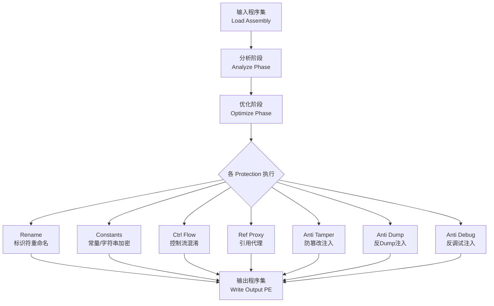
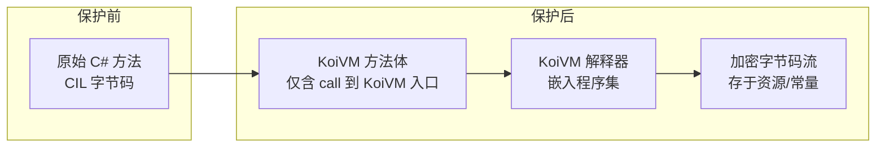
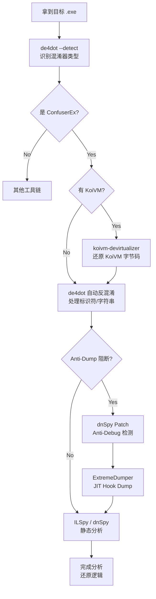

---
tags:
  - WASM
  - 虚拟化壳
  - tier3
  - dotnet
  - confuserex
---
# .NET 混淆与 VM 壳：ConfuserEx

> [!abstract] TL;DR
> .NET 程序集以 CIL（Common Intermediate Language）字节码形式分发，天然可被 ILSpy/dnSpy 一键反编译。ConfuserEx 是最具代表性的开源 .NET 混淆框架，通过标识符重命名、控制流混淆、常量加密、Anti-Tamper 和 Anti-Dump 多层联防来对抗反编译。KoiVM 进一步将 CIL 翻译为自定义虚拟字节码，把分析难度推至与 VMProtect Native 壳相当的水平。反方向的核心工具是 de4dot、dnSpyEx 动态断点与 JIT-dump 技术。本篇从 CLR 执行模型出发，逐层剖析混淆机制、VM 壳原理、反混淆工具链及商业壳对比，全程保持防御/研究视角。

## 概述与定位

### .NET 生态的逆向特殊性

与 x86/x64 Native 二进制不同，.NET 程序集（PE 文件内含 CIL 字节码 + 元数据表）设计之初就是为了跨平台可移植性——这意味着其符号信息、类型信息、方法签名在正常情况下几乎完整保留在二进制中。一个未经保护的 C# WinForms 应用，用 ILSpy 打开后可以得到几乎与源码等价的 C# 还原代码，类名、方法名、字段名一应俱全。

这一特性使得 .NET 程序成为逆向分析者的"软柿子"，也催生了一个独立繁荣的 .NET 混淆/保护工具生态：

- **开源端**：ConfuserEx（最广为人知）、Obfuscar、LoGiC.NET
- **商业端**：.NET Reactor、Eazfuscator、Agile.NET、SmartAssembly、Dotfuscator
- **VM 壳端**：KoiVM（配合 ConfuserEx）、.NET Reactor 的 Native 代码转换、Eazfuscator 的虚拟机保护

本篇以 ConfuserEx + KoiVM 作为核心分析对象，同时覆盖商业壳差异和完整反混淆工具链。

### 与 Native 壳的根本区别

Native 壳（VMProtect、Themida）在 x86 指令集层面操作，JIT 编译完全绕过，反汇编器直面机器码。.NET 壳则必须与 CLR（Common Language Runtime）共存：

| 维度 | Native 壳 | .NET 混淆壳 |
|------|-----------|-------------|
| 操作层次 | x86/x64 机器码 | CIL 字节码 + 元数据 |
| 反编译工具 | IDA Pro / Ghidra | ILSpy / dnSpy / dotPeek |
| 执行依赖 | OS 加载器 | CLR（.NET Framework / .NET Core / Mono） |
| VM 字节码 | 自定义 x86 变种 | 自定义 CIL 变种（如 KoiVM） |
| 核心反制 | Unicorn 模拟、PIN 插桩 | JIT Hook、内存 dump、de4dot |
| 元数据暴露 | 无符号信息 | 方法表、类型系统天然存在 |

理解这张对比表是本章一切分析的起点：.NET 壳无法消灭 CLR 的存在，它只能在 CLR 的规则框架内"污染"数据，使分析工具产生错误输出或分析代价倍增。

---

## 原理与机制

### .NET 执行模型与逆向基础

#### CIL 字节码与方法体结构

CIL（Common Intermediate Language，有时称 MSIL）是 .NET 的平台无关中间语言。每个方法体在 PE 文件中以 `MethodDef` 记录表示，方法体头部有两种格式：

**Tiny 格式**（方法体 ≤ 63 字节，无局部变量，无异常处理器）：
```
[1字节头 | CIL指令流]
头部低2位 = 0b10（Tiny标记）
头部高6位 = 方法体字节数
```

**Fat 格式**（通用格式）：
```
[4字节头 | 局部变量签名token | 最大栈深度 | 方法体大小 | CIL指令流 | 异常处理表]
```

CIL 是栈式虚拟机指令集，典型指令包括：
- `ldarg.0`（加载第一个参数）
- `ldc.i4.s <value>`（加载 int32 短常量）
- `call <methodref>`（调用方法）
- `stloc.0`（弹栈存入局部变量0）
- `br.s <offset>`（短跳转）
- `newobj <ctor>`（创建对象）

#### 元数据表体系

.NET PE 文件包含 `#~`（压缩元数据流）或 `#-`（未压缩）元数据流，内含数十张表：

| 表名 | 内容 |
|------|------|
| `TypeDef` | 类型定义（类名、命名空间、字段/方法偏移） |
| `MethodDef` | 方法定义（名称、签名、方法体RVA） |
| `Field` | 字段定义 |
| `MemberRef` | 外部成员引用 |
| `CustomAttribute` | 自定义属性（Attribute） |
| `AssemblyRef` | 引用的外部程序集 |

#### 三大堆结构

除表外，元数据还包含三个堆（Heap）：

- **`#Strings` 堆**：存放所有标识符字符串（类名、方法名、字段名），以 null 结尾，UTF-8 编码。混淆器最常操作此堆——把 `UserLoginManager` 替换成 `` 这类不可打印字符或随机 Unicode 字符。
- **`#Blob` 堆**：存放方法签名、字段签名等二进制数据，格式为 CompressedUInt 长度前缀 + 内容。
- **`#US` 堆（User Strings）**：存放 IL `ldstr` 指令使用的字符串字面量，以 UTF-16LE 存储，末尾有一个额外字节（0x00 或 0x01）指示字符串是否含高 Unicode 字符。字符串加密主要针对此堆。

理解这三个堆是分析任何 .NET 混淆的前置知识，因为几乎所有混淆都在修改或加密它们。

### .NET 混淆的核心技术分类

#### 1. 标识符重命名（Renaming）

最基础的混淆手段。将 `#Strings` 堆中所有可见标识符替换为无意义名称：

- **简单重命名**：`GetUserById` → `a`、`b`、`c`…（命名空间内唯一即可）
- **不可打印字符重命名**：利用 .NET 规范允许的某些 Unicode 控制字符或特殊字符，生成视觉上完全相同但实际不同的标识符（如零宽字符 `​`），使反编译器显示一片空白或乱码
- **Unicode 转义重命名**：``、`￾` 等字符在合法 CIL 标识符范围内但在大多数 IDE 中无法正常显示

**反制**：de4dot 有专门的 rename 还原模式；dnSpy 的"分析"功能可追踪混淆后的方法调用链。

#### 2. 控制流混淆（Control Flow Obfuscation）

ConfuserEx 的控制流混淆分多个级别：

**Level 1（Jump）**：在直线代码中插入无意义跳转：
```cil
; 原始代码
ldarg.0
call void System.Console::WriteLine(string)
ret

; 混淆后（示意）
br LABEL_A
LABEL_B:
ldarg.0
br LABEL_C
LABEL_A:
br LABEL_B
LABEL_C:
call void System.Console::WriteLine(string)
ret
```

**Level 2（Switch）**：引入状态变量（Dispatcher Pattern），将线性 CIL 转为 switch-dispatch 结构——与 OLLVM 控制流平坦化完全类似，但发生在 CIL 层而非 x86 层：

```cil
ldc.i4 <初始状态值>
stloc.s STATE
DISPATCH:
  ldloc.s STATE
  switch (BLOCK_0, BLOCK_1, BLOCK_2, BLOCK_3)
  br FALLTHROUGH

BLOCK_0:
  ; 第0块代码
  ldc.i4 <下一状态>
  stloc.s STATE
  br DISPATCH

BLOCK_1:
  ; 第1块代码
  ...
```

分析此结构时需要追踪 `STATE` 变量的赋值路径，还原真实执行顺序。

**Level 3（不透明谓词）**：插入永远为真或永远为假的条件，但静态分析工具无法判断其值（通常依赖运行时计算出的常量）：
```cil
call int32 SomeObfuscatedMethod::GetConstant()
ldc.i4.0
ceq                   ; 实际运行时永远为 false，但静态分析无法确定
brtrue FAKE_BRANCH    ; 永远不执行的分支
; 真正的代码
```

#### 3. 字符串加密（String Encryption）

ConfuserEx 将 `ldstr` 指令的目标从 `#US` 堆移除，替换为对解密方法的调用：

```cil
; 原始
ldstr "Hello, World!"
call void System.Console::WriteLine(string)

; 加密后
ldc.i4 <密文索引>
call string ConfuserRuntime.Strings::Get(int32)
call void System.Console::WriteLine(string)
```

`ConfuserRuntime.Strings::Get` 在运行时从加密资源中解密字符串。具体加密算法因 ConfuserEx 版本而异，常见有 XOR、AES-128、DES。密钥通常从程序集的某些元数据计算（如模块 MVID 的哈希）以与特定程序集绑定（Anti-Tamper 的一部分）。

#### 4. 引用代理（Reference Proxying）

将对外部方法的直接调用（`call`/`callvirt`）替换为通过委托（Delegate）的间接调用：

```csharp
// 原始
Console.WriteLine("test");

// 代理后（反编译近似）
Proxy_0001.Invoke("test");  // Proxy_0001 是一个 Action<string>，在运行时初始化
```

反编译器无法静态确定 `Proxy_0001` 的实际目标，因为委托的 `Target` 字段在运行时赋值。这严重干扰基于调用图的分析。

#### 5. Anti-Tamper（防篡改）

ConfuserEx 的 Anti-Tamper 在程序集加载时校验自身完整性。实现方式：

1. 在程序集的特定资源或节（Section）中嵌入一个预计算的哈希值（通常是 SHA-256 或基于 CRC 的自定义哈希）
2. 运行时（通过 `Module.ModuleInitializer` 或类静态构造函数提前执行）重新计算当前程序集的哈希
3. 若与存储值不符（即文件被修改），则强制终止进程或引发不可预料的行为

高级模式下，Anti-Tamper 与加密密钥绑定：解密字符串/常量所需的密钥由程序集哈希推导，篡改文件后密钥失效，所有解密结果变为乱码，程序无法正常运行。这使得"先 patch 再运行"的传统脱壳思路失效。

#### 6. Anti-Dump（反内存转储）

Anti-Dump 通过在运行时修改内存中的元数据结构来阻止从进程内存重建程序集：

- 清零或随机化 PE 头中的某些字段（如 `OptionalHeader.MajorLinkerVersion`）
- 修改内存中 `MethodDef` 表项的 RVA，使其指向无效地址（真实方法体仍在内存中，但位置被混淆）
- 清除 `#Strings` 堆中的原始数据（如果字符串已被加密，则原文本不再需要）

针对 Anti-Dump，传统 dump 工具（如 MegaDumper）会失败。需要使用理解 CLR 内部结构的专用工具（如 ExtremeDumper、SpecialDumper），它们直接枚举 CLR 内部的方法描述符（`MethodDesc`）而非依赖 PE 元数据。

#### 7. Anti-Debug（反调试）

ConfuserEx 的 Anti-Debug 模块检测常见 .NET 调试手段：

- `System.Diagnostics.Debugger.IsAttached`：最简单的 .NET 调试器检测 API
- `Environment.GetEnvironmentVariable("COR_ENABLE_PROFILING")`：检测 .NET Profiling API（某些调试框架依赖此环境变量）
- 时序检测：对特定代码块计时，若执行时间远超预期（调试器单步会放大时间），触发保护
- 线程枚举：检测是否存在调试器常用的辅助线程（如 Helper Thread）

---

## 结构/算法/伪代码详解

### ConfuserEx 保护管道（Protection Pipeline）

ConfuserEx 的架构以"保护管道"为核心，每个保护措施是一个 `Protection` 子类，通过配置文件（`project.crproj`）声明激活：

```xml
<project outputDir="output" baseDir="." xmlns="http://confuser.codeplex.com">
  <module path="target.exe">
    <protection id="rename" />
    <protection id="ctrl flow">
      <argument name="type" value="switch" />
    </protection>
    <protection id="constants" />
    <protection id="anti debug" />
    <protection id="anti dump" />
    <protection id="anti tamper" />
    <protection id="ref proxy" />
    <protection id="resources" />
  </module>
</project>
```

管道执行顺序（简化）：



各阶段的详细机制：

**分析阶段**：ConfuserEx 构建程序集的完整依赖图，确定哪些标识符被外部程序集引用（`public` API 不能随意重命名，否则破坏接口契约）。

**常量加密（Constants Protection）**：

```
输入: 方法体中所有 ldc.i4/ldc.i8/ldc.r4/ldc.r8/ldstr 指令
步骤:
1. 提取所有字面量，生成加密字节数组
2. 为每个常量分配索引
3. 将原 ldXXX 指令替换为:
   ldc.i4 <索引>
   call <解密方法>
   [castclass/unbox 到原类型]
4. 生成运行时解密类，嵌入程序集资源
5. 解密密钥 = f(程序集MVID, 模块名哈希) — 与特定文件绑定
```

**控制流混淆（Switch Dispatcher）算法**：

```
输入: 方法的基本块列表 [B0, B1, B2, ..., Bn]
步骤:
1. 为每个基本块分配随机状态值 S_i（32位整数）
2. 在方法入口插入:
   ldc.i4 <S_0初始状态>
   stloc STATE_VAR
3. 生成主 Dispatcher:
   LOOP:
     ldloc STATE_VAR
     ldc.i4 <分支数>
     rem        ; 取模，映射到switch table
     switch [HANDLER_0, HANDLER_1, ..., HANDLER_n]
4. 每个 HANDLER_i:
   [对应基本块的代码]
   ldc.i4 <后继状态S_j>
   stloc STATE_VAR
   br LOOP      ; 回到分发器
5. 对 STATE_VAR 的更新有时使用数学变换:
   ldc.i4 <S_j XOR MASK>
   ldc.i4 <MASK>
   xor
   stloc STATE_VAR   ; 效果等同直接赋值，但静态分析更难追踪
```

### KoiVM：.NET 层的 VM 壳

KoiVM 是 ConfuserEx 的一个插件（原作者 yck1509 所写，后被整合进多个 ConfuserEx 分支），实现了真正意义上的 .NET VM 保护——将 CIL 字节码翻译为 KoiVM 自定义字节码，并嵌入一个用 C# 实现的解释器。

#### KoiVM 架构



#### KoiVM 虚拟寄存器模型

KoiVM 定义了一套虚拟寄存器，模拟 CLR 的求值栈和局部变量：

| 寄存器 | 用途 |
|--------|------|
| `BP`（Base Pointer） | 调用帧基址 |
| `SP`（Stack Pointer） | 虚拟栈顶 |
| `IP`（Instruction Pointer） | 当前字节码位置 |
| `K1..K8`（Key Registers） | 通用寄存器，对应 CIL 求值栈槽位 |
| `R0..R7` | 局部变量寄存器 |
| `FL`（Flags） | 条件标志（Zero/Sign/Overflow/Carry） |

#### KoiVM 字节码示例（反编译近似）

原始 C# 代码：
```csharp
public static int Add(int a, int b) {
    return a + b;
}
```

KoiVM 字节码（概念性，实际操作码为混淆后的整数）：
```
PUSH_ARG 0      ; 加载参数a到K1
PUSH_ARG 1      ; 加载参数b到K2
ADD_I32         ; K1 = K1 + K2
RET             ; 返回K1
```

每次重新混淆，操作码值（opcode）会随机洗牌（Shuffled Opcode Table），即同一语义的指令在不同混淆实例中对应不同的整数值，使得操作码表分析需要重新进行。

#### KoiVM 的 Handler 结构

解释器的 Dispatcher 是一个大 `switch` 语句（C# 编译为 CIL `switch` 指令），每个 case 对应一个 Handler：

```csharp
// KoiVM 解释器核心循环（示意）
while (true) {
    byte opcode = bytecodeStream[ctx.IP++];
    switch (opcode) {
        case OP_NOP: break;
        case OP_PUSH_I32: ctx.K1 = Read_i32(bytecodeStream, ref ctx.IP); break;
        case OP_ADD_I32: ctx.K1 = (int)((int)ctx.K1 + (int)ctx.K2); break;
        case OP_BR: ctx.IP = Read_i32(bytecodeStream, ref ctx.IP); break;
        case OP_RET: return ctx.K1;
        // ... 数十个 Handler
    }
}
```

逆向 KoiVM 的核心任务与逆向 VMProtect 高度类似：
1. 定位解释器入口（通常是被 VM 保护的方法替换为对解释器的 call）
2. 枚举所有 Handler，映射操作码数值 → 语义
3. 提取加密字节码流
4. 解密并反汇编为伪 CIL
5. 可选：将伪 CIL 提升回真实 CIL，注入回程序集

---

## 工具视角与实战

### 静态分析工具链

#### dnSpy / dnSpyEx

dnSpyEx（dnSpy 的社区维护分支，支持 .NET 6+）是 .NET 逆向的核心工具，集成了：

- **ILSpy 反编译引擎**：将 CIL 反编译为 C# / F# / VB.NET
- **调试器**：直接调试 .NET 程序集，支持在 CIL 或 C# 层设置断点
- **十六进制编辑器**：直接编辑 PE 中的 CIL 字节流
- **元数据浏览器**：查看所有元数据表、堆内容

对付 ConfuserEx 混淆时，dnSpy 的核心用法：

1. **条件断点 + 内存 dump**：在 `Module.GetMethod()` 或 JIT 相关方法（`ICorJitCompiler::compileMethod`）设置断点，在方法被 JIT 编译前 dump 其方法体（此时 Anti-Dump 修改还未生效，或即使已生效，CLR 内部的 `MethodDesc` 仍指向有效 IL）
2. **Watch 窗口追踪字符串**：在字符串解密方法返回处设断点，利用 Watch 窗口批量获取解密后字符串
3. **Edit Method Body**：直接在 IL 层 patch 掉 Anti-Debug 检测，无需理解其完整逻辑

#### ILSpy

纯静态反编译器，无调试功能，但支持插件扩展（如 ILSpy ConfuserEx 反混淆插件）。轻量场景下的首选。

#### dotPeek

JetBrains 出品，反编译质量高，但对重度混淆的处理不如 dnSpy 灵活。

### de4dot：通用反混淆框架

de4dot 是 .NET 反混淆领域的瑞士军刀，支持数十种混淆器的自动化检测与反混淆：

```bash
# 基本用法：自动检测混淆器并反混淆
de4dot.exe target.exe

# 指定混淆器类型（提高准确性）
de4dot.exe --detect target.exe           # 仅检测，不修改
de4dot.exe -f target.exe -o output.exe   # 指定输出文件

# 针对 ConfuserEx
de4dot.exe target.exe --dont-rename       # 跳过重命名还原（调试用）
de4dot.exe target.exe --keep-types        # 保留原始类型信息
```

de4dot 对 ConfuserEx 的处理能力：

| 混淆类型 | de4dot 能力 |
|---------|------------|
| 标识符重命名 | 自动还原（基于模式匹配） |
| 简单控制流（Jump级） | 完全还原 |
| Switch Dispatcher | 部分还原（依赖版本） |
| 字符串加密 | 自动解密（运行时调用） |
| Anti-Tamper | 需要运行时环境配合 |
| Anti-Dump | 无法处理（需专用工具） |
| KoiVM | 无法处理（需专用工具） |

#### ConfuserEx 专用 Unpacker 工具

社区针对 ConfuserEx 的具体实现开发了专项工具：

- **ConfuserExUnpacker**：针对特定版本 ConfuserEx 的常量解密和控制流还原
- **ConfuserEx-Static-Unpacker**：通过模拟执行方法初始化器来提取解密后的字符串，无需完整运行程序
- **KoiVM Devirtualizer（koivm-devirtualizer）**：专门分析 KoiVM 字节码，枚举 Handler 并提升为 CIL

### JIT Hook 与运行时 Dump

当静态分析完全被 Anti-Dump 阻断时，转向运行时 dump：

#### 方法 1：CLR Profiling API

.NET 提供官方的 Profiling API（`ICorProfilerCallback` 接口），允许外部组件在方法编译前/后接到通知。但 Anti-Debug 通常会检测 `COR_ENABLE_PROFILING` 环境变量。

绕过方式：通过 ptrace（Linux）或 WriteProcessMemory（Windows）直接注入，绕过环境变量检测。

#### 方法 2：JIT Hook

直接 hook CLR 内部的 `ICorJitCompiler::compileMethod` 函数：

1. 找到 `clrjit.dll`（.NET Framework）或 `coreclr.dll`（.NET Core）中导出的 `getJit()` 函数
2. 调用 `getJit()` 获取 `ICorJitCompiler` 接口指针
3. 通过 VTable 找到 `compileMethod` 函数指针
4. 使用 Detours 或 MinHook 安装 hook
5. 在 hook 中，每次方法被 JIT 编译时，`ILCode` 参数指向原始 CIL 字节码，此时可以 dump

伪代码：
```cpp
// Hook 安装（简化）
ICorJitCompiler* jit = getJit();
// VTable偏移0通常是compileMethod
OrigCompileMethod = *(DWORD**)jit)[0];
*(DWORD**)jit)[0] = (DWORD)HookedCompileMethod;

// Hook 实现
CorJitResult HookedCompileMethod(
    ICorJitCompiler* self,
    ICorJitInfo* comp,
    CORINFO_METHOD_INFO* info, ...) 
{
    // info->ILCode 指向原始CIL（混淆前，在内存中已解密）
    DumpMethodBody(info->ILCode, info->ILCodeSize, info->ftn);
    return OrigCompileMethod(self, comp, info, ...);
}
```

此方法可以绕过所有基于文件的 Anti-Dump（因为我们在 CLR 解密后、JIT 编译前 dump），是目前最可靠的运行时 dump 方案。

#### ExtremeDumper 与 SpecialDumper

ExtremeDumper 使用上述 JIT Hook 原理，支持：
- 自动枚举目标进程的所有 .NET 模块
- 通过 `MethodDesc` 链表遍历所有方法（绕过被修改的元数据）
- 重建完整的 PE 文件（包括修复被 Anti-Dump 破坏的头部）

### 实战分析流程



---

## 安全性与正确使用

> [!caution]
> .NET 脱壳、反混淆与 VM 逆向技术仅可用于以下合法场景：**自有程序的保护机制验证**、**恶意软件样本的安全分析（需隔离环境）**、**经授权的安全研究与渗透测试**、**CTF 竞赛题目分析**。严禁将上述技术用于破解商业软件授权、绕过许可证校验以获取免费使用权、盗版分发受版权保护的程序集或协助他人实施上述行为。违反上述原则在多数法域下构成《计算机欺诈与滥用法》（CFAA，美国）、《计算机信息系统安全保护条例》（中国）或《计算机滥用法》（英国）等法规规定的违法行为。本章所有内容以保护机制理解与防御研究为唯一出发点。

### 合法保护工程实践

如果你是需要保护 .NET 程序的开发者，以下是基于本章知识得出的防御建议：

**叠加保护的必要性**：单一混淆手段极易被专项工具破解。有效保护需要至少叠加：重命名 + 字符串加密 + 控制流混淆 + Anti-Tamper + 关键逻辑 Native 化（p/invoke 到 C++ DLL 或通过 NativeAOT 编译）。

**密钥绑定设计**：Anti-Tamper 与加密密钥的绑定应覆盖尽可能多的文件特征，包括程序集公钥（Strong Name）、代码签名证书指纹、部署时的机器 ID（硬件指纹）。纯文件内容哈希在某些情况下可被绕过（重打包时同步更新存储的哈希）。

**Native 化关键路径**：license 校验、加密密钥推导等核心逻辑不应留在 CIL 层。.NET 7+ 的 NativeAOT 可以将整个程序集编译为 Native 代码，从根本上消除 CIL 反编译风险；或将关键函数 p/invoke 到经过 Native 壳（VMProtect 等）保护的 DLL。

**服务端验证**：最终防线应是服务端 API 校验（许可证校验请求、功能激活请求均在服务端执行），因为客户端任何形式的保护在有足够动机的攻击者面前最终都是可绕过的。

### 恶意软件分析场景

以 ConfuserEx 保护的恶意软件为例（如 RAT、Stealers），分析时的额外注意事项：

- **隔离环境**：在快照状态的虚拟机中运行，绝不在生产机器上执行
- **网络隔离**：切断 C2 通信（修改 hosts 文件或使用 FakeNet-NG 模拟响应），避免真实上线
- **Anti-Dump 检测的处置顺序**：先 patch Anti-Debug（使调试器可附加），再处理 Anti-Dump（使用 ExtremeDumper），最后分析解密后的核心逻辑（查找 C2 地址、加密算法、数据收集模块）
- **字符串提取的价值**：恶意软件通常使用 ConfuserEx 字符串加密隐藏 C2 IP/域名、注册表键、API 名称；de4dot 的字符串解密功能可以在不运行程序的情况下提取这些 IoC（Indicator of Compromise）

---

## 小结

本章从 .NET CLR 的执行模型出发，系统梳理了 .NET 混淆与 VM 壳的完整技术栈：

**基础层**：CIL 字节码是 .NET 安全分析的操作目标，元数据表（TypeDef/MethodDef）和三大堆（#Strings/#Blob/#US）是混淆器的主要操作对象，理解其结构是一切分析的前提。

**混淆技术层**：ConfuserEx 以保护管道为架构，将标识符重命名、控制流混淆（Jump/Switch/不透明谓词）、字符串/常量加密、引用代理、Anti-Tamper、Anti-Dump、Anti-Debug 组合为多层联防体系。各层之间有依赖关系（Anti-Tamper 会影响密钥生成），单独攻破任一层不等于完全还原。

**VM 壳层**：KoiVM 将 CIL 提升到自定义字节码的独立抽象层，引入虚拟寄存器、加密字节码流和 Shuffled Opcode Table，使分析难度与 VMProtect Native 壳相当。核心逆向任务是 Handler 枚举 + 操作码映射 + 字节码提升。

**工具反制层**：de4dot 处理大多数标识符和字符串混淆；dnSpyEx 提供动态调试能力（在 JIT 前 dump）；ExtremeDumper 绕过 Anti-Dump；koivm-devirtualizer 处理 KoiVM 虚拟化。这四个工具构成 ConfuserEx 反混淆的核心工具链。

**与 Native 壳的关键差异**：.NET 壳无法消灭 CLR，CLR 的 JIT 编译过程必然在内存中生成可 dump 的原始 CIL，这是 .NET 保护的本质局限。提升安全性的最终手段是将关键逻辑迁移至 Native 层（NativeAOT 或 p/invoke + Native 壳）或服务端实施。

---

## 相关阅读

- [[00.WASM与虚拟化壳逆向总览|系列总览]] — 壳逆向全局知识图谱
- [[09.虚拟化保护壳总览|09 虚拟化保护壳总览]] — VMProtect/Themida/Code Virtualizer 对比与 VM 四大组件
- [[10.VM字节码与Handler分析|10 VM 字节码与 Handler 分析]] — Dispatcher 定位、Handler 枚举通用方法论
- [[12.VMProtect逆向实战|12 VMProtect 逆向实战]] — Native VM 壳的对应实战，与本章 KoiVM 形成横向对比
- [[13.VM壳自动化分析|13 VM 壳自动化分析]] — 符号执行在 VM Handler 分析中的应用
- [[19.Unicorn与Qiling模拟脱壳|19 Unicorn 与 Qiling 模拟脱壳]] — 模拟执行框架在 Native 脱壳中的应用
- **外部参考**：dnSpyEx GitHub（dnSpyEx/dnSpy）；de4dot GitHub（de4dot/de4dot）；ConfuserEx GitHub（yck1509/ConfuserEx）；《.NET IL Assembler》（Serge Lidin，Apress）

---

[[00.WASM与虚拟化壳逆向总览|⬆ 系列总览]] | [[19.Unicorn与Qiling模拟脱壳|← 上一章]] | [[21.WASI与WASM组件模型|→ 下一章]]
