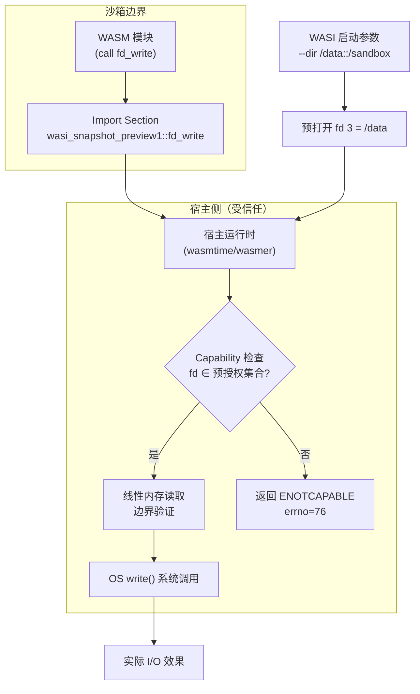

---
tags:
  - WASM
  - 虚拟化壳
  - tier3
  - WASI
  - 组件模型
---
# WASI 与 WASM 组件模型

> [!abstract] TL;DR
> WASM 沙箱的纯栈式虚拟机无法直接进行系统调用，WASI（WebAssembly System Interface）通过宿主侧导入函数为 WASM 模块补充 I/O、文件、时钟等系统能力，同时用 capability-based 安全模型取代传统的 ambient authority，彻底消除意外越权。WASI Preview1 定义了 `wasi_snapshot_preview1` 导入模块下约 50 个宿主函数；Preview2 与 Component Model 引入 WIT（WebAssembly Interface Types）接口描述语言、接口类型系统和 world 概念，将 WASM 从单模块提升为可组合的软件构件。对逆向研究者而言，识别 WASI 导入函数的集合即可判断模块的能力边界，进而推断沙箱逃逸面、分析密钥校验/授权逻辑被下沉到 WASI 模块的保护场景。

## 概述与定位

### WASM 沙箱的能力空白

WASM 规范本身（第 01 章已详述）定义了一个纯粹的计算沙箱：线性内存、值栈、局部变量、控制流指令以及四类数值类型（i32/i64/f32/f64）。模块与宿主环境之间的唯一交互通道是**导入/导出（import/export）**机制——模块声明它需要哪些外部函数，宿主在实例化时把它们"插"进来。

这一设计有意切断了模块访问底层操作系统的所有路径：没有系统调用指令、没有内存映射 I/O 地址、没有任何形式的 `syscall`。这种彻底的隔离是 WASM 安全性的基石，但也意味着任何需要文件 I/O、网络、时钟、随机数的实际应用，必须依赖宿主侧提供相应的导入函数。

在浏览器环境中，宿主是 JavaScript 引擎：Emscripten 工具链自动生成一层 JavaScript 胶水代码，把 `read`/`write`/`mmap` 等 C 语言调用翻译成 `WebAssembly.Memory` 操作或 Web API 调用（第 07 章对此已详细分析）。但当 WASM 走出浏览器、运行在服务器、边缘节点或嵌入式系统时，不存在统一的 JavaScript 运行时，每个宿主都会发明自己的一套导入函数。这直接导致：

- **互操作性为零**：为 wasmtime 编写的 WASM 模块无法不加修改地在 wasmer 中运行，因为宿主函数签名各不相同。
- **工具链碎片化**：编译器无法生成通用的系统调用层，必须针对每个运行时定制。
- **逆向分析困难**：分析者面对一个 WASM 模块时，不知道那些导入函数对应哪些操作系统语义。

WASI（WebAssembly System Interface）正是为解决上述问题而设计的标准化宿主接口层。其核心思想借鉴了 POSIX，但用 capability-based 模型替换了传统 Unix 的 ambient authority（环境权限），从而在提供系统调用能力的同时保留并强化了沙箱安全性。

### WASI 在系列中的定位

本系列第 01 章讲 WASM 二进制格式，第 06 章讲线性内存安全，第 07 章讲 WASM 作为混淆壳的浏览器环境。本章聚焦 **WASM 在浏览器外的执行环境**——WASI 运行时场景——以及 Component Model 为多模块组合带来的新的逆向分析维度。

理解 WASI 的意义在于：

1. 当一个被保护的程序将授权校验逻辑编译为 WASM+WASI 模块并在服务端运行时，逆向分析者需要知道哪些导入函数映射到哪些 OS 语义，才能重建其行为模型。
2. capability 模型决定了沙箱逃逸面的边界——分析 WASI 导入集合，可以直接推断模块能够访问哪些文件路径、网络资源。
3. Component Model 引入了类型级别的接口封装，增加了通过 WIT 文件恢复语义的额外分析路径。

---

## 原理与机制

### WASI Preview1：wasi_snapshot_preview1

WASI Preview1（稳定版，也称 "wasi_unstable" 的后继）以模块名 `wasi_snapshot_preview1` 向 WASM 模块导出约 50 个宿主函数。这些函数被组织为几个功能族：

#### 文件描述符操作族

| 函数 | 语义 | 参数概要 |
|------|------|----------|
| `fd_read` | 从 fd 读取数据到多段 iovec | `(fd, iovs_ptr, iovs_len, nread_ptr) → errno` |
| `fd_write` | 向 fd 写出多段 iovec | `(fd, iovs_ptr, iovs_len, nwritten_ptr) → errno` |
| `fd_seek` | 移动 fd 偏移量 | `(fd, offset, whence, newoffset_ptr) → errno` |
| `fd_close` | 关闭 fd | `(fd) → errno` |
| `fd_fdstat_get` | 获取 fd 元数据（类型/权限） | `(fd, stat_ptr) → errno` |
| `fd_fdstat_set_flags` | 修改 fd 标志（如 nonblock） | `(fd, flags) → errno` |
| `fd_prestat_get` | 获取预打开目录元数据 | `(fd, buf_ptr) → errno` |
| `fd_prestat_dir_name` | 获取预打开目录路径 | `(fd, path_ptr, path_len) → errno` |
| `fd_readdir` | 读取目录项 | `(fd, buf_ptr, buf_len, cookie, bufused_ptr) → errno` |

其中 `fd_prestat_get` 和 `fd_prestat_dir_name` 是 WASI capability 模型的核心入口：模块启动时，宿主将已预先授权的目录以固定 fd 号传入，模块通过枚举这两个函数来发现自己被授权访问哪些路径。

#### 文件路径操作族

| 函数 | 语义 |
|------|------|
| `path_open` | 在预打开目录下打开文件/子目录 |
| `path_create_directory` | 创建目录 |
| `path_remove_directory` | 删除目录 |
| `path_unlink_file` | 删除文件 |
| `path_rename` | 重命名文件 |
| `path_readlink` | 读取符号链接目标 |
| `path_symlink` | 创建符号链接 |
| `path_filestat_get` | 获取文件元数据 |
| `path_filestat_set_times` | 修改文件时间戳 |

`path_open` 是最关键的函数，其签名为：

```
path_open(
  dirfd: fd,          // 必须是预打开 fd 或由此派生的子 fd
  dirflags: lookupflags,
  path: *const u8,   // 相对路径（不可含 ".." 越过预打开根）
  path_len: size,
  oflags: oflags,
  fs_rights_base: rights,
  fs_rights_inheriting: rights,
  fdflags: fdflags,
  opened_fd: *mut fd
) → errno
```

关键约束：`path` 参数是相对于 `dirfd` 的**相对路径**，且运行时必须拒绝可能越过预打开根目录的路径（如 `../../etc/passwd`）。这意味着 WASM 模块无法通过构造路径字符串访问超出授权范围的文件系统位置，这是 WASI 沙箱隔离的直接实现。

#### 时钟与随机数族

| 函数 | 语义 |
|------|------|
| `clock_time_get` | 获取时钟时间（墙钟/单调时钟） |
| `clock_res_get` | 获取时钟分辨率 |
| `random_get` | 填充随机字节 |

`clock_time_get` 的第一参数 `clock_id` 为 0 表示墙钟时间（`CLOCK_REALTIME`），为 1 表示单调时钟（`CLOCK_MONOTONIC`）。逆向分析时如果看到模块大量调用 `clock_time_get` 并进行差值比较，通常是时序反调试检测逻辑（与第 05 章 WASM 动态分析章节的反调试讨论相呼应）。

#### 进程控制族

| 函数 | 语义 |
|------|------|
| `proc_exit` | 终止进程并返回退出码 |
| `proc_raise` | 向进程发送信号（实现受限） |
| `sched_yield` | 让出 CPU 时间片 |

`proc_exit` 是最常见的进程终止入口，对应 C 语言的 `_exit()`。在授权校验场景中，如果校验失败，`proc_exit(1)` 的调用路径会在 WAT/反编译伪代码中直接可见，是定位校验逻辑的重要线索。

#### 套接字族（WASI Sockets，Preview1 扩展）

Preview1 标准本身不含完整套接字支持，但许多运行时（wasmtime、WasmEdge）在 `wasi_snapshot_preview1` 或独立模块名下添加了 `sock_accept`/`sock_recv`/`sock_send`/`sock_shutdown` 等扩展。分析网络型 WASM 模块时需要注意运行时特定的扩展函数。

### Capability-Based 安全模型详解

WASI 的安全模型是其与传统 POSIX 最核心的差异。理解这一差异对于正确评估 WASI 沙箱的逃逸面至关重要。

#### 传统 Unix 的 Ambient Authority

Unix 进程拥有"环境权限"：一个进程通过用户 ID/组 ID 隐式拥有访问整个文件系统的权限（在其有效 UID 允许的范围内）。权限检查发生在调用 `open()` 时，基于调用进程的 UID 和文件的 ACL 比较——但这两者都是"环境变量"，由进程隐式继承，无需显式传递。

这导致了经典的"confused deputy"问题：一个高权限服务进程如果被欺骗去操作一个意外的文件路径，它会以自己的高权限执行该操作，因为权限检查只看调用者身份，不看调用者是否应该操作该路径。

#### WASI 的 Capability 模型

WASI 用能力（capability）完全替换环境权限：

1. **无 ambient authority**：WASM 模块没有任何隐式权限。它不知道也无法访问宿主文件系统上的任何位置，除非宿主显式将某个 fd 传递给它。

2. **预打开目录（preopen）**：宿主在启动模块前，将允许访问的目录以文件描述符形式预先打开，并以固定的 fd 号（通常从 3 开始，0/1/2 分别为 stdin/stdout/stderr）传给模块。模块通过枚举 `fd_prestat_get` 发现这些预打开 fd 及其对应路径。

3. **能力传播规则**：模块只能对预打开 fd 或由此通过 `path_open` 派生出的子 fd 执行操作。它无法通过构造绝对路径或 `..` 相对路径突破预打开根目录边界。

4. **权限的显式传递**：如果模块需要访问新位置，必须由宿主（或模块间的 RPC）显式传递新的 fd。这消除了 confused deputy 的攻击面。

能力模型的形式化表述如下：

- 令 $C$ 为模块持有的能力集合（即所有预打开 fd 及其 rights 字段所表达的权限）。
- 模块的任何操作 $op(path)$ 成立当且仅当 $\exists fd \in C$ 使得 $path$ 是 $fd$ 所指目录的合法子路径，且 $fd$ 的 `fs_rights_base` 字段包含 $op$ 对应的权限位。
- 不存在任何机制允许模块从 $C$ 以外获取能力，除非宿主显式扩展 $C$。

这一模型与第 06 章讨论的线性内存安全形成两个正交的安全维度：线性内存安全保护同一模块内的内存安全，capability 模型保护模块与宿主环境之间的资源隔离。

### WASI Preview2 与 Component Model

2023 年后，WASI 进入 Preview2 阶段，与 WASM 组件模型（Component Model）深度融合。这是 WASM 生态最重要的架构演进，也为逆向分析带来了全新的分析维度。

#### WASM 组件模型（Component Model）

传统 WASM 模块只有一个层次：单模块，通过 import/export 机制交互。Component Model 引入了第二个层次：**组件（Component）**，是一个或多个模块的封装，对外只暴露由 WIT 描述的类型安全接口。

组件模型的核心概念：

- **Component**：包含一个或多个 core WASM 模块，外加元数据（类型定义、接口绑定）。二进制格式扩展了 WASM Module 的 Section 结构，增加了 `component`、`alias`、`type`、`instance` 等新 Section ID。

- **WIT（WebAssembly Interface Types）**：接口定义语言，用于描述组件的导入/导出接口。语法类似 Rust 的 trait 定义，支持 `u8`/`u32`/`string`/`list<T>`/`record`/`variant`/`option<T>`/`result<T, E>` 等类型。

- **World**：WIT 的顶层概念，描述一个组件对外呈现的完整接口——它 import 哪些接口（依赖），export 哪些接口（能力）。一个 world 类似于一个 Rust trait 的实现契约。

- **Interface Types**：连接 core WASM 的 `i32`/`i64`/`f32`/`f64` 数值世界与高层语义类型（字符串、记录、变体等）的桥梁。通过 "canonical ABI"（规范 ABI）规定如何在线性内存中编码/解码复杂类型。

- **Linking**：组件间通过类型安全的接口链接，而非直接的 import/export 名称匹配。这使得接口契约在链接时可验证，而非仅在运行时动态检查。

#### WIT 语法示例

```wit
// example.wit
package example:keycheck;

interface verifier {
  // 接受 license-key 字符串，返回是否有效及授权特性列表
  record check-result {
    valid: bool,
    features: list<string>,
    expiry-timestamp: option<u64>,
  }

  verify-key: func(key: string) -> result<check-result, string>;
}

world key-verifier {
  import wasi:clocks/wall-clock;    // 依赖 WASI 时钟接口
  export verifier;                   // 导出校验接口
}
```

对逆向分析者而言，若能提取到 `.wit` 文件或从组件二进制中还原 WIT 定义，相当于直接获得了模块接口的语义规范——这比从 WASM 二进制中逆向推断函数语义要高效得多。

#### Canonical ABI：线性内存中的类型编码

Component Model 的 Canonical ABI 定义了复杂类型在线性内存中的表示方式，这是分析组件内部数据流的关键：

- **string**：指针（i32）+ 长度（i32）的二元组，字符编码为 UTF-8。
- **list\<T\>**：指针（i32）+ 元素数量（i32）。
- **record**：各字段按声明顺序连续存放，遵循自然对齐规则。
- **variant**：判别符（discriminant，通常 i32）+ 最大有效负载大小的联合体。
- **option\<T\>**：判别符（0=None, 1=Some）+ 有效负载。
- **result\<T, E\>**：判别符（0=Ok, 1=Err）+ 有效负载。

理解 Canonical ABI 使得分析者在反编译伪代码中看到模式化的内存读写序列时，能够识别出它们对应哪种高层类型——这与第 06 章分析 Emscripten 堆布局的方法论一脉相承。

### 运行时生态

WASI 规范需要运行时实现才能落地。理解各运行时的实现差异，有助于判断被分析的 WASM 模块在哪个环境中运行以及其运行时特有行为。

#### wasmtime

Mozilla/Bytecode Alliance 主导的 Rust 实现，是 WASI 规范的参考实现。

- 支持 WASI Preview1（完整）和 Preview2（持续推进中）
- 提供 `--dir` 标志指定预打开目录，`--env` 传递环境变量
- 支持 AOT 编译（`wasmtime compile`）：将 WASM 模块预编译为平台原生代码，存储为 `.cwasm` 格式，大幅提升启动性能
- Cranelift 后端生成原生代码，逆向分析 `.cwasm` 时需要针对 Cranelift 的代码生成模式（如寄存器分配、影子栈）进行适配
- 提供 `--allow-precompiled` 加载预编译产物，也是安全边界之一

#### wasmer

WebAssembly.sh 团队开发，多后端设计：

- 支持 Cranelift、LLVM、Singlepass 三种编译后端
- LLVM 后端生成代码质量最高，但编译慢；Singlepass 用于快速 JIT
- `wasmer run --mapdir /tmp:./sandbox_tmp module.wasm`：`--mapdir` 映射本地目录到 WASM 可见路径，是 preopen 的 wasmer 语法
- wasmer 的 WAPM 包仓库允许分发 WASM 模块，是获取待分析样本的来源之一

#### WasmEdge

面向云原生/边缘计算场景的运行时，CNCF 孵化项目：

- 对 WASI 网络扩展（`wasi_snapshot_preview1` 之外的 socket 接口）实现较完整
- 支持 Kubernetes 容器运行时接口（CRI），可直接作为容器运行时替代 Docker
- 提供 NVIDIA GPU 扩展（WASI-NN 接口）：用于推理场景的 WASM 模块
- 在边缘 AI/安全检测场景中，WasmEdge 模块可能包含模型推理逻辑，逆向分析时需注意 WASI-NN 的导入函数模式

#### Node.js / Deno

- Node.js 22+ 提供原生 WASI 支持（`node:wasi` 模块），不需要额外依赖
- Deno 使用 wasmtime 作为 WASI 后端
- 在这两个环境中运行的 WASM 模块，其导入的 `wasi_snapshot_preview1` 函数与独立运行时完全相同

#### 服务端/边缘 WASM 框架

| 框架 | 后端运行时 | 典型场景 |
|------|-----------|---------|
| Fastly Compute | 自研 Lucet（已迁移到 wasmtime） | CDN 边缘逻辑处理 |
| Fermyon Spin | wasmtime | 微服务/FaaS |
| AWS Lambda WASM | wasmtime | 无服务器函数 |
| Cloudflare Workers | V8 Isolates（非标准 WASI） | 边缘计算（注意：CF 不用标准 WASI） |

Cloudflare Workers 需要特别注意：它使用 V8 的 JavaScript 隔离，WASM 模块通过 JavaScript 胶水层运行，其导入接口是 Workers 平台的专有 API，而非标准 WASI。这与本章讨论的标准 WASI 生态有本质区别。

---

## 结构/算法/伪代码详解

### WASM 模块 Import Section 中的 WASI 特征

WASM 二进制 Import Section（Section ID 0x02）列出所有导入项，每项包含模块名（`mod_name`）和字段名（`field_name`）。WASI Preview1 模块的导入项具有以下特征模式：

```
Import Entry:
  mod_name:   "wasi_snapshot_preview1"
  field_name: "fd_read" | "fd_write" | "path_open" | ...
  desc:       FuncType → (参数表) → (返回值表)
```

在 WAT 文本格式中表现为：

```wat
(module
  (import "wasi_snapshot_preview1" "fd_write"
    (func $fd_write (param i32 i32 i32 i32) (result i32)))
  (import "wasi_snapshot_preview1" "proc_exit"
    (func $proc_exit (param i32)))
  (import "wasi_snapshot_preview1" "path_open"
    (func $path_open (param i32 i32 i32 i32 i32 i64 i64 i32 i32) (result i32)))
  ;; ...
)
```

识别这个模式是分析 WASI 模块的第一步，也是最快的方法：只要 Import Section 中出现 `wasi_snapshot_preview1`，就可以确认这是一个 WASI Preview1 模块，并且可以直接通过导入函数列表推断模块的能力边界（见"工具视角与实战"部分的详细方法）。

### 预打开目录枚举算法

WASI 运行时启动 WASM 模块时，会将预授权目录以 fd 3、4、5... 的顺序传入。模块侧的标准 libc（如 `wasi-libc`）在 `__wasi_initialize` 或类似初始化函数中枚举这些预打开 fd，构建一个内部路径映射表，供后续的 `open()`/`fopen()` 调用解析绝对路径。

枚举算法的伪代码如下：

```c
// wasi-libc 的 preopened_dirs 初始化逻辑（简化版）
static PreopenEntry preopens[MAX_PREOPENS];
static size_t preopen_count = 0;

void populate_preopens(void) {
    for (int fd = 3; ; fd++) {
        __wasi_prestat_t prestat;
        // 调用 fd_prestat_get：如果 fd 不是预打开目录，返回 EBADF
        __wasi_errno_t err = __wasi_fd_prestat_get(fd, &prestat);
        if (err == __WASI_ERRNO_BADF) break;  // 枚举结束
        if (err != __WASI_ERRNO_SUCCESS) continue;
        if (prestat.tag != __WASI_PREOPENTYPE_DIR) continue;

        // 获取路径名
        size_t path_len = prestat.u.dir.pr_name_len;
        char* path = malloc(path_len + 1);
        __wasi_fd_prestat_dir_name(fd, (uint8_t*)path, path_len);
        path[path_len] = '\0';

        // 记录 (fd, path) 映射
        preopens[preopen_count++] = (PreopenEntry){ .fd = fd, .path = path };
    }
}
```

在反编译伪代码中，这段循环通常表现为：以 `fd=3` 为起始的递增循环、调用 `fd_prestat_get` 并检查返回值是否为 8（`EBADF`）的分支跳出模式，以及对内存区域的字符串写入。识别这一模式即可定位模块发现自身权限边界的代码位置。

### path_open 路径解析与沙箱约束

`path_open` 的实现必须防止目录遍历攻击。标准约束通过"lexical path normalization + symlink resolution"实现。关键约束伪逻辑：

```python
def path_open_validation(dirfd, path, flags):
    # 规范化路径：去除多余的 / 和 .
    normalized = normalize_path(path)
    
    # 拒绝绝对路径（以 / 开头）
    if normalized.startswith('/'):
        return EINVAL
    
    # 检查路径组件：不允许导致越过根目录的 ..
    # （即规范化后不应有前导的 "../"）
    components = normalized.split('/')
    depth = 0
    for comp in components:
        if comp == '..':
            depth -= 1
            if depth < 0:
                return ENOTCAPABLE  # 越权错误，WASI 特有
        elif comp != '.':
            depth += 1
    
    # 符号链接解析：每次跟随符号链接都必须重新验证仍在根内
    # （具体实现由运行时负责，模块侧透明）
    
    return open_relative_to(dirfd, normalized, flags)
```

`ENOTCAPABLE`（errno 值 76）是 WASI 特有的错误码，专门表示"请求的操作超出了能力范围"。在分析 WASM 模块的错误处理路径时，看到对 76 的比较通常意味着这是 WASI capability 边界检查的错误处理。

### Canonical ABI 类型提升算法

当 Component Model 组件将 core WASM 的 i32 返回值提升（lift）为 `result<string, error>` 类型时，Canonical ABI 定义了标准的提升算法。以 `result<string, string>` 为例：

```
lift_result(ptr: i32, mem: LinearMemory) -> result<string, string>:
  discriminant = mem.load_i32(ptr)      // 0 = Ok, 1 = Err
  payload_ptr = ptr + 4                 // 紧跟判别符的有效负载区
  
  match discriminant:
    0 =>  // Ok 分支
      str_ptr = mem.load_i32(payload_ptr)
      str_len = mem.load_i32(payload_ptr + 4)
      return Ok(mem.read_utf8(str_ptr, str_len))
    1 =>  // Err 分支
      str_ptr = mem.load_i32(payload_ptr)
      str_len = mem.load_i32(payload_ptr + 4)
      return Err(mem.read_utf8(str_ptr, str_len))
    _ =>
      trap()  // 无效判别符，运行时陷入
```

在实际的反编译输出中，Canonical ABI 的提升/降低（lift/lower）操作会产生大量模板化的内存偏移访问模式。识别这些模式后，可以将其替换为高层类型操作，大幅简化伪代码的阅读难度。

### WASI 系统调用到 OS 调用的映射

以 wasmtime 为例，`wasi_snapshot_preview1` 中的 `fd_write` 函数在宿主侧的实现（Rust）大致如下：

```rust
fn fd_write(
    ctx: &mut WasiCtx,
    memory: &Memory,
    fd: types::Fd,
    iovs: types::CiovecArray<'_>,
    nwritten: GuestPtr<types::Size>,
) -> Result<(), Error> {
    let f = ctx.get_fd(fd)?;  // 从 capability 集合获取 fd
    let mut bytes_written: usize = 0;
    
    for iov in iovs.iter() {
        let iov = iov?;
        let buf = memory.as_slice(iov.buf, iov.buf_len)?;  // 从线性内存读取
        let n = f.write(buf)?;                              // 调用宿主 OS 的 write()
        bytes_written += n;
    }
    
    *nwritten.as_mut()? = bytes_written as types::Size;
    Ok(())
}
```

这个映射链说明：WASM 模块的 `fd_write` 调用 → 宿主侧的 `fd_write` 实现 → 宿主 OS 的 `write()` 系统调用。中间的宿主侧实现负责：从 capability 集合验证 fd 权限、从线性内存安全读取缓冲区（边界检查）、调用 OS 系统调用。

对逆向分析者而言，这意味着：在 WASM 模块内部看到的 `fd_write` 调用，其实际效果完全取决于宿主侧如何配置该 fd 的 capability。若宿主将 stdout（fd=1）重定向到 `/dev/null`，模块内的 `fd_write(1, ...)` 调用将无输出可见。

### 架构图：WASI 调用链



---

## 工具视角与实战

### 识别 WASI 导入的工具链

#### wabt 工具链

`wasm-objdump`（wabt 套件）是分析 WASM 二进制文件最快的工具：

```bash
# 查看所有 Import Section 条目
wasm-objdump -j import module.wasm

# 输出示例：
# section details:
#   Import[12]:
#    - func[0] sig=7 <wasi_snapshot_preview1.fd_write> <- wasi_snapshot_preview1.fd_write
#    - func[1] sig=3 <wasi_snapshot_preview1.fd_read> <- wasi_snapshot_preview1.fd_read
#    - func[2] sig=1 <wasi_snapshot_preview1.proc_exit> <- wasi_snapshot_preview1.proc_exit
#    - func[3] sig=9 <wasi_snapshot_preview1.path_open> <- wasi_snapshot_preview1.path_open
```

通过导入函数集合，可以直接推断模块的能力边界：

| 导入函数 | 暗示的能力 |
|---------|-----------|
| `fd_read` / `fd_write` | 读写已打开的 fd（stdin/stdout/预打开文件） |
| `path_open` | 创建新文件/打开目录内文件 |
| `path_create_directory` | 创建目录 |
| `sock_accept` / `sock_recv` | 网络 I/O（运行时扩展） |
| `environ_get` | 读取环境变量 |
| `random_get` | 读取随机数 |

如果模块**没有** `path_open`，但有 `fd_read`/`fd_write`，则它只能操作宿主预先传入的 fd（通常是 stdin/stdout/stderr 加上预打开目录 fd），无法主动打开新文件——这是一种更严格的能力约束。

#### wasm2wat 反汇编

```bash
# 生成可读的 WAT 文本
wasm2wat module.wasm -o module.wat

# 过滤 WASI 相关调用
grep -n 'wasi_snapshot_preview1' module.wat
```

#### Ghidra WASM 插件

Ghidra 的 WASM 插件（第 04 章已详述）在加载时自动识别 `wasi_snapshot_preview1` 模块名下的导入函数，并在反编译视图中将它们标注为具名外部符号（如 `fd_write`、`path_open`）。这使得 Ghidra 的交叉引用（XRefs）功能可以直接定位所有调用 WASI 函数的代码位置。

实战步骤：
1. 在 Ghidra 的 Symbol Tree 中展开 `EXTERNAL`，找到 `wasi_snapshot_preview1` 命名空间下的所有导入函数。
2. 右键点击 `path_open` → "References To" → 查看所有调用位置。
3. 重点分析 `path_open` 的第三、四参数（`path_ptr` 和 `path_len`）：定位线性内存中对应区域，提取路径字符串，判断模块试图访问哪些文件。

#### wit-bindgen / wasm-tools

Component Model 分析的核心工具链：

```bash
# 从组件二进制提取 WIT 接口定义
wasm-tools component wit component.wasm

# 输出示例：
# package example:keycheck;
#
# interface verifier {
#   record check-result { ... }
#   verify-key: func(key: string) -> result<check-result, string>;
# }
#
# world key-verifier {
#   import wasi:clocks/wall-clock;
#   export verifier;
# }

# 验证组件格式合法性
wasm-tools validate --features component-model component.wasm
```

`wasm-tools component wit` 命令能直接从组件二进制中还原 WIT 接口定义，这是分析 Component Model 组件语义的最高效手段。

#### wasmtime CLI 实战分析

```bash
# 以限制权限模式运行：只允许访问 /tmp/sandbox 目录，无网络
wasmtime run --dir /tmp/sandbox::/ \
             --env KEY=12345 \
             --mapdir /data:./testdata \
             module.wasm -- arg1 arg2

# 启用 WASI 调用追踪（wasmtime 调试模式）
WASMTIME_LOG=wasmtime_wasi=debug wasmtime run module.wasm 2>&1 | grep -E '(fd_|path_|clock_)'
```

通过 `WASMTIME_LOG` 环境变量启用 wasmtime 的 WASI 调用追踪，可以在不修改 WASM 模块的情况下记录所有 WASI 函数调用及其参数，这是分析服务端 WASM 模块行为的高效动态分析手段。

### 分析 WASI 模块的授权校验逻辑

服务端 WASM 保护场景中，授权校验逻辑常被编译为 WASM+WASI 模块，由服务端运行时调用。典型的分析流程如下：

#### 第一步：能力边界审计

用 `wasm-objdump -j import` 提取导入函数，构建能力矩阵。如果校验模块只导入了 `fd_read`/`fd_write`/`clock_time_get`/`random_get`，则它是一个纯粹的计算模块，不依赖文件系统或网络——这表明校验逻辑完全基于内存计算，如密码学运算或时间校验。

#### 第二步：定位校验入口

在 Export Section 中查找接口函数：

```bash
wasm-objdump -j export module.wasm
# - func[42] <verify_license> -> "verify_license"
# - func[43] <get_features>   -> "get_features"
```

从导出函数直接进入 Ghidra 反编译视图，以 `verify_license` 为起点分析调用图。

#### 第三步：识别加密/哈希原语

校验模块通常包含 AES、SHA-256 等密码学实现（第 37 章密码学部分有详细分析）。在 WASM 反编译伪代码中，识别方法包括：
- 查找大型静态查找表（S-box）：在 Data Section 中搜索 256 字节的非零模式。
- 识别循环移位（`i32.rotl`/`i32.rotr`）密集的代码块（SHA-2 特征）。
- 查找 AES 特征多项式（0x1b 的 XOR 操作，GF(2^8) 乘法）。

#### 第四步：Frida 挂钩 WASM 函数

结合第 05 章的 WASM 动态分析方法，使用 Frida 挂钩 wasmtime 内部函数以截获 WASI 调用：

```python
# Frida 脚本：挂钩 wasmtime 的 fd_write 实现
import frida

session = frida.attach("wasmtime")
script = session.create_script("""
// 在 wasmtime 的 fd_write 函数入口插桩
// 需要先找到 wasmtime 中 fd_write 的导出/符号地址
const fd_write_addr = Module.findExportByName("wasmtime", "wasi_fd_write");
if (fd_write_addr) {
    Interceptor.attach(fd_write_addr, {
        onEnter(args) {
            const fd = args[0].toInt32();
            console.log("[WASI] fd_write called, fd=" + fd);
        }
    });
}
""")
script.load()
```

#### 第五步：符号执行分析校验逻辑

使用 manticore（支持 WASM 的符号执行引擎）对 `verify_license` 函数进行符号执行，自动推导使校验成功的输入（有效序列号）：

```python
from manticore.wasm import ManticoreWASM

m = ManticoreWASM("keycheck.wasm")

# 将 license 字段标记为符号化输入
key_sym = m.make_symbolic_buffer(32)

# 从 verify_license 入口开始执行
with m.kill_timeout(60):
    results = m.run_function("verify_license", key_sym)

# 打印所有使校验返回 1（成功）的输入
for state in m.terminated_states:
    if state.platform.return_val == 1:
        print("Valid key:", state.solve_one(key_sym))
```

---

## 安全性与正确使用

### WASI Capability 沙箱的安全价值

WASI 的 capability 安全模型提供了比传统 Unix 进程模型更精细的权限控制。其安全价值体现在以下几个层面：

#### 最小权限原则的强制实施

传统部署中，即使一个服务进程只需要读取 `/etc/config.json`，它实际上拥有读取系统上所有该 UID 可访问文件的权限。一旦该进程被利用，攻击者即可访问同权限下的所有数据。

WASI 的预打开模型使得"最小权限"从设计意图变为强制约束：若 wasmtime 以 `--dir /etc/myapp::` 启动 WASM 模块，该模块被利用后，攻击者只能访问 `/etc/myapp/` 目录内的文件，无法突破到 `/etc/` 的其他内容或系统的其他路径。这是运行时强制执行的约束，而非依赖程序员遵守原则。

#### 隔离密钥材料

将密钥存储和校验逻辑封装在 WASM+WASI 模块中，并以 capability 控制其只能访问特定的密钥文件目录，可以在多租户服务环境中实现密钥材料的隔离——即使同一进程处理多个租户的请求，不同 WASM 实例的 capability 集合不同，互相无法访问对方的密钥文件。

#### 消除 confused deputy 风险

在需要代表用户执行操作的服务中，WASI 能力的显式传递消除了"高权限服务被欺骗操作用户不该访问的资源"的风险类别。每次操作都需要调用者持有对应的 fd capability，而不是隐式使用服务进程的全局权限。

### 配置不当引发的越权风险

WASI 模型的安全性依赖正确的运行时配置，常见的配置错误会引入严重越权风险：

#### 过度授权的预打开目录

错误配置示例：
```bash
# 危险：将整个文件系统根目录预打开给 WASM 模块
wasmtime run --dir /::/ module.wasm
```

这等同于授予模块对整个文件系统的访问权限，完全丧失了 capability 模型的安全价值。正确做法是以最小必要原则配置预打开目录：

```bash
# 正确：只预打开模块实际需要的目录
wasmtime run --dir /var/myapp/data::/data \
             --dir /etc/myapp::/config:ro \
             module.wasm
```

其中 `:ro` 后缀（在支持的运行时中）表示只读模式。

#### 环境变量泄露敏感信息

```bash
# 危险：将包含密钥的全局环境变量传入 WASM 模块
wasmtime run --env-inherit module.wasm  # 继承所有环境变量
```

若宿主进程的环境变量中包含 `AWS_SECRET_ACCESS_KEY`、`DATABASE_PASSWORD` 等敏感值，WASM 模块通过 `environ_get` 可以读取所有这些值。正确做法是用 `--env KEY=VALUE` 只传入模块实际需要的特定变量。

#### 忽略 WASM 模块的完整性验证

对于安全敏感的 WASM 模块（如授权校验），部署时必须验证模块文件的哈希值，防止 WASM 文件被替换为恶意版本。wasmtime 的预编译产物（`.cwasm`）内嵌了与宿主配置绑定的哈希验证，但原始 `.wasm` 文件没有此保护，需要在运行时加载前显式验证：

```python
import hashlib
import subprocess

EXPECTED_HASH = "sha256:abc123..."

with open("keycheck.wasm", "rb") as f:
    data = f.read()

actual_hash = "sha256:" + hashlib.sha256(data).hexdigest()
if actual_hash != EXPECTED_HASH:
    raise SecurityError("WASM module integrity check failed")
```

#### 符号链接攻击面

尽管 WASI 运行时在 `path_open` 中拒绝 `..` 目录遍历，但符号链接是另一个需要关注的攻击面：如果预打开目录内存在攻击者可控制的符号链接，且宿主侧 `path_open` 实现在跟随符号链接时未重新验证目标路径仍在预打开根内，则可能出现符号链接越权。各运行时对此的处理方式略有差异，wasmtime 的实现包含完整的跟随符号链接后重新验证逻辑，但需要验证所用运行时版本的具体行为。

### 与第 06/07 章安全边界的对比

| 安全维度 | 第 06 章（线性内存） | 第 07 章（WASM 壳/浏览器） | 本章（WASI） |
|---------|-------------------|--------------------------|-------------|
| 威胁模型 | 内存越界读写 | JS 胶水层逆向 | 系统资源越权访问 |
| 沙箱机制 | 内存边界自动检查 | 浏览器同源策略 | Capability 访问控制 |
| 攻击面 | OOB 读/写 | JS 胶水层 hook | 过度授权的预打开 fd |
| 逆向关注 | 堆布局、内存偏移 | 导入函数映射 | WASI 导入集合分析 |

---

## 小结

WASI 填补了 WASM 从浏览器走向服务端时的系统能力空白，其 capability-based 安全模型是对 POSIX ambient authority 的根本性改进。Preview1 提供了约 50 个标准宿主函数，覆盖文件 I/O、路径操作、时钟和随机数等核心需求；Preview2 与 Component Model 引入了 WIT 接口定义语言和类型安全的组件组合机制，将 WASM 从单模块提升为可独立发布的软件构件。

对逆向分析者而言，本章的核心方法论可归纳为三步：

1. **Import Section 扫描**：用 `wasm-objdump -j import` 提取 WASI 导入函数，构建能力矩阵，快速确定模块的系统资源访问边界。

2. **WIT 接口提取**（Component Model 模块）：用 `wasm-tools component wit` 还原接口定义，直接获取模块的语义规范，大幅降低后续分析的认知负担。

3. **动态 WASI 追踪**：通过运行时调试模式（`WASMTIME_LOG`）或 Frida 挂钩宿主侧函数，记录实际发生的 WASI 调用序列，结合静态分析验证推断的行为模型。

安全评估方面，WASI 沙箱的强度完全取决于运行时配置的正确性：预打开目录的范围、环境变量的选择性传递、WASM 模块文件的完整性验证，是三个最关键的安全控制点。

---

## 相关阅读

- [[01.WASM二进制格式与模块结构|第 01 章：WASM 二进制格式]] — Import Section 与 Export Section 的详细二进制布局
- [[06.WASM内存模型与线性内存安全|第 06 章：线性内存安全]] — WASM 内存安全边界分析，与 WASI 安全模型正交
- [[07.WASM作为混淆壳|第 07 章：WASM 作为混淆壳]] — 浏览器环境下的 WASM 宿主交互与 JS 胶水层分析
- [[37.密码学|第 37 章：密码学]] — WASM 校验模块中的加密原语识别
- WASI 官方规范：[https://wasi.dev](https://wasi.dev)
- Bytecode Alliance Component Model 文档：[https://component-model.bytecodealliance.org](https://component-model.bytecodealliance.org)
- wasmtime 源码中的 WASI 实现：`crates/wasi/src/` 目录
- `wasm-tools` 工具链文档：[https://github.com/bytecodealliance/wasm-tools](https://github.com/bytecodealliance/wasm-tools)
- WASI Preview2 与 worlds 的规范说明：[https://github.com/WebAssembly/wasi-io](https://github.com/WebAssembly/wasi-io)

---

[[00.WASM与虚拟化壳逆向总览|⬆ 系列总览]] | [[20.NET混淆与VM壳ConfuserEx|← 上一章]] | [[22.Java与Android_DEX加固壳|→ 下一章]]
