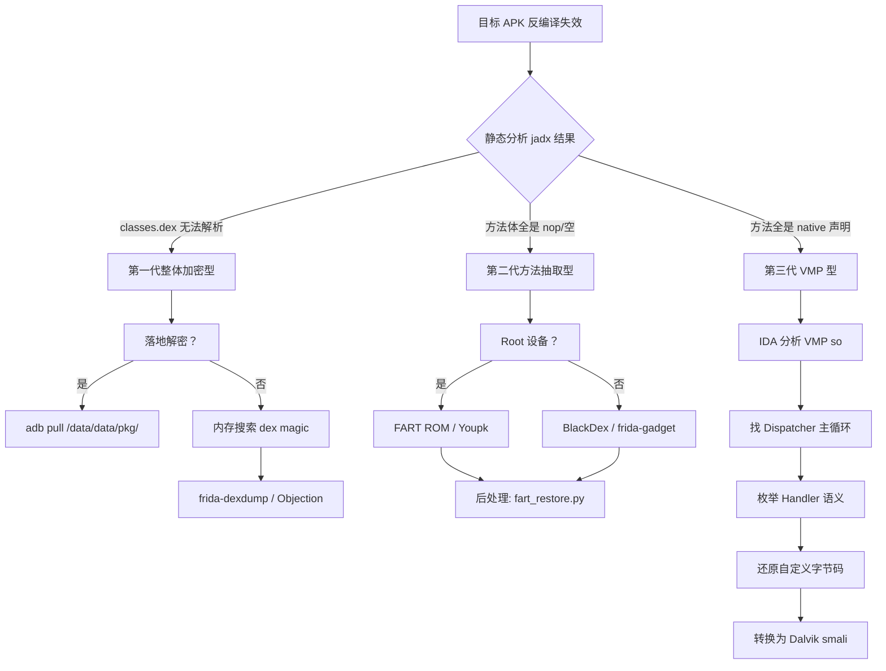

---
tags:
  - WASM
  - 虚拟化壳
  - tier3
  - android
  - DEX加固
---
# Java 与 Android DEX 加固壳逆向

> [!abstract] TL;DR
> Android DEX 加固壳经历了从第一代整体加密、第二代方法抽取、第三代 VMP 自定义解释器三个演进阶段，每一代在对抗内存 dump 方面都显著升级。脱壳的核心思路始终是"在 ART 运行时将 DEX 真正执行前的最后一刻抓取内存"——无论是 hook `DefineClass`/`OpenMemory`，还是主动触发 FART/Youpk 的全量方法调用，本质上都是时机博弈。理解 DEX 文件的二进制结构、ART 加载流程和 JIT/AOT 编译路径，是分析所有加固方案的统一前置知识。

---

## 概述与定位

Android 生态中，对 APK 进行加固（Reinforcement/Shelling）已经是商业 App 的标准配置。加固的动机包括：防止竞争对手反编译业务逻辑、保护算法专利、对抗外挂与作弊工具、隐藏密钥硬编码。与 PC 端 VMProtect / Themida 以 x86/x64 指令流为目标不同，Android 加固的目标是 Dalvik/ART 字节码——即 DEX 文件中的 Dalvik 指令序列。这一特殊性带来了独特的攻防格局。

本篇在系列 40「WASM 与虚拟化壳逆向」中承担"非 x86 平台 VM 壳"这条扩展线。系列 35「Android 逆向与运行时」讲的是 ADB 调试、JNI 追踪、Smali 手工修改等通用技能；本篇聚焦"壳"这个子领域，具体指：

- 加固厂商将 APK 的核心 DEX 隐藏或变形，使静态工具（jadx/apktool/dex2jar）失效；
- 安全研究人员如何在合法、授权的场景下恢复可分析的字节码；
- 加固厂商如何对抗脱壳，形成持续的技术军备竞赛。

本篇读者定向为：移动安全工程师、逆向分析师、CTF 参赛者、App 安全评估人员。

---

## 原理与机制

### DEX 文件结构回顾

在深入加固原理之前，必须掌握 DEX 二进制格式。一个标准 DEX 文件由以下部分组成：

```
DEX 文件布局（classes.dex）
───────────────────────────
 偏移  字段              说明
  0x0  header_item       Magic: "dex\n035\0" / "dex\n039\0"
       checksum          Adler-32，覆盖 magic 之后全部
       SHA1              文件签名
       file_size         字节总长
       header_size       0x70 固定
       endian_tag        0x12345678 小端
       link_size/off     外部链接段（通常 0）
       map_off           map_list 位置
       string_ids_size   字符串 ID 表大小
       string_ids_off    字符串 ID 表偏移
       type_ids_size     类型 ID 表大小
       type_ids_off      类型 ID 表偏移
       proto_ids_size    方法原型表大小
       proto_ids_off
       field_ids_size    字段引用表大小
       field_ids_off
       method_ids_size   方法引用表大小
       method_ids_off
       class_defs_size   类定义表大小
       class_defs_off    ← 关键：指向所有类的入口
       data_size
       data_off
```

`class_def_item` 是加固最关键的结构：

```c
struct class_def_item {
    uint32_t class_idx;       // 类名索引
    uint32_t access_flags;
    uint32_t superclass_idx;
    uint32_t interfaces_off;
    uint32_t source_file_idx;
    uint32_t annotations_off;
    uint32_t class_data_off;  // ← 指向 class_data_item
    uint32_t static_values_off;
};

struct class_data_item {
    uleb128 static_fields_size;
    uleb128 instance_fields_size;
    uleb128 direct_methods_size;
    uleb128 virtual_methods_size;
    encoded_field[]  static_fields;
    encoded_field[]  instance_fields;
    encoded_method[] direct_methods;   // ← 方法入口
    encoded_method[] virtual_methods;
};

struct encoded_method {
    uleb128 method_idx_diff;
    uleb128 access_flags;
    uleb128 code_off;   // ← 指向 code_item，为 0 表示无方法体（native 或抽象）
};

struct code_item {
    uint16_t registers_size;
    uint16_t ins_size;
    uint16_t outs_size;
    uint16_t tries_size;
    uint32_t debug_info_off;
    uint32_t insns_size;    // 以 16-bit code unit 为单位
    uint16_t insns[];       // 真正的 Dalvik 指令序列 ← 加固的核心攻击面
    // ... try/catch 表
};
```

**加固所有技术路线的本质**：扰乱 `class_defs` → `class_data_item` → `encoded_method.code_off` → `code_item.insns` 这条链路，让静态工具无法解析到真实指令。

### ART 运行时加载 DEX 的流程

理解脱壳时机，必须理解 ART 如何加载 DEX：

```
APK 启动
  │
  ├─ Zygote fork → App 进程
  │
  ├─ ActivityThread.main()
  │       ↓
  ├─ Application.attachBaseContext()   ← 加固壳最早的入口点
  │       ↓
  ├─ Application.onCreate()           ← 第二个常见入口点
  │       ↓
  ├─ DexClassLoader / PathClassLoader 加载解密后的 DEX
  │       ↓
  ├─ JNI: DexFile::Open() / DexFile::OpenMemory()
  │       ↓
  ├─ ART: ClassLinker::DefineClass()  ← 核心加载点，此时 DEX 已在内存
  │       ↓
  ├─ 方法体解析（Interpreter / JIT / AOT）
  │       ↓
  └─ 实际执行用户代码
```

脱壳的时机窗口就在 `OpenMemory()` 与 `DefineClass()` 之间——此刻完整 DEX 已在内存，但业务代码尚未开始执行。

---

## 结构/算法/伪代码详解

### 第一代加固：DEX 整体加密 + 动态加载

第一代加固（2013-2015 年主流）原理最为直接：

```
原始 APK 构成:
  classes.dex  ← 替换为"壳 DEX"（仅含解密逻辑）
  assets/
    └── main.jar  ← 加密后的原始 classes.dex
  lib/armeabi-v7a/
    └── libshell.so  ← 解密 native 库
```

壳 DEX 在 `Application.attachBaseContext` 中：

```java
// 壳 Application 伪代码
public void attachBaseContext(Context base) {
    // 1. 从 assets 读取加密 DEX
    byte[] encryptedDex = readAssets("main.jar");
    // 2. 调用 native 解密（密钥硬编码在 so 中或从服务端取）
    byte[] plainDex = NativeDecrypt.decrypt(encryptedDex);
    // 3. 写到私有目录（落地解密）或保留在内存（不落地）
    File odexPath = getDir("odex", MODE_PRIVATE);
    FileUtils.write(odexPath + "/classes.dex", plainDex);
    // 4. 用 DexClassLoader 加载
    DexClassLoader loader = new DexClassLoader(
        odexPath.getAbsolutePath(), cacheDir, null,
        base.getClassLoader()
    );
    // 5. 替换 ClassLoader 并重新绑定 Application
    HookClassLoader(loader);
    super.attachBaseContext(base);
}
```

**第一代的脆弱性**：解密后的 DEX 写到了磁盘（`/data/data/<pkg>/files/` 或 `/data/data/<pkg>/app_odex/`），直接 `adb pull` 即可获取。即使不落地，hook `DexClassLoader` 构造函数拦截 `dexPath` 参数，或搜索内存中的 `dex\n035` 魔术字节即可定位完整 DEX。

攻击流程：

```
adb shell am start -n <package>/.MainActivity  # 启动 App
adb shell "su -c 'ls /data/data/<pkg>/app_*/'"
adb pull /data/data/<pkg>/app_odex/classes.dex ./
jadx classes.dex
```

### 第二代加固：方法体抽取（Code Extract）

第一代在 2015 年后迅速被破解，厂商升级到方法体抽取型加固，也称为"指令抽取"或"代码抽取"：

```
第二代 DEX 结构示意：

classes.dex（磁盘上的原始 DEX）
├── header          正常
├── string_ids      正常
├── class_defs      正常（保留所有类定义）
├── class_data      保留（方法签名不变）
└── code_item
    ├── registers_size  正常
    ├── insns_size      正常（！但指令内容被清空或替换为 nop）
    └── insns[]         ← 全部替换为 0x0000 (nop) 或乱码
```

运行时，so 层保存有真实的方法体字节码，在类被 `loadClass()` 之前将 `code_item.insns[]` 原地回填：

```c
// native 层回填伪代码（libshell.so）
void restore_method_body(JNIEnv* env, jclass clazz) {
    // 通过反射或直接内存操作拿到 ArtMethod*
    ArtMethod* method = get_art_method(env, clazz, method_idx);
    // 定位 code_item 在内存中的地址
    CodeItem* code_item = method->GetCodeItem();
    // 将从 so 内部加密存储的真实指令写回
    memcpy(code_item->insns, real_insns, insns_size * 2);
}
```

**第二代的对抗思路**：
- 静态 dump 的 DEX 是壳化后的（insns 全为 nop），需要在**运行时抓取**；
- hook 点：`ClassLinker::LoadMethod()` 回填之后、`DefineClass` 注册完成之后；
- 工具：DexHunter（hook `DefineClass`）、Youpk（Youpk 修改 ART 源码，在解释执行每个方法时将 CodeItem 抓出）；
- FART（Fancy ART）：在解释器入口 `ExecuteSwitchImpl` 处插桩，主动遍历所有方法并 dump。

FART 主动调用技术的关键函数（ART 源码级）：

```cpp
// FART 修改 art/runtime/interpreter/interpreter_switch_impl.cc
// 在 DoInvoke 前拦截，将方法体写到文件
void FartDumpMethod(ArtMethod* method) {
    const DexFile* dex_file = method->GetDexFile();
    const DexFile::CodeItem* code_item = method->GetCodeItem();
    if (code_item == nullptr) return;
    // 通过 method->GetDexMethodIndex() 定位方法
    // 将 CodeItem 序列化写出到 /sdcard/fart/<class>/<method>.bin
    ...
}
```

### 第三代加固：VMP（虚拟机保护）

第三代加固借鉴 PC 端 VMProtect 思想，将敏感方法的 Dalvik 字节码**替换为对自定义解释器的调用**：

```
原始方法（Java 层视角）：
  public int encrypt(int key) {
      // Dalvik 指令...
  }

VMP 后（DEX 中）：
  public native int encrypt(int key);
  // ← 变成了 native 声明，code_off = 0

so 层：
  libvmp.so 内部存储加密字节码 + 自定义解释器
  JNI_OnLoad 时将 encrypt 方法注册到 JVM
  实际执行路径：
    JNI call → vmp_dispatcher() → 取出加密 opcode →
    解密 → 自定义解释器执行
```

```c
// 自定义解释器核心循环（伪代码）
void vmp_execute(uint8_t* bytecode, vmp_ctx_t* ctx) {
    while (1) {
        uint8_t opcode = fetch_and_decrypt(bytecode, ctx->pc);
        switch (opcode) {
            case VMP_OP_IGET:   // 对应 Dalvik iget
                handle_iget(ctx); break;
            case VMP_OP_INVOKE: // 对应 Dalvik invoke-virtual
                handle_invoke(ctx); break;
            case VMP_OP_RETURN:
                return;
            // ... 数十个自定义 opcode
        }
        ctx->pc++;
    }
}
```

**第三代的分析难点**：
- 无法依赖 ART hook 恢复指令，因为根本没有 Dalvik 字节码；
- 必须逆向 so 层的自定义解释器，识别 opcode 语义映射；
- 与 PC 端 VM 壳（系列 40 第 09-13 章）分析方法高度相似：找 Dispatcher、枚举 Handler、还原语义；
- Dalvik 语义较 x86 更规整（固定格式的 invoke/get/put 指令），反而有时更易还原。

### so 层加固：OLLVM + Packer

除 DEX 外，加固方案通常还对 native 库（`libXxx.so`）施加保护：

```
so 加固层次：
├── OLLVM 混淆（控制流平坦化、虚假控制流）
├── 自定义 Section 加密（.data.enc / .rodata.enc）
├── 动态解密（init_array 段执行解密）
├── so 的 Packer（将真实 so 作为 payload 嵌入外壳 so）
└── so VMP（将 .text 中的函数替换为 VM bytecode）
```

针对 so 加固的分析工具链：
- Ghidra/IDA Pro + OLLVM 反混淆插件（D810、obpo）；
- Frida hook `dlopen` / `dlsym` 追踪 so 加载；
- `frida-inject` 在 init_array 执行完毕后 dump 解密后的 so；
- `soinfo` 结构遍历获取真实符号表。

### 脱壳技术全景

**内存搜索 DEX 魔术字节**

最底层、最通用的方法，适用于所有一代和部分二代加固：

```python
# Frida 脚本：搜索内存中所有 DEX 文件
import frida, sys

def on_message(message, data):
    print(message)

session = frida.attach("com.target.app")
script = session.create_script("""
    Process.enumerateRangesSync({protection: 'r--', coalesce: true})
        .forEach(function(range) {
            try {
                // DEX magic: 64 65 78 0a 30 33 35 00 或 30 33 39 00
                var magic = Memory.readByteArray(range.base, 8);
                var arr = new Uint8Array(magic);
                if (arr[0]==0x64 && arr[1]==0x65 && arr[2]==0x78 && arr[3]==0x0a) {
                    var size = Memory.readU32(range.base.add(32)); // file_size
                    send({type:'dex', base: range.base, size: size});
                    var dexData = Memory.readByteArray(range.base, size);
                    send({type:'dump'}, dexData);
                }
            } catch(e) {}
        });
""")
script.on('message', on_message)
script.load()
```

**hook ART 核心函数**

精确定位方法，适用于二代加固（方法体回填已完成后触发）：

```javascript
// Frida hook: DexFile::OpenMemory (ART 内部 C++ 函数)
// Android 7.0+ libart.so
var openMemory = Module.findExportByName("libart.so",
    "_ZN3art7DexFile10OpenMemoryEPKhjRKNSt3__112basic_stringIcNS3_11char_traitsIcEENS3_9allocatorIcEEEEjPNS_6MemMapEPKNS_7OatFileEPS9_");

if (openMemory) {
    Interceptor.attach(openMemory, {
        onEnter: function(args) {
            // args[0] = const uint8_t* base (DEX 数据起始地址)
            // args[1] = size
            this.base = args[0];
            this.size = args[1].toInt32();
        },
        onLeave: function(retval) {
            if (!retval.isNull()) {
                // 此时 DEX 已加载，回填完成
                var dexData = Memory.readByteArray(this.base, this.size);
                send({type: 'dex_open', size: this.size}, dexData);
            }
        }
    });
}
```

**FART 主动调用脱壳**

FART (Fancy ART) 是最系统化的二代脱壳方案，核心创新是"主动触发"——不等 App 自然调用方法，而是主动遍历所有已加载类的所有方法，强制触发解释执行，从而触发回填：

```
FART 脱壳流程：
1. 修改 ART 源码，在 interpreter_switch_impl 插入 FartDump()
2. 编译刷入 FART ROM（或通过 Xposed/Magisk 模块注入）
3. 启动目标 App
4. FART 在 App 完成初始化后调用 fartthread()
5. fartthread 遍历所有 ClassLoader → 所有已加载类
6. 对每个方法调用 artMethod->PrettyMethod() + dump CodeItem
7. 输出到 /sdcard/fart/<classname>.bin
8. 后处理：fart_restore.py 将 bin 回填到空壳 DEX
```

**frida-dexdump**

开源工具，集成了多种 dump 策略：

```bash
# 安装
pip install frida-dexdump

# 连接设备 dump
frida-dexdump -FU -p <pid> --sleep 2
# -F: 完整 dump（等待加固完成）
# -U: USB 连接
# 输出在当前目录 ./dexs/
```

**BlackDex（无 root）**

BlackDex 利用 Android VirtualApp 技术，在非 root 环境下启动目标 App 于虚拟进程，再 hook 虚拟进程中的 ART 完成脱壳：

```
BlackDex 架构：
  BlackDex App（用户安装）
  └── VirtualApp 框架
      └── 虚拟进程（运行目标 APK）
          └── Hook ART OpenMemory/DefineClass
              └── dump DEX 到 /sdcard/BlackDex/
```

**Youpk（全量方法 dump）**

Youpk 在 FART 基础上改进，在 ART 源码层重写 `ArtMethod::Invoke` 的 dump 逻辑，确保每个方法在第一次调用时都被捕获，对抗了部分"惰性回填"策略（只有方法真正被调用时才回填，FART 的主动调用会被加固 SDK 识别为异常）。

### 主流加固厂商特征分析

```
腾讯乐固（LeLock/Tencent Shield）：
  特征：libshella-2.x.so / libshellx-super.2019.so
  代际：支持到第三代 VMP
  反检测：检测 Frida 进程名、/proc/self/maps 中的 frida-agent

梆梆安全（Bangcle / SecNeo）：
  特征：libsecexe.so / libsecmain.so / com.secneo.apkwrapper.*
  代际：主打方法抽取（二代）
  特点：多 dex 分割加载，每个 dex 独立解密

爱加密（iJiami）：
  特征：libexec.so / libexecmain.so
  代际：二代为主
  特点：有 SaaS 后端动态密钥分发

娜迦（Naga）：
  特征：com.nagapt.* 包名，libvdog.so
  代际：三代 VMP
  特点：So 层 VMP 强度较高

360 加固保：
  特征：com.stub.StubApp / libjiagu.so / libjiagu_a.so
  代际：三代
  反检测：检测 Xposed / Substrate hook 痕迹，检测 /proc/mounts 中的 tmpfs

阿里聚安全（AliProtect）：
  特征：com.ali.mobisec.* / libsgsecuritybody.so
  代际：三代，含 Sophix 热修复集成
  特点：服务端密钥，本地无法离线解密
```

### 反脱壳对抗技术

加固厂商针对脱壳工具发展了多种对抗手段：

**（1）反 Frida 检测**

```c
// 检测 frida-server 端口（27042）
bool detect_frida_port() {
    struct sockaddr_in addr;
    addr.sin_port = htons(27042);
    int sock = socket(AF_INET, SOCK_STREAM, 0);
    int ret = connect(sock, (struct sockaddr*)&addr, sizeof(addr));
    close(sock);
    return ret == 0;  // 成功连接则说明 frida-server 在运行
}

// 扫描 /proc/self/maps 查找 frida-agent
bool detect_frida_maps() {
    FILE* f = fopen("/proc/self/maps", "r");
    char line[512];
    while (fgets(line, sizeof(line), f)) {
        if (strstr(line, "frida") || strstr(line, "linjector")) {
            return true;
        }
    }
    return false;
}

// 检测 frida-gadget.so 已加载
bool detect_frida_modules() {
    // 遍历 /proc/self/maps 搜索特征路径
    // 或用 dl_iterate_phdr 枚举加载的 so
}
```

**绕过方法**：使用 Frida 的 `gadget` 模式（嵌入 APK 内部，不启动 frida-server）；使用 `frida-gadget` 的 `socket` 配置改变监听端口；使用内存 patch 绕过检测函数。

**（2）Root 检测**

```java
// 常见 Root 检测方法
boolean isRooted() {
    // 1. 检查 su 二进制
    String[] paths = {"/system/bin/su", "/system/xbin/su", "/sbin/su"};
    for (String p : paths) if (new File(p).exists()) return true;
    // 2. 检查 Magisk 特征
    if (new File("/sbin/.magisk").exists()) return true;
    // 3. 尝试执行 su
    try { Runtime.getRuntime().exec("su"); return true; } catch (Exception e) {}
    // 4. 检查 build.prop 中的 test-keys
    return Build.TAGS != null && Build.TAGS.contains("test-keys");
}
```

**绕过方法**：Magisk Hide（将 Magisk 挂载从特定进程隐藏）；RootCloak Xposed 模块；直接 patch 检测函数返回值（Frida hook）。

**（3）完整性检测**

```java
// APK 签名校验
Signature[] sigs = pm.getPackageInfo(pkgName,
    PackageManager.GET_SIGNATURES).signatures;
String sigHash = computeSHA1(sigs[0].toByteArray());
if (!sigHash.equals(EXPECTED_HASH)) {
    // 认为 APK 被篡改（重签名脱壳）
    System.exit(1);
}

// DEX CRC 校验
ZipFile apk = new ZipFile(apkPath);
ZipEntry entry = apk.getEntry("classes.dex");
long crc = entry.getCrc();
if (crc != EXPECTED_CRC) { /* 篡改检测 */ }
```

**绕过方法**：使用原 APK 的签名（保留签名不重签）；hook `PackageManager.getPackageInfo` 返回伪造签名；使用 VirtualApp 框架直接运行原始 APK 无需重签。

**（4）反调试**

```c
// ptrace 自调试（占用调试附加点）
void anti_debug_ptrace() {
    if (ptrace(PTRACE_TRACEME, 0, 0, 0) == -1) {
        // 已被 ptrace，说明有调试器
        kill(getpid(), SIGKILL);
    }
}

// 检测 /proc/self/status 中的 TracerPid
bool is_being_traced() {
    FILE* f = fopen("/proc/self/status", "r");
    char line[256];
    while (fgets(line, sizeof(line), f)) {
        if (strncmp(line, "TracerPid:", 10) == 0) {
            int pid = atoi(line + 10);
            return pid != 0;
        }
    }
    return false;
}
```

### DEX VMP 逆向方法论

当面对三代 VMP 加固时，分析路径与 PC 端 VM 壳高度相似（参见本系列第 09-12 章），但有 Android 特有的差异：

```
DEX VMP 逆向步骤：

1. 确认 VMP 存在
   ├── jadx 反编译目标方法，显示 "native" 修饰符
   ├── jadx 看到 System.loadLibrary("vmp") 或类似
   └── IDA 分析 libvmp.so，找到 JNI 注册的方法列表

2. 定位 Dispatcher
   ├── 在 so 中寻找大型 switch 或跳转表
   ├── 函数签名特征：第一个参数为 byte* bytecode，大循环体
   └── 交叉引用：从 JNI 函数 → JNI 包装 → vmp_dispatcher

3. 枚举 Handler
   ├── 提取 switch case 的每个 case 处理函数
   ├── 与 Dalvik 指令集对照（操作数格式、寄存器数量）
   └── 标注语义：VMP_OP_0x10 = Dalvik IGET, VMP_OP_0x11 = IPUT ...

4. 提取 Bytecode
   ├── 从 so 的 .rodata / .data 段定位加密字节码
   ├── hook so 初始化，dump 解密后的字节码
   └── 用脚本将自定义 opcode 反汇编为 Dalvik smali

5. 恢复 DEX（可选）
   └── 将还原的 smali 写回到 DEX 的 code_item
```

---

## 工具视角与实战

### 工具选型决策树



### 实战案例：FART 脱壳二代加固 App

**环境准备**：

```bash
# 设备：Root + FART ROM（基于 AOSP 修改，针对 Android 8/9/10 有对应版本）
adb devices
# output: XXXXXXXX    device

# 确认 FART 已集成
adb shell ls /system/bin/fart
# output: /system/bin/fart
```

**执行脱壳**：

```bash
# 启动目标 App
adb shell am start -n com.target.app/.MainActivity

# 等待 App 初始化完成（通常 3-5 秒）
sleep 5

# 触发 FART 主动 dump
adb shell fart com.target.app

# dump 文件保存在
adb shell ls /sdcard/fart/
# output: com.target.app_1234/
adb pull /sdcard/fart/com.target.app_1234/ ./fart_output/
```

**后处理还原**：

```bash
# FART 输出两类文件：
# 1. *.dex  ── 空壳 DEX（方法体为 nop）
# 2. *.bin  ── CodeItem 二进制（真实方法体）

python3 fart_restore.py \
    --dex fart_output/classes.dex \
    --bin-dir fart_output/ \
    --out restored.dex

# 用 jadx 验证
jadx restored.dex -d jadx_output/
```

### 实战案例：frida-gadget 模式无 root 脱壳

```bash
# 1. 解包 APK
apktool d target.apk -o target_decoded/

# 2. 将 frida-gadget.so 注入（arm64-v8a）
cp frida-gadget-16.x.x-android-arm64.so \
   target_decoded/lib/arm64-v8a/libfrida-gadget.so

# 3. 在入口 smali 中添加 loadLibrary 调用
# 在 Application.attachBaseContext 开头插入：
# invoke-static {}, Ljava/lang/System;->loadLibrary(Ljava/lang/String;)V
# （参数: "frida-gadget"）

# 4. 重签名打包
apktool b target_decoded/ -o target_repack.apk
jarsigner -keystore debug.keystore target_repack.apk debug

# 5. 安装并连接
adb install target_repack.apk
# App 启动时自动暂停等待 frida 连接
frida -U Gadget -l dexdump.js
```

```javascript
// dexdump.js: 无 root 脱壳脚本
Java.perform(function() {
    // 等待加固初始化完成
    var timer = setInterval(function() {
        try {
            var Application = Java.use("android.app.Application");
            Application.onCreate.implementation = function() {
                this.onCreate();
                // 在 Application.onCreate 执行完毕后 dump
                dumpAllDex();
                clearInterval(timer);
            };
        } catch(e) {}
    }, 100);
    
    function dumpAllDex() {
        var classLoaderClass = Java.use("java.lang.ClassLoader");
        // 递归遍历所有 ClassLoader
        enumerateClassLoaders(function(loader) {
            try {
                var dexField = loader.getClass()
                    .getDeclaredField("pathList");
                dexField.setAccessible(true);
                var pathList = dexField.get(loader);
                // 提取 dexElements 中的 DexFile
                // 通过反射读取 mCookie 或 mFileName
                var elements = pathList.dexElements.value;
                for (var i = 0; i < elements.length; i++) {
                    var dexFile = elements[i].dexFile.value;
                    if (dexFile) {
                        var name = dexFile.getName();
                        send({type:'dex_found', name: name});
                    }
                }
            } catch(e) {}
        });
    }
});
```

### 工具汇总表

| 工具 | 代际 | Root 需求 | 适用场景 |
|------|------|-----------|----------|
| frida-dexdump | 一代、二代 | 推荐有 | 快速 dump，多策略 |
| FART ROM | 二代 | 是 | 主动调用，最全量 |
| Youpk | 二代 | 是 | FART 改进，更精准 |
| BlackDex | 一代、二代 | 否 | 无 root 环境 |
| DexHunter | 一代 | 是 | 历史工具，参考实现 |
| Objection | 一代 | 否 | frida 封装，适合快速评估 |
| IDA Pro + FLIRT | 三代 VMP | N/A | so 层逆向 |
| Ghidra + wasm2c | WASM 壳 | N/A | WASM 特殊场景 |

---

## 安全性与正确使用

> [!caution]
> **法律与道德边界**：DEX 加固壳的脱壳技术仅应用于以下合法场景：
> 1. **自有 App 开发与测试**：对自己开发的 App 进行安全评估，验证加固方案的有效性；
> 2. **恶意软件分析**：在安全实验室环境中分析恶意 APK，还原混淆代码以识别威胁行为；
> 3. **授权安全评估（渗透测试）**：在客户书面授权下对其 App 进行安全审计，出具安全报告。
>
> **明确禁止的行为**：
> - 脱壳他人 App 以窃取商业逻辑、算法或源代码；
> - 通过脱壳绕过 App 的许可证验证或内购系统，制作破解版；
> - 将脱壳后的代码用于竞品抄袭或再发布；
> - 分析他人 App 的用户数据结构以实施爬虫或数据窃取。
>
> **相关法规**：中国《网络安全法》第 27 条、《数据安全法》、《计算机软件保护条例》；美国 DMCA 第 1201 条；欧盟指令 2009/24/EC 均对未授权反编译有明确限制。违反者可能面临民事索赔与刑事追诉。
>
> **安全研究例外**：部分司法辖区对"互操作性研究"和"安全研究"设有例外条款，但须满足不超出必要范围、成果不对外传播等条件，事前咨询法律顾问是最佳实践。

---

## 小结

Android DEX 加固壳的演进轨迹清晰反映了攻防博弈的规律：每当脱壳社区找到通用方法，厂商便将保护层下沉一层——从磁盘 DEX 加密，到内存方法体抽取，再到 native VMP 自定义解释器。这条演进轴与 PC 端壳（压缩壳 → 加密壳 → VM 壳）惊人相似，本质上都是"将可分析表面最小化"。

对于逆向研究人员，核心洞见是：

1. **理解目标运行时（ART）的内部结构**比了解任何单一工具都更有价值。掌握了 `DexFile`、`ArtMethod`、`CodeItem` 的内存布局，就能在任何 ART 版本上实现自定义 hook，不受工具更新节奏约束；

2. **主动调用比被动等待更强**。FART 的"强制遍历所有方法"思路突破了"只有被调用的方法才能被 dump"的困境，是二代脱壳的里程碑方法；

3. **三代 VMP 将分析从 Java 层下沉到 native 层**，需要结合本系列 VM Handler 分析（第 10 章）、OLLVM 反混淆（系列 D 主题）的技能；

4. **加固不等于安全**。所有加固方案都无法做到理论上不可逆——运行时终将执行真实代码，攻击者只是在寻找那个"窗口"。真正的安全架构应将敏感逻辑放在服务端，而非依赖客户端混淆。

---

## 相关阅读

- 系列 35：Android 逆向与运行时（ART、JNI、Smali 通用基础）
- 系列 40 第 09 章：虚拟化保护壳总览（VM 四大组件，与 DEX VMP 对照）
- 系列 40 第 10 章：VM 字节码与 Handler 分析（方法论可直接应用于 DEX VMP）
- 系列 40 第 12 章：VMProtect 逆向实战（PC 端 VM 壳对照参考）
- 《Android 软件安全与逆向分析》—丰生强
- FART 项目：https://github.com/hanbinglengyue/FART
- Youpk 项目：https://github.com/youlor/unpacker
- frida-dexdump：https://github.com/hluwa/frida-dexdump
- BlackDex：https://github.com/CodingGay/BlackDex
- AOSP ART 源码：https://android.googlesource.com/platform/art

---

[[00.WASM与虚拟化壳逆向总览|⬆ 系列总览]] | [[21.WASI与WASM组件模型|← 上一章]]
