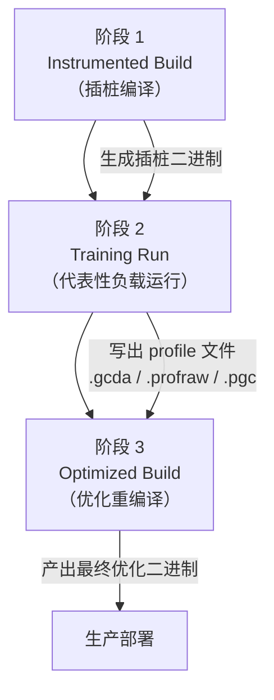

# PGO 完整专题：Profile-Guided Optimization（GCC / Clang / MSVC）

> [!abstract] TL;DR
> - PGO 分三阶段：instrumented build → 真实负载采集 profile → optimized rebuild，让编译器基于运行时数据而非静态猜测做决策。
> - 核心收益来自分支预测改善、热/冷代码布局、内联决策精准化与寄存器分配优化，典型提升 5–20%。
> - GCC 用 `-fprofile-generate` / `-fprofile-use`，中间产物为 `.gcda` 文件；Clang 的 IR-PGO 用 `llvm-profdata merge` 合并原始 `.profraw`。
> - MSVC 通过 `/GL` + pgort + `/LTCG:PGO` 三步实现；与 LTO 深度结合。
> - AutoFDO / Sample-based PGO 用 `perf` 采样替代插桩，侵入性低但精度较弱。
> - 训练集与真实负载的代表性是 PGO 效果的核心变量；profile 过期是最常见陷阱。

---

## 概述与定位

Profile-Guided Optimization，中文常译为"基于分析的优化"或"引导优化"，是一类**利用程序真实运行数据来指导编译器优化决策**的技术。与传统的静态优化（编译器仅凭源码结构推断热点）不同，PGO 让编译器在第二遍编译时掌握"这段代码在真实场景下究竟被执行了多少次"的精确信息，从而在内联、分支预测、函数布局等环节做出更优的取舍。

### 为何 PGO 能提升性能

现代 CPU 性能高度依赖分支预测单元（Branch Predictor）和指令缓存（icache）的命中率。编译器在缺乏运行时信息时，只能依靠启发式规则（heuristic）猜测哪条分支更可能被走到，哪些函数值得内联，哪些代码块应被放在函数开头（热路径）。这些猜测对通用代码效果尚可，但对业务逻辑复杂、分支结构特殊的应用往往差强人意。

PGO 打破了这一信息不对称：

1. **分支预测辅助**：通过 profile 数据，编译器知道 `if (x > 0)` 的 true 分支在 99% 的调用中成立，可将其放在直通路径（fall-through）上，减少分支跳转开销。
2. **热/冷代码分离**：热函数/热基本块被紧密打包，冷路径（错误处理、罕见分支）被挪到 `.text.unlikely` 或函数末尾，提升 icache 利用率。
3. **内联决策优化**：编译器根据调用频次决定是否内联某个函数——高频小函数优先内联，低频大函数延迟内联，避免 icache 污染。
4. **寄存器分配**：热变量在寄存器中保留更长时间，减少 spill；冷路径的寄存器压力可相应降低。
5. **间接调用转化（devirtualization）**：virtual call 或函数指针调用如果 profile 显示 95% 时调用同一目标，编译器可生成直接调用加猜测分支，绕过虚表查找。

### PGO 在优化体系中的位置


PGO 位于 LTO 之后、BOLT 之前的优化层次。三者可叠加使用（ThinLTO + PGO + BOLT 是 Meta/Google 等大厂的常见组合），但各有独立价值，即使单独启用 PGO 也能带来显著收益。

---

## 原理与机制

### 插桩（Instrumentation）原理

编译器在 instrumented build 阶段，向每个**基本块（basic block）**的入口和每个**间接跳转目标**插入计数器。这些计数器在程序运行时累计调用次数，写入 profile 文件。

计数器的精确位置取决于编译器实现：

- **GCC（gcov 风格）**：在控制流图（CFG）的边（edge）上插桩，而非基本块本身，可通过边覆盖推断块覆盖（减少计数器数量）。
- **Clang IR-PGO**：在 LLVM IR 层面的基本块入口插桩，计数粒度更细，可捕获 value profile（如间接调用目标的分布、内存访问模式）。

插桩后的二进制通常比正常版本慢 2–5 倍，因此 training run 需要专门的测试环境而非直接用于生产。

### Profile 文件格式

| 编译器 | 原始格式 | 合并工具 | 最终使用格式 |
|--------|---------|---------|-------------|
| GCC | `.gcda`（每个编译单元对应一个） | `gcov-tool merge` | 直接引用 `.gcda` 目录 |
| Clang IR-PGO | `.profraw`（每个进程/线程） | `llvm-profdata merge` | `.profdata` |
| Clang frontend-PGO（旧版） | `.profraw` | `llvm-profdata` | `.profdata` |
| MSVC | `.pgc`（每次运行） | `pgomgr` | `.pgd` 数据库 |

### 三阶段核心流程



**阶段 2 的代表性是整个 PGO 的核心**。若 training workload 只覆盖了 10% 的代码路径，另外 90% 就没有 profile 数据，编译器对这些路径只能回退到静态猜测，效果等同于未做 PGO。

---

## 三大编译器工作流详解

### GCC 工作流

GCC 的 PGO 基于 `gcov` 基础设施，因此其 profile 文件格式与覆盖率测试复用同一套机制。

**第一步：插桩编译**

```bash
gcc -O2 -fprofile-generate -fprofile-dir=/tmp/pgo_data \
    -o app_instrumented main.c foo.c bar.c
```

`-fprofile-generate` 会自动启用插桩并链接 `libgcov`。`-fprofile-dir` 指定 `.gcda` 文件的存放路径（默认与源文件同目录，多文件项目建议显式指定）。

**第二步：运行训练集**

```bash
./app_instrumented --workload typical_input.dat
# 运行完毕后，/tmp/pgo_data/ 下会生成若干 *.gcda 文件
```

可多次运行不同 workload，`.gcda` 文件会**累加**计数（而非覆盖），从而聚合多个运行场景的 profile。

**第三步：优化重编译**

```bash
gcc -O2 -fprofile-use -fprofile-dir=/tmp/pgo_data \
    -fprofile-correction \
    -o app_optimized main.c foo.c bar.c
```

`-fprofile-use` 告知 GCC 读取 profile 数据参与优化。`-fprofile-correction` 在 profile 数据不完整或存在计数不一致时（多线程程序常见）尝试自动修正，而非报错退出——生产中建议加上此选项。

**关键细节：**

- 若源文件有改动（函数增删、基本块结构变化），旧 `.gcda` 与新源码之间的 checksum 会不匹配，GCC 会警告甚至忽略对应数据。**每次大幅修改代码后需重新采集 profile**。
- GCC 13+ 支持 `-fprofile-reproducible=parallel-runs`，改善多线程程序的 profile 一致性。
- `gcov-tool merge` 可合并多个 `.gcda` 文件目录，等效于 Clang 的 `llvm-profdata merge`。

### Clang 工作流：IR-PGO 与 Frontend-PGO 的区别

Clang 有两套 PGO 机制，容易混淆：

| 特性 | IR-PGO（推荐） | Frontend-PGO（旧，不推荐） |
|------|--------------|--------------------------|
| 插桩位置 | LLVM IR 层 | AST/前端层 |
| Value Profile | 支持（间接调用目标、memop 大小分布） | 不支持 |
| 与 ThinLTO 兼容 | 完全兼容 | 有限兼容 |
| 选项前缀 | `-fprofile-instr-*` | `-fprofile-*`（类 GCC） |

**IR-PGO 完整流程：**

```bash
# 阶段 1：插桩编译
clang -O2 -fprofile-instr-generate \
    -o app_instrumented main.c foo.c bar.c

# 阶段 2：运行训练集（可多次运行，各产生一个 .profraw）
LLVM_PROFILE_FILE="run1.profraw" ./app_instrumented --input a.dat
LLVM_PROFILE_FILE="run2.profraw" ./app_instrumented --input b.dat

# 合并多个 profraw 文件
llvm-profdata merge -output=combined.profdata run1.profraw run2.profraw

# 阶段 3：优化重编译
clang -O2 -fprofile-instr-use=combined.profdata \
    -o app_optimized main.c foo.c bar.c
```

`LLVM_PROFILE_FILE` 环境变量控制输出文件名，支持 `%p`（PID）、`%h`（hostname）等占位符，对多进程程序避免文件覆盖至关重要。

**与 ThinLTO 结合（推荐）：**

```bash
clang -O2 -flto=thin -fprofile-instr-use=combined.profdata \
    -o app_optimized main.c foo.c bar.c -fuse-ld=lld
```

ThinLTO + IR-PGO 的组合允许跨模块内联决策也受 profile 驱动，是目前 Clang 生态中收益最大的优化组合。

**`llvm-profdata` 其他常用操作：**

- `llvm-profdata show combined.profdata --all-functions`：查看各函数的调用次数分布。
- `llvm-profdata merge --sample combined.profdata run1.profraw`：合并采样 profile（AutoFDO 场景）。
- `llvm-profdata overlap a.profdata b.profdata`：比较两个 profile 的相似度，评估训练集代表性。

### MSVC 工作流

MSVC 的 PGO 与 Link-Time Code Generation（LTCG）深度耦合，必须同时启用。

**第一步：插桩编译与链接**

```bat
cl /O2 /GL main.cpp foo.cpp bar.cpp /link /LTCG:PGI /OUT:app_instrumented.exe
```

`/GL`（Whole Program Optimization）在编译阶段保留中间表示；`/LTCG:PGI`（Profile-Guided Instrumentation）在链接阶段生成插桩可执行文件，并创建 `app_instrumented.pgd` 数据库文件。

**第二步：运行训练集**

```bat
app_instrumented.exe --workload typical_input.dat
```

每次运行会在同目录生成 `app_instrumented!N.pgc`（N 为递增数字）。`pgort` 运行时库负责收集数据，程序退出时自动写入。

**第三步：合并 profile 并优化重编译**

```bat
:: 合并 .pgc 到 .pgd（可选，pgomgr 工具）
pgomgr /merge app_instrumented.pgd

:: 优化重编译
cl /O2 /GL main.cpp foo.cpp bar.cpp /link /LTCG:PGO /OUT:app_optimized.exe
```

`/LTCG:PGO` 告知链接器读取 `.pgd` 文件做 profile 驱动优化，输出最终优化二进制。

**MSVC PGO 特有优化：**

- **函数排序（Function Order）**：热函数被打包在可执行文件起始处，冷函数移至末尾，提升程序启动时的 icache 命中率。
- **数据分离**：全局变量按访问频次分组，热数据尽量放在同一缓存行。
- **ICF（Identical COMDAT Folding）**：结合 profile，更激进地合并等价函数。

---

## AutoFDO 与 Sample-based PGO

插桩 PGO 需要特殊构建步骤，在持续部署、大规模服务场景中操作成本较高。**AutoFDO**（Automatic Feedback-Directed Optimization）通过操作系统的性能采样（如 Linux `perf`）替代插桩，直接从**生产环境**收集 profile，实现零侵入。

### AutoFDO 工作流（GCC）

```bash
# 1. 用普通优化构建（无插桩）
gcc -O2 -g -o app main.c foo.c bar.c

# 2. 用 perf 在生产环境采样（或测试环境模拟生产流量）
perf record -b -e br_inst_retired.near_taken -o perf.data ./app --workload ...
# -b 采集分支栈（LBR），提供更精确的调用链信息

# 3. 转换 perf 数据为 AutoFDO profile
create_gcov --binary=app --profile=perf.data --gcov=app.afdo

# 4. 优化重编译
gcc -O2 -fauto-profile=app.afdo -o app_optimized main.c foo.c bar.c
```

### AutoFDO 工作流（Clang / LLVM）

```bash
# 采样
perf record -b -e cycles -o perf.data ./app --workload ...

# 转换（create_llvm_prof 来自 google/autofdo 项目）
create_llvm_prof --binary=app --profile=perf.data --out=app.prof

# 优化重编译
clang -O2 -fprofile-sample-use=app.prof -o app_optimized main.c foo.c bar.c
```

### 两种方式对比

| 维度 | 插桩 PGO | AutoFDO / Sample-based |
|------|---------|----------------------|
| 数据精度 | 高（精确计数） | 中（采样，存在统计误差） |
| 运行时开销 | 2–5× 慢（仅 training run） | <5%（生产采样） |
| 训练环境 | 需要专用 training run | 直接用生产流量 |
| 构建复杂度 | 高（三阶段构建） | 中（标准构建 + 采样 + 再编译） |
| profile 时效性 | 手动触发更新 | 可持续从生产环境采集 | 
| 典型收益 | 5–20% | 3–10%（略低于插桩） |
| 适用场景 | 发布版本精细调优 | 微服务/持续部署/大规模服务 |

AutoFDO 的精度损失主要来自**采样频率不足**（低热度代码可能采不到）和**LBR 深度限制**（x86 LBR 通常只有 32 条分支记录，深调用链信息丢失）。Google 内部数据显示，AutoFDO 约能获得插桩 PGO 60–80% 的收益，但几乎可以做到在生产上持续更新 profile，边际成本极低。

---

## 工具视角与实战

### 验证 PGO 是否生效

**GCC**：编译时加 `-fdump-ipa-profile` 可输出函数热度排序，热函数会标注 `hot` 关键字，冷函数标注 `cold`。

```bash
gcc -O2 -fprofile-use -fdump-ipa-profile \
    -o app_optimized main.c
# 检查 main.c.123i.profile 文件中各函数的权重
```

**Clang**：用 `llvm-profdata show` 查看 profile 统计，配合 `-Rpass=pgo*` 编译期提示查看 PGO 决策。

```bash
clang -O2 -fprofile-instr-use=combined.profdata \
    -Rpass=pgo-instr-use -Rpass-missed=pgo-instr-use \
    -o app_optimized main.c 2>&1 | head -50
```

### 在 CMake 项目中集成 PGO

```cmake
# CMakePresets.json 中定义两个 preset：pgo-train 和 pgo-use
# 或直接在 CMakeLists.txt 通过选项控制

option(ENABLE_PGO_GENERATE "PGO training build" OFF)
option(ENABLE_PGO_USE "PGO optimized build" OFF)

if(ENABLE_PGO_GENERATE)
  add_compile_options(-fprofile-generate)
  add_link_options(-fprofile-generate)
elseif(ENABLE_PGO_USE)
  add_compile_options(-fprofile-use -fprofile-correction)
  add_link_options(-fprofile-use)
endif()
```

### 多进程/多线程程序的注意事项

多线程程序的 `.gcda` 写入可能存在竞争（多线程同时更新计数器），导致 profile 数据轻微不精确。GCC 的 `-fprofile-correction` 和 Clang 默认的原子计数器机制都有缓解措施，但对计数精度有极高要求的场景需要额外处理。

对多进程程序（如 nginx worker 模式），需确保每个进程写入独立的 profile 文件（通过 `LLVM_PROFILE_FILE=%p.profraw` 或 GCC 的 `GCOV_PREFIX` 环境变量），再用合并工具聚合。

### Rust 中的 PGO（rustc）

rustc 底层是 LLVM，PGO 流程与 Clang IR-PGO 完全一致，通过 `-C instrument-coverage` 和 `-C profile-use=...` 暴露：

```bash
RUSTFLAGS="-C instrument-coverage" cargo build --release
# 运行训练集 ...
llvm-profdata merge -o combined.profdata *.profraw
RUSTFLAGS="-C profile-use=combined.profdata" cargo build --release
```

---

## 安全性与正确使用

### 常见陷阱与局限

**陷阱 1：训练集不代表真实负载**

这是 PGO 最根本的风险。若 training workload 是一个精心构造的 benchmark 而非实际用户行为，PGO 可能对 benchmark 过度优化，反而在真实场景中性能持平甚至略降。在微服务场景中，应尽量使用真实线上流量回放或生产采样。

**陷阱 2：Profile 过期**

代码大幅重构后（函数移动、文件合并拆分、大量新增分支），旧 profile 与新代码的结构不再对应，编译器只能忽略不匹配的 profile 数据。GCC 会发出 `-Wmissing-profile` 警告，Clang 会输出 `mismatch` 诊断。**建议在 CI 中将 profile 更新作为发布流程的一部分，而非一次性操作**。

**陷阱 3：覆盖率不足**

若训练集只覆盖了 30% 的代码路径，未覆盖部分编译器只能用静态启发式处理。这不会造成正确性问题，但意味着这部分代码未能受益于 PGO，整体收益低于预期。用 `llvm-cov report` 或 `gcov` 检查训练集的代码覆盖率，确保核心路径都有 profile 数据。

**陷阱 4：构建系统复杂度倍增**

引入 PGO 后，构建过程从"一次编译"变为"三次编译 + 一次运行"。构建时间可能增加 3–5 倍，需要在 CI/CD 管道中为 PGO 构建分配专门的 stage，并妥善缓存 profile 文件。

**陷阱 5：调试信息与 profile 文件的版本管理**

`.profdata` / `.pgd` 文件不包含版本信息，仅靠 checksum 与源码对应。在多分支并行开发的 Git 工作流中，不同分支的 profile 不可互用，需要严格的版本标记策略（可将 profile 文件与 Git 提交 hash 绑定存储）。

**正确使用建议：**

1. 先用 `-O3` 或 `-O2 -march=native` 做基准，再叠加 PGO，收益才具参考意义。
2. 收益量化：对比 instrumented build 和 optimized build 在**同一 benchmark 套件**上的性能，不要用 training workload 本身做对比（会高估收益）。
3. 定期（如每季度或每次大版本发布前）重新采集 profile，保持数据时效性。
4. 在关键性能路径代码变更的 PR 评审中，检查是否需要触发 profile 重采集。

---

## 小结

PGO 是编译器优化工具链中少数能突破静态分析局限的技术之一。其核心价值在于将运行时信息反馈给编译器，让分支预测、内联、代码布局等决策都基于真实数据而非猜测。三大主流编译器（GCC、Clang、MSVC）均提供完善的 PGO 支持，工作流有所差异但理念一致。

选择插桩 PGO 还是 AutoFDO，主要取决于部署形态：离线构建、有明确发布版本的应用适合插桩 PGO；持续部署、大规模微服务更适合 AutoFDO。两者也可结合使用：用 AutoFDO 维持日常版本的基础收益，关键版本发布前用插桩 PGO 做一次精准调优。

PGO 并非"一键提速"的银弹——训练集的代表性、profile 的时效性、构建流程的维护成本，都是需要持续投入的运维成本。但对于性能敏感的中大型项目，5–20% 的稳定收益回报往往远超这些成本，是生产级优化工具链中不可或缺的一环。

---

## 相关阅读

- [[03.GCC_G++_Complete_Reference|GCC/G++ 编译器完整参数详解]]
- [[01.Clang_Clang++_Complete_Reference|Clang/Clang++ 参考]]
- [[04.MSVC_Complete_Reference|MSVC 参考]]
- [[06.BOLT_Post_Link_Optimization|BOLT 与链接后二进制优化]]
- 官方文档参考：[GCC Instrumentation Options](https://gcc.gnu.org/onlinedocs/gcc/Instrumentation-Options.html)、[Clang PGO](https://clang.llvm.org/docs/UsersManual.html#profile-guided-optimization)、[MSVC PGO](https://learn.microsoft.com/en-us/cpp/build/profile-guided-optimizations)

---

> 📚 [[00.编译器完整参考 - 总索引|总索引]] ｜ ➡️ 下一篇 [[06.BOLT_Post_Link_Optimization|BOLT 与链接后优化]]
