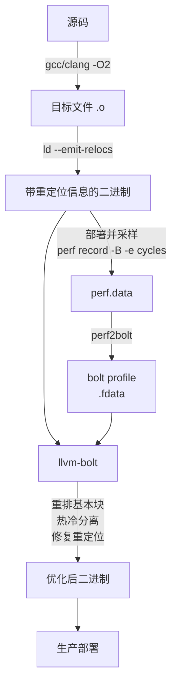

# BOLT 与链接后二进制优化

> [!abstract] TL;DR
> - LLVM-BOLT 在**链接之后**对已生成的二进制直接做基本块重排与函数热冷分离，无需修改源码或重新编译，降低 iTLB/icache miss。
> - 工作流三步：`perf record`（带 LBR）采样 → `perf2bolt` 转换 → `llvm-bolt` 重写二进制；目标文件须带 `--emit-relocs`。
> - BOLT 可**叠加在 PGO 之上**，Meta 实测两者叠加比单独使用任一更优（BOLT 在 PGO 之上再增 2–5%）。
> - Propeller 是 Google 的替代方案，基于 `basic-block-sections` 在链接阶段做布局，更早介入但需重新链接。
> - 主要限制：需要重定位信息（`--emit-relocs`/`--keep-relocs`）、调试信息地址失效、二进制体积轻微增大。
> - 适用于大型数据中心服务、启动时间敏感的二进制、以及 PGO 之后仍有 icache 瓶颈的场景。

---

## 概述与定位

### 什么是链接后优化

传统编译器优化管线在生成最终二进制后即停止工作。链接器负责把多个目标文件组合为可执行程序，但其布局策略相当保守：函数按目标文件、编译单元的排列顺序依次放置，并不考虑运行时的访问热度。这意味着即使编译器在每个单独的编译单元内做了完美的优化，最终二进制中热函数与冷函数的物理排列仍可能对 CPU 的 icache 和 iTLB 极度不友好。

**链接后优化（Post-Link Optimization，PLO）**就是在链接步骤完成之后，对二进制文件进行的进一步优化。它的核心优势在于：

1. **掌握完整的全程序视图**：与 LTO 类似，但无需重新编译，直接在机器码层面操作。
2. **可以利用真实运行 profile**：与 PGO 类似，但在更底层（二进制/基本块）重排，粒度更细。
3. **对构建系统侵入性低**：理论上可以处理任意来源的二进制（第三方库、混合语言等），只要有 profile 和重定位信息。

### LLVM-BOLT 的诞生背景

BOLT（Binary Optimization and Layout Tool）由 Meta（Facebook）的 Maksim Panchenko 等人开发，最初发表于 2019 年的 CGO 会议，后进入 LLVM 上游（`llvm-project/bolt`）。其动机来自 Meta 内部的观察：**大型 C++ 服务器应用即使经过 PGO 优化，仍有相当比例的 CPU 时间耗费在 icache 和 iTLB miss 上**，原因是函数内部的基本块排列在汇编层面并不总是最优的——编译器在单个编译单元内的布局优化无法看到整个程序的调用图热度。

BOLT 在全程序的机器码层面直接做基本块重排，突破了这一限制。Meta 内部数据显示 BOLT 可为大型 C++ 服务带来 **2–15% 的 CPU 时间节省**，典型数值在 5–8%。

---

## 原理与机制

### 核心思想：基本块重排

程序的一个函数在机器码层面由若干**基本块（basic block）**组成，每个基本块是一段顺序执行的指令序列（内部无跳转），末尾是条件跳转或无条件跳转。函数的控制流图（CFG）描述了这些基本块之间的跳转关系。

编译器在生成目标文件时，默认按代码书写顺序（或 `-O3` 的启发式规则）排列基本块。BOLT 的核心工作是根据**真实运行的 profile（具体是分支跳转的频次数据）**，重新安排这些基本块的物理顺序，使：

- **热路径（hot path）连续**：频繁执行的基本块在内存中紧邻排列，对 CPU 的预取和分支预测更友好。
- **直通路径优化**：高概率的分支目标排在"下一条指令"的位置，避免跳转开销。
- **热冷代码分离**：冷基本块（错误处理、罕见分支）从热函数中剥离，打包到 `.text.cold` 段，减少 icache 污染。

### 函数级重排

除基本块级别外，BOLT 还做**函数级重排（Function Reordering）**：将热函数打包在可执行文件的前部，使程序启动后的前 N 个 iTLB 条目都能命中热函数；冷函数移至尾部，甚至可以标注为不在启动阶段加载。

这一优化对**启动延迟**尤为有效，Meta 报告 BOLT 可将大型服务的 JIT warmup 阶段缩短 10–15%。

### 依赖重定位信息的原因

BOLT 在重排基本块时，需要修改所有指向被移动代码的**跳转指令目标地址**。如果链接器没有保留重定位信息（relocation entries），BOLT 就无法确定哪些字节是跳转目标（需要修改）、哪些只是普通数据（不能修改）——两者在机器码层面外观相同。

因此，BOLT 的使用必须在链接时加 `--emit-relocs`（GNU ld / gold / LLD 均支持），否则 BOLT 只能以"宽松模式"处理，跳过无法安全重写的部分，优化效果大打折扣。



---

## 工作流详解

### 前置要求：构建时保留重定位信息

```bash
# GCC 或 Clang 构建，链接阶段加 --emit-relocs
gcc -O2 -o myapp main.c foo.c bar.c \
    -Wl,--emit-relocs

# 如已有 PGO，在 PGO 优化构建后再加此选项（推荐叠加顺序）
clang -O2 -fprofile-instr-use=combined.profdata \
    -o myapp main.c foo.c bar.c \
    -Wl,--emit-relocs -fuse-ld=lld
```

验证二进制已包含重定位信息：

```bash
readelf -S myapp | grep -i rela
# 应看到 .rela.text 等段
```

### 阶段 1：采样（获取运行时 profile）

BOLT 需要分支级别的 profile，因此 `perf` 采样必须启用 **LBR（Last Branch Record）**——x86 处理器的硬件特性，可记录最近 N 条分支跳转的 from/to 地址对。

```bash
# 用代表性负载运行，采集 LBR 分支样本
# -b 启用 LBR；-e cycles 采样事件；采样时间根据应用调整
perf record -b -e cycles:u -o perf.data -- ./myapp --workload typical.dat

# 或对已在运行的服务做 attach 采样（不中断服务）
perf record -b -e cycles:u -p $(pgrep myapp) -o perf.data -- sleep 30
```

**注意**：LBR 只在 Intel Haswell（2013）及以后的处理器上可靠支持；AMD 对应的是 BRS（Branch Sampling）或 IBS，需要 perf2bolt 的特殊处理路径。ARM 架构目前对 BOLT 的支持尚在完善中（实验性支持 AArch64）。

### 阶段 2：Profile 转换

`perf2bolt` 将 perf.data 中的 LBR 数据转换为 BOLT 内部的 `.fdata` 格式：

```bash
perf2bolt -p perf.data -o perf.fdata ./myapp
```

常见问题与参数：

- 若二进制已剥离调试符号（stripped），加 `-nl` 跳过符号查找（精度略降）。
- `--ignore-build-id`：当 perf.data 与当前二进制的 build-id 不匹配时（如重新编译后用了旧 profile）强制转换，主要用于测试。
- 转换完成后，`perf.fdata` 包含每个基本块边（branch from → to）的执行次数。

### 阶段 3：BOLT 优化重写

```bash
llvm-bolt ./myapp \
    -o myapp.bolt \
    -data perf.fdata \
    -reorder-blocks=ext-tsp \
    -reorder-functions=hfsort+ \
    -split-functions \
    -split-all-cold \
    -split-eh \
    -dyno-stats
```

关键参数说明：

| 参数 | 说明 |
|------|------|
| `-reorder-blocks=ext-tsp` | 基本块重排算法，`ext-tsp`（Extended TSP）是当前最优算法，基于旅行商问题变体最大化直通边 |
| `-reorder-functions=hfsort+` | 函数重排，`hfsort+` 将热函数按调用图聚类后排序，相比朴素的按频次排序效果更好 |
| `-split-functions` | 启用热冷函数分离 |
| `-split-all-cold` | 将所有冷基本块从函数中剥离，聚合到 `.text.cold` 段 |
| `-split-eh` | 将异常处理表从热路径中分离（EH 表通常是冷数据，但物理上夹在热代码中） |
| `-dyno-stats` | 输出优化后的动态统计估计（跳转减少量、直通增加量等） |

典型输出片段：

```
BOLT-INFO: 24567 functions out of 38921 were optimized
BOLT-INFO: 15% hot instructions moved to cold regions
BOLT-INFO: estimated branch misprediction reduction: 8.3%
```

### 大型二进制的额外注意事项

对数百 MB 的大型二进制，`llvm-bolt` 内存消耗可能超过 10 GB。可以通过以下方式缓解：

```bash
# 只处理 profile 中出现的函数（跳过冷函数，大幅降低内存）
llvm-bolt ./myapp -o myapp.bolt -data perf.fdata \
    -reorder-blocks=ext-tsp \
    -update-only    # 只更新已有 profile 的函数，不做全量分析
```

---

## BOLT 与 PGO 的关系及叠加使用

### 优化层次的差异

PGO 和 BOLT 作用于不同的优化层次，互相补充而非替代：

| 维度 | PGO | BOLT |
|------|-----|------|
| 介入时机 | 编译时（第二遍编译） | 链接后（二进制层面） |
| 操作粒度 | IR 层面（函数、基本块、内联决策） | 机器码层面（基本块、函数物理布局） |
| 能做的优化 | 内联、devirtualization、寄存器分配、常量传播等 | 基本块重排、函数重排、热冷分离 |
| 不能做的优化 | 链接后的跨编译单元布局 | 内联、数据流优化 |

**推荐叠加顺序**：先做 PGO（让编译器内联/优化决策更精准），再做 BOLT（在已优化的机器码基础上进一步优化布局）。Meta 内部数据：PGO 单独 +10%，PGO + BOLT 叠加 +12–15%，增量约 2–5%。

### 实际叠加工作流

```bash
# 步骤 1：PGO instrumented build
clang -O2 -fprofile-instr-generate -o myapp_instr main.c

# 步骤 2：PGO training run
LLVM_PROFILE_FILE="pgo.profraw" ./myapp_instr --workload ...
llvm-profdata merge -o pgo.profdata pgo.profraw

# 步骤 3：PGO optimized build（同时保留重定位信息给 BOLT）
clang -O2 -fprofile-instr-use=pgo.profdata \
    -o myapp_pgo main.c \
    -Wl,--emit-relocs -fuse-ld=lld

# 步骤 4：BOLT sampling
perf record -b -e cycles:u -o perf.data -- ./myapp_pgo --workload ...
perf2bolt -p perf.data -o bolt.fdata ./myapp_pgo

# 步骤 5：BOLT optimization
llvm-bolt ./myapp_pgo -o myapp_final \
    -data bolt.fdata \
    -reorder-blocks=ext-tsp \
    -reorder-functions=hfsort+ \
    -split-functions -split-all-cold
```

---

## Propeller：Google 的替代方案

**Propeller**（Google，2021）是另一种链接时代码布局优化方案，思路与 BOLT 相似但介入时机更早——在**链接阶段**而非链接后阶段。

### 核心区别

Propeller 依赖 Clang 的 `-fbasic-block-sections=labels` 特性：编译器将每个基本块编译为独立的 ELF section，赋予独立符号，从而让链接器能按基本块粒度重排布局。

```bash
# 步骤 1：带 basic-block-sections 的 instrumented build
clang -O2 -fbasic-block-sections=labels \
    -fprofile-instr-generate \
    -o myapp_instr main.c

# 步骤 2：采样
perf record -b -e cycles:u -o perf.data -- ./myapp_instr ...

# 步骤 3：生成 Propeller profile
create_llvm_prof --binary=myapp_instr --profile=perf.data \
    --format=propeller --out=propeller_profile.txt

# 步骤 4：用 profile 重新编译并链接
clang -O2 -fbasic-block-sections=list=propeller_profile.txt \
    -o myapp_final main.c \
    -Wl,--symbol-ordering-file=propeller_profile.txt
```

### BOLT vs Propeller 对比

| 维度 | BOLT | Propeller |
|------|------|-----------|
| 介入时机 | 链接后（二进制重写） | 链接时（section 重排） |
| 是否需要 `--emit-relocs` | 是 | 否 |
| 是否需要重新编译 | 否 | 是（需要 `-fbasic-block-sections` 编译） |
| 调试信息影响 | 较大（地址全部改变） | 较小（编译器维护 debug 信息） |
| 成熟度 | 较高（LLVM 主线，生产验证充分） | 较低（仍在活跃开发，需要较新工具链） |
| 典型收益 | 5–15% | 3–10%（通常略低于 BOLT） |
| 适用场景 | 已有二进制的极致优化 | 构建系统可控、需要维护 debug 信息 |

Google 在其内部数据中心大规模使用 Propeller，并有公开论文（"Accelerating Representative Workloads on Google's Hyperscale Infrastructure"）描述其效果。

---

## 工具视角与实战

### 验证 BOLT 优化效果

优化前后用相同 benchmark 对比：

```bash
# 基准测试：记录优化前的 perf stat
perf stat -e cache-misses,L1-icache-misses,iTLB-misses \
    ./myapp --benchmark ...

# BOLT 优化后的同等测试
perf stat -e cache-misses,L1-icache-misses,iTLB-misses \
    ./myapp.bolt --benchmark ...
```

BOLT 的核心改善指标是 `L1-icache-misses` 和 `iTLB-misses`。若这两个指标下降明显（30–60% 是常见范围）而 CPU cycle 减少相对较少（5–10%），说明 icache miss 并非当前主要瓶颈，BOLT 收益有限。若 icache miss 本身就很低，BOLT 帮助不大，应考虑其他优化方向。

### 调试信息的处理

BOLT 重排后，原始二进制的调试信息（DWARF `.debug_info`、`.debug_line` 等）中的地址全部失效，因为指令地址已被全面重写。BOLT 默认会尝试更新 DWARF 信息：

```bash
llvm-bolt ./myapp -o myapp.bolt -data bolt.fdata \
    -reorder-blocks=ext-tsp \
    -update-debug-sections  # 尝试更新 DWARF（实验性，可能不完整）
```

**实用建议**：生产环境通常保留一份未做 BOLT 的带符号二进制（`myapp_pgo`）用于 core dump 分析，部署 `myapp.bolt`（stripped）用于实际运行，崩溃分析时用地址偏移量映射回原始符号。

### 与 CI/CD 集成的考量

BOLT 在 CI/CD 中的集成比 PGO 更复杂，因为它需要在**真实环境或高保真测试环境中运行插桩版本**来采样。常见策略：

1. **Canary 部署采样**：每次发布前，将新版本 `myapp_pgo`（带 `--emit-relocs`）部署到 5% 的 Canary 实例，用 `perf record` 采集 30–60 分钟的生产流量，再对下一次完整发布版本运行 BOLT。
2. **专用 staging 环境**：用录制回放（traffic replay）在 staging 上驱动插桩版本，采样后做 BOLT 优化，再部署到生产。
3. **定期 profile 更新**：每季度或每次大版本发布前全量更新一次 BOLT profile；中间版本复用旧 profile（收益轻微下降但仍为正）。

---

## 安全性与正确使用

### 正确使用原则与常见限制

**限制 1：必须有重定位信息**

若历史存量二进制没有用 `--emit-relocs` 构建，无法直接用 BOLT 做全量优化。BOLT 有一个"宽松"模式（`-lite` 模式）可处理无重定位信息的二进制，但只能做函数重排（不能做基本块重排），效果大幅下降。**最佳实践**：从立项之初就在链接选项中加上 `--emit-relocs`，几乎不影响二进制功能，只轻微增加文件体积（通常 5–10%）。

**限制 2：地址无关代码（PIE/ASLR）**

对使用 PIE（Position-Independent Executable）的二进制，BOLT 需要处理相对地址跳转（RIP-relative addressing），目前支持较好，但仍有边缘情况。建议在 CI 中对 BOLT 输出的二进制运行完整的功能测试套件，确认没有因地址重写引入的 bug。

**限制 3：体积增大**

BOLT 优化后的二进制体积通常增大 5–15%，原因是：
- 保留了原始代码（BOLT 把重排后的代码追加到原文件，部分模式下不删除原代码）。
- `.text.cold` 段独立存在，带来额外的段头开销。

可以用 `--strip-dwarf` 和 `strip` 工具在 BOLT 之后精简调试信息，部分缓解体积增大问题。

**限制 4：Java/JVM、Go、含自修改代码的程序**

BOLT 假设代码段在运行时不会自我修改（self-modifying code）。JVM 的 JIT 代码、Go 的运行时某些部分、以及显式使用 `mprotect` 做代码 patch 的程序不适合用 BOLT 处理（或需要只处理非 JIT 部分的静态代码）。

**限制 5：ARM/AArch64 支持有限**

x86-64 是 BOLT 的主平台，AArch64 支持处于"基本可用"状态（截至 LLVM 18），但部分高级功能（如 `-split-eh`）在 AArch64 上可能报错或跳过，需要实际测试。

---

## 小结

BOLT 代表了编译器优化管线在"编译 → 链接 → **运行**"闭环中的最后一个可介入点。它不依赖语言、编译器版本或构建系统的特殊支持，只需要重定位信息和真实运行的 profile，就能在二进制层面做出编译器无法完成的全程序视图优化。

其最大价值在于两点：一是**打破编译单元壁垒**，全程序的热函数/热基本块可以不受编译单元边界约束地做物理重排；二是**使用生产环境真实 profile**，训练数据的代表性远超人工构造的 benchmark。

对于大型数据中心服务（搜索、推荐、数据库等），BOLT 叠加 PGO 已成为业界极致优化的标配方案（Meta、Google 等公司均有公开案例）。对于中小型项目，PGO 单独使用的工程成本更低，性价比更高；当 PGO 已经就位且 perf 分析显示 icache/iTLB miss 仍是瓶颈时，才值得引入 BOLT。

---

## 相关阅读

- [[05.PGO_Profile_Guided_Optimization|PGO 完整专题：Profile-Guided Optimization]]
- [[03.GCC_G++_Complete_Reference|GCC/G++ 编译器完整参数详解]]
- [[01.Clang_Clang++_Complete_Reference|Clang/Clang++ 参考]]
- 官方文档参考：[LLVM BOLT GitHub](https://github.com/llvm/llvm-project/tree/main/bolt)、[BOLT 论文 CGO 2019](https://research.facebook.com/publications/bolt-a-practical-binary-optimizer-for-data-centers-and-beyond/)、[Propeller 设计文档](https://github.com/google/llvm-propeller)

---

> 📚 [[00.编译器完整参考 - 总索引|总索引]] ｜ ⬅️ 上一篇 [[05.PGO_Profile_Guided_Optimization|PGO 完整专题]] ｜ ➡️ 下一篇 [[07.Compiler_IR_GIMPLE_RTL_LLVM|编译器中间表示]]
