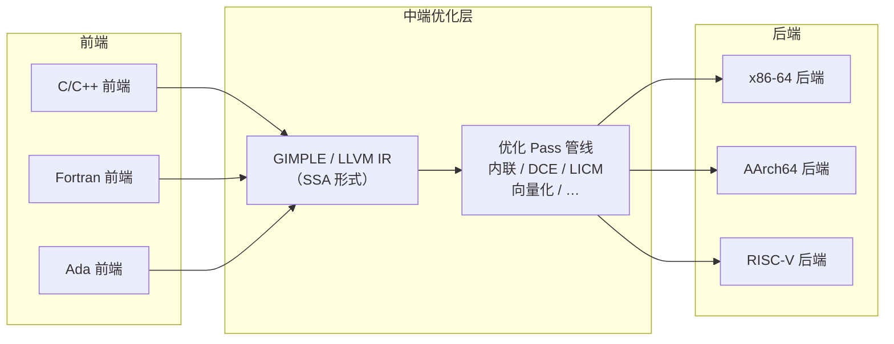
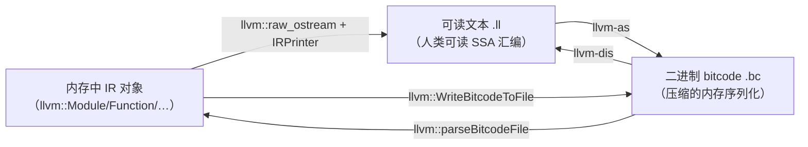
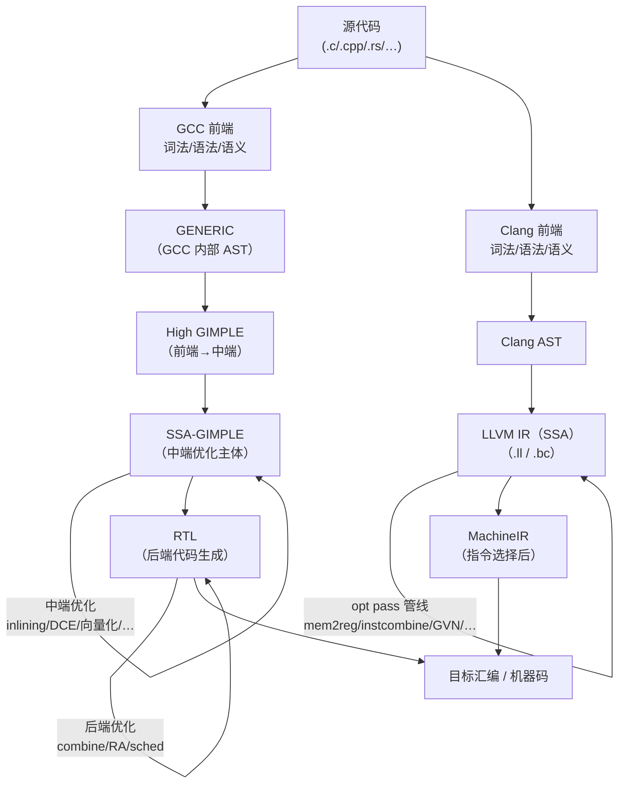

# 编译器中间表示（GIMPLE / RTL / LLVM IR / MSVC IL）

> [!abstract] TL;DR
> 中间表示（Intermediate Representation，IR）是编译器将源语言与目标机器解耦的关键抽象层。GCC 使用两层 IR：高层的 GIMPLE（树形三地址码，适合前端到中端优化）和低层的 RTL（寄存器传输语言，接近机器指令，适合指令选择与寄存器分配）。LLVM 统一使用一种 IR（SSA 形式，三种等价形态：内存对象、可读文本 `.ll`、二进制 bitcode），并提供完整的命令行工具链支持观测与手动操作。MSVC 的内部 IL 不对外公开，仅有极少数 `/d2` 调试开关可窥探。理解 IR 的结构与工具，是调优优化 pass、理解逆向分析、调试复杂内联失败的基础。

---

## 概述与定位

### 为什么需要中间表示

现代编译器的核心设计哲学是**前端、中端、后端分离**。

- **前端（Front-end）**：负责词法/语法/语义分析，生成与源语言对应的高层表示。它理解类型系统、模板展开、运算符重载等语言语义，但对目标机器毫不关心。
- **中端（Middle-end / Optimizer）**：对中间表示进行一系列与机器无关的变换，如常量折叠、公共子表达式消除、循环变换、内联等。中端不依赖具体硬件，因此可以为所有目标共享。
- **后端（Back-end / Code Generator）**：将优化后的中间表示映射到具体机器的指令集，处理指令选择、寄存器分配、指令调度等机器相关事项。

没有 IR，每种前端就需要直接为每种后端生成代码，形成 M × N 的复杂度爆炸。引入 IR 后，只需 M 个前端翻译到 IR，加上 N 个后端从 IR 生成目标代码，整体降为 M + N。



### 各编译器 IR 层概览

| 编译器 | 高层 IR | 低层 IR | 公开程度 |
|--------|---------|---------|---------|
| GCC | GIMPLE（含 SSA 化后的 SSA-GIMPLE） | RTL | 公开，可 `-fdump-*` 导出 |
| Clang/LLVM | Clang AST → LLVM IR（SSA） | MachineIR → MCInst | 完整工具链公开 |
| MSVC | 内部 HIR / MIR | 内部 LIR | 基本不公开 |
| GCC + Clang | — | — | — |

---

## 原理与机制

### SSA 形式与中间表示的关键特征

所有现代编译器的中端 IR 都倾向于采用**静态单赋值形式（Static Single Assignment，SSA）**。SSA 的核心约束：每个变量在整个程序中只被赋值一次。当控制流汇聚时，用 φ（Phi）函数选择来自不同前驱基本块的值。

```
// 原始代码（非 SSA）
x = 1;
if (cond) x = 2;
use(x);

// SSA 形式
x_1 = 1;
if (cond) x_2 = 2;
x_3 = φ(x_1, x_2);   // 在控制流汇合点插入 φ 节点
use(x_3);
```

SSA 的优势在于：每次使用都能唯一追溯到一次定义，极大简化了数据流分析。基于 SSA 的常量传播、死代码消除（DCE）、值编号（GVN）等算法的复杂度相比非 SSA 形式显著降低。

### GCC 双层 IR 的设计动机

GCC 的两层 IR 并非出于某种统一规划，而是历史演化的结果：

- **GIMPLE** 脱胎于 GCC 内部的 GENERIC 树表示，是 GCC 4.0 引入的三地址码形式。它在**抽象语法树（AST）层级之下、机器指令之上**操作，表达的是"高级语言语义去糖化之后"的计算，保留了函数、循环、分支等高层结构，足以进行内联、向量化、别名分析等中端优化。
- **RTL** 则非常接近目标机器的寄存器传输语义，使用伪寄存器表达操作数，每条 RTL 指令大致对应一条或少数几条目标指令。RTL 上进行的优化是机器相关的，包括指令组合（combine）、指令调度（scheduling）、寄存器分配（ra）。

这两层 IR 分工清晰：中端优化发生在 GIMPLE 层，后端代码生成从 RTL 层开始。

---

## 结构与算法详解

### GCC GIMPLE 详解

#### 结构特征

GIMPLE 将任意复杂的 C/C++ 表达式**分解为三地址码形式**：每条语句最多包含一个运算符，结果赋给一个临时变量。例如：

```c
// 原始 C 代码
a = b * c + d;

// GIMPLE 三地址码（示意）
_t1 = b * c;
a = _t1 + d;
```

GIMPLE 有高层形式（High GIMPLE）和低层形式（Low GIMPLE）之分。High GIMPLE 保留了 `try/catch`、`switch` 等高层语义结构；Low GIMPLE 将这些全部展开为跳转，进入 SSA 化之前必须先 lower 到 Low GIMPLE。

#### 观测 GIMPLE 的方法

```bash
# 导出所有 GIMPLE dump 文件（每个 pass 前后各一份）
gcc -O2 -fdump-tree-all foo.c -o /dev/null

# 只看最终 SSA 化之后的 GIMPLE
gcc -O2 -fdump-tree-gimple foo.c -o /dev/null

# 结果文件名形如 foo.c.003t.gimple / foo.c.006t.ssa 等
# 对应 pass 编号可查：gcc -O2 -v -fdump-tree-all 输出的 pass 列表
```

生成的 `.NNt.passname` 文件是纯文本，可直接用文本编辑器或 `grep` 查看。每个函数的 GIMPLE 表示以函数签名开头，后跟基本块列表，每个基本块以 `<bb N>:` 为标记，结尾是 φ 节点和语句序列。

#### 重要 GIMPLE 优化 Pass（选举）

| Pass 名称 | 作用 | 层级 |
|-----------|------|------|
| `gimple_lower` | High→Low GIMPLE 展开 | Low GIMPLE 化 |
| `build_ssa` | 构建 SSA 形式，插入 φ 节点 | SSA 化 |
| `inlining` | 内联展开（`-finline-functions`） | SSA GIMPLE |
| `ccp` | 条件常量传播（Conditional Constant Propagation） | SSA GIMPLE |
| `dce` | 死代码消除 | SSA GIMPLE |
| `loop-ivcanon` | 循归归纳变量规范化 | SSA GIMPLE |
| `slp-vectorize` | SLP 向量化（`-ftree-slp-vectorize`） | SSA GIMPLE |
| `loop-vectorize` | 循环向量化（`-ftree-vectorize`，`-O3` 默认开启） | SSA GIMPLE |
| `tail-merge` | 尾合并，缩减代码体积 | GIMPLE |

全部 pass 列表可用 `gcc -O2 -fdump-passes /dev/null` 查看（注意输出到 stderr）。

### GCC RTL 详解

#### 结构特征

RTL 是一种类 Lisp 的 S-表达式语言，每个 RTL 表达式称为 `rtx`。常见形式：

```
(insn 42 41 43 … (set (reg:SI 0 %eax) (plus:SI (reg:SI 1 %ecx) (const_int 1)))  …)
```

其中 `insn` 是指令节点，`set` 表示赋值，`reg:SI` 表示 32 位整数寄存器，`plus:SI` 表示 32 位加法，`const_int` 是立即数。

RTL 初始使用**伪寄存器（pseudo register）**，数量不受目标机器物理寄存器数量限制；寄存器分配 pass 之后才将伪寄存器映射到物理寄存器或栈槽。

#### 观测 RTL 的方法

```bash
# 导出所有 RTL dump（pass 前后各一份）
gcc -O2 -fdump-rtl-all foo.c -o /dev/null

# 只看初始 RTL 展开结果
gcc -O2 -fdump-rtl-expand foo.c -o /dev/null

# 只看寄存器分配后的 RTL
gcc -O2 -fdump-rtl-ira foo.c -o /dev/null

# 结果文件名形如 foo.c.225r.expand / foo.c.250r.ira 等
```

RTL 的可读性比 GIMPLE 差得多，适合编译器开发者分析指令生成质量，而非日常调优。

#### 重要 RTL 优化 Pass（选举）

| Pass 名称 | 作用 |
|-----------|------|
| `expand` | GIMPLE → RTL 的初始展开 |
| `combine` | 指令组合（多条 RTL 合并为一条，利用目标机器复合指令） |
| `regmove` | 消除不必要的寄存器复制 |
| `ira` | 集成寄存器分配（Integrated Register Allocator） |
| `reload` | 溢出寄存器的加载/存储插入 |
| `sched` | 指令调度（乱序/超标量流水线优化） |
| `cprop_hardreg` | 物理寄存器间的常量传播 |

### LLVM IR 详解

#### 三种等价形态

LLVM IR 是 LLVM 生态系统的核心，存在三种完全等价的形态，可以在它们之间相互转换：



- **文本 `.ll` 形态**：人类可读，是学习和调试 IR 的主要界面，语法类似汇编但带有强类型系统；
- **bitcode `.bc` 形态**：适合存储和分发（LTO 跨文件优化就依赖 bitcode）；
- **内存对象形态**：编译器运行时操作的 C++ 对象树，所有 Pass 都在这层工作。

#### LLVM IR 的语法特征

```llvm
; 函数定义
define i32 @add(i32 %a, i32 %b) {
entry:
  %result = add i32 %a, %b      ; 三地址码形式
  ret i32 %result
}

; SSA + φ 节点示例
define i32 @max(i32 %a, i32 %b) {
entry:
  %cmp = icmp sgt i32 %a, %b    ; 有符号大于比较
  br i1 %cmp, label %then, label %else
then:
  br label %merge
else:
  br label %merge
merge:
  ; φ 节点：从 then 块取 %a，从 else 块取 %b
  %result = phi i32 [ %a, %then ], [ %b, %else ]
  ret i32 %result
}
```

LLVM IR 的类型系统是强类型的：`i32` 是 32 位整数，`i8*`（或 LLVM 15+ 的 `ptr`）是指针，`<4 x float>` 是 4 元素浮点向量。这种类型信息让 Pass 可以安全地进行基于类型的推理。

#### 生成与操作 LLVM IR 的工具

```bash
# 生成可读文本 IR（.ll 文件）
clang -O0 -emit-llvm -S foo.c -o foo.ll

# 生成 bitcode（.bc 文件）
clang -O0 -emit-llvm -c foo.c -o foo.bc

# 反汇编 bitcode → 文本 IR
llvm-dis foo.bc -o foo.ll

# 汇编文本 IR → bitcode
llvm-as foo.ll -o foo.bc

# 用 opt 手动跑指定优化 Pass（旧语法）
opt -mem2reg -dce foo.bc -o foo_opt.bc

# 用 opt 新 Pass 管理器语法（LLVM 12+）
opt -passes="mem2reg,dce" foo.bc -o foo_opt.bc

# 查看可用 Pass 列表
opt --help-hidden | grep "pass"
llc --print-passes

# 将 LLVM IR 编译为目标汇编
llc -march=x86-64 foo.ll -o foo.s

# 使用 clang 编译时直接打印 LLVM IR（不写文件）
clang -O2 -mllvm -print-after-all foo.c -o /dev/null 2>&1 | less
```

#### 重要 LLVM Pass（选举）

| Pass 名称 | 作用 |
|-----------|------|
| `mem2reg` | 将 `alloca`/`load`/`store` 转换为 SSA φ 节点（最关键的 SSA 构建 pass） |
| `instcombine` | 指令合并（类似 GCC combine）|
| `gvn` | 全局值编号（消除冗余计算） |
| `sccp` | 稀疏条件常量传播 |
| `licm` | 循环不变量外提（Loop Invariant Code Motion） |
| `loop-vectorize` | 循环自动向量化 |
| `slp-vectorize` | SLP 向量化 |
| `inline` | 函数内联 |
| `jump-threading` | 跳转线程化（消除条件分支跳转链） |

### MSVC 内部 IL

MSVC 编译器（`cl.exe`）的内部 IR 从未公开规格，也不存在标准导出接口。微软将中间层称为 **HIR**（High-level IR）、**MIR**（Mid-level IR）、**LIR**（Low-level IR），但这些名称仅出现在少量学术演讲中，并非官方文档术语。

极少数 `/d2` 系列的隐藏开关可以窥探 MSVC 的内部 IL，但这些开关：

- **无文档、无稳定性保证**，任何版本升级后可能失效或行为改变；
- 输出格式是 MSVC 私有，没有公开的语法规范；
- 主要用于微软内部调试，不适合依赖于生产环境。

```
cl /d2dumpIR foo.cpp          # 极少数版本支持，输出私有 IR（不稳定）
cl /d2SSAOptimize- foo.cpp    # 禁用某些 SSA 优化（调试用）
```

对于需要观测 MSVC 生成代码质量的场景，实际上更可靠的手段是：

1. 用 `/FA`（生成汇编文件）直接看最终汇编输出：`cl /FA /O2 foo.cpp`；
2. 用 [Compiler Explorer（godbolt.org）](https://godbolt.org) 对比不同版本 MSVC 的汇编输出；
3. 利用 `/Qpar-report:2`、`/Qvec-report:2` 查看向量化报告（这是有文档的）。

---

## 工具视角与实战

### 观测优化决策：`-fopt-info`（GCC）

`-fopt-info` 让 GCC 在编译时打印优化 pass 的决策信息，对于调优循环向量化和内联尤其有价值：

```bash
# 打印所有优化信息到 stderr
gcc -O3 -fopt-info foo.c -o foo

# 只打印向量化信息
gcc -O3 -fopt-info-vec foo.c -o foo

# 打印未向量化及原因
gcc -O3 -fopt-info-vec-missed foo.c -o foo

# 打印内联决策
gcc -O3 -fopt-info-inline-missed foo.c -o foo

# 将优化信息写入文件（而非 stderr）
gcc -O3 -fopt-info-vec-optimized=/tmp/vec.log foo.c -o foo
```

输出示例（向量化成功）：

```
foo.c:12:5: optimized: loop vectorized using 16 byte vectors
foo.c:12:5: optimized: loop versioned for vectorization because of possible aliasing
```

输出示例（向量化失败）：

```
foo.c:25:3: missed: couldn't vectorize loop
foo.c:26:7: missed: not vectorized: relevant stmt not supported: _3 = *_2;
```

### 观测优化决策：`-Rpass=`（Clang）

Clang 通过 `-Rpass=`（报告 pass 成功）、`-Rpass-missed=`（报告 pass 失败/跳过）、`-Rpass-analysis=`（报告详细分析）三组选项提供优化可见性：

```bash
# 报告所有内联决策
clang -O2 -Rpass=inline foo.c -o foo

# 报告向量化器的所有决策（含失败原因）
clang -O2 -Rpass-missed=loop-vectorize foo.c -o foo
clang -O2 -Rpass=loop-vectorize foo.c -o foo

# 报告所有 pass 的分析信息（非常详细）
clang -O2 -Rpass-analysis=loop-vectorize foo.c -o foo

# 以 LLVM 格式将 remark 输出到 YAML 文件（可机器解析）
clang -O2 -fsave-optimization-record -foptimization-record-file=remarks.yaml foo.c -o foo
```

### 完整编译管线可视化



### 利用 IR 调试内联失败

内联失败是性能问题中常见但难以察觉的原因。结合 IR dump 和优化报告，可以精确定位：

```bash
# GCC：查看内联后的 GIMPLE（内联发生在 inlining pass）
gcc -O2 -fdump-tree-einline foo.c -o /dev/null
# 输出文件：foo.c.NNNt.einline

# Clang：报告内联失败原因
clang -O2 -Rpass-missed=inline -Rpass-analysis=inline foo.c -o foo
# 示例输出：
# foo.c:8:3: remark: foo not inlined into bar because its size (32) was greater
#            than the threshold (25) [-Rpass-missed=inline]
```

常见内联失败原因：

- 函数体过大（超过 `-finline-limit` 或 LLVM 的内联代价阈值）；
- 函数为间接调用（函数指针、虚函数），去虚化（devirtualization）未发生；
- 函数被标记 `__attribute__((noinline))` 或 `[[msvc::noinline]]`；
- 函数跨编译单元且未启用 LTO/IPO。

---

## 安全性与正确使用

### dump 文件体积与性能

`-fdump-tree-all` 和 `-fdump-rtl-all` 会为每个源文件的每个 pass 生成一个文件，对于大型项目可能产生**数千个 dump 文件，总体积达数 GB**。正确做法：

1. 仅对目标文件使用 dump 选项，而非整个项目；
2. 优先用具名 pass 的单独 dump（如 `-fdump-tree-gimple`、`-fdump-rtl-ira`）而非 `-all`；
3. dump 会显著增加编译时间（每个 dump 文件都要序列化），不要在 CI 中开启。

### LLVM bitcode 与 LTO 的注意点

`-emit-llvm -c` 生成的 `.bc` 文件实质上是 LLVM bitcode，不是传统目标文件（`.o`）。链接器（`ld`/`lld`）不能直接链接 bitcode，除非：

1. 使用 `lld` 并开启 `--lto-O2` 等 LTO 选项；
2. 或通过 `llvm-link` 先将多个 bitcode 合并，再用 `llc` 生成目标文件。

混用普通 `.o` 和 `.bc` 文件链接时，若使用了非 LTO-aware 的链接器，会报 `unrecognized file format` 错误。

### GIMPLE dump 与实际编译行为的对应

`-fdump-tree-gimple`（不带其他 `-O` 级别）生成的是**未经优化的 GIMPLE**，而实际 `-O2` 编译路径中 GIMPLE 会经历几十个 pass 的变换。因此：

- 要研究某 pass 之前/之后的状态，需使用 `-fdump-tree-all` 并找到对应编号的文件；
- 编号和 pass 名的映射可用 `gcc -O2 -fdump-passes /dev/null 2>&1 | grep tree` 查看；
- pass 顺序和 pass 是否开启取决于 `-O` 级别，不同优化等级下的 pass 列表不同。

### MSVC `/d2` 开关的风险

使用 MSVC 隐藏调试开关（`/d2*` 系列）存在以下风险：

- 可能导致编译崩溃（crash in compiler frontend/backend）；
- 可能改变编译语义产生错误的输出（仅用于 MSVC 开发者内部调试，不保证行为）；
- 部分开关会使链接器拒绝生成的目标文件；
- 任何依赖 `/d2` 输出的脚本在 MSVC 版本更新后可能静默失效。

---

## 小结

中间表示是编译器内部将语言语义与机器语义解耦的关键层次。理解以下要点可以在实践中发挥最大价值：

1. **GCC 双层 IR**：GIMPLE（高层，SSA，中端优化的工作台）和 RTL（低层，接近机器，后端代码生成的工作台）分工明确；`-fdump-tree-*` 和 `-fdump-rtl-*` 是主要观测工具。
2. **LLVM IR**：统一的 SSA 形式，三种等价形态（内存、文本 `.ll`、bitcode `.bc`）之间可自由转换；`clang -emit-llvm -S`、`opt`、`llvm-dis`、`llvm-as`、`llc` 构成完整工具链，是可观测性最好的编译器 IR。
3. **优化可见性工具**：GCC 的 `-fopt-info`（含 `-vec`、`-inline`、`-missed` 变体）和 Clang 的 `-Rpass=`/`-Rpass-missed=` 是诊断优化决策的首选，比阅读原始 dump 高效。
4. **MSVC 内部 IL**：不对外公开，`/d2` 系列仅供 MSVC 开发者内部调试，生产代码调优应依赖 `/FA` 汇编输出和向量化报告。
5. **逆向与调试视角**：IR 层的理解有助于解释为何某段代码生成了意料之外的汇编（优化 pass 的具体变换），也有助于理解逆向工程中常见的"去糖化"模式（如三地址码结构、φ 节点对应的汇编跳转）。

---

## 相关阅读

- [[00.编译器完整参考 - 总索引|编译器完整参考 · 总索引]]
- [[03.GCC_G++_Complete_Reference|GCC/G++ 完整参数详解]]（含 `-fdump-*`、`-fopt-info` 选项）
- [[01.Clang_Clang++_Complete_Reference|Clang/Clang++ 完整参数详解]]（含 `-Rpass=` 等）
- [[04.MSVC_Complete_Reference|MSVC 完整参数详解]]（含 `/FA`、向量化报告）
- [[08.Inline_Asm_and_Intrinsics|内联汇编与 SIMD Intrinsics]]
- [[06.BOLT_Post_Link_Optimization|BOLT 与链接后优化]]

---

> 📚 [[00.编译器完整参考 - 总索引|总索引]] ｜ ⬅️ 上一篇 [[06.BOLT_Post_Link_Optimization|BOLT 与链接后优化]] ｜ ➡️ 下一篇 [[08.Inline_Asm_and_Intrinsics|内联汇编与 Intrinsics]]
