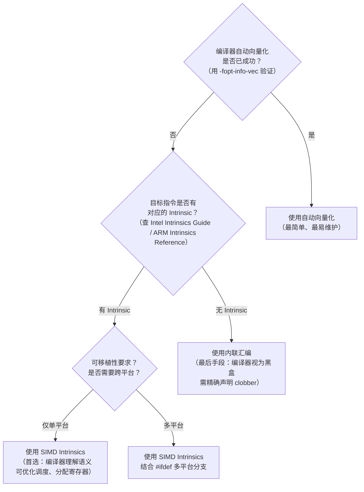

# 内联汇编与 SIMD Intrinsics

> [!abstract] TL;DR
> 内联汇编（inline assembly）与 SIMD Intrinsics 是在高级语言中精确控制底层机器指令的两条主要路径。GCC/Clang 的 extended asm 语法（`asm volatile("..." : 输出 : 输入 : clobber)`）提供完整的约束与 clobber 机制，可安全与编译器优化器共存；MSVC 仅在 x86-32 支持 `__asm{}`，x86-64 完全不支持内联汇编，需改用 intrinsics。SIMD Intrinsics（`<immintrin.h>` SSE/AVX/AVX-512、`<arm_neon.h>` ARM NEON）以 C 函数形式封装向量指令，可移植性优于内联汇编，是性能关键路径的首选手段。编译器内置函数（`__builtin_expect`/`__builtin_popcount`/`_BitScanForward` 等）则提供位运算、分支预测提示等轻量级底层能力。

---

## 概述与定位

### 为何需要内联汇编与 Intrinsics

高级语言（C/C++）的抽象层屏蔽了机器细节，但也带来了两类无法单靠编译器解决的需求：

1. **无法表达的操作**：某些指令没有对应的高级语言语义。例如，原子读-改-写指令（`lock cmpxchg`）、特殊系统调用（`syscall`/`int 0x80`）、进出特权级（`in`/`out` 端口指令）、特定加密指令（`aesenc`）等，在 C/C++ 标准语言层无法直接表达。
2. **编译器生成代码质量不足**：自动向量化（auto-vectorization）需要编译器能识别循环体的规律模式，但许多复杂算法（非连续内存访问、跨步加载、条件混合）超出自动向量化的能力范围，必须手动编写 SIMD 代码。

Intrinsics 相对于内联汇编有明显优势：编译器**理解** Intrinsics 的语义（类型、延迟、吞吐），可以在它们之间进行指令调度、寄存器分配等优化；而对于内联汇编块，编译器只能将其视为黑盒。因此：

- **首选 Intrinsics**：当目标平台固定、需要 SIMD 优化时；
- **次选内联汇编**：当需要的指令/序列无对应 Intrinsic，或需要精确控制指令序列时；
- **考虑自动向量化**：当算法模式规则，且 `-fopt-info-vec` 证明向量化已成功时。

---

## 原理与机制

### GCC/Clang Extended Asm 的工作原理

GCC/Clang 的 extended asm 语法让编译器能够将内联汇编与周围的 C 代码安全交织，核心机制是**约束（constraint）**与**clobber 列表**。

约束告诉编译器：某个操作数应该放在什么地方（寄存器、内存、立即数），这样编译器在分配寄存器时能避免冲突，也能在汇编代码生成时替换正确的操作数占位符（`%0`、`%1` 等）。

clobber 列表告诉编译器：汇编代码会破坏哪些状态（哪些寄存器的值、条件码、内存）。如果不声明 clobber，编译器可能错误地认为某寄存器的值在汇编块之后仍然有效，导致难以察觉的 bug。

```mermaid
graph LR
    C_SRC["C 代码中的变量<br/>int a, b, result"]
    CONSTRAINT["约束字符串<br/>\"=r\" / \"r\" / \"m\" / \"i\"<br/>告诉编译器如何分配操作数"]
    ASM_BLOCK["汇编块<br/>用 %0/%1 引用操作数<br/>编译器替换为实际寄存器名"]
    CLOBBER["Clobber 列表<br/>\"cc\" / \"memory\" / \"rax\"<br/>告诉编译器哪些状态被破坏"]
    COMPILER["编译器寄存器分配器<br/>在约束+clobber 信息下<br/>安排内联汇编的上下文"]
    C_SRC --> CONSTRAINT
    CONSTRAINT --> ASM_BLOCK
    ASM_BLOCK --> CLOBBER
    CLOBBER --> COMPILER
    COMPILER --> ASM_BLOCK
```

### AT&T 语法 vs Intel 语法

GCC 默认使用 **AT&T 语法**（源自 Unix 传统），与 Intel/NASM 语法在操作数顺序和寄存器写法上相反：

| 特征 | AT&T 语法（GCC 默认） | Intel 语法（MSVC / NASM） |
|------|----------------------|--------------------------|
| 操作数顺序 | `src, dst`（源在左） | `dst, src`（目标在左） |
| 寄存器前缀 | `%rax`（百分号） | `rax`（无前缀） |
| 立即数前缀 | `$42`（美元号） | `42`（无前缀） |
| 内存访问 | `(%rax)`、`8(%rsp)` | `[rax]`、`[rsp+8]` |
| 指令后缀 | `movl`、`movq`（显式宽度） | `mov`（从操作数推断宽度） |
| 示例 | `movq %rax, %rbx` | `mov rbx, rax` |

GCC 内联汇编也支持 Intel 语法，需在编译时加 `-masm=intel`，或在 `asm` 块中使用 `.intel_syntax noprefix`/`.att_syntax prefix` 指令切换：

```c
// AT&T 语法（GCC 默认）
asm("movl %1, %0" : "=r"(dst) : "r"(src));

// Intel 语法（需 -masm=intel 或局部切换）
asm(".intel_syntax noprefix\n\t"
    "mov %0, %1\n\t"
    ".att_syntax prefix"
    : "=r"(dst) : "r"(src));
```

---

## 结构与算法详解

### GCC/Clang Extended Asm 语法全解

完整语法：

```c
asm [volatile] ( "汇编模板"
                 : 输出操作数列表
                 : 输入操作数列表
                 : clobber 列表 );
```

#### 约束字符串详解

约束字符串控制每个操作数的放置位置：

| 约束 | 含义 |
|------|------|
| `"r"` | 通用寄存器（编译器自动选择） |
| `"m"` | 内存操作数（编译器自动选择内存地址） |
| `"i"` | 整数立即数（编译时已知的常量） |
| `"n"` | 非浮点立即数 |
| `"g"` | 通用（寄存器、内存或立即数均可） |
| `"a"` | 强制使用 `eax`/`rax` |
| `"b"` | 强制使用 `ebx`/`rbx` |
| `"c"` | 强制使用 `ecx`/`rcx` |
| `"d"` | 强制使用 `edx`/`rdx` |
| `"S"` | 强制使用 `esi`/`rsi` |
| `"D"` | 强制使用 `edi`/`rdi` |
| `"q"` | 可以作为字节寄存器访问的通用寄存器（`a/b/c/d`） |
| `"x"` | SSE 寄存器（`xmm0`-`xmm15`） |
| `"Yz"` | 强制 `xmm0`（用于某些需要固定寄存器的 SSE 指令） |

#### 约束修饰符

| 修饰符 | 含义 |
|--------|------|
| `"="` | 输出操作数（只写，初始值未定义） |
| `"+"` | 读写操作数（既读又写） |
| `"&"` | 早 clobber（该输出在所有输入读取前即被写入，不能与任何输入共用寄存器） |
| 数字 `"0"`-`"9"` | 与第 N 个操作数使用相同的寄存器（操作数绑定） |

```c
// 示例：32 位加法，result 是只写输出，a/b 是只读输入
int result;
asm("addl %2, %0"
    : "=r"(result)        // %0：输出，通用寄存器
    : "0"(a), "r"(b)      // %1：输入，绑定到 %0 同一寄存器（即 a 先装入 result 的寄存器）；%2：输入，另一通用寄存器
    );
// 等价于 result = a + b，但强制使用 addl 指令

// 示例：读写操作数（+）
asm("incl %0"
    : "+r"(counter)       // counter 既被读取又被写入
    );
```

#### clobber 列表详解

| clobber 项 | 含义 |
|------------|------|
| `"cc"` | 汇编代码修改了条件码寄存器（EFLAGS/CPSR），编译器不能依赖 asm 之后的条件码状态 |
| `"memory"` | 汇编代码以不可预测的方式读写内存（相当于内存屏障），编译器必须刷新所有缓存在寄存器中的内存值，也不能将内存访问移过此 asm 块 |
| `"rax"`、`"rcx"` 等 | 特定寄存器被汇编代码破坏（但不属于输出操作数），编译器不能在 asm 之后依赖这些寄存器的旧值 |

**`"memory"` clobber 是最重要的**：任何对内存有副作用的内联汇编（原子操作、I/O 指令、调用了不可见代码的操作）都应该声明 `"memory"` clobber，否则编译器可能将周围的内存访问优化掉或重排。

```c
// 错误示例：忘记声明 "memory" clobber
// 编译器可能将 *ptr 的读取提升到 asm 之前
int val;
asm volatile("mfence");   // 内存屏障，但没有 clobber "memory"
val = *ptr;               // 编译器可能已经把 *ptr 缓存在寄存器中

// 正确做法
asm volatile("mfence" ::: "memory");
val = *ptr;               // 编译器被迫重新从内存读取
```

#### `volatile` 关键字的作用

不带 `volatile` 的 `asm` 块，如果输出操作数未被使用，编译器**可以完全删除**该块（视为死代码）。带 `volatile` 则禁止编译器删除或移动该块（但不能完全阻止所有重排，还需配合 `"memory"` clobber）。

**何时必须用 `volatile`**：

- asm 有 clobber 副作用（修改状态，但没有输出操作数），如 `cpuid`、`mfence`、端口 I/O；
- asm 的执行次数本身有意义（如计时、循环计数器读取 `rdtsc`）；
- asm 依赖/影响内存，且需要防止编译器移动它。

#### `asm goto` 扩展

`asm goto` 允许内联汇编跳转到 C 标签，是实现跳转表、分发器等低层结构的利器（Linux 内核广泛使用）：

```c
int val = some_value();
asm goto("cmpl $0, %0\n\t"
         "je %l1\n\t"       // %l1 是标签 zero 的地址
         : : "r"(val) : : zero);
// 正常执行路径继续
printf("非零\n");
return;
zero:
printf("零\n");
```

### MSVC `__asm{}` 语法

MSVC 的内联汇编使用 Intel 语法，格式简单，但**仅支持 x86-32**：

```c
// 仅在 x86-32 模式下编译（不支持 /arch:x64）
int result;
__asm {
    mov eax, a      ; Intel 语法，无前缀
    add eax, b
    mov result, eax
}

// 单行形式
__asm mov eax, 0
__asm xor eax, eax
```

MSVC `__asm{}` **在 x64 编译目标下不存在**（编译器直接报错）。x64 下应改用：

1. **Intrinsics**（首选，`<intrin.h>` 或 `<immintrin.h>`）；
2. **独立的 `.asm` 文件**（MASM 语法，通过自定义构建规则集成到 MSBuild）；
3. 部分场景可用 **`__forceinline` + Intrinsics** 绕过。

MSVC `__asm{}` 与 GCC extended asm 的重要差异：

- MSVC `__asm{}` **没有约束语法**，操作数通过 C 变量名直接引用（编译器自动处理），但这也意味着**编译器对汇编块内部完全不知情**，无法优化；
- MSVC 将 `__asm{}` 块视为完整的寄存器 clobber（EBX 除外，MSVC 文档有特殊规定）；
- GCC extended asm 必须显式声明所有 clobber，更灵活但也更容易出错。

### SIMD Intrinsics 详解

#### x86 SSE / AVX / AVX-512

Intel 的 SIMD Intrinsics 通过头文件层次引入：

```
<mmintrin.h>    → MMX（已过时，不推荐使用）
<xmmintrin.h>   → SSE（128 位，float）
<emmintrin.h>   → SSE2（128 位，integer/double）
<pmmintrin.h>   → SSE3
<tmmintrin.h>   → SSSE3
<smmintrin.h>   → SSE4.1
<nmmintrin.h>   → SSE4.2
<immintrin.h>   → AVX / AVX2 / AVX-512（推荐：包含以上所有）
<zmmintrin.h>   → AVX-512（也包含在 immintrin.h 中）
```

命名规则：`_mm[宽度]_操作_类型后缀`

- 无宽度前缀：128 位（`__m128`、`__m128i`、`__m128d`）
- `_mm256_`：256 位（`__m256`、`__m256i`、`__m256d`），需 AVX2
- `_mm512_`：512 位（`__m512`、`__m512i`、`__m512d`），需 AVX-512

类型后缀示例：`_ps`（packed single float）、`_pd`（packed double）、`_epi32`（packed int32）、`_epi8`（packed int8）。

```c
#include <immintrin.h>

// 示例：对 8 个 float 做向量加法（AVX）
void add_floats_avx(float* dst, const float* a, const float* b, int n) {
    int i = 0;
    for (; i <= n - 8; i += 8) {
        __m256 va = _mm256_loadu_ps(&a[i]);    // 未对齐加载（u = unaligned）
        __m256 vb = _mm256_loadu_ps(&b[i]);
        __m256 vc = _mm256_add_ps(va, vb);     // 8 个 float 并行相加
        _mm256_storeu_ps(&dst[i], vc);          // 未对齐存储
    }
    // 处理尾部（< 8 个元素）
    for (; i < n; i++) dst[i] = a[i] + b[i];
}
```

编译时需要指定支持的指令集：

```bash
# GCC/Clang：启用 AVX2
gcc -O2 -mavx2 foo.c -o foo

# 或通过 -march 隐式开启（march=native 自动检测本机 CPU）
gcc -O3 -march=native foo.c -o foo

# 启用 AVX-512
gcc -O2 -mavx512f -mavx512dq foo.c -o foo
```

**对齐加载 vs 未对齐加载**：`_mm256_load_ps` 要求地址 32 字节对齐，否则运行时 General Protection Fault；`_mm256_loadu_ps` 无对齐要求，但在某些微架构上略慢。现代 CPU（Intel Haswell 以后、AMD Zen 以后）两者性能差异已极小，**推荐默认使用 `_loadu`**，避免意外崩溃。

#### ARM NEON

ARM NEON Intrinsics 通过 `<arm_neon.h>` 引入，命名规则为 `v操作q_类型`（`q` 表示 128 位，无 `q` 表示 64 位）：

```c
#include <arm_neon.h>

// 示例：对 4 个 uint32_t 做向量加法（128 位 NEON）
void add_u32_neon(uint32_t* dst, const uint32_t* a, const uint32_t* b, int n) {
    int i = 0;
    for (; i <= n - 4; i += 4) {
        uint32x4_t va = vld1q_u32(&a[i]);    // 加载 4 个 uint32
        uint32x4_t vb = vld1q_u32(&b[i]);
        uint32x4_t vc = vaddq_u32(va, vb);   // 4 个 uint32 并行相加
        vst1q_u32(&dst[i], vc);               // 存储
    }
    for (; i < n; i++) dst[i] = a[i] + b[i];
}
```

编译 ARM NEON 代码：

```bash
# 交叉编译到 AArch64（NEON 是 AArch64 的标准组成部分，无需额外标志）
aarch64-linux-gnu-gcc -O2 foo.c -o foo

# 编译到 ARMv7（需显式启用 NEON）
arm-linux-gnueabihf-gcc -O2 -mfpu=neon foo.c -o foo

# 或用 -march 指定
arm-linux-gnueabihf-gcc -O2 -march=armv7-a+neon foo.c -o foo
```

NEON 类型命名规律：`uint32x4_t`（4 个 uint32）、`int16x8_t`（8 个 int16）、`float32x4_t`（4 个 float）、`float64x2_t`（2 个 double，需 AArch64）。

#### Intel Intrinsics Guide

Intel 官方提供了完整的 Intrinsics 查询工具（[Intel Intrinsics Guide](https://www.intel.com/content/www/us/en/docs/intrinsics-guide/index.html)），可按指令集、操作类型、性能参数（延迟/吞吐）筛选。**每次编写新的 Intrinsics 代码时，建议查阅此工具确认：**

1. 是否需要特定指令集标志（`-mavx2` 等）；
2. 指令的延迟（latency）和吞吐（throughput），避免选择延迟过高的指令组合；
3. 对应的实际机器指令名称（用于验证编译器是否正确生成）。

### 编译器内置函数（Compiler Builtins）

编译器内置函数（builtins）是编译器直接识别并映射到高效机器指令的函数，不需要单独的头文件（`__builtin_*` 系列直接可用）。

#### GCC/Clang 常用内置函数

```c
// 分支预测提示
if (__builtin_expect(error_occurred, 0)) { /* 冷路径 */ }
// 或 C++20 [[likely]] / [[unlikely]] attribute

// 整数位运算
int bits = __builtin_popcount(x);       // 统计 1 的个数（Population Count）
int bits64 = __builtin_popcountll(x64); // 64 位版本
int clz = __builtin_clz(x);             // Count Leading Zeros（结果未定义当 x==0）
int ctz = __builtin_ctz(x);             // Count Trailing Zeros（结果未定义当 x==0）

// 安全版本（x==0 时返回 0）
int clz_safe = x ? __builtin_clz(x) : 32;

// 预取（提示 CPU 预取缓存行）
__builtin_prefetch(ptr, 0, 3);  // 0=读取预取，3=时间局部性最强（L1 保留）
__builtin_prefetch(ptr, 1, 0);  // 1=写入预取，0=最弱时间局部性（NTA）

// 类型无关最大/最小（避免函数调用开销）
// 注意：这些是 GNU 扩展，只在 GCC 有效
// C 标准库有 fmax/fmin，整数请用三元运算符或 std::max/min

// 不可达标记（优化器断言此处不可达）
__builtin_unreachable();  // C++23 可改用 std::unreachable()
```

#### MSVC 对应内置函数

```c
#include <intrin.h>     // MSVC 通用内置头文件

// 整数位运算
unsigned int cnt = __popcnt(x);          // 等价 GCC __builtin_popcount
unsigned long long cnt64 = __popcnt64(x64);

// 位扫描（注意：返回 bool，结果通过 out 参数传出）
unsigned long index;
_BitScanForward(&index, x);   // 等价 GCC __builtin_ctz（找最低位 1 的位置）
_BitScanReverse(&index, x);   // 等价 GCC __builtin_clz 的变体（找最高位 1）
_BitScanForward64(&index, x64);
_BitScanReverse64(&index, x64);

// 预取
_mm_prefetch((char*)ptr, _MM_HINT_T0);   // T0=L1，T1=L2，T2=L3，NTA=非时间性
```

---

## 工具视角与实战

### AT&T vs Intel 语法对比代码

```c
#include <stdint.h>

// ──────────────────────────────────────────────────────────────
// 场景：用 XCHG 指令原子地将寄存器值与内存值交换（GCC AT&T 语法）
// ──────────────────────────────────────────────────────────────
static inline int atomic_xchg_att(int* ptr, int val) {
    // AT&T 语法：src 在左，dst 在右
    // "+" 表示 val 是读写操作数（输入旧值，输出交换后的值）
    // "m" 表示 *ptr 是内存操作数
    asm volatile("xchgl %0, %1"
                 : "+r"(val), "+m"(*ptr)
                 :
                 : "memory");
    return val;  // 返回旧内存值
}

// ──────────────────────────────────────────────────────────────
// 场景：用 CPUID 读取 CPU 特性（GCC AT&T 语法）
// ──────────────────────────────────────────────────────────────
static inline void cpuid(uint32_t leaf,
                         uint32_t* eax, uint32_t* ebx,
                         uint32_t* ecx, uint32_t* edx) {
    asm volatile("cpuid"
                 : "=a"(*eax), "=b"(*ebx), "=c"(*ecx), "=d"(*edx)
                 : "a"(leaf)   // 输入：leaf 值装入 eax
                 );
    // 注意：cpuid 本身会破坏 eax/ebx/ecx/edx，但这里全部作为输出操作数
    // 所以不需要额外的 clobber
}

// ──────────────────────────────────────────────────────────────
// 场景：用 RDTSC 读取时间戳计数器
// ──────────────────────────────────────────────────────────────
static inline uint64_t rdtsc(void) {
    uint32_t lo, hi;
    asm volatile("rdtsc"
                 : "=a"(lo), "=d"(hi)   // edx:eax 存放结果
                 :
                 : "memory");           // 防止编译器重排周围的内存访问
    return ((uint64_t)hi << 32) | lo;
}

// ──────────────────────────────────────────────────────────────
// MSVC 等价（Intel 语法，x86-32 only）
// ──────────────────────────────────────────────────────────────
#ifdef _MSC_VER
int msvc_xchg(int* ptr, int val) {
    __asm {
        mov eax, val    ; 目标在左，源在右（Intel 语法）
        mov ecx, ptr
        xchg eax, [ecx]
        mov val, eax
    }
    return val;
}
// x64 MSVC 等价：使用 _InterlockedExchange(&var, val)
#endif
```

### SIMD 性能实战：点积计算

```c
#include <immintrin.h>
#include <stdio.h>

// 版本 1：纯 C，无 SIMD
float dot_c(const float* a, const float* b, int n) {
    float sum = 0.0f;
    for (int i = 0; i < n; i++) sum += a[i] * b[i];
    return sum;
}

// 版本 2：AVX（256 位，8 个 float 并行）
float dot_avx(const float* a, const float* b, int n) {
    __m256 vsum = _mm256_setzero_ps();   // 初始化为全 0 的 256 位向量
    int i = 0;
    for (; i <= n - 8; i += 8) {
        __m256 va = _mm256_loadu_ps(&a[i]);
        __m256 vb = _mm256_loadu_ps(&b[i]);
        // FMA 指令（如果支持 -mfma）：vsum += va * vb（一条指令完成乘加）
        vsum = _mm256_fmadd_ps(va, vb, vsum);  // 需要 -mfma
        // 不支持 FMA 时：
        // vsum = _mm256_add_ps(vsum, _mm256_mul_ps(va, vb));
    }
    // 水平归约：将 8 个 float 求和
    // _mm256_hadd_ps 每次将相邻对求和
    __m256 h1 = _mm256_hadd_ps(vsum, vsum);
    __m256 h2 = _mm256_hadd_ps(h1, h1);
    // 提取高 128 位和低 128 位各自的结果再加
    __m128 lo = _mm256_castps256_ps128(h2);
    __m128 hi = _mm256_extractf128_ps(h2, 1);
    __m128 result128 = _mm_add_ps(lo, hi);
    float result = _mm_cvtss_f32(result128);
    // 处理尾部
    for (; i < n; i++) result += a[i] * b[i];
    return result;
}
```

### 何时选择 Intrinsics vs 内联汇编 vs 自动向量化



---

## 安全性与正确使用

### clobber 声明错误导致的隐蔽 Bug

最常见的内联汇编 bug 是**遗漏 clobber 声明**，因为编译器不会报错，但生成的代码存在语义错误：

```c
// 错误：未声明 "cc" clobber，但 testl 指令修改了 EFLAGS
asm("testl %0, %0"
    : : "r"(val));
// 若编译器在此之后有条件跳转依赖"之前的"条件码（如先前的比较结果），
// 它不知道 EFLAGS 已被 testl 破坏，可能产生错误的分支

// 正确：声明 "cc" clobber
asm("testl %0, %0"
    : : "r"(val) : "cc");
```

另一类常见错误是**遗漏 "memory" clobber**，在实现自旋锁、无锁队列时极其危险：

```c
// 错误的自旋等待（缺少内存屏障效果）
void spin_wait_wrong(volatile int* flag) {
    while (*flag == 0) {
        asm volatile("pause");  // 缺少 "memory"
        // 编译器可能把 *flag 读取提升到循环外（即使声明了 volatile，
        // 编译器对 volatile 的处理与 "memory" clobber 不完全等价）
    }
}

// 正确（明确屏障语义）
void spin_wait_correct(volatile int* flag) {
    while (*flag == 0) {
        asm volatile("pause" ::: "memory");
    }
}
```

### SIMD 的 ABI 与调用约定陷阱

在函数调用边界使用 SIMD 向量类型时，必须注意 ABI：

1. **System V AMD64 ABI**（Linux x86-64）：`__m128`/`__m256` 等向量类型通过 XMM/YMM 寄存器传参和返回，但调用者保存（caller-saved）规则要求被调函数可能破坏 XMM0-XMM15；
2. **Windows x64 ABI**：XMM6-XMM15 是被调函数保存（callee-saved）的，XMM0-XMM5 是调用者保存的；两种 ABI 对 YMM 寄存器高位（YMM 的上 128 位即 `vzeroupper` 相关部分）的处理也有差异；
3. **VZEROUPPER 问题**：在 AVX 代码和 SSE 代码混用时，如果 YMM 寄存器的高 128 位不为零，SSE 指令会付出额外的状态切换开销（Intel Sandy Bridge 以后大幅改善，但仍存在）。使用 `_mm256_zeroupper()` 或编译器自动插入的 `vzeroupper` 可避免此问题。

```c
// 在 AVX 函数末尾显式清零高位（与 SSE 代码混用时）
_mm256_zeroupper();  // 生成 vzeroupper 指令

// 或者：GCC/Clang 使用 -mvzeroupper（通常 -O2 以上已自动处理）
```

### MSVC x64 的内联汇编替代方案

在 MSVC x64 下，以下内置函数是最常用的内联汇编替代：

```c
#include <intrin.h>
#include <immintrin.h>

// CPUID
int cpu_info[4];
__cpuid(cpu_info, leaf);        // 同 cpuid 指令
__cpuidex(cpu_info, leaf, subleaf);

// RDTSC / RDTSCP
uint64_t tsc = __rdtsc();
uint64_t tsc_p = __rdtscp(&aux);  // aux 输出 TSC_AUX（处理器 ID）

// 原子操作
long old = _InterlockedExchange(&val, new_val);
long old_cmp = _InterlockedCompareExchange(&val, new_val, expected);

// 内存屏障
_ReadWriteBarrier();  // 编译器屏障（不生成硬件指令）
_mm_sfence();         // 存储屏障（sfence）
_mm_lfence();         // 加载屏障（lfence）
_mm_mfence();         // 全屏障（mfence）
```

### 可移植性与维护性建议

内联汇编的主要代价是**可移植性极差**：AT&T 语法的 GCC 汇编在 MSVC 和 ARM 平台完全不可用，即使同是 x86 也可能因约束字符串写法的细微差异产生非预期行为。建议：

1. **将汇编代码隔离到独立函数**中，用 `#ifdef` 为每个平台提供对应实现；
2. **为每个汇编函数写注释**，说明：输入/输出的语义、依赖的 CPU 指令集扩展、对应的 C 语义等价物；
3. **用 Compiler Explorer（godbolt.org）验证生成的汇编**是否符合预期——约束写错时编译器生成的汇编与意图可能存在微妙差异；
4. **SIMD 代码加断言或静态检查**：确认编译时已开启正确的 `-march`/`-mavx2` 等标志，避免链接了但 CPU 不支持而在运行时崩溃（`SIGILL`）；
5. **考虑使用 highway、xsimd 等跨平台 SIMD 库**：它们用 C++ 模板封装了多平台 Intrinsics，同一代码可在 SSE/AVX/NEON/SVE 等多架构上自动选择最优实现。

---

## 小结

内联汇编与 SIMD Intrinsics 是接近底层性能极限的两条路径，理解以下要点可以在实践中安全、高效地运用它们：

1. **优先级排序**：自动向量化 > SIMD Intrinsics > 内联汇编。只有在前一层无法满足需求时才下降到下一层。
2. **GCC/Clang extended asm**：约束字符串（`"r"`/`"m"`/`"i"`/`"+"`/`"="`/`"&"`）和 clobber 列表（`"cc"`/`"memory"`/具名寄存器）是正确性的关键；`volatile` 防止死代码消除，`"memory"` clobber 提供内存屏障语义。
3. **AT&T vs Intel 语法**：GCC 默认 AT&T（源在左，`%rax` 前缀，`$` 立即数，指令后缀表宽度）；MSVC 使用 Intel 语法（目标在左，无前缀），且 x64 完全不支持内联汇编。
4. **SIMD Intrinsics**：`<immintrin.h>` 涵盖 SSE/AVX/AVX-512，`<arm_neon.h>` 提供 NEON；需要配合 `-march` 或 `-m<扩展名>` 开启指令集支持；使用 `_loadu` 系列避免对齐崩溃；AVX/SSE 混用时注意 `vzeroupper`。
5. **编译器内置函数**：`__builtin_popcount`/`clz`/`ctz`/`prefetch`/`expect`（GCC/Clang）与 `__popcnt`/`_BitScanForward`/`_mm_prefetch`（MSVC）提供位操作和硬件提示能力，比内联汇编的可移植性好得多。
6. **隐蔽 Bug 的根源**：clobber 漏声明（尤其是 `"memory"` 和 `"cc"`）、SIMD ABI 约定混淆、`volatile` 遗漏，是内联汇编中最常见的三类错误，且通常不报错只是行为错误。

---

## 相关阅读

- [[00.编译器完整参考 - 总索引|编译器完整参考 · 总索引]]
- [[07.Compiler_IR_GIMPLE_RTL_LLVM|编译器中间表示（GIMPLE / RTL / LLVM IR）]]
- [[03.GCC_G++_Complete_Reference|GCC/G++ 完整参数详解]]（含 `-march`/`-mavx2` 等向量化控制选项）
- [[01.Clang_Clang++_Complete_Reference|Clang/Clang++ 完整参数详解]]
- [[04.MSVC_Complete_Reference|MSVC 完整参数详解]]（含 `__asm{}` 限制与内置函数）
- [[09.Reproducible_Builds_and_Cross_Compile|可复现构建与交叉编译]]

---

> 📚 [[00.编译器完整参考 - 总索引|总索引]] ｜ ⬅️ 上一篇 [[07.Compiler_IR_GIMPLE_RTL_LLVM|编译器中间表示]] ｜ ➡️ 下一篇 [[09.Reproducible_Builds_and_Cross_Compile|可复现构建与交叉编译]]
