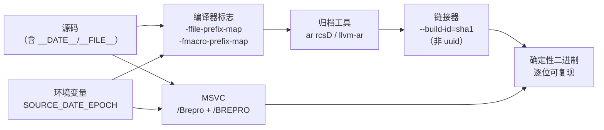

# 可复现构建与交叉编译工具链

> [!abstract] TL;DR
> **可复现构建（Reproducible Builds）**：通过消除时间戳、绝对路径、随机化种子等不确定性来源，使相同源码在任意机器上产出逐位相同的二进制，是供应链安全与构建缓存复用的基础。**交叉编译**：在宿主机（host）上产出运行于目标机（target）的二进制；Clang 以单一二进制加 `-target <triple>` + `--sysroot` 切换目标，GCC 则依赖多套前缀工具链。二者叠加时，可复现性要求对工具链路径也做前缀映射，才能真正屏蔽宿主差异。

---

## 概述与定位

现代软件供应链攻击（如 SolarWinds 事件）揭示了一个核心漏洞：**构建过程本身可被篡改**。即便源码正确，如果构建系统、编译器或打包脚本被污染，最终二进制也会带入恶意代码，而用户无法验证。可复现构建（Reproducible Builds）正是解决这一问题的工程实践：给定相同的源码快照与构建环境描述，任何人在任何机器上独立重新构建，都应产出逐位（bit-for-bit）相同的二进制。

交叉编译则解决另一类基础问题：嵌入式系统、移动设备（Android/iOS）、RISC-V 开发板往往算力不足以在本机编译，或根本无法运行编译器；必须在 x86-64 Linux / macOS / Windows 宿主上生成 arm64 / armv7 / MIPS 目标代码。现代工具链对交叉编译的支持方式产生了深远的生态分化：Clang/LLVM 天生多目标，GCC 则历史上每套目标对应独立编译的工具链二进制。

两个主题在工程实践中高度交织：交叉编译工具链的安装路径往往含有宿主机器名，若不做前缀映射，调试信息中会泄露绝对路径，破坏可复现性。理解两者的原理与常见选项，是构建系统工程化的必要基础。

---

## 原理与机制

### 可复现构建的不确定性来源

编译器在构建产物中嵌入了大量"环境元数据"，每一项都可能因机器不同而变化：

| 来源类别 | 典型表现 | 影响范围 |
|----------|----------|----------|
| 时间戳 | `__DATE__`、`__TIME__` 宏；PE/ELF 头中的时间字段 | 宏展开后硬编码进目标文件 |
| 绝对路径 | DWARF 调试信息中的 `DW_AT_comp_dir`；`__FILE__` 宏展开为绝对路径 | 调试信息、错误消息 |
| 构建 ID 随机性 | 链接器默认用内容哈希或随机值填充 `.note.gnu.build-id` | ELF 二进制头 |
| 随机化 | 哈希表迭代顺序（C++ 编译器内部）影响符号输出顺序 | 目标文件符号表 |
| 归档成员顺序 | `ar` 默认在静态库中记录文件时间戳和 UID/GID | `.a` 静态库 |
| ASLR/PIE 随机 seed | 部分优化 pass 的哈希种子依赖进程地址 | 优化后代码布局 |

### SOURCE_DATE_EPOCH：跨工具的时间戳基准

`SOURCE_DATE_EPOCH` 是由 Reproducible Builds 项目定义的环境变量，表示"此次构建对应的源码提交时间戳（Unix 秒）"。GCC、Clang、make、Python wheel 构建工具、tar、zip 等大量工具在此变量设置时，会用其值替换当前时间，使 `__DATE__`/`__TIME__` 宏以及各类文件时间戳产出固定值。

```sh
export SOURCE_DATE_EPOCH=$(git log -1 --format=%ct)
# 之后所有 gcc/clang/make 调用均使用此时间
```

### 路径前缀映射三件套（GCC/Clang 通用）

绝对路径是调试信息中最主要的差异来源。GCC 4.8+ / Clang 3.8+ 提供路径重写选项：

- **`-ffile-prefix-map=old=new`**：综合替换，等效于同时传递以下两个，推荐优先使用。GCC 8+ / Clang 10+ 支持。
- **`-fdebug-prefix-map=old=new`**：仅替换 DWARF 调试信息中的路径（`DW_AT_comp_dir`、`DW_AT_name` 等）。GCC 4.8+ / Clang 3.8+。
- **`-fmacro-prefix-map=old=new`**：仅替换 `__FILE__` 宏展开的值。GCC 8+ / Clang 10+。

典型用法——将绝对构建目录映射为相对占位符：

```sh
gcc -ffile-prefix-map=$(pwd)=. -c foo.c
# DWARF 中 /home/alice/projects/myapp 变为 .
# __FILE__ 展开为 ./src/foo.c 而非绝对路径
```

在 CMake 中，可通过 `add_compile_options()` 批量注入：

```cmake
add_compile_options(
    -ffile-prefix-map=${CMAKE_SOURCE_DIR}=.
    -ffile-prefix-map=${CMAKE_BINARY_DIR}=.build
)
```

### MSVC 的可复现构建选项

MSVC 通过 `/Brepro` 开关（Visual Studio 2019 16.4+）实现等效功能：

- 抑制 PE 时间戳字段写入（`TimeDateStamp` 填零）
- 关闭 `/incremental` 模式下的随机 COMDAT 折叠阈值
- 与 `/Zi`（PDB）结合时，PDB 的 GUID 由内容哈希而非随机生成

链接器端：`/BREPRO` 同样抑制 PE 时间戳，与编译器端的 `/Brepro` 配合使用。

### 确定性归档：`ar D` 与 `llvm-ar`

GNU `ar` 默认在 `.a` 静态库成员头中记录文件时间戳、UID、GID，在不同宿主上结果不同。`ar` 的 `D`（deterministic）修饰符将这些字段置零：

```sh
ar rcsD libfoo.a foo.o bar.o   # D 表示 deterministic
```

`llvm-ar` 自 LLVM 11 起默认即为确定性模式，无需显式 `D`。`ranlib` 有对应的 `-D` 选项。

### 链接器 `--build-id` 与 `-frandom-seed`

ELF 链接器默认用内容哈希（`--build-id=sha1`）或快速哈希（`--build-id=fast`）生成 Build ID；对于可复现构建，只要输入确定，哈希结果就确定，此选项本身不构成障碍。但若使用 `--build-id=uuid`（随机），则每次链接结果不同，需改为基于内容的模式。

`-frandom-seed=<value>` 控制编译器内部哈希种子（影响局部符号名、临时标签命名），在极少数情况下会引起目标文件差异，可固定为构建系统注入的确定性值（如文件路径的哈希）。

---

## 结构/算法/伪代码详解

### 可复现构建的变量消除流程



### target triple 的组成结构

交叉编译的核心是 **target triple**（实为 quadruple），格式：

```
<arch>-<vendor>-<os>-<abi>
```

各字段含义与常见取值：

| 字段 | 作用 | 常见值 |
|------|------|--------|
| arch | CPU 指令集 | `x86_64`, `aarch64`, `arm`, `riscv64`, `wasm32` |
| vendor | 工具链来源（常省略为 unknown） | `unknown`, `apple`, `pc`, `none` |
| os | 操作系统 | `linux`, `darwin`, `windows`, `none`（裸机） |
| abi | C/C++ ABI 与 libc 选择 | `gnu`, `gnueabihf`, `musl`, `msvc`, `elf`（裸机） |

示例：

```
aarch64-unknown-linux-gnu     # 64 位 ARM，Linux，glibc
arm-linux-gnueabihf           # 32 位 ARM，Linux，glibc，硬浮点 ABI
x86_64-apple-darwin22         # macOS 13，x86_64
riscv64-unknown-none-elf      # RISC-V 裸机
wasm32-unknown-emscripten     # WebAssembly via Emscripten
```

`--target=` 与 `-target` 效果相同（`--target` 是 GCC 风格长选项，`-target` 是 Clang 风格）。

### Clang 单二进制交叉编译

Clang/LLVM 的所有目标后端编译进同一个 `clang` 二进制，无需安装多个编译器：

```sh
clang -target aarch64-unknown-linux-gnu \
      --sysroot=/opt/sysroot/aarch64 \
      -isystem /opt/sysroot/aarch64/usr/include \
      -o hello hello.c
```

关键选项：

- **`-target <triple>`**：切换目标。Clang 内置所有已编译后端（`clang --print-targets` 列出）。
- **`--sysroot=<path>`**：将头文件和库搜索根重定向到指定 sysroot，等效于让编译器"认为"自己在目标机上运行。
- **`-isystem <path>`**：追加系统头文件搜索路径（优先级低于 `-I`，不触发警告）。
- **`-L<path>` / `-rpath-link=<path>`**：指定目标库目录。
- **`--gcc-toolchain=<path>`**：让 Clang 使用指定路径的 GCC 安装（crtbegin.o、libgcc 等运行时）。

### GCC 多前缀工具链

GCC 交叉编译器是独立构建的二进制，每套目标各有一组前缀命令：

```sh
arm-linux-gnueabihf-gcc   -o hello hello.c
arm-linux-gnueabihf-g++   ...
arm-linux-gnueabihf-ld    ...
arm-linux-gnueabihf-strip ...
```

安装方式（Debian/Ubuntu）：

```sh
apt install gcc-aarch64-linux-gnu g++-aarch64-linux-gnu
```

配合 `--sysroot` 指定目标 sysroot 或 SDK：

```sh
aarch64-linux-gnu-gcc \
    --sysroot=/path/to/aarch64-sysroot \
    -o hello hello.c
```

### CMake toolchain file 衔接

CMake 通过 toolchain file（`-DCMAKE_TOOLCHAIN_FILE=`）实现跨编译环境切换，与 41 系列的 [[00.编译器完整参考 - 总索引|总索引]] 关联，42 系列中有完整的 CMake 专题：

```cmake
# toolchain-aarch64-linux.cmake
set(CMAKE_SYSTEM_NAME Linux)
set(CMAKE_SYSTEM_PROCESSOR aarch64)

set(CMAKE_C_COMPILER   aarch64-linux-gnu-gcc)
set(CMAKE_CXX_COMPILER aarch64-linux-gnu-g++)

set(CMAKE_SYSROOT /opt/sysroot/aarch64)
set(CMAKE_FIND_ROOT_PATH /opt/sysroot/aarch64)

# 只在 sysroot 内搜索头文件和库
set(CMAKE_FIND_ROOT_PATH_MODE_PROGRAM NEVER)
set(CMAKE_FIND_ROOT_PATH_MODE_LIBRARY ONLY)
set(CMAKE_FIND_ROOT_PATH_MODE_INCLUDE ONLY)
```

使用：

```sh
cmake -DCMAKE_TOOLCHAIN_FILE=toolchain-aarch64-linux.cmake ..
cmake --build .
```

对于 Clang，toolchain file 中只需修改编译器名并增加 `-target`：

```cmake
set(CMAKE_C_COMPILER   clang)
set(CMAKE_CXX_COMPILER clang++)
add_compile_options(-target aarch64-unknown-linux-gnu --sysroot=${CMAKE_SYSROOT})
add_link_options(-target aarch64-unknown-linux-gnu --sysroot=${CMAKE_SYSROOT})
```

---

## 工具视角与实战

### 验证可复现性

最直接的验证方式是两次独立构建后对比二进制：

```sh
# 第一次构建
export SOURCE_DATE_EPOCH=$(git log -1 --format=%ct)
make clean && make -j$(nproc)
sha256sum build/myapp > build1.sha256

# 在另一台机器（或不同用户/目录）重复
make clean && make -j$(nproc)
sha256sum build/myapp > build2.sha256

diff build1.sha256 build2.sha256   # 应无差异
```

若有差异，使用 `diffoscope` 工具深入对比（可解析 ELF、DWARF、PE 等格式）：

```sh
diffoscope build1/myapp build2/myapp
```

### 典型 CI 配置（GitHub Actions）

```yaml
- name: Set SOURCE_DATE_EPOCH
  run: echo "SOURCE_DATE_EPOCH=$(git log -1 --format=%ct)" >> $GITHUB_ENV

- name: Build
  run: |
    cmake -DCMAKE_BUILD_TYPE=Release \
          -DCMAKE_C_FLAGS="-ffile-prefix-map=$PWD=." \
          -DCMAKE_CXX_FLAGS="-ffile-prefix-map=$PWD=." \
          ..
    cmake --build .
```

### 常见陷阱与排查

**陷阱 1**：`__DATE__`/`__TIME__` 出现在第三方头文件中，自己设置了 `SOURCE_DATE_EPOCH` 但依然不稳定。
排查：`grep -rn '__DATE__\|__TIME__' /path/to/third_party/`，定位后用宏覆盖或 patch。

**陷阱 2**：`-ffile-prefix-map` 只映射了 source dir，忘记映射 build dir（CMake 生成的文件路径含 `CMAKE_BINARY_DIR`）。
修复：同时映射 `${CMAKE_BINARY_DIR}=.build`。

**陷阱 3**：静态库用了无 `D` 的 `ar`，导致 `.a` 成员头时间戳不同。
修复：`AR=ar` + `ARFLAGS=rcsD`，或换用 `llvm-ar`。

**陷阱 4**：交叉编译时 sysroot 路径含宿主机器名，未做 `-ffile-prefix-map` 映射，调试信息暴露宿主路径。
修复：`-ffile-prefix-map=/path/to/sysroot/toolchain=<sysroot>`。

---

## 安全性与正确使用

### 供应链安全价值

可复现构建的根本价值在于**可验证性**：发行方公布构建脚本与源码，任何第三方可独立重建并对比哈希。若构建系统被攻击者污染（注入后门），重建后的哈希必然不同，从而暴露篡改。Debian 项目（reproducible-builds.debian.net）已对超过 95% 的软件包实现可复现性，Arch Linux、NixOS 等发行版也在积极跟进。

Bootstrappable Builds 是更激进的目标：连编译器本身也可从源码可验证重建，规避 Ken Thompson 式的"编译器中带后门"攻击（Trusting Trust 问题）。

### 构建缓存的前提条件

Bazel、Gradle、sccache 等缓存系统的正确性依赖于：相同输入产出相同输出。若输出含时间戳或随机性，缓存即失效（每次重新编译），可复现构建是分布式缓存真正生效的必要条件。

### 交叉编译的正确性陷阱

**宿主工具污染**：CMake 在 `find_package` 时若搜索到宿主机器的库而非 sysroot 内的库，会静默链接错误版本。务必设置 `CMAKE_FIND_ROOT_PATH_MODE_LIBRARY ONLY`。

**运行时库不匹配**：Clang 交叉编译时需要指定 `--gcc-toolchain` 或 `-rtlib=compiler-rt`，否则可能链接到宿主版本的 `libgcc`/`libstdc++`，在目标机器上运行时崩溃。

**浮点 ABI 不兼容**：ARM 有 `softfp`（软浮点参数传递、硬件计算）和 `hardfp`（`gnueabihf`，直接用 FPU 寄存器传参）两种 ABI；混用会导致浮点参数传递错误，且通常不报链接错误（都是有效 ELF），只在运行时崩溃。

---

## 小结

可复现构建通过消除编译过程的环境依赖——时间戳（`SOURCE_DATE_EPOCH`）、路径（`-ffile-prefix-map`）、随机种子（`-frandom-seed`、`--build-id`）、归档顺序（`ar D`）——使构建结果成为源码的确定性函数，是供应链安全、构建缓存与审计合规的技术基础。交叉编译则通过 target triple + sysroot 机制将编译目标与宿主环境解耦：Clang 以单一多目标二进制加 `-target` 实现灵活切换，GCC 依赖每目标独立安装的前缀工具链，两者都通过 CMake toolchain file 实现系统化集成。两个主题的交叉点——交叉编译工具链路径的前缀映射——正是大型跨平台项目构建系统工程化的关键细节。

---

## 相关阅读

- [[01.Clang_Clang++_Complete_Reference|Clang/Clang++ 编译器完整参数详解]]
- [[03.GCC_G++_Complete_Reference|GCC/G++ 编译器完整参数详解]]
- [[02.Compiler_Comparison|GCC vs Clang vs MSVC 对比]]
- [[00.编译器完整参考 - 总索引|编译器完整参考总索引]]

---

> 📚 [[00.编译器完整参考 - 总索引|总索引]] ｜ ⬅️ 上一篇 [[08.Inline_Asm_and_Intrinsics|内联汇编与 Intrinsics]] ｜ ➡️ 下一篇 [[10.Clang_Tooling_Ecosystem|Clang 工具链生态]]
