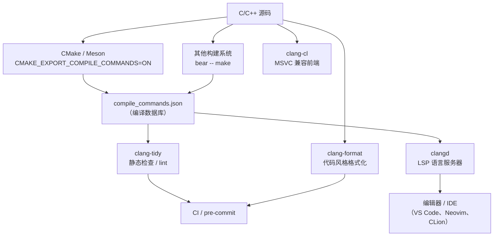

# Clang 工具链生态（clang-tidy / clang-format / clangd）

> [!abstract] TL;DR
> Clang/LLVM 围绕 **`compile_commands.json`（编译数据库）** 构建了一套完整的 C/C++ 开发工具生态：`clang-tidy` 做静态检查与自动修复，`clang-format` 统一代码风格，`clangd` 提供 LSP 语言服务，`clang-cl` 以 MSVC 兼容前端对接 Windows 工具链。四者共享同一份编译数据库作为"语义根"，形成分析—格式化—IDE 服务的闭环。与之对比，GCC 仅提供 `-fanalyzer` 单点工具，缺乏一体化生态，需借助 cppcheck、include-what-you-use 等第三方工具拼凑。

---

## 概述与定位

传统 C/C++ 工具链的核心职责是"把源码变成二进制"，与 IDE 的集成靠各 IDE 自行解析 Makefile 或手动配置包含路径，极易出现"在 IDE 里代码提示正确但编译失败"的双重真相问题。Clang 从设计之初就将编译器的语义分析能力以库的形式（`libclang`、`LibTooling`）暴露出来，使得静态检查、格式化、IDE 服务可以直接复用与编译器相同的解析逻辑，而非独立维护一套近似解析器。

这一设计的直接产物是一组官方工具：

- **clang-tidy**：基于 AST（抽象语法树）的 lint/静态分析工具
- **clang-format**：语法感知的代码格式化工具
- **clangd**：Language Server Protocol（LSP）实现，为编辑器提供补全、跳转、诊断
- **clang-cl**：MSVC 兼容的 Clang 前端，接受 `/` 风格的 MSVC 选项

这四个工具有一个共同的技术基础：**`compile_commands.json` 编译数据库**。没有它，工具无法知道每个源文件用什么标志、哪些头文件可见，分析结果就会出现大量误报或漏报。

---

## 原理与机制

### compile_commands.json：工具生态的语义根

编译数据库是一个 JSON 数组，每个元素描述一个编译单元（源文件）及其完整编译命令：

```json
[
  {
    "directory": "/home/user/myapp/build",
    "command": "clang++ -std=c++17 -I../include -DNDEBUG -c ../src/foo.cpp -o foo.o",
    "file": "/home/user/myapp/src/foo.cpp"
  },
  {
    "directory": "/home/user/myapp/build",
    "arguments": ["clang++", "-std=c++17", "-I../include", "-c", "../src/bar.cpp"],
    "file": "/home/user/myapp/src/bar.cpp"
  }
]
```

`command`（字符串）与 `arguments`（数组）是两种等价写法，后者避免了 shell 转义歧义。`directory` 是解析相对路径的基准目录。

工具读取此文件后，对每个源文件都可以精确重放其编译语境——宏定义、包含路径、语言标准一个不差——从而做到与实际构建行为一致的语义分析。

### 生成 compile_commands.json 的方式

**CMake**（最常见）：

```sh
cmake -DCMAKE_EXPORT_COMPILE_COMMANDS=ON -B build
# build/compile_commands.json 自动生成
# 通常在项目根目录创建软链接
ln -sf build/compile_commands.json compile_commands.json
```

**Bear**（适配非 CMake 系统）：

Bear 通过 `LD_PRELOAD` 拦截编译器调用，适用于任何基于 Make 的构建系统：

```sh
bear -- make -j$(nproc)
# 在当前目录生成 compile_commands.json
```

**Bazel**：使用 `bazel-compile-commands-extractor` 等第三方插件。

**Meson**：内置支持，`meson setup build` 后 `cd build && meson compile --db compile_commands.json`。

### clang-tidy 的工作原理

clang-tidy 本质上是一个 LibTooling 应用，对每个源文件执行完整的 Clang 前端解析（词法、语法、语义、类型检查，生成 AST），然后在 AST 上运行注册的检查器（checker）。这与 GCC `-fanalyzer`（数据流分析）的方式不同：clang-tidy 的检查直接操作高层语义 AST，更容易编写和理解，但也因此不做深层路径敏感分析（那是 Clang Static Analyzer `clang-analyzer-*` 的工作，后者集成在 clang-tidy 中）。

检查器按命名空间组织，用 `-` 分隔层次（`clang-analyzer-core-nullDereference`），可通过 glob 模式批量启用/禁用。

### clang-format 的工作原理

clang-format 基于 Clang 的词法分析器（不做完整语义分析），将源码 token 化后按规则重新布局空白与换行。因为在词法层操作，它不需要 `compile_commands.json`，对语法错误有一定容错性。风格规则存储在 `.clang-format` 文件中，格式为 YAML。

### clangd 的工作原理

clangd 是一个 LSP（Language Server Protocol）服务进程，通过 JSON-RPC 与编辑器（VS Code、Neovim、Emacs 等）通信。其核心是一个增量编译引擎：打开文件时解析并缓存 AST，编辑时只重新处理修改的部分。依赖 `compile_commands.json` 获取每个文件的编译参数；找不到时退回到启发式猜测（效果显著变差）。

---

## 结构/算法/伪代码详解

### 工具生态架构图



### clang-tidy 检查器分组详解

clang-tidy 的检查器（checks）按前缀分组：

| 前缀 | 来源 | 典型用途 |
|------|------|----------|
| `clang-analyzer-*` | Clang Static Analyzer | 深层缺陷：空指针、内存泄漏、未初始化变量 |
| `bugprone-*` | clang-tidy 内置 | 易错模式：整数截断、字符串字面量比较、`assert(0)` |
| `modernize-*` | clang-tidy 内置 | C++ 现代化：`nullptr`、范围 for、`auto`、`override` |
| `performance-*` | clang-tidy 内置 | 性能模式：不必要的拷贝、pass-by-value vs const-ref |
| `readability-*` | clang-tidy 内置 | 可读性：命名、多余的括号、magic numbers |
| `cppcoreguidelines-*` | C++ Core Guidelines | 指针所有权、切片、窄转换 |
| `google-*` | Google C++ Style | Google 风格规则 |
| `hicpp-*` | HIC++ 安全标准 | 航空/汽车软件安全规则 |
| `cert-*` | CERT C/C++ 安全编码 | 安全编码规则 |

常用命令行用法：

```sh
# 启用所有检查（极慢，仅用于探索）
clang-tidy -checks='*' foo.cpp

# 实用组合：现代化 + 常见缺陷 + 性能
clang-tidy -checks='modernize-*,bugprone-*,performance-*' foo.cpp

# 禁用特定检查（前缀 - 表示禁用）
clang-tidy -checks='modernize-*,-modernize-use-trailing-return-type' foo.cpp

# 自动修复（-fix 将修改直接应用到源文件）
clang-tidy -checks='modernize-use-nullptr' -fix foo.cpp

# 整项目批量运行（配合 compile_commands.json）
run-clang-tidy -checks='modernize-*,bugprone-*' -p build/ src/
```

### .clang-tidy 配置文件

项目根目录放置 `.clang-tidy` 文件，clang-tidy 自动从文件的目录向上查找：

```yaml
---
Checks: >-
  modernize-*,
  bugprone-*,
  performance-*,
  -modernize-use-trailing-return-type,
  -bugprone-easily-swappable-parameters

WarningsAsErrors: 'bugprone-*'

CheckOptions:
  - key: modernize-use-default-member-init.UseAssignment
    value: '1'
  - key: readability-identifier-naming.VariableCase
    value: camelCase

HeaderFilterRegex: '.*'   # 也检查头文件（默认只检查 .cpp）
```

### clang-format 风格配置

`.clang-format` 文件控制格式化风格，放在项目根目录：

```yaml
---
BasedOnStyle: Google        # 基准风格：Google/LLVM/Mozilla/WebKit/Chromium/Microsoft
IndentWidth: 4              # 覆盖基准的 2 空格缩进
ColumnLimit: 100
AllowShortFunctionsOnASingleLine: Empty
BreakBeforeBraces: Allman   # 大括号换行风格
SortIncludes: CaseSensitive
IncludeBlocks: Regroup      # 重新分组 #include
```

常用命令：

```sh
# 原地格式化（-i 表示 in-place）
clang-format -i src/foo.cpp src/bar.cpp

# 仅格式化 diff 中修改的行（配合 git）
git diff -U0 | clang-format-diff -p1 -i

# 检查是否符合格式（返回非零表示需要格式化，用于 CI）
clang-format --dry-run --Werror src/foo.cpp
```

### clangd 配置与使用

clangd 通过 `.clangd` 文件（YAML）配置：

```yaml
CompileFlags:
  Add: [-Wall, -Wextra]          # 追加编译标志
  Remove: [-W*]                  # 移除某些标志（如关闭噪声警告）
  CompilationDatabase: build/    # 指定 compile_commands.json 所在目录

Diagnostics:
  ClangTidy:
    Add: [modernize-*, bugprone-*]
    Remove: [modernize-use-trailing-return-type]
  UnusedIncludes: Strict         # 检查多余的 #include

InlayHints:
  Enabled: yes
  ParameterNames: Yes
  DeducedTypes: Yes
```

VS Code 中安装 `clangd` 扩展（而非 ms-vscode.cpptools 的内置解析），设置：

```json
{
  "clangd.path": "/usr/bin/clangd",
  "clangd.arguments": ["--background-index", "--clang-tidy"]
}
```

`--background-index` 让 clangd 后台索引整个项目（存入 `.cache/clangd/index/`），使跨文件跳转和全局符号搜索速度大幅提升。

### clang-cl：MSVC 兼容前端

clang-cl 接受 MSVC 风格的命令行选项（`/std:c++17`、`/W4`、`/EHsc` 等），可作为 `cl.exe` 的替代品在 Windows 上使用，同时保留 Clang 的静态分析和 sanitizer 能力。

```bat
REM 替代 MSVC cl.exe
clang-cl /std:c++17 /W4 /EHsc /c foo.cpp /Fo:foo.obj

REM 在 CMake 中使用 clang-cl
cmake -G "Visual Studio 17 2022" -T ClangCL ..
```

clang-cl 的主要用途：在 Windows CI 中运行 AddressSanitizer（MSVC 直到 VS 2019 16.9 才原生支持 ASan），以及在 MSVC 项目中引入 clang-tidy 检查而不更换整个工具链。

---

## 工具视角与实战

### CI/pre-commit 联动

**pre-commit 钩子配置（`.pre-commit-config.yaml`）**：

```yaml
repos:
  - repo: https://github.com/pocc/pre-commit-hooks
    rev: v1.3.5
    hooks:
      - id: clang-format
        args: [--style=file]
      - id: clang-tidy
        args: [-p=build, -checks=modernize-*,bugprone-*]
```

**GitHub Actions 示例**：

```yaml
- name: Configure (with compile_commands.json)
  run: cmake -DCMAKE_EXPORT_COMPILE_COMMANDS=ON -B build

- name: Run clang-tidy
  run: |
    run-clang-tidy -p build \
      -checks='-*,modernize-use-nullptr,bugprone-*' \
      -warnings-as-errors='bugprone-*' \
      $(find src -name '*.cpp')

- name: Check formatting
  run: |
    clang-format --dry-run --Werror $(find src -name '*.cpp' -o -name '*.h')
```

### include-what-you-use（GCC/Clang 第三方补充）

`include-what-you-use`（iwyu）分析 `#include` 的必要性，移除多余头文件、添加缺失的直接依赖。它是 Clang LibTooling 生态的第三方工具，需要 `compile_commands.json`：

```sh
cmake -DCMAKE_CXX_COMPILER=include-what-you-use \
      -DCMAKE_CXX_FLAGS="-Xiwyu --error_always" \
      -B build
```

或直接通过 iwyu_tool：

```sh
iwyu_tool.py -p build src/ -- --transitive_includes_only 2>&1 | fix_includes.py
```

---

## 安全性与正确使用

### clang-tidy 的误报与噪声控制

`-checks='*'` 会启用数百条规则，大量规则互相冲突（如 `cppcoreguidelines-avoid-magic-numbers` 与实际工程代码摩擦极大）。建议策略：

1. 先以 `bugprone-*` + `clang-analyzer-*` 为基线，消除真实缺陷
2. 按团队共识逐步加入 `modernize-*`（结合 `-fix` 做大规模自动化重构）
3. `readability-*` 和命名规则配合 code review 按需开启，不宜全量强制

**`-fix` 的正确使用**：`-fix` 自动修改源文件，务必在版本控制下操作，修改后必须重新编译验证（部分自动修复在复杂模板上会产生语义错误）。

### clang-format 对宏的局限性

clang-format 在词法层操作，对宏展开后的语义一无所知。以宏定义语句块为主体的代码（如 Qt 的 `Q_OBJECT`、业务上大量使用的 `DEFINE_*` 宏）可能被格式化成视觉上奇怪的形式。可用 `// clang-format off` / `// clang-format on` 注释临时关闭局部格式化。

### clangd 索引的性能影响

`--background-index` 会在项目打开后持续后台编译，对大型项目（数千 cpp）初次索引可能耗时数分钟并占用大量 CPU/内存。可通过 `.clangd` 的 `Index.Background: Skip` 关闭后台索引（按需触发），或通过 `--j=<N>` 限制并行度。

### GCC 的工具链对比

GCC 在同等一体化工具方面的差距：

| 能力 | Clang 生态 | GCC |
|------|-----------|-----|
| 静态分析 | clang-tidy（AST 检查）+ Clang SA | `-fanalyzer`（GCC 10+，功能有限） |
| 代码格式化 | clang-format（官方） | 无官方工具，依赖第三方 astyle/uncrustify |
| LSP 服务 | clangd（官方） | `ccls`（第三方，依赖 libclang）/ `clang-based` |
| 多余 include 检测 | iwyu（基于 libclang） | 无直接对等工具 |
| MSVC 兼容前端 | clang-cl | 无 |
| 编译数据库 | compile_commands.json（CMake 原生支持） | 同样支持（通过 CMake） |

GCC 的 `-fanalyzer`（GCC 12+ 较为成熟）执行过程间数据流分析，在某些路径敏感场景（如 `malloc` 后多路径 `free`）的检出能力反而优于 clang-tidy 的部分规则，但整体覆盖度和可配置性远不及 clang-tidy。实践中，GCC 项目常组合使用 cppcheck + include-what-you-use + clangd（clangd 支持非 Clang 编译的项目，只需要 `compile_commands.json`）来近似 Clang 工具生态的体验。

---

## 小结

Clang 工具链生态以 `compile_commands.json` 为共同基础，将静态分析（clang-tidy）、格式化（clang-format）、IDE 语义服务（clangd）、MSVC 兼容（clang-cl）整合成一套互通的工具集。关键实践：用 CMake 的 `CMAKE_EXPORT_COMPILE_COMMANDS=ON` 或 `bear` 生成编译数据库；在 `.clang-tidy` 与 `.clang-format` 中集中管理规则；将 clang-tidy 和 clang-format 接入 pre-commit 钩子与 CI，使代码质量检查在代码进入仓库前就完成。clangd 的后台索引模式为大型项目提供精确的跨文件语义导航，是现代 C++ 开发体验的关键基础设施。与 GCC 相比，Clang 工具生态的核心优势在于官方维护、语义精确、工具互通，而非靠第三方工具各自为战。

---

## 相关阅读

- [[01.Clang_Clang++_Complete_Reference|Clang/Clang++ 编译器完整参数详解]]
- [[09.Reproducible_Builds_and_Cross_Compile|可复现构建与交叉编译工具链]]
- [[03.GCC_G++_Complete_Reference|GCC/G++ 编译器完整参数详解]]
- [[04.MSVC_Complete_Reference|MSVC 编译器完整参数详解]]
- [[00.编译器完整参考 - 总索引|编译器完整参考总索引]]

---

> 📚 [[00.编译器完整参考 - 总索引|总索引]] ｜ ⬅️ 上一篇 [[09.Reproducible_Builds_and_Cross_Compile|可复现构建与交叉编译]]
