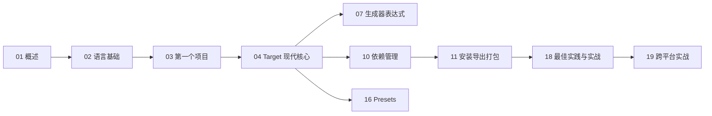

# CMake 完整技术教程 · 总索引 (MOC)

> 一套**循序渐进的教程**与**完整参数参考**合二为一的 CMake 知识体系。以 **CMake 4.3.4**（2026-06 当前稳定版）为基准，聚焦 **现代 CMake（3.20+，target-based）** 最佳实践，结合官方文档逐项详解。

CMake 是一个**跨平台的构建系统生成器（build system generator）**：它本身不编译代码，而是读取 `CMakeLists.txt`，为目标平台生成原生构建文件（Makefile、Ninja、Visual Studio 工程、Xcode 工程等），再由原生工具完成实际构建。它还附带测试驱动（CTest）与打包（CPack）。本教程覆盖从语言语法到大型工程组织的全部内容。

---

## 📌 如何使用本教程

- **零基础入门**：按 `01 → 02 → 03 → 04` 顺序学习，建立"配置/生成/构建"三阶段与 target 心智模型，即可写出现代风格的 `CMakeLists.txt`。
- **有基础进阶**：直接看 `04 现代 CMake`、`07 生成器表达式`、`10 依赖管理`、`16 Presets`，补齐现代写法与工程化能力。
- **当参考手册查**：`05 变量`、`06 属性`、`08/09 命令字典`、`07 生成器表达式` 是字典式速查章节，按需检索。
- **解决具体问题**：`11 安装导出打包`、`12 测试`、`13 交叉编译`、`18 最佳实践与陷阱` 面向具体工程场景。
- **跨平台开发**：直接看 `19 跨平台实战`，含 Windows/macOS/Linux 完整工程、Windows 作宿主的交叉编译、平台差异对照大表。

---

## 🗂️ 完整目录（8 部分 · 24 章）

### 第一部分 · 基础入门

| 章 | 标题 | 核心内容 |
|----|------|----------|
| 01 | [[42.Cmake/01 - CMake 概述与安装.md\|CMake 概述与安装]] | 构建系统生成器原理、配置/生成/构建三阶段、各平台安装、命令行工具家族（cmake/ctest/cpack/ccmake/cmake-gui）、版本演进至 4.3.4 |
| 02 | [[42.Cmake/02 - CMake 语言基础.md\|CMake 语言基础]] | 语法、注释、command invocation、变量（普通/缓存/环境）、字符串与列表、`${}` `$ENV{}` `$CACHE{}`、控制流、`function`/`macro`、作用域 |
| 03 | [[42.Cmake/03 - 第一个项目与构建流程.md\|第一个项目与构建流程]] | `cmake_minimum_required`、`project()`、`add_executable`、最小项目、out-of-source、`cmake -S -B`、`--build`、`-G` 生成器、`CMakeCache.txt` |

### 第二部分 · 现代 CMake 核心

| 章 | 标题 | 核心内容 |
|----|------|----------|
| 04 | [[42.Cmake/04 - Target 与现代 CMake.md\|Target 与现代 CMake]] | target 概念、`add_library`（STATIC/SHARED/MODULE/OBJECT/INTERFACE/IMPORTED/ALIAS）、`target_*` 命令全家、**PUBLIC/PRIVATE/INTERFACE usage requirements 传播** |
| 05 | [[42.Cmake/05 - 变量、缓存与作用域.md\|变量、缓存与作用域]] | 变量类型详解、`set`/`unset`/`option`、CACHE 类型、作用域规则、常用内置变量大全（`CMAKE_*`/`PROJECT_*`） |
| 06 | [[42.Cmake/06 - 属性 Properties 大全.md\|属性 (Properties) 大全]] | 属性作用域（GLOBAL/DIRECTORY/TARGET/SOURCE/TEST/CACHE/INSTALL）、`set_property`/`get_property`、常用属性分类罗列 |
| 07 | [[42.Cmake/07 - 生成器表达式.md\|生成器表达式]] | `$<...>` 完整语法、逻辑/查询/条件/字符串/输出/转换运算符全列表、应用场景与调试 |

### 第三部分 · 命令完整参考

| 章 | 标题 | 核心内容 |
|----|------|----------|
| 08 | [[42.Cmake/08 - 脚本命令完整参考.md\|脚本命令完整参考]] | Scripting Commands 字典：`set`/`list`/`string`/`math`/`file`/`find_*`/`message`/`configure_file`/`execute_process` 等，逐条签名+参数+示例 |
| 09 | [[42.Cmake/09 - 项目命令完整参考.md\|项目命令完整参考]] | Project Commands 字典：`add_executable`/`add_library`/`add_custom_command`/`target_*`/`install`/`export`/`add_test` 等 |

### 第四部分 · 依赖与集成

| 章 | 标题 | 核心内容 |
|----|------|----------|
| 10 | [[42.Cmake/10 - 查找与依赖管理.md\|查找与依赖管理]] | `find_package`（Module vs Config 模式）、`find_library`/`find_path`/`find_program`、`FetchContent`、`ExternalProject`、pkg-config、**CPS（4.3 新）** |
| 11 | [[42.Cmake/11 - 安装、导出与打包.md\|安装、导出与打包]] | `install()` 全形式、`GNUInstallDirs`、`export()`、生成 Config 包（`CMakePackageConfigHelpers`）、版本文件、**CPack**；含 `11.8 安装与打包的平台差异` |

### 第五部分 · 测试、工具链与进阶

| 章 | 标题 | 核心内容 |
|----|------|----------|
| 12 | [[42.Cmake/12 - 测试 CTest.md\|测试 CTest]] | `enable_testing`/`add_test`、CTest 命令行、测试属性（TIMEOUT/LABELS/FIXTURES/...）、CTest 脚本、内存检查与覆盖率 |
| 13 | [[42.Cmake/13 - 工具链与交叉编译.md\|工具链与交叉编译]] | toolchain file、`CMAKE_TOOLCHAIN_FILE`、`CMAKE_SYSTEM_*`、sysroot、`find root path`、Android/嵌入式/WASM；含 `13.8 以 Windows 为宿主的交叉编译实例` |
| 14 | [[42.Cmake/14 - 编译器、语言标准与特性.md\|编译器、语言标准与特性]] | `CMAKE_<LANG>_STANDARD`、`target_compile_features`、编译/链接选项、多语言支持、预编译头 PCH、Unity build |
| 15 | [[42.Cmake/15 - 生成器与构建系统.md\|生成器与构建系统]] | 生成器分类（Makefile/Ninja/VS/Xcode）、单配置 vs 多配置、`CMAKE_BUILD_TYPE`、Ninja Multi-Config；含 `15.9 各平台生成器选择实例` |

### 第六部分 · 现代工作流与实战

| 章 | 标题 | 核心内容 |
|----|------|----------|
| 16 | [[42.Cmake/16 - CMake Presets.md\|CMake Presets]] | `CMakePresets.json`、configure/build/test/package/workflow presets、宏、条件、继承；含 `16.11 跨平台 Presets 实例` |
| 17 | [[42.Cmake/17 - 模块与常用工具模块.md\|模块与常用工具模块]] | `include` 机制、`cmake -P` 脚本模式、自带模块（`CheckXXX`/`FetchContent`/`GNUInstallDirs`/`CMakeDependentOption` 等）、自定义模块 |
| 18 | [[42.Cmake/18 - 最佳实践、调试与实战.md\|最佳实践、调试与实战]] | 现代最佳实践、反模式、调试技巧（`--trace`/`--debug-find`/`message`）、大型项目组织、库+可执行+测试+安装+导出完整示例 |

### 第七部分 · 跨平台专题

| 章 | 标题 | 核心内容 |
|----|------|----------|
| 19 | [[42.Cmake/19 - 跨平台实战与平台差异大全.md\|跨平台实战与平台差异大全]] | 平台判定（WIN32/APPLE/UNIX/`$<PLATFORM_ID>`）、**Windows / macOS / Linux 完整工程**、移动/嵌入式/WASM、**Windows 作宿主的交叉编译实例**、跨平台差异对照大表、真·跨平台完整工程 + 三平台 Presets |

---

### 第八部分 · 进阶专题

| 章 | 标题 | 核心内容 |
|----|------|----------|
| 20 | [[42.Cmake/20 - C++20 模块支持.md\|C++20 模块支持]] | `FILE_SET CXX_MODULES`、BMI、Ninja 依赖扫描、`CMAKE_CXX_SCAN_FOR_MODULES`、模块 install |
| 21 | [[42.Cmake/21 - cmake-file-api.md\|cmake-file-api]] | JSON API：query/reply、codemodel/cache/toolchains、IDE 集成 |
| 22 | [[42.Cmake/22 - 代码生成 target.md\|代码生成 target]] | `add_custom_command(OUTPUT)` vs 钩子、protobuf/moc/flatbuffers recipe |
| 23 | [[42.Cmake/23 - 大型项目与 monorepo 组织.md\|大型项目与 monorepo 组织]] | 100+ target 组织、`PROJECT_IS_TOP_LEVEL`、find/FetchContent 统一 |
| 24 | [[42.Cmake/24 - CPack 进阶打包.md\|CPack 进阶打包]] | External 生成器、组件化、`file(GET_RUNTIME_DEPENDENCIES)`、签名 |

---

## 🧭 推荐学习路径



---

## ⚙️ 全局约定

- **版本基准**：CMake **4.3.4**（2026-06）。涉及版本差异处会以 `（≥ 3.x 引入）`/`（4.x 变更）` 标注。
- **写法取向**：现代 target-based 为主，传统全局写法（`include_directories` 等）仅在"陷阱/对比"处出现并标注为不推荐。
- **平台**：示例兼顾 Linux / macOS / Windows（MSVC + MinGW），命令行以 `cmake -S . -B build` 现代用法为准。**跨平台完整专题见 [[42.Cmake/19 - 跨平台实战与平台差异大全.md\|第 19 章]]**；11、13、15、16 章另含平台示例小节（`11.8` / `13.8` / `15.9` / `16.11`）。
- **代码块**：CMake 代码用 ` ```cmake `，终端命令用 ` ```bash `。
- **参数标注**：可选参数用 `[...]`，必填用 `<...>`，多选用 `{A|B|C}`，可重复用 `...`，与官方手册一致。

---

## 🔗 相关笔记

- 编译器参考：[[01.Clang_Clang++_Complete_Reference|Clang]] · [[03.GCC_G++_Complete_Reference|GCC]] · [[04.MSVC_Complete_Reference|MSVC]]
- CMake 调用的正是上述编译器；本教程 `14 章` 讲解如何让 CMake 选择/配置它们。

---

> 📖 本教程共 24 章，逐章详解。点击上方任意链接进入对应章节。
