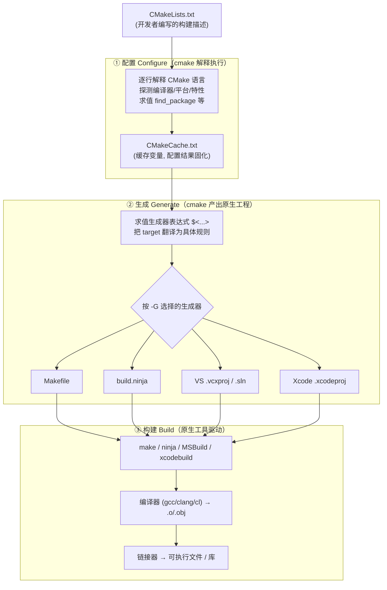
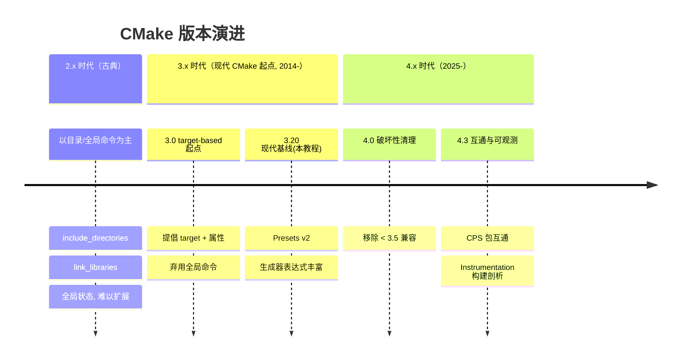

# 第 01 章 · CMake 概述与安装

> 本章是整套教程的开篇。我们先从宏观视角认识 CMake 到底**是什么、不是什么**，理解它"配置 → 生成 → 构建"三阶段的工作原理，盘点随它一起发布的工具家族，然后在 Windows / macOS / Linux 上把它装好、验证好。最后用一个最小 Hello World 让你对"一条命令配置、一条命令构建"的整体流程建立直觉。后续每一章都建立在本章的心智模型之上。
>
> **版本基准**：本教程以 **CMake 4.3.4**（2026-06 当前稳定版）为基准，聚焦**现代 CMake（3.20+，target-based）** 最佳实践。涉及版本差异处会显式标注。

---

## 1. CMake 是什么

### 1.1 一句话定义

**CMake 是一个跨平台的"构建系统生成器"（build system generator），而不是构建系统本身。**

这句话里的每个词都很关键，我们逐层拆解：

- **它不直接编译代码**。CMake 自己不调用 `gcc`、`clang`、`cl.exe` 去把 `.cpp` 编译成 `.o`/`.obj`，也不亲自做链接。
- **它生成"原生构建文件"**。CMake 读取你写的 `CMakeLists.txt`（一份用 CMake 语言描述的"构建意图"），针对你选定的目标平台与工具，**生成出该平台原生的构建脚本/工程文件**，例如：
  - Unix/Linux 上的 `Makefile`；
  - 跨平台高速构建工具 `Ninja` 的 `build.ninja`；
  - Windows 上的 **Visual Studio** `.sln`/`.vcxproj` 工程；
  - macOS 上的 **Xcode** `.xcodeproj` 工程。
- **真正的编译由原生工具完成**。生成完成后，是 `make`、`ninja`、`MSBuild`、`xcodebuild` 这些原生工具去驱动编译器和链接器，CMake 只是它们上游的"翻译官 + 指挥者"。

可以用一个类比理解：如果说 `make`/`ninja`/MSBuild 是不同国家的"施工队"，那么 CMake 就是一份**与施工队无关的统一设计蓝图（`CMakeLists.txt`）**，外加一个能把这份蓝图翻译成任意一支施工队都看得懂的"施工图（原生构建文件）"的**翻译引擎**。蓝图写一次，到哪个平台就翻译成哪个平台的施工图。

> 历史小知识：CMake 由 Kitware 公司开发，最早（约 2000 年）是为了让 ITK（Insight Segmentation and Registration Toolkit）能在多平台构建而诞生。CMake 的 "C" 取自 **cross-platform（跨平台）**。

### 1.2 CMake 解决了哪些问题

理解 CMake 的价值，最好的方式是看它替你消除了哪些痛点。

| 问题 | 没有 CMake 的痛苦 | CMake 的做法 |
|------|------------------|-------------|
| **跨平台** | 为 Linux 写 `Makefile`、为 Windows 维护 VS 工程、为 macOS 维护 Xcode 工程，三套并行、极易不同步 | 只写一份 `CMakeLists.txt`，用 `-G` 选择生成器即可产出各平台原生工程 |
| **out-of-source（源外构建）** | 中间产物（`.o`、可执行文件、缓存）和源码混在一起，污染仓库、难以清理 | 构建产物统一放进独立的 build 目录，源码目录始终干净，删 build 目录即"一键清理" |
| **依赖管理** | 手写一堆 `-I/usr/include/...`、`-L/usr/lib/...`、`-lfoo`，路径硬编码、换机器即失效 | `find_package()` / `FetchContent` 自动定位依赖，并把头文件路径、库、编译选项作为 **usage requirements** 自动传播给使用者 |
| **可复现构建** | "在我机器上能编过"——编译器、选项、依赖版本全靠口口相传 | `CMakeCache.txt` 固化配置；`CMakePresets.json` 把配置、构建、测试参数版本化进仓库，团队一键复现 |
| **可扩展工程** | 项目从 1 个文件长到 1000 个文件、多个库 + 测试 + 安装包后，手写脚本彻底失控 | target（目标）+ 属性 + 子目录组织，天然支持大型多模块工程 |

### 1.3 CMake 不是什么（常见误解澄清）

- **不是编译器**：它不取代 GCC/Clang/MSVC，而是**驱动**它们。
- **不是包管理器**：它能**查找**和**拉取**依赖（`find_package`/`FetchContent`），但本身不像 vcpkg、Conan 那样集中托管和分发二进制包。CMake 常与这些包管理器**协同**工作（4.3 起的 CPS 正是为了让二者用同一套包描述格式互通，详见 §5.3）。
- **不是构建工具**：`make`/`ninja` 才是构建工具；CMake 生成给它们吃的输入。
- **不只是 C/C++ 的**：CMake 原生支持 C、C++、CUDA、HIP、Fortran、ASM、Objective-C/C++、Swift 等语言，C/C++ 只是其最主流的应用场景。

---

## 2. 工作原理：三阶段

使用 CMake 构建一个项目，本质上要经历三个先后相连的阶段：**配置（Configure）→ 生成（Generate）→ 构建（Build）**。前两阶段由 `cmake` 完成，第三阶段由 `cmake --build`（背后是原生工具）完成。理解这三阶段，是理解 CMake 一切行为的钥匙。

### 2.1 三阶段总览图



### 2.2 阶段① 配置（Configure）

当你运行 `cmake -S . -B build` 时，CMake 进入**配置阶段**：

1. **读取并解释执行** `CMakeLists.txt`。注意，CMake 语言是**命令式、逐行解释执行**的——`set()`、`if()`、`message()`、`add_executable()` 等命令会按书写顺序被真正"运行"，而不是被声明式地静态读取。
2. **探测工具链与环境**：检测 C/C++ 编译器是谁、版本多少、支持哪些语言特性，目标平台是什么，是否找得到指定的库等。这一步会编译一些"探针"小程序来试探编译器能力。
3. **求值 `find_package()` / `find_library()` 等**：定位外部依赖的位置。
4. **把结果写入 `CMakeCache.txt`**：所有需要"记住"的配置——编译器路径、`CMAKE_BUILD_TYPE`、用户通过 `-D` 传入的选项、缓存变量等——被固化到 build 目录下的 `CMakeCache.txt`。**这就是为什么第二次运行 `cmake` 会快很多：它直接读缓存，而非重新探测一切。**

> 关键产物：`build/CMakeCache.txt`。它是配置阶段的"记忆"。想彻底重来一次干净配置，删掉它（或用 `--fresh`，见 §6）即可。

### 2.3 阶段② 生成（Generate）

配置一旦成功，CMake 紧接着进入**生成阶段**（这两步通常连在一起发生，对用户几乎无缝）：

1. **求值生成器表达式** `$<...>`：这类表达式（如 `$<CONFIG:Debug>`、`$<TARGET_FILE:foo>`）**专门在生成期才被求值**，因为只有此时才确定了具体配置（Debug/Release）和最终路径。这也是它与配置期普通变量的本质区别（详见后续"生成器表达式"章节）。
2. **把 target 翻译成具体构建规则**：CMake 把你声明的每个 target（可执行文件、库）连同它的源文件、头文件搜索路径、编译/链接选项、依赖关系，转化为所选生成器能理解的具体规则。
3. **写出原生构建文件**：根据 `-G` 指定的生成器，产出 `Makefile` / `build.ninja` / VS 工程 / Xcode 工程等。

### 2.4 阶段③ 构建（Build）

生成完成后，源码树里其实**还没有任何编译动作发生**——只是有了一套"施工图"。真正的编译发生在构建阶段：

```bash
cmake --build build
```

`cmake --build` 是一个**跨生成器的统一封装**：它会自动调用对应的原生工具（`make`/`ninja`/`MSBuild`/`xcodebuild`），由后者驱动编译器把源文件编成目标文件、再由链接器产出最终的可执行文件或库。你也可以直接进 build 目录手动跑 `make`/`ninja`，但用 `cmake --build` 的好处是**命令在所有平台/生成器上保持一致**。

### 2.5 数据流串联（一图记住）

把上面三阶段的关键产物串成一条链，就是 CMake 工作流的全貌：

```
CMakeLists.txt  ──(配置)──►  CMakeCache.txt
                              │
                              └──(生成)──►  Makefile / build.ninja / *.vcxproj / *.xcodeproj
                                            │
                                            └──(构建)──►  编译器 → .o/.obj  →  链接器 → 可执行文件 / 库
```

> 记忆口诀：**「一份蓝图（CMakeLists.txt），先配置出缓存（Cache），再生成出工程，最后构建出产物。」**

---

## 3. CMake 工具家族

安装 CMake 后，你得到的不只是一个 `cmake` 命令，而是**一整套配套工具**。它们各司其职，覆盖"配置/生成 → 测试 → 打包 → 图形化配置"全链路。

| 工具 | 类型 | 用途 | 典型调用 |
|------|------|------|----------|
| `cmake` | 命令行 | 核心工具：配置、生成、构建、安装、跑脚本、跑命令行工具模式 | `cmake -S . -B build` / `cmake --build build` |
| `ctest` | 命令行 | 测试驱动：执行并汇报由 `add_test()` 注册的测试，支持筛选、并行、重试、内存检查、覆盖率上报 | `ctest --test-dir build --output-on-failure` |
| `cpack` | 命令行 | 打包：把构建产物打成各平台安装包/归档（DEB、RPM、NSIS、WiX、DMG、TGZ、ZIP 等） | `cpack --config build/CPackConfig.cmake` |
| `ccmake` | 终端 UI（curses） | 终端里的交互式缓存编辑器：以菜单方式查看/修改缓存变量（如 `CMAKE_BUILD_TYPE`、各 `option`），适合无图形界面的服务器/SSH 环境 | `ccmake build`（或 `ccmake -S . -B build`） |
| `cmake-gui` | 图形界面 | 跨平台 GUI：图形化选择源码/构建目录、生成器、勾选选项、查看缓存，对新手最友好 | 启动后选 Source/Build 目录 → Configure → Generate |
| `cmake --help` | 命令行（子模式） | 内置帮助系统：列出/查询命令、变量、属性、模块、生成器的官方文档 | `cmake --help-command target_link_libraries` |

### 3.1 各工具要点补充

- **`cmake`（核心）**：除了"配置/生成/构建"，它还有两个常被忽视但极有用的模式——**脚本模式 `-P`**（把 CMake 当通用脚本语言跑，不需要项目）和**命令行工具模式 `-E`**（跨平台地执行复制、删除、创建目录、计算哈希等操作，写跨平台脚本时极方便）。详见 §6 与 §7。
- **`ctest`**：它读取生成阶段产出的测试清单，统一驱动测试。配合 CDash 还能把结果上报到看板。测试相关全部细节见后续"测试 CTest"章节。
- **`cpack`**：CMake 自身的发行包就是用 CPack 打的。它读 `CPackConfig.cmake` 来决定打包格式与内容，打包细节见"安装、导出与打包"章节。
- **`ccmake` 的可用性**：`ccmake` 依赖 curses 库，**主要在 Unix/Linux/macOS 上提供**；Windows 上一般用 `cmake-gui` 或命令行替代。
- **帮助系统**：`cmake --help-command-list`、`cmake --help-variable-list`、`cmake --help-property-list`、`cmake --help-module-list` 可分别列出全部命令/变量/属性/模块名；再用对应的 `--help-command <名>` 等查看单项详解。**这套内置文档与官网完全同源，离线可查，是日常最实用的速查手段。**

---

## 4. 安装 CMake

CMake 是单一可执行 + 配套工具，安装方式很多。**强烈建议安装较新的版本（本教程基准为 4.3.4）**，因为现代特性（Presets、生成器表达式新算子、CPS 等）依赖新版本。下面按平台给出主流方式。

> 通用建议：**优先用各平台的包管理器**（winget/brew/apt 等），升级和卸载最省心；需要锁定特定版本或包管理器里版本过旧时，再用官方 installer / 官方脚本 / `pip`。

### 4.1 Windows

| 方式 | 命令 / 操作 | 说明 |
|------|-------------|------|
| 官方 installer | 从 cmake.org 下载 `.msi` 双击安装 | 安装向导里**勾选 "Add CMake to the system PATH"**，否则命令行找不到 `cmake` |
| winget（推荐） | `winget install Kitware.CMake` | Windows 自带包管理器，自动加入 PATH，升级方便 |
| Chocolatey | `choco install cmake` | 需先装 Choco；可加 `--installargs 'ADD_CMAKE_TO_PATH=System'` 确保入 PATH |
| Scoop | `scoop install cmake` | 绿色免管理员，安装到用户目录 |

> 提示：Visual Studio 安装器中勾选 "C++ CMake tools for Windows" 也会附带一份 CMake，但版本可能滞后；需要最新版时用上表方式独立安装。

### 4.2 macOS

| 方式 | 命令 / 操作 | 说明 |
|------|-------------|------|
| Homebrew（推荐） | `brew install cmake` | 最常用；`brew upgrade cmake` 升级 |
| 官方 `.dmg` | 下载挂载后把 `CMake.app` 拖入 `/Applications` | GUI 应用形式；命令行工具需额外链接，可在 app 内执行 "How to Install For Command Line Use"，或手动把 `/Applications/CMake.app/Contents/bin` 加入 PATH |
| MacPorts | `sudo port install cmake` | MacPorts 用户可用 |

### 4.3 Linux

Linux 发行版自带仓库里的 CMake **常常偏旧**。若仓库版本满足不了"现代 CMake"要求，优先用官方脚本或 `pip` 装新版。

| 方式 | 命令 | 说明 |
|------|------|------|
| APT（Debian/Ubuntu） | `sudo apt update && sudo apt install cmake` | 简单，但版本可能落后于 4.x；Kitware 提供 APT 源可获取较新版 |
| DNF（Fedora/RHEL） | `sudo dnf install cmake` | Fedora 通常较新 |
| Pacman（Arch） | `sudo pacman -S cmake` | 滚动发行，版本新 |
| Snap | `sudo snap install cmake --classic` | `--classic` 必加，否则受限沙箱无法正常工作 |
| 官方脚本（推荐拿新版） | 从 cmake.org 下载 `cmake-<ver>-linux-x86_64.sh` 后执行 | 形如 `sudo sh cmake-4.3.4-linux-x86_64.sh --prefix=/usr/local --skip-license`；解压式安装，不依赖系统包管理器 |
| pip（任意平台） | `pip install cmake` | 通过 PyPI 安装官方提供的 CMake wheel；版本紧跟官方（如 4.3.4），适合 Python/CI 环境，**无需系统级权限**（可装进虚拟环境） |

### 4.4 从源码编译（进阶）

绝大多数用户**无需**从源码编译。但在没有预编译包的冷门平台、或需要定制时可以：CMake 用 C++ 编写，且采用"自举（bootstrap）"方式构建——

```bash
# 大致流程（具体以官方 README 为准）
./bootstrap        # Unix：用系统现有编译器自举出一个临时 cmake
make               # 用自举出的 cmake 构建完整 CMake
sudo make install  # 安装
```

> 自举需要一个 C++ 编译器；在已有旧版 CMake 的机器上，也可直接用旧 CMake 来构建新 CMake（无需 bootstrap 脚本）。

### 4.5 验证安装

无论用哪种方式，装完后用以下命令验证：

```bash
cmake --version
```

输出形如：

```
cmake version 4.3.4

CMake suite maintained and supported by Kitware (kitware.com/cmake).
```

> 从 **CMake 4.3** 起，`cmake --version` 支持 `cmake --version=json-v1`，以 **JSON 格式**输出详细版本信息，便于脚本/CI 精确解析版本号。

也可顺带确认配套工具就位：

```bash
ctest --version
cpack --version
```

### 4.6 管理多个版本

实际工程中常需在不同 CMake 版本间切换（旧项目要求旧版、新项目要新版）。常见策略：

- **`pip` + 虚拟环境**：在不同 Python venv 里 `pip install cmake==<指定版本>`，激活哪个环境就用哪个版本的 CMake——这是最轻量的多版本隔离方式。
- **解压式安装并入 PATH**：用官方 `.tar.gz`/脚本把不同版本装到 `/opt/cmake-<ver>/`，通过调整 PATH 或软链接切换。
- **版本管理器**：部分用户用 `asdf` 等通用版本管理器管理 CMake 版本。
- **包管理器固定版本**：如 `choco install cmake --version=<x>`、`brew` 的 `@` 版本式（视 formula 而定）。

> 提醒：CMake 高度向后兼容——**用新版 CMake 构建为旧版编写的项目通常没问题**（除非项目声明的最低版本低于新版已移除的兼容下限，见 §5.2）。因此多数情况下"装一个尽量新的版本"即可，无需为每个项目单独装一份。

---

## 5. 版本演进简史

了解 CMake 的版本脉络，有助于你读懂老项目、判断某个特性"从哪个版本开始可用"，以及正确设定 `cmake_minimum_required`。

### 5.1 三个大时代



- **2.x 时代——古典 CMake**：以 `include_directories()`、`link_directories()`、`link_libraries()`、`add_definitions()` 这类**作用于目录、修改全局状态**的命令为核心。项目一大就会陷入"谁污染了谁"的全局状态泥潭。今天应**避免**这种写法。
- **3.x 时代——"现代 CMake"起点（始于 2014 年的 3.0）**：核心思想转向 **target-based（以目标为中心）**——用 `target_include_directories()`、`target_link_libraries()`、`target_compile_*()` 把需求**绑定到具体 target 上**，并通过 `PUBLIC`/`PRIVATE`/`INTERFACE` 控制这些 **usage requirements** 如何沿依赖关系自动传播。**3.20（2021-03）** 是本教程选定的"现代基线"：此后 Presets、生成器表达式等现代机制已相当成熟。
- **4.x 时代（始于 2025 年的 4.0）**：在现代化基础上做清理与能力扩展。**4.0 带来了破坏性兼容移除（见 §5.2）**；**4.3** 引入了 CPS、Instrumentation、File-Based API 更新等面向"生态互通"和"可观测性"的新能力（见 §5.3）。

### 5.2 4.0 的破坏性变更：移除 < 3.5 兼容

这是从 3.x 升到 4.x 时**最需要注意的一点**：

> **CMake 4.0 移除了对 CMake 3.5 以下版本的兼容性。** 任何形如 `cmake_minimum_required(VERSION <y>)` 或 `cmake_minimum_required(VERSION <x>...<y>)` 且 `<y>`（上界）小于 `3.5` 的项目，在用 CMake 4.x 配置时会**直接报错**：
>
> `Compatibility with CMake < 3.5 has been removed from CMake.`

应对办法（按推荐度排序）：

1. **修正最低版本声明**，把过低的版本号提到 `3.5` 或更高。
2. **使用 `<min>...<max>` 上下界语法**（推荐）：如 `cmake_minimum_required(VERSION 3.16...4.3)`。它表示"项目至少需要 3.16，但已验证可在直到 4.3 的策略下工作"——这样既保留对旧 CMake 的最低要求，又让新 CMake 自动启用到 `<max>` 为止的 NEW 策略，**为将来再次抬升最低版本留足缓冲**。
3. **临时逃生舱**：给配置命令加 `-DCMAKE_POLICY_VERSION_MINIMUM=3.5`（4.0 新增的变量，也有对应同名环境变量），可让尚未更新的旧项目"先configure 过去"。这是**面向打包者/临时救急**的手段，**不应**作为长期方案。

> `cmake_minimum_required()` 的完整语义、以及"该把最低版本设成多少"的取舍，详见 [[42.Cmake/03 - 第一个项目与构建流程.md\|第 03 章 · 第一个项目与构建流程]]。

### 5.3 4.3 的三大新特性

CMake 4.3（4.3.0 于 2026-03 发布）面向"生态互通"和"可观测性"带来三项重要能力：

- **CPS（Common Package Specification，通用包规范）**：一种**与构建系统无关、机器可读的 JSON 包描述格式**，用来描述二进制包（库、头文件、工具）的接口目标、各架构下支持的配置、版本兼容性、许可证等。4.3 让 CPS 从实验阶段**正式落地**，集成在三个点：
  - `find_package()` 现在能搜索并导入 CPS 包；
  - `install()` / `export()` 新增 `PACKAGE_INFO` 子命令，用于**生成** CPS 包描述（`export(PACKAGE_INFO)` 写入 build 目录下的 `cps/<package-name>` 子目录）；
  - `project()` 新增 `COMPAT_VERSION` 与 `SPDX_LICENSE` 选项，其值可被纳入 CPS 描述。

  意义在于：CMake 与 Conan 等包管理器今后可以**共用同一套包描述**，无需互相翻译成私有格式。CPS 的更多细节见 [[42.Cmake/10 - 查找与依赖管理.md\|第 10 章 · 查找与依赖管理]]。

- **Instrumentation（构建剖析框架）**：新增 `cmake-instrumentation`，可在 configure / generate / build / test / install **各阶段**采集**计时数据、target 信息、CPU 利用率/内存占用等系统诊断指标**。数据以索引化的片段文件写入 build 目录，并可经回调自定义处理；还能可选导出 **Google Trace Event Format** 文件，丢进 Perfetto 等 trace 查看器，让编译/链接瓶颈一目了然。

- **File-Based API 更新**：`cmake-file-api` 的 codemodel v2 版本号更新到 **2.10**；`target` 对象新增 `interfaceSources` 数组字段，`sourceGroups` 数组项新增 `interfaceSourceIndexes` 字段。该 API 供 IDE / 工具读取 CMake 工程的结构化模型。

> 此外 4.3 还有一些较小变更，例如 Presets schema 升至 11、`cmake --build` 支持同时指定 build 目录与 preset、HIP 可编译到 SPIR-V 目标等。

### 5.4 里程碑速查表

| 版本 | 大致时间 | 关键意义 |
|------|----------|----------|
| 2.x | 2006 起 | 古典 CMake，目录/全局命令为主（今应避免） |
| 3.0 | 2014-06 | **现代 CMake 起点**：转向 target-based；文档改用 reStructuredText |
| 3.20 | 2021-03 | 本教程**现代基线**：Presets、生成器表达式等成熟 |
| 4.0 | 2025 | **破坏性清理**：移除 < 3.5 兼容；新增 `CMAKE_POLICY_VERSION_MINIMUM` 逃生舱 |
| 4.3.0 | 2026-03 | **CPS** 正式化、**Instrumentation** 构建剖析、File-Based API codemodel 2.10 |
| **4.3.4** | **2026-06** | **本教程基准**：4.3 系列当前稳定补丁版 |

---

## 6. cmake 命令行总览

`cmake` 命令有多种"操作模式"，由不同选项组合触发。下面先给出最常用模式的"骨架"，再用表格逐项速查。**每个选项这里只一句话点明用途，详细用法散见后续相关章节。**

### 6.1 主要操作模式（synopsis）

```bash
# ① 配置 + 生成（最常用）：从源码目录 <src> 生成构建系统到 <build>
cmake [-S <src>] [-B <build>] [-G <generator>] [-D <var>=<value> ...]

# ② 构建一个已配置的项目
cmake --build <build> [--target <tgt> ...] [--config <cfg>] [-j <N>]

# ③ 安装一个已构建的项目
cmake --install <build> [--prefix <dir>] [--config <cfg>] [--component <comp>]

# ④ 以脚本模式运行一个 .cmake 文件（不需要项目）
cmake [-D <var>=<value> ...] -P <script>.cmake [-- <args>...]

# ⑤ 命令行工具模式：跨平台执行 copy/remove/make_directory 等操作
cmake -E <command> [<args>...]

# ⑥ 运行工作流预设（一条命令串起 configure→build→test→package）
cmake --workflow [--preset] <preset>
```

### 6.2 核心选项速查表

参数标注约定：`<必填>`、`[可选]`、`{A|B|C}` 多选其一、`...` 可重复（与官方手册一致）。

| 选项 | 一句话用途 | 详见 |
|------|-----------|------|
| **-S `<path-to-source>`**：指定**源码目录**（含顶层 `CMakeLists.txt` 的目录） | 现代写法用它显式指明源码根，取代"进 build 目录写 `..`"的老习惯 | 第 03 章 |
| **-B `<path-to-build>`**：指定**构建目录**（生成产物的输出目录） | 不存在会自动创建；这是 out-of-source 构建的关键 | 第 03 章 |
| **-G `<generator-name>`**：选择**构建系统生成器** | 如 `-G Ninja`、`-G "Unix Makefiles"`、`-G "Visual Studio 17 2022"`；决定生成哪种原生工程 | 第 15 章 |
| **-D `<var>=<value>` / -D `<var>:<type>=<value>`**：在命令行**设置（缓存）变量** | 如 `-DCMAKE_BUILD_TYPE=Release`、`-DCMAKE_INSTALL_PREFIX=/opt/x`；可重复多次 | 第 05 章 |
| **-U `<globbing_expr>`**：从缓存中**移除（unset）**匹配的变量 | 支持 `*`/`?` 通配；可重复 | 第 05 章 |
| **--build `<dir>`**：进入**构建模式**，驱动原生工具编译 `<dir>` 中的项目 | 跨生成器统一入口；后接 `--target`/`--config`/`-j` 等 | 第 03 / 15 章 |
| **--install `<dir>`**：进入**安装模式**，执行项目的安装规则 | 等价于构建 `install` 目标；可配 `--prefix` 覆盖安装前缀 | 第 11 章 |
| **--target `<tgt>...`**：构建模式下**只构建指定目标** | 与 `--build` 连用；可指定多个目标 | 第 03 章 |
| **--config `<cfg>`**：为**多配置生成器**指定构建/安装的配置 | 如 `--config Release`（VS/Xcode/Ninja Multi-Config 用） | 第 15 章 |
| **-j `[<N>]` / --parallel `[<N>]`**：构建模式下**并行编译**，`N` 为作业数 | 加速大型项目编译 | 第 03 章 |
| **-P `<script>.cmake`**：**脚本模式**，把 CMake 当通用脚本语言执行该文件 | 不创建工程、不需要 `CMakeLists.txt`；常用于跨平台小工具 | 第 17 章 |
| **-E `<command>`**：**命令行工具模式**，跨平台执行 copy/remove/echo/sha256sum 等 | `cmake -E` 看全部子命令；写跨平台脚本利器 | 第 17 章 |
| **--preset `<preset>`**：从 `CMakePresets.json` 读取**预设**完成配置 | 把生成器、目录、变量等参数版本化进仓库 | 第 16 章 |
| **--list-presets**：列出可用的**预设**名称 | 不实际配置，仅枚举 | 第 16 章 |
| **--workflow [--preset] `<preset>`**：运行**工作流预设**，按序执行多步 | 一条命令串起 configure→build→test→package | 第 16 章 |
| **--fresh**：忽略现有缓存，**全新配置** build 目录 | 等价于先删 `CMakeCache.txt` 再配置；排查"配置脏了"的问题很有用 | 第 03 章 |
| **--toolchain `<file>`**：指定**工具链文件**（交叉编译核心） | 等价于设 `CMAKE_TOOLCHAIN_FILE` | 第 13 章 |
| **--install-prefix `<dir>`**：配置期设定**安装前缀** | 等价于 `-DCMAKE_INSTALL_PREFIX=<dir>` | 第 11 章 |
| **-L / -LA / -LH**：**列出缓存变量**（`A`=含高级项，`H`=带帮助说明） | 查看当前 build 目录被缓存了哪些配置 | 第 05 章 |
| **--log-level `{ERROR\|WARNING\|NOTICE\|STATUS\|VERBOSE\|DEBUG\|TRACE}`**：控制 `message()` 输出级别 | 调试配置过程时调高 | 第 18 章 |
| **--trace / --trace-expand**：逐条**追踪** CMake 命令执行 | 强力调试手段；`--trace-expand` 还展开变量 | 第 18 章 |
| **--graphviz `<file>`**：导出 target 依赖关系的 **Graphviz** 图 | 可视化大型工程的依赖结构 | 第 18 章 |
| **--help / --help-command `<名>` / --help-variable `<名>` ...**：内置**帮助/文档**系统 | 离线查命令、变量、属性、模块、生成器文档 | 本章 §3 |
| **--version [=json-v1]**：打印**版本**（可选 JSON 格式，4.3+） | 验证安装、CI 解析版本号 | 本章 §4.5 |

> 这只是高频选项的概览。完整选项请随时用 `cmake --help` 查询，或查阅官方 `cmake(1)` 手册。每个选项的深入用法会在其所属主题章节展开。

---

## 7. 快速上手预览

为了让前面的"三阶段"理论落地，这里给一个**最小可运行的 Hello World**。完整的逐行讲解放在 [[42.Cmake/03 - 第一个项目与构建流程.md\|第 03 章]]，本节只求让你看清"项目长什么样 + 命令怎么跑"。

### 7.1 目录结构

```
hello/
├── CMakeLists.txt
└── main.cpp
```

### 7.2 源文件 main.cpp

```cpp
#include <iostream>

int main() {
    std::cout << "Hello, CMake 4.3.4!" << std::endl;
    return 0;
}
```

### 7.3 构建描述 CMakeLists.txt

```cmake
# 声明本项目所需的最低 CMake 版本；用 <min>...<max> 上下界写法（见 §5.2）
cmake_minimum_required(VERSION 3.20...4.3)

# 声明项目名称与使用的语言
project(Hello LANGUAGES CXX)

# 由 main.cpp 生成一个名为 hello 的可执行文件目标(target)
add_executable(hello main.cpp)
```

### 7.4 完整命令流程

```bash
# ① 配置 + 生成：源码在当前目录(.)，构建产物输出到 build/
cmake -S . -B build

# ② 构建：驱动原生工具编译出可执行文件
cmake --build build
```

构建完成后，可执行文件会出现在 build 目录里（具体路径随生成器而异，单配置生成器下通常是 `build/hello`，多配置生成器如 VS 下则在 `build/Debug/hello.exe` 之类）。运行它：

```bash
# Linux / macOS
./build/hello

# Windows（单配置生成器，如 Ninja）
build\hello.exe
```

预期输出：

```
Hello, CMake 4.3.4!
```

### 7.5 从这个例子记住什么

- 一个 CMake 项目的**最小三件套**：`cmake_minimum_required()` 定下限、`project()` 起项目、`add_executable()`（或 `add_library()`）造目标。
- **两条命令打天下**：`cmake -S . -B build`（配置+生成）→ `cmake --build build`（构建）。这套命令在 Windows/macOS/Linux、在任何生成器下**写法都一样**——这正是 CMake 跨平台价值的最直观体现。
- 整个过程**源码目录始终干净**，所有产物都在 `build/`，删掉 `build/` 即一键清场（out-of-source 的好处）。

> 这只是"建立印象"。`project()` 的更多参数、各类 target、生成器选择、`CMakeCache.txt` 解读等，从 [[42.Cmake/03 - 第一个项目与构建流程.md\|第 03 章]] 开始系统展开。

---

## 本章小结

- **定位**：CMake 是**构建系统生成器**，本身不编译——它把一份跨平台的 `CMakeLists.txt` 翻译成原生构建文件（Makefile / Ninja / VS / Xcode），再由原生工具驱动编译器/链接器完成实际构建。
- **三阶段**：**配置（Configure）** 解释 `CMakeLists.txt`、探测环境、产出 `CMakeCache.txt`；**生成（Generate）** 求值生成器表达式、把 target 翻成具体规则、写出原生工程；**构建（Build）** 由 `cmake --build` 调用原生工具真正编译链接。记住数据流：`CMakeLists.txt → CMakeCache.txt → 原生工程 → 编译器/链接器 → 产物`。
- **工具家族**：`cmake`（核心，含 `-P` 脚本模式与 `-E` 工具模式）、`ctest`（测试）、`cpack`（打包）、`ccmake`（curses 交互式缓存编辑，主要在 Unix）、`cmake-gui`（图形界面）、`cmake --help*`（内置离线文档）。
- **安装**：Windows 用 installer / `winget install Kitware.CMake` / choco / scoop；macOS 用 `brew install cmake` / dmg；Linux 用 apt/dnf/pacman / snap / 官方脚本 / `pip install cmake`；进阶可源码自举。装完 `cmake --version` 验证（4.3+ 支持 `--version=json-v1`）。多版本管理推荐 `pip` + 虚拟环境或解压式安装切 PATH。
- **版本脉络**：3.0（2014）开启 **现代 CMake（target-based）**，3.20 是本教程现代基线；**4.0 移除 < 3.5 兼容**（逃生舱 `CMAKE_POLICY_VERSION_MINIMUM`），**4.3 带来 CPS / Instrumentation / File-Based API 更新**；本教程基准为 **4.3.4（2026-06）**。`cmake_minimum_required` 推荐用 `<min>...<max>` 上下界写法。
- **命令行核心**：`-S`/`-B`/`-G`/`-D` 配置生成，`--build`/`--install` 构建安装，`-P`/`-E` 脚本与工具模式，`--preset`/`--workflow` 走预设，`--fresh`/`--trace`/`-L` 等辅助调试。
- **最小项目**：`cmake_minimum_required` + `project` + `add_executable` 三件套，配 `cmake -S . -B build && cmake --build build` 两条命令即可跨平台构建运行。

---

> ➡️ 下一章：[[42.Cmake/02 - CMake 语言基础.md\|第 02 章 · CMake 语言基础]]
>
> 🔙 返回：[[00 - CMake 完整技术教程 - 总索引\|总索引]]
