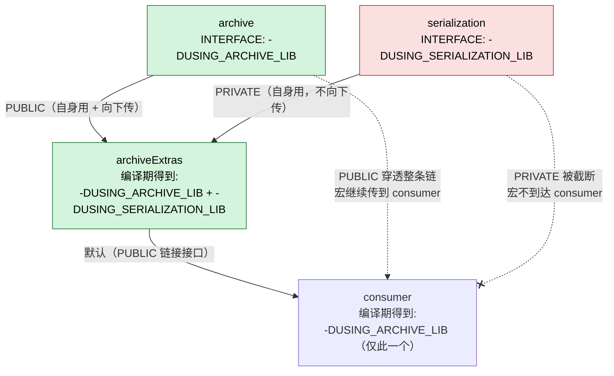

# 第 04 章 · Target 与现代 CMake

> 基准版本：CMake **4.3.4**（2026-06）。本章只讲纯现代 target-based 写法。

如果说前三章是"会用 CMake"，那么本章就是"理解 CMake"。**Target（目标）与 usage requirements（使用需求）的传播机制，是现代 CMake 的灵魂**。读懂这一章，你写出的 `CMakeLists.txt` 才能从"能跑"跃迁到"能复用、能组合、能被别人安全地依赖"。

本章会反复围绕一个核心思想展开：

> **一切皆 target，依赖即关系。** 你不再"设置全局开关"，而是"描述目标之间的依赖关系"；编译选项、头文件路径、宏定义、链接库，全部作为某个 target 的属性，沿着依赖关系**自动、定向地传播**给需要它们的人。

---

## 4.1 为什么是 target-based：与老式 CMake 的诀别

要理解现代 CMake 为什么这样设计，必须先看清它要解决的痛点。CMake 2.x 时代（乃至今天仍大量存在的"老式写法"）依赖一组**目录级 / 全局命令**：

```cmake
# ❌ 老式（"目录作用域"）写法 —— 不要这样写
include_directories(${CMAKE_SOURCE_DIR}/include)      # 给"当前目录及其子目录的所有目标"加头文件路径
add_definitions(-DUSE_FOO -DNDEBUG)                   # 给"当前目录及其子目录的所有目标"加宏
link_directories(${CMAKE_SOURCE_DIR}/libs)           # 给"当前目录"加库搜索路径
set(CMAKE_CXX_FLAGS "${CMAKE_CXX_FLAGS} -Wall")      # 直接拼全局编译标志字符串
```

这套做法有四宗"原罪"：

| 问题 | 老式写法的表现 | 后果 |
| :--- | :--- | :--- |
| **污染（pollution）** | `include_directories` 作用于"当前目录及所有子目录的所有 target" | 某个库的私有头文件路径，被强加给了同目录下毫不相关的目标 |
| **难复用（non-composable）** | 用 `set(FOO_INCLUDE_DIR ...)` 变量手动传参，消费者必须知道并手动 `include_directories(${FOO_INCLUDE_DIR})` | 换个项目就要重抄一遍胶水代码；依赖关系藏在变量里，看不见 |
| **易冲突（collision）** | 全局 `CMAKE_CXX_FLAGS` 字符串拼接 | 两个库要求互斥的编译选项时无法共存；后设置的覆盖先设置的 |
| **传播失控（leaky / lossy）** | 宏/路径要么"全局都有"，要么"我手动复制给你"，没有"自动且只给该给的人"的中间态 | 要么过度暴露（私有实现细节泄漏），要么遗漏（消费者忘了加路径，编译失败） |

老式写法的本质缺陷是：**它管理的是"目录"和"全局状态"，而不是"目标之间的关系"**。头文件路径、宏定义本应是"某个库对外承诺的接口的一部分"，却被扔进了与库本身脱节的全局/目录状态里。

现代 CMake 的答案是：

> 把头文件路径、宏定义、编译选项、链接需求，全部**绑定到产生它们的那个 target 上**，并用 `PRIVATE` / `PUBLIC` / `INTERFACE` 三个关键字精确声明"这个需求是给我自己用的，还是给依赖我的人用的，还是两者都要"。当 B `target_link_libraries(B ... A)` 时，A 对外承诺的那部分需求会**自动、精确地**流到 B。

这就是 **usage requirements（使用需求）传播**——本章 4.6 节会把它彻底讲透。从现在起，请把这条守则刻在脑子里：

> 🚫 **不写** `include_directories` / `add_definitions` / `link_directories` / 手拼 `CMAKE_CXX_FLAGS`
> ✅ **只写** `target_include_directories` / `target_compile_definitions` / `target_link_libraries` ...，并标注 `PRIVATE`/`PUBLIC`/`INTERFACE`

---

## 4.2 Target 概念总览

在 CMake 里，**target 是构建系统的基本组织单元**——它是一个有名字、有一组属性、能与其他 target 建立依赖关系的"节点"。整个项目的构建图（build graph），就是 target 节点 + 依赖边构成的有向图。

target 可以分为几大类：

| 类别 | 创建命令 | 会产出文件吗？ | 典型用途 |
| :--- | :--- | :--- | :--- |
| **可执行目标** | `add_executable()` | 是（可执行文件） | 程序入口 |
| **库目标** | `add_library()` | 视类型而定 | 被链接 / 加载 / 复用的代码 |
| **自定义目标** | `add_custom_target()` | 否（执行命令） | 代码生成、打包、跑脚本等 |
| **导入目标（IMPORTED）** | `add_*(... IMPORTED)` | 否（引用已存在的文件） | 引入预编译的第三方库 |
| **接口目标（INTERFACE）** | `add_library(... INTERFACE)` | 否（无源文件） | header-only 库 / 纯需求聚合 |
| **别名目标（ALIAS）** | `add_*(... ALIAS ...)` | 否（指向另一个 target） | 命名空间约定 `Foo::Bar` |

本章聚焦前面这些与 C/C++ 构建强相关的 target。`add_custom_target` 属于构建流程/代码生成范畴，将在后续章节展开。

每个真实 target 都携带一组**属性（properties）**。你几乎不直接用 `set_target_properties` 去写它们，而是通过 `target_*` 命令间接设置——这些命令底层就是在追加 target 的属性。理解"`target_*` 命令 = 设置 target 属性"这一点，是看懂传播机制的钥匙。

---

## 4.3 add_executable()：定义可执行目标

完整签名（常规形式）：

```cmake
add_executable(<name> [WIN32] [MACOSX_BUNDLE]
               [EXCLUDE_FROM_ALL]
               [source1] [source2 ...])
```

- **`<name>`**：target 名，全工程唯一；同时是默认输出文件名（可被属性覆盖）。
- **`WIN32`**：在 Windows 上生成 GUI 子系统程序（入口为 `WinMain` 而非 `main`，不弹控制台窗口）。对应 `WIN32_EXECUTABLE` 属性。
- **`MACOSX_BUNDLE`**：在 macOS 上生成 `.app` 应用包（Bundle）。对应 `MACOSX_BUNDLE` 属性。
- **`EXCLUDE_FROM_ALL`**：该目标**不**纳入默认的 `all` 构建（即直接 `cmake --build` 不会构建它），只有显式指定才构建。适合可选工具、示例、基准测试程序。

```cmake
add_executable(app main.cpp ui.cpp)              # 普通控制台/命令行程序
add_executable(gui_app WIN32 main.cpp)           # Windows GUI 程序，无控制台窗口
add_executable(sample EXCLUDE_FROM_ALL demo.cpp) # 默认不构建，需 cmake --build . --target sample
```

### IMPORTED 形式：引用一个外部可执行文件

```cmake
add_executable(<name> IMPORTED [GLOBAL])
```

它不构建任何东西，而是声明"有一个已经存在的可执行文件"，随后通过 `IMPORTED_LOCATION` 属性指向它。典型场景：把一个外部代码生成器（如 `protoc`、自定义 codegen 工具）包装成 target，供 `add_custom_command` 调用。

```cmake
add_executable(codegen IMPORTED)
set_target_properties(codegen PROPERTIES
  IMPORTED_LOCATION "/opt/tools/bin/codegen")
# 此后可在自定义命令里用 $<TARGET_FILE:codegen> 引用它
```

- **`GLOBAL`**：默认导入目标只在创建它的目录作用域可见；加 `GLOBAL` 让它全工程可见。

### ALIAS 形式：给可执行目标起别名

```cmake
add_executable(<name> ALIAS <target>)
```

为已有可执行目标创建一个只读别名（常用于命名空间约定，详见 4.9）。别名不能被 `install`，也不能再被设置属性。

---

## 4.4 add_library() 全类型详解（重点）

`add_library()` 是现代 CMake 的主战场。它能创建七种形态的库，理解每一种的语义至关重要。

```cmake
add_library(<name> [STATIC | SHARED | MODULE | OBJECT]
            [EXCLUDE_FROM_ALL]
            [<source>...])
```

若省略类型，CMake 用变量 `BUILD_SHARED_LIBS` 决定（`ON`→SHARED，否则→STATIC）。**显式写出类型是更稳妥的习惯**，除非你刻意想让上层用 `BUILD_SHARED_LIBS` 切换。

下面逐类型展开。先给一张速查总览表：

| 类型 | 产物 | 可被链接？ | 可被运行时加载？ | 参与编译？ | 典型用途 |
| :--- | :--- | :---: | :---: | :---: | :--- |
| **STATIC** | `.a` / `.lib` 静态库（object 归档） | ✅ | ❌ | ✅ | 编译期并入消费者，无运行时依赖 |
| **SHARED** | `.so` / `.dll` / `.dylib` 动态库 | ✅ | ✅（随程序加载） | ✅ | 共享代码、独立升级、减小体积 |
| **MODULE** | 动态库（插件） | ❌（不可被 link） | ✅（`dlopen`/`LoadLibrary`） | ✅ | 运行时按需加载的插件 |
| **OBJECT** | 一组 `.o`/`.obj`（不归档） | ⚠️（特殊，见下） | ❌ | ✅ | 编译一次、复用到多个目标 |
| **INTERFACE** | 无产物 | ✅（只传需求） | ❌ | ❌（无源文件） | header-only 库 / 需求聚合 |
| **IMPORTED** | 无产物（引用现有文件） | ✅ | 视底层而定 | ❌ | 引入预编译第三方库 |
| **ALIAS** | 无产物（指向另一 target） | ✅（等同被指向者） | — | — | 命名空间别名 |

### 4.4.1 STATIC：静态库

```cmake
add_library(math STATIC vec.cpp mat.cpp)
```

把目标文件打包成归档（archive）。链接它的消费者会在**链接期**把用到的目标代码并入自身，最终产物**不依赖** `math` 这个文件存在。静态库不参与运行时加载，部署简单，但多个程序各自复制一份代码。

> 静态库的链接传递有一个重要细节（PRIVATE 依赖仍会被传给下游链接），见 4.7。

### 4.4.2 SHARED：动态库

```cmake
add_library(net SHARED socket.cpp http.cpp)
```

生成可被运行时加载的共享库。多个程序共享同一份 `.so`/`.dll`，可独立升级、节省内存与体积；代价是部署时需保证库可被找到（`PATH`/`LD_LIBRARY_PATH`/rpath）。需要导出符号（Windows 上的 `__declspec(dllexport)`），这部分由后续章节的符号可见性/`GenerateExportHeader` 配合。

### 4.4.3 MODULE：插件库

```cmake
add_library(plugin_png MODULE png_loader.cpp)
```

MODULE 与 SHARED 类似都是动态库文件，但**语义上是"插件"**：它**不能**被其他 target `target_link_libraries` 链接，只能在运行时被宿主程序用 `dlopen` / `LoadLibrary` 显式加载。适合做可热插拔的扩展（图像格式解码器、效果器、脚本扩展等）。

### 4.4.4 OBJECT：对象库

```cmake
add_library(common OBJECT util.cpp log.cpp)
```

OBJECT 库只把源文件编译成一组目标文件（`.o`/`.obj`），**不归档、不链接成单一产物**。它的价值是**"编译一次，复用到多个最终目标"**，避免同一批源码被重复编译。

有两种方式消费 OBJECT 库：

**方式一（推荐，现代写法）：直接 `target_link_libraries`。** 现代 CMake 允许把 OBJECT 库当普通库链接，对象文件会被并入消费者，且 usage requirements 正常传播：

```cmake
add_library(common OBJECT util.cpp log.cpp)
target_include_directories(common PUBLIC include)

add_executable(app1 main1.cpp)
target_link_libraries(app1 PRIVATE common)   # common 的 .o 并入 app1，且 app1 拿到 include 路径

add_library(libx SHARED x.cpp)
target_link_libraries(libx PRIVATE common)   # 同一批 .o 也复用到 libx
```

**方式二（显式）：`$<TARGET_OBJECTS:...>` 生成器表达式。** 把对象库的目标文件作为"源文件"直接塞进另一个目标：

```cmake
add_library(common OBJECT util.cpp log.cpp)

add_executable(app
  main.cpp
  $<TARGET_OBJECTS:common>     # 把 common 编出来的 .o 作为 app 的额外目标文件
)
```

> `$<TARGET_OBJECTS:common>` 求值为 common 产出的所有目标文件路径列表。方式二只搬运目标文件，**不会**自动传播 usage requirements，因此现代代码更倾向方式一。

### 4.4.5 INTERFACE：接口库（header-only / 需求聚合）

INTERFACE 库**没有源文件、不产出任何二进制**。它的全部价值在于**承载并传播 usage requirements**。两大用途：

**用途一：header-only 库。** 头文件库没有 `.cpp` 要编译，但消费者需要它的头文件路径（也许还有编译选项、依赖）：

```cmake
add_library(json_hpp INTERFACE)                       # 无源文件
target_include_directories(json_hpp INTERFACE include) # 路径只给消费者（自己没东西要编）

add_executable(app main.cpp)
target_link_libraries(app PRIVATE json_hpp)            # app 自动获得 include 路径
```

注意：INTERFACE 库上**只能**用 `INTERFACE` 关键字（它自己不编译，谈不上 PRIVATE/PUBLIC 中"自己用"的部分）。

**用途二（3.23+）：用 `FILE_SET HEADERS` 让 header-only 库也能安装/导出。** 给 INTERFACE 库登记头文件集合后，这些头不仅成为消费者的 include 路径，还能被 `install(TARGETS ... FILE_SET HEADERS)` 正确安装（详见 4.5 的 `target_sources`）：

```cmake
add_library(Eigen INTERFACE)
target_sources(Eigen INTERFACE
  FILE_SET HEADERS
    BASE_DIRS src
    FILES src/eigen.h src/vector.h src/matrix.h
)
add_executable(exe1 exe1.cpp)
target_link_libraries(exe1 Eigen)   # BASE_DIRS(src) 自动成为 exe1 的 include 路径
```

### 4.4.6 IMPORTED：导入目标（引入预编译库）

IMPORTED 库声明"一个项目之外已经存在的库文件"，让你能用统一的 target 方式去依赖第三方预编译产物。

```cmake
add_library(<name> <STATIC|SHARED|MODULE|UNKNOWN|OBJECT|INTERFACE> IMPORTED [GLOBAL])
```

```cmake
add_library(zlib::zlib SHARED IMPORTED)
set_target_properties(zlib::zlib PROPERTIES
  IMPORTED_LOCATION             "/usr/lib/libz.so"        # 库文件实体
  INTERFACE_INCLUDE_DIRECTORIES "/usr/include")            # 消费者需要的头文件路径
add_executable(app main.cpp)
target_link_libraries(app PRIVATE zlib::zlib)             # 像普通库一样依赖
```

要点：

- 导入目标的"位置"用 `IMPORTED_LOCATION`（Windows 动态库还需 `IMPORTED_IMPLIB` 指向导入库 `.lib`）描述，而非由 CMake 构建。
- 它对消费者的需求，写在 `INTERFACE_*` 属性里（如上面的 `INTERFACE_INCLUDE_DIRECTORIES`），这与本章的传播机制完全一致——导入目标本质就是"一组手写的 usage requirements"。
- **`UNKNOWN IMPORTED`**：当你只知道有这么个库文件、但**不确定它是静态还是动态**（常见于 `find_library()` 返回一个路径却无法判定类型时），用 `UNKNOWN`。CMake 会直接把该文件路径放上链接行，不去推断静态/动态语义：

  ```cmake
  find_library(FOO_LIB NAMES foo)
  add_library(foo::foo UNKNOWN IMPORTED)
  set_target_properties(foo::foo PROPERTIES IMPORTED_LOCATION "${FOO_LIB}")
  ```

> 绝大多数情况下，你不会手写 IMPORTED 目标——`find_package(XXX)` 找到的库会**自动**以导入目标（通常带命名空间，如 `OpenSSL::SSL`）的形式提供给你。手写 IMPORTED 主要用于包装那些没有 CMake 配置文件的"裸"预编译库。

### 4.4.7 ALIAS：别名目标

```cmake
add_library(<name> ALIAS <target>)
```

为一个已存在的库目标创建只读别名。链接别名完全等价于链接被指向的目标。它的核心用途是**命名空间约定**（`Foo::Bar`），见 4.9。

```cmake
add_library(jsonparser STATIC parser.cpp)
add_library(Acme::jsonparser ALIAS jsonparser)   # 现在两个名字都能用
```

别名限制：不能 `install` 别名本身（要安装就安装真实目标）；不能对别名设置属性；别名指向的目标必须已存在。

---

## 4.5 target_* 命令全家（带签名与示例）

这一族命令是"给 target 添加需求"的标准入口。**它们全部支持 `PRIVATE` / `PUBLIC` / `INTERFACE` 关键字**（除少数例外），关键字的含义在 4.6 统一精讲。本节先把每个命令的签名、参数、用法过一遍。

> 共同形式：`target_xxx(<target> <PRIVATE|PUBLIC|INTERFACE> item... [更多关键字段...])`

### 4.5.1 target_sources —— 给目标追加源文件

```cmake
target_sources(<target>
  [<INTERFACE|PUBLIC|PRIVATE> <source>...]...)
```

向已创建的 target 追加源文件，常用于按条件增量添加，或把"创建目标"与"填充源文件"分文件管理。

**FILE_SET（3.23+）—— 登记头文件集合**。这是把头文件"作为目标的一部分"管理的现代机制，让头文件路径既能传播给消费者，又能被正确安装：

```cmake
target_sources(<target>
  <INTERFACE|PUBLIC|PRIVATE>
  FILE_SET <set_name> [TYPE <HEADERS|CXX_MODULES>]
    [BASE_DIRS <dir>...]
    [FILES <file>...]
)
```

- **`FILE_SET HEADERS`**：声明一个名为 `HEADERS`（或自定义名 + `TYPE HEADERS`）的头文件集。
- **`BASE_DIRS`**：这些目录会**自动成为该可见性下的 include 路径**——无需再单独写 `target_include_directories`。
- **`FILES`**：纳入集合的具体头文件，供 `install(TARGETS ... FILE_SET HEADERS)` 安装。

```cmake
add_library(mylib STATIC impl.cpp)
target_sources(mylib
  PUBLIC
    FILE_SET HEADERS
      BASE_DIRS include
      FILES include/mylib/api.h
)
# 效果：消费者编译时自动带上 include/ 路径；install 时 api.h 会被装到目标位置
```

### 4.5.2 target_include_directories —— 头文件搜索路径

```cmake
target_include_directories(<target> [SYSTEM] [AFTER|BEFORE]
  <INTERFACE|PUBLIC|PRIVATE> <dir>...
  [<INTERFACE|PUBLIC|PRIVATE> <dir>...]...)
```

- **`SYSTEM`**：把路径当系统头文件目录（通常抑制其中头文件的告警，并影响搜索语义）。
- **`BEFORE` / `AFTER`**：控制新增路径插在已有路径之前还是之后（默认 AFTER）。

最常见、最重要的命令之一。务必配合源码树/安装树用生成器表达式：

```cmake
target_include_directories(mylib
  PUBLIC
    $<BUILD_INTERFACE:${CMAKE_CURRENT_SOURCE_DIR}/include>  # 构建时：源码树里的 include
    $<INSTALL_INTERFACE:include>                            # 安装后：安装前缀下的 include
  PRIVATE
    ${CMAKE_CURRENT_SOURCE_DIR}/src                         # 仅 mylib 自己编译时需要
)
```

> `$<BUILD_INTERFACE:...>` 只在从构建树使用时生效，`$<INSTALL_INTERFACE:...>` 只在被安装/导出后使用时生效——这让同一个 PUBLIC 路径在"构建中"和"安装后"指向不同位置。

### 4.5.3 target_compile_definitions —— 预处理宏

```cmake
target_compile_definitions(<target>
  <INTERFACE|PUBLIC|PRIVATE> <def>...
  [<INTERFACE|PUBLIC|PRIVATE> <def>...]...)
```

每个 `<def>` 形如 `FOO` 或 `FOO=1`（**不要**带前导 `-D`，CMake 自动加）。

```cmake
target_compile_definitions(mylib
  PUBLIC  MYLIB_VERSION=4          # 消费者和自己都定义（影响公开头里的条件编译）
  PRIVATE MYLIB_INTERNAL_BUILD     # 只在编译 mylib 自身时定义
)
```

### 4.5.4 target_compile_options —— 编译器选项

```cmake
target_compile_options(<target> [BEFORE]
  <INTERFACE|PUBLIC|PRIVATE> <option>...
  [<INTERFACE|PUBLIC|PRIVATE> <option>...]...)
```

传递原始编译器标志。建议用生成器表达式做编译器/配置适配：

```cmake
target_compile_options(mylib
  PRIVATE
    $<$<CXX_COMPILER_ID:GNU,Clang>:-Wall -Wextra -Wpedantic>
    $<$<CXX_COMPILER_ID:MSVC>:/W4>
)
```

> 警告类选项一般用 `PRIVATE`——你的告警偏好不应强加给消费者。

### 4.5.5 target_compile_features —— 语言特性需求

```cmake
target_compile_features(<target>
  <INTERFACE|PUBLIC|PRIVATE> <feature>...
  [<INTERFACE|PUBLIC|PRIVATE> <feature>...]...)
```

声明目标需要的**编译器特性**，让 CMake 自动选择合适的语言标准并传播。最常用的是"语言标准"元特性：

```cmake
target_compile_features(mylib PUBLIC cxx_std_20)   # mylib 及其消费者至少用 C++20
```

- 用 `cxx_std_11/14/17/20/23/26` 表达"最低需要某个 C++ 标准"。
- **PUBLIC** 意味着消费者也会被提升到至少该标准——当你的**公开头**用到了某标准特性时，应当用 PUBLIC。
- 相比直接 `set(CMAKE_CXX_STANDARD 20)`（全局、不传播），`target_compile_features` 是 target 粒度且可传播的现代做法。

### 4.5.6 target_link_libraries —— 链接库（传播总枢纽）

```cmake
target_link_libraries(<target>
  <PRIVATE|PUBLIC|INTERFACE> <item>...
  [<PRIVATE|PUBLIC|INTERFACE> <item>...]...)
```

这是现代 CMake **最核心**的命令：它既声明"链接哪些库"，又通过关键字声明"被依赖时如何传播这些库及其 usage requirements"。`<item>` 可以是：另一个 target 名、导入目标、库文件路径、链接器标志，或生成器表达式。

```cmake
target_link_libraries(app
  PUBLIC    core                       # 链接 core，且把 core 的公开需求转给 app 的消费者
  PRIVATE   internal_utils zlib::zlib  # 链接，但不暴露给 app 的消费者
  INTERFACE header_only_helper         # app 自己不用，但消费者需要
)
```

> 注意：现代写法应**始终带关键字**。不带关键字的旧式调用（`target_link_libraries(app core)`）仍可用且默认按 PUBLIC 传播链接接口，但会和带关键字调用混用受限，**新代码请统一显式标注**。

### 4.5.7 target_link_options —— 链接器选项

```cmake
target_link_options(<target> [BEFORE]
  <INTERFACE|PUBLIC|PRIVATE> <option>...
  [<INTERFACE|PUBLIC|PRIVATE> <option>...]...)
```

向链接命令传递原始链接器标志（如 `-Wl,...`、`/SUBSYSTEM:...`）：

```cmake
target_link_options(app PRIVATE
  $<$<CXX_COMPILER_ID:GNU>:-Wl,--as-needed>
)
```

### 4.5.8 target_link_directories —— 链接库搜索路径

```cmake
target_link_directories(<target> [BEFORE]
  <INTERFACE|PUBLIC|PRIVATE> <dir>...
  [<INTERFACE|PUBLIC|PRIVATE> <dir>...]...)
```

`link_directories()` 的 target 版。**应优先使用导入目标/绝对库路径，尽量少用它**——目录级库搜索路径容易引入"链到错误的同名库"的隐患。仅在无法以导入目标方式表达某裸库位置时使用。

### 4.5.9 target_precompile_headers —— 预编译头（PCH）

```cmake
target_precompile_headers(<target>
  <INTERFACE|PUBLIC|PRIVATE> <header>...
  [<INTERFACE|PUBLIC|PRIVATE> <header>...]...)
```

为目标启用预编译头以加速编译。把高频、稳定的重头文件预编译一次：

```cmake
target_precompile_headers(mylib PRIVATE
  <vector>
  <string>
  "common/heavy.h"
)
```

> PCH 是构建加速手段，一般用 `PRIVATE`（你的 PCH 选择是实现细节，不必强塞给消费者，否则可能与消费者的 PCH 冲突）。

---

## 4.6 usage requirements 核心机制（本章灵魂）

现在进入全章最重要的内容。请慢读，这套心智模型会贯穿你之后写的每一行 CMake。

### 4.6.1 两类需求：build specification vs usage requirement

每个 target 携带的"需求"在概念上分成两类：

- **build specification（构建自身的规格）**：构建**这个 target 本身**所需要的东西。例如 mylib 的某个 `.cpp` 里 `#include "secret/internal.h"`，那么 `secret/` 这个 include 路径是 mylib **自己编译时**需要的——它是 mylib 的 build specification，**与谁来依赖 mylib 无关**。

- **usage requirement（使用需求）**：**当别人依赖（使用）这个 target 时**，别人那一侧需要满足的东西。例如 mylib 的**公开头** `api.h` 里 `#include "mylib/types.h"`，那么任何用了 `api.h` 的消费者也必须能找到 `mylib/` 路径——这是 mylib 的 usage requirement，由 mylib **承诺并对外传播**。

一个需求可能只属于其中一类，也可能两类都是。`PRIVATE`/`PUBLIC`/`INTERFACE` 三个关键字，正是用来精确声明"我加的这条需求落在哪一类"。

### 4.6.2 三关键字精确语义

| 关键字 | 加入 build specification（自己编译时生效）？ | 加入 usage requirement（传给消费者）？ | 一句话记忆 |
| :---: | :---: | :---: | :--- |
| **PRIVATE** | ✅ 是 | ❌ 否 | **只我自己用** |
| **INTERFACE** | ❌ 否 | ✅ 是 | **只消费者用，我自己不用** |
| **PUBLIC** | ✅ 是 | ✅ 是 | **我和消费者都用**（= PRIVATE + INTERFACE） |

逐条精讲：

- **`PRIVATE`：仅自己。** 这条需求只用于构建当前 target 自身，**不会**传播给任何依赖者。用于"纯实现细节"：私有头路径、内部宏、只在 `.cpp` 里用到的依赖库、告警选项。

- **`INTERFACE`：仅消费者。** 这条需求当前 target 自己**用不到**，但凡是依赖它的人都需要。最典型的就是 INTERFACE（header-only）库：库本身没有 `.cpp` 要编译，所以一切需求都是给消费者的，只能写 INTERFACE。

- **`PUBLIC`：两者都要。** 既是自己的 build specification，也要传给消费者。判断准则非常实用：**这条需求是否出现在你的公开头文件里？** 如果你的对外 `.h` 里 `#include` 了某路径下的头、用了某个宏、依赖了某个库的类型，那它就是 PUBLIC——因为消费者一旦 include 你的公开头，就会"连带"需要这些东西。

> **黄金判断法**：
> - 只在 `.cpp`（实现）里用到 → **PRIVATE**
> - 出现在 `.h`（公开接口）里 → **PUBLIC**
> - 我没有实现、纯转交（如 header-only 聚合） → **INTERFACE**

### 4.6.3 背后的 INTERFACE_* 属性：传播是如何承载的

三关键字不是魔法，它们落地为对 target 两组属性的写入：

- **非 INTERFACE_ 前缀属性**（如 `COMPILE_DEFINITIONS`、`INCLUDE_DIRECTORIES`、`LINK_LIBRARIES`、`COMPILE_OPTIONS`）：决定**构建该 target 自身**时用什么。`PRIVATE` 和 `PUBLIC` 会写进这里。
- **INTERFACE_ 前缀属性**（如 `INTERFACE_COMPILE_DEFINITIONS`、`INTERFACE_INCLUDE_DIRECTORIES`、`INTERFACE_LINK_LIBRARIES`、`INTERFACE_COMPILE_OPTIONS`）：决定**别人依赖该 target 时**会"继承"到什么。`INTERFACE` 和 `PUBLIC` 会写进这里。

于是三关键字 = 写哪一组属性：

| 关键字 | 写入普通属性（自身构建） | 写入 INTERFACE_* 属性（对外传播） |
| :---: | :---: | :---: |
| PRIVATE | ✅ | ❌ |
| INTERFACE | ❌ | ✅ |
| PUBLIC | ✅ | ✅ |

当你 `target_link_libraries(consumer ... producer)` 时，CMake 读取 `producer` 的所有 `INTERFACE_*` 属性，把里面的 include 路径、宏、选项、链接库**合并进 `consumer` 的构建**。这就是"传播"的全部真相：**沿着链接关系，把被依赖者的 `INTERFACE_*` 内容搬给依赖者**。而且这是**传递**的——`producer` 的 `INTERFACE_LINK_LIBRARIES` 里如果还有别的库，会继续往下游传。

### 4.6.4 官方示例逐步推演

现在用 CMake 官方 `cmake-buildsystem.7` 的权威示例，把每个 target 最终拿到的标志一步步推出来：

```cmake
add_library(archive archive.cpp)
target_compile_definitions(archive INTERFACE USING_ARCHIVE_LIB)

add_library(serialization serialization.cpp)
target_compile_definitions(serialization INTERFACE USING_SERIALIZATION_LIB)

add_library(archiveExtras extras.cpp)
target_link_libraries(archiveExtras PUBLIC archive)
target_link_libraries(archiveExtras PRIVATE serialization)
# archiveExtras 编译时带 -DUSING_ARCHIVE_LIB 和 -DUSING_SERIALIZATION_LIB

add_executable(consumer consumer.cpp)
target_link_libraries(consumer archiveExtras)
# consumer 编译时带 -DUSING_ARCHIVE_LIB（PUBLIC 传播过来）
```

**第 1 步：两个基础库声明各自的 INTERFACE 宏。**

- `archive` 把 `USING_ARCHIVE_LIB` 写进自己的 `INTERFACE_COMPILE_DEFINITIONS`。注意是 `INTERFACE`，所以 **archive 自己编译 `archive.cpp` 时并不带这个宏**，它纯粹是"给用我的人"的。
- `serialization` 同理，把 `USING_SERIALIZATION_LIB` 放进自己的 `INTERFACE_COMPILE_DEFINITIONS`。

**第 2 步：archiveExtras 链接两个库，关键字不同。**

- `target_link_libraries(archiveExtras PUBLIC archive)`：
  - archiveExtras **自己编译** `extras.cpp` 时，会继承 archive 的 `INTERFACE_COMPILE_DEFINITIONS` → 得到 `-DUSING_ARCHIVE_LIB`。
  - 因为是 **PUBLIC**，archive 同时被写入 archiveExtras 自己的 `INTERFACE_LINK_LIBRARIES`，即"我对外承诺：用我的人也要（间接）用 archive"。
- `target_link_libraries(archiveExtras PRIVATE serialization)`：
  - archiveExtras **自己编译**时，继承 serialization 的 `INTERFACE_COMPILE_DEFINITIONS` → 也得到 `-DUSING_SERIALIZATION_LIB`。
  - 因为是 **PRIVATE**，serialization **不**进入 archiveExtras 的 `INTERFACE_LINK_LIBRARIES` 的"非链接需求"传播部分——也就是说，archiveExtras 对外**不**承诺把 `USING_SERIALIZATION_LIB` 这个宏传下去。

  ✅ 结论：**编译 archiveExtras 时，命令行同时带 `-DUSING_ARCHIVE_LIB` 和 `-DUSING_SERIALIZATION_LIB`**（两条都来自"自身构建"那一侧）。

**第 3 步：consumer 链接 archiveExtras。**

- consumer 编译 `consumer.cpp` 时，继承 archiveExtras 的 `INTERFACE_*`：
  - archive 是 archiveExtras 的 **PUBLIC** 依赖 → archive 在 archiveExtras 的 `INTERFACE_LINK_LIBRARIES` 里 → consumer 顺着拿到 archive 的 `INTERFACE_COMPILE_DEFINITIONS` → **得到 `-DUSING_ARCHIVE_LIB`**。
  - serialization 是 archiveExtras 的 **PRIVATE** 依赖 → 它的**非链接 usage requirement（那个宏）不向 consumer 传播** → consumer **不带** `-DUSING_SERIALIZATION_LIB`。

  ✅ 结论：**编译 consumer 时，命令行带 `-DUSING_ARCHIVE_LIB`，但不带 `-DUSING_SERIALIZATION_LIB`**。

这正是官方注释所断言的行为。一句话总结：**PUBLIC 的需求会穿透一整条依赖链，PRIVATE 的需求到第一层依赖者为止（编译期）。**

### 4.6.5 传播关系图



> 实线 = 直接链接关系；绿色虚线 = PUBLIC 需求穿透传播；红色叉断线 = PRIVATE 需求在该处被截断（编译期需求不再下传）。

---

## 4.7 传递性链接（transitive linking）

usage requirements 中的"链接库"部分有一些**专属于链接**的传播规则，需要单独讲清，因为它和"编译期需求（宏/路径）"的传播略有不同。

### 4.7.1 链接接口自动传播

`target_link_libraries` 默认会把依赖记入 target 的 `INTERFACE_LINK_LIBRARIES`（链接接口），并**沿链传递**：若 `app → archiveExtras → archive` 且各层链接接口成立，最终 `app` 的链接行上会自动出现 `archive`，无需手动重复列出。这就是"传递性链接"——你只声明直接依赖，间接依赖由 CMake 顺着 `INTERFACE_LINK_LIBRARIES` 自动补全。

### 4.7.2 PRIVATE 依赖在静态库链接时仍会传递（关键细节）

这是最容易踩坑、也最体现 CMake 严谨之处的一点：

> 当一个**静态库** X 以 `PRIVATE` 链接库 Y 时，Y 会被包装成 **`$<LINK_ONLY:Y>`** 并写入 X 的 `INTERFACE_LINK_LIBRARIES`。

为什么？因为静态库 X **不**在自身产物里包含 Y 的代码（静态库只是归档，不做最终链接）。所以当下游真正去链接 X 时，**链接器仍然需要 Y 来解析 X 引用的符号**——Y 的"链接需求"必须传递下去，否则会出现未定义符号错误。

但 `PRIVATE` 又意味着 Y 是实现细节，X 不想把 Y 的**编译期 usage requirement**（include 路径、宏等）暴露给下游。`$<LINK_ONLY:Y>` 正是解决这个矛盾的精确工具：

- **它传播 Y 的"链接"部分**（Y 会出现在下游链接行上）——满足静态库符号解析的刚需；
- **它屏蔽 Y 的其他 usage requirement**（include 路径、宏、编译选项都不下传）——尊重 PRIVATE 的封装意图。

```cmake
add_library(X STATIC x.cpp)
target_link_libraries(X PRIVATE Y)
# X 是静态库 ⇒ Y 以 $<LINK_ONLY:Y> 进入 X 的 INTERFACE_LINK_LIBRARIES
# 下游链接 X 时：Y 出现在链接行（符号能解析），但下游 *不会* 拿到 Y 的 include 路径/宏
```

对比之下，若 X 是 **SHARED** 库，X 在自身 `.so` 内部就把 Y 的符号解析完了，下游链接 X 时通常无需再显式链接 Y——这也是动态库能更好"隐藏"私有依赖的原因之一。

### 4.7.3 手动使用 $<LINK_ONLY:>

你也可以显式用 `$<LINK_ONLY:...>` 表达"我只要链接它、不要它的其他 usage requirement"：

```cmake
target_link_libraries(app PUBLIC $<LINK_ONLY:onlylink_dep>)
# onlylink_dep 进入 app 链接行并向下游传递链接，但其 include/宏 不被 app 及下游继承
```

这是一个细粒度旋钮，日常较少直接用，但理解它能帮你看懂 CMake 自动生成的链接接口里为何会出现 `$<LINK_ONLY:...>`。

---

## 4.8 ALIAS 与命名空间约定

### 4.8.1 双冒号 `::` 约定

现代 CMake 社区有一条强约定：**对外暴露的库目标，用带双冒号的命名空间名**，如 `fmt::fmt`、`OpenSSL::SSL`、`Acme::core`。原因有三：

1. **可读性**：`Acme::core` 一眼看出它来自 Acme 这个包，而不是本地随手起的 `core`。
2. **与 `find_package` 一致**：`find_package(OpenSSL)` 提供给你的导入目标本就是 `OpenSSL::SSL` 这种带命名空间的名字。如果你的项目里 `add_subdirectory` 的内部库也用同样的 `Acme::core` 别名，那么**无论这个库是被 `find_package` 找到的、还是被当作子目录直接构建的，消费者写法完全一样**——这让"内部依赖"和"外部依赖"可以无缝切换。
3. **早失败保护**：CMake 规定——**任何带 `::` 的名字必定被当作 target**。若你拼错成一个不存在的 `Acme::cor`，CMake 会**立即报错**"找不到该 target"，而不会误以为你想链接一个名为 `Acme::cor` 的系统库文件而把错误拖到链接期。

### 4.8.2 为什么要加 ALIAS

真实库目标名往往是朴素的（`core`、`jsonparser`），为了同时享受上面的好处，标准做法是**给真实目标加一个带命名空间的 ALIAS**：

```cmake
add_library(core STATIC core.cpp)
target_include_directories(core PUBLIC
  $<BUILD_INTERFACE:${CMAKE_CURRENT_SOURCE_DIR}/include>
  $<INSTALL_INTERFACE:include>)

add_library(Acme::core ALIAS core)     # 关键：对外提供命名空间别名
```

之后无论库的使用者在哪，都统一写：

```cmake
target_link_libraries(app PRIVATE Acme::core)
```

这样：

- 在本仓库里 `add_subdirectory` 直接构建 core 时，`Acme::core` 别名可用；
- 当 core 被安装并通过 `install(EXPORT ... NAMESPACE Acme::)` 导出后，消费者 `find_package(Acme)` 拿到的也是 `Acme::core`；
- 两种情形消费者代码**零差异**。这正是"内部库 / 外部包可互换"的现代封装目标。

> 经验法则：**凡是打算被本项目之外（或本项目其他独立模块）使用的库，都给它配一个 `Namespace::name` 的 ALIAS。** 纯内部、不打算复用的小目标可不加。

---

## 4.9 现代写法 vs 老式写法对照速查

| 你想做的事 | ❌ 老式（避免） | ✅ 现代（采用） |
| :--- | :--- | :--- |
| 加头文件路径 | `include_directories(inc)` | `target_include_directories(t PUBLIC inc)` |
| 加宏 | `add_definitions(-DFOO)` | `target_compile_definitions(t PRIVATE FOO)` |
| 加编译选项 | `set(CMAKE_CXX_FLAGS "... -Wall")` | `target_compile_options(t PRIVATE -Wall)` |
| 指定语言标准 | `set(CMAKE_CXX_STANDARD 20)`（全局） | `target_compile_features(t PUBLIC cxx_std_20)` |
| 链接库 | `link_libraries(foo)` / 裸 `target_link_libraries(t foo)` | `target_link_libraries(t PRIVATE foo)`（带关键字） |
| 库搜索路径 | `link_directories(libs)` | 优先用导入目标；必要时 `target_link_directories(t PRIVATE libs)` |
| 头文件库 | 一堆 `set(XXX_INCLUDE_DIR ...)` 变量 | `add_library(x INTERFACE)` + `target_include_directories(x INTERFACE ...)` |
| 对外暴露库 | 直接用裸名 `core` | 加 `add_library(Ns::core ALIAS core)` |

---

## 本章小结

现代 CMake 的全部哲学，可以浓缩成一句话与三条守则：

> **一切皆 target，依赖即关系；把需求绑到 target 上，让它沿依赖自动传播。**

三条编写守则，请务必内化：

1. **只用 `target_*` 命令，绝不写 `include_directories` / `add_definitions` / `link_directories` / 拼 `CMAKE_CXX_FLAGS`。** 全局/目录级命令会污染、难复用、易冲突。

2. **每条需求都明确标注 `PRIVATE` / `PUBLIC` / `INTERFACE`。** 判断法则：只在 `.cpp` 实现里用 → **PRIVATE**；出现在公开 `.h` 里 → **PUBLIC**；自己不实现、纯转交（header-only 聚合） → **INTERFACE**。它们底层就是在决定写入 target 的普通属性、`INTERFACE_*` 属性，还是两者。

3. **对外暴露的库都配一个 `Namespace::name` 的 ALIAS。** 让内部库与 `find_package` 外部包写法一致、可互换，并享受双冒号名的"早失败"保护。

掌握 usage requirements 的传播（PUBLIC 穿透整条链、PRIVATE 编译期到第一层为止、静态库的 `$<LINK_ONLY:>` 链接传递），你就真正理解了现代 CMake 的运作方式——后续讲 `install` / `export` / `find_package` 时，会发现它们全都建立在本章这套 target 与 `INTERFACE_*` 属性的机制之上。

---

> ⬅️ [[42.Cmake/03 - 第一个项目与构建流程.md|上一章]] ｜ ➡️ [[42.Cmake/05 - 变量、缓存与作用域.md|第 05 章]]
>
> 🏠 [[00 - CMake 完整技术教程 - 总索引|总索引]]
