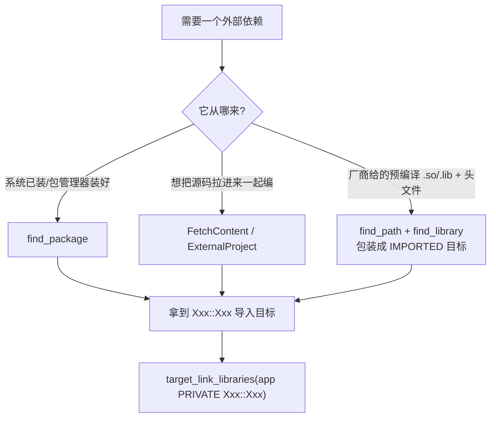

# 第 10 章 · 查找与依赖管理

> 基准版本：CMake 4.3.4

> 真实工程几乎不会"零依赖"。你要么链接系统里已经装好的库（Qt、OpenSSL、Boost……），要么把第三方源码拉进来一起编，要么消费一份预编译好的二进制包。本章把 CMake 处理依赖的全套机制讲透：从最常用的 `find_package`，到查找原语 `find_library/find_path`，到自己写 `FindXxx.cmake`，再到现代推荐的 `FetchContent`、配置期 vs 构建期的 `ExternalProject`，最后是 CMake 4.x 引入的跨工具包格式 **CPS** 与统一接管入口 **依赖提供者**。

---

## 10.1 依赖管理全景：三种来源，三套机制

在动手之前，先建立一张"地图"。一个外部依赖进入你的构建，本质上只有三种来源，而 CMake 为每种来源提供了对应的主力机制：

| 依赖来源 | 典型场景 | 主力机制 | 你最终拿到的东西 |
| --- | --- | --- | --- |
| **系统已装库** | apt/brew/vcpkg 装好的 OpenSSL、Boost、Qt | `find_package()` | 导入目标 `Xxx::Xxx` 或一组结果变量 |
| **源码并入** | 把 googletest / fmt 的源码拉进来一起编 | `FetchContent`（配置期）/ `ExternalProject`（构建期） | 直接可链接的 CMake 目标（FetchContent）或安装产物（ExternalProject） |
| **预编译第三方** | 厂商给的 `.so/.dll/.lib` + 头文件，无 CMake 配置 | 手写 `find_path`+`find_library` → **`IMPORTED` 目标** | 你自己 `add_library(... IMPORTED)` 包装出的导入目标 |

三条线索贯穿全章：

- **导入目标（IMPORTED target）优先**。无论哪种来源，现代 CMake 的终点都是一个携带"用法需求"（usage requirements：头文件路径、编译定义、依赖传递）的目标，例如 `OpenSSL::SSL`、`fmt::fmt`、`GTest::gtest_main`。你 `target_link_libraries(app PRIVATE OpenSSL::SSL)`，include 路径、宏定义、子依赖全自动传播。**不要再去手动拼 `Xxx_INCLUDE_DIRS`/`Xxx_LIBRARIES` 变量**——那是 2015 年以前的写法。
- **配置期（configure-time）vs 构建期（build-time）** 是理解 FetchContent 与 ExternalProject 区别的钥匙（见 §10.9）。
- **统一接管**：`find_package` 与 `FetchContent_MakeAvailable` 可以被 vcpkg/conan 这样的"依赖提供者"全局拦截（见 §10.11）。



---

## 10.2 `find_package` 的两种模式：Module vs Config

`find_package` 是依赖管理的"第一公民"，但它有两套互不相同的查找机制，理解它们是用好这个命令的前提。

### 10.2.1 两种模式是什么

| 维度 | **Module 模式** | **Config 模式** |
| --- | --- | --- |
| 查找的文件 | `Find<PackageName>.cmake` | `<PackageName>Config.cmake` 或 `<lowercase>-config.cmake` |
| 文件由谁提供 | **CMake 自带** 或 **你的项目** 提供 | **被依赖的库自己安装时生成** |
| 文件放在哪 | `CMAKE_MODULE_PATH` 指向的目录、CMake 安装目录的 `Modules/` | 库的安装前缀下，如 `<prefix>/lib/cmake/<Pkg>/` |
| 本质 | 一段"去系统里到处找"的脚本（内部多用 `find_path`/`find_library`） | 库作者精确导出的"我装在哪、我提供哪些目标"的清单 |
| 可靠性 | 取决于模块写得好不好，版本/组件信息常不全 | 高——由库的构建系统精确生成，自带导入目标和版本 |
| 适用场景 | 库自己不带 CMake 支持（如系统的 zlib、JPEG），靠 CMake 内置 `FindZLIB.cmake` 兜底 | 库自己用 CMake 构建并 `install(EXPORT)`/`install(PACKAGE_INFO)`（现代库的标配） |

一句话记忆：**Config 文件是"卖家"（库作者）写的精确说明书；Find 模块是"买家"（CMake 或你）写的寻人启事。** 现代库优先走 Config 模式。

### 10.2.2 查找顺序与切换

当使用**基本签名**（basic signature，见 §10.3）时：

1. **默认先 Module，后 Config**：先找 `Find<PackageName>.cmake`；找不到再回退到 Config 模式找 `<PackageName>Config.cmake`。
2. **`CMAKE_FIND_PACKAGE_PREFER_CONFIG` = TRUE** 可反转优先级 → 先 Config 后 Module。现代项目常推荐设为 `TRUE`，因为 Config 文件信息更全。
3. **`MODULE` 关键字** 强制只走 Module 模式（不回退 Config）。

当使用**完整签名**（full signature，凡出现 `CONFIG`/`NO_MODULE`/`CONFIGS`/`NAMES` 等只属于 Config 模式的关键字）时：**只走 Config 模式**，永不尝试 Module。

> 还有一个隐藏的"第 0 步"：若该包名已被 `FetchContent`（带 `OVERRIDE_FIND_PACKAGE`）或**依赖提供者**接管，`find_package` 会先被重定向，根本不走上面的磁盘查找。详见 §10.8 与 §10.11。

Config 模式下，CMake 会在每个查找前缀里探测一组标准子目录，主要包括（节选）：

```text
<prefix>/
<prefix>/(lib|lib64|lib/<arch>|share)/cmake/<name>*/
<prefix>/(lib|lib64|lib/<arch>|share)/<name>*/
<prefix>/(lib|lib64|lib/<arch>|share)/<name>*/(cmake|CMake)/
```

这就是为什么库通常把 Config 文件装到 `<prefix>/lib/cmake/<Pkg>/<Pkg>Config.cmake`。

---

## 10.3 `find_package` 完整签名详解

CMake 4.3.4 中 `find_package` 有两套签名。

**基本签名（basic signature，Module + Config）：**

```cmake
find_package(<PackageName> [<version>] [EXACT] [QUIET] [MODULE]
             [REQUIRED|OPTIONAL] [[COMPONENTS] <component>...]
             [OPTIONAL_COMPONENTS <component>...]
             [REGISTRY_VIEW {64|32|64_32|32_64|HOST|TARGET|BOTH}]
             [GLOBAL]
             [NO_POLICY_SCOPE]
             [BYPASS_PROVIDER]
             [UNWIND_INCLUDE])
```

**完整签名（full signature，只走 Config 模式）** 在基本签名基础上额外允许 `CONFIG|NO_MODULE`、`NAMES`、`CONFIGS`、`HINTS`、`PATHS`、`PATH_SUFFIXES` 以及一整组 `NO_*` 路径屏蔽选项：

```cmake
find_package(<PackageName> [version] [EXACT] [QUIET]
             [REQUIRED|OPTIONAL] [[COMPONENTS] <component>...]
             [OPTIONAL_COMPONENTS <component>...]
             [CONFIG|NO_MODULE]
             [GLOBAL]
             [NO_POLICY_SCOPE]
             [BYPASS_PROVIDER]
             [NAMES <name>...]
             [CONFIGS <config>...]
             [HINTS <path>...]
             [PATHS <path>...]
             [REGISTRY_VIEW {64|32|64_32|32_64|HOST|TARGET|BOTH}]
             [PATH_SUFFIXES <suffix>...]
             [NO_DEFAULT_PATH]
             [NO_PACKAGE_ROOT_PATH]
             [NO_CMAKE_PATH]
             [NO_CMAKE_ENVIRONMENT_PATH]
             [NO_SYSTEM_ENVIRONMENT_PATH]
             [NO_CMAKE_PACKAGE_REGISTRY]
             [NO_CMAKE_SYSTEM_PATH]
             [NO_CMAKE_INSTALL_PREFIX]
             [NO_CMAKE_SYSTEM_PACKAGE_REGISTRY]
             [CMAKE_FIND_ROOT_PATH_BOTH |
              ONLY_CMAKE_FIND_ROOT_PATH |
              NO_CMAKE_FIND_ROOT_PATH])
```

### 10.3.1 逐项详解

`**<version>**`：版本约束。

- 单值：`find_package(Foo 1.70)` 表示"至少 1.70"（要求 `Foo_VERSION >= 1.70` 且主版本兼容，具体由包的版本兼容策略决定）。
- **版本范围 `<lo>...<hi>`（3.19+）**：`find_package(Foo 1.2...3.4)` 表示 `1.2 <= 版本 <= 3.4`；`<lo>...<hi>` 含上界，`<lo>...<<hi>` 排除上界（`<<` 双小于号）。范围语义要求包侧的 ConfigVersion 文件声明支持范围（或 Find 模块用 `HANDLE_VERSION_RANGE`）。

```cmake
find_package(Qt6 6.5...6.9 REQUIRED COMPONENTS Widgets)   # 6.5 ≤ 版本 ≤ 6.9
find_package(fmt 9.0...<11.0 REQUIRED)                     # 9.0 ≤ 版本 < 11.0
```

`**EXACT**`：要求版本**完全等于** `<version>`，不能与版本范围同时使用。

`**REQUIRED**`：找不到就**致命错误（FATAL_ERROR）**并停止配置。生产代码里凡是"少了它编不出来"的依赖都应加 `REQUIRED`，让失败立刻暴露，而不是后面 `target_link_libraries` 时报一个晦涩的 `Xxx::Xxx` 不存在。

`**OPTIONAL**`（较新，与 `REQUIRED` 互斥）：显式声明"可选"，配合 `if(Foo_FOUND)` 做特性开关。不写 `REQUIRED` 时默认即为可选。

`**QUIET**`：找不到时**不打印**警告/状态信息（但 `REQUIRED` 的致命错误照样报）。常用于"先静默探测，再自己决定怎么处理"。

`**COMPONENTS <c>...**` / `[COMPONENTS]`：要求包提供指定**组件**，缺一不可（缺则视为未找到）。`COMPONENTS` 关键字在基本签名里可省略，直接跟在版本后。

```cmake
find_package(Qt6 REQUIRED COMPONENTS Core Gui Widgets Network)
target_link_libraries(app PRIVATE Qt6::Core Qt6::Widgets Qt6::Network)
```

`**OPTIONAL_COMPONENTS <c>...**`：可选组件，找不到不算失败，但若找到会被一并配置。

`**CONFIG**` / `**NO_MODULE**`：等价，强制**只走 Config 模式**（启用完整签名）。当你确知库提供了 Config 文件、且不想被某个同名 Find 模块拦截时使用。

`**MODULE**`：相反，强制只走 Module 模式（仅基本签名可用）。

`**GLOBAL**`（3.24+）：把本次导入的目标提升为**全局可见**（默认导入目标的可见性受目录作用域限制）。等价于设置 `CMAKE_FIND_PACKAGE_TARGETS_GLOBAL`。

`**NAMES <name>...**`：Config 模式下，除 `<PackageName>` 外再尝试这些备用包名去匹配 `*Config.cmake`（应对库改名/别名）。

`**CONFIGS <config>...**`：直接指定要查找的 Config 文件名（而非按约定推导），少用但偶尔救命。

`**HINTS <path>...**`：**优先**在这些路径下找（在系统默认路径**之前**）。语义上"我比较确定它在这"。可用 `ENV <var>` 读环境变量。

`**PATHS <path>...**`：**兜底**路径（在系统默认路径**之后**才找）。语义上"实在找不到再来这看看"。

`**PATH_SUFFIXES <suffix>...**`：在每个查找前缀下额外追加这些子目录再找，如 `PATH_SUFFIXES lib/cmake share/cmake`。

`**NO_DEFAULT_PATH**`：**关闭所有内置默认查找路径**，只在你用 `HINTS`/`PATHS` 显式给的路径里找。做可复现/离线构建时常用，避免意外命中系统库。

`**NO_PACKAGE_ROOT_PATH / NO_CMAKE_PATH / NO_CMAKE_ENVIRONMENT_PATH / NO_SYSTEM_ENVIRONMENT_PATH / NO_CMAKE_SYSTEM_PATH / NO_CMAKE_INSTALL_PREFIX / NO_CMAKE_PACKAGE_REGISTRY / NO_CMAKE_SYSTEM_PACKAGE_REGISTRY**`：**逐类**屏蔽某一来源的查找路径（比 `NO_DEFAULT_PATH` 粒度细）。例如 `NO_CMAKE_SYSTEM_PATH` 只屏蔽系统标准路径，但仍允许 `<Pkg>_ROOT` 和 `CMAKE_PREFIX_PATH`。

`**BYPASS_PROVIDER**`：**绕过依赖提供者**，强制走 CMake 内置查找逻辑。仅供"提供者实现"自己调用 `find_package` 时避免无限递归，业务代码不要用。

`**REGISTRY_VIEW**`（Windows）：指定查询注册表的视图位宽（64/32/...），交叉位宽构建时用。

`**NO_POLICY_SCOPE**`：被加载的模块/配置文件中的 `cmake_policy` 改动不被作用域隔离（影响策略传播，极少用）。

### 10.3.2 结果：变量 vs 导入目标

`find_package` 成功后会设置（最重要的几个）：

- `**<PackageName>_FOUND**`：是否找到（布尔）。**所有可选依赖都应据此判断**。
- `**<PackageName>_VERSION**`：找到的版本号（Config 模式几乎总有；Module 模式视模块而定）。
- 传统结果变量：`<Pkg>_INCLUDE_DIRS`、`<Pkg>_LIBRARIES`、`<Pkg>_DEFINITIONS` ——**遗留写法，尽量别再直接用**。
- **导入目标 `<Pkg>::<Pkg>`（或多个，如 `Qt6::Widgets`、`OpenSSL::SSL`/`OpenSSL::Crypto`）——首选**。

```cmake
find_package(OpenSSL 3.0 REQUIRED)

# ✅ 现代写法：链接导入目标，include/宏/子依赖自动传播
add_executable(app main.cpp)
target_link_libraries(app PRIVATE OpenSSL::SSL OpenSSL::Crypto)

# ❌ 遗留写法：手动拼变量，易漏传递依赖、易踩平台差异
# target_include_directories(app PRIVATE ${OPENSSL_INCLUDE_DIR})
# target_link_libraries(app PRIVATE ${OPENSSL_LIBRARIES})
```

> 经验法则：**先查文档确认包导出了哪些导入目标，优先链接它们**；只有当某个老旧包根本不提供导入目标时，才退回结果变量，并且最好自己包一个 `INTERFACE` 库把它"现代化"。

---

## 10.4 查找原语：`find_library` / `find_path` / `find_program` / `find_file`

这四个命令是所有 Find 模块的"积木"，也是你手动包装预编译库时的主力。它们共享几乎一致的签名结构。

### 10.4.1 四个命令的通用签名

```cmake
find_library(<VAR>
             {<name> | NAMES <name>... [NAMES_PER_DIR]}
             [HINTS {<path> | ENV <var>}...]
             [PATHS {<path> | ENV <var>}...]
             [PATH_SUFFIXES <suffix>...]
             [REGISTRY_VIEW {64|32|...}]
             [VALIDATOR <function>]
             [DOC "缓存条目说明"]
             [NO_CACHE]
             [REQUIRED|OPTIONAL]
             [NO_DEFAULT_PATH] [NO_CMAKE_PATH] ... )   # 与 find_package 同族的 NO_* 屏蔽项
```

`find_path` / `find_program` / `find_file` 签名同形，差别只在"找什么"：

| 命令 | 找什么 | `NAMES` 给的是 | 典型结果 |
| --- | --- | --- | --- |
| `find_library` | 库文件 | 库名（`foo` → `libfoo.so`/`foo.lib`，自动加平台前后缀） | `/usr/lib/libfoo.so` |
| `find_path` | **包含某文件的目录** | 头文件名（`foo/foo.h`） | `/usr/include`（含该头文件的目录） |
| `find_program` | 可执行程序 | 程序名（`clang-format`） | `/usr/bin/clang-format` |
| `find_file` | 某个具体文件的完整路径 | 文件名 | `/usr/include/foo/foo.h` |

### 10.4.2 关键选项详解

`**NAMES <name>...**`：候选名清单，按顺序尝试。`find_library` 会**自动**套用平台前后缀（Linux `lib*.so/.a`、Windows `*.lib/*.dll`、macOS `lib*.dylib`），所以写 `NAMES foo` 即可。`**NAMES_PER_DIR**`：改变搜索次序——默认是"每个名字遍历所有目录"，加此项变为"每个目录遍历所有名字"（同目录下多个候选名时优先级更直观）。

`**HINTS**` / `**PATHS**`：同 `find_package`，`HINTS` 在默认路径之前、`PATHS` 在之后；均支持 `ENV <var>`。

`**PATH_SUFFIXES**`：每个搜索前缀下追加的子目录，如 `PATH_SUFFIXES lib lib64`。

`**REQUIRED**`（**3.18+**）：找不到即报致命错误。在原语层面就早失败，比事后空变量好排查。

`**OPTIONAL**`：与 `REQUIRED` 互斥，显式可选。

`**NO_CACHE**`（**3.21+**）：把结果存进**普通变量**而非缓存条目。

  - 默认行为：结果写入一个 `CACHE` 缓存变量（`<VAR>` 出现在 `CMakeCache.txt`，可被用户在 GUI/`-D` 里覆盖；一旦有值，**后续 CMake 不会重新查找**——这既是性能优化也是"改了路径不生效"的常见坑，需 `-U<VAR>` 或删缓存才会重查）。
  - `NO_CACHE`：每次配置都重新查找，结果只在当前作用域可见。适合**中间结果**（如先找到一个目录，再据此推导别的）；但因为不缓存，频繁查找会拖慢配置，**对最终要暴露给用户的路径不建议用**。

`**VALIDATOR <function>**`：传入一个 `function`/`macro` 名，对每个候选做额外校验（如检查库的 ABI、检查程序版本），返回不通过则继续找下一个。

`**DOC "..."**`：缓存条目在 GUI 里显示的说明文字。

`**NO_DEFAULT_PATH**` 及各 `NO_*`：与 `find_package` 同义，按需收窄搜索范围。

```cmake
# 找一个程序：clang-format（可选，用于格式化目标）
find_program(CLANG_FORMAT_EXE NAMES clang-format clang-format-18 clang-format-17)
if(CLANG_FORMAT_EXE)
  message(STATUS "clang-format: ${CLANG_FORMAT_EXE}")
endif()

# 找头文件目录 + 库（手动包装预编译库的典型两步）
find_path(FOO_INCLUDE_DIR NAMES foo/foo.h PATH_SUFFIXES include)
find_library(FOO_LIBRARY  NAMES foo       PATH_SUFFIXES lib lib64)
```

> 缓存陷阱再强调：`find_*` 结果默认进缓存。**如果你改了库的安装位置却发现 CMake 还指向旧路径**，原因就是缓存里的旧值还在。解决：`cmake -U FOO_LIBRARY <build>` 取消该缓存项，或直接删 `CMakeCache.txt` 重配。

---

## 10.5 查找控制变量：从外部影响查找行为

很多时候你不改 `CMakeLists.txt`，只想"告诉 CMake 去哪找"。这组变量就是给用户/CI 用的旋钮。

`**CMAKE_PREFIX_PATH**`（最常用）：一组**安装前缀**列表。`find_package`（Config）、`find_library`、`find_path` 等都会在每个前缀下按标准子目录（`lib/cmake/...`、`include`、`lib`）查找。装在非标准位置的库，把它的安装前缀加到这里即可。

```bash
# 命令行注入（推荐用 ; 分隔多个前缀；Windows 同样用 ;）
cmake -B build -DCMAKE_PREFIX_PATH="/opt/qt6;/opt/openssl"
# 或用环境变量（CMake 会读取同名环境变量）
export CMAKE_PREFIX_PATH=/opt/qt6:/opt/openssl   # 环境变量按平台分隔符
```

`**CMAKE_MODULE_PATH**`：一组目录，`find_package`（Module 模式）和 `include()` 会**优先**在这里找 `Find<Pkg>.cmake` / `.cmake` 脚本，**先于** CMake 自带的 `Modules/`。把你项目自己写的 Find 模块放进来：

```cmake
list(APPEND CMAKE_MODULE_PATH "${CMAKE_CURRENT_SOURCE_DIR}/cmake/modules")
find_package(MyVendorLib REQUIRED)   # 命中 cmake/modules/FindMyVendorLib.cmake
```

`**<PackageName>_ROOT**`（**3.12+**，优先级最高的"点名"变量）：为**特定包**指定查找根。`find_package(Foo)` 会**优先**搜索 `Foo_ROOT`（变量或同名环境变量）。这是给单个包"精准定位"的首选，比全局的 `CMAKE_PREFIX_PATH` 更聚焦：

```bash
cmake -B build -DOpenSSL_ROOT=/opt/openssl-3.3 -DFoo_ROOT=/opt/foo
```

> 注意大小写：变量名用 `find_package` 里写的那个 `<PackageName>` 原样大小写（`OpenSSL_ROOT`、`Qt6_ROOT`）。

`**CMAKE_FIND_ROOT_PATH**`（交叉编译核心）：把所有 `find_*` 的搜索**重定位**到这些根目录下（典型是目标平台 sysroot），避免误用宿主机的库。配合每命令的 `CMAKE_FIND_ROOT_PATH_BOTH | ONLY_CMAKE_FIND_ROOT_PATH | NO_CMAKE_FIND_ROOT_PATH` 控制"在 sysroot 里找/也在宿主找/只在宿主找"。通常在工具链文件（toolchain file，见第 13 章）里设置。

`**CMAKE_FIND_PACKAGE_PREFER_CONFIG**`：设为 `TRUE` 时，基本签名的 `find_package` **先 Config 后 Module**。现代项目推荐打开，让库自带的精确 Config 文件优先于可能过时的 Find 模块。

```cmake
set(CMAKE_FIND_PACKAGE_PREFER_CONFIG TRUE)
```

辅助调试变量：`**CMAKE_FIND_DEBUG_MODE**`（设 `TRUE` 或 `--debug-find`）会打印每个 `find_*` 实际探测了哪些路径——**查"为什么找不到"时的第一手段**。

---

## 10.6 编写 `FindXxx.cmake` 模块（完整模板）

当一个库既不带 Config 文件、CMake 也没有内置 Find 模块时，你需要自己写一个。标准做法是 `find_path` + `find_library` 定位，再用 `FindPackageHandleStandardArgs` 统一处理 `REQUIRED`/`QUIET`/版本，最后**创建一个 `IMPORTED` 目标**对外暴露。

### 10.6.1 `find_package_handle_standard_args` 签名

它有两套签名，**推荐用第二套**（关键字形式）：

```cmake
find_package_handle_standard_args(
  <PackageName>
  [REQUIRED_VARS <var>...]      # 这些变量必须都有值才算 FOUND
  [VERSION_VAR <var>]           # 持有检测到的版本，用于和请求版本比对
  [HANDLE_VERSION_RANGE]        # 3.19+：支持版本范围 1.2...3.4
  [HANDLE_COMPONENTS]           # 处理 COMPONENTS（缺必需组件则未找到）
  [CONFIG_MODE]                 # 本模块其实包了一层 find_package(NO_MODULE)
  [NAME_MISMATCHED]             # 3.17+：包名与 CMAKE_FIND_PACKAGE_NAME 不一致时压制告警
  [REASON_FAILURE_MESSAGE "..."]
  [FAIL_MESSAGE "..."]
)
```

它会自动设置 `<PackageName>_FOUND`（以及全大写 `<PACKAGENAME>_FOUND`），并按 `find_package` 调用方传入的 `REQUIRED`/`QUIET` 决定是否报错/静默、是否打印 `Found Xxx: ...` 这类标准信息。

### 10.6.2 完整模板：`FindFoo.cmake`

```cmake
# cmake/modules/FindFoo.cmake
# 定位 Foo 库：提供导入目标 Foo::Foo

# 1) （可选）借助 pkg-config 拿到搜索提示，提高命中率
find_package(PkgConfig QUIET)
if(PkgConfig_FOUND)
  pkg_check_modules(PC_Foo QUIET foo)   # 得到 PC_Foo_INCLUDE_DIRS / PC_Foo_LIBRARY_DIRS / PC_Foo_VERSION
endif()

# 2) 找头文件目录（HINTS 用 pkg-config 给的提示）
find_path(Foo_INCLUDE_DIR
  NAMES foo/foo.h
  HINTS ${PC_Foo_INCLUDE_DIRS}
  PATH_SUFFIXES include
)

# 3) 找库文件
find_library(Foo_LIBRARY
  NAMES foo libfoo
  HINTS ${PC_Foo_LIBRARY_DIRS}
  PATH_SUFFIXES lib lib64
)

# 4) 推断版本：优先用 pkg-config，否则尝试从头文件解析宏
set(Foo_VERSION "${PC_Foo_VERSION}")
if(NOT Foo_VERSION AND Foo_INCLUDE_DIR AND EXISTS "${Foo_INCLUDE_DIR}/foo/version.h")
  file(STRINGS "${Foo_INCLUDE_DIR}/foo/version.h" _foo_ver_line
       REGEX "^#define[ \t]+FOO_VERSION_STRING[ \t]+\"[^\"]+\"")
  string(REGEX REPLACE ".*\"([^\"]+)\".*" "\\1" Foo_VERSION "${_foo_ver_line}")
endif()

# 5) 统一处理 REQUIRED/QUIET/版本，设置 Foo_FOUND
include(FindPackageHandleStandardArgs)
find_package_handle_standard_args(Foo
  REQUIRED_VARS Foo_LIBRARY Foo_INCLUDE_DIR
  VERSION_VAR   Foo_VERSION
  HANDLE_VERSION_RANGE          # 允许调用方写 find_package(Foo 1.2...2.0)
)

# 6) 找到了就创建导入目标（现代 Find 模块的关键产出）
if(Foo_FOUND AND NOT TARGET Foo::Foo)
  add_library(Foo::Foo UNKNOWN IMPORTED)        # UNKNOWN：让 CMake 自行判断静/动态
  set_target_properties(Foo::Foo PROPERTIES
    IMPORTED_LOCATION             "${Foo_LIBRARY}"
    INTERFACE_INCLUDE_DIRECTORIES "${Foo_INCLUDE_DIR}"
  )
endif()

# 7) 把内部缓存变量标记为 advanced（不在 GUI 默认列表里碍眼）
mark_as_advanced(Foo_INCLUDE_DIR Foo_LIBRARY)
```

调用方就能这样用，享受和"原生 Config 包"一致的体验：

```cmake
list(APPEND CMAKE_MODULE_PATH "${CMAKE_SOURCE_DIR}/cmake/modules")
find_package(Foo 1.2 REQUIRED)
target_link_libraries(app PRIVATE Foo::Foo)
```

> 关键点：**Find 模块的现代职责不是"设一堆变量"，而是"产出一个 `IMPORTED` 目标"**。这样上层项目无论依赖来自系统库、源码并入还是预编译，写法完全统一。

---

## 10.7 pkg-config 集成

类 Unix 平台上大量库提供 `.pc` 文件（pkg-config 元数据）。CMake 用 `FindPkgConfig` 模块桥接它们。

```cmake
find_package(PkgConfig REQUIRED)

# 检查并导入 libfoo；IMPORTED_TARGET 让 pkg-config 也产出导入目标
pkg_check_modules(FOO REQUIRED IMPORTED_TARGET foo>=1.4)

add_executable(app main.cpp)
target_link_libraries(app PRIVATE PkgConfig::FOO)   # ✅ 用导入目标
```

`**pkg_check_modules(<前缀> [REQUIRED] [QUIET] [IMPORTED_TARGET] [GLOBAL] <moduleSpec>...)**`：

- `**REQUIRED**`：缺失即致命错误。
- `**IMPORTED_TARGET**`：生成导入目标 `**PkgConfig::<前缀>**`（这里是 `PkgConfig::FOO`），自动带好 include/库/编译选项 —— **优先用它**，别再手动拼 `${FOO_INCLUDE_DIRS}` / `${FOO_LIBRARIES}`。
- `**GLOBAL**`：让该导入目标全局可见（默认受目录作用域限制）。
- `**<moduleSpec>**`：模块名可带版本约束，如 `foo>=1.4`、`gtk+-3.0`。

兼容写法（无导入目标的老用法，仅作了解）：

```cmake
pkg_check_modules(FOO REQUIRED foo)
target_include_directories(app PRIVATE ${FOO_INCLUDE_DIRS})
target_link_libraries(app PRIVATE ${FOO_LIBRARIES})
target_compile_options(app PRIVATE ${FOO_CFLAGS_OTHER})
```

> 适用边界：pkg-config 在 Linux/macOS 上很顺手；Windows 上 `.pc` 文件分布稀疏，能用 `find_package`（Config）就优先 `find_package`。

---

## 10.8 FetchContent：现代推荐的源码并入

`FetchContent`（配置期拉取依赖源码并直接加入本次构建）是当今**首选**的"把第三方源码一起编"的方案。它在 **配置阶段** 下载源码、对其执行 `add_subdirectory`，于是第三方的 CMake 目标（如 `GTest::gtest_main`、`fmt::fmt`）**直接出现在你的工程里**，可以像自家目标一样链接。

### 10.8.1 核心两步

```cmake
include(FetchContent)

FetchContent_Declare(<name>
  <下载选项>...                 # 见下表
  [EXCLUDE_FROM_ALL]           # 3.28+：其目标不进 all，避免被默认构建/安装
  [SYSTEM]                     # 3.25+：把其 include 视作 SYSTEM，抑制其头文件的告警
  [OVERRIDE_FIND_PACKAGE |     # 3.24+：让后续 find_package(<name>) 重定向到这里
   FIND_PACKAGE_ARGS <args>...]
)

FetchContent_MakeAvailable(<name> [<name2> ...])   # 下载(若需) + add_subdirectory
```

`FetchContent_Declare` 常用**下载选项**（透传给底层 `ExternalProject` 的下载步骤）：

| 选项 | 含义 |
| --- | --- |
| `GIT_REPOSITORY <url>` | Git 仓库地址 |
| `GIT_TAG <tag/sha>` | **务必写具体提交 SHA 或 tag**，别写分支名（分支会漂移，破坏可复现） |
| `GIT_SHALLOW TRUE` | 浅克隆，加速（对 SHA 需配合，对 tag 通常可用） |
| `URL <url>...` | 用归档包而非 git（可给多个镜像 URL） |
| `URL_HASH <ALGO>=<hash>` | 校验归档完整性（如 `SHA256=...`），**离线/可复现构建强烈建议** |
| `SOURCE_DIR <dir>` | 指定源码落地目录（默认在 build 树下） |
| `FIND_PACKAGE_ARGS [<args>...]` | **3.24+**：声明"可以先试 `find_package` 找系统版，找不到再下载"，args 透传给 `find_package` |
| `OVERRIDE_FIND_PACKAGE` | **3.24+**：把这个包"注册"给 FetchContent，使任何 `find_package(<name>)` 都被重定向到本声明 |

### 10.8.2 完整可运行示例：用 fmt + googletest

```cmake
cmake_minimum_required(VERSION 3.24)
project(demo CXX)

include(FetchContent)

# 依赖 1：fmt（格式化库）
FetchContent_Declare(fmt
  GIT_REPOSITORY https://github.com/fmtlib/fmt.git
  GIT_TAG        11.0.2          # 具体 tag，可复现
  GIT_SHALLOW    TRUE
)

# 依赖 2：googletest（测试框架）
FetchContent_Declare(googletest
  GIT_REPOSITORY https://github.com/google/googletest.git
  GIT_TAG        v1.15.2
)

# 一次性拉取并加入构建（顺序无关，可一起写）
FetchContent_MakeAvailable(fmt googletest)

add_executable(app main.cpp)
target_link_libraries(app PRIVATE fmt::fmt)

enable_testing()
add_executable(unit_tests test_main.cpp)
target_link_libraries(unit_tests PRIVATE GTest::gtest_main fmt::fmt)
add_test(NAME unit_tests COMMAND unit_tests)
```

```bash
cmake -B build
cmake --build build
ctest --test-dir build --output-on-failure
```

### 10.8.3 与 `find_package` 集成：优先系统、回退源码

最佳实践是"**能用系统装好的就用，没装才下载**"，靠 `FIND_PACKAGE_ARGS`（3.24+）实现：

```cmake
FetchContent_Declare(googletest
  GIT_REPOSITORY https://github.com/google/googletest.git
  GIT_TAG        v1.15.2
  FIND_PACKAGE_ARGS NAMES GTest          # 先 find_package(GTest)，失败才克隆源码
)
FetchContent_MakeAvailable(googletest)   # 命中系统 GTest 则用之，否则下载构建

target_link_libraries(unit_tests PRIVATE GTest::gtest_main)
```

控制这套"先找后取"行为的开关是 `**FETCHCONTENT_TRY_FIND_PACKAGE_MODE**`：

- `**OPT_IN**`（默认）：只有声明里写了 `FIND_PACKAGE_ARGS` 的依赖，`MakeAvailable` 才会先试 `find_package`。
- `**ALWAYS**`：对所有依赖都先试 `find_package`（即使没写 `FIND_PACKAGE_ARGS`）。
- `**NEVER**`：一律不试 `find_package`，永远下载源码。

其余常用 `FETCHCONTENT_*` 全局开关：

| 变量 | 作用 |
| --- | --- |
| `FETCHCONTENT_FULLY_DISCONNECTED` | `TRUE` 时**完全离线**：不更新、不下载（要求内容已就位），适合受限 CI |
| `FETCHCONTENT_UPDATES_DISCONNECTED` | `TRUE` 时跳过更新步骤（已下载的不再检查远端），加速重配置 |
| `FETCHCONTENT_QUIET` | 控制下载日志噪音（默认 `ON`） |
| `FETCHCONTENT_BASE_DIR` | 改变内容下载/解压的根目录（默认 `${CMAKE_BINARY_DIR}/_deps`） |
| `FETCHCONTENT_SOURCE_DIR_<NAME>` | 把某依赖**指向本地已有源码目录**（本地联调改第三方源码时极有用） |

> 用 `OVERRIDE_FIND_PACKAGE` 还能做到"超控"：声明后，工程里任何位置的 `find_package(<name>)`（哪怕在子模块深处）都会被重定向到你的 FetchContent 声明，无需改动那些子模块的代码。

---

## 10.9 ExternalProject：构建期集成

`ExternalProject` 比 FetchContent 更老、更重，核心区别是**它在构建阶段（build-time）才下载/配置/构建/安装外部项目**，把对方当成一个**完全独立的子构建**来跑，而不是把对方的目标并进你的工程。

```cmake
include(ExternalProject)

ExternalProject_Add(zlib_ext
  # —— 下载步骤 ——
  GIT_REPOSITORY    https://github.com/madler/zlib.git
  GIT_TAG           v1.3.1
  # 或： URL <archive-url>  URL_HASH SHA256=...

  # —— 目录布局 ——
  PREFIX            ${CMAKE_BINARY_DIR}/zlib            # 各步骤工作根目录
  INSTALL_DIR       ${CMAKE_BINARY_DIR}/zlib/install    # 安装前缀

  # —— 配置 / 构建 / 安装步骤（按需覆盖默认行为）——
  CMAKE_ARGS        -DCMAKE_INSTALL_PREFIX=<INSTALL_DIR>
                    -DCMAKE_BUILD_TYPE=Release
  # CONFIGURE_COMMAND / BUILD_COMMAND / INSTALL_COMMAND 可整段替换默认命令
  # TEST_COMMAND ""  # 关闭测试步骤

  # —— 其他 ——
  BUILD_ALWAYS      FALSE
  LOG_DOWNLOAD      TRUE
  LOG_BUILD         TRUE
)
```

`ExternalProject_Add` 的步骤被组织成 download → update/patch → configure → build → install →（可选）test，每一步都能用对应的 `*_COMMAND` / `*_DIR` / `LOG_*` 参数定制。常用核心参数：

| 参数 | 作用 |
| --- | --- |
| `GIT_REPOSITORY` / `GIT_TAG` / `URL` / `URL_HASH` | 下载来源（与 FetchContent 同义） |
| `PREFIX` | 所有步骤的工作根目录 |
| `INSTALL_DIR` | 安装前缀（可在其他参数里用占位符 `<INSTALL_DIR>` 引用） |
| `CMAKE_ARGS` / `CMAKE_CACHE_ARGS` | 透传给外部项目 `cmake` 配置的参数 |
| `CONFIGURE_COMMAND` / `BUILD_COMMAND` / `INSTALL_COMMAND` / `TEST_COMMAND` | 覆盖各步骤默认命令（设为 `""` 可跳过该步） |
| `DEPENDS` | 声明对其他 `ExternalProject` 或目标的依赖顺序 |
| `BUILD_ALWAYS` | 每次都重建（不做时间戳判断） |
| `STEP_TARGETS` | 为某些步骤生成可单独调用的目标 |
| `LOG_*` | 把各步骤输出写入日志文件而非刷屏 |

因为外部项目在**构建期**才产出，你**无法**在配置期直接 `target_link_libraries(app PRIVATE 它的目标)`——它的目标此刻还不存在。常见做法是：用 `ExternalProject` 装到一个已知前缀，然后用 `IMPORTED` 目标手动声明其产物，并 `add_dependencies(app zlib_ext)` 保证构建顺序。

### 10.9.1 FetchContent vs ExternalProject 对比

| 维度 | **FetchContent** | **ExternalProject** |
| --- | --- | --- |
| 拉取/构建时机 | **配置期**（configure-time）下载，源码并入本工程 | **构建期**（build-time）下载并独立构建 |
| 集成方式 | `add_subdirectory`，对方目标**直接可用** | 独立子构建，产物需经安装 + `IMPORTED` 包装 |
| 能否直接链接其目标 | ✅ 能（`target_link_libraries(app PRIVATE Foo::Foo)`） | ❌ 不能直接链接，需 `add_dependencies` + 导入产物 |
| 编译选项/工具链一致性 | 与主工程**共享**（同一套编译器/标志，易统一） | 独立配置，可用**不同工具链/构建系统**（甚至非 CMake 项目） |
| IDE 体验 | 第三方源码出现在同一解决方案，便于跳转/调试 | 对方是黑盒目标 |
| 适用场景 | 纯 CMake 的库、希望统一构建、需要调试第三方 | 非 CMake 构建系统、超大依赖只想编一次、需隔离工具链 |
| 推荐度 | **现代首选** | 特殊场景的补充 |

> 一句话：**默认用 FetchContent；只有当依赖不是 CMake 工程、或必须用不同工具链/独立隔离时，才动用 ExternalProject。**

---

## 10.10 CPS：通用包规范（CMake 4.3 新特性）

**CPS（Common Package Specification，通用包规范）** 是 CMake 4.3 引入的重大互操作特性：一种**与构建系统无关**的 JSON 格式包描述，让"包说明书"不再绑死在 CMake 语言上，从而可被其他工具（构建系统、IDE、包管理器）共同消费。

它带来三件事：

1. **消费**：`find_package` 现在会查找并导入 **CPS 包**（除了传统的 `*Config.cmake`）。也就是说，一个用 CPS 描述、由非 CMake 构建系统产出的库，CMake 也能 `find_package` 到并拿到导入目标。
2. **生产（export）**：`export(PACKAGE_INFO ...)` 从**当前构建树**生成 CPS 文件，写到 `cps/<package-name>/` 下，供其他项目直接引用本项目的目标。
3. **生产（install）**：`install(PACKAGE_INFO ...)` 在**安装时**生成 CPS 包描述，供下游消费。

新增的 `PACKAGE_INFO` 子命令（节选签名）：

```cmake
install(PACKAGE_INFO <package-name> EXPORT <export-name>
        [VERSION <version> [COMPAT_VERSION <version>] [VERSION_SCHEMA <string>]]
        [DEFAULT_TARGETS <target>...]
        [LICENSE <license-string>] [DESCRIPTION <string>] [HOMEPAGE_URL <url>]
        [DESTINATION <dir>] ... )

export(PACKAGE_INFO <package-name> EXPORT <export-name>
       [VERSION <version> [COMPAT_VERSION <version>]] ... )
```

配套地，`project()` 命令新增了 `COMPAT_VERSION` 与 `SPDX_LICENSE` 选项，这些元数据可被 CPS 包**继承**。

**CPS 与 CMake Config 包的关系**：二者是"两种写法、同一目的"——都是描述"我装在哪、提供哪些目标、版本多少"。CMake Config 包用 CMake 语言（`*Config.cmake`），只有 CMake 能读；CPS 用中立 JSON，跨工具通用。现阶段 CPS 是**增量并存**：你的库可以同时导出两者，老的 CMake Config 路径完全不受影响。

> 本章只到"概念 + 能 `find_package` 消费 + 用 `PACKAGE_INFO` 生成"为止。**如何为你自己的库完整导出 CPS / Config 包（`install(EXPORT)`、ConfigVersion 文件、命名空间、可重定位前缀等）将在 [[42.Cmake/11 - 安装、导出与打包.md|第 11 章]] 详述。**

---

## 10.11 依赖提供者（dependency providers，3.24+）

前面所有机制都是"逐个依赖各管各的"。**依赖提供者**提供了一个**全局拦截层**：注册一个命令，让它统一接管整个工程里所有的 `find_package` 和 `FetchContent_MakeAvailable` 请求。这正是 vcpkg、Conan 能"无侵入"接管你依赖的底层原理。

注册入口：

```cmake
cmake_language(SET_DEPENDENCY_PROVIDER <command>
               SUPPORTED_METHODS <methods>...)
```

- `**<command>**`：你写的提供者命令（通常是个 `macro`），CMake 在匹配的请求发生时调用它。
- `**SUPPORTED_METHODS**`：声明它接管哪些方法，可选 `FIND_PACKAGE` 与 `FETCHCONTENT_MAKEAVAILABLE_SERIAL`。
- 关键约束：**只能在第一个 `project()` 之前（即工具链/预置阶段）注册一次**——它是工程级的全局策略，不是随处可设的普通设置。

工作流程：每当代码调用 `find_package(Foo)`，CMake 先把请求转给提供者；提供者可以"我来满足"（自己下载/定位并设好 `Foo_FOUND` 等），也可以"我不管"（什么都不做，CMake 回退到内置查找）。

精简示意（提供者用 FetchContent 满足 gtest 请求）：

```cmake
macro(my_provider method package_name)
  if("${package_name}" STREQUAL "GTest")
    FetchContent_MakeAvailable(googletest)   # 我来提供
    if("${method}" STREQUAL "FIND_PACKAGE")
      set(GTest_FOUND TRUE)                  # 告诉 find_package：搞定了
    endif()
  endif()
  # 未命中的包不处理 → CMake 走内置逻辑
endmacro()

cmake_language(SET_DEPENDENCY_PROVIDER my_provider
               SUPPORTED_METHODS FIND_PACKAGE FETCHCONTENT_MAKEAVAILABLE_SERIAL)
```

**vcpkg / Conan 如何接入（简述）**：你几乎从不手写上面的代码，而是引入它们提供的工具链文件，由其内部完成注册：

```bash
# vcpkg：通过工具链文件接入，它内部注册了一个依赖提供者
cmake -B build -DCMAKE_TOOLCHAIN_FILE=$VCPKG_ROOT/scripts/buildsystems/vcpkg.cmake

# Conan：用 conan install 生成 conan_provider.cmake，再作为依赖提供者注入
cmake -B build -DCMAKE_PROJECT_TOP_LEVEL_INCLUDES=conan_provider.cmake
```

接入后，你的 `CMakeLists.txt` **完全不用改**——里面照常写 `find_package(fmt REQUIRED)`，请求会被悄悄转给 vcpkg/Conan 去满足。这就是依赖提供者最大的价值：**包管理器与构建脚本彻底解耦**。

> 想强制某次 `find_package` 绕过提供者、走 CMake 原生查找，用前面提到的 `BYPASS_PROVIDER` 关键字。

---

## 本章小结

- **先认清依赖来源**：系统已装库 → `find_package`；源码并入 → `FetchContent`（配置期，首选）/ `ExternalProject`（构建期）；预编译第三方 → `find_path`+`find_library` 包装成 `IMPORTED` 目标。无论哪条路，**终点都是一个导入目标 `Xxx::Xxx`**，链接它即可自动获得 include/宏/传递依赖。
- **`find_package` 两种模式**：Module（`Find*.cmake`，CMake/你提供）默认在前、Config（`*Config.cmake`，库自己生成）回退在后；现代项目用 `CMAKE_FIND_PACKAGE_PREFER_CONFIG=TRUE` 让更精确的 Config 优先。完整签名（带 `CONFIG`/`NO_MODULE`/`HINTS`…）只走 Config。
- **查找原语** `find_library/find_path/find_program/find_file` 是 Find 模块的积木：`NAMES/HINTS/PATHS/PATH_SUFFIXES` 控位置、`REQUIRED`(3.18+) 早失败、`NO_CACHE`(3.21+) 不入缓存；**默认结果进缓存**，改了路径不生效记得 `-U` 或删 `CMakeCache.txt`。
- **查找控制变量**：`<Pkg>_ROOT`(3.12+) 点名最精准 > `CMAKE_PREFIX_PATH` 全局前缀 > `CMAKE_MODULE_PATH`（放自写 Find 模块）；交叉编译用 `CMAKE_FIND_ROOT_PATH`；查不到时开 `--debug-find`。
- **写 Find 模块** 的现代范式：`find_path`+`find_library` 定位 → `find_package_handle_standard_args`（`REQUIRED_VARS`/`VERSION_VAR`/`HANDLE_VERSION_RANGE`/`HANDLE_COMPONENTS`）判定 → **创建 `IMPORTED` 目标**对外暴露。
- **pkg-config**：`find_package(PkgConfig)` + `pkg_check_modules(FOO REQUIRED IMPORTED_TARGET foo)`，链接 `PkgConfig::FOO`。
- **FetchContent**（现代首选）：`Declare`(`GIT_REPOSITORY`+具体 `GIT_TAG` / `URL`+`URL_HASH` / `FIND_PACKAGE_ARGS` 3.24+) + `MakeAvailable`；用 `FETCHCONTENT_TRY_FIND_PACKAGE_MODE` 实现"优先系统、回退源码"，`FETCHCONTENT_SOURCE_DIR_<NAME>` 做本地联调。
- **ExternalProject**：构建期独立子构建，适合非 CMake 依赖/异构工具链/强隔离；与 FetchContent 的根本区别是**配置期 vs 构建期**、能否直接链接其目标。
- **CPS**（4.3 新）：中立 JSON 包格式，`find_package` 可消费，`install/export(PACKAGE_INFO)` 可生成；与 CMake Config 包并存互补，完整导出见第 11 章。
- **依赖提供者**(3.24+)：`cmake_language(SET_DEPENDENCY_PROVIDER ...)` 全局拦截 `find_package`/`FetchContent_MakeAvailable`，是 vcpkg/Conan 无侵入接管依赖的底层机制；业务脚本无需改动。

> ⬅️ [[42.Cmake/09 - 项目命令完整参考.md|上一章]] ｜ ➡️ [[42.Cmake/11 - 安装、导出与打包.md|第 11 章]]
>
> [[00 - CMake 完整技术教程 - 总索引|总索引]]
