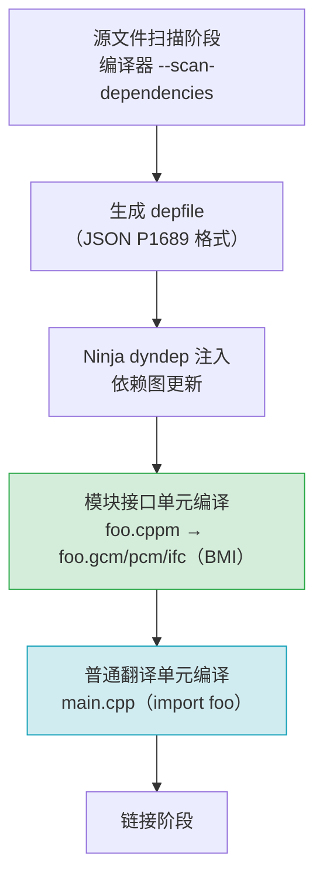

# 第 20 章 · C++20 模块支持

> 基准版本：CMake 4.3.4

> [!abstract] TL;DR
> - C++20 模块在 CMake 3.28 进入稳定支持，通过 `FILE_SET CXX_MODULES` + `target_sources()` 声明模块源文件。
> - CMake 引入"依赖扫描（scan）→ 顺序编译"两阶段流程，BMI（Built Module Interface）不可跨编译器/版本移植。
> - 仅 **Ninja** 与 **Visual Studio**（VS 2022 17.4+）生成器支持模块依赖扫描；Makefiles 不支持。
> - 三大编译器均需较新版本：GCC 14+（`-fmodules-ts`）、Clang 16+、MSVC 19.35+（VS 2022 17.5+）。
> - `import std;` 属实验性特性，CMake 3.30+ 提供有限支持，生产环境须谨慎。
> - 模块可随 `install(TARGETS ... FILE_SET CXX_MODULES)` 一并安装，但消费侧也必须支持同一 BMI 格式。

---

## 概述与定位

C++20 引入的**模块（Modules）**是自 C++98 以来头文件机制最根本的替代品。模块将接口与实现分离成独立的编译单元，消除了宏污染、重复解析头文件的性能损耗，并提供强封装语义。然而，模块对构建系统提出了全新的挑战：传统构建系统假设每个翻译单元的编译彼此独立，而模块要求构建系统在编译前先扫描源文件，确定模块间的依赖顺序，再按拓扑序编译。

CMake 在 3.28（2023 年 12 月）中将 C++ 模块支持标记为**稳定**，结束了 3.25–3.27 之间的实验阶段（需 `set(CMAKE_EXPERIMENTAL_CXX_MODULE_CMAKE_API ...)` 才能开启）。从 3.28 起，模块支持通过标准 CMake 语法即可使用，不再需要任何实验性开关。

CMake 模块支持的核心设计哲学是：**构建系统只需描述"什么是模块源文件"，扫描与排序由生成器（Ninja/VS）负责完成**，CMake 本身不解析 C++ 语法。

---

## 原理与机制

### BMI：Built Module Interface

编译器在编译一个模块接口单元（`.cppm` / `.ixx` / `.mpp`）时，会输出一个**BMI（Built Module Interface）**文件。BMI 是该模块的二进制"预编译接口"，后续所有 `import` 该模块的翻译单元都需要 BMI 先于它们编译完成。BMI 的关键特性：

- **不可移植**：BMI 格式由编译器厂商自定义，GCC（`.gcm`）、Clang（`.pcm`）、MSVC（`.ifc`）三者完全不兼容，且同一编译器不同版本间通常也不兼容。
- **不可随库安装**：虽然 CMake 支持安装 BMI（`CXX_MODULES_BMI` 属性），但消费侧必须使用完全相同的编译器版本与标志，实用性受限。
- **不同于 Header Units**：Header Units（`import <header.h>`）是对传统头文件的模块化包装，仍然依赖头文件存在；而 Named Modules（`export module foo;`）是全新的接口声明单元，二者机制不同。

### 依赖扫描与编译顺序

由于模块之间存在显式的 `import` 依赖，CMake 无法在 configure 阶段确定完整的编译顺序（源文件内容尚未被读取）。为此，CMake 引入了两阶段流程：

```
第一阶段：扫描（scan）
  ├─ 生成器（Ninja/VS）调用编译器前端的"模块扫描"模式
  ├─ 编译器输出描述文件：列出每个源文件 provide/require 哪些模块名
  └─ 生成器读取描述文件，构建完整的依赖图（DAG）

第二阶段：顺序编译（compile）
  ├─ 按拓扑序编译模块接口单元 → 生成 BMI
  └─ 编译 import 该模块的其他翻译单元（此时 BMI 已就绪）
```

Ninja 通过 **Dynamic Dependencies**（`dyndep`）机制实现运行时依赖注入，这是 Ninja 1.11+ 的特性。Visual Studio 生成器则通过 MSBuild 的模块扫描任务实现类似功能。**GNU Makefiles 与 Ninja Multi-Config 之外的生成器均不支持此机制**。

### `CMAKE_CXX_SCAN_FOR_MODULES`

这是控制模块扫描行为的开关，默认值取决于 CMake 能否检测到生成器+编译器组合支持扫描：

- 若组合已知支持（Ninja + Clang 16+/GCC 14+/MSVC 19.35+），默认 `ON`。
- 若组合不支持（如 Makefiles），默认 `OFF`，模块源文件退化为普通 C++ 文件编译（通常会编译失败）。

显式强制关闭扫描（退回传统编译，调试用）：

```cmake
set(CMAKE_CXX_SCAN_FOR_MODULES OFF)
```

---

## 结构/算法/伪代码详解

### FILE_SET 机制

CMake 3.23 引入了 `FILE_SET` 概念，用于对源文件分组管理，并控制安装行为。C++ 模块使用名为 `CXX_MODULES` 的内置 file set 类型：

```cmake
target_sources(<target>
  [PUBLIC | PRIVATE | INTERFACE]
  FILE_SET <set-name>
    TYPE CXX_MODULES
    [BASE_DIRS <dir>...]
    FILES <file>...
)
```

- `FILE_SET` 名称可任意命名（惯例用 `modules`），但 `TYPE CXX_MODULES` 是固定的。
- `PUBLIC` 传播性：若库 A 的模块接口以 `PUBLIC` 暴露，则链接 A 的 B 会自动知晓 A 的 BMI 路径。
- `BASE_DIRS` 用于计算安装后的相对路径，默认为 `CMAKE_CURRENT_SOURCE_DIR`。

### 模块依赖图



### 完整最小工程示例

**目录结构：**

```
mymodule/
├── CMakeLists.txt
├── math.cppm          # 模块接口单元
└── main.cpp           # 消费者
```

**`math.cppm`（模块接口单元）：**

```cpp
export module math;

export int add(int a, int b) {
    return a + b;
}

export double pi() {
    return 3.14159265358979;
}
```

**`main.cpp`（消费者）：**

```cpp
import math;
#include <iostream>

int main() {
    std::cout << "1 + 2 = " << add(1, 2) << "\n";
    std::cout << "pi = " << pi() << "\n";
}
```

**`CMakeLists.txt`：**

```cmake
cmake_minimum_required(VERSION 3.28)
project(MyModuleDemo LANGUAGES CXX)

# 必须指定 C++20 或更高
set(CMAKE_CXX_STANDARD 20)
set(CMAKE_CXX_STANDARD_REQUIRED ON)
set(CMAKE_CXX_EXTENSIONS OFF)

# 1. 创建模块库（静态库）
add_library(mathlib)

# 2. 声明模块接口源文件
target_sources(mathlib
  PUBLIC
    FILE_SET modules
      TYPE CXX_MODULES
      FILES math.cppm
)

# 3. 创建可执行文件并链接
add_executable(demo main.cpp)
target_link_libraries(demo PRIVATE mathlib)
```

**构建命令：**

```bash
# 必须使用 Ninja 生成器
cmake -G Ninja -DCMAKE_CXX_COMPILER=clang++-16 -B build .
cmake --build build
./build/demo
```

### 安装模块库（含 BMI）

```cmake
install(TARGETS mathlib
  EXPORT MathTargets
  ARCHIVE DESTINATION lib
  FILE_SET modules
    DESTINATION include/math/modules   # 安装 .cppm 源文件
  CXX_MODULES_BMI
    DESTINATION lib/math/bmi           # 安装 BMI 文件（谨慎使用）
)

install(EXPORT MathTargets
  FILE MathTargets.cmake
  NAMESPACE Math::
  DESTINATION lib/cmake/math
)
```

> 注意：`CXX_MODULES_BMI` 安装仅在消费侧使用完全相同的编译器版本与标志时才有意义，实际分发库时通常不安装 BMI，仅安装源文件（`.cppm`）并要求用户在自己的构建中重新生成 BMI。

---

## 工具视角与实战

### 编译器版本要求

| 编译器 | 最低版本 | CMake 支持状态 | 备注 |
|--------|----------|----------------|------|
| GCC | 14.1+ | CMake 3.28+ 稳定 | 需 `-fmodules-ts`，内部用 `.gcm` 格式 |
| Clang | 16.0+ | CMake 3.28+ 稳定 | 用 `.pcm` 格式，对标准支持最完整 |
| MSVC | 19.35+（VS 2022 17.5+） | CMake 3.28+ 稳定 | 用 `.ifc` 格式，配合 VS 生成器最成熟 |

### 生成器支持矩阵

| 生成器 | 模块依赖扫描 | 说明 |
|--------|-------------|------|
| Ninja | ✅ 支持 | 需 Ninja 1.11+，通过 dyndep 机制 |
| Ninja Multi-Config | ✅ 支持（CMake 3.28+） | 多配置 Ninja |
| Visual Studio | ✅ 支持（VS 2022 17.4+） | 通过 MSBuild 扫描任务 |
| Unix Makefiles | ❌ 不支持 | 无动态依赖注入机制 |
| Xcode | ❌ 不支持 | — |

### 检测生成器是否支持模块

```cmake
cmake_minimum_required(VERSION 3.28)
project(SafeModuleCheck LANGUAGES CXX)

# 检查生成器是否支持模块扫描
if(NOT CMAKE_GENERATOR MATCHES "Ninja|Visual Studio")
    message(FATAL_ERROR
        "C++20 模块仅在 Ninja 或 Visual Studio 生成器下可用。"
        " 当前生成器：${CMAKE_GENERATOR}"
    )
endif()
```

### `import std;`（标准库模块，实验性）

CMake 3.30 引入了对 `import std;` 的初步支持，需配合专门的 CMake 模块：

```cmake
# CMake 3.30+ 实验性
cmake_minimum_required(VERSION 3.30)
project(ImportStdDemo LANGUAGES CXX)

set(CMAKE_CXX_STANDARD 23)  # import std 需要 C++23
set(CMAKE_CXX_STANDARD_REQUIRED ON)

# 仅 MSVC 在 CMake 3.30 中有完整支持
# Clang 需要额外 libc++ 支持，GCC 支持尚不完整
```

**生产环境建议**：`import std;` 在 2024–2025 年间各编译器实现差异较大，推荐继续使用 `#include <...>` 或仅在 MSVC + VS 2022 环境中尝试。

---

## 安全性与正确使用

### 常见陷阱

**陷阱 1：在不支持的生成器上使用模块**

模块源文件如果不经过扫描，会被当成普通 C++ 文件编译，`export module foo;` 语句会触发编译错误。务必在 `CMakeLists.txt` 顶部验证生成器。

**陷阱 2：忘记 FILE_SET，直接 target_sources 添加 .cppm**

```cmake
# 错误写法：不会触发模块扫描
target_sources(mylib PRIVATE math.cppm)

# 正确写法：必须声明为 CXX_MODULES file set
target_sources(mylib PUBLIC
  FILE_SET modules TYPE CXX_MODULES FILES math.cppm
)
```

**陷阱 3：模块接口与实现分离写法**

模块分区（partition）需要特殊写法，不能简单地把 `.cpp` 实现文件加进 FILE_SET：

```cmake
# 模块接口分区（需在 FILE_SET 中）
target_sources(mylib PUBLIC
  FILE_SET modules TYPE CXX_MODULES
  FILES
    foo.cppm           # export module foo;
    foo-impl.cppm      # export module foo:impl; （分区接口）
)

# 模块实现分区（也需在 FILE_SET 中！）
target_sources(mylib PRIVATE
  FILE_SET impl_units TYPE CXX_MODULES
  FILES
    foo-impl.cpp       # module foo:impl; （分区实现）
)
```

**陷阱 4：混用 Header Units 与 Named Modules**

`import <vector>;`（Header Unit）与 `export module foo;`（Named Module）是两套机制：

- Header Units 需要编译器预编译对应头文件，CMake 目前（4.3）对 Header Units 的支持仍处于实验阶段。
- Named Modules 是 CMake 3.28 稳定支持的主要目标。
- 不要把 `.h` 文件放进 `TYPE CXX_MODULES` 的 FILE_SET——那是 Header Units 的范畴，走另一套流程。

**陷阱 5：BMI 缓存失效**

修改模块接口后，所有 import 该模块的文件都需要重新编译（BMI 变化导致 ABI 破坏）。在大型项目中，模块接口的微小改动可能触发大量重新编译，需要仔细设计模块粒度。

**反模式：过早拆分为超细粒度模块**

每个模块都有一定的扫描与 BMI 编译开销。对于小型工具函数库，拆成几十个单函数模块反而比单头文件更慢。推荐以逻辑子系统（而非单个类/函数）为单位划分模块。

---

## 小结

C++20 模块是 C++ 构建生态的历史性变革，CMake 3.28 提供了稳定的基础支持：

- 使用 `target_sources(... FILE_SET ... TYPE CXX_MODULES FILES ...)` 声明模块源文件，这是触发模块扫描的唯一正确途径。
- 生成器限制是当前最大的实际约束：Ninja（推荐）与 Visual Studio 已稳定可用，Makefiles 完全不支持。
- BMI 的不可移植性决定了跨组织分发已编译模块库在短期内不现实，现阶段最稳健的做法是发布 `.cppm` 源文件，由消费者自行编译。
- 编译器版本要求较新（GCC 14+/Clang 16+/MSVC 19.35+），迁移前务必核查 CI 环境。
- `import std;` 尚处实验阶段，生产项目应推迟采用。

总体而言，C++20 模块在 CMake 生态中已具备"可用"状态，但距离"成熟稳定"还需要各编译器与构建工具链的持续完善。对于新项目，可以在 CI 环境满足要求的前提下积极试用；对于已有大型项目，建议分模块渐进迁移，而非全量替换。

---

## 相关阅读

- [[42.Cmake/04 - Target 与现代 CMake.md|第 4 章 · Target 与现代 CMake]] — 理解 target、属性与传播模型
- [[42.Cmake/14 - 编译器、语言标准与特性.md|第 14 章 · 编译器、语言标准与特性]] — C++ 标准设置与 `target_compile_features`
- [[42.Cmake/15 - 生成器与构建系统.md|第 15 章 · 生成器与构建系统]] — Ninja 生成器与 Ninja Multi-Config 详解
- [[42.Cmake/16 - install 与打包.md|第 16 章 · install 与打包]] — `install(TARGETS ... FILE_SET ...)` 完整用法
- [CMake 官方文档：cmake-cxxmodules(7)](https://cmake.org/cmake/help/latest/manual/cmake-cxxmodules.7.html) — CMake 模块支持官方参考手册
- [P1689R5：C++20 模块依赖扫描格式规范](https://wg21.link/P1689R5) — depfile JSON 格式标准

---

> ⬅️ [[42.Cmake/19 - 跨平台实战与平台差异大全.md|上一章]] ｜ ➡️ [[42.Cmake/21 - cmake-file-api.md|第 21 章]]
>
> [[00 - CMake 完整技术教程 - 总索引|总索引]]
