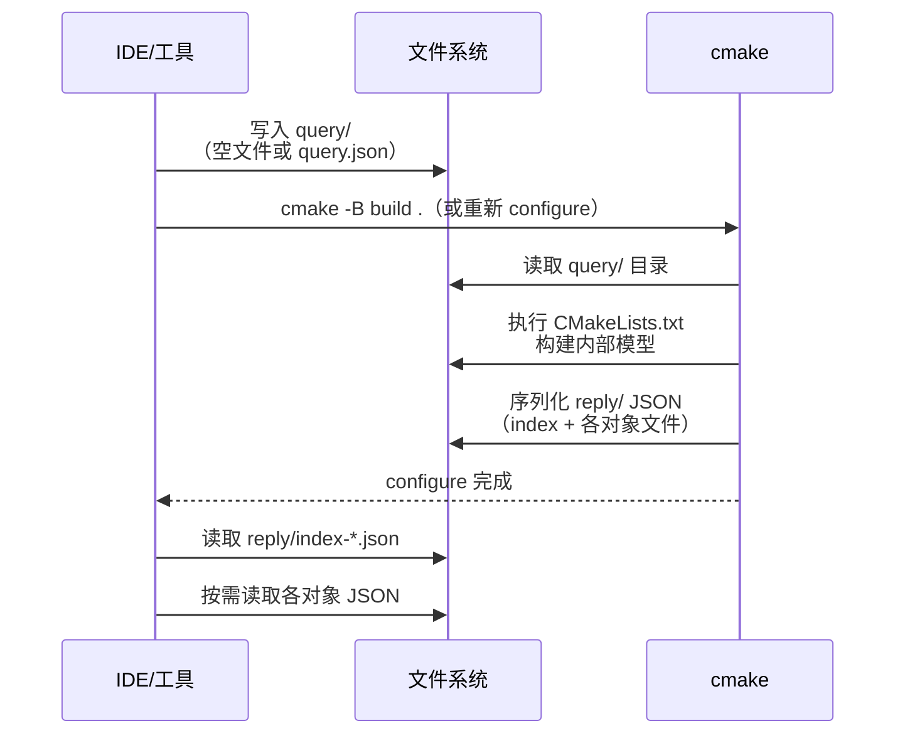

# 第 21 章 · cmake-file-api

> 基准版本：CMake 4.3.4

> [!abstract] TL;DR
> - cmake-file-api 是 CMake 3.14 引入的**机器可读接口**，允许 IDE/工具通过查询 JSON 文件获取完整构建图，取代脆弱的 `--trace` 输出或 `Makefile` 解析。
> - 工作流程：向 `<build>/.cmake/api/v1/query/` 写入 query 文件 → 执行 `cmake -B build` → 从 `reply/` 目录读取 JSON 响应。
> - 三大核心对象：`codemodel`（目标/源文件/编译/链接/依赖图）、`cache`（CMake 缓存变量）、`toolchains`（编译器路径与版本）；另有 `cmakeFiles` 跟踪 CMakeLists.txt 变更。
> - 与 `compile_commands.json` 互补：后者只有编译命令行，前者有完整拓扑结构。
> - CLion、Visual Studio、Qt Creator、vcpkg 等主流工具均依赖此接口。

---

## 概述与定位

在 cmake-file-api 出现之前，IDE 和构建工具要理解一个 CMake 工程的结构，只有几条路：

1. **解析生成的 `Makefile`/`build.ninja`**：格式复杂、不稳定，不同 CMake 版本生成结果差异大。
2. **使用 `cmake --trace`**：输出 CMakeLists.txt 的逐行执行轨迹，信息量极大但几乎无结构，解析难度极高。
3. **使用 `cmake -N -L`**：只能读缓存变量列表，无构建图信息。
4. **读取 `compile_commands.json`**：仅有各翻译单元的编译命令行，没有 target 间的依赖关系、源文件的逻辑分组等结构信息。

cmake-file-api（以下简称 file-api）提供了一个**稳定、版本化、结构化**的 JSON 接口，让工具能够以声明方式请求所需的构建图信息，并在 configure 阶段结束后从固定位置读取。

file-api 的设计遵循两个原则：
- **异步查询**：工具在 cmake 运行之前写入 query，cmake 在 configure 时响应，两者不需要实时通信。
- **稳定版本**：每个对象都有版本号（如 `codemodel-v2`），确保工具不会因 CMake 升级而无声地获得错误数据。

---

## 原理与机制

### 目录结构

file-api 的所有交互都通过构建目录下的 `.cmake/api/v1/` 子目录进行：

```
<build>/.cmake/api/v1/
├── query/                  # 工具写入这里（query 文件）
│   ├── client-<name>/      # 有状态 client query 目录
│   │   └── query.json
│   └── codemodel-v2        # 无状态 shared query（空文件）
└── reply/                  # CMake configure 后写入这里（response 文件）
    ├── index-<hash>.json   # 入口文件，列出所有响应
    ├── codemodel-v2-<hash>.json
    ├── target-<name>-<hash>.json
    ├── cache-v2-<hash>.json
    └── toolchains-v1-<hash>.json
```

### Query 机制：两种模式

**Shared Stateless Query（共享无状态查询）**

在 `query/` 目录下创建一个空文件，文件名即为所请求的对象类型：

```bash
# 请求 codemodel-v2 响应
touch <build>/.cmake/api/v1/query/codemodel-v2
touch <build>/.cmake/api/v1/query/cache-v2
touch <build>/.cmake/api/v1/query/toolchains-v1
```

这种方式简单，适合只需要读取信息的工具（如静态分析工具）。多个工具可以共存，查询文件互不干扰。

**Client Stateful Query（有状态客户端查询）**

在 `query/client-<name>/` 目录下创建 `query.json`，可以携带版本需求与附加参数：

```json
{
  "requests": [
    { "kind": "codemodel", "version": 2 },
    { "kind": "cache", "version": 2 },
    { "kind": "toolchains", "version": 1 },
    { "kind": "cmakeFiles", "version": 1 }
  ]
}
```

有状态查询的优点是可以指定版本范围（`{ "kind": "codemodel", "version": { "major": 2, "minor": 1 } }`），并且 CMake 会将客户端的 `query.json` 拷贝到 `reply/` 目录，便于工具核实响应来自正确的查询版本。

### configure → reply 时序



关键约束：**工具必须在 cmake 运行之前写入 query**，cmake 在 configure 阶段一次性生成所有 reply，之后不再修改。若工程变动需要重新获取，必须再次运行 cmake configure。

---

## 结构/算法/伪代码详解

### index 文件结构

`reply/index-<hash>.json` 是所有响应的入口：

```json
{
  "cmake": { "version": { "string": "4.3.4", ... } },
  "objects": [
    {
      "kind": "codemodel",
      "version": { "major": 2, "minor": 7 },
      "jsonFile": "codemodel-v2-a1b2c3.json"
    },
    {
      "kind": "cache",
      "version": { "major": 2, "minor": 0 },
      "jsonFile": "cache-v2-d4e5f6.json"
    }
  ],
  "reply": {
    "stateless": {
      "codemodel-v2": { "kind": "codemodel", "version": 2, "jsonFile": "..." }
    }
  }
}
```

工具读取流程：index → `objects` 数组 → 找到对应 `kind` → 读取 `jsonFile`。

### codemodel-v2：核心对象

codemodel-v2 包含整个构建图的顶层视图：

```json
{
  "kind": "codemodel",
  "paths": {
    "source": "/path/to/source",
    "build": "/path/to/build",
    "cmake": "/usr/share/cmake"
  },
  "configurations": [
    {
      "name": "Debug",
      "directories": [ ... ],
      "projects": [
        {
          "name": "MyApp",
          "targetIndexes": [0, 1, 2]
        }
      ],
      "targets": [
        {
          "name": "mylib",
          "id": "mylib::@abc123",
          "directoryIndex": 0,
          "projectIndex": 0,
          "jsonFile": "target-mylib-abc123.json"
        },
        {
          "name": "demo",
          "id": "demo::@def456",
          "jsonFile": "target-demo-def456.json"
        }
      ]
    }
  ]
}
```

### target JSON：单个目标的完整信息

每个 target 有独立的 JSON 文件，包含源文件、编译组（compile groups）、链接信息和依赖：

```json
{
  "name": "demo",
  "type": "EXECUTABLE",
  "sources": [
    {
      "path": "main.cpp",
      "isGenerated": false,
      "compileGroupIndex": 0,
      "sourceGroupIndex": 0
    }
  ],
  "compileGroups": [
    {
      "sourceIndexes": [0],
      "language": "CXX",
      "compileCommandFragments": [
        { "fragment": "-std=c++20" },
        { "fragment": "-O2" }
      ],
      "includes": [
        { "path": "/usr/include/c++/14", "isSystem": true }
      ],
      "defines": [
        { "define": "NDEBUG" }
      ]
    }
  ],
  "link": {
    "language": "CXX",
    "commandFragments": [
      { "fragment": "-lmylib", "role": "libraries" }
    ]
  },
  "dependencies": [
    { "id": "mylib::@abc123", "backtrace": 5 }
  ]
}
```

### cache-v2：缓存变量

```json
{
  "kind": "cache",
  "entries": [
    {
      "name": "CMAKE_BUILD_TYPE",
      "value": "Debug",
      "type": "STRING",
      "properties": [
        { "name": "HELPSTRING", "value": "Build type" }
      ]
    },
    {
      "name": "CMAKE_INSTALL_PREFIX",
      "value": "/usr/local",
      "type": "PATH"
    }
  ]
}
```

### toolchains-v1：编译器信息

```json
{
  "kind": "toolchains",
  "toolchains": [
    {
      "language": "CXX",
      "compiler": {
        "id": "Clang",
        "version": "16.0.6",
        "path": "/usr/bin/clang++",
        "implicit": {
          "includeDirectories": ["/usr/lib/clang/16/include"],
          "linkDirectories": ["/usr/lib"],
          "linkLibraries": ["stdc++", "m"]
        }
      },
      "sourceFileExtensions": ["cpp", "cxx", "cc"]
    }
  ]
}
```

### cmakeFiles-v1：跟踪 CMakeLists.txt

工具可用此对象判断何时需要重新 configure：

```json
{
  "kind": "cmakeFiles",
  "paths": {
    "source": "/path/to/source",
    "build": "/path/to/build"
  },
  "inputs": [
    {
      "path": "CMakeLists.txt",
      "isModificationSafe": false,
      "isCMake": false
    },
    {
      "path": "/usr/share/cmake/Modules/GNUInstallDirs.cmake",
      "isModificationSafe": true,
      "isCMake": true
    }
  ]
}
```

`isModificationSafe: true` 表示该文件是 CMake 安装目录中的官方文件，修改后通常不需要重新 configure。

---

## 工具视角与实战

### 与 compile_commands.json 的区别与互补

| 特性 | `compile_commands.json` | cmake-file-api |
|------|------------------------|---------------|
| 生成条件 | `CMAKE_EXPORT_COMPILE_COMMANDS=ON`，仅 Makefile/Ninja | 任何生成器，任何 CMake 3.14+ |
| 内容 | 每个翻译单元的完整编译命令行 | 完整构建图：target 树、源文件分组、链接依赖、缓存、工具链 |
| 主要用途 | clangd 语义补全、clang-tidy 静态分析 | IDE 工程视图、依赖关系导航、构建图可视化 |
| 格式稳定性 | 非官方但事实标准 | 官方版本化 JSON Schema |
| 实时性 | configure 阶段生成 | configure 阶段生成 |

两者互补而非替代：clangd 需要 `compile_commands.json` 获得精确的编译标志，CLion 同时使用 file-api 获取工程结构和 `compile_commands.json` 做代码分析。

### 谁在使用 file-api

- **CLion**（JetBrains）：通过 file-api 获取工程目录树、target 列表、源文件与 target 的映射。
- **Visual Studio**（CMake 工程支持，VS 2019+）：使用 file-api 替代早期的 CMake Server 协议（该协议已在 CMake 3.20 废弃）。
- **Qt Creator**（Qt 5.14+）：通过 file-api 解析工程结构，支持 CMake 工程的完整 IDE 功能。
- **vcpkg**：manifest mode 下通过 file-api 读取缓存变量，确定 triplet 与依赖解析。
- **cmake-tools**（VS Code 插件）：通过 file-api 提供工程浏览器与 IntelliSense 配置。

### 示例：Python 脚本读取 codemodel，定位某 target 的源文件

以下示例演示如何用 Python 通过 file-api 查询一个 CMake 构建目录，找到指定 target 的所有源文件路径：

```python
#!/usr/bin/env python3
"""
file_api_query.py  ——  通过 cmake-file-api 读取 target 源文件列表

用法：
  1. 先写入 query（只需一次）：
       python file_api_query.py --prep <build_dir>
  2. 运行 cmake configure：
       cmake -B <build_dir> <source_dir>
  3. 读取结果：
       python file_api_query.py --target demo <build_dir>
"""

import sys
import json
import pathlib
import argparse


def prepare_query(build_dir: pathlib.Path) -> None:
    """在 build 目录写入 query 文件（必须在 cmake 运行前执行）"""
    query_dir = build_dir / ".cmake" / "api" / "v1" / "query"
    query_dir.mkdir(parents=True, exist_ok=True)
    # 写入 shared stateless query
    (query_dir / "codemodel-v2").touch()
    print(f"Query 文件已写入：{query_dir / 'codemodel-v2'}")
    print("现在请运行：cmake -B <build_dir> <source_dir>")


def read_reply(build_dir: pathlib.Path, target_name: str) -> None:
    """读取 configure 后生成的 reply，列出目标的源文件"""
    reply_dir = build_dir / ".cmake" / "api" / "v1" / "reply"

    if not reply_dir.exists():
        print("错误：reply 目录不存在，请先运行 cmake configure", file=sys.stderr)
        sys.exit(1)

    # 找到最新的 index 文件
    index_files = sorted(reply_dir.glob("index-*.json"))
    if not index_files:
        print("错误：找不到 index 文件", file=sys.stderr)
        sys.exit(1)
    index_path = index_files[-1]

    # 读取 index
    index = json.loads(index_path.read_text(encoding="utf-8"))

    # 找到 codemodel 响应文件
    codemodel_file = None
    for obj in index.get("objects", []):
        if obj["kind"] == "codemodel":
            codemodel_file = reply_dir / obj["jsonFile"]
            break

    if not codemodel_file:
        print("错误：index 中未找到 codemodel 对象", file=sys.stderr)
        sys.exit(1)

    codemodel = json.loads(codemodel_file.read_text(encoding="utf-8"))
    source_root = pathlib.Path(codemodel["paths"]["source"])

    # 遍历所有 configuration（通常只有一个，Ninja Multi-Config 有多个）
    found = False
    for config in codemodel.get("configurations", []):
        for tgt in config.get("targets", []):
            if tgt["name"] != target_name:
                continue
            found = True
            print(f"\nTarget: {tgt['name']}  (配置: {config['name']})")

            # 读取 target 详情文件
            tgt_detail = json.loads(
                (reply_dir / tgt["jsonFile"]).read_text(encoding="utf-8")
            )
            sources = tgt_detail.get("sources", [])
            print(f"源文件列表（共 {len(sources)} 个）：")
            for src in sources:
                src_path = pathlib.Path(src["path"])
                if not src_path.is_absolute():
                    src_path = source_root / src_path
                lang = ""
                if "compileGroupIndex" in src:
                    groups = tgt_detail.get("compileGroups", [])
                    gi = src["compileGroupIndex"]
                    if gi < len(groups):
                        lang = f"  [{groups[gi]['language']}]"
                print(f"  {src_path}{lang}")

    if not found:
        print(f"未找到 target：{target_name}")
        available = [t["name"] for c in codemodel.get("configurations", [])
                     for t in c.get("targets", [])]
        print(f"可用 targets：{available}")


def main():
    parser = argparse.ArgumentParser()
    parser.add_argument("build_dir", type=pathlib.Path)
    parser.add_argument("--prep", action="store_true", help="写入 query 文件")
    parser.add_argument("--target", default="", help="要查询的 target 名称")
    args = parser.parse_args()

    if args.prep:
        prepare_query(args.build_dir)
    elif args.target:
        read_reply(args.build_dir, args.target)
    else:
        parser.print_help()


if __name__ == "__main__":
    main()
```

**使用流程：**

```bash
# 第 1 步：写入 query（cmake 运行前）
python file_api_query.py --prep ./build

# 第 2 步：运行 cmake configure
cmake -G Ninja -B ./build .

# 第 3 步：查询指定 target 的源文件
python file_api_query.py --target demo ./build
```

---

## 安全性与正确使用

### 常见陷阱

**陷阱 1：在 cmake configure 之后才写入 query**

query 必须在 cmake configure **之前**写入。若在 configure 之后写入，必须重新运行 cmake 才能生成对应的 reply。IDE 通常在首次打开工程时写入 query，随后触发 configure；若手动试验，容易搞反顺序。

**陷阱 2：读取过期的 reply**

reply 文件名中含有 hash，hash 基于 configure 时的 CMakeLists.txt 内容生成。CMakeLists.txt 修改后重新 configure，会生成**新 hash 的文件**，旧文件**不会被删除**（CMake 不清理旧 reply）。工具必须每次从最新的 `index-*.json` 开始读，而不是缓存旧的 jsonFile 路径。

推荐做法：按文件修改时间排序 `index-*.json`，取最新的一个。

**陷阱 3：依赖具体字段而非 kind+version**

file-api 的每个对象都是版本化的（如 `codemodel-v2`），次版本（minor）可能在 CMake patch 版本中增加新字段。工具应基于 `kind` 和 `version.major` 选择解析策略，对未知字段采取宽容（忽略）而非报错的策略。

**陷阱 4：混淆 source 相对路径与绝对路径**

target JSON 中的 `sources[].path` 可能是相对路径（相对于 `codemodel.paths.source`）或绝对路径，取决于源文件是否在 source root 下。工具必须检查路径是否绝对，若不是则与 source root 拼接。

**陷阱 5：遗漏 multi-config 场景**

Ninja Multi-Config 与 Visual Studio 生成器会在 `codemodel.configurations` 数组中返回多个 configuration（Debug/Release/...）。工具若只取第一个元素，在 multi-config 场景下会漏掉其他配置的 target 信息。

**反模式：把 file-api 当成实时接口**

file-api 是**配置阶段快照**，不是运行时查询接口。不要在每次用户操作时都重新触发 cmake configure 以刷新数据——configure 本身有成本（检测编译器、执行 find_package 等）。正确做法是监控 `cmakeFiles` 对象列出的输入文件变更，仅在必要时触发重新 configure。

---

## 小结

cmake-file-api 是 CMake 生态中 IDE/工具集成的基石：

- **query/reply 目录协议**将工具与 CMake 进程解耦，工具只需在 configure 前写入 query 文件，configure 后读取固定路径的 JSON 响应，无需 IPC 或实时通信。
- **四大核心对象**覆盖了 IDE 所需的几乎全部信息：`codemodel-v2`（构建图拓扑）、`cache-v2`（配置变量）、`toolchains-v1`（编译器路径与标志）、`cmakeFiles-v1`（输入文件监控）。
- **版本化设计**确保 CMake 升级不会无声地破坏现有工具——每个对象都有独立的 major/minor 版本，工具可声明所需版本并获得兼容性保证。
- 与 `compile_commands.json` 互补：file-api 提供工程结构与拓扑，`compile_commands.json` 提供精确的编译命令行，clangd 与 IDE 通常同时使用两者。
- 实现自定义 CMake 工具集成时，理解 file-api 是绕不开的基础知识；对于日常 CMake 用户，了解 file-api 有助于理解 IDE 如何"认识"你的 CMake 工程，从而更好地调试 IDE 集成问题。

---

## 相关阅读

- [[42.Cmake/14 - 编译器、语言标准与特性.md|第 14 章 · 编译器、语言标准与特性]] — `compile_commands.json` 的生成与使用（`CMAKE_EXPORT_COMPILE_COMMANDS`）
- [[42.Cmake/15 - 生成器与构建系统.md|第 15 章 · 生成器与构建系统]] — 各生成器特性对比，理解 Ninja/VS 的优势
- [[42.Cmake/20 - C++20 模块支持.md|第 20 章 · C++20 模块支持]] — 模块依赖扫描机制，与 file-api 的交互关系
- [CMake 官方文档：cmake-file-api(7)](https://cmake.org/cmake/help/latest/manual/cmake-file-api.7.html) — 完整的 JSON schema 定义与字段说明
- [CMake 官方文档：cmake-server(7)（已废弃）](https://cmake.org/cmake/help/latest/manual/cmake-server.7.html) — 了解 file-api 的前身，理解设计演进

---

> ⬅️ [[42.Cmake/20 - C++20 模块支持.md|上一章]] ｜ ➡️ [[42.Cmake/22 - 代码生成 target.md|第 22 章]]
>
> [[00 - CMake 完整技术教程 - 总索引|总索引]]
