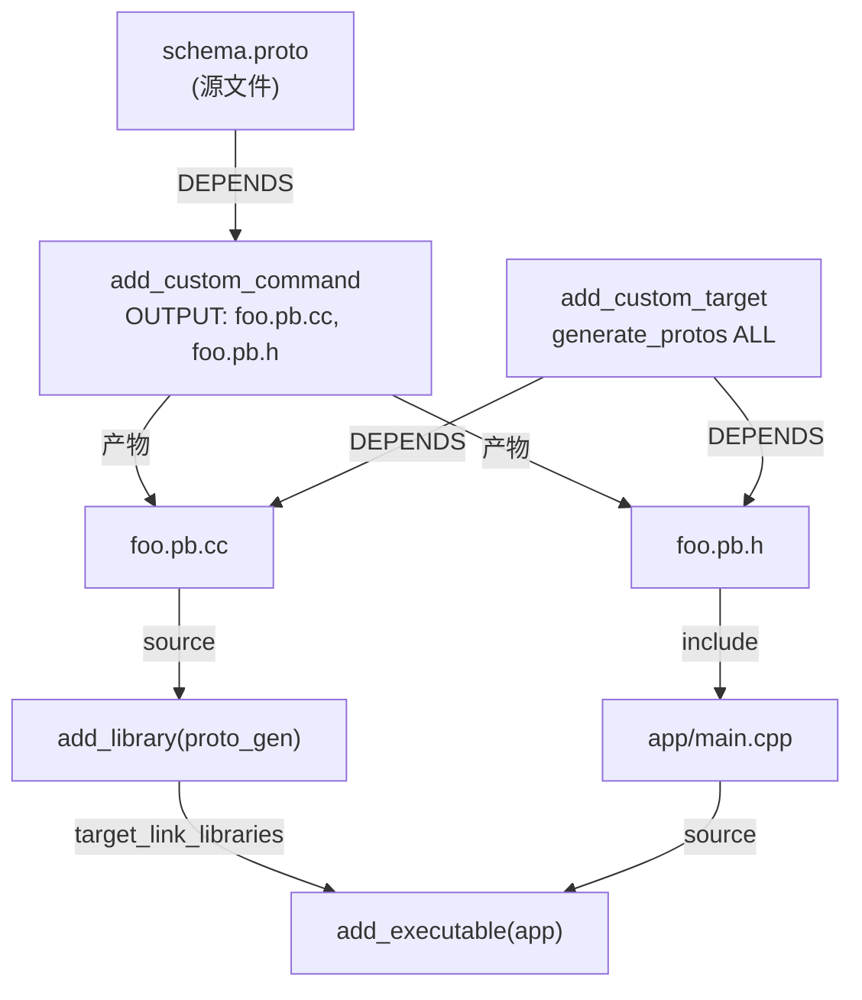

# 第 22 章 · 代码生成 target

> [!abstract] TL;DR
> `add_custom_command(OUTPUT ...)` 是**依赖驱动型**生成：只在产物被某个 target 消费时才执行，是构建图中的一个"隐式"节点；`add_custom_command(TARGET ... PRE_BUILD|PRE_LINK|POST_BUILD)` 是**钩子型**：绑定到已有 target 的构建事件，每次该 target 重建都运行。`add_custom_target` 是"总是执行/聚合"节点，用来驱动或归集不产生文件的副作用。三者配合 `DEPENDS`/`BYPRODUCTS`/`DEPFILE`/`VERBATIM` 等关键词，才能在多核并行 (`-j`) 与增量构建中正确追踪依赖，避免竞争和漏更新。

---

## 概述与定位

几乎所有稍具规模的 C++ 项目都会在编译期**生成代码**：Protocol Buffers 的 `protoc` 从 `.proto` 生成 `.pb.cc/.pb.h`，Qt 的 `moc` 从带 `Q_OBJECT` 宏的头文件生成元对象代码，FlatBuffers 的 `flatc` 生成访问器，还有词法/语法分析器生成器（flex/bison）、着色器编译、嵌入式资源打包……这类需求的共同点是：**在编译 C++ 源码之前，先用一个外部工具把某个输入文件变换成新的源码或头文件**，再把生成物交给后续编译器处理。

CMake 提供了三种原语来描述这类工作：

| 原语 | 触发时机 | 核心用途 |
|---|---|---|
| `add_custom_command(OUTPUT ...)` | 产物被某 target 的构建依赖时 | 生成文件（依赖驱动） |
| `add_custom_command(TARGET ... PRE_BUILD\|PRE_LINK\|POST_BUILD)` | 指定 target 构建的特定阶段 | 钩子副作用 |
| `add_custom_target(name ...)` | 每次被请求时（总是执行）| 聚合/触发/无产物操作 |

理解这三者的本质区别是写出正确、高效代码生成逻辑的第一步。

---

## 原理与机制

### add_custom_command(OUTPUT ...) — 依赖驱动生成

`add_custom_command(OUTPUT ...)` 的语义是：**"如果这些输出文件不存在，或者比它们的输入更旧，则运行这些命令。"** 但它本身**不是一个 target**，构建系统不会主动去检查它，只有当某个 target（`add_executable`、`add_library`、`add_custom_target`）的源文件列表或 `DEPENDS` 列表里引用了它的 OUTPUT 文件时，构建系统才会把这条命令插入依赖图。

```cmake
add_custom_command(
  OUTPUT  "${CMAKE_CURRENT_BINARY_DIR}/generated.cpp"
  COMMAND python3 ${CMAKE_CURRENT_SOURCE_DIR}/gen.py
          -o "${CMAKE_CURRENT_BINARY_DIR}/generated.cpp"
          "${CMAKE_CURRENT_SOURCE_DIR}/schema.json"
  DEPENDS "${CMAKE_CURRENT_SOURCE_DIR}/schema.json"
          "${CMAKE_CURRENT_SOURCE_DIR}/gen.py"
  VERBATIM
)

add_executable(myapp
  main.cpp
  "${CMAKE_CURRENT_BINARY_DIR}/generated.cpp"   # 此处引用触发上面的命令
)
```

这里 `generated.cpp` 出现在 `add_executable` 的源文件列表里——CMake 识别到它是一个生成文件（因为路径在构建目录），便自动建立依赖边：先运行 `add_custom_command`，再编译 `myapp`。

**`DEPENDS` 的精确含义**：列出影响输出的所有输入。只要有一个 `DEPENDS` 文件比 OUTPUT 更新，构建系统就会重新运行命令。若漏声明某个输入（比如 `gen.py` 自身），改了它但没触发重新生成，就会出现"增量构建不一致"的经典 bug。

**`VERBATIM` 的必要性**：加上 `VERBATIM` 后，CMake 会对命令参数做正确的平台原生转义（Windows 上用 `CreateProcess`，Unix 上绕过 shell）。若不加，空格、特殊字符、路径中的括号都可能导致命令解析错误。**始终加 `VERBATIM`。**

### add_custom_command(TARGET ... PRE_BUILD|PRE_LINK|POST_BUILD) — 钩子型

钩子型的语义是：**"在指定 target 构建流程的某个阶段附加一个副作用。"** 它附着在一个已经存在的 target 上，每次该 target 触发构建都会运行，与依赖是否过期无关。

```cmake
add_executable(myapp main.cpp)

# 构建完成后复制可执行文件到 deploy 目录
add_custom_command(TARGET myapp POST_BUILD
  COMMAND ${CMAKE_COMMAND} -E copy_if_different
          "$<TARGET_FILE:myapp>"
          "${CMAKE_SOURCE_DIR}/deploy/"
  VERBATIM
)
```

三个阶段的差异：
- **PRE_BUILD**：在目标的所有源文件编译**之前**，但在 Visual Studio 生成器里它只在 Visual Studio 中有效，Makefile/Ninja 生成器实际上等同于 PRE_LINK。
- **PRE_LINK**：所有源文件已编译，链接**之前**。
- **POST_BUILD**：链接（或归档）完成**之后**。

### add_custom_target — 总是执行/聚合

`add_custom_target` 创建一个**没有输出文件**的虚拟 target，每次被构建系统请求时都执行（`make <target_name>` 或 `cmake --build . --target <name>`）。它的典型用途：

1. **触发器**：聚合多个 `add_custom_command(OUTPUT ...)` 让它们在一个命令里全部生成。
2. **代码风格/代码生成驱动**：`make format`、`make codegen` 之类的辅助目标。
3. **ALL 目标钩子**：加 `ALL` 参数使其成为默认构建的一部分。

```cmake
# 聚合所有 proto 生成产物
add_custom_target(generate_protos ALL
  DEPENDS
    "${CMAKE_CURRENT_BINARY_DIR}/foo.pb.cc"
    "${CMAKE_CURRENT_BINARY_DIR}/bar.pb.cc"
)
```

### BYPRODUCTS — 声明副产物

`BYPRODUCTS` 用于声明命令会额外产生但不是"主要输出"的文件。最常见场景：`add_custom_target` 本身不产出文件，但它触发的命令会生成一些文件供后续 target 使用：

```cmake
add_custom_target(run_codegen ALL
  COMMAND python3 gen.py -o ${OUTDIR}
  BYPRODUCTS
    "${OUTDIR}/generated.cpp"
    "${OUTDIR}/generated.h"
  VERBATIM
)
```

Ninja 需要 `BYPRODUCTS` 才能正确处理并行构建中的文件竞争（它会把 BYPRODUCTS 作为 order-only 依赖插入依赖图）；若不声明，`-j` 并行时其他 target 可能在文件生成完毕前就开始读取，导致构建失败。

### DEPFILE — 编译器生成的精细依赖

`DEPFILE` 接受一个 `.d` 格式（Make 依赖文件格式）的路径，让构建系统动态读取更细粒度的依赖。常见于需要跟踪 `#include` 的场景（如自定义预处理）：

```cmake
add_custom_command(
  OUTPUT  "${OUTDIR}/processed.cpp"
  COMMAND preprocess -MF "${OUTDIR}/processed.d"
          -o "${OUTDIR}/processed.cpp"
          "${SRC}/template.cpp.in"
  DEPFILE "${OUTDIR}/processed.d"
  VERBATIM
)
```

`DEPFILE` 在 CMake 3.7+ Ninja 生成器、3.20+ Makefile 生成器下有效，Visual Studio 生成器暂不支持。

### WORKING_DIRECTORY — 命令执行目录

默认情况下命令在 `CMAKE_CURRENT_BINARY_DIR` 下执行。若工具要求在特定目录运行（如相对路径读取配置文件），用 `WORKING_DIRECTORY` 显式指定：

```cmake
add_custom_command(
  OUTPUT  "${OUTDIR}/out.cc"
  COMMAND protoc --cpp_out="${OUTDIR}" foo.proto
  WORKING_DIRECTORY "${CMAKE_CURRENT_SOURCE_DIR}/proto"
  DEPENDS "${CMAKE_CURRENT_SOURCE_DIR}/proto/foo.proto"
  VERBATIM
)
```

### COMMAND_EXPAND_LISTS — 展开列表参数

CMake 变量可能持有分号分隔的列表，传给 `COMMAND` 时默认作为单个参数（整体带引号或带分号）传递，并非展开成多个参数。加上 `COMMAND_EXPAND_LISTS`（CMake 3.8+）后，列表变量会被正确展开为多个独立参数：

```cmake
set(PROTO_FILES foo.proto bar.proto baz.proto)

add_custom_command(
  OUTPUT "${OUTDIR}/foo.pb.cc" "${OUTDIR}/bar.pb.cc" "${OUTDIR}/baz.pb.cc"
  COMMAND protoc --cpp_out="${OUTDIR}" ${PROTO_FILES}
  DEPENDS ${PROTO_FILES}
  WORKING_DIRECTORY "${CMAKE_CURRENT_SOURCE_DIR}/proto"
  VERBATIM
  COMMAND_EXPAND_LISTS
)
```

---

## 结构/算法/伪代码详解

### 代码生成 target 的依赖图



图中展示了单向数据流：源文件通过 `add_custom_command` 变换为生成文件，生成文件作为源码加入 library target，library 被主 executable 链接。`add_custom_target` 是可选的聚合节点，让所有生成产物也能被顶层构建驱动到。

### 生成文件加入 target_sources 的正确方式

生成文件需要加入某个 target 的源文件列表才能被编译，有两种等效写法：

```cmake
# 写法 1：直接列在 add_executable / add_library 的参数里
add_library(proto_gen
  "${CMAKE_CURRENT_BINARY_DIR}/foo.pb.cc"
  "${CMAKE_CURRENT_BINARY_DIR}/bar.pb.cc"
)

# 写法 2：用 target_sources（适合条件性添加）
add_library(proto_gen)
target_sources(proto_gen PRIVATE
  "${CMAKE_CURRENT_BINARY_DIR}/foo.pb.cc"
  "${CMAKE_CURRENT_BINARY_DIR}/bar.pb.cc"
)
```

CMake 识别 `${CMAKE_CURRENT_BINARY_DIR}` 下的文件为生成文件（或任何构建目录路径），会自动设置 `GENERATED` 属性为 `TRUE`，从而不要求这些文件在配置阶段已存在。

**显式设置 GENERATED 属性**：如果生成文件路径不在标准构建目录下，或者在别的目录里引用它，需要手动设置：

```cmake
set_source_files_properties(
  "${OUTDIR}/generated.cpp"
  PROPERTIES GENERATED TRUE
)
```

---

## 工具视角与实战

### 完整 Recipe 1：protobuf（protoc 生成 .pb.cc/.pb.h）

```cmake
cmake_minimum_required(VERSION 3.20)
project(proto_example LANGUAGES CXX)

find_package(Protobuf REQUIRED)

set(PROTO_DIR "${CMAKE_CURRENT_SOURCE_DIR}/proto")
set(PROTO_OUT "${CMAKE_CURRENT_BINARY_DIR}/proto_gen")
file(MAKE_DIRECTORY "${PROTO_OUT}")

set(PROTO_FILES
  "${PROTO_DIR}/user.proto"
  "${PROTO_DIR}/order.proto"
)

# 每个 .proto 对应一组生成产物
foreach(PROTO_FILE IN LISTS PROTO_FILES)
  get_filename_component(PROTO_STEM "${PROTO_FILE}" NAME_WE)
  set(PB_CC "${PROTO_OUT}/${PROTO_STEM}.pb.cc")
  set(PB_H  "${PROTO_OUT}/${PROTO_STEM}.pb.h")

  add_custom_command(
    OUTPUT  "${PB_CC}" "${PB_H}"
    COMMAND "${Protobuf_PROTOC_EXECUTABLE}"
            "--proto_path=${PROTO_DIR}"
            "--cpp_out=${PROTO_OUT}"
            "${PROTO_FILE}"
    DEPENDS "${PROTO_FILE}"
    COMMENT "Running protoc on ${PROTO_STEM}.proto"
    VERBATIM
  )

  list(APPEND PB_SRCS "${PB_CC}")
  list(APPEND PB_HDRS "${PB_H}")
endforeach()

add_library(proto_gen STATIC ${PB_SRCS} ${PB_HDRS})
target_include_directories(proto_gen PUBLIC "${PROTO_OUT}")
target_link_libraries(proto_gen PUBLIC protobuf::libprotobuf)

add_executable(myapp main.cpp)
target_link_libraries(myapp PRIVATE proto_gen)
```

**要点**：
- 用 `find_package(Protobuf REQUIRED)` 获取 `Protobuf_PROTOC_EXECUTABLE` 路径，而非硬编码。
- 每个 `.proto` 单独一条 `add_custom_command`，OUTPUT 精确对应，并行构建时 Ninja 可以独立调度每条命令。
- 生成头文件所在的目录通过 `target_include_directories(proto_gen PUBLIC ...)` 传播出去，下游 target 只需 `target_link_libraries(... proto_gen)` 即可隐式获得包含路径。

### 完整 Recipe 2：Qt moc 手动驱动

现代 CMake + Qt6 通常用 `set(CMAKE_AUTOMOC ON)` 自动处理 moc，但理解手动写法有助于调试和非标准场景：

```cmake
find_package(Qt6 REQUIRED COMPONENTS Core)

set(MOC_HEADER "${CMAKE_CURRENT_SOURCE_DIR}/MyClass.h")
set(MOC_OUT    "${CMAKE_CURRENT_BINARY_DIR}/moc_MyClass.cpp")

add_custom_command(
  OUTPUT  "${MOC_OUT}"
  COMMAND Qt6::moc
          -o "${MOC_OUT}"
          "${MOC_HEADER}"
  DEPENDS "${MOC_HEADER}"
  COMMENT "Running moc on MyClass.h"
  VERBATIM
)

add_library(mylib MyClass.cpp "${MOC_OUT}")
target_link_libraries(mylib PUBLIC Qt6::Core)
```

**注意**：`Qt6::moc` 是一个 IMPORTED EXECUTABLE target，可以直接用作 `COMMAND`，CMake 会自动解析为可执行文件路径。

### 完整 Recipe 3：FlatBuffers

```cmake
find_program(FLATC_EXECUTABLE flatc REQUIRED)

set(FBS_DIR "${CMAKE_CURRENT_SOURCE_DIR}/schema")
set(FBS_OUT "${CMAKE_CURRENT_BINARY_DIR}/fb_gen")
file(MAKE_DIRECTORY "${FBS_OUT}")

set(FBS_FILES
  "${FBS_DIR}/monster.fbs"
  "${FBS_DIR}/weapon.fbs"
)

set(FB_HEADERS "")
foreach(FBS_FILE IN LISTS FBS_FILES)
  get_filename_component(FBS_STEM "${FBS_FILE}" NAME_WE)
  set(FB_H "${FBS_OUT}/${FBS_STEM}_generated.h")

  add_custom_command(
    OUTPUT  "${FB_H}"
    COMMAND "${FLATC_EXECUTABLE}"
            --cpp
            -o "${FBS_OUT}"
            "${FBS_FILE}"
    DEPENDS "${FBS_FILE}"
    COMMENT "Running flatc on ${FBS_STEM}.fbs"
    VERBATIM
  )
  list(APPEND FB_HEADERS "${FB_H}")
endforeach()

# FlatBuffers 是纯头文件使用方式，用 INTERFACE library 传播路径
add_library(fb_gen INTERFACE)
target_sources(fb_gen INTERFACE ${FB_HEADERS})
target_include_directories(fb_gen INTERFACE "${FBS_OUT}")

add_executable(game main.cpp)
target_link_libraries(game PRIVATE fb_gen)
```

FlatBuffers 生成的是纯头文件，因此用 `INTERFACE` library 来传播包含路径和生成文件依赖，不需要编译成静态库。

---

## 安全性与正确使用

### 陷阱 1：生成文件时间戳与 GENERATED 属性

若生成文件出现在源码目录（不是构建目录），CMake 配置时会发现该文件"已存在"，可能错误地认为不需要重新生成。解决方案：

1. **始终将生成产物输出到 `CMAKE_CURRENT_BINARY_DIR` 或其子目录**，避免混入源树。
2. 若必须输出到其他路径，用 `set_source_files_properties(... PROPERTIES GENERATED TRUE)` 强制标记。

### 陷阱 2：漏声明 DEPENDS 导致增量构建失效

```cmake
# 错误示例：只依赖了 .proto，漏掉了 protoc 自身
add_custom_command(
  OUTPUT "${PB_CC}"
  COMMAND "${Protobuf_PROTOC_EXECUTABLE}" --cpp_out=... foo.proto
  DEPENDS foo.proto     # 漏掉了对 protoc 路径的依赖
  VERBATIM
)
```

若 protoc 升级了但 `foo.proto` 没有改动，`PB_CC` 不会重新生成，产物仍是旧版 protoc 的输出——这在版本切换时会引入难以察觉的不一致。正确做法是把工具本身也加入 `DEPENDS`：

```cmake
DEPENDS foo.proto "${Protobuf_PROTOC_EXECUTABLE}"
```

但要注意：若 protoc 是 CMake 本次构建的产物（IMPORTED EXECUTABLE），应通过 `add_dependencies` 建立构建顺序依赖，而非把它加入 DEPENDS 列表（DEPENDS 期望的是文件路径，不是 target 名称——除非 CMake 3.16+ 的 target DEPENDS 语义）。

### 陷阱 3：跨目录引用生成文件

在 A 目录的 CMakeLists.txt 里声明了 `add_custom_command(OUTPUT genfile.cpp ...)`，在 B 目录里试图直接用 `genfile.cpp` 作为源文件——这**行不通**，因为 `add_custom_command` 的作用域是当前目录。

正确做法是把生成逻辑封装进一个 library，通过 `target_link_libraries` 传递：

```cmake
# a/CMakeLists.txt
add_custom_command(OUTPUT "${OUTDIR}/gen.cpp" ...)
add_library(gen_lib STATIC "${OUTDIR}/gen.cpp")
target_include_directories(gen_lib PUBLIC "${OUTDIR}")

# b/CMakeLists.txt
add_executable(app main.cpp)
target_link_libraries(app PRIVATE gen_lib)   # 正确：通过 target 传递
```

### 陷阱 4：并行构建竞争

多个 `add_custom_command` 的 OUTPUT 集合有交集，或者 `add_custom_target` 生成了文件但没声明 `BYPRODUCTS`，在 `-j` 并行时会出现竞争。检查规则：

- OUTPUT 集合在同一构建中必须两两不相交。
- `add_custom_target` 驱动的命令产生的额外文件必须在 `BYPRODUCTS` 里声明。
- 用 `add_dependencies(targetB targetA)` 建立 target 级别的顺序约束（不传递源文件依赖，只保证执行顺序）。

### 反模式：用 POST_BUILD 替代 OUTPUT 驱动的生成

有些工程为了"方便"，把代码生成全部写成 POST_BUILD 钩子：

```cmake
# 反模式：每次构建都重新生成，即使输入没变
add_custom_command(TARGET myapp POST_BUILD
  COMMAND protoc --cpp_out=... foo.proto
  VERBATIM
)
```

这样做会导致：
1. 每次构建都重新运行 protoc，无法增量。
2. 生成文件可能在 myapp 编译之后才更新，下次构建才生效，形成"隔代更新"。

正确做法是用 `add_custom_command(OUTPUT ...)` 让生成文件成为依赖链的一部分，让构建系统自己决定何时重新生成。

---

## 小结

- `add_custom_command(OUTPUT ...)` 是代码生成的主力原语：**依赖驱动、只在需要时运行、能参与并行调度**。
- `add_custom_command(TARGET ...)` 钩子适用于构建后的副作用（复制、签名、部署），不适合代码生成。
- `add_custom_target` 用于聚合或驱动，本身总是执行但可以通过 DEPENDS 只在产物过期时触发下游重建。
- `DEPENDS` 必须声明所有输入（包括工具自身），`BYPRODUCTS` 必须声明所有副产物，`VERBATIM` 必须加——这三条是增量构建正确性的最低要求。
- 生成文件通过加入 target 的源文件列表或 `BYPRODUCTS` 来关联到依赖图；跨目录的生成文件必须封装成 library target 才能正确传递。

---

## 相关阅读

- [[42.Cmake/04 - Target 与现代 CMake.md|第 4 章：Target 与现代 CMake]]
- [[42.Cmake/07 - 生成器表达式.md|第 7 章：生成器表达式]]
- [[42.Cmake/15 - 生成器与构建系统.md|第 15 章：生成器与构建系统]]
- [[42.Cmake/21 - cmake-file-api.md|第 21 章：cmake-file-api]]
- [[42.Cmake/23 - 大型项目与 monorepo 组织.md|第 23 章：大型项目与 monorepo 组织]]

---

> ⬅️ [[42.Cmake/21 - cmake-file-api.md|上一章]] ｜ ➡️ [[42.Cmake/23 - 大型项目与 monorepo 组织.md|第 23 章]]
>
> [[00 - CMake 完整技术教程 - 总索引|总索引]]
