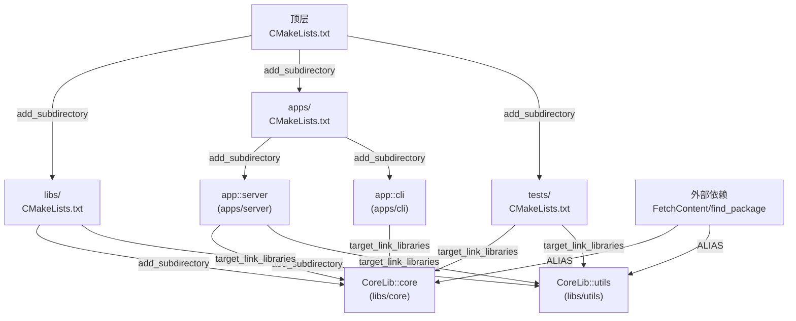

# 第 23 章 · 大型项目与 monorepo 组织

> [!abstract] TL;DR
> 大型 C++ monorepo 的 CMake 组织核心是：用 `add_subdirectory` 分层、用 `PROJECT_IS_TOP_LEVEL` 守卫让库"双模"运行（既能独立构建又能被嵌入）、用命名空间 `ALIAS` target（`Foo::Bar`）替代裸名依赖、用 `FetchContent` + `FETCHCONTENT_TRY_FIND_PACKAGE_MODE` 统一本地/远程依赖查找。超过 100 个 target 时最重要的性能优化是减少全局 `file(GLOB ...)`、合理分割 CMake 文件树，以及理解 `CONFIGURE_DEPENDS` 的实际代价。

---

## 概述与定位

"大型项目"在 CMake 语境里通常意味着：超过 100 个 target、数十个子目录、多个团队并行开发、部分子库需要独立对外发布、同时又要能作为整体一键构建。Monorepo（单一代码仓库）更进一步：所有相关项目（微服务、共享库、工具链）在同一个 git 仓库里，共享构建基础设施。

这种规模下，随意堆砌的 CMake 脚本会迅速退化成"脚本乱麻"：全局变量互相污染、子库无法独立构建、`find_package` 和 `FetchContent` 行为不一致、configure 阶段要花几分钟。本章系统讲解构建大型 CMake 工程所需的所有关键工具与原则。

---

## 原理与机制

### add_subdirectory 的层次设计

`add_subdirectory(dir)` 会将 `dir/CMakeLists.txt` 加入构建树，并在该目录创建一个**子目录范围（directory scope）**：子目录里设置的变量默认不向上传播，但 target 属性、`CACHE` 变量、全局属性（通过 `set_property(GLOBAL ...)`）会跨目录可见。

推荐的目录结构（超 100 个 target 的典型布局）：

```
myproject/
├── CMakeLists.txt              # 顶层：全局设置、选项、FetchContent
├── cmake/
│   ├── CompilerOptions.cmake   # 通用编译选项函数
│   ├── Dependencies.cmake      # 所有外部依赖的声明（集中）
│   └── myproject-config.cmake.in  # install(EXPORT ...) 模板
├── libs/
│   ├── CMakeLists.txt          # add_subdirectory(core) add_subdirectory(utils) ...
│   ├── core/
│   │   ├── CMakeLists.txt      # add_library(core ...) 等
│   │   └── include/core/
│   └── utils/
│       └── CMakeLists.txt
├── apps/
│   ├── CMakeLists.txt
│   ├── server/CMakeLists.txt
│   └── cli/CMakeLists.txt
└── tests/
    └── CMakeLists.txt
```

**分层原则**：
- 顶层 CMakeLists.txt 只做"胶水"：设全局选项、include cmake/ 下的模块、add_subdirectory 各顶层子目录。
- 每个 library 的 CMakeLists.txt 是自包含的：定义 target、设置属性、声明 install 规则。
- 集中管理外部依赖（`cmake/Dependencies.cmake`），避免多个子目录各自 `find_package` 同一个库，版本和选项发生冲突。

### PROJECT_IS_TOP_LEVEL 守卫模式

CMake 3.21 引入了 `PROJECT_IS_TOP_LEVEL` 变量：若当前 project() 是整个 CMake 调用的最顶层 project，则为 `TRUE`，否则（被 `add_subdirectory` 或 `FetchContent_MakeAvailable` 嵌入）为 `FALSE`。

利用这个变量可以实现"双模"库——既能独立构建（含测试、示例、文档），又能被嵌入到上层项目时静默跳过不必要的部分：

```cmake
# libs/core/CMakeLists.txt
cmake_minimum_required(VERSION 3.21)
project(CoreLib VERSION 2.5.0 LANGUAGES CXX)

# 主体：定义 target，始终执行
add_library(core
  src/core.cpp
  src/allocator.cpp
)
add_library(CoreLib::core ALIAS core)
target_include_directories(core
  PUBLIC  $<BUILD_INTERFACE:${CMAKE_CURRENT_SOURCE_DIR}/include>
          $<INSTALL_INTERFACE:include>
)

# 守卫：只在顶层构建时才启用测试/示例/install
if(PROJECT_IS_TOP_LEVEL)
  option(CORE_BUILD_TESTS   "Build CoreLib unit tests"   ON)
  option(CORE_BUILD_EXAMPLES "Build CoreLib examples"    ON)

  if(CORE_BUILD_TESTS)
    enable_testing()
    add_subdirectory(tests)
  endif()
  if(CORE_BUILD_EXAMPLES)
    add_subdirectory(examples)
  endif()

  include(GNUInstallDirs)
  install(TARGETS core EXPORT CoreLibTargets ...)
  install(EXPORT CoreLibTargets ...)
endif()
```

当 `CoreLib` 被上层项目用 `add_subdirectory(libs/core)` 或 `FetchContent_MakeAvailable(CoreLib)` 引入时，`PROJECT_IS_TOP_LEVEL` 为 `FALSE`，测试和安装规则自动跳过，不会污染上层构建。

**旧版兼容写法**（CMake < 3.21）：

```cmake
# 判断当前 project 是否是顶层
if(CMAKE_SOURCE_DIR STREQUAL CMAKE_CURRENT_SOURCE_DIR)
  # 等价于 PROJECT_IS_TOP_LEVEL
endif()
```

### 子项目版本隔离与 project(... VERSION)

每个子库都应调用 `project(NAME VERSION x.y.z)`，这会设置 `<NAME>_VERSION`、`<NAME>_VERSION_MAJOR` 等变量，与上层项目的版本变量相互隔离：

```cmake
project(CoreLib VERSION 2.5.0 LANGUAGES CXX)
# 此后 CoreLib_VERSION = "2.5.0"，PROJECT_VERSION = "2.5.0"
# 不影响上层的 PROJECT_VERSION（上层的在自己的 project() 里定义）
```

多级 project() 嵌套时，`CMAKE_PROJECT_NAME` 始终是顶层 project 的名字，`PROJECT_NAME` 是最近一次 project() 的名字。在子库里应用 `PROJECT_NAME` 而非 `CMAKE_PROJECT_NAME` 来构造 target 名、路径前缀。

---

## 结构/算法/伪代码详解

### monorepo target 的依赖层次



### ALIAS target 与命名空间

直接依赖裸名 target（如 `target_link_libraries(app core)`）有隐患：若 `core` 不存在，CMake 会把它当作链接标志（`-lcore`）而非报错，调试困难。命名空间格式（`CoreLib::core`）强制 CMake 将其视为 target 引用，target 不存在时立即在配置阶段报错：

```cmake
# 定义 ALIAS（让裸名 target 有命名空间别名）
add_library(core ...)
add_library(CoreLib::core ALIAS core)

# 使用方：用命名空间格式，缺失时配置即报错
target_link_libraries(myapp PRIVATE CoreLib::core)   # 推荐
target_link_libraries(myapp PRIVATE core)            # 不推荐，core 不存在时静默失败
```

`ALIAS` target 是只读的：不能对 ALIAS target 调用 `set_target_properties`，只能对原始 target 操作。`find_package` 导入的 target 也已经是命名空间格式（如 `Protobuf::libprotobuf`），与 ALIAS 命名空间风格一致，使"本地构建"和"安装后 find_package"的使用代码完全相同。

### find_package 与 FetchContent 统一

大型 monorepo 常见需求：优先使用系统已安装的库，若没有则自动下载源码构建。CMake 3.24 引入 `FETCHCONTENT_TRY_FIND_PACKAGE_MODE` 和 `FetchContent_Declare` 的 `FIND_PACKAGE_ARGS` 关键词来统一这两条路径：

```cmake
# cmake/Dependencies.cmake
include(FetchContent)

# 模式 1（CMake 3.24+）：先 find_package，失败再 FetchContent
FetchContent_Declare(
  nlohmann_json
  GIT_REPOSITORY https://github.com/nlohmann/json.git
  GIT_TAG        v3.11.3
  FIND_PACKAGE_ARGS 3.11 REQUIRED CONFIG   # 等价于先 find_package(nlohmann_json 3.11 ...)
)
FetchContent_MakeAvailable(nlohmann_json)
# 无论走哪条路，后续都用 nlohmann_json::nlohmann_json 这个 target

# 模式 2（全局设置）：让 FetchContent_MakeAvailable 总是先尝试 find_package
set(FETCHCONTENT_TRY_FIND_PACKAGE_MODE ALWAYS)  # 或 OPT_IN（只在 FIND_PACKAGE_ARGS 时）
```

**OVERRIDE_FIND_PACKAGE**（CMake 3.24+）：在 `FetchContent_Declare` 里加 `OVERRIDE_FIND_PACKAGE`，可以让后续所有 `find_package(SomeLib)` 调用**全部被重定向到 FetchContent 版本**——即使子目录深处的第三方库自己调用了 `find_package`，也会用 FetchContent 下载的版本：

```cmake
FetchContent_Declare(
  fmt
  GIT_REPOSITORY https://github.com/fmtlib/fmt.git
  GIT_TAG        10.2.1
  OVERRIDE_FIND_PACKAGE
)
FetchContent_MakeAvailable(fmt)

# 此后任何地方的 find_package(fmt ...) 都自动指向 FetchContent 版本
```

这是解决 monorepo 中"子库依赖版本冲突"的关键机制。

### 目录属性传播与 target_link_libraries 的传递闭包

`target_link_libraries` 以 `PUBLIC`/`INTERFACE` 方式建立的依赖是传递的——CMake 在内部维护一个以 target 为节点的有向无环图，计算每个 target 最终需要的编译选项、包含路径、链接库时，会遍历这个图的传递闭包。

正因为如此，**不要把目录级别的 `include_directories` 当成传递机制**：

```cmake
# 错误：目录属性 include_directories 不随依赖传播
include_directories("${CMAKE_CURRENT_SOURCE_DIR}/include")  # 影响整个目录，不会传递

# 正确：target 属性随 PUBLIC 传递
target_include_directories(core PUBLIC "${CMAKE_CURRENT_SOURCE_DIR}/include")
# 所有 target_link_libraries(... core) 的 target 自动继承此包含路径
```

同理，`compile_definitions`/`compile_options` 也应用 target 级别的 `target_compile_definitions` / `target_compile_options`，而非目录级别的 `add_definitions` / `add_compile_options`。

---

## 工具视角与实战

### 超过 100 个 target 的实践建议

**1. 条件性加载子目录**

```cmake
# 顶层 CMakeLists.txt
option(BUILD_LEGACY_MODULES "Build legacy compatibility modules" OFF)

add_subdirectory(libs/core)      # 始终构建
add_subdirectory(libs/utils)     # 始终构建
add_subdirectory(apps)           # 始终构建

if(BUILD_LEGACY_MODULES)
  add_subdirectory(libs/legacy)  # 只在需要时构建
endif()

if(PROJECT_IS_TOP_LEVEL)
  add_subdirectory(tests)        # 作为独立工程时才构建测试
  add_subdirectory(tools)        # 开发工具
endif()
```

**2. 用 object library 减少重复编译**

若多个 executable/library 共享大量相同源文件，用 `OBJECT` library 编译一次复用：

```cmake
add_library(common_objs OBJECT
  src/logging.cpp
  src/config.cpp
  src/util.cpp
)
target_include_directories(common_objs PUBLIC include/)

add_executable(server server_main.cpp $<TARGET_OBJECTS:common_objs>)
add_executable(cli    cli_main.cpp    $<TARGET_OBJECTS:common_objs>)
```

CMake 3.12+ 起，OBJECT library 也可以直接通过 `target_link_libraries` 使用，更简洁：

```cmake
target_link_libraries(server PRIVATE common_objs)
```

### configure 与构建性能优化

**减少 file(GLOB ...) — 最重要的性能优化**

`file(GLOB SRCS *.cpp)` 在每次 cmake configure 时重新扫描文件系统，对于大型项目（数千个文件）会显著拖慢配置速度。更坏的是，它的结果在构建时**不会自动更新**——新增文件后必须重新 configure。

```cmake
# 不推荐：隐式文件列表
file(GLOB SRCS "${CMAKE_CURRENT_SOURCE_DIR}/src/*.cpp")

# 推荐：显式列出（工具可以帮你维护，如 cmake-format、IDE 集成）
set(SRCS
  src/core.cpp
  src/allocator.cpp
  src/scheduler.cpp
)
```

**CONFIGURE_DEPENDS 的权衡**

CMake 3.12 引入了 `CONFIGURE_DEPENDS`，使 `file(GLOB ...)` 在文件系统变化时自动触发重新 configure：

```cmake
file(GLOB SRCS CONFIGURE_DEPENDS "${CMAKE_CURRENT_SOURCE_DIR}/src/*.cpp")
```

这在 Ninja/Makefile 生成器里有效，但代价是：**每次构建（包括增量构建）前都要检查文件系统**，在文件数量大或网络文件系统上会明显增加构建启动延迟。实践建议：
- 小型叶子目录（< 50 个文件）且频繁新增文件：可以接受 `CONFIGURE_DEPENDS`。
- 大型项目根目录或核心库：用显式文件列表。

**缓存外部依赖**

`FetchContent` 默认每次 configure 都会检查远程 URL（即使已下载）。用 `FETCHCONTENT_UPDATES_DISCONNECTED` 禁止在联网前重新检查，加快 CI 配置速度：

```cmake
set(FETCHCONTENT_UPDATES_DISCONNECTED ON)
```

或者在 CI 里通过 `cmake -DFETCHCONTENT_UPDATES_DISCONNECTED=ON` 传入。

### 与 Bazel/Buck monorepo 的对比

| 维度 | CMake monorepo | Bazel/Buck monorepo |
|---|---|---|
| 依赖声明粒度 | target 级（`target_link_libraries`） | target 级（`deps`），强制显式 |
| 增量构建 | 基于文件时间戳（Ninja）或隐式扫描（Make） | 基于内容哈希，更精确 |
| 远程缓存 | 需要额外工具（ccache/sccache） | 原生支持（Remote Cache API） |
| 跨语言支持 | C/C++/CUDA/Swift/Fortran/C#… 原生；Python/Java 需要插件 | 原生多语言（Java/Python/Go/C++…） |
| 配置语言 | CMake DSL（命令式，有作用域） | Starlark（声明式，无副作用） |
| 生态成熟度 | 极成熟，C++ 事实标准 | 成熟，Google/Meta 大规模使用 |
| 学习曲线 | 中（全局/目录/target 三层作用域需要理解） | 高（Starlark + 平台概念 + 工具链配置） |

CMake 在 C++ monorepo 中的主要劣势是"无法原生进行内容哈希增量"和"全局 configure 阶段串行"；优势是生态成熟、与所有主流 IDE 深度集成、支持所有 C++ 编译器和平台。对于大多数 C++ 团队，CMake + Ninja + sccache 组合是兼顾灵活性与性能的实用选择。

---

## 安全性与正确使用

### 陷阱 1：全局变量污染子项目

在顶层 `CMakeLists.txt` 里用 `set(CMAKE_CXX_STANDARD 20)` 后，所有 `add_subdirectory` 的子项目都会继承这个值——这在大多数情况下是预期行为，但若某个子库只需要 C++14，而全局设置了 C++20，可能引入无意的标准切换。

做法：在子库的 CMakeLists.txt 里通过 `set_target_properties` 精确控制，或者在 `project()` 之后立即设置局部变量覆盖：

```cmake
# libs/legacy/CMakeLists.txt
project(LegacyLib LANGUAGES CXX)
# 覆盖上层设置，只在本目录作用域有效（不影响已创建的 target）
set(CMAKE_CXX_STANDARD 14)
set(CMAKE_CXX_STANDARD_REQUIRED ON)
```

注意：`set()` 不加 `CACHE` 的变量设置只在当前目录范围内有效，不会向上污染。

### 陷阱 2：裸名 target 依赖

已在"命名空间 ALIAS"一节详述。关键点：所有对外导出（install/export）的 target 必须在 `ALIAS` 里加命名空间，内部使用的 helper target 也建议加命名空间，避免 target 名和 `-l<name>` 标志混淆。

### 陷阱 3：find_package 与 FetchContent 重复定义 target

若某个依赖库（如 `fmt`）先被 `find_package` 找到并定义了 `fmt::fmt`，后来某个子目录的 FetchContent 又尝试下载并 `add_library(fmt ...)`，CMake 会报"target 已存在"错误。

解决方案：在顶层 `cmake/Dependencies.cmake` 集中管理所有外部依赖，用 `OVERRIDE_FIND_PACKAGE` 确保只走一条路径；子目录里绝不自行 `find_package` 或 `FetchContent_Declare` 已在顶层声明的库。

### 陷阱 4：install() 与 add_subdirectory 嵌入的冲突

被 `add_subdirectory` 嵌入的子库，其 `install()` 规则**仍然有效**，会出现在上层项目的 install 目标里。若不希望子库被独立安装，必须用 `PROJECT_IS_TOP_LEVEL` 守卫：

```cmake
if(PROJECT_IS_TOP_LEVEL)
  install(TARGETS mylib EXPORT MyLibTargets ...)
endif()
```

### 反模式：跨子目录的 set(PARENT_SCOPE ...) 共享状态

```cmake
# 反模式：用 PARENT_SCOPE 向上传递变量
set(MYLIB_SOURCES "src/a.cpp;src/b.cpp" PARENT_SCOPE)

# 正确：通过 target 属性传递，或者用 CACHE 变量
add_library(mylib src/a.cpp src/b.cpp)  # target 本身就是传递机制
```

`PARENT_SCOPE` 会使 CMake 的数据流变成隐式双向的，极难追踪，是大型项目混乱的主要来源之一。所有跨目录的信息传递应通过 target 属性、全局属性（`get/set_property(GLOBAL ...)`）或 CMake 的缓存变量进行。

---

## 小结

- **目录结构**：顶层做胶水，子库自包含，外部依赖集中在 `cmake/Dependencies.cmake`。
- **PROJECT_IS_TOP_LEVEL 守卫**：让每个子库都能"双模"运行，是 monorepo 兼容独立构建的标准模式。
- **命名空间 ALIAS**：`Foo::Bar` 格式让 target 引用在配置阶段即可报错，杜绝裸名静默失败。
- **find_package + FetchContent 统一**：用 `FIND_PACKAGE_ARGS` 和 `OVERRIDE_FIND_PACKAGE`（CMake 3.24+）消除"本地已装"与"自动下载"的行为差异。
- **避免全局 file(GLOB)**：显式文件列表或谨慎使用 `CONFIGURE_DEPENDS`，是保持大型项目 configure 速度的关键。
- **用 target 属性传播，不用目录属性或 PARENT_SCOPE**：这是维持大型项目 CMake 脚本可读性的根本原则。

---

## 相关阅读

- [[42.Cmake/04 - Target 与现代 CMake.md|第 4 章：Target 与现代 CMake]]
- [[42.Cmake/10 - find_package 与包管理.md|第 10 章：find_package 与包管理]]
- [[42.Cmake/11 - FetchContent 与 ExternalProject.md|第 11 章：FetchContent 与 ExternalProject]]
- [[42.Cmake/14 - 编译器、语言标准与特性.md|第 14 章：编译器、语言标准与特性]]
- [[42.Cmake/22 - 代码生成 target.md|第 22 章：代码生成 target]]

---

> ⬅️ [[42.Cmake/22 - 代码生成 target.md|上一章]] ｜ ➡️ [[42.Cmake/24 - CPack 进阶打包.md|第 24 章]]
>
> [[00 - CMake 完整技术教程 - 总索引|总索引]]
