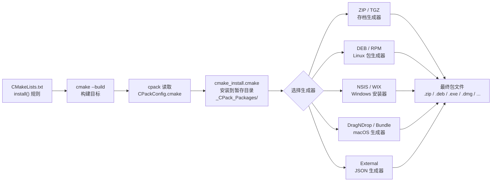

# 第 24 章 · CPack 进阶打包

> 基准版本：CMake 4.3.4

> [!abstract] TL;DR
> CPack 是 CMake 内置的打包前端，通过 `include(CPack)` 激活，读取 `install()` 规则自动生成多种格式的安装包（ZIP/TGZ/DEB/RPM/NSIS/WIX/DragNDrop 等）。核心思路：**先用 `install()` 声明"什么文件装到什么位置"，CPack 只是把这些规则"塞进包"**。进阶用法包括：组件化拆包（运行时/开发/文档分离）、运行时依赖库自动收集（`file(GET_RUNTIME_DEPENDENCIES)` / `install(RUNTIME_DEPENDENCY_SET)`）、External 生成器（输出 JSON 交给 AppImage/Flatpak/WinGet 等外部工具链）、代码签名集成，以及一批高频陷阱（RPATH 可再定位、组件遗漏、跨发行版兼容）。

---

## 概述与定位

CMake 的 `install()` 命令只负责**描述安装意图**——"把这个可执行文件放到 `bin/`，把头文件放到 `include/`，把库放到 `lib/`"——但它本身不生成任何可分发的包文件。CPack（CMake Packaging）则是那个把这些安装规则"打包成一个可交付产物"的工具。

从使用者角度看，CPack 的定位类似一个**打包前端适配层**：

- 向上，它读取已有的 `install()` 规则，无需重新描述文件；
- 向下，它把安装内容路由到具体的**生成器**（Generator），由生成器产生 `.zip`、`.deb`、`.rpm`、`.exe`（NSIS/InnoSetup）、`.msi`（WIX）、`.dmg`（DragNDrop）等格式的包文件。

使用入口极为简洁：在 `CMakeLists.txt` 末尾（`install()` 规则全部写完之后）加一行：

```cmake
include(CPack)
```

`include(CPack)` 会：
1. 读取当前已设置的所有 `CPACK_*` 变量作为配置；
2. 生成 `CPackConfig.cmake` 与 `CPackSourceConfig.cmake` 两个配置文件到构建目录；
3. 向 CMake 构建系统注册 `package` 目标（`cmake --build . --target package`）。

打包时只需在构建目录执行：

```bash
cpack                          # 使用默认生成器
cpack -G DEB                   # 指定生成器
cpack -G "ZIP;TGZ"             # 同时生成多种格式
cpack --config CPackConfig.cmake -B _packages   # 输出到指定目录
```

**CPack 与 `cmake --install` 的根本区别**：`cmake --install` 把文件直接写到 `CMAKE_INSTALL_PREFIX` 指向的真实目录；CPack 先把文件写到临时暂存目录（`_CPack_Packages/`），再由生成器把暂存目录"打成包"，整个过程不接触系统目录。

---

## 原理与机制

### `CPACK_*` 变量体系

CPack 通过以 `CPACK_` 前缀命名的变量体系来控制行为。这些变量**必须在 `include(CPack)` 之前设置**，否则不会被读入 `CPackConfig.cmake`。

**全局通用变量（所有生成器共享）**：

| 变量 | 说明 | 典型值 |
|---|---|---|
| `CPACK_PACKAGE_NAME` | 包名 | `MyApp`（默认取 `PROJECT_NAME`） |
| `CPACK_PACKAGE_VERSION` | 版本号 | `1.2.3`（默认取 `PROJECT_VERSION`） |
| `CPACK_PACKAGE_VENDOR` | 发行商 | `Acme Corp` |
| `CPACK_PACKAGE_DESCRIPTION_SUMMARY` | 一行简介 | `A fast data processor` |
| `CPACK_PACKAGE_DESCRIPTION_FILE` | 详细说明文件路径 | `${CMAKE_SOURCE_DIR}/README.md` |
| `CPACK_RESOURCE_FILE_LICENSE` | 许可证文件路径 | `${CMAKE_SOURCE_DIR}/LICENSE` |
| `CPACK_PACKAGE_CONTACT` | 维护者联系方式 | `maintainer@example.com` |
| `CPACK_INSTALL_PREFIX` | 包内安装前缀 | `/usr` |
| `CPACK_OUTPUT_FILE_PREFIX` | 输出包的存放目录 | `${CMAKE_BINARY_DIR}/packages` |
| `CPACK_GENERATOR` | 默认生成器列表 | `DEB;RPM;TGZ` |
| `CPACK_COMPONENTS_ALL` | 组件化打包时启用的组件列表 | `Runtime;Development` |
| `CPACK_THREADS` | 并发打包线程数（3.21+） | `4` |

**变量的三层优先级**（高→低）：
1. 命令行 `-D` 覆盖（`cpack -DCPACK_GENERATOR=DEB`）；
2. `CPackConfig.cmake` 里的变量（来自 `include(CPack)` 读取的 `CPACK_*`）；
3. 生成器自己的硬编码默认值。

### 打包流程内部机制

CPack 执行打包时经历以下阶段：



核心流程：CPack 以 `DESTDIR` 技术把 cmake_install.cmake 的安装操作重定向到临时暂存目录，再在这个目录里由各生成器完成包装。这意味着**任何 `install()` 规则在 CPack 下都会被重新执行一次**（非幂等写操作需要注意）。

---

## 结构/算法/伪代码详解

### 生成器全景

#### 存档类生成器（ZIP、TGZ、7Z 等）

最简单的生成器，把暂存目录直接打成压缩包：

```cmake
set(CPACK_GENERATOR "ZIP;TGZ")
# ZIP 生成 .zip，TGZ 生成 .tar.gz，7Z 生成 .7z，TBZ2 生成 .tar.bz2
include(CPack)
```

常用附加变量：
- `CPACK_ARCHIVE_COMPONENT_INSTALL`：设为 `ON` 时按组件分别生成独立存档；
- `CPACK_ARCHIVE_THREADS`：压缩并发线程数。

#### DEB 生成器（Debian / Ubuntu）

```cmake
set(CPACK_DEBIAN_PACKAGE_MAINTAINER "Alice <alice@example.com>")
set(CPACK_DEBIAN_PACKAGE_SECTION "utils")
set(CPACK_DEBIAN_PACKAGE_PRIORITY "optional")
set(CPACK_DEBIAN_PACKAGE_DEPENDS "libc6 (>= 2.17), libstdc++6 (>= 8)")
set(CPACK_DEBIAN_PACKAGE_RECOMMENDS "libboost-filesystem1.74.0")
set(CPACK_DEBIAN_PACKAGE_HOMEPAGE "https://example.com/myapp")
# 多组件时每组件可有独立元数据
set(CPACK_DEBIAN_RUNTIME_PACKAGE_DEPENDS "libc6 (>= 2.17)")
set(CPACK_DEBIAN_DEVELOPMENT_PACKAGE_DEPENDS "myapp-runtime (= ${PROJECT_VERSION})")
# 自动检测依赖（需要 dpkg-shlibdeps）
set(CPACK_DEBIAN_PACKAGE_SHLIBDEPS ON)
include(CPack)
```

DEB 生成器会生成符合 Debian 政策的 `.deb` 包，包含 `DEBIAN/control`、`md5sums`、`preinst`/`postinst` 脚本（可通过 `CPACK_DEBIAN_PACKAGE_CONTROL_EXTRA` 注入）。

#### RPM 生成器（RHEL / Fedora / openSUSE）

```cmake
set(CPACK_RPM_PACKAGE_LICENSE "MIT")
set(CPACK_RPM_PACKAGE_GROUP "Applications/Utilities")
set(CPACK_RPM_PACKAGE_URL "https://example.com/myapp")
set(CPACK_RPM_PACKAGE_REQUIRES "glibc >= 2.17, libstdc++ >= 8")
set(CPACK_RPM_PACKAGE_SUGGESTS "boost-filesystem")
# 注入 spec 片段（%pre / %post / %preun / %postun）
set(CPACK_RPM_PRE_INSTALL_SCRIPT_FILE "${CMAKE_SOURCE_DIR}/pkg/rpm/pre_install.sh")
set(CPACK_RPM_POST_INSTALL_SCRIPT_FILE "${CMAKE_SOURCE_DIR}/pkg/rpm/post_install.sh")
# 自动分析 so 依赖
set(CPACK_RPM_PACKAGE_AUTOREQPROV ON)
# 重定位支持（见陷阱章节）
set(CPACK_RPM_PACKAGE_RELOCATABLE ON)
set(CPACK_RPM_PACKAGE_PREFIX /usr)
include(CPack)
```

#### NSIS 生成器（Windows NSIS 安装向导）

```cmake
set(CPACK_NSIS_DISPLAY_NAME "My Application")
set(CPACK_NSIS_PACKAGE_NAME "MyApp")
set(CPACK_NSIS_HELP_LINK "https://example.com/help")
set(CPACK_NSIS_URL_INFO_ABOUT "https://example.com")
set(CPACK_NSIS_CONTACT "support@example.com")
# 添加开始菜单快捷方式
set(CPACK_NSIS_MENU_LINKS
    "bin/myapp.exe" "My Application"
    "https://example.com" "My Application Online Help"
)
# 安装时创建桌面快捷方式
set(CPACK_NSIS_CREATE_ICONS_EXTRA
    "CreateShortCut '$DESKTOP\\\\MyApp.lnk' '$INSTDIR\\\\bin\\\\myapp.exe'")
# 注入自定义 NSIS 脚本片段
set(CPACK_NSIS_EXTRA_INSTALL_COMMANDS "...")
set(CPACK_NSIS_EXTRA_UNINSTALL_COMMANDS "...")
# 设置安装器图标
set(CPACK_NSIS_MUI_ICON "${CMAKE_SOURCE_DIR}/icons/installer.ico")
include(CPack)
```

#### WIX 生成器（Windows MSI）

```cmake
set(CPACK_WIX_UPGRADE_GUID "3E4B5A6C-7D8E-9F10-A1B2-C3D4E5F60001")
set(CPACK_WIX_PRODUCT_ICON "${CMAKE_SOURCE_DIR}/icons/app.ico")
set(CPACK_WIX_UI_BANNER "${CMAKE_SOURCE_DIR}/wix/banner.bmp")
set(CPACK_WIX_UI_DIALOG "${CMAKE_SOURCE_DIR}/wix/dialog.bmp")
set(CPACK_WIX_PROPERTY_ARPHELPLINK "https://example.com/help")
# 注入额外的 WXS 片段（可添加注册表项、环境变量等）
set(CPACK_WIX_PATCH_FILE "${CMAKE_SOURCE_DIR}/wix/extra_registry.wxs")
include(CPack)
```

`CPACK_WIX_UPGRADE_GUID` 必须全局唯一且**不能改变**——它是 Windows 识别同一产品不同版本的依据，每次换 GUID 会导致系统同时保留新旧两个安装条目。

#### macOS DragNDrop 生成器

```cmake
set(CPACK_DMG_VOLUME_NAME "${PROJECT_NAME} ${PROJECT_VERSION}")
set(CPACK_DMG_DS_STORE "${CMAKE_SOURCE_DIR}/pkg/macos/DS_Store")
set(CPACK_DMG_BACKGROUND_IMAGE "${CMAKE_SOURCE_DIR}/pkg/macos/background.png")
set(CPACK_DMG_SLA_DIR "${CMAKE_SOURCE_DIR}/pkg/macos/sla")  # 许可证目录
# 窗口大小和图标位置
set(CPACK_DMG_WINDOW_GEOMETRY "600 400 100 100")
set(CPACK_DMG_APP_BUNDLE_SUBDIR ".")
include(CPack)
```

#### macOS productbuild / Bundle 生成器

`productbuild` 生成 `.pkg`（用于 Mac App Store 外发布或 MDM 部署），`Bundle` 生成 `.app` + 包装。

```cmake
# Bundle 生成器
set(CPACK_BUNDLE_NAME "MyApp")
set(CPACK_BUNDLE_ICON "${CMAKE_SOURCE_DIR}/icons/app.icns")
set(CPACK_BUNDLE_PLIST "${CMAKE_SOURCE_DIR}/pkg/macos/Info.plist.in")
set(CPACK_BUNDLE_STARTUP_COMMAND "${CMAKE_SOURCE_DIR}/pkg/macos/startup.sh")
include(CPack)
```

### External 生成器

**External 生成器**是 CMake 3.13 引入的扩展机制，用于**把 CPack 的安装规则导出成 JSON 文件**，再交给 CMake 不内置支持的外部打包工具（AppImage、Flatpak、Snap、WinGet、Chocolatey 等）消费。

External 生成器本身不产生任何包文件，它的输出是一份 `CPackExternalMeta.json`，描述：
- 每个安装组件的文件列表及目标路径；
- 包的版本、名称、描述等元数据；
- 暂存目录位置（外部工具可直接读取已暂存的文件树）。

```cmake
# CMakeLists.txt 中启用 External 生成器
set(CPACK_GENERATOR "External")
set(CPACK_EXTERNAL_PACKAGE_SCRIPT "${CMAKE_SOURCE_DIR}/pkg/appimage_builder.cmake")
set(CPACK_EXTERNAL_ENABLE_STAGING ON)   # 让 CPack 先把文件暂存好
include(CPack)
```

`CPACK_EXTERNAL_PACKAGE_SCRIPT` 指向的脚本在暂存完成后由 CPack 调用，脚本里可以调用 `linuxdeployqt`、`appimagetool`、`flatpak-builder` 等工具：

```cmake
# pkg/appimage_builder.cmake（被 CPack 作为 CMake 脚本执行）
# CPACK_TEMPORARY_DIRECTORY 由 CPack 设置，指向暂存根目录
# CPACK_PACKAGE_VERSION 等变量也可用

message(STATUS "构建 AppImage：版本 ${CPACK_PACKAGE_VERSION}")
execute_process(
    COMMAND appimagetool
        "${CPACK_TEMPORARY_DIRECTORY}/usr"
        "${CPACK_PACKAGE_DIRECTORY}/${CPACK_PACKAGE_NAME}-${CPACK_PACKAGE_VERSION}-x86_64.AppImage"
    RESULT_VARIABLE _ret
)
if(NOT _ret EQUAL 0)
    message(FATAL_ERROR "appimagetool 失败，退出码：${_ret}")
endif()
```

External 生成器的价值在于：既利用了 CPack 统一的安装规则描述、组件化支持和暂存机制，又能对接任意外部打包生态，不受 CMake 内置生成器数量的限制。

### 组件化打包

组件化是 CPack 最重要的进阶功能之一，允许把安装内容拆分成多个独立组件（如运行时、开发库、文档），用户在安装时可以选择只装所需组件，或者生成多个独立的包文件（一个 DEB 对应一个组件）。

**第一步：给 `install()` 规则加 `COMPONENT` 标记**

```cmake
add_executable(myapp main.cpp)
add_library(mylib SHARED lib.cpp)

# 运行时组件：可执行文件 + 共享库
install(TARGETS myapp
    RUNTIME DESTINATION bin
    COMPONENT Runtime
)
install(TARGETS mylib
    RUNTIME DESTINATION bin       # Windows DLL 放 bin
    LIBRARY DESTINATION lib       # Linux/macOS .so/.dylib 放 lib
    COMPONENT Runtime
)

# 开发组件：静态库 + 头文件（依赖运行时组件）
install(TARGETS mylib
    ARCHIVE DESTINATION lib       # 静态库 .a / .lib
    COMPONENT Development
)
install(DIRECTORY include/
    DESTINATION include
    COMPONENT Development
)

# 文档组件
install(DIRECTORY docs/html/
    DESTINATION share/doc/myapp
    COMPONENT Documentation
)
```

**第二步：声明组件元数据与依赖**

```cmake
include(CPackComponent)

cpack_add_component(Runtime
    DISPLAY_NAME "运行时"
    DESCRIPTION "运行 MyApp 所需的可执行文件和共享库"
    REQUIRED                          # 此组件不可取消选中
)

cpack_add_component(Development
    DISPLAY_NAME "开发包"
    DESCRIPTION "头文件和静态库，用于构建基于 mylib 的程序"
    DEPENDS Runtime                   # 依赖 Runtime 组件
)

cpack_add_component(Documentation
    DISPLAY_NAME "文档"
    DESCRIPTION "HTML 格式的 API 参考文档"
    DISABLED                          # 默认不选中
)

# 把组件分组（用于安装向导显示）
cpack_add_component_group(Core
    DISPLAY_NAME "核心组件"
    DESCRIPTION "必选的运行时和开发文件"
)
cpack_add_component(Runtime GROUP Core)
cpack_add_component(Development GROUP Core)
```

**第三步：控制打包行为**

```cmake
# 方式一：单包，用户在安装向导里选择组件
set(CPACK_COMPONENTS_ALL Runtime Development Documentation)
# CPACK_ARCHIVE_COMPONENT_INSTALL 不设（默认 OFF），所有组件进同一包

# 方式二：每组件一个独立包（DEB/RPM 推荐）
set(CPACK_DEB_COMPONENT_INSTALL ON)
set(CPACK_RPM_COMPONENT_INSTALL ON)
# 生成 myapp-runtime.deb、myapp-development.deb、myapp-documentation.deb

# 方式三：存档生成器按组件拆分
set(CPACK_ARCHIVE_COMPONENT_INSTALL ON)
```

### `file(GET_RUNTIME_DEPENDENCIES)` 与运行时依赖收集

在打包可执行文件时，最麻烦的问题之一是**把所有运行时依赖库（`.so`、`.dylib`、`.dll`）一起打入包中**，否则在目标系统上运行会缺库。

#### 底层 API：`file(GET_RUNTIME_DEPENDENCIES)`

CMake 3.16 引入的底层命令，分析 ELF/PE/Mach-O 文件的动态链接依赖：

```cmake
# 在 install() 的 CODE 块中使用（安装时执行）
install(CODE [[
    file(GET_RUNTIME_DEPENDENCIES
        EXECUTABLES   "${CMAKE_INSTALL_PREFIX}/bin/myapp"
        RESOLVED_DEPENDENCIES_VAR   _resolved
        UNRESOLVED_DEPENDENCIES_VAR _unresolved
        CONFLICTING_DEPENDENCIES_PREFIX _conflict
        # 排除系统库（正则表达式匹配库路径）
        PRE_EXCLUDE_REGEXES
            "^/lib/x86_64-linux-gnu/libc\\.so"
            "^/lib/x86_64-linux-gnu/libm\\.so"
            "^/lib/x86_64-linux-gnu/libpthread\\.so"
            "^/lib/x86_64-linux-gnu/libdl\\.so"
        POST_EXCLUDE_REGEXES
            "^/usr/lib/x86_64-linux-gnu/libstdc\\+\\+"
        # 提供额外的搜索路径
        DIRECTORIES "${CMAKE_SOURCE_DIR}/thirdparty/lib"
    )

    foreach(_dep IN LISTS _resolved)
        file(INSTALL "${_dep}"
            DESTINATION "${CMAKE_INSTALL_PREFIX}/lib"
            FOLLOW_SYMLINK_CHAIN          # 同时安装符号链接链
        )
    endforeach()

    if(_unresolved)
        message(WARNING "无法解析的依赖：${_unresolved}")
    endif()
]])
```

#### 上层 API：`install(RUNTIME_DEPENDENCY_SET)`（CMake 3.21+）

CMake 3.21 引入更高层的 `RUNTIME_DEPENDENCY_SET` 机制，无需手写 `install(CODE)` 循环：

```cmake
add_executable(myapp main.cpp)
target_link_libraries(myapp PRIVATE mylib Qt6::Widgets)

# 把 myapp 加入运行时依赖集合 "app_deps"
install(TARGETS myapp
    RUNTIME DESTINATION bin
    RUNTIME_DEPENDENCY_SET app_deps
)

# 安装 app_deps 集合中收集到的所有运行时依赖
install(RUNTIME_DEPENDENCY_SET app_deps
    LIBRARY DESTINATION lib
    RUNTIME DESTINATION bin    # Windows DLL
    FRAMEWORK DESTINATION lib  # macOS Framework
    PRE_EXCLUDE_REGEXES
        "^/lib/x86_64-linux-gnu/libc\\.so"
        "^/lib/x86_64-linux-gnu/libm\\.so"
        "libgcc_s\\.so"
    POST_EXCLUDE_REGEXES
        "^/usr/lib/x86_64-linux-gnu/libstdc\\+\\+"
        "/lib64/ld-linux"
    DIRECTORIES "${Qt6_DIR}/../../../lib"
)
```

与 `file(GET_RUNTIME_DEPENDENCIES)` 相比，`RUNTIME_DEPENDENCY_SET` 的优势在于：
- 支持多个 target 共用同一个依赖集合（多入口共享库自动去重）；
- 与 CPack 组件机制无缝集成（`COMPONENT` 参数）；
- 配置阶段即确定依赖，而非运行期才解析。

---

## 工具视角与实战

### 完整实战示例

下面是一个中等复杂度的真实项目打包配置，涵盖多平台、组件化、运行时依赖收集：

```cmake
cmake_minimum_required(VERSION 3.21)
project(DataTool VERSION 2.5.0 LANGUAGES CXX)

# ── 构建目标 ──────────────────────────────────────────────────
add_library(datatool_core SHARED src/core.cpp)
target_include_directories(datatool_core PUBLIC include/)

add_executable(datatool src/main.cpp)
target_link_libraries(datatool PRIVATE datatool_core)

# ── 安装规则（带组件标记） ────────────────────────────────────
install(TARGETS datatool
    RUNTIME DESTINATION bin
    COMPONENT Runtime
    RUNTIME_DEPENDENCY_SET core_deps   # 收集运行时依赖
)
install(TARGETS datatool_core
    RUNTIME  DESTINATION bin   COMPONENT Runtime
    LIBRARY  DESTINATION lib   COMPONENT Runtime
    ARCHIVE  DESTINATION lib   COMPONENT Development
)
install(DIRECTORY include/
    DESTINATION include
    COMPONENT Development
    FILES_MATCHING PATTERN "*.h"
)
install(RUNTIME_DEPENDENCY_SET core_deps
    LIBRARY DESTINATION lib   COMPONENT Runtime
    RUNTIME DESTINATION bin   COMPONENT Runtime
    PRE_EXCLUDE_REGEXES
        "^/lib/.*\\.so"
        "^/usr/lib/.*\\.so"
    POST_EXCLUDE_REGEXES "ld-linux"
    DIRECTORIES "${CMAKE_SOURCE_DIR}/thirdparty/lib"
)

# ── CPack 全局元数据 ──────────────────────────────────────────
set(CPACK_PACKAGE_NAME "DataTool")
set(CPACK_PACKAGE_VENDOR "Example Corp")
set(CPACK_PACKAGE_DESCRIPTION_SUMMARY "High-performance data processing tool")
set(CPACK_PACKAGE_DESCRIPTION_FILE "${CMAKE_SOURCE_DIR}/README.md")
set(CPACK_RESOURCE_FILE_LICENSE "${CMAKE_SOURCE_DIR}/LICENSE")
set(CPACK_PACKAGE_CONTACT "support@example.com")
set(CPACK_INSTALL_PREFIX "/usr")

# ── 组件定义 ─────────────────────────────────────────────────
include(CPackComponent)
cpack_add_component(Runtime
    DISPLAY_NAME "Runtime" DESCRIPTION "Executable and shared libraries"
    REQUIRED
)
cpack_add_component(Development
    DISPLAY_NAME "Development" DESCRIPTION "Headers and static library"
    DEPENDS Runtime
)

# ── 按平台选择生成器 ──────────────────────────────────────────
if(CMAKE_SYSTEM_NAME STREQUAL "Linux")
    set(CPACK_GENERATOR "DEB;RPM;TGZ")
    set(CPACK_DEB_COMPONENT_INSTALL ON)
    set(CPACK_RPM_COMPONENT_INSTALL ON)
    # DEB 元数据
    set(CPACK_DEBIAN_PACKAGE_DEPENDS "libc6 (>= 2.17)")
    set(CPACK_DEBIAN_PACKAGE_SECTION "utils")
    set(CPACK_DEBIAN_PACKAGE_SHLIBDEPS ON)
    # RPM 元数据
    set(CPACK_RPM_PACKAGE_LICENSE "MIT")
    set(CPACK_RPM_PACKAGE_REQUIRES "glibc >= 2.17")
    set(CPACK_RPM_PACKAGE_AUTOREQPROV ON)
elseif(CMAKE_SYSTEM_NAME STREQUAL "Windows")
    set(CPACK_GENERATOR "NSIS;WIX;ZIP")
    set(CPACK_NSIS_DISPLAY_NAME "DataTool ${PROJECT_VERSION}")
    set(CPACK_WIX_UPGRADE_GUID "4A5B6C7D-8E9F-0A1B-2C3D-4E5F60718293")
elseif(CMAKE_SYSTEM_NAME STREQUAL "Darwin")
    set(CPACK_GENERATOR "DragNDrop;TGZ")
    set(CPACK_DMG_VOLUME_NAME "DataTool ${PROJECT_VERSION}")
endif()

include(CPack)
```

### DEB/RPM 元数据字段深度参考

**DEB 高级字段**：

```cmake
# 多架构支持
set(CPACK_DEBIAN_PACKAGE_ARCHITECTURE "amd64")  # 默认从系统检测

# changelog 和版权文件（标准 Debian 包要求）
set(CPACK_DEBIAN_PACKAGE_CONTROL_EXTRA
    "${CMAKE_SOURCE_DIR}/pkg/debian/changelog"
    "${CMAKE_SOURCE_DIR}/pkg/debian/copyright"
    "${CMAKE_SOURCE_DIR}/pkg/debian/postinst"
    "${CMAKE_SOURCE_DIR}/pkg/debian/prerm"
)

# 虚拟包（Provides）
set(CPACK_DEBIAN_PACKAGE_PROVIDES "virtual-data-tool")
set(CPACK_DEBIAN_PACKAGE_CONFLICTS "old-data-tool")
set(CPACK_DEBIAN_PACKAGE_REPLACES "old-data-tool")
```

**RPM 高级字段**：

```cmake
# changelog（必须符合 RPM spec 格式）
set(CPACK_RPM_CHANGELOG_FILE "${CMAKE_SOURCE_DIR}/pkg/rpm/CHANGES")

# 文件排列覆盖（精确控制哪些文件用哪些权限）
set(CPACK_RPM_DEFAULT_FILE_PERMISSIONS
    OWNER_READ OWNER_WRITE OWNER_EXECUTE
    GROUP_READ GROUP_EXECUTE
    WORLD_READ WORLD_EXECUTE
)
set(CPACK_RPM_DEFAULT_EXECUTABLE_PERMISSIONS
    OWNER_READ OWNER_WRITE OWNER_EXECUTE
    GROUP_READ GROUP_EXECUTE
    WORLD_READ WORLD_EXECUTE
)

# 调试信息包（自动生成 -debuginfo 子包）
set(CPACK_RPM_DEBUGINFO_PACKAGE ON)
```

### 代码签名集成

打包完成后，安全分发要求对包内容或安装包本身进行签名。

**Windows：signtool 集成**

```cmake
# 在 install(CODE) 阶段调用 signtool 签名
install(CODE [[
    find_program(_signtool signtool
        PATHS "C:/Program Files (x86)/Windows Kits/10/bin/10.0.22621.0/x64"
              "C:/Program Files/Windows Kits/10/bin/10.0.22621.0/x64"
        REQUIRED
    )
    message(STATUS "签名：${CMAKE_INSTALL_PREFIX}/bin/datatool.exe")
    execute_process(
        COMMAND "${_signtool}" sign
            /fd SHA256
            /tr "http://timestamp.digicert.com"
            /td SHA256
            /f "${CODESIGN_CERT_FILE}"   # 从外部传入证书路径
            /p "${CODESIGN_CERT_PASS}"   # 从外部传入证书密码
            "${CMAKE_INSTALL_PREFIX}/bin/datatool.exe"
        RESULT_VARIABLE _ret
    )
    if(NOT _ret EQUAL 0)
        message(FATAL_ERROR "signtool 失败，退出码：${_ret}")
    endif()
]])
```

**macOS：codesign 集成**

```cmake
# 对 .app bundle 签名，并可选 notarize
set(CPACK_BUNDLE_APPLE_CERT_APP "Developer ID Application: Example Corp (ABCDE12345)")

# 自动公证（CMake 3.19+）
set(CPACK_BUNDLE_APPLE_ENTITLEMENTS "${CMAKE_SOURCE_DIR}/pkg/macos/entitlements.plist")
set(CPACK_BUNDLE_APPLE_CODESIGN_PARAMETER "--deep --force --options runtime")
# 完整公证流程需在 CPACK_BUNDLE_POST_BUILD_SCRIPT_CODE 里调用 xcrun notarytool
```

**GPG 签名 DEB/RPM（CI/CD 场景）**：

```cmake
# 生成包后，在 CI 脚本中签名（而非 CMake 内），更安全
# Debian: dpkg-sig --sign builder myapp_2.5.0_amd64.deb
# RPM: rpm --addsign myapp-2.5.0-1.x86_64.rpm
```

---

## 安全性与正确使用

### 陷阱一：RPATH 与可再定位性

**问题**：如果可执行文件在构建时嵌入了绝对 RPATH（如 `/home/user/build/lib`），打包后在另一台机器上运行时会找不到共享库，因为那台机器没有同样的路径。

**根因**：CMake 默认在安装时会**去掉 build-tree RPATH** 并设置 install RPATH（`CMAKE_INSTALL_RPATH`）。但如果你没有正确设置 install RPATH，或者包要在任意路径解压运行（ZIP/TGZ 类包），就会出问题。

**正确做法**：

```cmake
# 对于"解压即用"的存档包，使用 $ORIGIN 相对 RPATH
set(CMAKE_INSTALL_RPATH "$ORIGIN/../lib")   # Linux
set(CMAKE_INSTALL_RPATH "@loader_path/../lib")  # macOS

# 对于系统包（DEB/RPM），通常安装到固定路径，可用绝对 RPATH 或不设（靠 ldconfig）
set(CMAKE_INSTALL_RPATH "/usr/lib/myapp")

# 安装时重新链接（确保 install RPATH 被设置）
set(CMAKE_INSTALL_RPATH_USE_LINK_PATH OFF)  # 不要把 link 时的路径加入 install RPATH
set(CMAKE_BUILD_RPATH_USE_ORIGIN ON)        # CMake 3.14+，构建时用 $ORIGIN
```

**验证方法**：

```bash
# Linux：查看 RPATH
objdump -x /path/to/binary | grep RPATH
patchelf --print-rpath /path/to/binary

# macOS：查看 RPATH
otool -l /path/to/binary | grep -A 3 LC_RPATH
```

### 陷阱二：组件遗漏

**问题**：定义了组件，但 `CPACK_COMPONENTS_ALL` 没有包含某个组件，或者某个 `install()` 规则没有 `COMPONENT` 标记（会进入隐式的"无组件"组），导致打出的包里缺文件。

**正确做法**：

```cmake
# 显式枚举所有组件，不依赖 CMake 的自动收集
set(CPACK_COMPONENTS_ALL Runtime Development Documentation)

# 检查是否所有 install() 都有 COMPONENT
# 对于确实想进"无标记"默认组的文件，CMake 会将其归入 Unspecified 组
# 开启 CPACK_COMPONENTS_GROUPING 来控制未归组文件的处理
set(CPACK_COMPONENTS_GROUPING IGNORE)  # 每个组件独立，不合并
```

### 陷阱三：`include(CPack)` 的位置

**问题**：`include(CPack)` 必须在所有 `install()` 规则和 `CPACK_*` 变量**之后**调用，否则配置不完整。很多人把它放在文件顶部，导致后续的变量设置根本没被 CPack 读到。

**正确做法**：始终把 `include(CPack)` 作为 `CMakeLists.txt` 的**最后一行（或接近最后）**。

### 陷阱四：跨发行版 DEB/RPM 兼容性

**问题**：在 Ubuntu 20.04 上生成的 DEB 包，在 Ubuntu 18.04 上可能因 `libc6` 版本要求过高而无法安装。

**正确做法**：

```cmake
# 明确指定最低依赖版本，不要靠 SHLIBDEPS 自动检测（它会取当前系统版本）
set(CPACK_DEBIAN_PACKAGE_DEPENDS "libc6 (>= 2.17), libstdc++6 (>= 6)")

# 或者使用静态链接 libstdc++ 以彻底消除这一依赖
# target_link_options(myapp PRIVATE -static-libstdc++ -static-libgcc)

# 用 Docker 在最低支持发行版上构建包（推荐的 CI 做法）
```

### 陷阱五：Windows 路径长度与 NSIS

NSIS 的默认安装目录通常很深（如 `C:\Program Files\MyCompany\MyApp 2.5.0`），如果包内有深层目录结构，叠加后可能超过 Windows MAX_PATH（260 字符）限制。

```cmake
# 缩短默认安装路径
set(CPACK_NSIS_INSTALL_ROOT "$PROGRAMFILES64")
set(CPACK_PACKAGE_INSTALL_DIRECTORY "MyApp")  # 不含版本号，避免路径太深
```

### 陷阱六：`cpack --config` 与源码包混淆

CPack 生成两个配置文件：`CPackConfig.cmake`（二进制包）和 `CPackSourceConfig.cmake`（源码包）。

```bash
# 打二进制包（默认）
cpack --config CPackConfig.cmake

# 打源码包（等价于 make package_source）
cpack --config CPackSourceConfig.cmake

# 控制源码包内容
set(CPACK_SOURCE_GENERATOR "TGZ;ZIP")
set(CPACK_SOURCE_IGNORE_FILES
    "/\\.git/"
    "/build/"
    "\\.DS_Store"
    ".*~$"
)
```

---

## 小结

CPack 是 CMake 生态中最被低估的组件之一——它的入口只有 `include(CPack)` 一行，但背后有完整的多格式、多平台、组件化、依赖收集体系。本章要点梳理：

- **变量优先顺序**：所有 `CPACK_*` 必须在 `include(CPack)` 之前设置；`include(CPack)` 只在 `CMakeLists.txt` 末尾调用一次。
- **生成器全景**：存档类（ZIP/TGZ/7Z）开箱即用；DEB/RPM 是 Linux 分发主力；NSIS/WIX 覆盖 Windows 安装器；DragNDrop/Bundle/productbuild 对应 macOS；External 生成器桥接 AppImage/Flatpak/Snap/WinGet 等现代分发格式。
- **组件化**：用 `install(... COMPONENT)` 给文件打标签，用 `cpack_add_component` 声明元数据与依赖，用 `CPACK_*_COMPONENT_INSTALL ON` 按组件拆包——这是 DEB/RPM 生产环境的标准做法。
- **运行时依赖**：`file(GET_RUNTIME_DEPENDENCIES)` 是底层 API，适合精细控制；`install(RUNTIME_DEPENDENCY_SET)` (CMake 3.21+) 是高层 API，推荐优先使用；两者都需要精心编写 `PRE/POST_EXCLUDE_REGEXES` 来过滤系统库。
- **RPATH 可再定位**：存档包用 `$ORIGIN/../lib`，系统包用绝对路径，并在 CI 中用 `patchelf`/`otool` 验证。
- **代码签名**：Windows 用 signtool（`/fd SHA256 /tr`），macOS 用 `CPACK_BUNDLE_APPLE_CERT_APP`，GPG 签名 DEB/RPM 建议在 CI 脚本层做，不在 CMake 内嵌。
- **核心陷阱**：`include(CPack)` 位置、组件遗漏、RPATH 裸路径、WIX GUID 不变原则、跨发行版版本依赖。

---

## 相关阅读

- [[42.Cmake/11 - 安装、导出与打包.md|第 11 章：安装、导出与打包]]——`install()` 命令完整参考，CPack 的数据来源
- [[42.Cmake/07 - 生成器表达式.md|第 7 章：生成器表达式]]——`install(CODE [[...]])` 块中的生成器表达式用法
- [[42.Cmake/23 - 大型项目与 monorepo 组织.md|第 23 章：大型项目与 monorepo 组织]]——多子项目统一打包策略
- [[42.Cmake/12 - 测试 CTest.md|第 12 章：测试 CTest]]——打包前的 `ctest --test-dir` 自动化测试

---

> ⬅️ [[42.Cmake/23 - 大型项目与 monorepo 组织.md|上一章]]
>
> [[00 - CMake 完整技术教程 - 总索引|总索引]]
