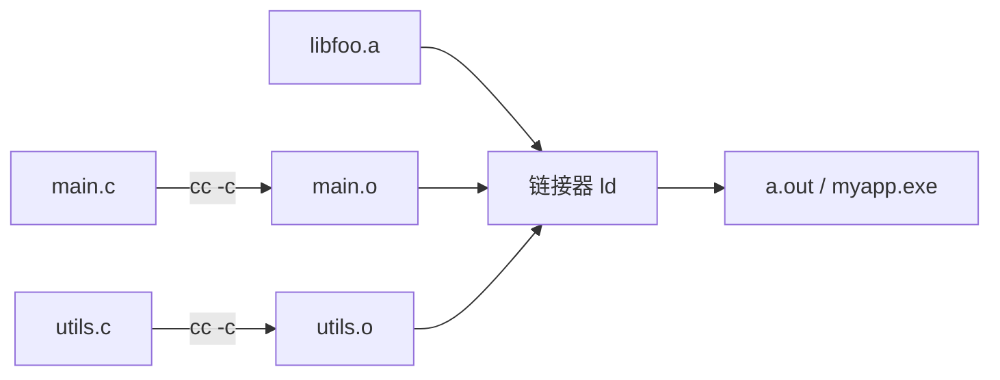
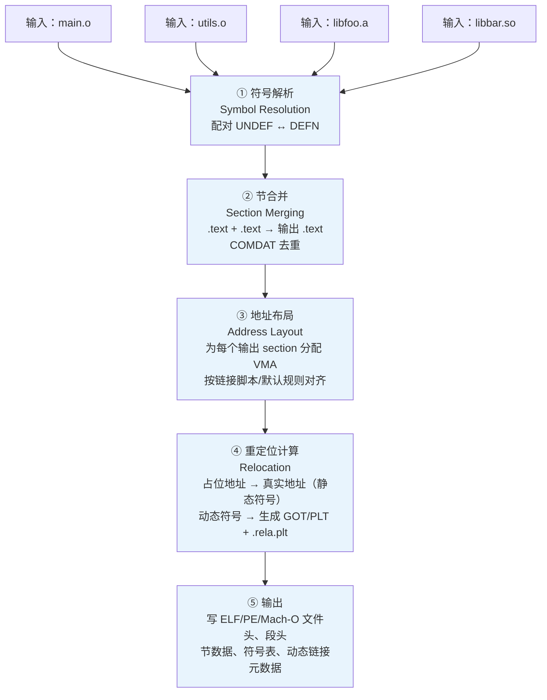
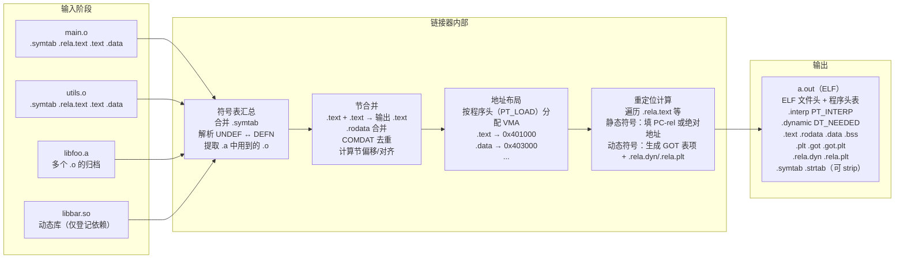

# 链接器详解（1）· 链接器是什么

> [!abstract] TL;DR
> - **链接器**（`ld`/`link.exe`/`ld64`）是构建流水线的最后一站：它把编译器产出的若干个可重定位目标文件（`.o`/`.obj`）与库文件（`.a`/`.lib`/`.so`/`.dylib`/`.dll`）**拼成一个可执行文件或共享库**。
> - 它做五件事：**符号解析（symbol resolution）、重定位（relocation）、节合并（section merging）、地址布局（address layout）、库链接（library linking）**。
> - 链接器（`ld`）工作在**链接期**，把碎片拼成整体；动态链接器（`ld.so`/`dyld`/`ntdll`）工作在**运行期**，把共享库装进内存。两者常被混淆，本篇重点厘清这条边界（详见 [[14.动态链接与加载器详解/01.从静态链接到动态链接.md]]）。
> - 主流链接器：GNU ld（BFD）、gold、LLVM lld、mold、MSVC link.exe、Apple ld64。

---

## 概述与定位

一段 C 代码变成可运行程序，要经历四个阶段：

```
预处理 → 编译 → 汇编 → 链接
```

前三步编译器完成（参见 [[41.Compiler/00.编译器完整参考 - 总索引.md]]），每个翻译单元独立输出一个**可重定位目标文件**（`.o`）。这些 `.o` 里充满"占位符"：函数调用的目标地址不知道、引用了其他 `.o` 里的全局变量却不知道地址、从静态库来的符号尚未合并……**链接器就是负责填补这一切空缺的程序**。



> [!note] 链接期 vs 运行期：两个"链接"不是同一回事
> - **链接器**（`ld`/`link.exe`/`ld64`）：构建时运行，输入 `.o` + 库，输出可执行文件或共享库。它处理的是**符号引用与定义的静态绑定**。
> - **动态链接器**（Linux `ld.so`/`ld-linux.so.2`、macOS `dyld`、Windows `ntdll`+Loader）：程序启动时由操作系统内核调用，负责把 `.so`/`.dylib`/`.dll` 装载进内存、做运行期重定位。这是"另一个"链接，发生在程序已经构建完成之后。
>
> 本系列（43）聚焦**链接期**；运行期的故事由 [[14.动态链接与加载器详解/01.从静态链接到动态链接.md]] 展开。

---

## 原理与机制

### 链接器的 5 大任务

这五件事是顺序依赖的：符号解析先于重定位，重定位依赖节合并，地址布局在节合并后确定，库链接贯穿全程。

#### 任务一：符号解析（Symbol Resolution）

每个 `.o` 文件都有一张**符号表**，记录"定义了什么符号"（函数、全局变量）以及"引用了哪些尚未定义的符号"（`UNDEF`）。链接器遍历所有输入文件，把引用与定义配对。

- 一个符号只能有一个**强定义**（`STB_GLOBAL`），多个**弱定义**（`STB_WEAK`）；
- 未定义符号（`UNDEF`）若找不到任何定义，链接报 `undefined reference to 'foo'`；
- 动态库里的符号在链接期只登记"需要运行期解析"，不做静态绑定。

详见 [[02.目标文件详解]]（符号表结构）与 [[14.动态链接与加载器详解/06.符号解析与符号查找.md]]（运行期符号查找）。

#### 任务二：重定位（Relocation）

可重定位 `.o` 里的代码/数据含有大量**占位地址**（通常是 0 或临时偏移），以及配套的**重定位条目**（`.rela.text`/`.rela.data` 等），告诉链接器"哪个位置、要填什么符号的地址、怎么计算"。

链接期重定位会把这些占位地址替换成真实地址（绝对地址或 PC-relative 偏移）。对于动态符号，链接器不填死地址，而是生成 **GOT/PLT 间接访问**并在输出文件留下 `.rela.dyn`/`.rela.plt`，交由运行期动态链接器填充（详见 [[14.动态链接与加载器详解/07.重定位机制详解.md]]、[[11.ELF文件详解/17.got节.md]]）。

#### 任务三：节合并（Section Merging）

多个 `.o` 里同名的 section 要合并到输出文件的单个 section：

- `main.o:.text` + `utils.o:.text` → 输出 `.text`（代码段）
- 所有 `.rodata` 合并 → 只读数据段
- COMDAT（如 C++ 内联函数、模板实例化）要去重：同名 COMDAT group 只保留一份

节合并决定了代码与数据在最终输出文件中的布局基础，是地址布局的前提。详见 [[05.节的合并与布局]]。

#### 任务四：地址布局（Address Layout）

节合并后，链接器为每个输出节确定**虚拟地址（VMA）**：

- ELF 可执行文件通常从 `0x400000`（PIE 为 0）开始布局，按段对齐要求排列 `.text`/`.rodata`/`.data`/`.bss`；
- 链接脚本（`ld script`）可精确控制每个节的地址（嵌入式常用）；
- 确定地址后，之前的重定位占位才能被填入最终值。

#### 任务五：库链接（Library Linking）

链接器处理两种库：

| 库类型 | 链接方式 | 结果 |
|--------|----------|------|
| 静态库 `.a`/`.lib` | 从归档中**按需提取**用到的 `.o` 并合并 | 代码直接进入可执行文件 |
| 动态库 `.so`/`.dylib`/`.dll` | 仅记录依赖关系（`DT_NEEDED`/`IMAGE_IMPORT_DESCRIPTOR`） | 运行期由动态链接器加载 |

静态库的"按需提取"规则有个经典陷阱：链接顺序错误会导致符号找不到（详见 [[04.静态库]]）。

---

### 一次 `gcc -o` 背后发生了什么

看似简单的一条命令：

```bash
gcc main.o utils.o -lfoo -o myapp
```

实际上 `gcc` 只是个**驱动器（driver）**，它内部调用：

1. `cc1`（编译器前端，若输入是 `.c`）
2. `as`（汇编器，若有 `.s`）
3. **`ld`（链接器）**——这才是真正的主角

用 `-v` 参数可以看到 gcc 实际传给 `ld` 的完整命令：

```bash
gcc -v main.o utils.o -lfoo -o myapp
```

```text
# 示例输出（代表性，非本机实跑）
COLLECT_GCC_OPTIONS=...
/usr/lib/gcc/x86_64-linux-gnu/11/collect2 \
  -plugin /usr/lib/gcc/x86_64-linux-gnu/11/liblto_plugin.so \
  --eh-frame-hdr -m elf_x86_64 \
  -dynamic-linker /lib64/ld-linux-x86-64.so.2 \
  -o myapp \
  /usr/lib/gcc/x86_64-linux-gnu/11/crti.o \
  /usr/lib/gcc/x86_64-linux-gnu/11/crtbegin.o \
  main.o utils.o \
  -lfoo \
  -lgcc --as-needed -lgcc_s --no-as-needed \
  -lc \
  /usr/lib/gcc/x86_64-linux-gnu/11/crtend.o \
  /usr/lib/gcc/x86_64-linux-gnu/11/crtn.o
```

> [!warning] 示例输出为示意
> 真实输出随 GCC 版本、发行版、目标架构不同而变化，非本机实跑。重要的是理解**结构**而非具体路径。

几个关键点：

- **`collect2`** 是 GCC 对 `ld` 的包装，主要作用是收集 C++ 全局构造器/析构器（`__attribute__((constructor))`）；
- **`-dynamic-linker /lib64/ld-linux-x86-64.so.2`** 告诉链接器把哪个动态链接器的路径写进 `PT_INTERP` 段——这就是操作系统内核启动程序时找到 `ld.so` 的依据；
- **`crt0`/`crti`/`crtn`/`crtbegin`/`crtend`** 是 C 运行时启动文件，拼出 `_start → __libc_start_main → main` 的调用链（详见 [[12.链接器与C运行时]]）。

---

### 链接 5 阶段流程图



> **图解**：五个阶段线性推进，但实际实现中"符号解析"与"库提取"是交替进行的（扫描 `.a` 时只要发现有未解析符号就提取对应 `.o`，直到不动为止）。重定位计算（④）依赖地址布局（③）的结果，是最后才能确定值的一步。

---

## 三平台对照

### Linux：GNU ld（BFD）/ LLD

| 特性 | GNU ld（BFD） | LLD（LLVM） |
|------|--------------|-------------|
| 调用方式 | `ld`（直接）或 `gcc -o` 驱动 | `ld.lld` 或 `clang -fuse-ld=lld` |
| 链接脚本 | 完整支持 GNU ld script | 兼容主流语法 |
| 速度 | 串行，大项目较慢 | 并行，显著更快 |
| LTO | 通过插件 | 原生 ThinLTO/FullLTO |
| 典型输出 | ELF | ELF |

```bash
# 查看当前系统 ld 版本
ld --version
```

```text
# 示例输出（代表性，非本机实跑）
GNU ld (GNU Binutils for Ubuntu) 2.38
Copyright (C) 2022 Free Software Foundation, Inc.
```

> [!warning] 示例输出为示意
> 版本号随发行版而异，非本机实跑。

```bash
# 用 lld 链接（需已安装）
clang -fuse-ld=lld main.o utils.o -o myapp
```

### Windows：MSVC `link.exe`

Windows 的工具链完全独立于 GNU binutils：

```
cl.exe  →  main.obj utils.obj
link.exe main.obj utils.obj foo.lib /OUT:myapp.exe
```

- 输出格式是 **PE/COFF**，而非 ELF；
- 链接脚本等价物是 **`.def` 文件**（导出控制）和 `/LINK` 选项；
- 动态库依赖写入 **导入目录（`IMAGE_IMPORT_DESCRIPTOR`）**，加载期由 `ntdll` + Windows Loader 填充 IAT；
- 查看版本：

```bat
link.exe /?
```

```text
# 示例输出（代表性，非本机实跑）
Microsoft (R) Incremental Linker Version 14.xx.xxxxx.x
Copyright (C) Microsoft Corporation.  All rights reserved.
```

> [!warning] 示例输出为示意

### macOS：Apple `ld64`

```bash
# macOS 上 ld 指向 ld64
ld --version 2>&1 | head -1
```

```text
# 示例输出（代表性，非本机实跑）
@(#)PROGRAM:ld  PROJECT:ld64-xxx.x
```

> [!warning] 示例输出为示意

- 输出格式是 **Mach-O**；
- 使用 `LC_DYLD_INFO_ONLY`/`LC_DYLD_CHAINED_FIXUPS` 管理动态链接元数据（参见 [[14.动态链接与加载器详解/01.从静态链接到动态链接.md]]）；
- Xcode/clang 通过 `-Xlinker` 将选项传递给 `ld64`；
- 不支持 GNU ld script，使用 `-exported_symbols_list` / `-unexported_symbols_list` / `.tbd` 文件替代。

---

## 主流链接器概览与分工

| 链接器 | 维护方 | 平台/格式 | 核心特点 |
|--------|--------|-----------|----------|
| **GNU ld（BFD）** | GNU Binutils | Linux/多平台/ELF | 最广泛，功能最完整，支持所有架构和 GNU ld script |
| **gold** | Google（含入 Binutils） | Linux/ELF | 比 BFD ld 快 2–5×，多线程，支持 LTO 插件；被 mold 超越后使用减少 |
| **LLD（LLVM）** | LLVM Project | ELF/PE/Mach-O/wasm | 跨平台，速度快，原生 ThinLTO，`clang -fuse-ld=lld` 直接切换 |
| **mold** | Rui Ueyama | Linux/ELF | 目前最快的通用 ELF 链接器（大型项目比 ld 快 50×+），并行设计，`-fuse-ld=mold` |
| **MSVC link.exe** | Microsoft | Windows/PE-COFF | Visual Studio 标配，与 MSVC 工具链深度集成，支持增量链接 |
| **Apple ld64** | Apple | macOS/iOS/Mach-O | Xcode 标配，与 Swift/ObjC 运行时深度集成，使用 chained fixups |

> [!note] 如何选择链接器
> - **日常 Linux 开发**：系统默认（BFD ld）即可；大型项目推荐 `mold`（`cmake -DCMAKE_LINKER=mold` 或 `-fuse-ld=mold`）。
> - **LLVM/Clang 工具链**：`-fuse-ld=lld` 跨平台一致，调试信息处理更优秀。
> - **嵌入式/裸机**：BFD ld + 完整链接脚本支持，无可替代。
> - **Windows 官方链接器**：只有 `link.exe`，第三方替代（如 lld-link）仍有兼容性边角问题。
> - **macOS**：只能用 `ld64`（苹果私有接口），LLD 的 Mach-O 后端可覆盖部分场景但非官方支持。

---

## 链接器（ld）vs 动态链接器（ld.so）

这是最常见的概念混淆，必须厘清：

| 维度 | 链接器（ld / link.exe / ld64） | 动态链接器（ld.so / dyld / ntdll Loader） |
|------|-------------------------------|-------------------------------------------|
| **运行时机** | **构建期**（`make`/`cmake --build` 时） | **运行期**（进程启动时） |
| **调用者** | 开发者/构建系统 | 操作系统内核（`execve` 之后） |
| **输入** | `.o` 目标文件 + 库文件 | 可执行文件 + `.so`/`.dylib`/`.dll` |
| **输出** | 可执行文件 / 共享库 | 进程内存映像（运行中的进程） |
| **符号处理** | 静态解析：把 UNDEF 与 DEFN 配对，写死或生成 GOT/PLT | 动态解析：在 GOT/IAT 里填入运行期地址 |
| **重定位** | 链接期重定位（`R_X86_64_PC32`/`R_X86_64_32S` 等） | 加载期重定位（`R_X86_64_GLOB_DAT`/`JUMP_SLOT` 等） |
| **Linux 程序** | `/usr/bin/ld` 或 `ld.lld` | `/lib64/ld-linux-x86-64.so.2` |
| **Linux 路径记录** | ld 把 ld.so 路径写入 `PT_INTERP` 段 | 内核读 `PT_INTERP`，启动 ld.so |
| **Windows** | `link.exe` | `ntdll.dll` + Windows Loader |
| **macOS** | `ld64`（Xcode）| `dyld`（`/usr/lib/dyld`）|

**一句话记忆**：`ld` 是建筑工人（把砖头拼成楼），`ld.so` 是物业管理（楼建好后把租户搬进来）。两者分工不同、工作时机不同，但设计上深度配合——`ld` 输出的文件结构（`PT_INTERP`、`DT_NEEDED`、`.rela.plt`、GOT 保留项……）正是 `ld.so` 运行时的"工作说明书"。

> 深入了解运行期半段：[[14.动态链接与加载器详解/01.从静态链接到动态链接.md]]

---

## 数据结构 / 流程详解

### ELF 链接流程：从 `.o` 到可执行文件

以 ELF/Linux 为例，展开内部步骤：



### PE/COFF 链接流程要点（Windows）

Windows PE 链接与 ELF 总体类似，区别在：

- 符号表使用 COFF 格式（`.obj` 内），而非 ELF `.symtab`；
- 节合并产生 `.text`/`.rdata`/`.data`/`.bss` 等 PE section；
- 动态库依赖写入**导入目录**（`IMAGE_IMPORT_DESCRIPTOR` 数组），包含 INT（Import Name Table）和 IAT（Import Address Table）占位；
- 加载器在进程启动时填满 IAT，无 lazy binding——等同 ELF 的 Full RELRO + BIND_NOW；
- 输出文件结构详见 [[14.三平台链接器对比]]。

---

## 代码与命令

### 实操：`gcc -v` 看真实链接命令

```bash
# 准备两个最小源文件
cat > /tmp/main.c << 'EOF'
extern int add(int a, int b);
int main(void) { return add(1, 2); }
EOF
cat > /tmp/utils.c << 'EOF'
int add(int a, int b) { return a + b; }
EOF

# 用 -v 看 gcc 驱动器调用的真实 ld 命令
gcc -v /tmp/main.c /tmp/utils.c -o /tmp/demo 2>&1 | grep -A 30 'COLLECT_GCC_OPTIONS\|collect2\|ld '
```

```text
# 示例输出（代表性，非本机实跑）
COLLECT_GCC_OPTIONS='-v' '-o' '/tmp/demo' '-mtune=generic' '-march=x86-64'
 /usr/lib/gcc/x86_64-linux-gnu/11/collect2 \
   -plugin /usr/lib/gcc/x86_64-linux-gnu/11/liblto_plugin.so \
   --eh-frame-hdr \
   -m elf_x86_64 \
   -dynamic-linker /lib64/ld-linux-x86-64.so.2 \
   -pie \
   -o /tmp/demo \
   /usr/lib/gcc/x86_64-linux-gnu/11/crti.o \
   /usr/lib/gcc/x86_64-linux-gnu/11/crtbeginS.o \
   /tmp/ccXXXXXX.o \     ← main.c 编译的临时 .o
   /tmp/ccYYYYYY.o \     ← utils.c 编译的临时 .o
   -lgcc --as-needed -lgcc_s --no-as-needed \
   -lc \
   /usr/lib/gcc/x86_64-linux-gnu/11/crtendS.o \
   /usr/lib/gcc/x86_64-linux-gnu/11/crtn.o
```

> [!warning] 示例输出为示意
> 临时 `.o` 文件名、CRT 路径、GCC 版本均随环境不同，非本机实跑。关键是理解 `-dynamic-linker`、`crt*.o`、`-lc` 等参数的语义。

### 实操：直接调用 `ld`

```bash
# 先分步编译，再手动链接（仅作演示，通常用 gcc -o 更方便）
gcc -c /tmp/main.c -o /tmp/main.o
gcc -c /tmp/utils.c -o /tmp/utils.o

# 手动调用 ld（简化版，缺 crt 等，仅演示参数结构）
ld -o /tmp/demo_manual \
   -m elf_x86_64 \
   -dynamic-linker /lib64/ld-linux-x86-64.so.2 \
   /tmp/main.o /tmp/utils.o \
   -lc
```

> [!warning] 示例输出为示意
> 直接调用 `ld` 通常会缺少 CRT 启动文件而链接失败（`undefined reference to '_start'`）。生产中应始终通过 `gcc`/`clang` 驱动器调用，它会自动补充 CRT、标准库、插件路径等。上述命令仅用于演示参数语义。

### 实操：查看链接器版本

```bash
# GNU ld
ld --version

# LLVM lld（若已安装）
ld.lld --version

# gold（若已安装）
ld.gold --version

# mold（若已安装）
mold --version
```

> [!warning] 示例输出为示意
> 各链接器版本输出格式不同，以本机实际输出为准。

### 实操：查看输出文件的链接元数据

```bash
# 查看 PT_INTERP（动态链接器路径）
readelf -l /tmp/demo | grep INTERP

# 查看动态库依赖（DT_NEEDED）
readelf -d /tmp/demo | grep NEEDED

# 查看节表
readelf -S /tmp/demo | head -30

# 查看符号表
nm /tmp/demo | head -20
```

```text
# 示例输出（代表性，非本机实跑）
$ readelf -l /tmp/demo | grep INTERP
      [Requesting program interpreter: /lib64/ld-linux-x86-64.so.2]

$ readelf -d /tmp/demo | grep NEEDED
 0x0000000000000001 (NEEDED)             Shared library: [libc.so.6]

$ nm /tmp/demo | grep ' T '
0000000000001149 T add
0000000000001155 T main
```

> [!warning] 示例输出为示意

---

## 陷阱

### 陷阱 1：把 `ld` 与 `ld.so` 弄混

`/lib64/ld-linux-x86-64.so.2` 虽然名字里有 `ld`，却是**运行期**动态链接器，和构建期链接器 `/usr/bin/ld` 完全不同。前者由内核在 `execve` 时调用，后者在 `make` 时由构建系统调用。

### 陷阱 2：直接调用 `ld` 而不通过编译器驱动

直接 `ld main.o utils.o -o demo -lc` 几乎必然失败：缺 `_start`（来自 `crt1.o`），缺异常处理帧注册（`crti.o`/`crtn.o`），缺 GCC 内置库（`libgcc.a`）。永远通过 `gcc -o` 或 `clang -o` 间接调用。

### 陷阱 3：静态库链接顺序

```bash
# 错误：libfoo.a 在用它的 main.o 之前
gcc -lfoo main.o -o demo   # ← UNDEF 找不到

# 正确：先列使用者，后列提供者
gcc main.o -lfoo -o demo
```

GNU ld 按从左到右扫描，只在遇到 `.a` 时提取**当时尚未解析的** UNDEF 符号对应的 `.o`。详见 [[04.静态库]]。

### 陷阱 4：误以为"编译成功"就会"链接成功"

编译期只验证每个翻译单元内部的语法和类型，未定义引用要到链接期才暴露。典型报错：

```text
/usr/bin/ld: main.o: in function `main':
main.c:(.text+0x1a): undefined reference to `foo'
collect2: error: ld returned 1 exit status
```

这是"链接期错误"，不是"编译期错误"，排查方向见 [[13.链接错误排查]]。

---

## 小结

1. **链接器的本质**是把分散的 `.o` 与库文件拼成一个完整的可执行文件/共享库，核心工作是**符号解析 → 节合并 → 地址布局 → 重定位 → 输出**。
2. **`ld`（构建期）≠ `ld.so`（运行期）**：前者是构建工具，后者是操作系统的动态加载器；前者输出文件，后者把文件装入内存。两者分工明确，深度配合。
3. **主流链接器各有擅长**：BFD ld 最通用，mold 最快（大型项目首选），LLD 跨平台，MSVC link.exe / ld64 分别是 Windows / macOS 的唯一官方选项。
4. **用 `-v` 看透 gcc 驱动器**——它暴露了真实的 `ld` 调用命令、CRT 文件、标准库依赖，是理解"链接器做了什么"最直接的入口。
5. 后续章节将逐一深入五大任务的每个细节：[[02.目标文件详解]] → 符号表/节结构；[[05.节的合并与布局]] → 节合并；[[06.链接期重定位]] → 重定位计算；[[07.链接脚本]] → 地址布局控制。

---

## 相关阅读

- **运行期的另一半**：[[14.动态链接与加载器详解/01.从静态链接到动态链接.md]]
- **目标文件结构（链接器的输入）**：[[02.目标文件详解]]
- **GOT——链接期与运行期的桥梁**：[[11.ELF文件详解/17.got节.md]]
- **运行期重定位类型详解**：[[14.动态链接与加载器详解/07.重定位机制详解.md]]
- **PLT/GOT 延迟绑定（运行期）**：[[14.动态链接与加载器详解/08.PLT与GOT与延迟绑定.md]]
- **编译器系列（链接的上游）**：[[41.Compiler/00.编译器完整参考 - 总索引.md]]
- **CMake 如何驱动链接**：[[42.Cmake/00 - CMake 完整技术教程 - 总索引.md]]
- **三平台链接器横评**：[[14.三平台链接器对比]]
- **链接错误排查**：[[13.链接错误排查]]

---

⬅️ 上一篇 [[00.链接器详解总览]] ｜ 🏠 [[00.链接器详解总览]] ｜ 下一篇 [[02.目标文件详解]] ➡️
