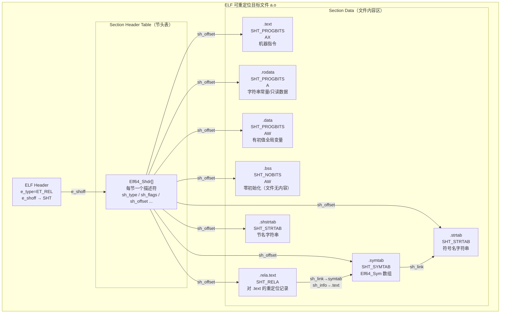
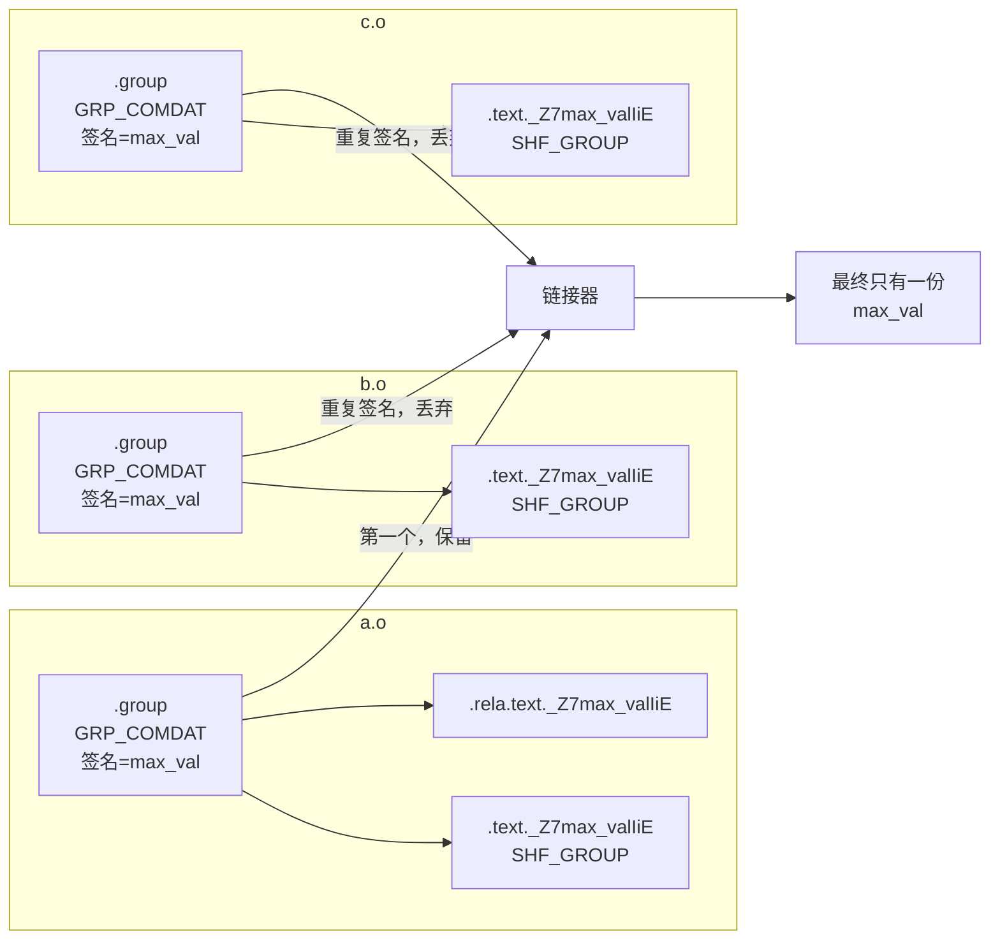
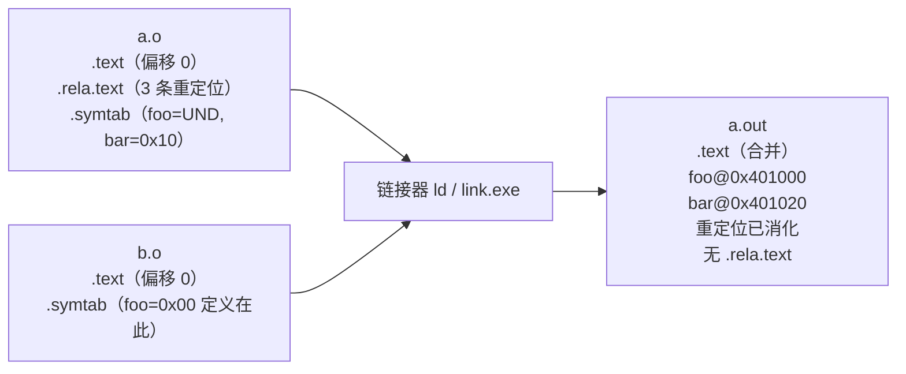

# 链接器详解（2）· 目标文件详解

> [!abstract] TL;DR
> - **目标文件（`.o` / `.obj`）** 是编译器的输出，是链接器的输入——它既不是可运行的程序，也不是完整的库，而是一块"半成品"：代码与数据按 **section** 组织，符号地址尚未确定（占位为 0），外部引用悬而未决（记录在重定位表中）。
> - **ELF 可重定位文件**（`ET_REL`）：由节头表（SHT）驱动；核心节——`.text`（代码）、`.data`（有值全局变量）、`.bss`（零初始化变量，文件中不占空间）、`.rodata`（只读常量）、`.rela.text`（对 `.text` 的重定位记录）、`.symtab`（符号表）、`.strtab`（符号名字符串）、`.shstrtab`（节名字符串）。
> - **COFF 目标文件**（`.obj`）：Windows/MSVC 工具链的对应物，结构相似，重定位用 `IMAGE_RELOCATION`，符号表用 `IMAGE_SYMBOL`，但无程序头表。
> - **COMDAT**：C++ 模板实例化、`inline` 函数、vtable 等在多个编译单元（TU）中各生成一份；链接器用 COMDAT 机制（ELF：`SHT_GROUP` + `GRP_COMDAT`；COFF：`IMAGE_COMDAT_SELECT_*`）在链接期去重，只保留一份，避免 ODR 违例引发的体积膨胀与链接报错。
> - **`.o` vs 可执行文件**：前者 `st_value` 是节内偏移、地址全是 0 占位、外部符号是 `SHN_UNDEF`；后者地址已确定、重定位节已消化、符号解析完毕。

本篇是链接器系列的第二篇，紧接 [[01.链接器是什么]] 对链接器职责的概述，深入目标文件的内部结构——这是理解链接过程的物质基础。后续的 [[03.符号与符号解析]] 将在此基础上讲符号的强弱、解析规则与多重定义。

---

## 概述与定位

### 为什么先讲目标文件

链接器的工作本质是：读若干个目标文件（与库），将它们的 section 合并、符号解析、重定位，输出一个更大的 ELF/PE/Mach-O。要理解这个过程，必须先搞清楚"输入"是什么形状：

```
源码 .c/.cpp  →  编译器  →  .o / .obj（可重定位目标文件）
                              ↓
                            链接器
                              ↓
                        可执行文件 / .so / .lib
```

目标文件的特征：

1. **有 section 头表，无程序头表**（ELF `ET_REL`）——只有链接视角，没有执行视角。
2. **地址全为 0 或节内偏移**——链接器还没给它分配虚拟地址。
3. **外部符号全是 `SHN_UNDEF`**——它们的定义在别的 `.o` 或库里，等链接器解析。
4. **有重定位表**——记录"哪些指令/数据项引用了哪个符号、需要什么样的地址修补"。

### 文件类型标识

#### ELF：`e_type = ET_REL`

ELF 文件头（`Elf64_Ehdr`）的 `e_type` 字段标识文件用途：

| `e_type` | 值 | 含义 |
|---|---|---|
| `ET_REL` | 1 | 可重定位文件（目标文件 `.o`） |
| `ET_EXEC` | 2 | 可执行文件 |
| `ET_DYN` | 3 | 共享对象（`.so` 或 PIE 可执行文件） |
| `ET_CORE` | 4 | Core dump 文件 |

```bash
readelf -h a.o | grep Type
# Type:  REL (Relocatable file)
```

#### COFF：无独立 `e_type`，靠 `Characteristics` 位

COFF 目标文件（`.obj`）是 PE 家族的"前体"。它共用 `IMAGE_FILE_HEADER`（即 [[13.PE文件详解/05-详解PE文件(五)：COFF文件头.md|COFF 文件头]]），`Characteristics` 字段的 `IMAGE_FILE_EXECUTABLE_IMAGE`（0x0002）位**未置位**——这正是目标文件与 EXE/DLL 的最简单区分。同时 `PointerToSymbolTable` / `NumberOfSymbols` 在目标文件中是真实有效的（链接后的 EXE/DLL 通常置 0）。

---

## 原理与机制

### 目标文件内部结构总览（Mermaid）



> 图中 `AX` = `SHF_ALLOC | SHF_EXECINSTR`，`A` = `SHF_ALLOC`，`AW` = `SHF_ALLOC | SHF_WRITE`。`.bss` 用 `SHT_NOBITS`——节头存大小（`sh_size`），但文件中没有对应字节，加载时由 OS 分配并清零。

---

## 三平台对照

### 格式选型速查

| 维度 | Linux（ELF `ET_REL`）| Windows（COFF `.obj`）| macOS（Mach-O `MH_OBJECT`）|
|---|---|---|---|
| 文件扩展名 | `.o` | `.obj` | `.o` |
| 文件类型标识 | `e_type = ET_REL` | `IMAGE_FILE_HEADER`，无 EXE 位 | `filetype = MH_OBJECT` |
| 节（section）描述 | `Elf64_Shdr` 节头表 | `IMAGE_SECTION_HEADER` | `struct section_64` |
| 重定位格式 | `Elf64_Rela` / `Elf64_Rel` | `IMAGE_RELOCATION` | `struct relocation_info` |
| 符号表格式 | `Elf64_Sym`（`SHT_SYMTAB`）| `IMAGE_SYMBOL`（COFF 符号表）| `struct nlist_64`（`LC_SYMTAB + nlist_64`）|
| 字符串表 | `.strtab`（`SHT_STRTAB`）| 紧跟符号表的字符串区 | `LC_SYMTAB` 字符串区（`stroff`/`strsize`）|
| COMDAT / 去重 | `SHT_GROUP` + `GRP_COMDAT` | `IMAGE_COMDAT_SELECT_*` | `S_ATTR_NO_DEAD_STRIP` + `__TEXT,__textcoal_nt` |
| 查看工具 | `readelf`、`objdump` | `dumpbin /headers` / `link /dump` | `otool -l`、`nm`、`llvm-objdump` |

### GNU ld / LLD / MSVC link / macOS ld64 对目标文件的处理差异

| 链接器 | 处理目标文件的关键行为 |
|---|---|
| **GNU ld** | 顺序读入 `.o`，按 linker script 中的 `*(.text)` 等 glob 合并同名节；COMDAT group 由 `sh_type = SHT_GROUP` 驱动去重。 |
| **LLD**（LLVM）| 并行解析多个 `.o`；支持同样的 ELF/COFF/Mach-O 格式；COMDAT 处理与 GNU ld 口径一致。 |
| **MSVC link.exe** | 读 COFF `.obj`；按 `/ORDER` / `.def` 文件控制节布局；COMDAT 用 `IMAGE_COMDAT_SELECT_*` 选择策略（ASSOCIATIVE / SAME_SIZE / LARGEST 等）。 |
| **macOS ld64** | 读 Mach-O `MH_OBJECT`；weak symbol 与 COMDAT 等价物靠 `section attribute` + `comdat` linkage 实现；`dead_strip` 处理类似 `--gc-sections`。 |

---

## 数据结构 / 流程详解

### 关键 section 逐项解读

#### `.text`——代码节

```
sh_type  = SHT_PROGBITS
sh_flags = SHF_ALLOC | SHF_EXECINSTR  (= 0x6)
```

存放编译后的机器指令。在 `.o` 里，所有函数按出现顺序紧排——不同于可执行文件中各函数地址已确定，`.o` 里函数的起始地址仅是**节内偏移**（从 0 开始）。

函数体内凡引用了外部符号（调用其他 TU 的函数、访问全局变量），对应指令的操作数会填占位值（通常为 0 或 4 字节偏移），在 `.rela.text` 中留下一条重定位记录。

#### `.rodata`——只读数据节

```
sh_type  = SHT_PROGBITS
sh_flags = SHF_ALLOC              (= 0x2)
```

字符串字面量、`const` 全局变量、switch 跳转表、浮点常量池。没有 `SHF_WRITE`——链接到可执行文件后落入只读的 `LOAD (R-X)` 段。

`SHF_MERGE | SHF_STRINGS` 时链接器可对相同字符串去重（`-fmerge-constants`）。

#### `.data`——已初始化数据节

```
sh_type  = SHT_PROGBITS
sh_flags = SHF_ALLOC | SHF_WRITE  (= 0x3)
```

有非零初始值的全局变量与静态变量。文件中**占用实际字节**（初始值直接写入节数据）。

#### `.bss`——零初始化数据节

```
sh_type  = SHT_NOBITS
sh_flags = SHF_ALLOC | SHF_WRITE  (= 0x3)
```

未初始化全局变量（或明确初始化为 0 的变量）。`SHT_NOBITS` 意味着文件中**不占字节**——只有节头里的 `sh_size` 记录了需要多少内存；加载时内核/链接器按 `sh_size` 分配并清零。节省磁盘空间的关键机制，大型 `.bss` 的程序文件体积不会随零值膨胀。

> **GCC 10+ / Clang 11+ 默认 `-fno-common`**：未初始化全局变量不再生成 `SHN_COMMON` 符号，而是直接进 `.bss` 的强定义。旧代码如遇多重定义错误可加 `-fcommon` 临时绕过。

#### `.rela.text`——代码节的重定位表

```
sh_type  = SHT_RELA
sh_flags = SHF_INFO_LINK      (sh_info 指向被重定位节 .text)
sh_link  → .symtab 节索引
sh_info  → .text 节索引
```

每条记录是一个 `Elf64_Rela`：

```c
typedef struct {
    Elf64_Addr   r_offset;  // 在 .text 里的字节偏移（需要被修补的位置）
    Elf64_Xword  r_info;    // 高 32 位 = .symtab 符号索引；低 32 位 = 重定位类型
    Elf64_Sxword r_addend;  // 显式加数（RELA 特有，REL 格式加数隐含在被修补处）
} Elf64_Rela;
```

x86-64 常见重定位类型：

| 类型 | 值 | 用途 |
|---|---|---|
| `R_X86_64_PC32` | 2 | call/jmp 的 32 位 PC 相对偏移 |
| `R_X86_64_PLT32` | 4 | 对函数的 PC 相对引用（链接期可能生成 PLT） |
| `R_X86_64_32` | 10 | 绝对 32 位地址（`-mcmodel=small` 下数据引用）|
| `R_X86_64_64` | 1 | 绝对 64 位地址 |
| `R_X86_64_GOTPCRELX` | 41 | 可优化的 GOT-indirect 访问（见 [[11.ELF文件详解/17.got节.md]]）|
| `R_X86_64_REX_GOTPCRELX` | 42 | 同上，REX 前缀指令变体（如 `movq`）|

链接器处理 `.rela.text` 时，对每条记录：依 `r_info` 高位取符号的已解析地址，加上 `r_addend`，按类型公式计算最终值，回填到 `r_offset` 处——这就是**链接期重定位**的本质（后续在 `[[06.链接期重定位]]` 展开）。

#### `.symtab`——符号表

全部符号的"通讯录"，格式是 `Elf64_Sym` 数组（详细字段见 [[11.ELF文件详解/09.symtab节.md]]）。在 `.o` 里的关键特征：

- **局部符号**（`STB_LOCAL`）：`static` 函数/变量；节符号（`STT_SECTION`）；文件符号（`STT_FILE`）。
- **全局定义**（`STB_GLOBAL`，`st_shndx` ≠ `SHN_UNDEF`）：本文件提供给外部的接口。
- **未定义引用**（`STB_GLOBAL`，`st_shndx = SHN_UNDEF`）：本文件用到但定义在别处——链接器的主要工作目标就是把这些"空洞"填满。
- **COMMON 符号**（`st_shndx = SHN_COMMON`，`-fcommon` 下未初始化全局变量）：`st_value` 是对齐约束，`st_size` 是大小；链接时取最大值分配到 `.bss`。

`st_value` 在 `.o` 中是**节内字节偏移**，不是虚拟地址——这是与可执行文件中 `.symtab` 的根本差异。

#### `.strtab` 与 `.shstrtab`——字符串表

- **`.strtab`**：`.symtab` 的配套字符串表，符号名存在这里，`Elf64_Sym.st_name` 是字节偏移。
- **`.shstrtab`**：节名字符串表，每个节头的 `sh_name` 是相对于此表的偏移；ELF 头 `e_shstrndx` 指向它。

两者均为 `SHT_STRTAB`，格式相同（以 `\0` 分隔的字符串序列，偏移 0 处始终为空字符串）。

---

### COFF 目标文件结构对照

COFF `.obj` 与 ELF `.o` 概念一一对应，格式不同：

```
COFF 目标文件布局（.obj）：
┌──────────────────────┐
│ IMAGE_FILE_HEADER    │  20 字节；无 DOS stub / PE 签名（纯 COFF）
├──────────────────────┤
│ IMAGE_SECTION_HEADER │  每节 40 字节；NumberOfSections 个
├──────────────────────┤
│ 节数据区             │  .text / .data / .bss / .rdata / ...
├──────────────────────┤
│ IMAGE_RELOCATION[]   │  每节独立的重定位记录数组
├──────────────────────┤
│ IMAGE_SYMBOL[]       │  COFF 符号表；每条 18 字节
├──────────────────────┤
│ 字符串表             │  紧跟符号表；前 4 字节是表大小
└──────────────────────┘
```

**COFF 重定位（`IMAGE_RELOCATION`，每条 10 字节）**：

```c
typedef struct _IMAGE_RELOCATION {
    DWORD VirtualAddress;    // 在节内的偏移（需修补处）
    DWORD SymbolTableIndex;  // IMAGE_SYMBOL 数组下标
    WORD  Type;              // 重定位类型
} IMAGE_RELOCATION;
```

x64 常见类型：`IMAGE_REL_AMD64_REL32`（PC-32 相对）、`IMAGE_REL_AMD64_ADDR64`（绝对 64 位）、`IMAGE_REL_AMD64_ADDR32NB`（RVA 32 位）。

**COFF 符号（`IMAGE_SYMBOL`，每条 18 字节，含 auxiliary records）**：

```c
typedef struct _IMAGE_SYMBOL {
    union {
        BYTE ShortName[8];      // 名字 ≤ 8 字节时直接存这里
        struct {
            DWORD Zeros;        // = 0 表示名字在字符串表里
            DWORD Offset;       // 字符串表偏移
        } Name;
    } N;
    DWORD Value;               // 符号值（节内偏移 or 绝对值）
    SHORT SectionNumber;       // 1-based 节号；0=UNDEFINED；-1=ABSOLUTE；-2=DEBUG
    WORD  Type;                // 低 4 位=基础类型，高 4 位=复合类型（0x20=函数）
    BYTE  StorageClass;        // IMAGE_SYM_CLASS_EXTERNAL(2) / STATIC(3) / ...
    BYTE  NumberOfAuxSymbols;  // 紧跟的 auxiliary 条目数
} IMAGE_SYMBOL;
```

`SectionNumber = 0` 等价于 ELF `SHN_UNDEF`（未定义引用）；`StorageClass = IMAGE_SYM_CLASS_EXTERNAL` 等价于 `STB_GLOBAL`。

---

### section flags 三核心位

节的行为由 `sh_flags`（ELF）/ `Characteristics`（COFF `IMAGE_SECTION_HEADER`）决定。最关键的三个语义位：

| ELF 标志 | COFF 对应 | 含义 | 典型节 |
|---|---|---|---|
| `SHF_ALLOC` (0x2) | `IMAGE_SCN_MEM_READ` 等 | 运行时占内存（需要 LOAD 进地址空间）| `.text` `.data` `.bss` `.rodata` |
| `SHF_WRITE` (0x1) | `IMAGE_SCN_MEM_WRITE` | 运行时可写 | `.data` `.bss` `.got` |
| `SHF_EXECINSTR` (0x4) | `IMAGE_SCN_MEM_EXECUTE` | 包含可执行指令 | `.text` `.plt` |

没有 `SHF_ALLOC` 的节（如 `.symtab`、`.debug_*`、`.strtab`）在链接后不被加载到进程内存，strip 之后完全消失，不影响运行。

---

## COMDAT：跨编译单元去重

### 问题背景

C++ 编译器遵守"一个定义规则"（ODR），但在**模板实例化**、**inline 函数**、**virtual 函数的 vtable / typeinfo** 上，同一实体会在多个 TU 中各编译一份。例如：

```cpp
// header.h
template <typename T>
inline T max_val(T a, T b) { return a > b ? a : b; }
```

若 `a.cpp`、`b.cpp`、`c.cpp` 均包含 `header.h`，则三个 `.o` 里都有 `max_val<int>` 的代码。朴素链接策略：强行报多重定义，或随机选一份——前者让模板无法使用，后者浪费体积。COMDAT 解决的正是这个困境。

### ELF：Section Group + GRP_COMDAT

ELF 引入 `SHT_GROUP` 类型的节来表达"这一组节是一个 COMDAT 单元"：

```
.group 节（sh_type = SHT_GROUP）：
  sh_link  → .symtab 节索引
  sh_info  → 该组"签名符号"在 .symtab 中的索引
  数据区：
    WORD flags = GRP_COMDAT (= 1)
    WORD section_index[0]  → 属于此组的第一个节
    WORD section_index[1]  → 属于此组的第二个节
    ...
```

"签名符号"（signature symbol）是该 COMDAT 的身份标识——通常是模板特化名如 `_Z7max_valIiET_S0_S0_`（即 `max_val<int>` 的 mangled name）。链接器用签名符号判断是否是同一实体的重复：

1. 遇到第一个 `GRP_COMDAT` 组（签名 = `_Z7max_valIiET_S0_S0_`）：**保留**，收录其中所有节。
2. 遇到后续拥有**相同签名**的 `GRP_COMDAT` 组：**丢弃**整组（组内所有节都扔掉）。
3. 对已保留的那份进行正常的重定位与符号解析。

这套机制与 [[11.ELF文件详解/04.节区.md]] 中 `SHT_GROUP` 类型的描述一致。ELF spec 在 `sh_flags` 层面引入 `SHF_GROUP`（0x200）——凡属于某个 section group 的节，其 `sh_flags` 必须含 `SHF_GROUP`。



### COFF：`IMAGE_COMDAT_SELECT_*`

COFF 的 COMDAT 以节为粒度，不需要独立的 group 节。当 `IMAGE_SECTION_HEADER.Characteristics` 含 `IMAGE_SCN_LNK_COMDAT`（0x00001000）时，该节是 COMDAT 节；其后的 **auxiliary symbol**（`IMAGE_SYM_CLASS_SECTION` 类型）的 `Selection` 字段指明去重策略：

| `Selection` 值 | 宏名 | 行为 |
|---|---|---|
| 1 | `IMAGE_COMDAT_SELECT_NODUPLICATES` | 不允许重复，有重复则链接报错 |
| 2 | `IMAGE_COMDAT_SELECT_ANY` | 有重复时任取一份（最常用，等价于 ELF `GRP_COMDAT` 的默认行为）|
| 3 | `IMAGE_COMDAT_SELECT_SAME_SIZE` | 同名节大小相同时取任一份，否则报错 |
| 4 | `IMAGE_COMDAT_SELECT_EXACT_MATCH` | 内容完全相同时取任一份，否则报错 |
| 5 | `IMAGE_COMDAT_SELECT_ASSOCIATIVE` | "关联"节：与另一个 COMDAT 节关联，跟随那个节的保留/丢弃决策 |
| 6 | `IMAGE_COMDAT_SELECT_LARGEST` | 多份中保留最大的一份（常用于 vtable 类） |

MSVC 生成 C++ 代码时，模板函数体默认用 `ANY`；vtable 的不同 sections 间通过 `ASSOCIATIVE` 关联，保证原子性（vtable 与其对应的 typeinfo 节同生共死）。

### 触发 COMDAT 的典型 C++ 场景

| 场景 | ELF 节命名模式 | COFF COMDAT 策略 |
|---|---|---|
| 函数模板实例 `max_val<int>` | `.text._Z7max_valIiET_S0_S0_` | `ANY` |
| 类模板方法 | `.text._ZN3Vec3addEv` | `ANY` |
| `inline` 函数 | `.text.函数mangled名` | `ANY` |
| vtable | `.data.rel.ro._ZTV3Foo` | MSVC 常用 `IMAGE_COMDAT_SELECT_ANY` / `ASSOCIATIVE` |
| typeinfo | `.data.rel.ro._ZTI3Foo` | `ANY` |
| 虚析构函数 thunk | `.text._ZThn8_N3FooD1Ev` | `ANY` |

`-ffunction-sections` / `-fdata-sections` 让每个函数/变量独占一个 COMDAT-capable 节，配合 `--gc-sections` 则可在链接期精确裁剪未使用代码（节的粒度），这是嵌入式/大型项目减体积的常用手段。

---

## `.o` 与可执行文件的视角差异

### 对照表

| 维度 | 目标文件 `.o` | 可执行文件 |
|---|---|---|
| `e_type` | `ET_REL` | `ET_EXEC` / `ET_DYN`（PIE）|
| 程序头表（PHT）| **无**（链接器不需要）| **有**（OS 加载器需要）|
| 节头表（SHT）| **有**（链接器驱动器）| 可有可无（`strip` 后删除不影响执行）|
| `st_value` 含义 | **节内偏移**（相对于节起始）| **虚拟地址**（VA，已确定）|
| 外部符号 `st_shndx` | `SHN_UNDEF`（悬而未决）| 已解析（要么定义在本文件，要么在 `.dynsym`）|
| 重定位节 `.rela.text` | **存在**（占位待修补）| 通常不存在（已消化；PIE 有 `.rela.dyn`）|
| 地址 | 0 或相对偏移，非虚拟地址 | 已映射的虚拟地址（含 ASLR 加载基）|
| section 粒度 | 每函数可独占一节（COMDAT）| 同类节已合并（`*(.text)` 全并在一起）|

### 链接过程对目标文件的变换



链接器执行：
1. **节合并**：把所有 `.o` 的 `.text` 依次拼接，分配最终虚拟地址。
2. **符号解析**：把 `a.o` 的 `foo (SHN_UNDEF)` 解析到 `b.o` 的 `foo` 定义地址。
3. **重定位**：逐条处理 `.rela.text`，把占位 0 替换为 `foo` 的最终地址。
4. **去重**：COMDAT 组的重复节丢弃，只保留一份。

---

## 实操：工具命令

### 生成目标文件

```bash
# ELF：生成可重定位目标文件
gcc -c -O0 -g hello.c -o hello.o

# 生成带 COMDAT 的目标文件（C++ 模板）
g++ -c -O0 template_test.cpp -o template_test.o

# 每函数/变量独占节（方便 --gc-sections）
gcc -c -ffunction-sections -fdata-sections foo.c -o foo.o
```

> [!warning] 示例输出为示意
> 本节所有命令输出均为代表性示意，非本机实跑（本机 Windows，Linux 工具非实跑）；地址、大小、偏移均随工具链版本、源码内容而变。

### `readelf -Srs a.o`——一次看节/重定位/符号

```bash
# 查看所有节头（-S）、重定位（-r）、符号表（-s）
readelf -Srs hello.o
```

```text
# 示例输出（代表性，非本机实跑）
There are 13 section headers, starting at offset 0x3d8:

Section Headers:
  [Nr] Name              Type             Address          Off    Size   ES Flg Lk Inf Al
  [ 0]                   NULL             0000000000000000 000000 000000 00      0   0  0
  [ 1] .text             PROGBITS         0000000000000000 000040 00002b 00  AX  0   0 16
  [ 2] .rela.text        RELA             0000000000000000 0002d0 000048 18   I 11   1  8
  [ 3] .data             PROGBITS         0000000000000000 00006c 000004 00  WA  0   0  4
  [ 4] .bss              NOBITS           0000000000000000 000070 000004 00  WA  0   0  4
  [ 5] .rodata           PROGBITS         0000000000000000 000070 00000d 00   A  0   0  1
  [ 6] .comment          PROGBITS         0000000000000000 00007d 00002c 01  MS  0   0  1
  [ 7] .note.GNU-stack   PROGBITS         0000000000000000 0000a9 000000 00      0   0  1
  [11] .symtab           SYMTAB           0000000000000000 0000b0 000180 18     12   9  8
  [12] .strtab           STRTAB           0000000000000000 000230 000040 00      0   0  1
  [13] .shstrtab         STRTAB           0000000000000000 000270 000061 00      0   0  1

注意 .text 的 Address = 0（节内偏移从 0 开始），Flg=AX；
.bss 的 Size=000004 但 Type=NOBITS（文件无对应字节）。

Relocation section '.rela.text' at offset 0x2d0 contains 3 entries:
  Offset          Info           Type           Sym. Value  Sym. Name + Addend
00000000000a  000300000002 R_X86_64_PC32  0000000000000000 printf - 4
000000000014  000400000004 R_X86_64_PLT32 0000000000000000 add - 4
000000000020  000500000002 R_X86_64_PC32  0000000000000000 global_var - 4

Symbol table '.symtab' contains 16 entries:
   Num:    Value          Size Type    Bind   Vis      Ndx Name
     0: 0000000000000000     0 NOTYPE  LOCAL  DEFAULT  UND
     1: 0000000000000000     0 FILE    LOCAL  DEFAULT  ABS hello.c
     2: 0000000000000000     0 SECTION LOCAL  DEFAULT    1 .text
     9: 0000000000000000    26 FUNC    GLOBAL DEFAULT    1 main
    10: 0000000000000000     0 NOTYPE  GLOBAL DEFAULT  UND printf
    11: 0000000000000010     8 OBJECT  GLOBAL DEFAULT    3 global_var
```

> [!warning] 示例输出为示意
> `printf` 的 `Ndx=UND` 代表 `SHN_UNDEF`——它是未定义引用，等待链接器从 libc 解析。`main` 的 `Value=0` 是节内偏移而非虚拟地址。

### `objdump -h`——节头摘要

```bash
objdump -h hello.o
```

```text
# 示例输出（代表性，非本机实跑）
hello.o:     file format elf64-x86-64

Sections:
Idx Name          Size      VMA               LMA               File off  Algn
  0 .text         0000002b  0000000000000000  0000000000000000  00000040  2**4
                  CONTENTS, ALLOC, CODE
  1 .data         00000004  0000000000000000  0000000000000000  0000006c  2**2
                  CONTENTS, ALLOC, DATA
  2 .bss          00000004  0000000000000000  0000000000000000  00000070  2**2
                  ALLOC
  3 .rodata       0000000d  0000000000000000  0000000000000000  00000070  2**0
                  CONTENTS, ALLOC, READONLY
```

> [!warning] 示例输出为示意
> `.bss` 行无 `CONTENTS`（`SHT_NOBITS`，文件中无字节）；`.rodata` 标记 `READONLY`（无 `SHF_WRITE`）。VMA 全为 0 印证了"目标文件无绝对地址"。

### COMDAT 节的观察

```bash
# 查看 C++ 目标文件中的 SHT_GROUP 节
readelf -g template_test.o

# 观察 COMDAT 节的 SHF_GROUP 标志
readelf -S template_test.o | grep -E 'GROUP|SHF_GROUP|SHF_COMDAT'

# 用 nm 查看符号（含 mangled 名）
nm template_test.o
nm -C template_test.o    # demangle C++ 名字
```

```text
# 示例输出（代表性，非本机实跑）
$ readelf -g template_test.o

COMDAT group section [    2] `.group' [_Z7max_valIiET_S0_S0_] contains 2 sections:
   [Index]    Name
   [    3]   .text._Z7max_valIiET_S0_S0_
   [    4]   .rela.text._Z7max_valIiET_S0_S0_
```

> [!warning] 示例输出为示意
> 签名 `_Z7max_valIiET_S0_S0_` 是 `max_val<int>(int, int)` 的 C++ mangled name。当 b.o、c.o 也包含同签名的 COMDAT group 时，链接器仅保留第一个，其余两组整体丢弃。

### Windows：`dumpbin /headers`

> [!warning] Windows 专用工具
> `dumpbin` 是 MSVC 工具链的一部分（随 Visual Studio 安装），在 Linux/macOS 上无法使用；以下为示意输出，需在 Windows 的 "Developer Command Prompt for VS" 中运行。

```batch
dumpbin /headers hello.obj
```

```text
# 示例输出（代表性，非本机实跑）
Microsoft (R) COFF/PE Dumper Version 14.xx
File Type: COFF OBJECT

FILE HEADER VALUES
             8664 machine (x64)
                4 number of sections
         5F3E9A21 time date stamp ...
              5E4 file pointer to symbol table
               25 number of symbols
                0 size of optional header
                0 characteristics

SECTION HEADER #1
   .drectve name
         ...
SECTION HEADER #2
    .text name
          0 virtual size
          0 virtual address
         3C size of raw data
        ...
       flags COMDAT, 60500020
             Code, Not Paged, Execute Read, ...
```

> [!warning] 示例输出为示意
> `COMDAT` 标志来自 `IMAGE_SCN_LNK_COMDAT`；`machine (x64)` 对应 `Machine = 0x8664`；`number of symbols = 25` 与 `file pointer to symbol table = 0x5E4` 在目标文件中是真实有效的（与 EXE/DLL 不同，后者通常为 0）。

---

## 小结

1. **目标文件是链接器的原料**：`ET_REL`（ELF）/ COFF `.obj` 均只有节头表、没有程序头表；地址全是节内偏移（0 为起点），外部引用以 `SHN_UNDEF` 悬置，靠 `.rela.text`（或 COFF `IMAGE_RELOCATION`）记录修补需求。
2. **五大关键节**：`.text`（AX）、`.data`（AW）、`.bss`（AW，零占磁盘）、`.rodata`（A）、`.rela.text`——链接器合并、解析、重定位的主要操作对象；`.symtab` + `.strtab` 是符号索引，贯穿整个过程。
3. **`SHT_NOBITS` 的精妙**：`.bss` 不占文件字节，却在节头记录内存大小，加载时清零——这是"初始化为零不浪费磁盘"的核心。
4. **COMDAT 解决 C++ 模板/inline 重复**：ELF 用 `SHT_GROUP` + `GRP_COMDAT`，链接器按签名符号判重；COFF 用 `IMAGE_SCN_LNK_COMDAT` + `IMAGE_COMDAT_SELECT_*`（`ANY`/`LARGEST`/`ASSOCIATIVE`）——两者目标相同，去重后只保留一份实现，避免 ODR 违例与体积膨胀。
5. **`.o` vs 可执行文件**：核心差异在于"地址是否确定"——前者 `st_value` 是节内偏移，后者是虚拟地址；前者有 `.rela.text`，后者的重定位已被链接器消化；前者无程序头表，后者无（或可选）节头表。

---

## 相关阅读

- **节区结构总览**：[[11.ELF文件详解/04.节区.md]]
- **符号表字段详解**：[[11.ELF文件详解/09.symtab节.md]]
- **COFF 文件头结构**：[[13.PE文件详解/05-详解PE文件(五)：COFF文件头.md]]
- **GOT 与重定位类型**：[[11.ELF文件详解/17.got节.md]]
- **链接期重定位机制**：[[14.动态链接与加载器详解/07.重定位机制详解.md]]
- **符号解析规则（本系列）**：[[03.符号与符号解析]]
- **链接器职责总览（本系列）**：[[01.链接器是什么]]
- **编译器系列（生成目标文件的上游）**：[[41.Compiler/00.编译器完整参考 - 总索引.md]]

---

⬅️ 上一篇 [[01.链接器是什么]] ｜ 🏠 [[00.链接器详解总览]] ｜ 下一篇 [[03.符号与符号解析]] ➡️
