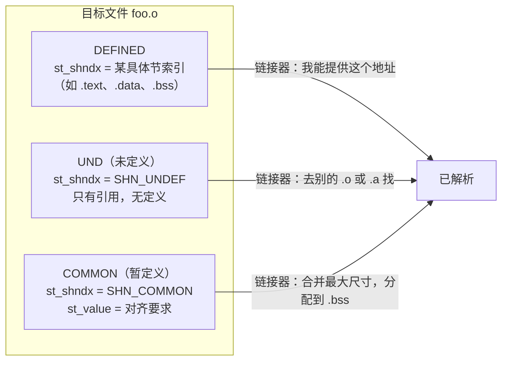
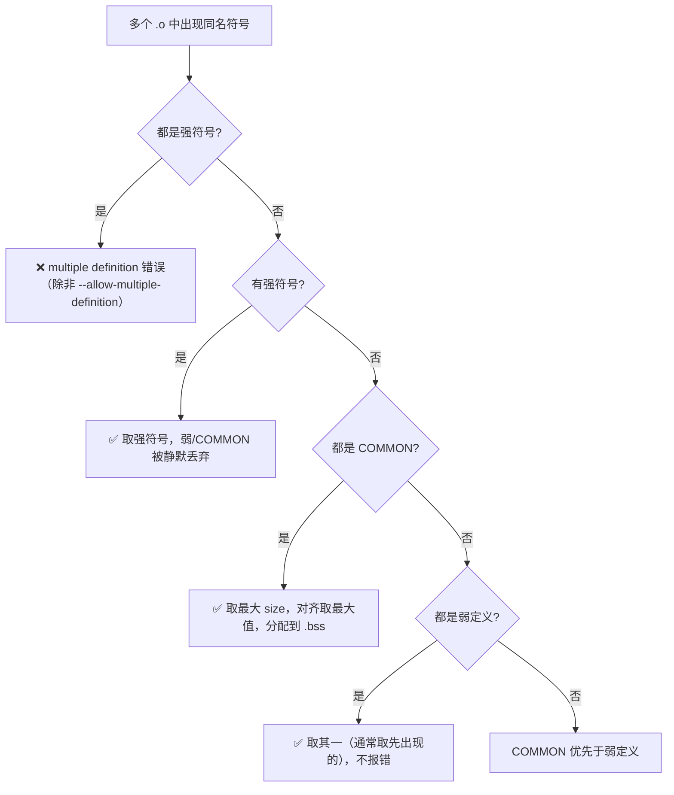
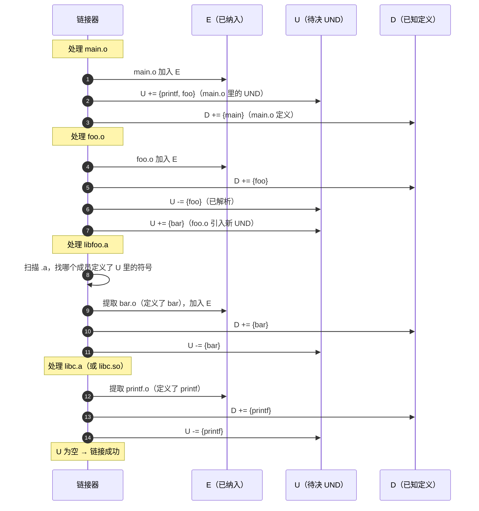

# 链接器详解（3）· 符号与符号解析

> [!abstract] TL;DR
> - **符号是链接的货币**：每个 `.o` 把自己"定义了什么/需要什么"写进符号表（`.symtab`）；链接器把这些碎片拼在一起，本质上就是在**对账**——让每一个"需要"都能找到对应的"定义"。
> - **三态**：一个符号在目标文件里只有三种存在形式——**DEFINED（定义）**、**UND（未定义引用）**、**COMMON（暂定义）**，三态决定了链接器如何处置它。
> - **强弱规则一张表**：两强冲突 → 报错；强覆弱 → 静默取强；多弱共存 → 取其一（或取最大 COMMON）。
> - **解析算法是从左到右的单遍扫描**：链接器维护一个"待决符号集 U"，遇到目标文件就立即消费 U 里的 UND，遇到归档库（`.a`）才按需提取成员——顺序错了就会残留 UND 报错。
> - **链接期 vs 运行期**：本篇所有规则都发生在 `ld` 阶段，作用域是参与链接的目标文件与库；而 [[14.动态链接与加载器详解/06.符号解析与符号查找.md]] 讲的运行期查找，作用域是进程里已加载的 DSO（`.so`）——二者层级不同，规则有交叉也有根本差异。

本篇是「链接器详解」系列的第三篇，承接 [[02.目标文件详解]]（讲清了目标文件由哪些 section 构成），本篇把镜头对准符号表——链接器做决策的核心数据结构。读完本篇，你能：看懂 `nm`/`readelf -s` 的每一列输出；理解 multiple definition/undefined reference 两类经典链接错误的根因；在需要时正确使用 `__attribute__((weak))`；分清链接期符号解析与运行期符号查找的本质区别。

---

## 概述与定位

### 符号是什么

"符号"（symbol）是链接器可以看到的**具名实体**：函数名、全局变量名、节标签……任何需要被其他编译单元引用、或在当前编译单元里引用别处定义的东西，都要通过符号表传达意图。

编译器把每个 `.c` 文件单独翻译成 `.o`，此刻它**不知道**其他 `.c` 里有什么——它只能在自己的符号表里写下"我定义了 `foo`"或"我引用了 `bar`，但它在哪里我不知道"。链接器拿到所有 `.o` 之后，才做全局的"供需匹配"。

### 本篇在系列中的位置

| 维度 | 本篇聚焦 | 相邻篇章 |
|---|---|---|
| 数据结构 | `.symtab` 里的 `Elf64_Sym` 字段与三态 | 结构静态细节见 [[11.ELF文件详解/09.symtab节.md]] |
| 决策规则 | 强弱符号、COMMON、解析算法 | 报错场景见 [[13.链接错误排查]] |
| 链接期重定位 | 符号解析后如何填地址 | 见 [[06.链接期重定位]] |
| 运行期对应物 | 动态链接器的符号查找 | 见 [[14.动态链接与加载器详解/06.符号解析与符号查找.md]] |
| 归档库提取 | `.a` 成员何时被拉入 | 见 [[04.静态库]] |

---

## 原理与机制

### 符号的三态

链接期，一个全局符号在目标文件里只能处于三种状态之一，理解三态是理解一切规则的前提。



**DEFINED（已定义）**
`st_shndx` 指向本文件的某个节（`.text`、`.data`、`.bss`……），`st_value` 是节内偏移（链接后变成虚拟地址）。这是"我拥有这个符号"的声明。

**UND（未定义引用）**
`st_shndx == SHN_UNDEF`，`st_value == 0`。这是"我需要这个符号，但它在别处"的声明——对应 C 里的 `extern` 声明或直接使用而没有定义的情况。链接结束时若仍有未解析的 UND，链接器报 `undefined reference to 'xxx'`。

**COMMON（公共/暂定义）**
`st_shndx == SHN_COMMON`。这是 C 语言**未初始化全局变量**在 `-fcommon` 模式下的特殊编码：
- `st_value` 不是偏移，而是**对齐要求**（alignment，必须是 2 的幂）。
- `st_size` 是期望的字节数。
- 多个文件对同名变量各有一个 COMMON，链接器取**最大的 size 与最严格的对齐**，最终分配到 `.bss`。
- 这使得"多个 C 文件里都写了 `int g;`"不报错——它们是"暂时还没人真正定义"的同一个变量。

> [!note] 为什么会有 COMMON——历史背景
> COMMON 机制源于 Fortran 的 COMMON block，后被 C 采用。早期 C 没有明确要求全局变量"只能定义一次"，允许多个翻译单元各声明 `int g;` 然后共享同一块存储。ELF 的 `SHN_COMMON` 正是对这一语义的编码。现代 C 标准实际上已不鼓励此用法（严格来说多次定义在 C99/C11 标准下属于 UB），POSIX 工具链通过 COMMON 机制容忍了它。

---

### 符号绑定：LOCAL / GLOBAL / WEAK

`st_info` 高 4 位编码**绑定属性**（binding），决定符号在跨文件解析中的可见性与优先级（字段完整细节见 [[11.ELF文件详解/09.symtab节.md]]）：

| 绑定 | 值 | 链接期语义 |
|---|---|---|
| `STB_LOCAL` | 0 | **仅本文件可见**；不参与跨文件解析；`static` 函数/变量的典型编码 |
| `STB_GLOBAL` | 1 | **跨文件可见**；是链接期符号解析的主要对象；普通函数与已初始化全局变量的默认绑定 |
| `STB_WEAK` | 2 | **弱符号**；可被同名强符号覆盖；用于"可选功能"或"可覆盖的默认实现" |

这三种绑定的视觉类比：`LOCAL` 是只在本房间有效的内线电话；`GLOBAL` 是公司总机可查的分机号；`WEAK` 是"有人接就用，没有也没事"的备用号码。

**用 `nm` 查看绑定**：`nm` 用字母大小写区分全局/本地——大写字母表示全局（`T`=.text 函数，`D`=.data 变量，`B`=.bss 变量，`C`=COMMON，`U`=UND），小写字母表示本地（`t`、`d`、`b`……）；`W`/`w` 表示弱符号（有定义为大写 `W`，无定义为小写 `w`）。

---

### 强弱符号规则

"强符号"（strong symbol）= `STB_GLOBAL` 的**已定义**符号（`st_shndx ≠ SHN_UNDEF`，且非 COMMON）。
"弱符号"（weak symbol）= `STB_WEAK` 的定义，或 COMMON 符号。

当多个目标文件里出现同名符号时，链接器按以下规则裁决（与 gABI 规范一致）：



**规则速记（五条）**：

1. **强-强冲突** → `multiple definition` 报错。链接器不会猜你的意图。
2. **强覆盖弱** → 静默取强定义，弱定义被丢弃。
3. **强覆盖 COMMON** → 静默取强定义，COMMON 的空间被丢弃。
4. **多 COMMON 共存** → 取最大 `st_size`、最严格对齐，合并到 `.bss`。
5. **多弱共存** → 链接器任取一个（通常取扫描到的第一个），不报错。具体取哪个依链接器实现与版本（GNU ld 历史上类似 COMMON 取尺寸最大者），不应依赖此行为。

> [!warning] COMMON 的隐患——GCC 10 默认改为 `-fno-common`
> 在 `-fcommon` 模式下（GCC 10 以前的默认值），两个文件里的 `int g;` 会各自产生 COMMON 符号，链接器默默合并——这掩盖了"真正的一次定义原则"被违反的事实。
>
> **GCC 10 起默认 `-fno-common`**（Clang 11 起同）：未初始化全局变量被编译为真正的强定义（进入 `.bss` 节），重复定义会直接触发 **multiple definition 报错**。
>
> 若你维护的老代码在新编译器下突然出现大量 multiple definition 错误，极可能是这个变化。临时解法：加 `-fcommon` 恢复旧行为；正确解法：确保每个全局变量只在一个 `.c` 里定义，其他文件用 `extern` 声明。

---

### COMMON 符号与 -fcommon / -fno-common 实例

```c
/* a.c */
int shared_counter;   /* -fcommon:  COMMON, size=4, align=4 */
                      /* -fno-common: STB_GLOBAL 定义，进 .bss */

/* b.c */
int shared_counter;   /* 同上 */
```

```bash
# -fcommon 时：两个 COMMON，链接器合并，不报错
gcc -fcommon -c a.c b.c
gcc a.o b.o -o prog   # 成功

# -fno-common 时（现代 GCC 默认）：两个强定义，冲突
gcc -fno-common -c a.c b.c
gcc a.o b.o -o prog   # ld: b.o:(.bss+0x0): multiple definition of `shared_counter'
```

> [!warning] 示例输出为示意
> 上面的命令和报错均为代表性示意，非本机实跑；具体错误格式随 ld/LLD 版本略有差异。

验证 COMMON 的存在：

```bash
nm -C a.o | grep shared_counter
```

```text
# 示例输出（代表性，非本机实跑）
0000000000000004 C shared_counter
```

> [!warning] 示例输出为示意

`C` 字母表示 COMMON，后面的数字 `4` 是 `st_size`（字节数），不是地址。

---

## 三平台对照

| 维度 | Linux（GNU ld / LLD，ELF） | Windows（MSVC link，PE/COFF） | macOS（ld64，Mach-O） |
|---|---|---|---|
| 符号表 | `.symtab`（链接期）/ `.dynsym`（运行期） | COFF 符号表（在 `.obj` 里） | `LC_SYMTAB` nlist 数组 |
| 强符号 | `STB_GLOBAL` 已定义 | 普通 `EXTERNAL` 定义 | `N_EXT`（外部可见）定义 |
| 弱符号 | `STB_WEAK`；`__attribute__((weak))` | `__declspec(selectany)`（多重定义选一）；无真正"弱引用"概念 | `.weak_reference` / `.weak_definition`（Mach-O 汇编伪指令） |
| 弱引用无定义 | 地址为 0，链接不报错 | 无对应语义，未定义直接报错 | 地址为 0，链接不报错 |
| COMMON 符号 | `SHN_COMMON`，`-fcommon`/`-fno-common` | 无原生 COMMON；`-fcommon` 下 MinGW 支持 | 无原生 COMMON 概念，编译器把 COMMON 直接放进 `__BSS` |
| 多重强定义 | 报 `multiple definition` | 报 `LNK2005` | 报 `duplicate symbol` |
| 允许多重定义 | `--allow-multiple-definition` | `/FORCE:MULTIPLE` | `-multiply_defined suppress` |
| 查看符号 | `nm`, `readelf -s` | `dumpbin /SYMBOLS`, `link /MAP` | `nm`, `dsymutil`, `otool -tv` |

---

## 数据结构 / 流程详解

### Elf64_Sym 字段与三态的映射

链接期符号表的核心是 `Elf64_Sym`（完整字段定义在 [[11.ELF文件详解/09.symtab节.md]]），三态在字段上的映射如下：

```
                    DEFINED          UND           COMMON
───────────────────────────────────────────────────────────
st_shndx            具体节索引       SHN_UNDEF(0)  SHN_COMMON(0xfff2)
st_value            节内偏移         0             对齐要求（2^n）
st_size             符号字节数       0             期望字节数
st_info（bind）     GLOBAL/WEAK/LOCAL GLOBAL/WEAK  GLOBAL
```

`readelf -s` 输出的 `Ndx` 列对应 `st_shndx`：`UND` 即 `SHN_UNDEF`，`COM` 即 `SHN_COMMON`，数字是节索引。

### 链接期符号解析算法（从左到右单遍扫描）

这是本篇最核心的算法，也是"链接顺序问题"的根源。链接器在内部维护三个集合：

- **E**（Elements）：所有已决定纳入最终输出的目标文件集合
- **U**（Undefined）：当前仍未解析的符号集合（待决集）
- **D**（Defined）：当前已知的定义符号集合

**算法（GNU ld 的实际行为）**：

```
对命令行参数从左到右依次处理：

  如果当前参数是目标文件（.o）：
      把它加入 E
      遍历其符号表：
          - 遇到 DEFINED 符号 sym：
              若 sym 已在 D 中（且都是强符号）→ 报 multiple definition 错误
              否则把 sym 加入 D，并从 U 中移除 sym（若存在）
          - 遇到 UND 符号 sym：
              若 sym 不在 D 中 → 把 sym 加入 U

  如果当前参数是归档库（.a）：
      对库中每个成员 member.o：
          若 member.o 里定义了 U 中任何一个符号：
              → 把 member.o 加入 E，并更新 D、U（同目标文件处理方式）
              → 重新扫描库（因为新加入的 member 可能产生新的 UND）
          否则：
              → 跳过，不纳入 E

处理完所有参数后：
  若 U 非空（还有未解析的 UND 引用）→ 报 undefined reference 错误
```



> **图注**：箭头方向表示"谁向谁操作"。关键点是：归档库（`.a`）被**按需**提取，而目标文件（`.o`）被**无条件**纳入。这也是为什么直接链接若干 `.o` 很少出现"顺序问题"，而 `.a` 的顺序不对就会报 `undefined reference`——详见 [[04.静态库]]。

### 弱符号在解析算法中的特殊处理

弱引用（`STB_WEAK` 的 UND）不驱动归档库成员提取：

```
若 U 里某个符号是弱引用（STB_WEAK UND）：
    链接器不会为此提取 .a 里的成员
    若最终 U 里仍残留该弱引用 → 不报错，地址填 0（或 NULL）
```

这就是"可选依赖"的实现原理：用 `__attribute__((weak))` 声明的外部函数，编译时进 `STB_WEAK UND`，若链接时没找到定义，符号地址为 0，不报错。调用前必须判空：

```c
__attribute__((weak)) void optional_hook(void);

void run(void) {
    if (optional_hook)   /* 必须先判空，否则调用地址 0 直接段错误 */
        optional_hook();
}
```

---

## 代码与命令

### 用 nm 查看符号三态

```bash
# 编译成目标文件，不链接
gcc -fcommon -c example.c -o example.o

# 查看所有符号
nm example.o

# 只看未定义（UND）符号
nm -u example.o

# 只看全局符号（含弱符号）
nm -g example.o

# C++ 时解码 name mangling
nm -C example.o
```

```text
# 示例输出（代表性，非本机实跑）
0000000000000000 T defined_func      ← T=.text 强定义
0000000000000000 D init_global       ← D=.data 已初始化全局
0000000000000004 C common_var        ← C=COMMON 未初始化全局（-fcommon）
                 U external_func     ← U=UND 未定义引用
                 w weak_optional     ← w=弱符号且未定义（小写=本地/弱无定义）
```

> [!warning] 示例输出为示意

### 用 readelf -s 查看完整字段

```bash
readelf -s example.o              # 输出 .symtab
readelf --dyn-syms -W libfoo.so   # 输出 .dynsym（动态符号表，-W 宽模式）
readelf -s -W prog                # 可执行文件的符号表（若未 strip）
```

```text
# 示例输出（代表性，非本机实跑）
Symbol table '.symtab' contains 8 entries:
   Num:    Value          Size Type    Bind   Vis      Ndx Name
     0: 0000000000000000     0 NOTYPE  LOCAL  DEFAULT  UND
     1: 0000000000000000     0 FILE    LOCAL  DEFAULT  ABS example.c
     2: 0000000000000000     0 SECTION LOCAL  DEFAULT    1 .text
     3: 0000000000000000    32 FUNC    GLOBAL DEFAULT    1 defined_func
     4: 0000000000000000     4 OBJECT  GLOBAL DEFAULT    3 init_global
     5: 0000000000000004     4 OBJECT  GLOBAL DEFAULT  COM common_var
     6: 0000000000000000     0 FUNC    GLOBAL DEFAULT  UND external_func
     7: 0000000000000000     0 FUNC    WEAK   DEFAULT  UND weak_optional
```

> [!warning] 示例输出为示意
> `Ndx=COM` 即 `SHN_COMMON`；`Ndx=UND` 即 `SHN_UNDEF`；`Bind=WEAK`+`Ndx=UND` = 弱引用（无定义时地址为 0）；`Bind=WEAK`+`Ndx=具体节` = 弱定义（有实现但可被强符号覆盖）。

### __attribute__((weak)) 示例

> [!warning] 使用弱符号须知
> `__attribute__((weak))` 是 GCC/Clang 扩展，不是 C 标准。MSVC 没有对等语法（最接近的是 `/ALTERNATENAME` 链接器选项，或 `__declspec(selectany)` 用于多重定义场景）。弱引用地址可能为 0，调用前**必须判空**，否则会触发未定义行为/段错误。

```c
/* plugin_api.h */
/* 声明一个"可选钩子"：若宿主程序提供了实现则调用，否则跳过 */
__attribute__((weak)) void on_event(const char *name);

/* host.c（宿主程序，不提供 on_event 实现） */
#include "plugin_api.h"
void trigger(void) {
    if (on_event)          /* 弱引用，无定义时地址为 0，必须判空 */
        on_event("click");
}

/* plugin.c（插件，提供 on_event 强定义） */
void on_event(const char *name) {
    /* 这个强定义会覆盖 host.c 里的弱引用 */
    printf("event: %s\n", name);
}
```

链接两种情形：

```bash
# 情形一：不链接 plugin.o → on_event 地址为 0，trigger() 里的判空生效，不崩溃
gcc host.c -o host_only

# 情形二：链接 plugin.o → 强定义胜出，on_event 指向真实实现
gcc host.c plugin.c -o host_with_plugin
```

> [!warning] 示例输出为示意

---

## 链接期解析 vs 运行期解析：本质区别

这两个"符号解析"发生在完全不同的阶段，常被混淆：

| 维度 | 链接期解析（`ld`） | 运行期解析（`ld.so`） |
|---|---|---|
| 时机 | 构建时，生成可执行文件/库时 | 程序启动时（或首次调用时） |
| 作用域 | 参与 `ld` 命令行的所有 `.o`/`.a`/`.so` | 进程里已加载的所有 DSO（`.so`）构成的作用域链 |
| 输入数据结构 | `.symtab`（`SHT_SYMTAB`，含 LOCAL 符号） | `.dynsym`（`SHT_DYNSYM`，仅含跨模块动态符号）+ `.gnu.hash` |
| 强弱规则 | gABI 五条规则（见上文） | "先定义者赢"（first-definition wins）；`STB_WEAK` 被 `STB_GLOBAL` 覆盖 |
| 未定义处理 | 强引用 UND → 报错；弱引用 UND → 地址 0 | `STB_WEAK` 引用无定义 → 地址 0；`STB_GLOBAL` 引用无定义 → 报运行时错误 |
| 归档库处理 | `.a` 成员按需提取（由 U 驱动） | `.so` 全量加载，不按需提取成员 |
| 结果写入 | 重定位表项 → 写入最终二进制 | GOT/PLT 槽位 → 写入进程内存 |
| 工具 | `nm`、`readelf -s`、`ld -Map` | `LD_DEBUG=symbols`、`readelf --dyn-syms`、`ldd` |
| 详细内容 | 本篇 | [[14.动态链接与加载器详解/06.符号解析与符号查找.md]] |

**一个常见误区**：以为 `-fvisibility=hidden` 或 `__attribute__((visibility("hidden")))` 影响链接期解析——不是。这两个机制控制的是符号是否**进入 `.dynsym`**（是否对运行期的跨 DSO 查找可见），链接期的 `.symtab` 仍然完整包含所有符号。`hidden` 符号在链接期该怎么解析还是怎么解析，只是最终不会被 `ld.so` 在运行期查到。

---

## 陷阱与常见错误

### 陷阱 1：链接顺序错误导致 undefined reference

```bash
# 错误：库放在引用它的目标文件之前
# 链接器扫到 -lfoo 时，U（待决集）尚为空（main.o 还没被处理），整库被跳过；
# 之后 main.o 产生对 foo_func 的 UND，再也无人解析 → undefined reference
gcc -lfoo main.o

# 正确：库放在引用它的目标文件之后（被依赖者放后面）
# main.o 先入 E，其 UND 进入 U；链接器再扫 -lfoo 时 U 非空，才按需提取成员解析
gcc main.o -lfoo
```

如果存在循环依赖，用 `--start-group`/`--end-group`（GNU ld）让链接器对这段库循环扫描：

```bash
gcc main.o -Wl,--start-group -lbar -lfoo -Wl,--end-group
```

（LLD 支持相同语法；MSVC link 无对应选项，需手动多次指定或用 `/WHOLEARCHIVE`。）

### 陷阱 2：-fcommon vs -fno-common 升级踩坑

如上文所述，GCC 10+ 默认 `-fno-common`，老代码里的"多文件共享 COMMON 变量"会突然报 multiple definition。诊断步骤：

```bash
# 找出所有定义了同名变量的文件
nm -A *.o | grep ' [CBDT] shared_counter'
```

> [!warning] 示例输出为示意

修复：选定唯一定义文件，其余文件改为 `extern` 声明。

### 陷阱 3：弱符号遮蔽了强符号

```c
/* libutil.c（库里的实现） */
__attribute__((weak)) void log_impl(const char *s) { /* 默认空实现 */ }

/* app.c（应用层） */
/* 忘记提供 log_impl 的定义 → 链接后调用到空实现，功能静默失效 */
```

链接器不报错，但行为不对。用 `nm` 或 `readelf -s` 确认最终二进制里 `log_impl` 的绑定和地址来自哪个 `.o`。

### 陷阱 4：弱引用不判空直接调用

见上文 `__attribute__((weak))` 示例，弱引用地址可能为 0，直接调用会段错误。

### 陷阱 5：--whole-archive 改变 .a 提取语义

```bash
gcc main.o -Wl,--whole-archive libplugin.a -Wl,--no-whole-archive
```

`--whole-archive` 强制把 `.a` 里**所有**成员纳入 E，不管 U 里是否有对应 UND——常用于需要静态注册/初始化的插件场景。副作用是大量不需要的代码被纳入，可用 `--gc-sections` 配合 `-ffunction-sections -fdata-sections` 清理掉未引用的节（详见 [[05.节的合并与布局]]）。

---

## 实操速查

### 场景：诊断 undefined reference

```bash
# 1. 找到哪个 .o 引用了这个符号（UND）
nm -u *.o | grep missing_sym

# 2. 找到哪个 .o 或 .a 定义了这个符号
nm -g libfoo.a | grep missing_sym
readelf -s libfoo.so | grep missing_sym

# 3. 确认链接顺序（GNU ld 详细日志）
ld --verbose ... 2>&1 | grep missing_sym
```

> [!warning] 示例输出为示意

### 场景：诊断 multiple definition

```bash
# 找出所有定义了某符号的输入文件
nm -A *.o libfoo.a | grep ' [TDB] conflicting_sym'
```

> [!warning] 示例输出为示意

### 场景：确认弱符号最终绑定

```bash
nm -C ./prog | grep weak_sym
# W 大写 = 有强/弱定义；w 小写 = 无定义（地址为 0）
```

> [!warning] 示例输出为示意

### 工具速查

| 目的 | 命令 | 看什么 |
|---|---|---|
| 所有符号 + 三态 | `nm example.o` | 字母大/小写、`C`/`U`/`W`/`w` |
| 完整字段 | `readelf -s example.o` | `Ndx=UND/COM`，`Bind=WEAK/GLOBAL/LOCAL` |
| 只看 UND | `nm -u example.o` 或 `readelf -s example.o \| grep UND` | 未决的引用 |
| 动态符号（运行期） | `readelf --dyn-syms -W libc.so` | 运行期可被查找的符号 |
| 最终符号来源 | `nm -A ./prog` | 前缀是文件名，追踪符号来自哪里 |
| 链接 Map | `gcc ... -Wl,-Map=prog.map` | 每个符号最终来自哪个 `.o`/`.a` |
| MSVC 等价 | `dumpbin /SYMBOLS foo.obj` | COFF 符号表 |

---

## 小结

1. **三态是理解一切规则的起点**：DEFINED（有实现）、UND（纯引用）、COMMON（暂定义）——三态决定了链接器如何处置一个符号。

2. **强弱五条规则**：两强冲突报错；强覆弱静默；多 COMMON 取最大；多弱任取一。GCC 10+ 默认 `-fno-common` 让 COMMON 消失，未初始化全局变量变成真正的强定义，避免了历史上的静默多重定义陷阱。

3. **解析算法是单遍左到右**：目标文件（`.o`）无条件纳入；归档库（`.a`）只在能解决 U 中 UND 时才提取成员——这是"链接顺序至关重要"的根本原因，详见 [[04.静态库]]。

4. **弱符号 = 可覆盖的默认实现 / 可选依赖**：`__attribute__((weak))` 让符号在无定义时地址为 0；调用前**务必判空**；运行期符号查找的弱语义与此平行但发生于不同层级。

5. **链接期 vs 运行期**：链接期作用域是参与 `ld` 命令行的全部输入文件，结果写入重定位表；运行期作用域是进程里所有已加载 DSO，结果写入 GOT——两个"符号解析"除规则有相似之处外，数据结构、时机、范围都完全不同，参见 [[14.动态链接与加载器详解/06.符号解析与符号查找.md]]。

---

## 相关阅读

- **符号表字段完整参考**（`Elf64_Sym`、绑定/类型/可见性枚举值）：[[11.ELF文件详解/09.symtab节.md]]
- **运行期符号解析**（全局作用域链、`.gnu.hash`、`LD_DEBUG=symbols`）：[[14.动态链接与加载器详解/06.符号解析与符号查找.md]]
- **上篇：目标文件结构**（section 布局、COMDAT、重定位占位）：[[02.目标文件详解]]
- **下篇：静态库与链接顺序**（`.a` 按需提取的坑）：[[04.静态库]]
- **链接期重定位**（符号解析后如何计算并填入地址）：[[06.链接期重定位]]
- **符号可见性与版本控制**（`STV_HIDDEN`、version script）：[[09.符号可见性与版本]]
- **链接错误排查**（undefined reference / multiple definition 系统诊断）：[[13.链接错误排查]]

---

⬅️ 上一篇 [[02.目标文件详解]] ｜ 🏠 [[00.链接器详解总览]] ｜ 下一篇 [[04.静态库]] ➡️
