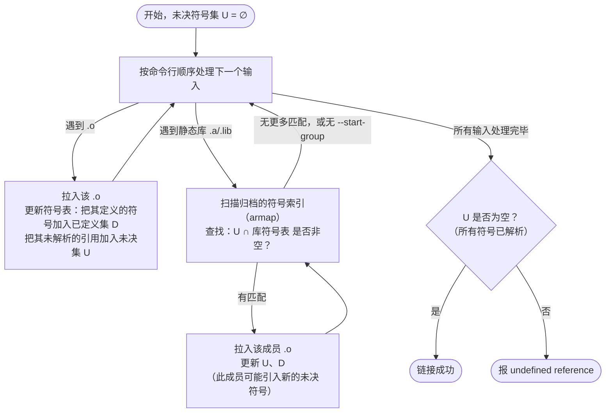
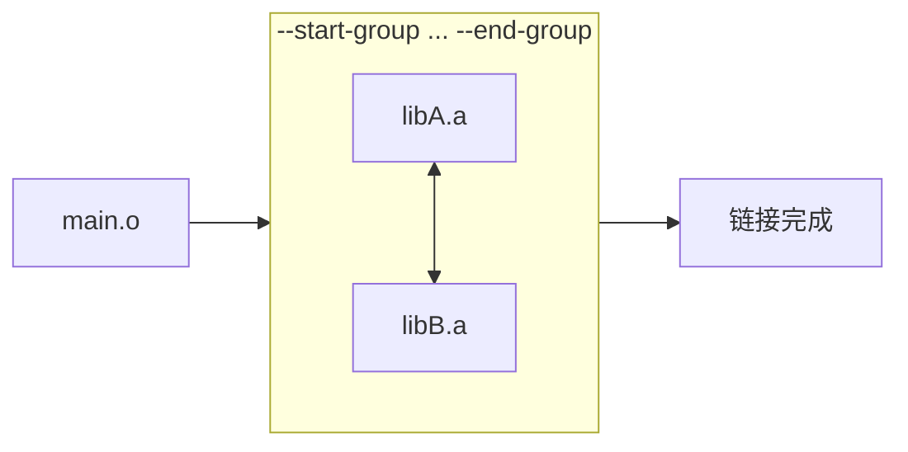

# 链接器详解（4）· 静态库

> [!abstract] TL;DR
> - **静态库**（Linux/macOS `.a`，Windows `.lib`）本质是**打了一层 `ar` 归档外皮的 `.o` 文件集合**，自带符号索引表（`armap` / `__SYMDEF` / COFF linker member），让链接器能 O(1) 定位哪个成员定义了某个符号。
> - **按需提取（on-demand extraction）**是静态链接的灵魂：链接器**不拉入整库**，只拉入"当前未决符号中有定义"的成员——拉入一个成员后，其新引入的未决符号可能又触发拉入下一个成员，依次传播，直到收敛。
> - **链接顺序至关重要**：库必须放在**引用它的目标之后**。否则扫到库时还没有未决符号触发提取，库成员被静默跳过，最终报 `undefined reference`。循环依赖用 `--start-group`/`--end-group`（或 `-(` / `-)`）解决，代价是多次扫描。
> - **`--whole-archive`** 跳过按需语义，强制把归档内所有成员都拉入链接，常用于插件注册、静态初始化或确保全量覆盖。
> - 静态库与动态库的取舍是六维工程权衡，详见 [[14.动态链接与加载器详解/01.从静态链接到动态链接.md]]。

本篇是「链接器详解」第 04 篇，承接 [[03.符号与符号解析]] 对符号表与解析算法的基础，深入探讨链接器处理静态库的全过程——从 `.a` 的归档结构，到符号索引的物理实现，到按需提取的传播语义，到顺序依赖与循环依赖的工程陷阱。**本篇讲"链接期"归档的拉入机制；库装进内存后的运行期行为，参见 [[14.动态链接与加载器详解/01.从静态链接到动态链接.md]]。**

---

## 概述与定位

### 为什么要有静态库

在大型工程里，`libc` 这样的基础库通常由数百个独立的 `.o` 文件组成：`printf.o`、`malloc.o`、`strlen.o`…… 如果链接时需要逐一手工列出每个 `.o`，不仅繁琐，还会拉入大量程序根本不需要的代码。静态库（static library / archive）提供了优雅的解法：

1. **打包**：把多个 `.o` 文件归档成一个 `.a`（或 `.lib`），一条 `-lfoo` 搞定引用。
2. **按需提取**：链接器只从归档里拉入"能解决当前未决符号"的成员，不用的 `.o` 一字不进最终产物。
3. **内置符号索引**：归档内嵌符号映射表，链接器无需全部读取所有 `.o` 就能快速定位哪个成员拥有某符号。

这三点加在一起，使静态库成为"模块化而不臃肿"的标准交付单元。

### 本篇在系列中的位置

| 维度 | 本篇聚焦 | 相邻篇章 |
|---|---|---|
| 符号来源 | 静态库成员的符号如何被按需拉入 | 符号本身的定义/强弱/多重规则见 [[03.符号与符号解析]] |
| 布局结果 | 拉入后各成员的节如何被合并 | 输入节→输出节合并见 [[05.节的合并与布局]] |
| 静态 vs 动态 | 两种库的取舍权衡 | 全景对比见 [[14.动态链接与加载器详解/01.从静态链接到动态链接.md]] |
| 构建系统 | `add_library(... STATIC ...)` 的 CMake 配置 | CMake 全景见 [[42.Cmake/00 - CMake 完整技术教程 - 总索引.md]] |

---

## 原理与机制

### `.a` 归档的物理结构

Linux/macOS 的静态库是标准 `ar` 格式归档（BSD ar / GNU ar，有细微变体）。用十六进制/文本看头部：

```text
!<arch>
/               1742000000  0     0     0         100       `
<符号索引数据>
//              1742000000  0     0     0         200       `
<长文件名表>
a.o/            1742000000  0     0     100644    1024      `
<a.o 的完整内容>
b.o/            ...
```

每个成员（member）前有一个 **60 字节的头（`ar_hdr`）**：

```c
struct ar_hdr {
    char ar_name[16];    // 成员名（"a.o/", "/", "//"）
    char ar_date[12];    // 修改时间（十进制 UNIX 时间戳，用于 --date-deterministic）
    char ar_uid[6];      // 所有者 UID
    char ar_gid[6];      // 所有者 GID
    char ar_mode[8];     // 权限（八进制）
    char ar_size[10];    // 成员数据字节数
    char ar_fmag[2];     // 终止标记，恒为 "`\n"（0x60 0x0A）
};
```

所有字段都是 **ASCII 字符串**，无二进制，便于历史工具（古老的 `ar` 命令）文本解析。

### 符号索引：`armap` / `SYMDEF` / COFF linker member

符号索引是让链接器高效工作的关键。三平台实现方式不同但思路一致：

#### Linux / GNU ar — 特殊成员 `/`

GNU ar（也是 LLVM `llvm-ar` 的默认格式）在归档开头放一个名为 `/` 的特殊成员，称为 **symbol table（armap）**：

```text
格式（大端序 uint32_t）：
  [符号数量 N]
  [成员 1 的文件偏移]  [成员 2 的文件偏移] ... [成员 N 的文件偏移]
  [符号 1 的字符串][\0]  [符号 2 的字符串][\0] ... [符号 N 的字符串][\0]
```

其中"成员 X 的文件偏移"直接是**归档内的字节偏移**，指向包含该符号定义的成员头部。链接器查一个符号时：

1. 在 `/` 成员的字符串区做 O(N) 线性扫描（或 hash 变体）找到符号名对应的偏移。
2. `lseek` 到该偏移，读 `ar_hdr` + 对应 `.o` 内容。
3. 处理该 `.o` 的符号和节，完成拉入。

> [!note] 两种 GNU armap 变体
> GNU ar 默认产生"大端 uint32_t 的 `/` 成员"；部分工具（尤其是 LLVM `llvm-ar -format=bsd`）产生 **BSD armap**（成员名为 `__.SYMDEF` 或 `__.SYMDEF SORTED`，使用**主机字节序（现代 macOS 为小端）**，但结构略有出入）。`ranlib` 命令本质上就是"为归档（重新）生成这个符号索引"——如果你手工用 `ar r` 添加成员后忘了 `ranlib`，链接器可能看到过时的索引而漏掉新符号。

#### macOS / BSD ar — `__.SYMDEF` / `__.SYMDEF SORTED`

macOS `ar` 产生 **BSD ar** 格式，符号索引成员名为 `__.SYMDEF`（如果已排序则为 `__.SYMDEF SORTED`）。排序版的好处是链接器可对符号名做二分查找，加速大型归档查询：

```text
__.SYMDEF SORTED 格式：
  [ranlib 数量 × 4 bytes]
  (symb_offset, member_offset) × ranlib 数量   ← 按 symb_offset 排序
  [字符串表长度 × 4 bytes]
  [字符串表数据（null-separated）]
```

`ranlib` 命令（macOS 上与 `ar s` 等效）在增删成员后重建该索引；`ar -rs` 一步完成"更新+建索引"。

#### Windows / COFF — 两个 linker members + longnames

COFF 归档（MSVC `lib.exe` 产出）也用类似 `ar` 的 Archive 格式（Magic `!<arch>`），但**前两个特殊成员**完全不同：

| 特殊成员位置 | 名称 | 作用 |
|---|---|---|
| 第一个成员 | `/`（First Linker Member） | 历史兼容：大端序偏移表 + 符号名表（已废弃用于直接链接，仍存在） |
| 第二个成员 | `/`（Second Linker Member） | 排序后的小端序偏移索引 + 符号名表；MSVC `link.exe` 实际用这个 |
| 第三个成员（可选） | `//`（Longnames Member） | 文件名超过 15 字节的长名表 |

`dumpbin /linkermember:1` 和 `/linkermember:2` 分别查看这两个成员。`ar t` / `nm -s` 类比于 `dumpbin /symbols` + `dumpbin /linkermember`。

---

## 三平台对照

| 维度 | Linux（GNU/LLVM）| macOS（Apple ar）| Windows（MSVC）|
|---|---|---|---|
| 静态库扩展名 | `.a` | `.a` | `.lib` |
| 归档格式 | GNU ar / BSD ar | BSD ar | COFF archive（同 `!<arch>` magic） |
| 符号索引成员 | `/`（GNU armap，大端 uint32_t） | `__.SYMDEF SORTED`（BSD armap，主机字节序，现代 macOS 为小端） | 第二个 `/`（Second Linker Member，小端） |
| 重建索引命令 | `ranlib` 或 `ar s` | `ranlib` 或 `ar s`（同 BSD） | `lib.exe` 自动维护，`lib /OUT:foo.lib ...` |
| 查看符号索引 | `nm -s libfoo.a` | `nm -s libfoo.a` | `dumpbin /linkermember:2 foo.lib` |
| 列出成员 | `ar t libfoo.a` | `ar t libfoo.a` | `lib /list foo.lib` 或 `dumpbin /list` |
| 按需提取标志 | 默认 on | 默认 on | 默认 on（`/NODEFAULTLIB` 可影响） |
| 全量拉入 | `--whole-archive` | `-force_load libfoo.a` | `/WHOLEARCHIVE:foo.lib`（MSVC 2015+） |
| 循环依赖解法 | `--start-group ... --end-group` | 无原生 group（手动重复或 `--all_load` 全量） | MSVC `link.exe` 多轮库扫描，较宽松 |
| CMake 封装 | `target_link_libraries(... -Wl,--whole-archive foo)` | `target_link_libraries(... -Wl,-force_load,foo)` | `target_link_libraries(... /WHOLEARCHIVE:foo)` |
| 检查工具 | `readelf -a`、`objdump -t`、`nm -s` | `otool -I`、`nm -s` | `dumpbin /symbols`、`dumpbin /linkermember` |

> [!note] Windows `.lib` 有两种，必须区分
> Windows 上同样以 `.lib` 结尾的文件：**静态库**（含真实 `.obj` 目标代码的 COFF archive，链接后代码进 `.exe`）与**导入库**（import library，只含指向 `.dll` 的桩与导入表条目，不含代码）。区分方法：`dumpbin /headers foo.lib` 看有无 `IMAGE_FILE_HEADER`，或看 `/linkermember` 符号里有无 `__imp_xxx` 前缀（导入库特征）。静态库符号直接是函数名，无 `__imp_` 前缀。细节见 [[14.动态链接与加载器详解/01.从静态链接到动态链接.md]] 对 Windows 导入机制的对照。

---

## 数据结构 / 流程详解

### 按需提取语义（on-demand extraction）

按需提取是静态库区别于直接列 `.o` 的核心语义。链接器处理命令行时，按**从左到右**的顺序处理输入：



> 图解：链接器对每个 `.a` 做"扫描—拉入—再扫描"的迭代，直到当轮无新成员被触发（收敛）。关键细节：**扫到库时若 U=∅（没有任何未决符号），整个库被跳过**——这正是链接顺序之坑的根源。

算法与 [[03.符号与符号解析]] 中链接器符号解析的三阶段流程（"收集→解析→报错"）强相关：这里的"扫描 armap"正是符号解析阶段对归档的延伸。

### 传播示例

设 `libfoo.a` 含三个成员：

| 成员 | 定义符号 | 引用符号（未决） |
|---|---|---|
| `a.o` | `funcA` | `funcB` |
| `b.o` | `funcB` | `funcC` |
| `c.o` | `funcC` | — |

链接命令：

```bash
gcc main.o -L. -lfoo
```

传播过程：

1. **处理 `main.o`**：拉入，设 `main` 引用了 `funcA`。`U = {funcA}`，`D = {main}`。
2. **处理 `-lfoo`（`libfoo.a`）**：
   - 第 1 轮扫描：`U ∩ {funcA, funcB, funcC}` = `{funcA}` → 拉入 `a.o`。`D` 加入 `funcA`，`U` 加入 `funcB`（`a.o` 的新引用）。`U = {funcB}`。
   - 第 2 轮扫描：`U ∩ {funcB, funcC}` = `{funcB}` → 拉入 `b.o`。`D` 加入 `funcB`，`U` 加入 `funcC`。`U = {funcC}`。
   - 第 3 轮扫描：`U ∩ {funcC}` = `{funcC}` → 拉入 `c.o`。`D` 加入 `funcC`，`U = ∅`。
   - 第 4 轮扫描：无更多匹配，收敛。
3. **链接成功**，`U = ∅`。

若 `libfoo.a` 里还有 `d.o`（定义了 `funcD`，但没人引用），**`d.o` 永远不被拉入**，最终产物里没有 `funcD` 的任何字节——这正是"按需"的意义，让最终可执行文件保持精简。

### 链接顺序之坑

**核心规则：库必须放在引用它的目标文件之后。**

```bash
# 正确：main.o 在 libfoo.a 之前
gcc main.o -L. -lfoo

# 错误：-lfoo 在 main.o 之前
gcc -lfoo main.o      # 扫到 libfoo.a 时 U=∅，整库被跳过 → 后面 main.o 引入 funcA → undefined reference
```

这是初学者最常踩的坑，且错误信息非常迷惑——报的是 `undefined reference to funcA`，根因却是库摆的位置错了。

> [!warning] 真实错误示例（示意）
> ```
> /usr/bin/ld: main.o: undefined reference to `funcA'
> collect2: error: ld returned 1 exit status
> ```
> 此时 `funcA` 明明在 `libfoo.a` 里，错误的根因是 `-lfoo` 出现在 `main.o` 之前。调换顺序为 `gcc main.o -lfoo` 即可消除。相关排查手法见 [[13.链接错误排查]]（本系列）。

**更隐蔽的坑：多库之间的顺序依赖。** 设 `libA.a` 里的 `a.o` 引用了 `libB.a` 里的 `funcB`：

```bash
# 正确
gcc main.o -lA -lB

# 错误（-lB 在 -lA 之前）
gcc main.o -lB -lA   # 扫完 -lB 时 funcB 还没有未决引用，b.o 被跳过
```

### 循环依赖：`--start-group` / `--end-group`

当 `libA.a` 与 `libB.a` 相互依赖（`a.o` 引用 `funcB`，`b.o` 引用 `funcA`），任何单一顺序都无法一轮扫描解决。GNU ld 和 LLD 提供 **`--start-group` / `--end-group`**（简写 `-(` / `-)`）：

```bash
gcc main.o -Wl,--start-group -lA -lB -Wl,--end-group

# 等价写法（GNU ld 简写）
gcc main.o -Wl,--start-group -lA -lB -Wl,--end-group
```

`--start-group ... --end-group` 让链接器对括号内的所有库**反复扫描，直到一轮扫描内没有任何新成员被拉入**（即 U 不再增长）。代价是 O(N×M) 最坏复杂度（N=库数量，M=平均成员数），大型项目慎用。



> [!warning] CMake 的 `-Wl,--start-group` 写法
> 在 CMake 里不能直接写 `--start-group`，需要通过 `target_link_options` 或特殊 `$<LINK_GROUP:>` 生成器表达式（CMake 3.24+）：
> ```cmake
> target_link_libraries(myapp
>     PRIVATE
>     "$<LINK_GROUP:RESCAN,libA,libB>"
> )
> ```
> CMake 3.24 以前通常手动拼：
> ```cmake
> target_link_libraries(myapp PRIVATE
>     -Wl,--start-group libA libB -Wl,--end-group
> )
> ```
> 详见 [[42.Cmake/00 - CMake 完整技术教程 - 总索引.md]]。

macOS ld64 **不支持** `--start-group`/`--end-group`；循环依赖通常用 `-all_load`（全量拉入，等同 `--whole-archive`）或重构库消除循环。

MSVC `link.exe` 对库的处理更宽松——它默认对库做**多轮扫描**，不严格要求顺序，很多在 GNU ld 下顺序错误的命令在 MSVC 下能正常工作。这导致"在 Windows 上 OK、迁移到 Linux 就 undefined reference"的跨平台陷阱。

### `--whole-archive`：强制全量拉入

`--whole-archive`（GNU ld / LLD）跳过按需语义，强制把紧跟其后的归档的**所有成员**都拉入链接，不管是否有未决符号触发：

```bash
gcc main.o -Wl,--whole-archive -lfoo -Wl,--no-whole-archive -lbar
#                              ^^^^^^^^^^^^^^^^^^^^^^^^^^^^^^^^
#  libfoo.a 的所有成员全拉入，libbar.a 恢复按需
```

**典型用途**：
1. **自注册插件/工厂模式**：`.o` 里有全局对象，构造函数在静态初始化阶段将自身注册进某个工厂表。若没有显式引用，按需提取不会拉入这些 `.o`，注册永远不发生。`--whole-archive` 强制拉入，确保注册链运行。
2. **静态库转动态库**：`gcc -shared -o libfoo.so -Wl,--whole-archive libfoo.a -Wl,--no-whole-archive`，把 `.a` 的全部代码打进 `.so`。
3. **单元测试**：确保所有测试函数都被注册，不因无引用而被跳过。

三平台等价选项：

| 平台 | 全量拉入选项 |
|---|---|
| Linux（GNU ld / LLD） | `-Wl,--whole-archive` … `-Wl,--no-whole-archive` |
| macOS（ld64） | `-Wl,-force_load,libfoo.a`（单库）或 `-Wl,-all_load`（全部库，慎用） |
| Windows（MSVC link） | `/WHOLEARCHIVE:foo.lib`（MSVC 2015 Update 2+） |

---

## 代码与命令

### 创建静态库

```bash
# 编译目标文件
gcc -c a.c -o a.o
gcc -c b.c -o b.o

# 打归档 + 建符号索引
ar rcs libfoo.a a.o b.o
#  r = insert/replace members
#  c = create if not exists
#  s = write armap（等同事后 ranlib）
```

等价的两步写法：

```bash
ar rc libfoo.a a.o b.o   # 打包但不建索引
ranlib libfoo.a          # 单独建/更新符号索引
```

`ar rcs` 是最常见一步到位写法，`ranlib` 在 CI 增量构建中可用于确保索引与成员同步。

### 查看静态库

```bash
# 列出所有成员
ar t libfoo.a

# 列出成员 + 符号表
nm -s libfoo.a

# 列出成员的详细符号（每个 .o 的定义/未定义）
nm --print-armap libfoo.a

# 查看某成员的节/符号
ar p libfoo.a a.o | objdump -d /dev/stdin   # GNU/Linux
```

> [!warning] 示例输出为示意
> 下面的输出均为**代表性示意**，非本机实跑（本机为 Windows，不直接执行 Linux 工具）：
>
> ```text
> $ ar t libfoo.a
> a.o
> b.o
>
> $ nm -s libfoo.a
>
> Archive index:
> funcA in a.o
> funcB in b.o
> helperX in b.o
>
> a.o:
> 0000000000000000 T funcA
>                  U funcB
>
> b.o:
> 0000000000000000 T funcB
> 0000000000000000 t helperX
> ```
>
> `Archive index:` 即 armap 的内容：符号名 → 所在成员。`T` = text 段定义的全局符号，`t` = text 段局部符号（不进 armap），`U` = 未定义引用。

### 链接静态库

```bash
# 标准用法：-L 指定库目录，-l 指定库名（不含 lib 前缀和 .a 后缀）
gcc main.o -L. -lfoo

# 等价：直接给路径（绕过 -L/-l 的搜索规则）
gcc main.o ./libfoo.a

# --whole-archive 示例
gcc main.o -Wl,--whole-archive -lfoo -Wl,--no-whole-archive

# 循环依赖
gcc main.o -Wl,--start-group -lA -lB -Wl,--end-group
```

> [!warning] 示例输出为示意
> 上述命令形式标准，但具体链接成功与否取决于符号是否正确定义。实际输出可能含 `ld: warning` 或 `undefined reference`，以本机真实运行为准。

### Windows MSVC 等价命令

```cmd
:: 创建静态库
cl /c a.c b.c
lib /OUT:foo.lib a.obj b.obj

:: 链接静态库
link /OUT:main.exe main.obj foo.lib

:: 全量拉入
link /OUT:main.exe main.obj /WHOLEARCHIVE:foo.lib

:: 查看成员
lib /LIST foo.lib
dumpbin /symbols foo.lib
dumpbin /linkermember:2 foo.lib   :: 第二个 linker member（排序符号索引）
```

> [!warning] 示例输出为示意
> Windows 侧命令亦未在本机实跑，以本地 MSVC 工具链实际输出为准。

---

## 实操：用工具观察拉入行为

### 1. 用 `--verbose` 看哪些成员被拉入

```bash
gcc main.o -L. -lfoo -Wl,--verbose 2>&1 | grep "including member"
```

> [!warning] 示例输出为示意
> ```text
> attempt to open ./libfoo.a succeeded
> (./libfoo.a)a.o: including member
> (./libfoo.a)b.o: including member
> ```
> `--verbose` 会输出链接脚本和详细的库处理记录；`grep "including member"` 筛出被拉入的成员，`c.o` 不出现则说明它没被拉入。

### 2. 用 `readelf` / `nm` 验证产物

```bash
# 查最终可执行文件有无 funcD（期望 libfoo.a 里的未引用符号不出现）
nm -D a.out | grep funcD     # 无输出 = 正确，按需提取工作
nm -D a.out | grep funcC     # 有输出 = funcC 被通过依赖链传播拉入
```

> [!warning] 示例输出为示意
> `nm -D` 查动态符号；若是纯静态可执行文件用 `nm a.out`（无 `-D`）。

### 3. macOS 的 `otool` 等价

```bash
# 查归档成员
ar t libfoo.a              # 与 Linux 相同
nm -s libfoo.a             # armap

# 链接时全量拉入某个 .a
clang main.o -force_load ./libfoo.a -o main
```

---

## 陷阱与最佳实践

### 陷阱一：`ranlib` 失效

手动 `ar r libfoo.a new.o` 添加成员后，若忘记 `ranlib libfoo.a`（或 `ar s`），符号索引停留在旧状态——`new.o` 的符号不在 armap 里。链接器扫到 armap 找不到匹配，**不报错、直接跳过**，最终 `undefined reference`，原因极难定位。

**最佳实践**：始终用 `ar rcs`（带 `s` 选项），或在 Makefile/CMake 里把 `ranlib` 纳入静态库构建目标。

### 陷阱二：顺序敏感 vs MSVC 宽松

如上文所述，MSVC `link.exe` 默认多轮扫描，GNU ld/LLD 默认严格单轮。跨平台项目应对所有顺序敏感问题给出显式修复（调整顺序、`--start-group`），不应依赖 MSVC 的宽松行为。

### 陷阱三：`--whole-archive` 的污染

`-Wl,--whole-archive -lfoo -Wl,--no-whole-archive` 的 `--no-whole-archive` 必须写。若遗漏，后面列出的所有库（包括系统库 `-lc`）都变成全量拉入，导致符号冲突（multiple definition）或二进制体积激增。

### 陷阱四：弱符号被覆盖

`--whole-archive` 拉入整个库，可能导致库里某个弱符号（`__attribute__((weak))`）的定义与 `.o` 里的强符号冲突——取决于链接器选哪个，行为与按需提取不一致。参见 [[03.符号与符号解析]] 强/弱符号规则。

### 最佳实践速查

| 场景 | 推荐做法 |
|---|---|
| 日常静态库 | `ar rcs`（一步打包+建索引） |
| 增量添加成员后 | `ar rs`（更新+重建索引） |
| 循环依赖（Linux/LLD） | `--start-group`/`--end-group` |
| 循环依赖（macOS） | 重构消环，或 `-all_load`（全局，慎用） |
| 全量拉入单个库 | `--whole-archive libfoo.a --no-whole-archive` |
| 全量拉入（macOS） | `-force_load libfoo.a` |
| 全量拉入（MSVC） | `/WHOLEARCHIVE:foo.lib` |
| 诊断拉入了哪些成员 | `gcc ... -Wl,--verbose 2>&1 \| grep member` |
| 诊断最终产物符号 | `nm a.out \| grep <符号名>` |

---

## 静态库 vs 动态库取舍

本节给出关键对照，全面权衡见 [[14.动态链接与加载器详解/01.从静态链接到动态链接.md]]。

| 维度 | 静态库 `.a`/`.lib` | 动态库 `.so`/`.dylib`/`.dll` |
|---|---|---|
| 磁盘 / 进程内存 | 代码内嵌，每个可执行文件一份 | 代码文件共享，多进程物理页复用 |
| 升级打补丁 | 需要重新链接全部依赖方 | 替换共享库即可，依赖 ABI 兼容 |
| 启动开销 | 无符号解析、无重定位 | 有依赖加载、符号解析开销 |
| 部署复杂度 | 单文件自包含，无"缺库"问题 | 必须保证目标机有兼容版本 |
| 构建复杂度 | 简单（`ar`） | 需要 `-fPIC`、`SONAME`、导出符号表 |
| 符号冲突风险 | 链接期钉死 | 运行期可能符号插入 / 冲突 |
| 典型场景 | 嵌入式、容器 scratch 镜像、工具链内部 | 系统库、插件架构、大型桌面/服务器程序 |

---

## 小结

1. **`.a` 是 `ar` 归档**：物理上是 60 字节头 + 成员数据的拼接，内嵌符号索引（Linux GNU armap、macOS `__.SYMDEF`、Windows Second Linker Member），让链接器以 O(1) 定位符号所在成员。
2. **按需提取是核心语义**：链接器逐轮扫描归档 armap，只拉入能解析当前未决符号的成员，传播到收敛；未被触发的成员永不拉入。这是"精简二进制"的根本。
3. **链接顺序至关重要**：库必须放在引用它的 `.o` 之后；循环依赖用 `--start-group`/`--end-group` 解决。MSVC 宽松不等于 GNU ld/LLD 宽松，跨平台务必显式处理。
4. **`--whole-archive` 跳过按需**：强制全量拉入，用于自注册模式、静态库转动态库等场景；记得配套 `--no-whole-archive`。
5. **工具链**：`ar rcs`/`ranlib`（创建与更新索引）、`nm -s`/`ar t`（查看归档内容）、`--verbose`（诊断哪些成员被拉入）。
6. **静态 vs 动态取舍**是经典六维工程权衡，本系列只讲链接期；运行期的动态绑定全景见 [[14.动态链接与加载器详解/01.从静态链接到动态链接.md]]。

---

## 相关阅读

- **符号强/弱规则与按需提取的符号基础**：[[03.符号与符号解析]]
- **拉入成员后节如何合并**：[[05.节的合并与布局]]
- **链接顺序错误报 undefined reference 的排查**：[[13.链接错误排查]]
- **静态 vs 动态链接六维权衡全景**：[[14.动态链接与加载器详解/01.从静态链接到动态链接.md]]
- **CMake 构建静态库与 `target_link_libraries` 顺序**：[[42.Cmake/00 - CMake 完整技术教程 - 总索引.md]]
- **GOT / 动态符号查找（运行期对照）**：[[11.ELF文件详解/17.got节.md]]

---

⬅️ 上一篇 [[03.符号与符号解析]] ｜ 🏠 [[00.链接器详解总览]] ｜ 下一篇 [[05.节的合并与布局]] ➡️
