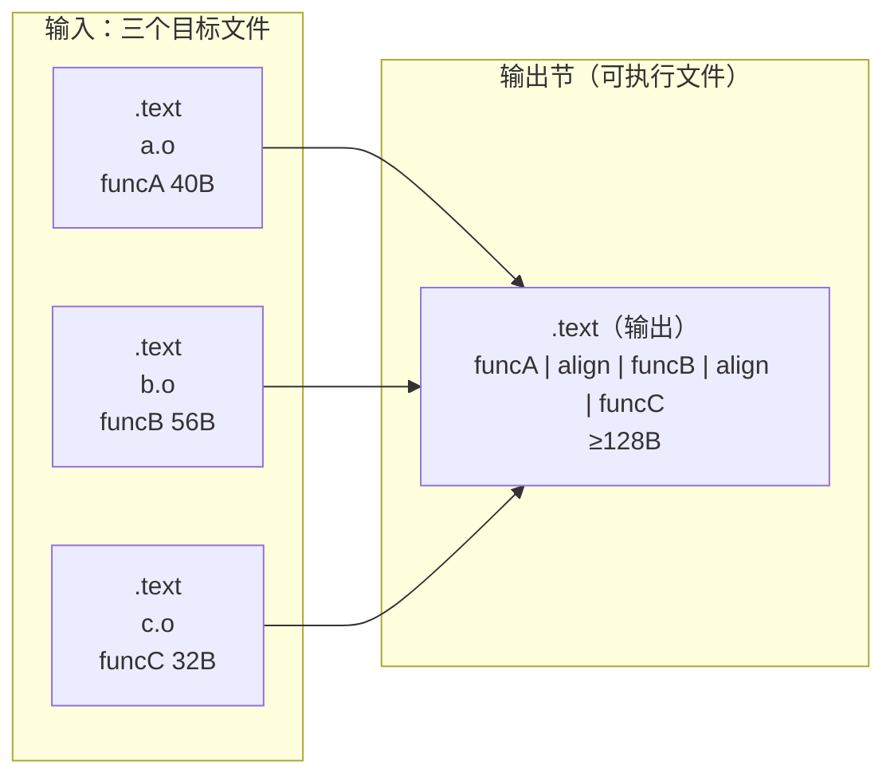
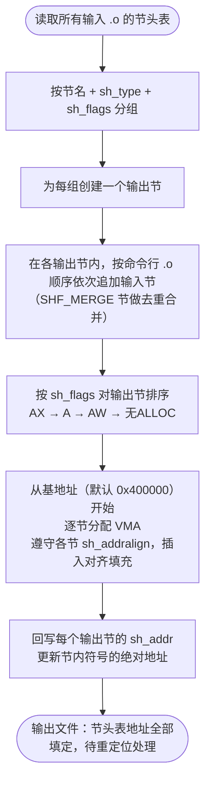
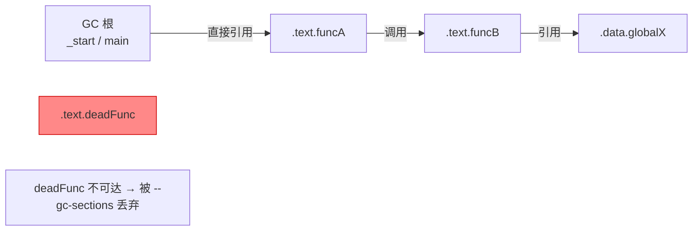

# 链接器详解（5）· 节的合并与布局

> [!abstract] TL;DR
> - **节合并**：链接器把来自各 `.o` 的同名同属性输入节，按顺序拼接成一个输出节——多个 `a.o`/`b.o`/`c.o` 的 `.text` 最终成为可执行文件里唯一的 `.text`。
> - **节排序与对齐**：输出节按 `SHF_*` 属性分组（`AX`/`A`/`AW`…），同组内按 `sh_addralign` 向上对齐，VMA（虚拟内存地址）依次分配；节与节之间可能有填充字节。
> - **地址布局**：链接器为每个输出节赋予唯一的 VMA；典型布局是 `.text`→`.rodata`→`.data`→`.bss` 依次递增，`.bss` 的 VMA 紧跟 `.data` 但在文件中占零字节。
> - **死代码消除（DCE）**：`-ffunction-sections`/`-fdata-sections` 让编译器把每个函数/数据单独放进一个节；链接时 `-Wl,--gc-sections` 让链接器丢弃从 GC 根（入口点 `_start`/`main`/导出符号）无法到达的节，实现函数粒度的裁剪。
> - **诊断工具**：`--print-gc-sections` 打印被丢弃的节，`-Map=out.map` 生成地址映射文件，`readelf -S` 查看输出节布局。

本篇是「链接器详解」第 05 篇，承接 [[04.静态库]] 对"哪些 `.o` 被拉入"的讲解，深入链接器内部——当所有输入目标文件到齐后，链接器如何把分散的输入节**合并、排序、对齐、分配 VMA**，最终得到可执行文件的节布局。死代码消除（DCE）是本篇的核心优化主题。下一篇 [[06.链接期重定位]] 基于本篇的布局结果，讲符号引用如何被改写为真实地址。

---

## 概述与定位

### 两个视角看"节"

在深入合并规则之前，先锚定概念边界。[[11.ELF文件详解/04.节区.md]] 把节分为两个维度：

- **输入节（input section）**：来自 `.o` 文件，编译器生成，每个目标文件有自己的 `.text`、`.data`、`.rodata`……
- **输出节（output section）**：链接器产出的可执行/库文件中的节，名字通常与输入节相同，但内容是多个输入节合并后的结果。

两者都由 `Elf64_Shdr`（详见 [[11.ELF文件详解/34.节头表.md]]）描述，区别仅在于"谁的文件里"和"VMA 是否已分配"。目标文件里节头的 `sh_addr` 全为 0，链接器完成布局后才把 VMA 填入输出节。

### 本篇在系列中的位置

| 维度 | 本篇聚焦 | 相邻篇章 |
|---|---|---|
| 输入来源 | 拉入了哪些 `.o` 的节 | 静态库按需提取见 [[04.静态库]] |
| 节合并结果的用途 | 重定位如何在已布局的地址上运算 | 见 [[06.链接期重定位]] |
| 链接脚本 | 手动控制节顺序与 VMA | 见 [[07.链接脚本]] |
| 节的 ELF 结构 | `sh_type`/`sh_flags`/`sh_addralign` 字段 | 见 [[11.ELF文件详解/04.节区.md]]、[[11.ELF文件详解/34.节头表.md]] |

---

## 原理与机制

### 节合并：同名同属性的输入节拼接

链接器合并节的**最基本规则**：节名相同且属性（`sh_type` + `sh_flags`）相同的输入节，按命令行中 `.o` 的顺序依次追加，形成一个输出节。



> 图解：三个 `.o` 各自有 `.text`，链接器按 `a.o → b.o → c.o` 的顺序将它们拼入唯一的输出 `.text`。两函数之间可能填充对齐字节（NOP / 零）。各 `.o` 的 `.data`、`.rodata`、`.bss` 同理。

**合并的前提条件**：`sh_type` 与 `sh_flags` 必须相同。如果同名节属性不同（如一个有 `SHF_WRITE`，另一个没有），链接器会报错或分别创建两个输出节（具体行为取决于链接脚本）。

### SHF_MERGE：可合并的常量节

`SHF_MERGE`（通常与 `SHF_STRINGS` 组合）是一个特殊的合并语义：链接器不是简单拼接，而是**去重**——多个 `.o` 里相同的字符串常量或数值常量，只保留一份。

| `sh_flags` 组合 | 含义 | 典型节 |
|---|---|---|
| `SHF_MERGE` | 固定大小元素可去重合并 | `.rodata.cst8`（8 字节常量）|
| `SHF_MERGE + SHF_STRINGS` | 以 `\0` 结尾的字符串可去重 | `.rodata.str1.1`（字符串字面量）|

GCC 默认开启 `-fmerge-constants` 和 `-fmerge-all-constants`，使常量字符串落入带 `SHF_MERGE|SHF_STRINGS` 的子节，链接器去重后可显著缩小 `.rodata` 大小。

### 节排序与对齐规则

链接器决定输出节的顺序时，遵循一套默认优先级（可被链接脚本覆盖）：

1. **按 `sh_flags` 分组**：先放不可写的只读/可执行节（`ALLOC+EXECINSTR`、`ALLOC` only），再放可写节（`ALLOC+WRITE`），最后放无 `ALLOC` 的非加载节（`.symtab`、`.debug_*` 等）。分组原则是让权限相同的节落在同一个 `PT_LOAD` 段，减少段数量，降低页粒度浪费。
2. **同组内按节名约定顺序**：链接器内置启发式规则（如 `.text` 先于 `.text.*`），或由链接脚本 `SECTIONS { .text { *(.text) *(.text.*) } }` 显式控制。
3. **每个输出节对齐到最大 `sh_addralign`**：一个输出节的起始地址由其所有输入节中最大的 `sh_addralign` 决定，必须是 2 的幂。

**典型 GNU ld 默认布局（x86-64，无链接脚本）**：

```
VMA 低 →                                         VMA 高
┌─────────┬─────────┬──────────┬──────────┬──────────┬──────────┐
│  .text  │ .rodata │ .eh_frame│   .data  │  .bss    │（非加载）│
│  AX     │  A      │  A       │  AW      │  AW      │ symtab…  │
└─────────┴─────────┴──────────┴──────────┴──────────┴──────────┘
        ↑同一 R-X LOAD 段                ↑同一 RW LOAD 段
```

`.bss` 的 VMA 紧跟 `.data` 之后，但它的 `sh_type = SHT_NOBITS`，在文件中占零字节（仅在内存中分配并清零）。

### 对齐填充的细节

设 `a.o` 的 `.text` 大小 41 字节，`b.o` 的 `.text` 要求 16 字节对齐（`sh_addralign=16`）。链接器在拼接时需要在 41 字节后填充到 48（= ceil(41/16)×16）：

```
输出 .text：
  [0x00 .. 0x28] a.o::.text (41B)
  [0x29 .. 0x2F] 对齐填充 (7B NOP/0x00)
  [0x30 .. 0x6F] b.o::.text (按16B对齐起始)
```

对齐填充字节在 `.text` 里通常是 `NOP`（`0x90`），在 `.data` 里是 `0x00`。这些字节**真实存在于文件中**，影响文件大小，但不影响功能。

---

## 三平台对照

节合并与布局是链接器最核心的通用行为，三平台在语义上高度一致，差异集中在工具命令与默认策略：

| 维度 | Linux（GNU ld / LLD）| macOS（ld64）| Windows（MSVC link.exe）|
|---|---|---|---|
| 节合并规则 | 同名同属性合并，`SHF_MERGE` 去重 | Mach-O `section` 同 segment+section 名合并 | COFF `section` 同名合并（`.text`/`.data` 等） |
| 节排序控制 | GNU ld 链接脚本 `SECTIONS`；LLD `-T`/内置规则 | `__TEXT`/`__DATA` 等 segment 分类固定，section 顺序灵活 | `#pragma section`/`/SECTION:` 或默认规则 |
| 对齐控制 | `sh_addralign`；链接脚本 `ALIGN()` | `section` 的 `align` 属性 | COFF `SectionAlignment`；`/ALIGN:` 选项 |
| 死代码消除 | `-Wl,--gc-sections`（GNU ld / LLD） | `-dead_strip`（ld64 默认开启） | `/OPT:REF`（非 `/DEBUG` 或显式指定时启用；`/DEBUG` 默认 `/OPT:NOREF`） |
| DCE 粒度 | 节粒度（需 `-ffunction-sections`）| 函数粒度（ld64 自带；macOS 编译器 `-ffunction-sections` 细化）| COMDAT 节粒度（MSVC 编译器自动按函数生成 COMDAT） |
| 查看布局 | `readelf -S`、`-Map=out.map` | `otool -l`、`-map out.map` | `dumpbin /headers`、`/MAP:out.map` |
| 孤儿节处理 | 默认追加到同属性组末尾；可用 `--orphan-handling` 控制 | 未知 section 报错或挂到最接近的 segment | 默认报警告后合并 |

> [!note] macOS `-dead_strip` 是默认行为
> ld64 不需要 `-ffunction-sections` 也能做死代码消除——它在 Mach-O 内部以"原子（atom）"为粒度跟踪可达性，每个函数/数据就是一个原子。Linux 的 `--gc-sections` 则依赖"把每个函数/数据放进独立节"这一前提，因此必须搭配 `-ffunction-sections`。

---

## 数据结构 / 流程详解

### `Elf64_Shdr` 中与合并布局直接相关的字段

以下字段是链接器做合并与布局决策的直接依据（完整结构见 [[11.ELF文件详解/34.节头表.md]]）：

| 字段 | 类型 | 在合并/布局中的作用 |
|---|---|---|
| `sh_name` | `uint32_t` | 节名（在 `.shstrtab` 中的偏移）；同名是合并的必要条件 |
| `sh_type` | `uint32_t` | 节类型（`SHT_PROGBITS`/`SHT_NOBITS`/`SHT_RELA`…）；与 `sh_flags` 共同决定是否合并 |
| `sh_flags` | `uint64_t` | 位掩码（`SHF_ALLOC`/`SHF_WRITE`/`SHF_EXECINSTR`/`SHF_MERGE`/`SHF_STRINGS`…）；决定排序分组 |
| `sh_addr` | `uint64_t` | 链接前为 0；链接后由链接器填入 VMA |
| `sh_addralign` | `uint64_t` | 对齐要求（必须为 2 的幂）；输出节起始 VMA 取所有输入节 `sh_addralign` 的最大值 |
| `sh_size` | `uint64_t` | 节大小；用于计算下一节的起始偏移 |

### 链接器合并与布局的流程



> 图解：流程中"从基地址分配 VMA"这一步是本篇的核心——链接器**一次性**把所有输出节的虚拟地址钉死，后续的重定位（[[06.链接期重定位]]）才能用这些地址计算符号偏移量。

### 地址布局示意（典型 x86-64 可执行文件）

以下地址均为**示意**，不代表任何实际运行期地址。

```
VMA（示意）         节名          sh_flags          大小    说明
0x0000000000400000 [ELF 头/PHT]                          文件开头
0x0000000000401000 .text         AX (ALLOC+EXEC)   ...   合并所有 .o 的 .text
0x0000000000402000 .rodata       A  (ALLOC)         ...   合并所有 .o 的 .rodata
0x0000000000402xxx .eh_frame     A  (ALLOC)         ...   异常帧信息
                   [对齐到 0x1000 页边界]
0x0000000000403000 .data         AW (ALLOC+WRITE)   ...   合并所有 .o 的 .data
0x0000000000403xxx .bss          AW (ALLOC+WRITE)   ...   内存中分配，文件占 0B
                   [以下无 SHF_ALLOC，不进 PT_LOAD]
                   .symtab       —                  ...   符号表
                   .strtab       —                  ...   符号名字符串表
                   .shstrtab     —                  ...   节名字符串表
```

> [!warning] 示例输出为示意
> 上表地址为代表性示意，非本机实跑。实际 VMA 受 ASLR、链接脚本、PIE 等影响，每次可能不同。读者应在自己环境中用 `readelf -S` 观察真实输出。

---

## 死代码消除（DCE）

### 问题根源：节是合并的最小单位

默认编译下，一个 `.o` 的 `.text` 节包含该翻译单元里的**所有函数**。链接器合并节时，无法只提取 `.text` 里的某个函数——**节是合并的原子单位**。

```
foo.o:
  .text:  funcA | funcB | funcC | 从未被调用的 deadFunc
                                   ↑ 这三个字节也进了输出 .text，去不掉
```

在嵌入式/固件场景（ROM 容量极紧），或要缩小服务器二进制体积时，这会是问题。

### 解决方案：每函数/数据单独成节

#### 第一步：编译器侧

用 `-ffunction-sections`（每函数一个节）和 `-fdata-sections`（每个数据对象一个节）：

```bash
gcc -c -ffunction-sections -fdata-sections foo.c -o foo.o
```

编译后的节名变为：

```
.text.funcA        (含 funcA)
.text.funcB        (含 funcB)
.text.funcC        (含 funcC)
.text.deadFunc     (含 deadFunc，单独成节)
.data.globalX      (含 globalX)
.rodata.str1.1     (字符串常量)
```

此时 `deadFunc` 独占 `.text.deadFunc`，与其他函数物理隔离。

#### 第二步：链接器侧

用 `-Wl,--gc-sections` 触发链接器的"垃圾节收集"：

```bash
gcc -ffunction-sections -fdata-sections foo.o main.o \
    -Wl,--gc-sections -o out
```

链接器从 **GC 根**（entry point `_start` / `main`，以及所有标记为 `SHF_GNU_RETAIN` 或 `KEEP()` 的节）出发，做可达性分析：



`.text.deadFunc` 从根节点出发不可达，被链接器丢弃——它既不进输出节，也不占 VMA。

### 诊断工具

#### `--print-gc-sections`：打印被丢弃的节

```bash
gcc -ffunction-sections -Wl,--gc-sections,--print-gc-sections -o out *.o
```

> [!warning] 示例输出为示意
> ```text
> /usr/bin/ld: removing unused section '.text.deadFunc' in file 'foo.o'
> /usr/bin/ld: removing unused section '.text.unusedHelper' in file 'bar.o'
> /usr/bin/ld: removing unused section '.data.unusedGlobal' in file 'baz.o'
> ```
> 输出非本机实跑，以本机链接实际输出为准。每行对应一个被丢弃的节，格式为 `removing unused section '<节名>' in file '<目标文件>'`。

#### `-Map=out.map`：完整地址映射文件

Map 文件是链接器输出的"详细账单"，列出每个输出节的 VMA、大小，以及哪些输入节被合并进来（或被 gc-sections 丢弃）。

```bash
gcc -ffunction-sections -Wl,--gc-sections,-Map=out.map -o out *.o
```

> [!warning] 示例输出为示意
> ```text
> Linker script and memory map
>
> Address         Size            Align  Out     In      Symbol
> ================================================================================
> .text           0x0000000000401060
>                 0x0000000000000030      0x10 main.o(.text.main)
>                 0x0000000000401060             main
>                 0x0000000000000018      0x10 foo.o(.text.funcA)
>                 0x0000000000401090             funcA
>
> *(.text.deadFunc)                            REMOVED (--gc-sections)
>
> .rodata         0x0000000000402000
>                 0x000000000000000c       0x4 main.o(.rodata.str1.1)
> ```
> 上方为示意结构，真实 Map 文件格式因 ld 版本略有差异，地址均为示意。被 gc-sections 移除的节通常以 `DISCARDED` 或注释形式出现。

#### `readelf -S`：查看输出节布局

```bash
readelf -S out           # 所有节头
readelf -S -W out        # 宽格式（地址不截断）
```

> [!warning] 示例输出为示意
> ```text
> $ readelf -S -W out
> There are 14 section headers, starting at offset 0x...
>
> Section Headers:
>   [Nr] Name              Type            Address          Off    Size   ES Flg Lk Inf Al
>   [ 0]                   NULL            0000000000000000 000000 000000 00      0   0  0
>   [ 1] .text             PROGBITS        0000000000401060 001060 000048 00  AX  0   0 16
>   [ 2] .rodata           PROGBITS        0000000000402000 002000 00000c 00   A  0   0  4
>   [ 3] .data             PROGBITS        0000000000403000 003000 000010 00  WA  0   0  8
>   [ 4] .bss              NOBITS          0000000000403010 003010 000008 00  WA  0   0  4
>   [ 5] .symtab           SYMTAB          0000000000000000 003020 000090 18      6   4  8
>   ...
> ```
> 上方为示意，非本机实跑。关注 `Address`（VMA）、`Size`、`Flg`（`A`=ALLOC、`X`=EXECINSTR、`W`=WRITE）、`Al`（`sh_addralign`）。启用 `--gc-sections` 后，被丢弃的节不会出现在节头表中。

---

## 孤儿节（Orphan Section）处理

**孤儿节**是指链接脚本中没有显式描述的输出节——通常发生在用户给节起了非标准名字（如 `.my_custom_section`），或工具链内部节（如 `.note.gnu.property`）在链接脚本中无对应规则时。

### GNU ld 的默认行为

GNU ld 不报错，而是按以下启发式规则安置孤儿节：

1. 找到 `sh_flags` 最接近的已有输出节，将孤儿节追加在其后。
2. 若完全找不到匹配，追加到所有输出节末尾。

`--orphan-handling` 选项（GNU ld 2.26+）可以控制行为：

| `--orphan-handling=<val>` | 效果 |
|---|---|
| `place`（默认）| 按启发式规则安置 |
| `warn` | 安置 + 发出警告 |
| `error` | 遇到孤儿节报错，强制链接脚本覆盖全部 |
| `discard` | 直接丢弃孤儿节 |

LLD 的默认行为与 GNU ld 类似，但警告策略略有不同（`--warn-unhandled-section`）。

### 典型孤儿节场景

```c
// 把某函数放进自定义节（用于 ROM 驱动等嵌入式场景）
__attribute__((section(".my_isr"))) void uart_isr(void) { /* ... */ }
```

链接时若链接脚本未声明 `.my_isr`，它成为孤儿节。不同链接器对它的安置位置可能不同，**可能导致跨链接器可移植性问题**。正确做法是在链接脚本中显式处理，或用 `KEEP(.my_isr)` 防止被 `--gc-sections` 误删（因为 `uart_isr` 可能只被中断向量表"间接引用"，从 C 符号引用图看不可达）。

---

## 代码与命令

### 完整死代码消除实操

以下展示一个端到端流程：

```c
// foo.c
int liveFunc(void) { return 42; }
int deadFunc(void) { return 0; }   // 无人调用，期望被 DCE
```

```c
// main.c
#include <stdio.h>
extern int liveFunc(void);
int main(void) {
    printf("%d\n", liveFunc());
    return 0;
}
```

**编译（每函数单独成节）**：

```bash
gcc -c -ffunction-sections -fdata-sections foo.c -o foo.o
gcc -c -ffunction-sections -fdata-sections main.c -o main.o
```

**链接（启用 gc-sections，生成 map 文件）**：

```bash
gcc foo.o main.o \
    -Wl,--gc-sections \
    -Wl,--print-gc-sections \
    -Wl,-Map=out.map \
    -o out
```

**验证 deadFunc 不在产物中**：

```bash
nm out | grep deadFunc    # 期望无输出
nm out | grep liveFunc    # 期望有输出（T 类型，text 段）
```

**查看节布局**：

```bash
readelf -S -W out
```

> [!warning] 示例输出为示意
> 上述命令均为标准形式，但需在 Linux/macOS 上执行（本机为 Windows）。`nm out | grep deadFunc` 无输出说明 `deadFunc` 已被丢弃。`readelf -S` 的实际地址随工具链版本、ASLR 等变化，以本机实际输出为准。

### macOS 等价命令

```bash
# macOS：ld64 默认开启 dead_strip，无需 -ffunction-sections
clang foo.c main.c -Wl,-dead_strip -Wl,-map,out.map -o out
# 验证
nm out | grep deadFunc    # 期望无输出
otool -l out              # 查看 segment/section 布局
```

### Windows MSVC 等价命令

```cmd
:: 编译（MSVC 自动为每函数生成 COMDAT 节，无需等价 -ffunction-sections）
cl /c foo.c main.c

:: 链接（/OPT:REF 开启死代码消除，Release 模式默认开启）
link /OUT:out.exe /OPT:REF foo.obj main.obj

:: 生成 map 文件
link /OUT:out.exe /OPT:REF /MAP:out.map foo.obj main.obj

:: 验证
dumpbin /symbols out.exe | findstr deadFunc
```

> [!warning] 示例输出为示意
> Windows 命令格式正确，以本机 MSVC 工具链实际输出为准。MSVC 的 COMDAT 死代码消除与 `/OPT:REF` 配套，细节见 [[14.三平台链接器对比]]。

---

## 陷阱与最佳实践

### 陷阱一：`KEEP()` 与 GC 根——中断向量表、构造函数

`--gc-sections` 从 C 符号引用图出发做可达性分析。以下场景中，"代码"不从 C 引用图可达，但**必须保留**：

- **中断/异常向量表**：MCU 里的 `void (*isr_vector[])() __attribute__((section(".isr_vector")))` 只被硬件引用，不被任何 C 函数调用。
- **C++ 全局构造函数**：通过 `.init_array` 节存放函数指针，与 [[11.ELF文件详解/41.init节.md]] 描述的初始化链路相关；其指向的构造函数节若被 gc-sections 扫描到"无 C 引用"可能被误删。

解决方法：在链接脚本中对这类节使用 `KEEP()`：

```ld
SECTIONS {
    .isr_vector : { KEEP(*(.isr_vector)) }
    .init_array : { KEEP(*(.init_array*)) }
}
```

或者给节加 `SHF_GNU_RETAIN` 标志（GNU ld 2.36+，binutils 2.36+）：

```c
__attribute__((section(".isr_vector"), retain)) void (*isr_vector[])() = { ... };
```

### 陷阱二：`-ffunction-sections` 增大调试信息体积

每函数一个节会导致 DWARF 的 `.debug_aranges` 等索引显著增大，link 时间可能变长（尤其 LTO 场景）。建议在 Release/Size 优化构建时开启，Debug 构建可关闭。

### 陷阱三：`-ffunction-sections` 不适合 LTO 组合使用

LTO（链接时优化，见 [[10.LTO链接时优化]]）在链接期重组函数，若同时指定 `-ffunction-sections`，两者的节粒度假设可能冲突，部分 LTO pass 会忽略 `-ffunction-sections` 的节分割。通常两者选其一：要么 LTO（内联/跨模块优化），要么 `-ffunction-sections + --gc-sections`（静态 DCE）。

### 陷阱四：孤儿节被 `--gc-sections` 误删

自定义节（`__attribute__((section(".my_hook")))`）若没有从 GC 根可达的路径（如只被汇编启动代码引用，而非 C 调用图），会被 `--gc-sections` 丢弃。诊断：开启 `--print-gc-sections` 检查输出，确认是否有预期保留的节被删。修复：链接脚本 `KEEP()` 或 `--retain-symbols-file`。

### 最佳实践速查

| 场景 | 推荐做法 |
|---|---|
| 减小二进制体积（Linux） | `-ffunction-sections -fdata-sections -Wl,--gc-sections` |
| 减小二进制体积（macOS） | `-Wl,-dead_strip`（默认已开，无需额外选项） |
| 减小二进制体积（MSVC） | Release 模式默认 `/OPT:REF`，无需额外配置 |
| 诊断哪些节被删 | `-Wl,--print-gc-sections` |
| 生成地址映射 | `-Wl,-Map=out.map` |
| 查看输出节布局 | `readelf -S -W out` |
| 防止特定节被 GC 删除 | 链接脚本 `KEEP()`，或 `__attribute__((retain))`（GCC 11+） |
| 孤儿节处理 | 链接脚本显式声明；`--orphan-handling=error` 发现遗漏 |
| 调试阶段 | 关闭 `-ffunction-sections`，减少 DWARF 膨胀 |

---

## 小结

1. **节合并是拼接而非混合**：同名同属性的输入节按 `.o` 命令行顺序依次追加，形成输出节；`SHF_MERGE` 节做内容去重；`sh_type` 或 `sh_flags` 不同则不合并。
2. **排序与对齐**：输出节按 `sh_flags` 分组（只读可执行→只读→可读写→非加载），组内按节名约定或链接脚本控制顺序；每节起始 VMA 满足最大 `sh_addralign` 对齐，间隙用填充字节补齐。
3. **VMA 分配是关键里程碑**：链接器为每个输出节赋予唯一 VMA 后，所有符号地址才确定；后续的重定位（[[06.链接期重定位]]）依赖这些地址计算结果。
4. **DCE = 编译器粒度控制 + 链接器可达性分析**：`-ffunction-sections`/`-fdata-sections` 让每个函数/数据单独成节（使节成为 GC 的原子单位），`--gc-sections` 从 GC 根做 BFS/DFS 丢弃不可达节；macOS `-dead_strip`、MSVC `/OPT:REF` 是等价机制。
5. **`KEEP()` 防误删，`--print-gc-sections` 诊断**：中断向量表、`.init_array` 等"硬件引用"或"间接引用"的关键节必须用 `KEEP()` 保护；`--print-gc-sections` 和 `-Map=out.map` 是定位 DCE 过激问题的首选工具。
6. **孤儿节有默认安置规则**：GNU ld/LLD 不报错，按启发式追加到同属性组末尾；嵌入式或有严格布局要求的场景应在链接脚本中显式声明，避免依赖启发式。

---

## 相关阅读

- **节的 ELF 结构（`sh_flags`/`sh_type`/`sh_addralign` 字段）**：[[11.ELF文件详解/04.节区.md]]
- **节头表完整结构**：[[11.ELF文件详解/34.节头表.md]]
- **本系列上游：哪些 `.o` 成员被拉入**：[[04.静态库]]
- **本系列下游：VMA 确定后符号引用如何改写**：[[06.链接期重定位]]
- **手动控制节顺序与 VMA**：[[07.链接脚本]]
- **C++ 全局构造函数与 `.init_array`**：[[11.ELF文件详解/41.init节.md]]
- **动态库链接（节布局对 PIE 的影响）**：[[14.动态链接与加载器详解/01.从静态链接到动态链接.md]]
- **GOT/重定位（运行期地址表与节布局的关系）**：[[11.ELF文件详解/17.got节.md]]
- **LTO 与 DCE 的关系**：[[10.LTO链接时优化]]
- **链接错误排查（节合并冲突、孤儿节）**：[[13.链接错误排查]]

---

⬅️ 上一篇 [[04.静态库]] ｜ 🏠 [[00.链接器详解总览]] ｜ 下一篇 [[06.链接期重定位]] ➡️
