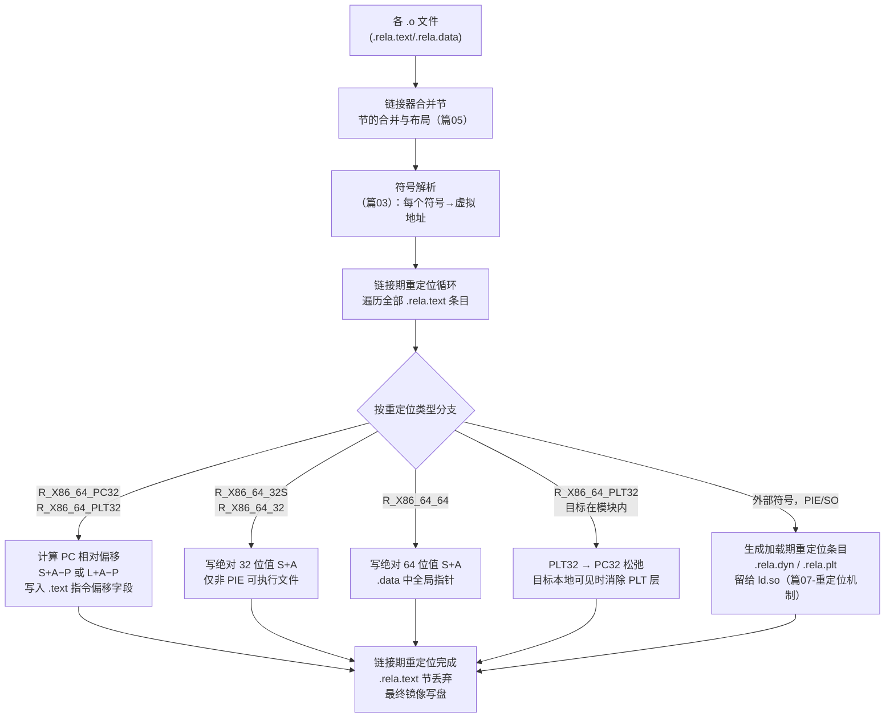
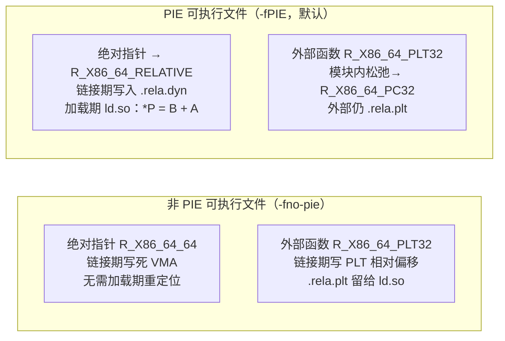

# 链接器详解（6）· 链接期重定位

## 概述与定位

> [!abstract] TL;DR
> - **链接期重定位**是 `ld` 把多个 `.o` 拼成可执行文件时做的最后一步：节合并、地址布局完成后，链接器遍历每个目标文件里残留的重定位条目，把".text 中的占位 0"改写成**此刻已知的最终虚拟地址或 PC 相对偏移**——这一步的结果永久写入磁盘镜像。
> - **加载期重定位**（见 [[14.动态链接与加载器详解/07.重定位机制详解.md]]）由 `ld.so` 在进程启动时完成：共享库和 PIE 可执行文件的实际加载基址是 ASLR 决定的，链接器无法提前写死绝对地址，只能留下 `.rela.dyn`/`.rela.plt` 供运行时填写。
> - 两者本质相同（"把占位改成真值"），只是发生时机不同：链接期处理**模块内**确定的地址，加载期处理**基址未知**的剩余修正。
> - x86-64 链接期主力类型：`R_X86_64_PC32`（S+A−P，PC 相对调用/跳转）、`R_X86_64_PLT32`（L+A−P，经 PLT 的外部函数调用）、`R_X86_64_32S`/`R_X86_64_32`（S+A，32 位绝对，仅非 PIE）、`R_X86_64_64`（S+A，64 位绝对）。

本篇处于「链接器详解」系列静态链接板块的尾声位置，承接 [[05.节的合并与布局]]（地址布局已确定）、呼应 [[03.符号与符号解析]]（符号地址已解析），为 [[07.链接脚本]] 的高阶地址控制打下基础。

| 维度 | 本篇聚焦 | 相邻篇 |
|---|---|---|
| 上游 | 节合并 + 符号解析已给出地址 | [[05.节的合并与布局]]、[[03.符号与符号解析]] |
| 核心 | 链接期如何把 `.o` 里的占位改成最终值 | 本篇 |
| 下游 | 运行期加载器做的剩余重定位 | [[14.动态链接与加载器详解/07.重定位机制详解.md]] |
| 节结构细节 | `.rela.text` 条目字段 | [[11.ELF文件详解/22.rel.text节.md]] |
| GOT 与加载期 | 数据 GOT 与动态重定位 | [[11.ELF文件详解/17.got节.md]] |

---

## 原理与机制

### 为什么需要两阶段重定位

编译器把 `main.c` 编译成 `main.o` 时，并不知道 `puts` 的最终地址——`libc` 还没被链接进来，`puts` 在 `main.o` 里只是一个**未解析符号引用**。编译器只能：

1. 在 `.text` 里的 `call` 指令偏移字段填入**占位值 0**（或 `-4`，见后文 addend 说明）。
2. 在 `.rela.text` 里插入一条重定位条目，记录"这里需要改写成 puts 的地址，类型是 `R_X86_64_PLT32`"。

等到 `ld` 把所有 `.o` 收齐、布局完成后，`puts@plt` 的地址才确定——**链接器此刻才能填值**，这就是链接期重定位。

但当生成**共享库**（`.so`）或 **PIE 可执行文件**时，链接器依然无法写死绝对基址（ASLR 每次加载位置都不同）。这时链接器会：

- 对于模块内 PC-relative 引用（`call`/`jmp` 指向同一 DSO 内的函数）：直接用 PC 相对偏移写死，**不留运行期重定位**。
- 对于外部数据/函数符号：生成 `.rela.dyn` / `.rela.plt` 条目，**留给 ld.so 在加载时再填**。

非 PIE 可执行文件链接时可以将绝对地址写死（通常链接到固定虚拟地址如 `0x400000`），因此链接期就能消解掉所有 `R_X86_64_32S` 等绝对地址类型的重定位。

### 重定位的触发流程



> **图解**：链接器先完成节合并与符号解析（图左上），再遍历每个 `.rela.text` 条目，按类型分流处理。PC-relative 类型直接计算并写入；32/64 位绝对类型只在非 PIE 下使用；需要 GOT/PLT 间接层的外部符号，生成留给 ld.so 处理的运行期重定位条目。整个 `.rela.text` 节在最终镜像中被丢弃。

---

## 数据结构 / 流程详解

### 重定位记录格式

`.o` 文件中的链接期重定位条目是 `Elf64_Rela`（x86-64 用 RELA 格式）：

```c
/* elf.h 标准定义，64 位 RELA，24 字节 */
typedef struct {
    Elf64_Addr   r_offset;   /* 8B：被修正字节在节中的偏移（未链接时）或 VMA（链接后） */
    Elf64_Xword  r_info;     /* 8B：高32位=符号索引，低32位=重定位类型 */
    Elf64_Sxword r_addend;   /* 8B：有符号加数 A（显式，目标位置可全零） */
} Elf64_Rela;

/* r_info 的拆分宏 */
#define ELF64_R_SYM(i)   ((i) >> 32)           /* 高32位：.symtab 符号索引 */
#define ELF64_R_TYPE(i)  ((i) & 0xffffffffUL)  /* 低32位：重定位类型常量 */
```

链接期与加载期使用**同一个结构**，区别只是：
- **链接期**（`.rela.text`）：`r_offset` 是节内偏移；`r_info` 高位查 `.symtab`（完整符号表）。
- **加载期**（`.rela.dyn`）：`r_offset` 是最终虚拟地址；`r_info` 高位查 `.dynsym`（动态符号表）；处理器是 ld.so。

### 公式记号体系

下面所有公式使用 System V gABI 标准记号，与 [[14.动态链接与加载器详解/07.重定位机制详解.md]] 口径完全一致：

| 记号 | 含义 |
|---|---|
| **S** | Symbol value — 被引用符号的虚拟地址（链接期已知） |
| **A** | Addend — `r_addend` 字段的值（通常为 0 或 −4） |
| **P** | Place — `r_offset` 处的**最终虚拟地址**（被修正位置） |
| **L** | PLT entry — 该符号对应的 `.plt` stub 虚拟地址 |
| **G** | GOT offset — 该符号在 `.got` 内的偏移 |
| **GOT** | `.got` 节的基地址 |
| **B** | Base — 模块加载基址（链接期 non-PIE 下固定，PIE 下留给加载期） |

### x86-64 链接期常见重定位类型详解

#### R_X86_64_PC32（类型值 = 2）

```
填入值（32位）= S + A − P
```

**用途**：PC 相对寻址，典型场景是同模块内的 `call` / `jmp` / `lea`。

- `A` 通常为 `−4`（x86 的相对跳转操作数是相对于**下一条指令**的偏移，而下一条指令地址 = `P + 4`，所以 `S − (P + 4) = S + (−4) − P`）。
- 结果为 32 位有符号值，填入指令的 4 字节偏移字段。超过 ±2 GiB 范围会导致链接错误 `relocation truncated to fit`。
- 在 PIC/PIE 代码中，对**模块外**目标使用 PC32 是非法的（因为跨 DSO 距离在运行期是未知的）；对模块内目标，它是直接调用的最优方式。

#### R_X86_64_PLT32（类型值 = 4）

```
填入值（32位）= L + A − P
```

**用途**：对外部函数的 PC 相对调用，经由 PLT 跳板间接触达目标。

- 链接时，若目标函数需要 PLT（共享库函数），`L` = 该函数的 `.plt` stub 地址；若目标函数在本模块内定义且可见性合适，链接器可以将 `PLT32` **松弛（relax）为 `PC32`**（直接调用，省掉 PLT 层）。
- 编译器在 PIC 模式（`-fPIC`/`-fPIE`）下对所有外部函数调用生成 `R_X86_64_PLT32`；非 PIC 模式对本地函数调用生成 `R_X86_64_PC32`。
- **加数**同样通常为 `−4`，原因与 `PC32` 相同。

> [!note] PLT32 松弛
> 当 `PLT32` 的目标符号在链接时确定为模块内本地定义（`STB_LOCAL` 或 `STV_HIDDEN`），链接器可以省去 PLT stub，直接用 `PC32` 公式 `S + A − P` 计算偏移——这会消除一次间接跳转，提升性能。GNU ld 和 LLD 均默认执行此优化。

#### R_X86_64_32S（类型值 = 11）

```
填入值（32位符号扩展）= S + A
验证：结果必须满足 sign_extend_32(result) == result（即值域 [−2³¹, 2³¹)）
```

**用途**：32 位符号扩展绝对地址，仅在**非 PIE 可执行文件**（编译时 `-fno-pie`）中合法使用。

- 因为非 PIE 可执行文件的虚拟地址通常在低 2 GiB（`0x400000` 附近），符号扩展后等于原值，无信息损失。
- 若代码以 PIC 模式编译（`-fPIC`），链接器看到 `R_X86_64_32S` 时不会报错，但最终镜像若被加载到高地址（如内核地址空间、带 ASLR 的 PIE），会导致运行期地址错误。**`-fPIC` 不应产生 32S 类型**，若出现则说明有汇编代码或内联汇编用了绝对地址。
- 超出值域时，链接器报 `relocation truncated to fit: R_X86_64_32S`，需切换到大代码模型（`-mcmodel=large`）。

#### R_X86_64_32（类型值 = 10）

```
填入值（32位零扩展）= S + A
验证：结果必须满足 zero_extend_32(result) == result（即值域 [0, 2³²)）
```

与 `32S` 相似，但零扩展——适合指向绝对地址 `[0, 4G)` 的数据（如某些内核代码）。差异仅在合法性检查。

#### R_X86_64_64（类型值 = 1）

```
填入值（64位）= S + A
```

**用途**：64 位绝对地址，常见于 `.data` / `.rodata` 中的全局指针初始化：

```c
const char *msg = "hello";  // .data 中存放指向 .rodata 字符串的 64 位指针
```

- 在非 PIE 可执行文件中，链接期直接写入最终虚拟地址。
- 在共享库/PIE 中，链接器**无法在链接期写死**（加载基址未知），会在 `.rela.dyn` 留下 `R_X86_64_RELATIVE` 条目，让 ld.so 在加载时按 `B + A` 修正——这就是两阶段重定位的典型分工。

#### 汇总对照表

| 类型 | 值 | 公式 | 位宽 | 场景 | PIE/SO 链接期可用 |
|---|---|---|---|---|---|
| `R_X86_64_PC32` | 2 | S + A − P | 32 | 模块内相对调用/跳转/引用 | 是（模块内） |
| `R_X86_64_PLT32` | 4 | L + A − P | 32 | 外部函数调用，经 PLT | 是（可松弛为 PC32） |
| `R_X86_64_32` | 10 | S + A | 32 | 绝对地址（零扩展） | 否（仅非 PIE） |
| `R_X86_64_32S` | 11 | S + A | 32 | 绝对地址（符号扩展） | 否（仅非 PIE） |
| `R_X86_64_64` | 1 | S + A | 64 | 数据中的 64 位绝对指针 | 仅非 PIE 完全消解；PIE 留给加载期 |

---

## 三平台对照

三大平台的链接期重定位在**本质**上相同（把占位改成链接时已知的值），但在数据结构、重定位类型命名、与运行期的边界划分上各有差异。

| 维度 | Linux GNU ld / LLD（ELF） | Windows MSVC link（PE/COFF） | macOS ld64（Mach-O） |
|---|---|---|---|
| 可重定位目标格式 | ELF `.o`，重定位在 `.rela.text`（64位）/ `.rel.text`（32位） | COFF `.obj`，重定位在每个 section 的 `RELOCATION` 表 | Mach-O `.o`，重定位在 `__text` section 的 relocation entries |
| 链接期条目结构 | `Elf64_Rela`（24字节）/ `Elf32_Rel`（8字节） | `IMAGE_RELOCATION`（10字节：VirtualAddress + SymbolIndex + Type） | `struct relocation_info`（8字节）或 `scattered_relocation_info` |
| PC-relative 调用 | `R_X86_64_PC32`（value=2）公式 `S+A−P` | `IMAGE_REL_AMD64_REL32`（值=4）公式同 | `X86_64_RELOC_BRANCH`（值=2），arm64 用 `ARM64_RELOC_BRANCH26` |
| 32 位绝对 | `R_X86_64_32S`（值=11）/ `R_X86_64_32`（值=10） | `IMAGE_REL_AMD64_ADDR32`（值=2） | `X86_64_RELOC_SIGNED`（值=1）etc. |
| 64 位绝对 | `R_X86_64_64`（值=1） | `IMAGE_REL_AMD64_ADDR64`（值=1） | `X86_64_RELOC_UNSIGNED`（值=0） |
| 经间接表的外部调用 | `R_X86_64_PLT32` → PLT stub | `IMAGE_REL_AMD64_REL32`（IAT entry `__imp_foo`，调用 `call [__imp_foo]`） | `X86_64_RELOC_BRANCH` + 生成 `__stubs` 条目 |
| 链接期能否消解所有绝对地址 | 非 PIE 可执行文件：能；PIE/SO：留 `.rela.dyn` 给加载期 | DLL 随机基址（ASLR）：链接期写 ImageBase 相对值，运行期加载器做 `.reloc` 修正；exe（固定基址）：可写死 | PIE（`-pie`）：留 rebase opcodes 给 dyld；non-PIE：可写死 |
| 链接完成后重定位表 | `.rela.text` 丢弃；保留 `.rela.dyn`/`.rela.plt` | COFF 重定位表丢弃；保留 `.reloc`（基址重定位，PE 专有） | Mach-O 内部重定位丢弃；保留 `LC_DYLD_INFO` rebase/bind 或 `LC_DYLD_CHAINED_FIXUPS` |
| 工具查看 | `readelf -r a.o`、`objdump -dr a.o` | `dumpbin /relocations a.obj` | `otool -r a.o`、`llvm-objdump -r a.o` |

### PE/COFF 的差异要点

PE 链接期重定位与 ELF 最大的区别在于**外部函数调用的方式**：

- MSVC 编译器对外部函数调用生成 `call [__imp_foo]`（间接调用 IAT 槽位），而不是像 ELF 那样经由 PLT 跳板。IAT 槽位在**加载时**由 Windows 加载器按导入目录一次性填满（无延迟绑定，等同 `BIND_NOW`）。
- PE 的 `.reloc` 节（基址重定位表）与 ELF 的 `.rela.dyn` 作用相近，但专门用于"内部绝对指针的 delta 修正"（`ImageBase` 偏移后修正），格式是按 4KB 页分块的 `WORD` 位图，详见 [[14.动态链接与加载器详解/07.重定位机制详解.md]] 的 PE 平台章节。

### macOS ld64 的差异要点

macOS arm64（Apple Silicon）的链接期行为：

- 函数调用使用 `ARM64_RELOC_BRANCH26`（26 位偏移，覆盖 ±128 MiB），超出范围时链接器插入 `thunk`（跳板函数）。
- 数据绝对指针在 PIE 二进制中留给 dyld 的 `LC_DYLD_CHAINED_FIXUPS`（现代格式）处理，不生成独立 `.rela.dyn` 格式，而是通过内联指针链方式组织。

---

## 非 PIE vs PIE 的重定位策略对比

### 非 PIE 可执行文件（`-fno-pie`，链接到固定地址）

非 PIE 程序链接到固定虚拟地址（x86-64 典型 `0x400000`），链接器在链接期可以**写死所有绝对地址**：

```c
// 全局变量指针：.data 段初始化为绝对地址
int  global_val = 42;
int *p_global   = &global_val;   // .data 中存 global_val 的绝对 VMA
```

对应的重定位处理：
- `p_global` 初始化产生 `R_X86_64_64`（值 = `global_val` 最终 VMA）——**链接期直接写死**，无需运行期重定位。
- 代码中的 `call puts` 产生 `R_X86_64_PLT32`（经 PLT）——**链接期写入 PLT stub 的 PC 相对偏移**，`.rela.plt` 条目留给 ld.so 填写 `puts` 真实地址。

最终镜像：`.rela.text` 丢弃，只剩 `.rela.plt`（`JUMP_SLOT`）和少量 `.rela.dyn`（`GLOB_DAT`）给加载期处理。

### PIE 可执行文件（`-fPIE`，默认，支持 ASLR）

PIE 程序以 `ET_DYN`（共享库型）格式链接，加载基址由 ASLR 决定，链接器**无法写死绝对地址**：

```c
// 同样的全局变量指针
int  global_val = 42;
int *p_global   = &global_val;   // .data 中的 64 位指针
```

- `p_global` 初始化产生 `R_X86_64_RELATIVE`（加载期填写 `B + A`，B 是实际加载基址）——**链接期把 addend（链接基址下的地址）写入 `.rela.dyn`，留给 ld.so 修正**。
- 代码中的函数调用优先生成 `R_X86_64_PLT32`，对模块内定义的函数链接器松弛为 `R_X86_64_PC32`（PC 相对，无需运行期重定位）；对外部函数仍经 PLT。

最终镜像：`.rela.dyn` 包含大量 `R_X86_64_RELATIVE` 条目（内部指针），加载期 ld.so 按 `B + A` 一次性修正。



> **一句话区别**：非 PIE 把绝对地址在链接期完成，PIE 把内部绝对指针变成运行期 `RELATIVE` 修正，但两者的 PC-relative 调用（`PC32`/`PLT32`）在链接期都能完成。

---

## 实操：用工具观察链接期重定位

> [!warning] 示例输出为示意
> 本节所有命令输出均为**代表性示意**，非本机实跑；具体地址、条目数、加数值随工具链版本和编译选项而变，**切勿据此断言任何真实运行期地址**。读者应在自己的 Linux 环境中复现，以本机实际输出为准。

### 1. objdump -dr：反汇编 + 重定位并排查看

这是观察链接期重定位最直观的命令——直接看到"哪条指令有哪条重定位、用什么类型和加数"。

```bash
gcc -c -O0 main.c -o main.o
objdump -dr main.o
```

```text
# 示意输出（x86-64，non-PIC 编译的 main.o）
Disassembly of section .text:

0000000000000000 <main>:
   0:   55                      push   %rbp
   1:   48 89 e5                mov    %rsp,%rbp
   ...
  18:   48 8d 05 00 00 00 00    lea    0x0(%rip),%rax     # 1f <main+0x1f>
                        1b: R_X86_64_PC32    .rodata-0x4
  1f:   48 89 c7                mov    %rax,%rdi
  22:   e8 00 00 00 00          call   27 <main+0x27>
                        23: R_X86_64_PLT32   puts-0x4
  27:   b8 00 00 00 00          mov    $0x0,%eax
  ...
```

> [!warning] 示例输出为示意
> - `1b: R_X86_64_PC32 .rodata-0x4`：`r_offset=0x1b`，类型 `PC32`，目标符号 `.rodata`，加数 `A=−4`。链接器会计算 `S（.rodata 起始 VMA）+ (−4) − P（0x1b 的 VMA）`，把结果填入 `lea` 指令的 4 字节偏移字段。
> - `23: R_X86_64_PLT32 puts-0x4`：类型 `PLT32`，目标 `puts`，加数 `A=−4`。链接后该位置变为 `L（puts@plt VMA）+ (−4) − P（0x23 的 VMA）`。

**`-0x4` 加数的由来**：x86 的相对调用指令格式是 `call [displacement:4bytes]`，CPU 计算跳转目标为 `PC（call 下一条指令地址）+ displacement`，即 `(P + 4) + displacement = S`，解出 `displacement = S − (P + 4) = S + (−4) − P`，所以 `A = −4`。

### 2. readelf -r：精确查看重定位条目

```bash
readelf -r main.o
```

```text
# 示意输出
Relocation section '.rela.text' at offset 0x1f0 contains 2 entries:
  Offset          Info           Type           Sym. Value    Sym. Name + Addend
00000000001b  000200000002 R_X86_64_PC32     0000000000000000 .rodata - 4
000000000023  000500000004 R_X86_64_PLT32    0000000000000000 puts - 4
```

> [!warning] 示例输出为示意
> - `Info` 字段解析（以第二条为例）：高 32 位 `0x00000005` = `.symtab[5]`（即 `puts`），低 32 位 `0x00000004` = `R_X86_64_PLT32` 的类型值。
> - `Sym. Value = 0`：这是编译期值，符号地址未解析；链接器会用解析后的地址替换。
> - `Sym. Name + Addend` 列的 `- 4` 即 `r_addend = -4`。

链接完成后，在最终可执行文件中 `.rela.text` 消失，改为只剩 `.rela.plt`（函数 GOT）和 `.rela.dyn`（数据 GOT / RELATIVE）：

```bash
gcc main.o -o main
readelf -r main
```

```text
# 示意输出（链接后，仅保留加载期重定位）
Relocation section '.rela.dyn' at offset 0x380 contains 2 entries:
  Offset          Info           Type           Sym. Value    Sym. Name + Addend
000000003db8  000000000008 R_X86_64_RELATIVE                    1140
000000003fd8  000200000006 R_X86_64_GLOB_DAT 0000000000000000 __libc_start_main + 0

Relocation section '.rela.plt' at offset 0x3b0 contains 1 entry:
  Offset          Info           Type           Sym. Value    Sym. Name + Addend
000000404018  000300000007 R_X86_64_JUMP_SLOT 0000000000000000 puts + 0
```

> [!warning] 示例输出为示意
> `.rela.text` 已不再出现——链接器在产生最终镜像时把它全部消解并丢弃。唯一留下的是 `RELATIVE`（PIE 内部指针，加载期 ld.so 修正）和 `GLOB_DAT`/`JUMP_SLOT`（外部符号，加载期符号查找后填入）。

### 3. ld --emit-relocs：保留链接期重定位

通常链接器处理完 `.rela.text` 后就把它丢掉。若需要在最终可执行文件里**保留**这些信息（用于后期重优化工具、BOLT、或调试），可以：

```bash
gcc main.c -o main -Wl,--emit-relocs
readelf -r main | grep rela.text
```

```text
# 示意输出（保留了已消解的链接期重定位）
Relocation section '.rela.text' at offset 0x4500 contains 8 entries:
  Offset          Info           Type           Sym. Value    Sym. Name + Addend
0000000000401122  000a00000002 R_X86_64_PC32     0000000000000000 .rodata - 4
0000000000401127  000500000004 R_X86_64_PLT32    0000000000000000 puts - 4
...
```

> [!warning] 示例输出为示意
> 注意此处 `r_offset` 已是最终 VMA（如 `0x401122`），而非节内偏移——因为链接已完成，只是保留了记录。`--emit-relocs` 是 BOLT 等二进制优化工具的依赖，也是逆向分析时恢复地址引用关系的辅助手段。

### 4. 对照非 PIE vs PIE 的重定位差异

```bash
# 非 PIE
gcc -fno-pie -no-pie main.c -o main_nopie
readelf -r main_nopie | head -20

# PIE（默认）
gcc main.c -o main_pie
readelf -r main_pie | head -20
```

```text
# 非 PIE 示意：.rela.dyn 中没有 RELATIVE，绝对指针已在链接期写死
Relocation section '.rela.dyn' ...
  R_X86_64_GLOB_DAT  __libc_start_main
  R_X86_64_COPY      stderr
...
# （无 R_X86_64_RELATIVE 条目）

# PIE 示意：.rela.dyn 中有大量 RELATIVE
Relocation section '.rela.dyn' ...
  R_X86_64_RELATIVE  (无符号名，addend = 内部指针链接期值)
  R_X86_64_RELATIVE  ...
  R_X86_64_GLOB_DAT  __libc_start_main
...
```

> [!warning] 示例输出为示意
> 非 PIE 的 `R_X86_64_COPY` 条目（对外部全局变量的数据拷贝重定位）以及 PIE 下 `RELATIVE` 条目数量，均随具体代码而变。

### 工具速查

| 目的 | 命令 | 看什么 |
|---|---|---|
| 目标文件链接期重定位 | `objdump -dr a.o` | 反汇编 + 重定位条目并排 |
| 精确查看条目（含加数） | `readelf -r a.o` | `r_offset`/类型/符号名/`r_addend` |
| 链接后验证重定位消解 | `readelf -r a.out` | `.rela.text` 已消失，只剩 `.rela.dyn`/`.rela.plt` |
| 保留链接期重定位 | `gcc ... -Wl,--emit-relocs` | `.rela.text` 在最终 ELF 中保留（VMA 已更新） |
| Windows 目标文件 | `dumpbin /relocations a.obj` | COFF 重定位表 |
| macOS 目标文件 | `otool -r a.o` | Mach-O relocation entries |

---

## 与符号解析的衔接

链接期重定位直接依赖 [[03.符号与符号解析]] 的结果：

1. **符号解析先于重定位**：链接器必须先确定每个符号的**定义模块**和**虚拟地址**（`st_value`），才能代入重定位公式里的 `S`。
2. **未解析符号导致重定位失败**：若 `puts` 等外部符号在所有输入文件中均无定义，符号解析失败，链接器报 `undefined reference to 'puts'`——重定位阶段根本不会到达。
3. **弱符号的特殊处理**：若符号被声明为弱引用（`__attribute__((weak))`）且无定义，链接器填入 0（即跳转到地址 0），调用方需自行判断。
4. **STT_GNU_IFUNC 的延迟**：`glibc` 中的 `memcpy`、`strlen` 等用 IFUNC 机制实现——链接期生成的是 `R_X86_64_IRELATIVE` 条目，加载期由 ld.so 调用 resolver 选最优实现后回填，不在链接期完全消解。这是链接期与加载期边界的一个典型模糊点。

---

## 攻防 / 陷阱

### relocation truncated to fit

```
/usr/bin/ld: main.o: relocation truncated to fit: R_X86_64_PC32 against symbol 'foo'
```

- **原因**：`R_X86_64_PC32` 或 `R_X86_64_32S` 的计算结果超出 ±2 GiB 范围。常见于：内核代码（地址在高端虚拟地址空间）、超大型程序（代码 + 数据跨越 2 GiB），或错误使用 `-mcmodel=small`（默认）的代码访问大于 2 GiB 的数据段。
- **解决方案**：
  - 切换到中等代码模型 `-mcmodel=medium`（数据段用绝对 64 位寻址，代码段仍 PC-relative）。
  - 切换到大代码模型 `-mcmodel=large`（代码和数据都用间接寻址，性能有损耗）。
  - 使用 PIC（`-fPIC`）——PIC 代码通过 GOT 间接访问数据，不产生 32S 类型。
  - 检查链接顺序，确保相关库处于合理位置。

### 误把 R_X86_64_32S 用于 PIE

在汇编文件里手写绝对地址（如 `movl $symbol, %eax`）、或在 C 代码里把函数/变量指针转成整型（`uint32_t`）后再比较，会产生 `R_X86_64_32S`。在 PIE 下这是**合法编译，但运行期危险**：如果 ASLR 把程序加载到高地址（>2GiB），32 位值截断后地址错误，导致访问非法内存。

正确做法是使用 `uint64_t`，或对符号访问使用 PC-relative 方式。

### 符号可见性影响重定位类型

当把一个模块内的函数声明为 `__attribute__((visibility("default")))` 时，链接器不能松弛 `PLT32 → PC32`（因为动态链接器可能用 `LD_PRELOAD` 等机制替换它）；若声明为 `__attribute__((visibility("hidden")))` 或 `-fvisibility=hidden` 编译，链接器确认外部无法覆盖，放心松弛，消除 PLT 层。这是使用 `-fvisibility=hidden` 的重要性能动机之一。

### --emit-relocs 的大小影响

`--emit-relocs` 会使最终可执行文件显著增大（保留了通常被丢弃的 `.rela.text` 节）。只在需要 BOLT 优化或专项分析时启用，日常构建不建议带此选项。

---

## 小结

1. **链接期重定位 = 把 `.o` 里的占位改成布局后已知的最终值**：发生在 `ld` 工作的最后一步，处理 `.rela.text`（代码段重定位），消解完成后丢弃该节。
2. **两阶段分工**：链接期处理模块内确定的地址（PC-relative 调用、非 PIE 下的绝对地址）；加载期（ld.so）处理基址未知的 PIE/SO 内部指针（`RELATIVE`）和外部符号绑定（`GLOB_DAT`/`JUMP_SLOT`）。
3. **x86-64 主力类型**：`R_X86_64_PC32`（S+A−P，模块内相对）和 `R_X86_64_PLT32`（L+A−P，经 PLT 外部调用）是代码段最常见类型；`32S`/`32`/`64` 用于绝对地址，其中 64 位类型在 PIE 下留给加载期变为 `RELATIVE`。
4. **−4 加数**：x86 `call`/`jmp` 的 32 位偏移相对于下一条指令（`P+4`），所以 `A = −4` 是标准约定，`objdump -dr` 输出里 `puts-0x4` 正是此意。
5. **PIE vs 非 PIE**：非 PIE 在链接期消解绝对地址；PIE 把内部 64 位指针变成 `.rela.dyn` 的 `RELATIVE`，以支持 ASLR。PC-relative 调用两者均在链接期完成。
6. **工具链**：`objdump -dr a.o`（并排查看）+ `readelf -r`（精确条目）是必备组合；`--emit-relocs` 可在最终 ELF 里保留已消解的条目（用于 BOLT 等后期优化）。

---

## 相关阅读

- **加载期重定位（本篇下游）**：[[14.动态链接与加载器详解/07.重定位机制详解.md]]
- **`.rela.text` 节字段详解**：[[11.ELF文件详解/22.rel.text节.md]]
- **数据 GOT 与 GLOB_DAT**：[[11.ELF文件详解/17.got节.md]]
- **符号解析（本篇上游）**：[[03.符号与符号解析]]
- **节的合并与布局（地址确定）**：[[05.节的合并与布局]]
- **链接脚本（地址控制进阶）**：[[07.链接脚本]]
- **PLT 与延迟绑定（函数 GOT 通道）**：[[14.动态链接与加载器详解/08.PLT与GOT与延迟绑定.md]]
- **编译器与工具链**：[[41.Compiler/00.编译器完整参考 - 总索引.md]]、[[42.Cmake/00 - CMake 完整技术教程 - 总索引.md]]

---

⬅️ 上一篇 [[05.节的合并与布局]] ｜ 🏠 [[00.链接器详解总览]] ｜ 下一篇 [[07.链接脚本]] ➡️
