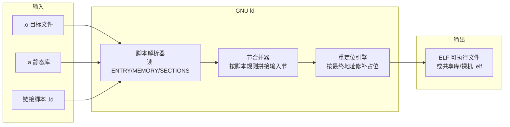
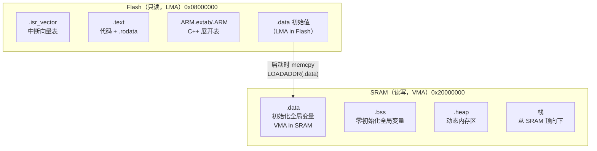

# 链接器详解（7）· 链接脚本

> [!abstract] TL;DR
> - **链接脚本（Linker Script）** 是 GNU ld / LLD 读取的一份文本指令，用于**精确控制输出文件的内存布局**：哪些节放在哪、从哪个地址开始、要留多大空隙、哪些符号要对外暴露。
> - 大多数 Linux 桌面程序完全不需要手写链接脚本——链接器有内置默认脚本，`ld --verbose` 可以打印。**嵌入式、内核、裸机、bootloader、RTOS** 才是链接脚本的主战场，因为那里没有 OS 帮你分配地址，必须人工告诉链接器"Flash 从哪到哪、RAM 从哪到哪、栈放在哪"。
> - 最关键的两个概念：**位置计数器 `.`**（记录当前填写位置，可赋值、可读取）和 **VMA vs LMA**（VMA 是运行时地址、LMA 是加载/存储地址，ROM→RAM 场景必须拆分）。
> - 在脚本里定义符号（如 `__bss_start`/`_end`）是连接链接器与 C 初始化代码（`memset`/`memcpy` 清 BSS、拷 .data）的标准手法。

---

## 概述与定位

### 什么是链接脚本

链接器把一堆 `.o` / `.a` 拼成最终可执行文件或库，这个拼接过程有大量"政策"需要决定：

- 各节（`.text`/`.data`/`.bss`/...）在输出文件中排列顺序是什么？
- 第一条指令（程序入口）的地址是多少？
- `.text` 段的起始虚拟地址是 `0x00400000` 还是 `0x08048000` 还是 `0x00000000`？
- 某些节要按多少字节对齐？
- 哪些节需要被"扔掉"（`/DISCARD/`）？

这些政策，默认由链接器的**内置默认脚本**决定。而链接脚本就是让开发者**覆盖或完全替换这些政策**的手段。脚本是纯文本、用 ld 脚本语言写成，通过 `ld -T script.ld` 或 `gcc -Wl,-T,script.ld` 传入。

### 何时需要手写链接脚本

| 场景 | 理由 |
|---|---|
| 裸机 / bootloader（无 OS） | 没有 OS 的内存映射约定，Flash 起始地址、SRAM 地址必须手工指定 |
| 嵌入式 MCU（STM32/RP2040/RISC-V SoC 等） | 片内 Flash / SRAM 分布固定，需告知链接器边界 |
| Linux 内核 & 模块 | 内核有 `vmlinux.lds.S`（C 预处理后的链接脚本），用于控制 `.init.*`/`per_cpu`/`__ksymtab` 等专属节 |
| 自定义运行时 / 语言 VM | 需要精确控制内存布局（如将只读常量放 XIP Flash）|
| 安全加固 / 分段隔离 | 强制代码段与数据段分离到不同段，调整 `PT_GNU_RELRO` 覆盖范围 |
| 可执行文件最小化 | 主动丢弃不需要的节（`/DISCARD/`），减小二进制尺寸 |

### 查看默认脚本

在开始写脚本之前，最好先看看链接器的默认决策是什么：

```bash
ld --verbose                 # 打印 GNU ld 内置默认脚本（很长）
ld --verbose | less
gcc hello.c -Wl,--verbose 2>&1 | grep -A 9999 'opening script'
```

> [!warning] 示例输出为示意
> `ld --verbose` 会输出数百行的内置脚本，开头类似 `/* Script for -z combreloc ...*/`，随后是完整的 `SECTIONS { ... }` 块。这是理解"默认行为"最可靠的一手资料，实际内容随 ld 版本和目标架构而异。

---

## 原理与机制

### 链接脚本处理流程



链接脚本不改变重定位的计算逻辑（那是 [[06.链接期重定位]] 的主题），它只决定**各节在输出文件中的位置与地址**——而这正是重定位计算的前提。链接器读完脚本、确定了每个节的 VMA 之后，才能把所有"相对 PC 多少字节"/"绝对地址"的占位改写成正确的数字。

### 核心语言元素速览

```
ENTRY(符号名)           /* 程序入口点（写入 ELF e_entry） */
MEMORY { 区域定义 }     /* 声明物理存储区域（片内 Flash/RAM 等） */
SECTIONS { 输出节定义 } /* 核心：控制节布局，必须有 */
PROVIDE(符号 = 表达式)  /* 若符号未在任何 .o 中定义，则由链接器定义 */
KEEP(节匹配模式)        /* 即使 --gc-sections 也不丢弃 */
ASSERT(条件, "消息")    /* 断言，条件为假则报错 */
```

---

## 核心命令详解

### ENTRY

```ld
ENTRY(_start)
ENTRY(Reset_Handler)   /* 嵌入式常用：复位向量处理函数 */
```

指定程序入口符号，写入 ELF 文件头的 `e_entry` 字段。若不写，链接器按以下优先级降级：`_start` 符号、`.text` 节起始地址、`0`。与 ELF 文件头的 `e_entry` 字段对应（程序头表见 [[11.ELF文件详解/03.程序头表.md]]）——内核/解释器拿到这个地址后跳转执行。

### SECTIONS 块与位置计数器 `.`

`SECTIONS` 是整个链接脚本的核心，语法：

```ld
SECTIONS
{
    输出节名 [地址] : [AT(LMA地址)]
    {
        输入节匹配模式
    } [>VMA区域] [:phdr段] [=填充值]
}
```

**位置计数器 `.`** 是脚本里最重要的隐式变量，始终等于"当前写到了哪个字节"：

```ld
SECTIONS
{
    . = 0x08000000;          /* 设置起始虚拟地址 */

    .text :
    {
        KEEP(*(.isr_vector))  /* 中断向量表必须放最前 */
        *(.text .text.*)      /* 所有 .o 的 .text 节 */
        *(.rodata .rodata.*)  /* 只读数据 */
    }

    . = ALIGN(4);            /* 对齐到 4 字节边界 */

    .data :
    {
        *(.data .data.*)
    }
}
```

- `*(.text .text.*)` 是**通配符匹配**：`*` 匹配任意输入文件，括号内是节名模式（`.text.func_name` 是 `-ffunction-sections` 分裂出的单函数节）。
- `. = ALIGN(4)` 把位置计数器向上对齐到 4 字节，在节之间插入填充字节。
- `. = 某地址` 直接跳到那个地址（如果低于当前位置则报错；如果高于，则产生空洞/填充）。

读完节合并逻辑，可与 [[11.ELF文件详解/34.节头表.md]] 对照——脚本里一个输出节名，对应节头表里的一个 `Elf64_Shdr` 条目。

### MEMORY 块

`MEMORY` 声明物理存储区域，让链接器知道"这些地址范围的内存/存储器叫什么名字、有多大"：

```ld
MEMORY
{
    /*         名字   属性    起始地址    大小  */
    FLASH (rx)     : ORIGIN = 0x08000000, LENGTH = 512K
    SRAM  (rwx)    : ORIGIN = 0x20000000, LENGTH = 128K
    CCM   (rw)     : ORIGIN = 0x10000000, LENGTH = 64K
}
```

属性字母：`r`=可读、`w`=可写、`x`=可执行、`a`=可分配、`i`/`l`=已初始化。定义好区域后，节描述里用 `>FLASH` / `>SRAM` 指定节放入哪个区域：

```ld
.text  : { *(.text*) } >FLASH
.data  : { *(.data*) } >SRAM AT>FLASH   /* VMA 在 SRAM，LMA 在 FLASH */
.bss   : { *(.bss*)  } >SRAM
```

### VMA vs LMA

这是嵌入式链接脚本最重要的概念，也是最容易混淆的地方。

| 术语 | 全称 | 含义 |
|---|---|---|
| **VMA** | Virtual Memory Address | **运行地址**：程序运行时这块内存/数据位于哪 |
| **LMA** | Load Memory Address | **加载/存储地址**：这块数据在存储介质（ROM/Flash）中物理放在哪 |

两者通常相同（普通 Linux 程序就是这样）。但在 ROM→RAM 场景下**必须分开**：

```
+------------------+            +------------------+
|   Flash (只读)   |            |    SRAM (读写)   |
| LMA 0x08000000   |  启动时   | VMA 0x20000000   |
|  .text  ← 运行  |  无需拷   |                  |
|  .data  ← 初值  |  ──拷──>  |  .data ← 运行中  |
+------------------+            +------------------+
```

`.text` 直接在 Flash 中运行（VMA=LMA=Flash 地址），`.data` 的初始值必须存在 Flash（LMA），但运行时要在 SRAM（VMA），启动代码负责把这段数据从 LMA 拷贝到 VMA。

**脚本写法**（`AT>` 语法）：

```ld
.data : AT>FLASH       /* LMA 区域 = FLASH */
{
    _data_start = .;   /* VMA 起始，给启动代码用 */
    *(.data .data.*)
    _data_end = .;
} >SRAM                /* VMA 区域 = SRAM */

/* 用 LOADADDR 宏取 .data 的 LMA，用于启动时的 memcpy */
_data_load = LOADADDR(.data);
```

`LOADADDR(.节名)` 函数返回该输出节的 LMA，可赋给一个符号，供 C 启动代码调用：

```c
// startup.c（概念示意）
extern uint32_t _data_start, _data_end, _data_load;
// 把 .data 从 Flash LMA 拷到 SRAM VMA
memcpy(&_data_start, &_data_load,
       (uint8_t *)&_data_end - (uint8_t *)&_data_start);
```

`readelf` 可以同时查看两个地址：

```bash
readelf -S firmware.elf | grep -A5 ' .data'
# Addr 字段 = VMA，LMA 字段 = LMA（若两者不同会单独列出）
```

> [!warning] 示例输出为示意

### 在脚本中定义符号

赋值语句 `符号名 = 表达式;` 在链接脚本中定义全局符号，可从 C 代码中用 `extern` 引用：

```ld
SECTIONS
{
    .bss :
    {
        __bss_start = .;      /* BSS 起始地址 */
        *(.bss .bss.*)
        *(COMMON)
        . = ALIGN(4);
        __bss_end = .;        /* BSS 结束地址 */
    } >SRAM

    _end = .;                 /* 堆起始（通常 sbrk 用这个） */
    _stack_top = ORIGIN(SRAM) + LENGTH(SRAM);   /* 栈顶 */
}
```

C 代码中：

```c
extern uint32_t __bss_start;
extern uint32_t __bss_end;

// 清零 BSS 段（启动代码必做）
memset(&__bss_start, 0,
       (uint8_t *)&__bss_end - (uint8_t *)&__bss_start);
```

> [!note] 符号的值是"地址"
> 脚本里 `__bss_start = .;` 定义的符号，其值是一个**地址**，不是一个普通变量。在 C 里必须用 `&__bss_start`（取地址）才能得到这个数字；直接 `__bss_start` 作为 uint32_t 是未定义行为。这是新手最常犯的错误。

### PROVIDE

```ld
PROVIDE(__bss_start = .);
```

与普通赋值的区别：**如果某个 `.o` 文件已经定义了同名符号，`PROVIDE` 版本静默失效**（不报多重定义）；如果没有任何 `.o` 定义该符号，链接器才用脚本里的值。适合"默认值"语义——让应用层 C 代码可以覆盖链接脚本提供的默认实现。

### KEEP

```ld
KEEP(*(.isr_vector))    /* 保留中断向量表，即使没有符号引用它 */
KEEP(*(.noinit))
```

`--gc-sections` 让链接器丢弃没有被任何"根"引用到的节（对应 [[05.节的合并与布局]] 的垃圾收集）。`KEEP` 是"豁免令"，被它包裹的节无论是否有引用都保留。中断向量表（`.isr_vector`）必须 `KEEP`，否则 `--gc-sections` 会认为它没被调用而删掉，导致启动就崩。

### ASSERT

```ld
ASSERT(SIZEOF(.data) + SIZEOF(.bss) < LENGTH(SRAM),
       "Error: SRAM overflow! Reduce data/bss size.")

ASSERT((_stack_top - _stack_size) > _end,
       "Error: Stack and heap overlap!")
```

`ASSERT` 在链接期检查条件，若为假则报错中止链接并打印消息。它是嵌入式开发中防止"编译通过但运行时内存越界"的重要安全网。

---

## 数据结构 / 流程详解

### 完整嵌入式链接脚本示例（STM32 风格 Cortex-M4）

下面是一个**最小可读、可实际使用**的嵌入式链接脚本，附注释：

```ld
/* =====================================================
 * 嵌入式链接脚本示例（Cortex-M4，512K Flash / 128K SRAM）
 * 用法：arm-none-eabi-gcc ... -T stm32f4.ld
 * ===================================================== */

/* 1. 声明存储区域 */
MEMORY
{
    FLASH (rx)  : ORIGIN = 0x08000000, LENGTH = 512K
    SRAM  (rwx) : ORIGIN = 0x20000000, LENGTH = 128K
}

/* 2. 程序入口（Cortex-M Reset_Handler，写入 ELF e_entry） */
ENTRY(Reset_Handler)

/* 3. 节布局 */
SECTIONS
{
    /* ---- Flash 区域：只读内容 ---- */

    /* 3.1 中断向量表（必须放最前，KEEP 防 gc-sections 丢弃） */
    .isr_vector :
    {
        . = ALIGN(4);
        KEEP(*(.isr_vector))
        . = ALIGN(4);
    } >FLASH

    /* 3.2 代码 + 只读数据 */
    .text :
    {
        . = ALIGN(4);
        *(.text .text.*)        /* 所有代码 */
        *(.rodata .rodata.*)    /* 字符串常量、只读全局等 */
        KEEP(*(.init))          /* C++ 静态构造器表 */
        KEEP(*(.fini))
        . = ALIGN(4);
        _etext = .;             /* Flash 中只读区结束地址 */
    } >FLASH

    /* 3.3 ARM 展开表（C++ 异常 / backtrace） */
    .ARM.extab :
    {
        *(.ARM.extab* .gnu.linkonce.armextab.*)
    } >FLASH

    .ARM :
    {
        __exidx_start = .;
        *(.ARM.exidx*)
        __exidx_end = .;
    } >FLASH

    /* 3.4 .data 初始值存在 Flash（LMA），运行在 SRAM（VMA） */
    /* AT>FLASH 指定 LMA 区域；>SRAM 指定 VMA 区域            */
    .data : AT>FLASH
    {
        . = ALIGN(4);
        _data_start = .;        /* SRAM VMA 起始 */
        *(.data .data.*)
        . = ALIGN(4);
        _data_end = .;          /* SRAM VMA 结束 */
    } >SRAM

    /* 用于启动代码 memcpy：从这个 Flash LMA 拷到 _data_start */
    _data_load = LOADADDR(.data);

    /* ---- SRAM 区域：运行时读写 ---- */

    /* 3.5 BSS（未初始化/零初始化全局变量） */
    .bss :
    {
        . = ALIGN(4);
        __bss_start = .;
        *(.bss .bss.*)
        *(COMMON)               /* 弱定义全局变量（FORTRAN/C common） */
        . = ALIGN(4);
        __bss_end = .;
    } >SRAM

    /* 3.6 堆 */
    .heap :
    {
        . = ALIGN(8);
        __heap_start = .;
        . = . + 0x1000;         /* 4KB 堆，可按需调整 */
        __heap_end = .;
    } >SRAM

    /* 3.7 栈（从 SRAM 顶部向下生长） */
    _stack_size = 0x1000;       /* 4KB 栈 */
    _stack_top  = ORIGIN(SRAM) + LENGTH(SRAM);
    _stack_base = _stack_top - _stack_size;

    /* 3.8 安全断言：确保栈不与堆重叠 */
    ASSERT(__heap_end <= _stack_base,
           "Error: Heap and stack overlap! Reduce heap/stack size.")

    /* 3.9 丢弃调试/注释节（减小裸机固件尺寸） */
    /DISCARD/ :
    {
        *(.comment)
        *(.note*)
    }
}
```

**脚本结构可视化**：



---

## 三平台对照

### GNU ld / LLD（Linux / 嵌入式）

| 特性 | GNU ld（BFD） | LLD（LLVM） |
|---|---|---|
| 脚本语言 | ld script（本篇主题） | 兼容 ld script（大部分语法支持） |
| 查看默认脚本 | `ld --verbose` | `ld.lld --verbose`（输出形式略有差异） |
| 自定义脚本 | `-T script.ld` | 同 `-T script.ld` |
| `MEMORY` 块 | 完整支持 | 支持 |
| `AT>` LMA | 完整支持 | 支持 |
| `PROVIDE` | 支持 | 支持 |
| `ASSERT` | 支持 | 支持 |
| 差异点 | `OVERLAY` 等高级特性 LLD 支持有限 | 对某些脚本扩展语法（如 `INSERT AFTER`）支持更严格 |

LLD 追求与 GNU ld 脚本的最大兼容性，目前 Linux 内核、Android NDK 均已支持用 LLD 链接，ld 脚本直接复用。macOS 的 ld64 **不使用 ld script 语法**，而是通过不同的 flag 体系（`-seg_addr_table`/`-sectorder`/`-image_base` 等）控制布局。

### macOS ld64

macOS 的链接器 ld64 没有等价的"链接脚本"语言。布局控制依靠：

```bash
ld64 -image_base 0x100000000   # 设置基址（类似脚本里的 . = 地址）
ld64 -sectorder __TEXT __text order_file.txt  # 按 order_file 排函数顺序
ld64 -seg_addr_table addr_file  # 指定各段地址
```

macOS 不存在嵌入式/裸机 ld64 使用场景（那些平台用交叉编译 GNU ld / LLD），所以链接脚本的嵌入式能力在 macOS 上没有直接对应物。

### Windows MSVC link.exe

> [!note] Windows 侧说明
> MSVC 工具链完全没有等价的 ld script。布局控制分散在以下机制中：

| GNU ld 功能 | MSVC 等价物 |
|---|---|
| `ENTRY(符号)` | `/ENTRY:符号名`（链接器选项） |
| `SECTIONS { .text : ... }` | `/SECTION:.text,rx`（节属性）；`.def` 文件（导出控制）；无"重新排布节"能力 |
| `MEMORY { FLASH ... }` | 无等价；PE 的段地址由 `/BASE:地址` + 节在可执行文件中的偏移决定 |
| `.` 位置计数器 / VMA vs LMA | PE 格式没有 LMA/VMA 分离概念（Windows 有 Loader 负责页面映射，裸机拷贝场景不适用） |
| `PROVIDE(符号 = .)` | `.def` 文件 `EXPORTS` 块（仅用于 DLL 导出符号，语义不同）|
| `ASSERT(...)` | `/SECTION` 约束有限；无脚本级断言 |
| `/DISCARD/` | `/MERGE:.section1=.section2`（合并节）或 `/SECTION:.xxx,D`（标记可丢弃）|
| 中断向量表 `/KEEP` | 无嵌入式场景；Windows 内核驱动有 `.sys` 专属布局，不走 ld script |

**简而言之**：ld script 是 GNU 工具链生态（Linux / 嵌入式 ARM / RISC-V）的专属特性。MSVC link.exe 只接受命令行 flag 和 `.def` 文件，无法做到"声明存储区域 + 精确控制节布局 + VMA/LMA 分离"这套嵌入式必备能力——这也是嵌入式开发几乎清一色使用 GCC / LLVM 交叉工具链的原因之一。

---

## 代码与命令

### 基本用法

```bash
# 方法一：直接用 ld
arm-none-eabi-ld -T stm32f4.ld startup.o main.o -o firmware.elf

# 方法二：通过 gcc 传入（推荐，gcc 会自动加 crt*.o 等）
arm-none-eabi-gcc -T stm32f4.ld -o firmware.elf main.c startup.c \
    -nostdlib -fno-exceptions

# 方法三：CMake + GCC 交叉编译（常见嵌入式项目）
# CMakeLists.txt 里：
# target_link_options(fw PRIVATE -T ${CMAKE_CURRENT_SOURCE_DIR}/stm32f4.ld)
```

### 验证脚本效果

```bash
# 查看输出节的 VMA / LMA / 大小
arm-none-eabi-readelf -S firmware.elf

# 查看段（程序头），确认 LMA 与 VMA 分离
arm-none-eabi-readelf -l firmware.elf

# 查看脚本定义的符号（__bss_start / _data_load 等）
arm-none-eabi-nm firmware.elf | grep -E '_data|_bss|_end|_stack'

# 生成 .map 文件，完整查看每个 .o 节如何被放置
arm-none-eabi-ld -T stm32f4.ld -Map=firmware.map *.o -o firmware.elf
```

> [!warning] 示例输出为示意
> 以下输出均为代表性示意，不代表任何真实运行期地址，具体值随脚本内容和输入文件而变。

```text
$ arm-none-eabi-readelf -S firmware.elf
There are 14 section headers, starting at offset 0x...

Section Headers:
  [Nr] Name              Type   Addr       Off    Size   ES Flg Lk Inf Al
  [ 1] .isr_vector       PROGBITS 08000000  000034 0001c0  00  AX  0   0  4
  [ 2] .text             PROGBITS 080001c0  0001f4 003200  00  AX  0   0  4
  [ 3] .data             PROGBITS 20000000  0033f4 0000a8  00  WA  0   0  4
  ...
  Flags: A=alloc, X=execute, W=write

$ arm-none-eabi-readelf -l firmware.elf
Program Headers:
  Type       Offset   VirtAddr   PhysAddr   FileSiz MemSiz  Flg Align
  LOAD       0x000034 0x08000000 0x08000000 0x033f4 0x033f4 R E 0x8  <- .text (VMA=LMA)
  LOAD       0x0033f4 0x20000000 0x080033f4 0x000a8 0x000a8 RW  0x4  <- .data (VMA≠LMA!)
```

注意第二个 `LOAD` 段：`VirtAddr=0x20000000`（SRAM，VMA）、`PhysAddr=0x080033f4`（Flash，LMA）——这正是 `AT>FLASH` 产生的效果，也是 `readelf -l` 查 LMA 的标准方法。

```text
$ arm-none-eabi-nm firmware.elf | grep -E '_data|_bss|_end'
20000000 D _data_start
200000a8 D _data_end
080033f4 A _data_load      <- LMA（A=absolute，地址本身）
200000a8 B __bss_start
20000200 B __bss_end
```

> [!warning] 示例输出为示意

### 常见陷阱与调试

**1. 节顺序决定链接顺序**

脚本里 `*(.text*)` 先出现，这个节就先被填充。特别是中断向量表——它必须从 Flash 起始地址 `0x08000000` 开始，Cortex-M 启动时从这里读初始 SP 和 Reset_Handler 地址，位置错了就不能启动。

**2. 忘记 `KEEP` 导致向量表被 gc-sections 删除**

```bash
# 症状：加了 --gc-sections 后固件无法启动
# 诊断：
arm-none-eabi-nm firmware.elf | grep isr_vector   # 应有输出
# 修复：在脚本中 KEEP(*(.isr_vector))
```

**3. C 代码错误引用脚本符号**

```c
// 错误写法（__bss_start 是地址符号，不是 uint32_t 变量）
uint32_t size = __bss_end - __bss_start;   // 编译器会警告，值也不对

// 正确写法
extern char __bss_start[], __bss_end[];
size_t size = __bss_end - __bss_start;    // 指针相减得字节数
```

**4. `.` 跳转过低导致节重叠**

```ld
. = 0x20000000;
.data : { *(.data*) }
. = 0x20000050;   /* 若 .data 已超过此地址，链接器报 overlap 错误 */
```

---

## 实操

> [!warning] 本节所有命令输出为示意，非本机实跑（本机为 Windows；以下命令需在 Linux / WSL / 交叉编译环境下执行）。

### 一个最小可运行的裸机示例

目录结构：

```
bare/
├── stm32f4_min.ld     # 链接脚本
├── startup.c          # 启动代码（清 BSS、拷 .data、跳 main）
└── main.c             # 业务代码
```

`stm32f4_min.ld`（最简版）：

```ld
MEMORY
{
    FLASH (rx)  : ORIGIN = 0x08000000, LENGTH = 512K
    SRAM  (rwx) : ORIGIN = 0x20000000, LENGTH = 128K
}
ENTRY(Reset_Handler)
SECTIONS
{
    .text : { KEEP(*(.isr_vector)) *(.text*) *(.rodata*) } >FLASH
    _etext = .;

    .data : AT>FLASH
    {
        _data_start = .; *(.data*) . = ALIGN(4); _data_end = .;
    } >SRAM
    _data_load = LOADADDR(.data);

    .bss  :
    {
        __bss_start = .; *(.bss*) *(COMMON) . = ALIGN(4); __bss_end = .;
    } >SRAM
}
```

`startup.c`（节选关键部分）：

```c
extern uint32_t _data_start, _data_end, _data_load;
extern uint32_t __bss_start, __bss_end;
extern int main(void);

void Reset_Handler(void)
{
    /* 1. 从 Flash（LMA）拷 .data 到 SRAM（VMA） */
    uint32_t *src = &_data_load;
    uint32_t *dst = &_data_start;
    while (dst < &_data_end) *dst++ = *src++;

    /* 2. 清零 .bss */
    for (uint32_t *p = &__bss_start; p < &__bss_end; ) *p++ = 0;

    /* 3. 跳应用入口 */
    main();
    for (;;);   /* 不应返回 */
}
```

编译链接：

```bash
arm-none-eabi-gcc -mcpu=cortex-m4 -mthumb -Os \
    -T stm32f4_min.ld -nostartfiles \
    -o firmware.elf startup.c main.c

# 生成 binary 烧录文件
arm-none-eabi-objcopy -O binary firmware.elf firmware.bin
```

> [!warning] 示例输出为示意

### 查看 Linux 默认脚本（桌面场景）

```bash
# 打印 x86-64 ELF 可执行的内置默认脚本
ld --verbose 2>/dev/null | grep -v 'FILE\|SEARCH\|attempt'

# 输出节有无被 gc-sections 删掉（结合 --print-gc-sections）
gcc -Wl,--gc-sections,--print-gc-sections -o a.out main.c 2>&1 | head -20
```

> [!warning] 示例输出为示意

---

## 小结

1. **链接脚本 = 链接器的"布局蓝图"**：告诉 ld 把哪些节放到哪个地址、Flash/RAM 边界在哪、入口符号是什么。桌面 Linux 程序用默认脚本，嵌入式/内核/裸机必须自己写。

2. **位置计数器 `.` 是核心机制**：它随填充过程自动推进，也可被赋值（跳到指定地址）或读取（记录当前位置给符号），`ALIGN()` 函数实现对齐填充。

3. **VMA vs LMA 是嵌入式必修课**：VMA = 运行地址（SRAM），LMA = 存储地址（Flash）；`AT>` 语法指定 LMA 区域，`LOADADDR(.data)` 取 LMA 值，启动代码靠 `memcpy` 完成 ROM→RAM 拷贝。

4. **脚本符号连接链接器与 C 代码**：`__bss_start` / `_data_start` / `_end` 这类符号在脚本里定义、在 C startup 代码里 `extern` 引用，是初始化 BSS/DATA 的标准惯例。C 代码中必须用 `&符号名` 取地址，直接使用是错误的。

5. **`KEEP`/`ASSERT` 是安全网**：前者防 `--gc-sections` 误删中断向量表，后者在链接期做内存越界断言，两者都应在嵌入式脚本中常规使用。

6. **Windows MSVC link.exe 无等价链接脚本**：布局控制靠 `/ENTRY`/`/SECTION`/`.def`，无 `MEMORY` 块、无 VMA/LMA 分离、无脚本级断言；这是嵌入式开发坚守 GCC/LLVM 工具链的结构性原因。

---

## 相关阅读

- **本系列上篇（重定位与脚本的关系）**：[[06.链接期重定位]]
- **本系列下篇（动态库与共享对象链接）**：[[08.动态库链接]]
- **节头表（脚本输出节对应的 ELF 数据结构）**：[[11.ELF文件详解/34.节头表.md]]
- **程序头表（PT_LOAD 段与 VMA/LMA 的 ELF 表示）**：[[11.ELF文件详解/03.程序头表.md]]
- **节合并与 gc-sections（与 KEEP 强相关）**：[[05.节的合并与布局]]
- **C 运行时启动链路（_start/crt0 与 BSS 清零、DATA 拷贝）**：[[12.链接器与C运行时]]
- **GOT 与符号（脚本定义的符号如何参与重定位）**：[[11.ELF文件详解/17.got节.md]]
- **CMake 驱动交叉编译链接脚本**：[[42.Cmake/00 - CMake 完整技术教程 - 总索引]]

---

⬅️ 上一篇 [[06.链接期重定位]] ｜ 🏠 [[00.链接器详解总览]] ｜ 下一篇 [[08.动态库链接]] ➡️
