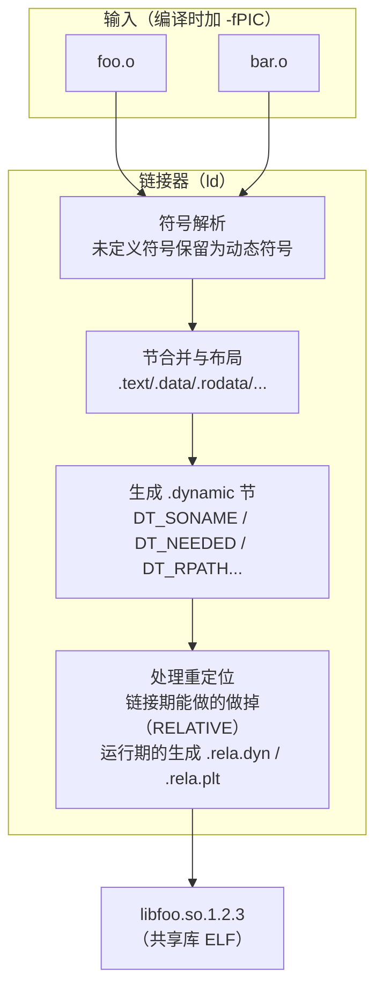

# 链接器详解（8）· 动态库链接

> [!abstract] TL;DR
> - **链接生成动态库**：用 `-shared -fPIC` 告诉编译器/链接器"产物是共享库"，PIC（位置无关代码）让代码段在任意加载地址都能正确运行，通过 GOT 间接访问所有外部符号。
> - **三级命名**：动态库存在三个层次的名字——`real name`（带完整版本的磁盘文件名 `libfoo.so.1.2.3`）、`soname`（链接器写入 `DT_SONAME`、运行期查找的逻辑名 `libfoo.so.1`）、`linker name`（链接时 `-lfoo` 找到的裸符号链 `libfoo.so`）。
> - **链接期 vs 运行期**：链接器对 `.so` 的处理是**记录依赖**（向 `.dynamic` 写入 `DT_NEEDED`）而非并入代码；真正的库加载、符号绑定由运行期 `ld.so` 完成（详见 [[14.动态链接与加载器详解/05.依赖解析与库搜索顺序.md]]）。
> - **路径控制**：`-rpath` 把路径烘焙进 `DT_RPATH`/`DT_RUNPATH`，`-rpath-link` 仅用于链接期传递依赖路径但不写入产物。
> - **三平台差异显著**：Linux ELF 用 `SONAME`；Windows PE 用导入库 `.lib` + `__declspec` + `.def` 文件；macOS Mach-O 用 `install_name`（`-dynamiclib`）。

本篇聚焦**链接器在构建动态库时做了什么**，以及**链接可执行文件时如何与 `.so`/`.dll`/`.dylib` 交互**。运行期加载流程（`ld.so` 如何搜索、加载依赖库）由 [[14.动态链接与加载器详解/01.从静态链接到动态链接.md]] 与 [[14.动态链接与加载器详解/05.依赖解析与库搜索顺序.md]] 接棒；符号可见性与版本脚本接在 [[09.符号可见性与版本]] 继续展开。

---

## 概述与定位

### 为什么需要动态库

静态链接把库代码物理拷入每个可执行文件：100 个程序都链接了 libc，就有 100 份 libc 的代码占据磁盘和内存。动态库（共享库）的核心价值在于：

1. **代码共享**：同一 `.so` 的代码段被多进程以**只读**共享映射（物理页面只有一份），大幅节省内存。
2. **独立更新**：修复 libc 的 bug 只需替换 `liblibc.so`，所有链接了它的程序下次启动即生效，无需重新链接。
3. **减小发布体积**：可执行文件只包含自己的代码，公共依赖由系统提供。

代价是启动时需要动态链接器完成符号解析，以及因为位置无关代码（PIC）引入的一层间接访问开销。

### 本篇在系列中的位置

| 维度 | 本篇聚焦 | 相邻篇章 |
|---|---|---|
| 链接期 | `ld` 如何生成 `.so`、如何记录 `DT_NEEDED` | 链接期重定位原理见 [[06.链接期重定位]] |
| 运行期 | 由 `ld.so` 接棒（仅提要） | 详见 [[14.动态链接与加载器详解/01.从静态链接到动态链接.md]]、[[14.动态链接与加载器详解/05.依赖解析与库搜索顺序.md]] |
| 符号控制 | 导出什么、如何控制可见性 | 版本脚本/visibility 见 [[09.符号可见性与版本]] |
| Windows 导出表结构 | `IMAGE_EXPORT_DIRECTORY` 三张数组 | 详见 [[13.PE文件详解/09-详解PE文件(九)：导出表.md]] |

---

## 原理与机制

### `-shared` 与 `-fPIC`：两个独立的开关

这两个选项经常一起出现，但职责完全不同：

| 选项 | 作用对象 | 说明 |
|---|---|---|
| `-fPIC` | **编译器**（`gcc`/`clang`） | 生成位置无关代码：数据访问经 GOT 间接、函数调用经 PLT；产物 `.o` 可以被加载到任意地址 |
| `-shared` | **链接器**（`ld`） | 告诉链接器"输出文件是共享库（`.so`）"；不生成 `main` 入口、不要求 `crt0`；把所有未解析符号保留为动态符号 |

> [!note] 没有 `-fPIC` 但加了 `-shared` 会怎样
> 链接器不会报错，但编译器生成的代码含绝对地址（`R_X86_64_32` 等非 PIC 重定位），这些重定位要求在加载时**修改代码段中的绝对地址**（text relocation）。代码段就无法被多进程只读共享，内核会为每个进程单独复制一份，浪费内存。Linux 现代工具链对 `-shared` 产物里的 text relocation 会发警告甚至拒绝。**正确做法：编译时 `-fPIC`，链接时 `-shared`，二者配合才能生成真正可共享的库**。

### PIC 的核心机制：GOT 间接

位置无关代码不能写死任何绝对地址，所有外部符号访问都通过 GOT（Global Offset Table）间接：

```mermaid
graph LR
    CODE["PIC 代码<br/>引用 extern_var"] -->|GOTPCREL(%rip)| GOT[".got / .got.plt 表项"]
    GOT -->|ld.so 加载时填入| REAL["extern_var 真实地址"]
    RELDYN[".rela.dyn (GLOB_DAT)"] -.链接期生成重定位条目.-> GOT
```

- **数据符号**：`movq extern_var@GOTPCREL(%rip), %rax` —— 先取 GOT 表项地址，再解引用。见 [[11.ELF文件详解/17.got节.md]] 的完整论述。
- **函数符号**：通过 PLT stub + `.got.plt` 的延迟绑定机制，详见 [[14.动态链接与加载器详解/08.PLT与GOT与延迟绑定.md]]。

### `-shared` 链接的完整流程



与静态链接最大的差别有两点：

1. **未解析符号不是错误**：`-shared` 时，链接器对外部未定义符号默认允许存在（它们会作为 `DT_NEEDED` 依赖在运行期解析）。可用 `--no-undefined` 强制检查。
2. **不并入库代码**：链接 `libbar.so` 只记录 `DT_NEEDED "libbar.so.1"`，不把 `libbar.so` 的 `.text` 拷进来。这是与静态库（`.a`）最本质的区别。

---

## SONAME 与三级命名

动态库的命名体系是理解链接、安装、版本管理的关键。Linux 上一个 `libfoo` 通常以三个文件名形态出现：

| 名称层次 | 示例 | 用途 | 谁使用 |
|---|---|---|---|
| **real name** | `libfoo.so.1.2.3` | 磁盘上真实文件，包含完整版本号 `major.minor.patch` | 安装脚本、包管理器 |
| **soname** | `libfoo.so.1` | 写入 `DT_SONAME`；运行期 `ld.so` 按 soname 查找 | 运行期加载器（`ld.so`） |
| **linker name** | `libfoo.so` | 指向 soname 的符号链；`-lfoo` 就找它 | 编译时 `-lfoo` |

三者的关系：

```
libfoo.so   →(符号链)→   libfoo.so.1   →(符号链)→   libfoo.so.1.2.3
   ↑                           ↑                              ↑
linker name                  soname                        real name
（给 -lfoo 找到）         （写进 DT_SONAME）             （磁盘真实文件）
```

### 设置 SONAME：`-Wl,-soname,libfoo.so.1`

```bash
# 完整命令：编译 → 链接 → 生成带 SONAME 的共享库
gcc -c -fPIC foo.c -o foo.o
gcc -shared -fPIC -Wl,-soname,libfoo.so.1 foo.o -o libfoo.so.1.2.3
```

`-Wl,-soname,libfoo.so.1` 中：
- `-Wl,` 把后续选项透传给链接器
- `-soname,libfoo.so.1` 让链接器在产物的 `.dynamic` 节写入 `DT_SONAME = "libfoo.so.1"`

**不设 SONAME 的后果**：运行期 `ld.so` 用完整文件名（`libfoo.so.1.2.3`）作为查找键，部署路径稍有变化就找不到库，升级时也无法平滑切换。**始终应该设置 SONAME**。

### 验证 SONAME

```bash
readelf -d libfoo.so.1.2.3 | grep SONAME
```

```text
 0x000000000000000e (SONAME)    Library soname: [libfoo.so.1]
```

> [!warning] 示例输出为示意
> 地址值、偏移随工具链版本变化；字段名 `SONAME` 与 soname 内容 `libfoo.so.1` 是标准约定，可放心识别。

### 创建符号链

```bash
# 安装时建立两个符号链
ln -sf libfoo.so.1.2.3 libfoo.so.1   # soname 链（ldconfig 通常自动维护）
ln -sf libfoo.so.1     libfoo.so      # linker name 链（开发包 -dev 提供）
```

`ldconfig` 会扫描 `/etc/ld.so.conf` 指定的目录，自动为每个 `.so.M.m.p` 维护 `soname` 符号链并更新 `/etc/ld.so.cache`。

---

## 链接期对 `.so` 的处理（记录依赖，不并入代码）

链接可执行文件时指定 `-lfoo`，链接器做的事与静态库（`.a`）截然不同：

| 操作 | 静态库 `.a` | 动态库 `.so` |
|---|---|---|
| 符号解析 | 从归档按需提取 `.o`，把代码拷进输出文件 | 仅从 `.so` 的 `.dynsym` 表查符号，**不并入代码** |
| 依赖记录 | 不记录（代码已内嵌） | 向输出文件的 `.dynamic` 添加 `DT_NEEDED "libfoo.so.1"` |
| 产物大小 | 增加被引用代码 | 不增加（只多几个字节的 `DT_NEEDED` 条目） |
| 重定位类型 | 链接期完成（`R_X86_64_PC32` 等） | 生成运行期重定位条目（`R_X86_64_JUMP_SLOT`、`R_X86_64_GLOB_DAT`） |

### `DT_NEEDED`：依赖的唯一记录

链接器把每个直接依赖的 soname 写成一条 `DT_NEEDED`：

```text
# readelf -d ./myapp | grep NEEDED（示意）
 0x0000000000000001 (NEEDED)  Shared library: [libfoo.so.1]
 0x0000000000000001 (NEEDED)  Shared library: [libc.so.6]
```

> [!warning] 示例输出为示意
> `NEEDED` 列表的数量与内容随实际依赖变化；`libc.so.6` 是 glibc x86-64 上的标准 soname，其他平台/发行版 soname 可能不同。

**运行期加载**：`ld.so` 读到 `DT_NEEDED` 后，按库搜索顺序（见 [[14.动态链接与加载器详解/05.依赖解析与库搜索顺序.md]]）找到对应文件并加载。

---

## `-rpath` 与 `-rpath-link`

动态库在运行期必须能被 `ld.so` 找到，除了系统默认搜索路径，还有两种机制让链接器把路径信息写入产物：

### `-rpath`（`-Wl,-rpath,<path>`）

将路径写入 `DT_RPATH` 或 `DT_RUNPATH`（取决于是否同时使用了 `--enable-new-dtags`）：

```bash
gcc main.o -L/opt/mylibs -lfoo -Wl,-rpath,/opt/mylibs -o myapp
```

- 运行期 `ld.so` 在搜索 `libfoo.so.1` 时，`DT_RPATH` 路径优先于 `LD_LIBRARY_PATH`（而 `DT_RUNPATH` 优先级低于 `LD_LIBRARY_PATH`），适合嵌入绝对路径。
- 支持动态令牌 `$ORIGIN`（`ld.so` 解析时替换为可执行文件所在目录），可构建可重定位部署包：`-Wl,-rpath,'$ORIGIN/../lib'`。

| 标签 | 搜索优先级（从高到低） | `--enable-new-dtags` |
|---|---|---|
| `DT_RPATH` | 1（高于 `LD_LIBRARY_PATH`） | 不使用此标志时写入 |
| `DT_RUNPATH` | 低于 `LD_LIBRARY_PATH` | 使用 `--enable-new-dtags` 时写入 |

> [!warning] 安全注意
> 将绝对路径烘焙进 `DT_RPATH` 会使可执行文件依赖特定部署路径，在容器/跨机器部署场景下可能导致找不到库。优先考虑 `$ORIGIN` 相对令牌或 `ldconfig`/`LD_LIBRARY_PATH`。

### `-rpath-link`

仅用于**链接期传递依赖路径**，不写入产物 `.dynamic`：

```bash
gcc main.o -L/opt/mylibs -lfoo -Wl,-rpath-link,/opt/deps -o myapp
```

使用场景：链接 `libfoo.so` 时，`libfoo.so` 本身又依赖 `libbar.so`（间接依赖），但 `libbar.so` 不在标准搜索路径里，此时用 `-rpath-link` 告诉链接器去哪找它以完成符号解析，**但不把该路径写进 `myapp` 的 `DT_RPATH`**。

```mermaid
graph LR
    MYAPP["myapp"] --DT_NEEDED--> FOO["libfoo.so.1"]
    FOO --DT_NEEDED--> BAR["libbar.so.2"]
    RLINK["-rpath-link=/opt/deps"] -.链接期查找 libbar.so<br/>不写入 myapp.-> BAR
```

---

## 数据结构：`.dynamic` 的关键标签

链接器通过 `.dynamic` 节向运行期暴露所有链接期决策：

| 标签 | 说明 | 来源 |
|---|---|---|
| `DT_SONAME` | 本库的 soname（仅共享库有） | `-Wl,-soname,<name>` |
| `DT_NEEDED` | 直接依赖的 soname | `-l<foo>` 链接动态库 |
| `DT_RPATH` | 运行期库搜索路径（硬编码，优先于 LD_LIBRARY_PATH） | `-Wl,-rpath,<path>` |
| `DT_RUNPATH` | 运行期库搜索路径（低于 LD_LIBRARY_PATH） | `-Wl,-rpath,<path> --enable-new-dtags` |
| `DT_PLTGOT` | 指向 `.got.plt` 起始（延迟绑定接线） | 链接器自动 |
| `DT_JMPREL` | 指向 `.rela.plt`（JUMP_SLOT 重定位） | 链接器自动 |
| `DT_INIT` / `DT_FINI` | `.init`/`.fini` 节地址（C++ 构造/析构入口） | 链接器自动 |
| `DT_INIT_ARRAY` / `DT_FINI_ARRAY` | 构造/析构函数指针数组（现代标准） | 链接器自动 |
| `DT_FLAGS` | 标志位（`BIND_NOW`、`PIE` 等） | 链接选项 |

```bash
readelf -d libfoo.so.1.2.3
```

```text
Dynamic section at offset 0x2de0 contains 28 entries:
  Tag        Type                         Name/Value
 0x000000000000000e (SONAME)    Library soname: [libfoo.so.1]
 0x0000000000000001 (NEEDED)    Shared library: [libc.so.6]
 0x000000000000000f (RPATH)     Library rpath: [/opt/mylibs]
 0x000000000000000c (INIT)      0x1000
 0x000000000000000d (FINI)      0x1200
 ...
```

> [!warning] 示例输出为示意
> 偏移地址 `0x2de0`、条目数 28、各 `Tag` 后的数值均为示意；`SONAME`/`NEEDED`/`RPATH` 字段的含义与结构是标准，可放心据此识别。

---

## 三平台对照

### Linux ELF

核心命令：

```bash
# 1. 编译为 PIC 目标文件
gcc -c -fPIC foo.c -o foo.o
gcc -c -fPIC bar.c -o bar.o

# 2. 链接生成共享库（带 SONAME）
gcc -shared -fPIC -Wl,-soname,libfoo.so.1 foo.o bar.o -o libfoo.so.1.2.3

# 3. 创建符号链
ln -sf libfoo.so.1.2.3 libfoo.so.1
ln -sf libfoo.so.1 libfoo.so

# 4. 链接可执行文件，嵌入 rpath
gcc main.o -L. -lfoo -Wl,-rpath,'$ORIGIN' -o myapp

# 5. 验证
readelf -d libfoo.so.1.2.3 | grep -E 'SONAME|NEEDED|RPATH'
readelf -d myapp | grep NEEDED
```

> [!warning] 示例输出为示意
> 在 Windows 本机，上述 `gcc`/`readelf` 命令无法直接执行；以下输出示意均基于 Linux x86-64 标准工具链行为，需在 Linux 环境验证。

关键 `.dynamic` 标签：

```text
# readelf -d libfoo.so.1.2.3 | grep -E 'SONAME|NEEDED'
 0x000000000000000e (SONAME)    Library soname: [libfoo.so.1]
 0x0000000000000001 (NEEDED)    Shared library: [libc.so.6]

# readelf -d myapp | grep NEEDED
 0x0000000000000001 (NEEDED)    Shared library: [libfoo.so.1]
 0x0000000000000001 (NEEDED)    Shared library: [libc.so.6]
```

> [!warning] 示例输出为示意

### Windows PE：DLL、导入库与 `__declspec`

Windows 的动态库机制与 ELF 差异最大，有几个独特概念：

#### 导出与导入声明：`__declspec`

```c
// 库代码（dll.h）——跨平台宏
#ifdef _WIN32
  #ifdef BUILDING_MYDLL
    #define MYDLL_API __declspec(dllexport)
  #else
    #define MYDLL_API __declspec(dllimport)
  #endif
#else
  #define MYDLL_API __attribute__((visibility("default")))
#endif

MYDLL_API int add(int a, int b);
```

- **`__declspec(dllexport)`**：告诉编译器/链接器"这个符号要放进导出表（`IMAGE_EXPORT_DIRECTORY`）"。详见 [[13.PE文件详解/09-详解PE文件(九)：导出表.md]]。
- **`__declspec(dllimport)`**：告诉编译器"这个符号来自 DLL，通过 IAT 间接调用"。编译器生成 `call [__imp_add]`，直接走 IAT，**不需要 PLT 这一层间接**（Windows 加载时就把 IAT 填满了，没有 lazy binding）。

#### 导入库 `.lib`

链接 DLL 时，不直接指定 `.dll`，而是指定**导入库（import library）**`.lib`：

- 导入库是一个**桩文件**，内含 `__imp_foo` 等符号的定义，每个符号指向 IAT 中的对应表项地址。
- 链接器（`link.exe`）通过导入库解析 `__imp_foo` 符号，将调用重定向到 IAT 表项。
- 运行期加载器把 DLL 中各函数的真实地址写进 IAT，`__imp_foo` 所指的那格就变成真实地址。

```
myapp.exe ←用 foo.lib 链接→ 在 IAT 里预留 foo 的槽位
         ←运行期加载器→  从 foo.dll 导出表查 foo，填入 IAT
         ←执行时→         call [__imp_foo] 直接读 IAT，跳到 foo
```

这与 ELF 的最大区别：**Windows 是"加载时全量绑定 IAT"，ELF 默认是"首次调用时 lazy 绑定"**。

#### `.def` 文件（模块定义文件）

`__declspec(dllexport)` 是 C/C++ 内联声明，`.def` 文件是另一种导出控制方式，优势是可以：
- 精确指定**导出序号**（ordinal）
- 控制导出名（别名导出）
- 在不修改源码时控制导出

```
; foo.def
LIBRARY   foo
EXPORTS
    add        @1
    subtract   @2
    internal   PRIVATE    ; 不导出
```

用法（MSVC）：

```bash
link /DLL /DEF:foo.def foo.obj /OUT:foo.dll
```

用法（MinGW/GCC）：

```bash
gcc -shared foo.o -Wl,--output-def,foo.def -o foo.dll -Wl,--out-implib,libfoo.dll.a
```

#### `link /DLL` vs `gcc -shared`

| 操作 | MSVC | GCC（MinGW/Windows） |
|---|---|---|
| 生成 DLL | `link /DLL foo.obj /OUT:foo.dll` | `gcc -shared foo.o -o foo.dll` |
| 同时生成导入库 | 自动生成 `foo.lib` | `-Wl,--out-implib,libfoo.dll.a` |
| 指定 `.def` | `/DEF:foo.def` | `-Wl,--output-def,...` |
| 链接到 DLL | `link main.obj foo.lib /OUT:main.exe` | `gcc main.o -lfoo -L. -o main.exe` |

### macOS Mach-O：`-dynamiclib` 与 `install_name`

macOS 的共享库格式是 Mach-O `.dylib`（`.framework` 是目录包装），对应 ELF 的 `SONAME` 是 **`install_name`**：

```bash
# 编译为 PIC（macOS 上默认 PIC，-fPIC 通常可省略但显式写更安全）
clang -c -fPIC foo.c -o foo.o

# 链接为动态库，设置 install_name
clang -dynamiclib \
  -install_name /usr/local/lib/libfoo.1.dylib \
  foo.o -o libfoo.1.0.0.dylib

# 或用 @rpath 令牌（更可移植）
clang -dynamiclib \
  -install_name @rpath/libfoo.1.dylib \
  foo.o -o libfoo.1.0.0.dylib
```

- **`-dynamiclib`**：对应 Linux 的 `-shared`，产出 Mach-O 格式的 `.dylib`。
- **`-install_name`**：对应 `DT_SONAME`，记录在 `LC_ID_DYLIB` 命令中，运行期 `dyld` 按此名查找。
- **`@rpath`/`@executable_path`/`@loader_path`** 三个路径令牌：用途类似 ELF 的 `$ORIGIN`，让库路径相对于可执行文件或加载者目录。

查看 install_name：

```bash
otool -D libfoo.1.0.0.dylib
```

```text
libfoo.1.0.0.dylib:
/usr/local/lib/libfoo.1.dylib
```

> [!warning] 示例输出为示意

---

## 三平台对照表

| 维度 | Linux ELF | Windows PE | macOS Mach-O |
|---|---|---|---|
| 共享库扩展名 | `.so` | `.dll` | `.dylib` / `.framework` |
| 生成命令（编译器） | `gcc -shared -fPIC` | `link /DLL` 或 `gcc -shared` | `clang -dynamiclib` |
| 逻辑名/版本标识 | `DT_SONAME`（`-Wl,-soname,...`） | DLL 本身名称（无标准版本字段） | `install_name`（`-install_name`） |
| 链接期媒介 | 直接链 `.so` | 导入库 `.lib`（桩文件） | 直接链 `.dylib` |
| 导出声明 | `.dynsym` + visibility（默认全导出） | `__declspec(dllexport)` 或 `.def` | `__attribute__((visibility("default")))` 或 `-exported_symbols_list` |
| 导入声明 | 无需特殊声明（extern 即可） | `__declspec(dllimport)`（优化 IAT 路径） | 无需特殊声明 |
| 运行期绑定时机 | **lazy**（首次调用）或 `BIND_NOW` | **加载时全量**（IAT 全填满） | 历史 lazy；现代 chained fixups 趋向加载时绑定 |
| 路径嵌入 | `DT_RPATH`/`DT_RUNPATH`（`-Wl,-rpath`） | 无标准机制；搜索顺序由 OS 决定 | `@rpath`/`@executable_path`/`@loader_path` |
| 仅链接期路径 | `-rpath-link` | 无直接对应 | 无直接对应 |
| 符号查找 | `.dynsym` + `gnu_hash` | 导出表 `IMAGE_EXPORT_DIRECTORY` | `LC_SYMTAB` + `dyld_info` |
| 版本控制 | version script（见 [[09.符号可见性与版本]]） | 序号（ordinal）+ 无版本语义 | 无标准 symbol versioning |

---

## 实操：完整 Linux 示例

以一个最小两文件库为例，演示从源码到验证的完整流程：

```c
// libcalc/calc.h
#ifndef CALC_H
#define CALC_H
int calc_add(int a, int b);
int calc_sub(int a, int b);
#endif
```

```c
// libcalc/calc.c
#include "calc.h"
int calc_add(int a, int b) { return a + b; }
int calc_sub(int a, int b) { return a - b; }
```

```c
// main.c
#include <stdio.h>
#include "libcalc/calc.h"
int main(void) {
    printf("1+2=%d\n", calc_add(1, 2));
    return 0;
}
```

**步骤 1：编译为 PIC 目标文件**

```bash
gcc -c -fPIC libcalc/calc.c -o calc.o
```

**步骤 2：链接为共享库（带 SONAME）**

```bash
gcc -shared -fPIC \
    -Wl,-soname,libcalc.so.1 \
    calc.o \
    -o libcalc.so.1.0.0
```

**步骤 3：建符号链**

```bash
ln -sf libcalc.so.1.0.0 libcalc.so.1
ln -sf libcalc.so.1     libcalc.so
```

**步骤 4：链接可执行文件**

```bash
gcc main.c \
    -L. -lcalc \
    -Wl,-rpath,'$ORIGIN' \
    -o myapp
```

**步骤 5：验证动态节**

```bash
readelf -d libcalc.so.1.0.0 | grep -E 'SONAME|NEEDED'
readelf -d myapp | grep -E 'NEEDED|RPATH|RUNPATH'
```

```text
# libcalc.so.1.0.0 的动态节（示意）
 0x000000000000000e (SONAME)    Library soname: [libcalc.so.1]
 0x0000000000000001 (NEEDED)    Shared library: [libc.so.6]

# myapp 的动态节（示意）
 0x0000000000000001 (NEEDED)    Shared library: [libcalc.so.1]
 0x0000000000000001 (NEEDED)    Shared library: [libc.so.6]
 0x000000000000000f (RPATH)     Library rpath: [$ORIGIN]
```

> [!warning] 示例输出为示意
> 地址与标签值均为代表性示意，非本机实跑。`$ORIGIN` 令牌在 `readelf` 输出中保持字面量；`ld.so` 运行时会把它展开为 `myapp` 所在目录的绝对路径。

**步骤 6：验证共享库依赖解析**

```bash
ldd myapp
```

```text
        linux-vdso.so.1 (0x00007ffd...）    # 内核提供，示意地址
        libcalc.so.1 => ./libcalc.so.1 (0x00007f...)  # $ORIGIN 展开为当前目录
        libc.so.6 => /lib/x86_64-linux-gnu/libc.so.6 (0x00007f...)
        /lib64/ld-linux-x86-64.so.2 (0x00007f...)
```

> [!warning] 示例输出为示意

---

## 陷阱与常见误区

### 误区 1：不加 SONAME 也能运行——但升级会很痛

不加 `-Wl,-soname,...` 时，`DT_NEEDED` 写入的是链接时的完整文件名（如 `libfoo.so.1.2.3`）。升级到 `1.3.0` 后，旧可执行文件仍然找 `1.2.3`，找不到就报 `cannot open shared object file`。加了 SONAME，只要 `libfoo.so.1` 符号链指向新版 real name，旧可执行文件无需重新链接即可透明升级（只要 ABI 兼容）。

### 误区 2：`-rpath` 与 `-rpath-link` 混淆

`-rpath` 写进产物（运行期有效）；`-rpath-link` 只影响链接期搜索（不写进产物）。在 CI 环境里用 `-rpath` 烘焙进绝对路径，上到生产服务器后路径不同，就会找不到库——这是最常见的"本机能跑、线上报错"之一。解决方案：用 `$ORIGIN` 相对令牌，或依靠 `ldconfig`/`LD_LIBRARY_PATH`。

### 误区 3：Windows `__declspec(dllimport)` 可以省略

可以省略，但有代价：没有 `dllimport` 声明时，编译器生成 `call add`（直接调用），链接器插入额外的跳板 stub 实现 IAT 间接，代码路径多了一层。声明了 `dllimport` 后，编译器直接生成 `call [__imp_add]`，减少一次间接跳转，在热路径上有细微性能差异。

### 误区 4：macOS 不指定 `install_name` 的部署问题

`-dynamiclib` 时不指定 `-install_name`，默认用文件的绝对路径。开发机上 `/Users/alice/project/libfoo.1.dylib` 写进了 `LC_ID_DYLIB`，发布给别人时，`dyld` 去找 `/Users/alice/project/libfoo.1.dylib` 当然失败。应始终用 `@rpath/libfoo.1.dylib`，并在可执行文件链接时加 `-Wl,-rpath,@executable_path/../Frameworks` 等合适令牌。

### 误区 5：`-shared` 会自动将依赖库并入

不会。`gcc -shared foo.o -lbar -o libfoo.so` 只在 `libfoo.so` 的 `DT_NEEDED` 里记录 `libbar.so`，不把 `libbar.so` 的代码并入。若要并入（"fat shared library"），需要把 `libbar.a`（静态版本）的目标文件也一起输入，或者使用 `--whole-archive` 链接选项。

---

## 小结

1. **`-fPIC` 编译 + `-shared` 链接**：二者配合才能生成可供多进程共享代码段的 `.so`；PIC 的本质是"所有外部符号访问经 GOT 间接，代码段不写死任何绝对地址"。
2. **三级命名是工程约定**：real name（磁盘文件）、soname（`DT_SONAME`，运行期查找键）、linker name（`-lfoo` 找的符号链）——三者各司其职，缺任何一环都会让版本管理变成噩梦。
3. **链接期 = 记录依赖**：链接器对 `.so` 只写 `DT_NEEDED`，不并入代码；真正的库搜索与符号绑定在运行期由 `ld.so` 完成。
4. **`-rpath` 烘焙路径，`-rpath-link` 仅影响链接期**：前者写进产物、运行期生效；后者是链接器内部辅助、不影响运行期行为。优先用 `$ORIGIN` 相对令牌避免绝对路径陷阱。
5. **三平台核心差异**：Linux 用 soname + `.so` + lazy 绑定；Windows 用导入库 `.lib` + `__declspec` + IAT 加载时全量绑定；macOS 用 `install_name` + `@rpath` + 现代 chained fixups 趋向加载时绑定。

---

## 相关阅读

- **动态链接概念基线**：[[14.动态链接与加载器详解/01.从静态链接到动态链接.md]]
- **运行期库搜索顺序（`DT_NEEDED` 如何被解析）**：[[14.动态链接与加载器详解/05.依赖解析与库搜索顺序.md]]
- **Windows 导出表结构（`IMAGE_EXPORT_DIRECTORY`）**：[[13.PE文件详解/09-详解PE文件(九)：导出表.md]]
- **GOT 与 PIC 数据访问的底层结构**：[[11.ELF文件详解/17.got节.md]]
- **PLT/GOT 延迟绑定（函数调用的运行期绑定）**：[[14.动态链接与加载器详解/08.PLT与GOT与延迟绑定.md]]
- **符号可见性与版本脚本（导出控制的下一步）**：[[09.符号可见性与版本]]
- **上游：链接脚本（控制链接行为的 DSL）**：[[07.链接脚本]]
- **工具链参考**：[[41.Compiler/00.编译器完整参考 - 总索引.md]]、[[42.Cmake/00 - CMake 完整技术教程 - 总索引.md]]

---

⬅️ 上一篇 [[07.链接脚本]] ｜ 🏠 [[00.链接器详解总览]] ｜ 下一篇 [[09.符号可见性与版本]] ➡️
