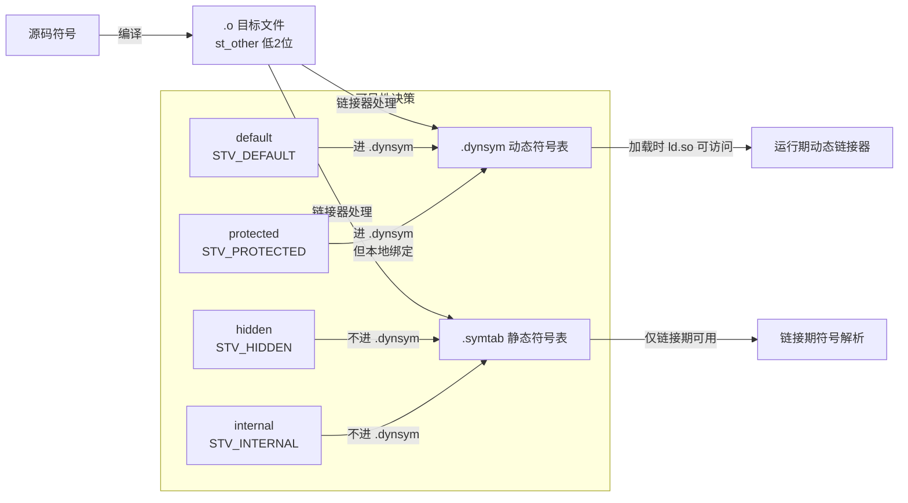
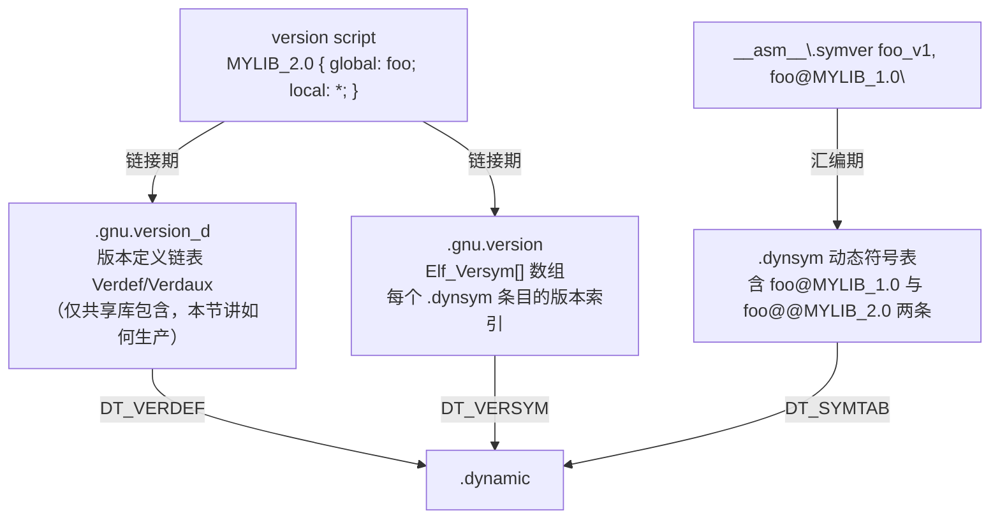

# 链接器详解（9）· 符号可见性与版本

> [!abstract] TL;DR
> - **可见性**决定一个符号是否进入动态符号表：`default` 对外可见（可被其他 DSO 绑定）、`hidden` 不进动态符号表（只在本 DSO 内有效）、`protected` 可被外部看到但本模块自己绑定到本地实现、`internal` 平台定义的最强限制。编译选项 `-fvisibility=hidden` 可把全部符号默认隐藏，再用 `__attribute__((visibility("default")))` 精确"开洞"导出。
> - **符号版本**（version script）在链接期把符号打上版本标签，生成 `.gnu.version_d`，使同一 `.so` 可以同时提供 `foo@@MYLIB_2.0`（默认新版本）和 `foo@MYLIB_1.0`（兼容旧版本），运行时动态链接器按每个使用方的 `.gnu.version_r` 精确路由。
> - **两件事互补**：可见性控制"谁能看到这个符号"，版本控制"看到的是哪个版本"；最小化导出 + 精确版本化是稳定 ABI、加快启动、激进优化的三合一利器。
> - **Windows 对等物**：`__declspec(dllexport/dllimport)` 或 `.def` 模块定义文件控制导出，无 ELF 式符号版本。
> - **本篇视角**：这里讲"链接期如何生产版本化符号"；运行期动态链接器如何消费这些版本信息，详见 [[14.动态链接与加载器详解/13.符号版本与二进制兼容.md]]。

本篇承接 [[08.动态库链接]]（`-shared`/`-fPIC`/`SONAME`），聚焦**导出控制**这一关键维度：先讲 ELF 符号可见性的四种级别与工具手段，再讲 version script 如何在链接期生产版本化符号，最后以 Windows 的 `dllexport`/`.def` 作三平台对照。下一篇 [[10.LTO链接时优化]] 会看到可见性对跨模块内联的影响。

---

## 概述与定位

### 为什么要最小化导出

动态库的每个导出符号都是一笔"负债"：

1. **启动开销**：动态链接器加载时要对动态符号表（`.dynsym`）里的每个符号做哈希查找与重定位（`GLOB_DAT` / `JUMP_SLOT`）。导出符号越多，`dl_open` / 进程启动就越慢。参见 [[11.ELF文件详解/17.got节.md]] 关于 GOT 重定位的讨论。
2. **ABI 稳定性**：一旦符号对外可见，就对外承诺了它的名字、类型、调用约定——改动即 ABI 破坏。隐藏内部符号让库可以自由重构内部实现，无需担心外部依赖。
3. **优化空间**：隐藏符号意味着链接器知道"这个函数只在本 DSO 内调用"，可以做更激进的内联、地址直接绑定（direct binding）、甚至消除 GOT 间接层（GOT relaxation，见 [[11.ELF文件详解/17.got节.md]] 关于 GOT 松弛的讨论）；而 `default` 符号因为可能被 `LD_PRELOAD` 插入覆盖，链接器必须保守地走 GOT。
4. **符号污染**：大型 C++ 库若不隐藏内部符号，大量 mangled 内部名字会暴露在动态符号表里，与其他库发生意外符号冲突（ODR 违例）。

### 本篇在系列中的位置

| 维度 | 本篇聚焦 | 相邻篇章 |
|---|---|---|
| 导出控制 | visibility 属性、`-fvisibility`、version script | 动态库整体链接见 [[08.动态库链接]] |
| 版本生产 | 链接期生成 `.gnu.version_d`、`.gnu.version` | 运行期版本消费见 [[14.动态链接与加载器详解/13.符号版本与二进制兼容.md]] |
| 版本节结构 | `.gnu.version_d` Verdef/Verdaux | 字段级细节见 [[11.ELF文件详解/40.gnu.version_d节.md]] |
| 优化关联 | hidden 符号可被内联/direct-bind | 跨模块优化见 [[10.LTO链接时优化]] |

---

## 原理与机制

### ELF 符号可见性：四个级别

ELF ABI（STV，Symbol Visibility）定义了 `Elf64_Sym.st_other` 低 2 位存储可见性：

| 级别 | `STV_*` 宏值 | 含义 | 进动态符号表？ | 可被外部 DSO 覆盖？ |
|---|---|---|---|---|
| `default` | `STV_DEFAULT = 0` | 全局可见；符号进 `.dynsym`，可被外部绑定/覆盖（包括 `LD_PRELOAD`） | 是 | 是 |
| `protected` | `STV_PROTECTED = 3` | 对外可见（进 `.dynsym`），但本 DSO 内的引用不走 GOT，直接绑定到本地实现 | 是 | 否（本地绑定） |
| `hidden` | `STV_HIDDEN = 2` | **不进动态符号表**；对外完全不可见，不出现在 `.dynsym`，不可被外部链接 | 否 | — |
| `internal` | `STV_INTERNAL = 1` | 平台 ABI 定义的最强限制，通常比 `hidden` 更受限（如不可通过函数指针跨 DSO 调用） | 否 | — |



> 图解：可见性的核心分水岭是"是否进入 `.dynsym`"——进了就是动态链接器运行时可见的公开契约；没进就是链接器私密，运行期完全不存在。

### `__attribute__((visibility(...)))` 逐级详解

C/C++ GCC/Clang 通过 `__attribute__` 在声明或定义处标注可见性：

```c
/* ---- default：公开导出，外部可绑定 ---- */
__attribute__((visibility("default")))
int public_api(int x);   // 进 .dynsym，可被 LD_PRELOAD 覆盖

/* ---- hidden：内部辅助函数，不导出 ---- */
__attribute__((visibility("hidden")))
static int internal_helper(int x);   // 不进 .dynsym；链接器可内联/直接引用

/* ---- protected：导出但不允许外部覆盖本地引用 ---- */
__attribute__((visibility("protected")))
int callback_hook(void);  // 进 .dynsym（外部可调用），但本 DSO 的调用直接到本实现

/* ---- 全局隐藏 + 精确开洞的常见模式 ---- */
/* 编译时加 -fvisibility=hidden，所有符号默认 hidden */
/* 仅在头文件用宏标注需要导出的符号 */
#define EXPORT __attribute__((visibility("default")))

EXPORT int my_lib_init(void);
EXPORT int my_lib_process(const char *buf, size_t len);
/* 其余数百个内部函数自动为 hidden */
```

**`hidden` 对 GOT 优化的影响**

当编译器生成对 `hidden` 符号的调用时，它知道被调者不可能被外部 DSO 覆盖，因此可以：

- 在共享库内部用 PC-relative call 直接调用（`callq foo(%rip)` 而非 `callq foo@plt`），跳过 PLT/GOT；
- 对全局变量用 `leaq var(%rip)` 直接访问，而非 `movq var@GOTPCREL(%rip)` 再解引用。

这正是 GOT 松弛（GOT relaxation）背后的条件之一——链接器在 `-fvisibility=hidden` 下能把大量 `GOTPCRELX` 重定位优化掉。

### `-fvisibility=hidden` 的工程实践

```bash
# 编译共享库时全局隐藏，只有手动标 EXPORT 的符号才对外可见
gcc -shared -fPIC -fvisibility=hidden -o libfoo.so foo.c
```

典型头文件导出宏模式（跨平台）：

```c
/* export.h — 跨平台导出宏 */
#if defined(_WIN32) || defined(__CYGWIN__)
#  ifdef BUILDING_DLL
#    define FOO_API __declspec(dllexport)
#  else
#    define FOO_API __declspec(dllimport)
#  endif
#elif defined(__GNUC__) || defined(__clang__)
#  define FOO_API __attribute__((visibility("default")))
#else
#  define FOO_API
#endif
```

用法：

```c
#include "export.h"

FOO_API int foo_init(void);     /* 对外公开 */
FOO_API int foo_process(int x); /* 对外公开 */

static int internal_foo(int x); /* C static，链接器局部，无需额外标注 */
```

加了 `-fvisibility=hidden` 后，`nm -D libfoo.so` 输出中只有 `foo_init` 与 `foo_process`，所有 `internal_*` 不再出现。

### visible vs. hidden 的动态符号表对比

```text
# 未加 -fvisibility=hidden 的典型 .dynsym 片段（示意）
$ nm -D libfoo.so
0000000000001234 T foo_init          # 导出（T = .text 全局）
0000000000001280 T foo_process
0000000000001300 T internal_parse    # 本不该导出！
0000000000001380 T internal_validate
0000000000001400 T helper_alloc

# 加了 -fvisibility=hidden 后（示意）
$ nm -D libfoo.so
0000000000001234 T foo_init
0000000000001280 T foo_process
# internal_parse / internal_validate / helper_alloc 消失
```

> [!warning] 示例输出为示意
> 上述输出为代表性示意，非本机实跑；具体地址与符号随代码而变。读者应在自己的 Linux 环境中用实际库验证。

### `protected` 的微妙语义

`protected` 是最容易被误用的级别，值得单独说清楚：

```c
/* lib.c — 共享库 */
__attribute__((visibility("protected")))
int counter = 0;

void increment(void) {
    counter++;   /* 这里的 counter 引用直接到本地实现，不走 GOT */
}
```

```c
/* main.c — 使用方 */
extern int counter;   /* 可以看到（protected 进了 .dynsym）*/
/* 但是：使用方不能"覆盖"库内对 counter 的绑定 */
```

`protected` 的使用场景：**需要被外部读取（甚至弱覆盖），但本模块内部不受外部定义影响**。实践中它非常少见，因为其语义在不同链接器版本（BFD ld/LLD）之间有微妙差异，容易引发移植问题。**推荐只用 `default` 和 `hidden`**。

### STV_PROTECTED 在 GNU ld 与 LLD 的行为差异

`protected` 可见性看似简洁——"外部可见但本地绑定"——然而这一语义在 GNU ld（BFD）和 LLD 之间长期存在不兼容，是工程上最容易踩的链接器分歧之一。

#### 语义规范

ELF gABI 对 `STV_PROTECTED` 的规定是：

> 符号进入 `.dynsym`（外部可引用），但本模块内对该符号的**所有引用**直接绑定到本地定义，**不走 GOT**，不受外部定义插入（interposition）影响。

这意味着：
- 可执行文件可以看到共享库导出的 `protected` 数据符号的地址；
- 但共享库内部对该符号的访问**一定**命中本地副本，不可能被外部 `LD_PRELOAD` 或可执行文件的同名符号覆盖。

#### GNU ld（BFD）的历史问题：COPY 重定位

可执行文件引用共享库的**数据**符号时，传统做法是生成 `R_X86_64_COPY`（COPY 重定位）：在可执行文件的 `.bss` 中分配一块区域，加载时 ld.so 把共享库的数据**拷贝**过来，再把共享库内部的 GOT 入口也指向这块区域，从而两侧共享同一份数据。

问题来了：若该数据符号是 `protected`，gABI 语义要求共享库**不**走 GOT，直接绑定到自己的本地地址——这与 COPY 重定位的机制根本矛盾：

```
共享库 libfoo.so：
  protected int counter;          // 本地绑定，libfoo 内访问地址 = 0x7f...1234
  void increment() { counter++; } // 直接操作 0x7f...1234

可执行文件 app：
  R_X86_64_COPY → counter 在 .bss @ 0x601020  // 拷贝到这里
  counter 的地址在 app 眼中 = 0x601020

// 结果：app 的 &counter == 0x601020，libfoo 内 &counter == 0x7f...1234
// 两个地址不同！互相写入对方看不到，地址一致性被破坏
```

**GNU ld 历史上（直到相当新的版本）对 `protected` 数据符号仍然生成 COPY 重定位**，导致上述地址不一致的静默 bug。这是 binutils 已知的历史缺陷（binutils Bug #17574 等），在某些版本中修复、在某些版本中回退，行为随版本而变。

对于**函数**符号，GNU ld 不生成 COPY 重定位（函数用 PLT），但也存在另一个争议点：某些 GNU ld 版本对 `protected` 函数符号仍然生成 PLT 条目（允许外部通过 PLT 调用），而 PLT 的存在本身就意味着函数地址在外部和内部可能不一致（外部看到的是 PLT 地址，内部是函数本体地址），这同样违反了 `protected` 的语义。

#### LLD 的处理：直接报错，拒绝 COPY 重定位

LLD 对这一问题的态度更为严格：**当可执行文件试图对 `protected` 数据符号生成 COPY 重定位时，LLD 直接报错并终止链接**：

```
error: cannot preempt symbol: counter [--warn-symbol-ordering]
// 或更直接：
ld.lld: error: symbol 'counter' cannot be copied to .bss because
        it is protected and defined in a shared library
```

LLD 的理由是：gABI 明确禁止对 `protected` 符号做 interposition，COPY 重定位实质上是一种 interposition，因此不应被允许。这与 gABI 规范一致，但与 GNU ld 的历史行为不兼容。

#### 争议与现状

这一分歧在 glibc/binutils/LLVM 开发者之间有过多轮争论（参见 LLVM Bug #19198、GNU ld PR/17574、ELF gABI 讨论列表）：

| 立场 | 观点 |
|---|---|
| LLD / gABI 严格派 | COPY 重定位对 protected 符号从根本上违反语义，应报错 |
| GNU ld 历史兼容派 | 现存大量代码依赖此行为，不能贸然改变 |
| 实用主义 | `protected` 数据符号本来就是反模式，应在 ABI 设计层面避免 |

**现状（截至 2024 年）**：
- LLD 坚持报错策略不变；
- GNU ld 近年版本（binutils 2.36+）对 `protected` 数据符号的 COPY 重定位发出警告，部分情况改为报错；
- glibc 本身已尽量避免在公共头文件中使用 `protected` 数据符号；
- Clang 文档和 GCC 文档均建议：**不要对跨 DSO 访问的数据符号使用 `protected`**。

#### 对共享库设计的影响

在实际工程中，`protected` 的安全使用范围极为有限：

```c
// 相对安全：protected 函数，外部可调用，本模块内直接绑定
__attribute__((visibility("protected")))
void hook_callback(void) { /* ... */ }
// ✓ 外部可通过动态符号表找到它；✓ 本模块内调用不走 PLT

// 危险：protected 数据符号，跨 DSO 取地址
__attribute__((visibility("protected")))
int shared_counter = 0;
// ✗ 可执行文件取 &shared_counter 时，GNU ld 可能生成 COPY 重定位 → 地址不一致
// ✗ LLD 直接报错
```

**实践建议**：
1. 避免对数据符号使用 `protected`；若需要跨 DSO 共享数据，改用 getter/setter 函数（函数符号的 `protected` 行为更安全）；
2. 若确实需要"外部可见但本地绑定"的数据语义，考虑改用 `default` 可见性配合明确的 API 文档约定，并在测试中验证地址一致性；
3. 跨 GNU ld / LLD 双链接器构建时，要特别审查所有 `protected` 数据符号——LLD 报错会暴露 GNU ld 静默放行的潜在 bug。

---

## 三平台对照

### 总览

| 维度 | Linux（ELF / GNU ld / LLD） | macOS（Mach-O / ld64） | Windows（PE / MSVC link） |
|---|---|---|---|
| 可见性属性语法 | `__attribute__((visibility(...)))` | `__attribute__((visibility(...)))` + `-fvisibility=hidden` | `__declspec(dllexport/dllimport)` |
| 全局默认隐藏 | `-fvisibility=hidden` | `-fvisibility=hidden` | 默认**不导出**（需显式 `dllexport`）|
| 导出列表文件 | version script（`-Wl,--version-script=f.map`） | export list（`-Wl,-exported_symbols_list,f.txt`）或 `-exported_symbol` | 模块定义文件（`.def`）或 `/DEF:` |
| 符号版本控制 | version script 生成 `.gnu.version_d`/`.gnu.version`；精确到符号粒度 | **无符号版本**；靠 `compatibility_version`（库粒度） | **无符号版本**；靠 WinSxS / DLL 命名 |
| 动态符号表过滤 | `.dynsym` 只含 `default`/`protected` 符号 | `__TEXT,__export_text` + `LC_DYLD_EXPORTS_TRIE` | IAT/EAT（导入/导出地址表） |
| 工具观察 | `nm -D` / `readelf --dyn-syms` / `objdump -T` | `nm -D` / `otool -l` | `dumpbin /EXPORTS` / `dumpbin /IMPORTS` |

### Linux：version script + `-fvisibility=hidden` 的组合

GNU ld / LLD 的 version script（`--version-script`）实际上同时完成两件事：

1. **过滤导出**：`local: *;` 把所有未列于 `global:` 的符号强制设为 `STV_HIDDEN`（即使源码没有 `__attribute__`）；
2. **打版本标签**：`global:` 列表里的符号被分配到对应的版本节点（Verdef），写入 `.gnu.version_d`。

```ld
/* foo.map — 同时控制导出和版本 */
MYLIB_2.0 {
    global:
        foo_init;
        foo_process;
    local:
        *;     /* 所有其他符号 hidden */
};
```

```bash
gcc -shared -fPIC -fvisibility=hidden \
    -Wl,--version-script=foo.map \
    -o libfoo.so.2 foo.c
```

**两者叠加的优先级**：version script 的 `local: *;` 比 `-fvisibility=hidden` 更晚（链接期）介入，覆盖编译期的可见性属性。即使源码某个函数写了 `visibility("default")`，若未在 `global:` 中列出，链接器仍会将其强制为 `local`（hidden）。

### macOS：`-exported_symbols_list` 与 `visibility` 属性

macOS ld64 支持与 GCC 相同的 `__attribute__((visibility(...)))` 语法，且同样响应 `-fvisibility=hidden`。但导出列表文件格式与 Linux 不同：

```text
# exported.txt — macOS 导出符号列表（每行一个，带下划线前缀）
_foo_init
_foo_process
```

```bash
clang -shared -fvisibility=hidden \
    -Wl,-exported_symbols_list,exported.txt \
    -o libfoo.dylib foo.c
```

macOS **没有 ELF 式符号版本**——没有 `.gnu.version_d`，没有 `.gnu.version_r`。版本控制靠的是 `LC_ID_DYLIB` 里的 `compatibility_version`（库整体粒度），无法在同一 `.dylib` 文件内同时提供两个版本的 `foo` 实现。Apple 的策略是"永不删除已发布 API"（deprecate 而不删除）。

### Windows：`dllexport`/`dllimport` 与 `.def` 文件

Windows PE 的默认行为与 ELF **完全相反**：

- ELF 默认所有全局符号可见，需要手动隐藏；
- PE 默认**不导出任何符号**，需要手动标注导出。

**方式一：`__declspec(dllexport)`**

```c
/* 导出声明（在 DLL 编译时） */
__declspec(dllexport) int foo_init(void);
__declspec(dllexport) int foo_process(int x);

/* 导入声明（在使用方编译时） */
__declspec(dllimport) int foo_init(void);
__declspec(dllimport) int foo_process(int x);
```

实践中通常用宏统一：

```c
#ifdef BUILDING_MYLIB
#  define MYLIB_API __declspec(dllexport)
#else
#  define MYLIB_API __declspec(dllimport)
#endif

MYLIB_API int foo_init(void);
```

`dllexport` 会把符号写入 DLL 的**导出表**（Export Directory Table），生成导入库（`.lib`）供链接器静态绑定。

**方式二：模块定义文件（`.def`）**

```text
; foo.def — 模块定义文件
LIBRARY   "libfoo"
EXPORTS
    foo_init       @1
    foo_process    @2 NONAME  ; @N 是导出序号，NONAME 表示只按序号导出（不导出名字）
```

```bat
link /DLL /DEF:foo.def /OUT:libfoo.dll foo.obj
```

`.def` 文件的优势：可以给符号指定序号（ordinal）导出，支持导出别名（`ExportedName = InternalName`），适用于需要精细控制导出表的场景。

**Windows 无符号版本机制**：PE 没有 ELF 的 `.gnu.version_d`/`.gnu.version_r` 等效物。若要兼容旧接口，只能保留旧 DLL 文件（`msvcp140.dll` vs `msvcp140_1.dll`）、在 DLL 内部做函数版本分支，或通过 WinSxS 并行程序集机制（见 [[14.动态链接与加载器详解/13.符号版本与二进制兼容.md]] 中 Windows 一节）。

---

## 数据结构 / 流程详解

### Version Script 语法全貌

GNU ld / LLD 的 version script 语法（BFD ld 扩展，LLD 兼容）：

```ld
/* 完整语法示例 */

/* 版本节点：版本名 { 导出列表 } [依赖版本]; */
MYLIB_2.1 {
    global:
        foo_new_api;          /* 精确符号名 */
        bar_*;                /* shell glob 模式 */
        "C++"名字;            /* C++ mangled 名要加引号 */
    local:
        *;                    /* 兜底：其余全部 local */
};

MYLIB_2.0 {
    global:
        foo_init;
        foo_process;
    local:
        *;
};

MYLIB_1.0 {
    global:
        foo_init;             /* 保留 v1 兼容入口 */
};
/* MYLIB_1.0 不加 local: * ——继承自 MYLIB_2.0 的规则 */
```

**关键规则**：

- 版本节点的**顺序即继承顺序**：较早（文件靠前）的版本是较新版本，链接器把较新版本设为默认（`@@`），较旧版本设为兼容（`@`，HIDDEN bit）；
- 只能有**一个默认版本**（`@@`），对应文件中排在最前面的版本节点；
- `local: *;` 是兜底规则，**强烈建议每个版本节点都加**，否则内部符号会意外泄漏（见陷阱节）；
- glob 模式（`bar_*`）匹配时按 shell glob 语义；C++ 的 mangled 名里有 `:`、`<`、`>` 等字符，需要加引号或写精确全名。

### Version Script 到 ELF 节的映射

链接器读取 version script 后，在输出文件里生成三组节：



> 图解：version script 是链接期输入，链接器据此填写 `.gnu.version_d`（版本定义节，详见 [[11.ELF文件详解/40.gnu.version_d节.md]]）和 `.gnu.version`（每符号的版本索引数组）；`.dynsym` 里双版本符号条目则靠源码的 `.symver` 汇编指令生成。

### `.symver` 汇编指令：将实现绑定到版本

库开发者需要在同一 `.so` 里提供两套实现时，用 `.symver` 指令关联：

```c
/* mylib.c — 同文件双实现 */

/* ---- 旧版本：兼容性实现 ---- */
__asm__(".symver realpath_v1, realpath@MYLIB_1.0");
char *realpath_v1(const char *path, char *resolved) {
    /* v1 语义：resolved 为 NULL 时返回 NULL，不动态分配 */
    if (!resolved) return NULL;
    /* ... 旧逻辑 ... */
    return resolved;
}

/* ---- 新版本：默认实现 ---- */
__asm__(".symver realpath_v2, realpath@@MYLIB_2.0");
char *realpath_v2(const char *path, char *resolved) {
    /* v2 语义：resolved 为 NULL 时动态分配，调用方负责 free */
    if (!resolved) resolved = malloc(PATH_MAX + 1);
    /* ... 新逻辑 ... */
    return resolved;
}
```

配套 version script（`mylib.map`）：

```ld
MYLIB_2.0 {
    global:
        realpath;
    local:
        *;
};

MYLIB_1.0 {
    global:
        realpath;
};
```

编译后的 `.dynsym` 含两条 `realpath` 条目：

| 符号名（含版本） | `.gnu.version` Versym 值 | 含义 |
|---|---|---|
| `realpath@@MYLIB_2.0` | `0x0002`（HIDDEN bit = 0） | 默认版本，新程序自动绑定 |
| `realpath@MYLIB_1.0` | `0x8003`（HIDDEN bit = 1） | 兼容旧版本，仅旧程序按 `.gnu.version_r` 路由到此 |

**与 14 系列 13 的分工**：本篇聚焦"链接器如何从 version script + `.symver` 生产 `.gnu.version_d` 和 `.dynsym` 双版本条目"；[[14.动态链接与加载器详解/13.符号版本与二进制兼容.md]] 聚焦"运行时 `_dl_fixup` 如何通过 `.gnu.version_r`/`.gnu.version_d` 精确路由到正确实现"。两篇互补，各讲一半链条。

### 可见性与链接的区别

这是最常见的误区，必须明确：

| 概念 | 作用层面 | 控制的是 | 对应字段 |
|---|---|---|---|
| **可见性（visibility）** | 编译期 + 链接期 | 符号是否进 `.dynsym`（动态符号表） | `st_other` 低 2 位（`STV_*`） |
| **绑定（binding）** | 编译期 | 符号是局部（`STB_LOCAL`）还是全局（`STB_GLOBAL`）还是弱（`STB_WEAK`） | `st_info` 高 4 位（`STB_*`） |
| **版本（version）** | 链接期 | 符号属于哪个版本节点，运行期如何精确路由 | `.gnu.version[i]`（`Elf_Versym`）|

关键区分：

- `hidden` 可见性 ≠ `static` 链接（`STB_LOCAL`）。`hidden` 符号在本 DSO 内仍是全局可用的（可跨编译单元链接），只是不进动态符号表；`static`/`STB_LOCAL` 只在同一编译单元内可见。
- version script 的 `local: *;` 在**链接期**把符号的动态可见性降为 `STV_HIDDEN`，但不改变 `.symtab` 里的 `STB_LOCAL`/`STB_GLOBAL` 绑定——对静态链接分析工具（如 `nm` 不加 `-D`）这些符号仍然可见。

```text
# 对比：nm（看 .symtab，含 hidden）vs nm -D（只看 .dynsym）
$ nm libfoo.so | grep helper    # 在 .symtab 可见
0000000000001400 t helper_alloc   # 't' = local text，但实际是 hidden global

$ nm -D libfoo.so | grep helper  # 不在 .dynsym
（无输出）
```

> [!warning] 示例输出为示意
> 上述 `nm` 输出为代表性示意，非本机实跑。

---

## 代码与命令

### 最小化导出的完整工作流（Linux）

```bash
# 步骤 1：编写 version script
cat > libfoo.map << 'EOF'
LIBFOO_1 {
    global:
        foo_init;
        foo_destroy;
        foo_process;
    local:
        *;
};
EOF

# 步骤 2：编译（全局隐藏 + 版本脚本）
gcc -shared -fPIC \
    -fvisibility=hidden \
    -Wl,--version-script=libfoo.map \
    -o libfoo.so.1 foo.c

# 步骤 3：验证导出符号
nm -D libfoo.so.1           # 只应看到 foo_init / foo_destroy / foo_process
readelf --dyn-syms libfoo.so.1  # 同上，附 Versym 信息
readelf -V libfoo.so.1      # 查看 .gnu.version_d 和 .gnu.version
```

> [!warning] 示例输出为示意
> 以下输出为代表性示意，非本机实跑。

```text
# nm -D libfoo.so.1 期望输出（示意）
0000000000001234 T foo_destroy
00000000000011f0 T foo_init
0000000000001280 T foo_process

# readelf -V libfoo.so.1 期望输出片段（示意）
Version definition section '.gnu.version_d' contains 2 entries:
  000000: Rev: 1  Flags: BASE  Index: 1  Cnt: 1  Name: libfoo.so.1
  0x001c: Rev: 1  Flags: none  Index: 2  Cnt: 1  Name: LIBFOO_1
Version symbols section '.gnu.version' contains 6 entries:
 0: 0 (*local*)
 1: 0 (*local*)
 2: 2 (LIBFOO_1)    ← foo_init
 3: 2 (LIBFOO_1)    ← foo_destroy
 4: 2 (LIBFOO_1)    ← foo_process
 5: 0 (*local*)     ← 内部符号（hidden）
```

### 双版本符号的生产流程

```c
/* realpath_impl.c — 双实现 */
#include <stdlib.h>
#include <limits.h>

__asm__(".symver realpath_compat, realpath@MYLIB_1.0");
char *realpath_compat(const char *path, char *resolved) {
    if (!resolved) return NULL;
    return realpath(path, resolved);   /* 简化示意 */
}

__asm__(".symver realpath_current, realpath@@MYLIB_2.0");
char *realpath_current(const char *path, char *resolved) {
    if (!resolved) resolved = malloc(PATH_MAX + 1);
    return realpath(path, resolved);
}
```

```bash
gcc -shared -fPIC -fvisibility=hidden \
    -Wl,--version-script=mylib.map \
    -o libmylib.so.2 realpath_impl.c

# 验证双版本导出
objdump -T libmylib.so.2 | grep realpath
```

> [!warning] 示例输出为示意

```text
# objdump -T libmylib.so.2 | grep realpath （示意）
0000000000001139 g    DF .text  0000000000000028  MYLIB_1.0   realpath
0000000000001160 g    DF .text  0000000000000035  MYLIB_2.0   realpath
```

第一行 `g`（全局但 HIDDEN bit 置位）表示旧版本；第二行是默认版本（新程序链接时自动绑定）。两者符号名相同但 `st_value` 不同（指向各自实现的地址）。

### Windows `.def` 文件导出控制

```text
; libfoo.def
LIBRARY "libfoo"
EXPORTS
    foo_init           @1          ; 序号 1 导出
    foo_destroy        @2
    foo_process        @3
    ; 内部函数不列，默认不导出
```

```bat
rem MSVC link.exe 用法
link /DLL /DEF:libfoo.def /OUT:libfoo.dll foo.obj

rem MinGW / 交叉编译
gcc -shared -Wl,--output-def=libfoo.def -o libfoo.dll foo.c
dllwrap --def libfoo.def -o libfoo.dll foo.c
```

验证 Windows 导出表：

```bat
dumpbin /EXPORTS libfoo.dll
```

> [!warning] 示例输出为示意

```text
  Section contains the following exports for libfoo.dll

    00000000 characteristics
    00000000 time date stamp
        0.00 version
           1 ordinal base
           3 number of functions
           3 number of names

    ordinal hint RVA      name
          1    0 00001234 foo_init
          2    1 000011f0 foo_destroy
          3    2 00001280 foo_process
```

### `readelf --dyn-syms` 验证可见性

```bash
# Linux：查看动态符号表，确认 hidden 符号不在其中
readelf --dyn-syms libfoo.so.1
# 等效于：
readelf -W --symbols libfoo.so.1 | grep "GLOBAL\|WEAK" | grep -v UND
```

> [!warning] 示例输出为示意
> 上述命令输出随实际库内容而变，以本机实际运行结果为准；此处仅示意"只有公开 API 可见"这一现象。

---

## 陷阱与常见错误

### 版本脚本忘加 `local: *;`

这是最高频的错误：version script 里的版本节点不加 `local: *;` 兜底，所有未列出的符号会以无版本全局符号形式导出，既泄漏内部接口、又违反"每个符号只有一个默认版本"的约定。

```ld
/* 错误：缺少 local: * */
MYLIB_2.0 {
    global:
        foo;
};
/* 结果：所有 internal_*, helper_* 都变成 GLOBAL 无版本导出！ */

/* 正确 */
MYLIB_2.0 {
    global:
        foo;
    local:
        *;    /* 必须加 */
};
```

### C++ 符号名的 glob 陷阱

```ld
/* 危险：C++ mangled 名包含 *，glob 可能意外匹配多余符号 */
MYLIB_1 {
    global:
        _ZN3Foo*;   /* 本意：导出 Foo 类所有方法；实际会匹配所有以 _ZN3Foo 开头的 mangled 名 */
    local:
        *;
};
```

更安全的做法是精确列出每个要导出的 mangled 符号，或用 `extern "C"` 包装 C++ API 后导出 C 名。

### `protected` 在不同链接器间的差异

`protected` 可见性在 GNU ld 和 LLD 之间存在细微行为差异（主要涉及数据符号的 copy relocation 处理），在 cross-DSO 数据符号上尤为突出。如非必要，**不要使用 `protected`**；用 `hidden` + 提供 getter 函数代替。

### `-fvisibility=hidden` 破坏 C++ 异常跨 DSO 传播

在某些平台上（尤其是 Linux/ELF），C++ 异常类型的 `typeinfo` 符号若被 `hidden`，跨 DSO 边界的 `catch` 可能无法匹配相同类型，导致异常未被捕获而 `terminate()`。

修复方式：为所有需要跨 DSO 传播的异常类显式加 `__attribute__((visibility("default")))`：

```cpp
class EXPORT MyException : public std::exception { /* ... */ };
// EXPORT 展开为 __attribute__((visibility("default")))
```

### Windows `dllimport` 遗漏导致性能退化

在 Windows 上调用 DLL 中的函数时，若调用方忘记加 `__declspec(dllimport)`，MSVC 会生成一个多余的 thunk（等价于 Linux 有 PLT 但没有 IAT 直接调用），每次函数调用多一次间接。**在使用方头文件中务必区分编译期 `dllexport`/`dllimport`**。

---

## 小结

1. **四级可见性，分水岭是 `.dynsym`**：`hidden`/`internal` 不进动态符号表，链接器可激进优化（直接绑定、GOT 消除）；`default`/`protected` 进 `.dynsym`，对外可见，但 `protected` 还阻止外部覆盖本地引用。实践中只用 `default` 和 `hidden` 就够。
2. **最小化导出是三重收益**：启动更快（减少重定位条目）、ABI 更稳（内部符号不对外承诺）、优化更激进（hidden 符号可内联、消 GOT）。
3. **`-fvisibility=hidden` + 显式 `EXPORT` 宏** 是现代 C/C++ 共享库的标准做法；version script 的 `local: *;` 是链接期的兜底保险，两者叠加。
4. **Version script 双重职责**：过滤导出（隐藏未列符号）+ 打版本标签（生成 `.gnu.version_d`）；`.symver` 汇编指令把同名双实现关联到不同版本节点，实现同文件多版本共存。
5. **本篇是"生产侧"**：链接器把 version script + `.symver` 转化成 `.gnu.version_d` / `.gnu.version`——这是版本信息的产生阶段；[[14.动态链接与加载器详解/13.符号版本与二进制兼容.md]] 讲的是加载器在运行期"消费"这些节完成精确符号路由，两篇合起来覆盖版本控制的完整链条。
6. **三平台差异总结**：Linux 精确到符号粒度（ELF 版本节 + visibility 属性）；macOS 同支持 visibility 但无符号版本，版本控制靠库粒度；Windows 默认不导出，须显式 `dllexport`/`.def`，无符号版本机制。

---

## 相关阅读

- **上一篇：动态库整体链接（`-shared`/`-fPIC`/`SONAME`）**：[[08.动态库链接]]
- **下一篇：LTO 与 visibility 对跨模块优化的关系**：[[10.LTO链接时优化]]
- **运行期版本消费（本篇生产侧的互补篇）**：[[14.动态链接与加载器详解/13.符号版本与二进制兼容.md]]
- **`.gnu.version_d` 节字段级数据结构**：[[11.ELF文件详解/40.gnu.version_d节.md]]
- **GOT 重定位与 hidden 符号的 GOT 松弛**：[[11.ELF文件详解/17.got节.md]]
- **符号解析作用域（visibility 影响符号查找顺序）**：[[14.动态链接与加载器详解/06.符号解析与符号查找.md]]
- **工具链配置**：[[41.Compiler/00.编译器完整参考 - 总索引.md]]、[[42.Cmake/00 - CMake 完整技术教程 - 总索引.md]]
- **系列总览**：[[00.链接器详解总览]]

---

⬅️ 上一篇 [[08.动态库链接]] ｜ 🏠 [[00.链接器详解总览]] ｜ 下一篇 [[10.LTO链接时优化]] ➡️
