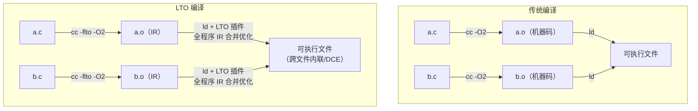
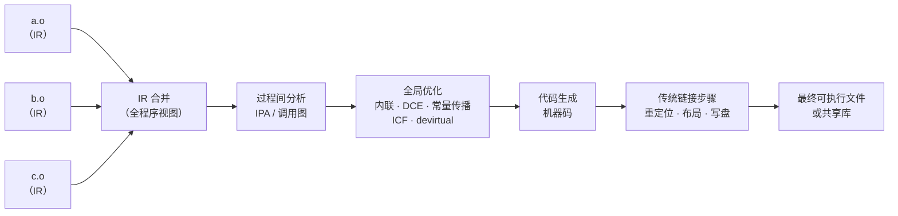
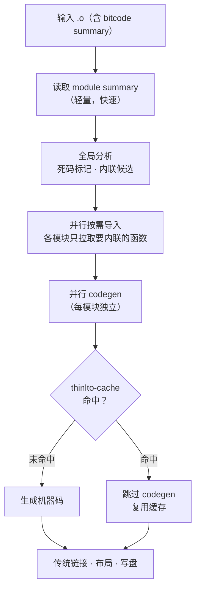

# 链接器详解（10）· LTO链接时优化

> [!abstract] TL;DR
> - **问题**：传统编译模型每个翻译单元（`.c`/`.cpp`）独立编译成机器码，编译器看不到其他文件的实现——跨文件内联、跨文件死码消除、跨文件常量传播统统无法进行。
> - **方案**：让编译器在编译阶段只产出**中间表示（IR）**而非机器码，把真正的代码生成推迟到**链接期**，届时链接器（借助编译器后端插件）拿到全程序 IR，可以做跨翻译单元的全局优化——这就是 **Link-Time Optimization（LTO）**。
> - **两种模式**：**Full LTO** 把所有 IR 合并成一张大图统一优化，跨模块内联最激进，但链接期内存与时间消耗最高；**Thin LTO**（Clang 的 `-flto=thin`）为每个模块维护独立 summary，优化并行展开，可增量，内存友好，是现代项目的首选。
> - **三平台**：GCC `-flto`（GIMPLE IR）+ gold/GNU ld `liblto_plugin`；Clang `-flto`/`-flto=thin`（LLVM bitcode）+ LLD（内建）；MSVC `/GL`（编译）+ `/LTCG`（链接），PE 上的全程序优化（WPO）。
> - **代价不可忽视**：链接期变慢（数倍到数十倍）、内存峰值高（full LTO 尤甚）、调试体验下降（内联栈被改写）、incremental build 友好度降低。
> - **与可见性的关系**：`hidden` 符号让 LTO 更激进——隐藏即承诺"这个符号不会被外部抢占/覆盖"，优化器可以放心内联、消除 GOT 间接层；`default` 符号受 interposition 约束，LTO 对它必须保守。呼应 [[09.符号可见性与版本]]。

本篇承接 [[09.符号可见性与版本]]（最小化导出 → 给 LTO 留优化空间），聚焦**链接期优化的原理、两种模式的工程取舍与三平台实操**。下一篇 [[11.增量与并行链接]] 会从另一个角度讲如何减少链接期等待——两篇合看，是"链接期性能"的完整图谱。

---

## 概述与定位

### 传统分离编译的墙

C/C++ 的分离编译模型中，每个 `.c`/`.cpp` 文件由编译器独立处理，输出一个可重定位目标文件 `.o`（参见 [[02.目标文件详解]]）。链接器的工作传统上只是"把 `.o` 拼起来、填重定位"（[[06.链接期重定位]]），它看不到源码，只处理二进制符号与地址。

这道"翻译单元之墙"导致许多优化无从施展：

| 优化手段 | 传统编译 | 原因 |
|---|---|---|
| 跨文件函数内联 | 不可能 | 编译器编译 `a.c` 时，`b.c` 的函数体已经编成机器码，不可见 |
| 跨文件常量传播 | 不可能 | 另一个文件里的全局 `const` 可能被 `extern` 覆盖 |
| 跨文件死码消除 | 非常有限 | `--gc-sections` 只能消除整个 section，不能消除 section 内的死函数 |
| 跨文件虚函数去虚化 | 不可能 | devirtualization 需要看到完整继承树 |
| 跨文件逃逸分析 | 不可能 | 参数是否逃逸取决于调用方，编译时不可见 |

### LTO 的核心思想

LTO 破墙的思路极为直接：

> **别在编译期生成机器码；把 IR 存进 `.o`，等链接期拿到所有翻译单元的 IR 后，再统一做全局优化与代码生成。**

这样链接期优化器看到的是整个程序（或整个共享库）的 IR 大图，与"只编译一个文件"相比视野天壤之别。

### 本篇在系列中的位置

| 维度 | 本篇聚焦 | 相邻篇章 |
|---|---|---|
| 优化窗口 | 链接期跨翻译单元优化 | 编译期单文件优化见 [[41.Compiler/00.编译器完整参考 - 总索引.md]] |
| 可见性前提 | hidden 符号给 LTO 解锁优化 | [[09.符号可见性与版本]] |
| 链接速度 | LTO 让链接变慢 | 加速手段见 [[11.增量与并行链接]] |
| 死码消除 | LTO 粒度精细到函数/变量 | section 粒度消除见 [[05.节的合并与布局]] |
| 动态库 | LTO 作用于静态链接边界 | DSO 动态链接见 [[14.动态链接与加载器详解/01.从静态链接到动态链接.md]] |

---

## 原理与机制

### 编译期：产出 IR 而非机器码

启用 LTO 后，编译器在 `.o` 文件里存的是 IR（或同时存 IR 与机器码，后者称 fat object，见下文），而非平台原生的机器码节（`.text`）。

- **GCC**：IR 格式是 **GIMPLE**（通用 IPA 中间语言），存储在 `.o` 的 `.gnu.lto_*` 节族中。
- **Clang/LLVM**：IR 格式是 **LLVM bitcode**（`.bc`），存入 `.o` 的 `.llvmbc` 节；Thin LTO 还会额外生成 `.llvmcmd`（编译命令摘要）以及 summary section（`.llvm_bc_module_summary`）。
- **MSVC**：编译器产出的 `.obj` 内含专有格式的中间表示，称为 **MSVC 私有 WPO IR（C2 优化器中间格式）**，存于 `.obj` 的 `LTO` 节；外部不透明。



> [!warning] 示例为示意
> 上图节点与流程为概念示意，非真实工具输出。

### 链接期：合并 IR → 全局优化 → 代码生成

链接器本身并不懂 IR——它通过**插件机制**把 IR 转交给编译器后端，触发以下流程：

1. **IR 读取与合并**：插件（`liblto_plugin.so` / LLD 内建）扫描所有 `.o`，提取 IR。
2. **过程间分析（IPA）**：在合并后的 IR 上运行跨翻译单元的别名分析、调用图分析、逃逸分析等。
3. **全局优化**：跨文件内联、常量传播、死码消除（DCE）、函数合并（ICF，Identical Code Folding）等。
4. **代码生成（codegen）**：把优化后的 IR 编译为最终机器码，写入输出文件的 `.text`。
5. **传统链接步骤**：重定位、布局、写最终二进制（此时已是机器码，与传统链接相同）。



> [!warning] 示例为示意
> 上图为概念流程图。实际实现中 IPA 与优化 pass 的顺序因编译器版本而异。

### ICF（Identical Code Folding）算法

**ICF**（相同代码折叠）是链接器在 LTO 全局优化阶段（或独立于 LTO 单独执行）将**机器码完全相同的函数合并为同一份代码**的优化技术。它不要求源码层面的等价，只要最终机器码字节序列相同即可合并。

#### 基本流程：哈希 → 等价类 → 迭代收敛 → 地址折叠

ICF 的核心算法是**迭代等价类划分**，分为以下阶段：

**第一阶段：初始哈希**

对每个候选函数/节计算内容哈希：
- 函数体字节序列（忽略重定位目标，只看重定位类型和加数）；
- 函数属性（链接属性、节标志、对齐要求）；
- 对其他函数/数据的引用**类型**（但此时不考虑引用目标是否等价）。

哈希相同的函数进入同一初始等价类。

**第二阶段：迭代精化**

引用相同等价类内部的函数，初始哈希可能"虚假等价"——两个函数 A、B 字节相同，但 A 调用 C、B 调用 D，而 C≠D，则 A≠B。迭代精化的做法：

```
循环：
  对每个等价类里的函数，将其引用目标的等价类 ID 纳入哈希重新计算
  若某个等价类因此被分裂 → 进入下一轮迭代
直到某轮无任何等价类分裂（收敛）
```

这一过程通常 2～4 轮即收敛，即使存在相互递归调用的函数组也能正确处理（互相引用的函数对，若两对都完全等价，则两对同时稳定在同一等价类中）。

**第三阶段：地址折叠**

收敛后，每个等价类选出一个"代表"函数，其余函数的所有引用（重定位条目中的符号）统一重定向到代表函数的地址。多余函数体被标记为可消除，最终不进入输出文件。

```
等价类 {foo, bar, baz} → 保留 foo，bar/baz 的所有调用点改为调用 foo
binary size 减少约 (|bar| + |baz|) 字节
```

#### `--icf=all` vs `--icf=safe`

LLD 和 gold 提供两种 ICF 强度：

| 选项 | 折叠范围 | 副作用 |
|---|---|---|
| `--icf=safe` | 只折叠**地址未被取用**的函数（即没有函数指针指向它们） | 保证 `&foo != &bar` 对所有可观测函数成立 |
| `--icf=all` | 折叠所有机器码相同的函数，**无论地址是否被取用** | `&foo == &bar` 可能成立，即使源码是两个不同函数 |

```bash
# LLD 启用 ICF（safe 模式，推荐）
clang -fuse-ld=lld -Wl,--icf=safe -O2 foo.o bar.o -o app

# LLD 最激进折叠（可能破坏依赖函数地址唯一性的代码）
clang -fuse-ld=lld -Wl,--icf=all -O2 foo.o bar.o -o app

# MSVC 等价
link /OPT:ICF foo.obj bar.obj /OUT:app.exe
```

> [!warning] 示例输出为示意
> 以上命令为 Linux 典型用法，本机 Windows 未实跑。

#### 与 `--gc-sections` 的配合

`--gc-sections` 以**节**为单位消除死码（没有任何引用指向该节），ICF 以**函数内容等价**为依据合并冗余代码。两者互补：

- `--gc-sections` 先运行，消除完全无引用的节；
- ICF 随后运行，合并有引用但内容相同的节；
- 典型组合：`-Wl,--gc-sections -Wl,--icf=safe`

LTO 环境下，ICF 的视野可以跨越翻译单元边界，发现跨文件的相同函数——这是非 LTO 链接无法做到的（非 LTO 下 ICF 只能看到单个节的内容，跨文件重复需要函数被放入独立节，即 `-ffunction-sections`）。

#### 折叠导致函数地址相等的影响

`--icf=all` 折叠后，原本不同的函数拥有相同地址，对正确性和调试均有潜在影响：

**正确性风险**：

```cpp
// 如果代码依赖函数指针的唯一性做类型区分，ICF=all 会出错
bool is_handler_a(void (*f)()) { return f == handler_a; }
bool is_handler_b(void (*f)()) { return f == handler_b; }
// ICF=all 折叠 handler_a==handler_b 后，is_handler_a 和 is_handler_b 对同一指针都返回 true
```

**调试影响**：

- `addr2line` 对折叠后的地址只能报告代表函数的名字，其他同地址函数在调试符号中消失；
- 崩溃栈回溯可能显示错误的函数名；
- 若 profile 数据（PGO）绑定了特定函数地址，折叠后 profile 可能错误累加。

**`--icf=safe` 可以规避大多数正确性风险**，代价是放弃了对"地址被取用"函数的折叠机会，折叠率略低。

---

## Full LTO vs Thin LTO

这是 LTO 最重要的工程取舍，必须理解两者的设计目标差异。

### Full LTO：最激进，最慢

**Full LTO** 的做法是把所有翻译单元的 IR 汇聚成**单一巨型 IR 模块**，然后在这个大模块上跑所有优化 pass。

- **优点**：优化视野最完整，跨文件内联不受限制，IPO（过程间优化）效果最强。
- **缺点**：
  - 链接期内存峰值 = 全程序 IR 大小（大型项目可达数 GB）。
  - 无法并行（单一 IR 模块是串行的）。
  - 增量构建无效：任意文件改动，链接期全量重做。
  - 链接时间随程序规模线性乃至二次增长。

```bash
# GCC Full LTO
gcc -flto -O2 -c a.c -o a.o
gcc -flto -O2 -c b.c -o b.o
gcc -flto -O2 a.o b.o -o app       # 链接期触发全量 LTO

# Clang Full LTO
clang -flto -O2 -c a.c -o a.o
clang -flto -O2 -c b.c -o b.o
clang -flto -O2 a.o b.o -o app
```

> [!warning] 示例输出为示意
> 以上命令为 Linux 环境 GCC/Clang 典型用法，本机 Windows 环境未实跑。

### Thin LTO：并行、可增量、内存友好

**Thin LTO** 是 LLVM/Clang 在 2016 年引入的工程优化（GCC 尚无等价实现）。其核心思想：

> **不合并成一个大 IR；为每个模块保留一份轻量 summary（函数签名、callgraph 边、export 列表），仅在需要内联时按需导入被内联函数的 IR。**

```
Thin LTO 链接期流程：
  1. 读取所有模块的 summary（小，可并行）
  2. 全局分析：哪些函数可内联？哪些是死码？（基于 summary 图）
  3. 并行按需导入：每个模块只拉取真正要内联进来的函数 IR
  4. 每个模块独立做本地优化 + codegen（可并行）
  5. 合并输出
```

| 特性 | Full LTO | Thin LTO |
|---|---|---|
| 内存占用 | 全程序 IR 一次全进内存 | 每个模块独立，峰值低得多 |
| 并行度 | 串行（单大 IR） | 天然并行（模块间无依赖） |
| 增量构建 | 任何改动全量重做 | 支持：未改动模块复用缓存 |
| 跨文件内联深度 | 无限制（全图可见） | 受 summary 精度限制，略弱 |
| 链接时间 | 最慢 | 显著快于 Full LTO |
| GCC 支持 | `-flto`（传统 Full） | 无原生 Thin LTO 等价物 |
| Clang 支持 | `-flto` | `-flto=thin` |

```bash
# Clang Thin LTO（推荐）
clang -flto=thin -O2 -c a.c -o a.o
clang -flto=thin -O2 -c b.c -o b.o
clang -flto=thin -O2 a.o b.o -o app

# 配合缓存目录（thinlto-cache），增量构建复用已优化模块
clang -flto=thin -O2 a.o b.o -o app \
      -Wl,--thinlto-cache-dir=/tmp/thinlto-cache

# LLD 直接支持 Thin LTO，无需额外插件
clang -flto=thin -fuse-ld=lld -O2 a.o b.o -o app
```

> [!warning] 示例输出为示意
> 以上命令为 Linux/macOS 典型用法，本机 Windows 未实跑。Thin LTO 缓存目录选项在 LLD 版本间略有差异，请查阅对应版本文档。

---

## GCC 的 LTO：GIMPLE 与链接器插件

### GIMPLE IR

GCC 的 LTO IR 称为 **GIMPLE**（通用中间语言，与 GCC 内部 IR 相同）。编译时通过 `-flto` 启用，编译器把 GIMPLE IR 序列化存入 `.o` 的专属节：

```
.gnu.lto_.<section_name>.<checksum>
```

使用 `readelf -S` 可以看到这些节的存在：

```
Section Headers:
  [Nr] Name                    Type     ...
  ...
  [ 8] .gnu.lto_.text.0123abcd PROGBITS ...
  [ 9] .gnu.lto_.jmpfuncs.0123 PROGBITS ...
  [10] .gnu.lto_.refs.0123abcd PROGBITS ...
```

> [!warning] 示例输出为示意
> 节名与 checksum 由 GCC 实际生成，具体值随源文件与版本变化。

### `liblto_plugin`：链接器的眼睛

GCC 的 LTO 实现通过 **`liblto_plugin.so`**（链接器插件接口，遵循 GNU linker plugin API）与链接器协作：

```
编译器(cc1) → [GIMPLE IR 写入 .o]
链接器(ld) → 发现 .o 含 IR → 调用 liblto_plugin.so
liblto_plugin → 触发 lto1（LTO 编译器后端） → 优化 + codegen
lto1 输出 → 临时 .o（机器码） → 交还给 ld 继续传统链接
```

不同链接器对插件的支持：

| 链接器 | LTO 支持方式 | 备注 |
|---|---|---|
| **GNU ld (BFD)** | `--plugin liblto_plugin.so` | 传统实现，串行，较慢 |
| **gold** | 内建插件 API，`liblto_plugin.so` | gold 最初设计时就考虑了 LTO 插件 |
| **LLD** | 内建 LLVM LTO 支持（无需外部插件） | 对 Clang bitcode 直接处理，对 GCC GIMPLE 无原生支持 |
| **mold** | 通过 `--plugin` 支持 GCC LTO 插件 API | mold 2.x 起支持 |

```bash
# GCC + gold 显式指定插件（通常 gcc 驱动自动处理）
gcc -flto -O2 a.o b.o -o app -fuse-ld=gold

# GCC + BFD ld
gcc -flto -O2 a.o b.o -o app

# 检查 .o 是否含 LTO IR
nm --plugin /usr/lib/gcc/x86_64-linux-gnu/12/liblto_plugin.so a.o | head -20
```

> [!warning] 示例输出为示意
> 插件路径随 GCC 版本与安装路径变化，`/usr/lib/gcc/...` 为 Debian/Ubuntu 典型路径。

### GCC LTO 并行化

GCC 支持通过 `-flto=<N>` 指定并行 lto1 进程数（类 Thin LTO 的简单并行，非真正的 Thin LTO）：

```bash
# 使用 4 个并行 lto1 进程
gcc -flto=4 -O2 a.o b.o c.o d.o -o app

# 使用与 CPU 核数相同的进程数（GNU make jobserver 感知）
gcc -flto=auto -O2 *.o -o app
```

> [!warning] 示例输出为示意
> `-flto=auto` 在 GCC 10+ 支持；旧版 GCC 只有 `-flto` 或 `-flto=N`。

### 链接器插件 API（LTO 经插件工作的机制）

LTO 的编译器后端与链接器之间通过**链接器插件 API**（GNU Linker Plugin API，也称 LDPT API）协作，这一机制允许第三方编译器（GCC、Clang）向任意支持该 API 的链接器注入 IR 处理逻辑，而无需修改链接器本身。

#### 插件 API 的工作模型

```
链接器（ld/gold/mold）启动
  │
  ├─ 加载插件 .so（--plugin path/to/liblto_plugin.so）
  │    插件注册三类回调：
  │      claim_file_hook   ← 遇到每个 .o 时调用，插件决定是否"认领"
  │      all_symbols_read  ← 所有 .o 输入完毕后调用，插件做全局分析
  │      cleanup_hook      ← 链接结束后清理临时文件
  │
  ├─ 扫描输入 .o
  │    ├─ 普通 .o（无 IR）→ 正常处理
  │    └─ 含 IR 的 .o → claim_file_hook 认领
  │         插件向链接器报告"这个 .o 里有哪些符号"（供符号解析使用）
  │         但暂不生成机器码
  │
  ├─ 符号解析完成（链接器完成所有符号的 resolve）
  │    → 触发 all_symbols_read 回调
  │         插件此时拿到完整的"哪些符号真正被用到"信息
  │         → 触发 LTO 后端：合并 IR → 优化 → codegen → 输出临时 .o
  │         → 把临时 .o 的路径交还给链接器
  │
  └─ 链接器用临时 .o（机器码）继续传统链接步骤
       重定位 → 布局 → 写盘
```

这套模型的精妙之处在于**两次符号表交互**：
1. **认领阶段**：插件先向链接器"声明"含 IR 的 `.o` 里有哪些符号（让链接器能做符号解析），但还不生成代码；
2. **代码生成阶段**：等链接器确定了哪些符号真正被引用（死码已被标记）之后，插件才触发 codegen——这样 codegen 只处理"活跃"符号，避免为死码生成机器码。

#### 各链接器的插件支持对照

| 链接器 | 插件方式 | 注意事项 |
|---|---|---|
| **GNU ld（BFD）** | `--plugin path/to/liblto_plugin.so` | gcc 驱动通常自动注入，手动链接时需显式指定 |
| **gold** | 同上，gold 最早实现此 API，LTO 插件设计以 gold 为参考 | gold 在并行化支持上优于 BFD ld |
| **LLD** | **内建 LLVM LTO 支持**，不走外部插件 | 对 Clang bitcode 直接处理；对 GCC GIMPLE 无原生支持；也可接受 `--plugin` 兼容 GCC LTO `.o` |
| **mold** | `--plugin` 兼容 GNU 插件 API（mold 2.x+） | 可接入 GCC `liblto_plugin.so`，但 mold 官方建议用 Clang + LLD 组合 |

#### 与 GCC `liblto_plugin.so` 的关系

`liblto_plugin.so` 是 GCC LTO 插件的具体实现，通常随 GCC 安装在：

```
/usr/lib/gcc/<target>/<version>/liblto_plugin.so
/usr/lib/bfd-plugins/liblto_plugin.so  （部分发行版软链接）
```

```bash
# 验证插件路径
gcc -print-file-name=liblto_plugin.so

# 手动指定插件（当 gcc 驱动不自动注入时，如用 ld 直接链接）
ld --plugin $(gcc -print-file-name=liblto_plugin.so) \
   -o app a.o b.o -lc

# 用 nm 透过插件读取 LTO .o 的符号
nm --plugin $(gcc -print-file-name=liblto_plugin.so) foo_lto.o
```

完整的链接器插件 API 规范、插件开发接口（`LDPT_*` 回调类型）及与 LTO 的深度集成，见专篇 [[16.链接器插件API与LTO]]。

---

## Clang/LLVM 的 LTO：bitcode 与 LLD

### LLVM bitcode

Clang 的 LTO IR 是 **LLVM bitcode**（二进制格式的 LLVM IR）。`-flto` 让 Clang 把 bitcode 嵌入 `.o`：

```bash
# 查看 .o 内的 bitcode 节
llvm-readelf -S a.o | grep llvm
#  .llvmbc          PROGBITS  ...   （bitcode 主体）
#  .llvmcmd         PROGBITS  ...   （编译命令摘要，供 Thin LTO 用）
```

也可以直接产出纯 bitcode 文件（`.bc`）：

```bash
clang -emit-llvm -O2 -c a.c -o a.bc
llvm-dis a.bc -o a.ll    # 查看可读的 LLVM IR
```

> [!warning] 示例输出为示意
> 节名与具体偏移为示意，实际值随 LLVM 版本变化。

### LLD 内建 LTO

LLD 是 LLVM 项目的链接器，对 LLVM bitcode 有原生支持，**无需外部插件**：

```bash
# Full LTO（LLD 内建处理 bitcode）
clang -flto -fuse-ld=lld -O2 a.o b.o -o app

# Thin LTO（LLD + 并行 codegen）
clang -flto=thin -fuse-ld=lld -O2 a.o b.o -o app

# Thin LTO + 缓存（增量构建）
clang -flto=thin -fuse-ld=lld -O2 a.o b.o -o app \
      -Wl,--thinlto-cache-dir=.thinlto-cache
```

LLD 处理 Thin LTO 时，其内部流程：



> [!warning] 示例为示意
> 流程为概念示意，LLD 实际实现中 pass 顺序随版本迭代。

---

## MSVC：`/GL` 与 `/LTCG`

Windows 平台的 LTO 由 MSVC 工具链实现，命名为 **LTCG（Link-Time Code Generation）** 或 **WPO（Whole Program Optimization）**。

### 编译期：`/GL`

`/GL`（Whole Program Optimization）告诉编译器：不要生成最终机器码，只写入中间表示（MSVC 私有格式）到 `.obj`。

```bat
cl /GL /O2 /c a.cpp /Fo:a.obj
cl /GL /O2 /c b.cpp /Fo:b.obj
```

> [!warning] 示例输出为示意
> MSVC 命令行为 Windows 典型用法，与 GCC/Clang 不通用。

### 链接期：`/LTCG`

`/LTCG`（Link-Time Code Generation）告诉 `link.exe` 在链接期触发全程序代码生成：

```bat
link /LTCG /OPT:REF /OPT:ICF a.obj b.obj /OUT:app.exe
```

`/LTCG` 的几种变体：

| 选项 | 含义 |
|---|---|
| `/LTCG` | 完整 LTCG（等价 Full LTO） |
| `/LTCG:incremental` | 增量 LTCG（微软专有，基于 PGO 数据的增量再优化） |
| `/LTCG:STATUS` | 显示 LTCG 进度 |

配合 `/OPT:REF`（消除未引用函数）和 `/OPT:ICF`（合并相同代码折叠）效果最佳，两者在 LTCG 模式下可以跨模块工作。

> [!warning] 示例输出为示意
> 以上为 MSVC x64 Native Tools 命令提示符环境下典型用法，具体行为随 VS 版本变化。

### CMake 集成

```cmake
# CMake 中启用 LTCG（MSVC）
set_property(TARGET myapp PROPERTY INTERPROCEDURAL_OPTIMIZATION TRUE)
# CMake 3.9+ 自动映射到 /GL /LTCG（MSVC）或 -flto（GCC/Clang）
```

参见 [[42.Cmake/00 - CMake 完整技术教程 - 总索引.md]] 的 `INTERPROCEDURAL_OPTIMIZATION` 属性。

---

## Fat Object：IR 与机器码共存

**Fat object** 是一种兼容性方案：`.o` 文件同时含有 **IR**（供 LTO 使用）和**机器码**（供不支持 LTO 的链接器回退使用）。

```bash
# GCC fat object：-ffat-lto-objects
gcc -flto -ffat-lto-objects -O2 -c a.c -o a.o

# 验证：a.o 既有 .text（机器码）也有 .gnu.lto_* 节（IR）
readelf -S a.o | grep -E '(\.text|\.gnu\.lto)'
```

**使用场景**：

1. 发布预编译的静态库（`.a`）：同时支持 LTO 与非 LTO 构建的下游用户。
2. 混合工具链：部分工具链支持 LTO，部分不支持，fat object 让两者都能正确链接。
3. 调试方便：可以用 `objdump -d` 直接看机器码，不依赖 LTO 工具链。

**代价**：`.o` 文件体积增大（约 1.5～2×），构建时间略增。

> [!warning] 示例输出为示意
> readelf 输出格式为 Linux 环境示意，本机 Windows 未实跑。

---

## 三平台对照

| 特性 | GCC（Linux） | Clang/LLVM（Linux/macOS） | MSVC（Windows） |
|---|---|---|---|
| 编译选项 | `-flto` | `-flto` / `-flto=thin` | `/GL` |
| 链接选项 | （驱动自动）`-flto` | （驱动自动）`-flto[=thin]` | `/LTCG` |
| IR 格式 | GIMPLE（`.gnu.lto_*` 节） | LLVM bitcode（`.llvmbc` 节） | MSVC 私有 WPO IR |
| 推荐链接器 | GNU ld / gold / mold | LLD（内建，最快） | `link.exe`（内建） |
| 插件机制 | `liblto_plugin.so` | LLD 内建，无需插件 | 无（集成） |
| Thin LTO | 无（仅 `-flto=N` 并行） | `-flto=thin` | 无直接等价物 |
| Fat object | `-ffat-lto-objects` | `-fembed-bitcode` | 不适用 |
| 增量 LTO | 无 | Thin LTO + cache | `/LTCG:incremental`（有限） |
| ICF（代码折叠） | `-Wl,--icf=all`（gold/LLD） | `-Wl,--icf=all`（LLD） | `/OPT:ICF` |
| CMake 集成 | `INTERPROCEDURAL_OPTIMIZATION` | 同左 | 同左 |
| 调试支持 | 部分（DWARF 被重排） | 部分（`-gsplit-dwarf` 帮助） | PDB 支持较好 |

---

## 可见性对 LTO 的影响

这是 [[09.符号可见性与版本]] 到本篇的关键承接。

### `hidden` 解锁激进优化

当一个符号被标记为 `hidden`（或通过 `-fvisibility=hidden` 全局隐藏），链接器在 LTO 期间知道：

> 这个符号不可能被外部 DSO 抢占（interposition），也不会出现在 `.dynsym` 里供 `LD_PRELOAD` 覆盖。

因此 LTO 可以：

1. **直接内联**：不用考虑"运行时可能换成另一个实现"的情况。
2. **消除 GOT 间接层**：`hidden` 函数调用不走 PLT/GOT，直接 PC-relative call（参见 [[11.ELF文件详解/17.got节.md]] 关于 GOT relaxation 的讨论）。
3. **内联后消除**：内联后原函数体若无其他调用，可整体消除（dead function elimination）。
4. **虚函数去虚化**：如果虚函数是 `hidden`，LTO 可结合类型分析确定调用目标，去除 vtable 间接。

### `default` 的保守约束

`default` 可见性的函数，即使在 LTO 全程序视图里看起来"只被内部调用"，编译器也**必须保守**：

- 保留函数体（可能被 `dlsym` 运行时查找）。
- 不能内联后消除（符号必须存在）。
- 对外部调用，必须走 PLT/GOT（因为可能被 interposition 覆盖）。

```c
// a.c
// __attribute__((visibility("hidden"))) 让 LTO 可内联消除
__attribute__((visibility("hidden")))
static int internal_helper(int x) { return x * 2; }

// 外部可见，LTO 不能消除
int public_api(int x) { return internal_helper(x) + 1; }
```

编译时 `-fvisibility=hidden` + 精确 `default` 导出，是同时获得最小动态符号表和最大 LTO 优化效果的标准做法。

> [!tip] 实践准则
> 启用 LTO 时，应同时启用 `-fvisibility=hidden`（GCC/Clang）。两者相乘效果远大于单独使用任一——可见性控制让 LTO 优化器知道哪些符号可以激进内联与消除。

---

## LTO 的代价与取舍

LTO 不是"免费的午餐"，工程上需要清醒权衡。

### 链接时间大幅增加

Full LTO 的链接时间通常比无 LTO 慢 5×～20×，大型项目（数百万行）可达数分钟乃至数十分钟。Thin LTO 因为并行，可以控制在 2×～5× 以内。

| 场景 | 建议 |
|---|---|
| 开发阶段 debug build | 不启用 LTO（`-O0`，链接最快） |
| CI release build | Thin LTO（`-flto=thin`），配合 cache |
| 最终发布 / 性能基准 | Full LTO（最激进优化） |

### 内存峰值高

Full LTO 链接期需要把全程序 IR 同时装入内存。对于数百万行的项目，链接器内存峰值可轻松超过 8 GB，在内存受限的 CI 机器上可能 OOM 失败。Thin LTO 的内存需求与单个模块大小相关，通常在 GB 级以内。

### 调试体验下降

LTO 会跨翻译单元重组代码（函数内联、循环变换等），导致：

- 调试器栈帧与源码行号对应关系被破坏（内联栈过深）。
- `addr2line` / `backtrace` 输出不直观。
- 部分 sanitizer（AddressSanitizer 等）在 LTO 下行为有轻微差异。

缓解方案：`-g`（保留调试信息）+ `-gsplit-dwarf`（Clang，将 debug info 分离，减少链接期内存）。

### 与增量构建的冲突

Full LTO 实质上是"链接期全程序重编译"，增量构建的缓存优势在链接阶段被抹平。Thin LTO 的 `--thinlto-cache-dir` 缓存可以缓解，但仍比传统增量构建慢。

### 工具链兼容性

- 混用不同编译器编译的 `.o`（如部分 GCC、部分 Clang）不能参与同一个 LTO 优化轮次（IR 格式不通用）。
- 预编译的第三方静态库若不含 IR（非 fat object），链接时该库的代码不参与 LTO，成为"优化盲区"。
- `-flto` 与某些 sanitizer 或 profile instrumentation 组合有已知 bug（视编译器版本而定）。

> [!warning] 混合工具链陷阱
> 在同一个链接步骤中混用 GCC 编译的 LTO `.o` 和 Clang 编译的 LTO `.o` **不会报错，但 LTO 优化不会跨越工具链边界**——链接器会把不认识的 IR 当作普通对象处理（回退到非 LTO 路径）。这种静默降级容易被忽视，构建脚本需显式保证全链路同一编译器。

---

## 实操速查

### GCC Full LTO

```bash
# 编译：输出含 GIMPLE IR 的 .o
gcc -flto -O2 -c foo.c -o foo.o
gcc -flto -O2 -c bar.c -o bar.o

# 链接：触发 LTO（驱动自动调用 liblto_plugin）
gcc -flto -O2 foo.o bar.o -o myapp

# 并行（4 进程）
gcc -flto=4 -O2 foo.o bar.o -o myapp

# fat object（兼容非 LTO 链接器）
gcc -flto -ffat-lto-objects -O2 -c foo.c -o foo.o

# 验证 .o 含 IR
readelf -S foo.o | grep lto
```

> [!warning] 示例输出为示意
> Linux 环境命令，本机 Windows 未实跑。

### Clang Thin LTO（推荐）

```bash
# 编译：输出含 LLVM bitcode 的 .o
clang -flto=thin -O2 -c foo.c -o foo.o
clang -flto=thin -O2 -c bar.c -o bar.o

# 链接：LLD 内建处理（无需 -plugin）
clang -flto=thin -fuse-ld=lld -O2 foo.o bar.o -o myapp

# 带缓存目录（增量构建加速）
clang -flto=thin -fuse-ld=lld -O2 foo.o bar.o -o myapp \
      -Wl,--thinlto-cache-dir=.thinlto-cache

# 验证 bitcode 节
llvm-readelf -S foo.o | grep llvm
```

> [!warning] 示例输出为示意
> Linux/macOS 环境命令，本机 Windows 未实跑。

### MSVC `/GL /LTCG`

```bat
:: 编译：/GL 产出 WPO IR
cl /GL /O2 /W4 /c foo.cpp /Fo:foo.obj
cl /GL /O2 /W4 /c bar.cpp /Fo:bar.obj

:: 链接：/LTCG 触发全程序代码生成
link /LTCG /OPT:REF /OPT:ICF foo.obj bar.obj /OUT:myapp.exe

:: 或通过 cl 驱动链接
cl /GL /O2 foo.obj bar.obj /link /LTCG /OPT:REF /OPT:ICF /OUT:myapp.exe
```

> [!warning] 示例输出为示意
> 以上为 MSVC x64 命令行典型用法；Visual Studio IDE 中对应"全程序优化"选项（项目属性 → C/C++ → 优化 → 全程序优化）。

### CMake 统一启用

```cmake
cmake_minimum_required(VERSION 3.9)
project(MyApp)

# 检查工具链是否支持 IPO/LTO
include(CheckIPOSupported)
check_ipo_supported(RESULT IPO_SUPPORTED OUTPUT IPO_OUTPUT)

add_executable(myapp foo.cpp bar.cpp)

if(IPO_SUPPORTED)
    set_property(TARGET myapp PROPERTY INTERPROCEDURAL_OPTIMIZATION TRUE)
    message(STATUS "LTO/IPO enabled")
else()
    message(WARNING "LTO/IPO not supported: ${IPO_OUTPUT}")
endif()
```

CMake 的 `INTERPROCEDURAL_OPTIMIZATION` 会自动映射：
- GCC → `-flto`
- Clang → `-flto` 或 `-flto=thin`（视 CMake 版本）
- MSVC → `/GL` + `/LTCG`

参见 [[42.Cmake/00 - CMake 完整技术教程 - 总索引.md]] 了解 CMake 生成器表达式与工具链感知的更多细节。

---

## 小结

| 要点 | 核心结论 |
|---|---|
| **LTO 原理** | 编译期产出 IR 而非机器码，链接期合并全程序 IR 做跨翻译单元优化，再统一 codegen |
| **Full LTO** | 最激进，链接串行，内存高，适合最终 release build |
| **Thin LTO** | 并行、可增量、内存友好，Clang/LLD 首选 `-flto=thin` |
| **GCC vs Clang** | GCC 用 GIMPLE + `liblto_plugin`；Clang 用 LLVM bitcode + LLD 内建（无需插件） |
| **MSVC** | `/GL`（编译）+ `/LTCG`（链接），集成 WPO，无 Thin LTO 等价 |
| **Fat object** | IR + 机器码共存，用于发布兼容不同工具链的预编译库 |
| **可见性乘数** | `-fvisibility=hidden` + LTO = 最大优化空间；`default` 符号受 interposition 约束，LTO 保守 |
| **代价** | 链接慢（5×～20×）、内存峰值高、调试体验下降、增量构建受限 |
| **工程实践** | Debug 不开；CI release 用 Thin LTO + cache；最终发布考虑 Full LTO |

LTO 是"整个程序作为优化单元"理念的工程落地，与可见性控制（[[09.符号可见性与版本]]）、死码消除（[[05.节的合并与布局]]）、并行链接（[[11.增量与并行链接]]）协同，构成现代链接器优化体系的核心。

---

## 相关阅读

- [[09.符号可见性与版本]] — `-fvisibility=hidden` 为 LTO 解锁激进优化
- [[11.增量与并行链接]] — 从另一维度减少链接期等待
- [[05.节的合并与布局]] — `--gc-sections` 的 section 粒度死码消除（LTO 粒度更细）
- [[06.链接期重定位]] — 链接期重定位与 LTO codegen 的关系
- [[02.目标文件详解]] — `.o` 文件结构；LTO `.o` 的 IR 节布局基础
- [[14.动态链接与加载器详解/01.从静态链接到动态链接.md]] — LTO 作用于静态链接边界；DSO 跨越边界后的限制
- [[11.ELF文件详解/17.got节.md]] — GOT relaxation：hidden 符号消除 GOT 间接层
- [[41.Compiler/00.编译器完整参考 - 总索引.md]] — 编译器 IR、优化 pass 与 LTO 后端的完整视角
- [[42.Cmake/00 - CMake 完整技术教程 - 总索引.md]] — `INTERPROCEDURAL_OPTIMIZATION` 与跨平台 LTO 集成

---

⬅️ 上一篇 [[09.符号可见性与版本]] ｜ 🏠 [[00.链接器详解总览]] ｜ 下一篇 [[11.增量与并行链接]] ➡️
