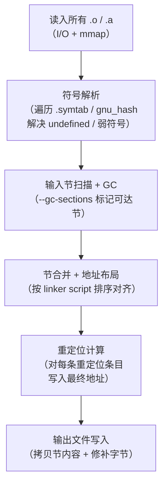
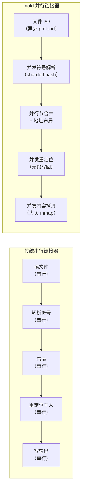

# 链接器详解（11）· 增量与并行链接

> [!abstract] TL;DR
> - **链接为何慢**：链接器必须串行扫描全部 `.o`/`.a`、解析符号、做重定位、合并/布局成千上万个输入节，再批量写磁盘——这些步骤相互依赖，传统 GNU ld 几乎全程单线程，大项目耗时动辄数十秒。
> - **并行链接**：LLD 与 mold 通过多线程并发符号解析、并发重定位计算、并发节内容拷贝，将端到端链接时间压到 GNU ld 的 1/5–1/20。mold 在此基础上追加了 preload（提前异步 I/O）和更激进的任务分解，是目前已知最快的通用链接器。
> - **增量链接**：MSVC `/INCREMENTAL` 在 `.obj` 未大幅变化时复用上次链接结果（padding + thunk 复用），避免重新布局全体；GNU ld 不支持真增量——局部改动仍需完整重链。
> - **三平台一句话**：Linux 用 `-fuse-ld=lld` 或 `-fuse-ld=mold` 切换；macOS ld64 自带并行段合并；Windows 用 `/INCREMENTAL`（默认开）做增量，完整链接基于多线程 LTCG pass。

---

## 概述与定位

本篇承接 [[10.LTO链接时优化]]（已讨论 LTO 如何把大量跨模块分析都移入链接期），现在面对的新问题是：**如何让链接本身更快**——不只是链接的"分析质量"，而是端到端的挂钟时间（wall time）。

链接速度问题在大型 C/C++ 项目里是真实瓶颈。LLVM 自身、Chromium、内核模块工程等，用 GNU ld 链接一次动辄 30–60 秒；换 mold 常见降至 2–5 秒。对开发循环（编辑→编译→链接→测试）而言，这是几十秒 vs 几秒的体验差距。

本系列后续将在 [[14.三平台链接器对比]] 给出各链接器的完整横评；本篇聚焦**链接速度本身的机制**：慢的根因、并行化的方案与取舍、增量链接的原理与局限。

---

## 原理与机制

### 链接为何慢

一次静态链接/最终链接（final link）要完成以下步骤，每一步都有显著代价：



**关键瓶颈分析**：

| 步骤 | 为什么慢 | 数据量 |
|---|---|---|
| 符号解析 | 需要对每个 undefined 符号在所有已读入目标文件的符号表里查找；大项目有数十万符号 | 百万级符号条目 |
| 重定位计算 | 每个 `.text` 节里有大量重定位条目，逐条计算 `S + A - P` 等式并写回；CPU 密集 | 千万级重定位 |
| 节合并 | 将来自数千 `.o` 的同名输入节（`.text.foo`）合并到输出节，需跟踪每个节的最终偏移 | 数万输入节 |
| 内容拷贝 | 把每个输入节的字节拷贝到输出文件正确位置；I/O 与内存带宽双杀 | 数百 MB |
| **单线程** | GNU ld（BFD 后端）主循环几乎全程串行，无法利用多核 | — |

GNU ld 的单线程架构是历史遗留——BFD（Binary File Descriptor）库在设计时以通用性优先，全局状态多、难以并发。gold 在 2008 年引入多线程，但并行化程度仍有限。LLD 和 mold 则是以并行为前提从头设计的。

### 并行链接：LLD 的方案

LLVM LLD（`ld.lld`）从 2015 年起以"快"为核心设计目标。它的并行化要点：

**1. 并发符号解析**

LLD 在读入所有 `.o` 后，用 `llvm::parallel::for_each` 并发处理各文件的符号表，往全局符号表里插入 `defined`/`undefined` 条目。全局符号表用 `llvm::DenseMap` + 细粒度锁（或 sharded hash map）保证并发安全。

**2. 并发节合并（Section Merge）**

`.rodata.str` / `.rodata.cst16` 等合并节（`SHF_MERGE`）的去重工作按哈希分片，不同分片由不同线程处理。

**3. 并发重定位写入**

在地址布局完成（这一步仍需串行）后，LLD 对每个输出节内部的重定位条目做并发 `for_each`——每条重定位的计算互相独立，是理想并行场景。

**4. 并发内容写入**

输出文件提前 `mmap` 或 `fallocate`，各线程并发把各输入节内容拷贝到正确偏移，无锁冲突（偏移不重叠）。

```bash
# 默认即开启多线程；可通过 --threads=N 控制
ld.lld --threads=8 -o output main.o libfoo.a

# 用 gcc/clang 前端指定后端
gcc -fuse-ld=lld -o output main.o
```

LLD 的 `--threads` 选项：

| 选项 | 含义 |
|---|---|
| `--threads=1` | 强制单线程（调试/可重现问题时用） |
| `--threads=N` | 指定 N 个工作线程 |
| 不指定（默认） | 使用 `std::thread::hardware_concurrency()` 个线程 |

### 并行链接：mold 的方案

[mold](https://github.com/rui314/mold)（Make Object files Linked Dramatically faster，作者 Rui Ueyama，也是 LLD 早期主要开发者）将并行化做到更极致。

#### mold 为什么快：关键设计



> 图示为逻辑并行化示意，各阶段内部并发，阶段间仍有必要的同步屏障。

**a. Preload（预加载）**

mold 在主处理循环开始前，就用后台线程异步将所有输入文件 `mmap` 进内存（不等完成即开始解析已就绪的文件）。传统链接器是"用到哪个 `.o` 才读哪个"，mold 是"全部提前读进来，CPU 从不等 I/O"。

**b. 并发符号解析（Sharded Symbol Table）**

mold 对全局符号表按名字哈希分成 N 个 shard，每个 shard 有独立锁。解析阶段 N 个线程分别处理不同 shard，几乎零争用。

**c. 节内容并发拷贝**

mold 对输出文件做 `mmap` + `fallocate`，各输出节的偏移在布局阶段串行确定后，拷贝阶段完全无锁并发——不同线程写不同内存页，无需同步。

**d. 整体架构以内存为中心**

mold 的内部表示全部是内存中的数据结构（而非反复读写临时文件），尽量减少内存分配碎片（大块 Arena 分配器）。

**e. 尽量减少不必要的全局串行点**

mold 仔细区分"哪些步骤必须等待之前步骤"（真依赖）和"哪些只是实现上的方便而串行化"（伪依赖），尽力去掉后者。

#### mold 的使用

```bash
# 安装（Ubuntu/Debian）
sudo apt install mold

# 方式一：-fuse-ld
gcc -fuse-ld=mold -o output main.o libfoo.a

# 方式二：mold 包装命令（保留原链接命令不变）
mold -run gcc -o output main.o libfoo.a

# 方式三：CMake 项目
# CMakeLists.txt：
# set(CMAKE_EXE_LINKER_FLAGS "-fuse-ld=mold")
```

#### 链接速度数量级对比（示意）

下表数字均为**数量级示意**，源自多个公开基准测试报告（Chromium、LLVM、内核模块等），非本机实跑。实际结果随项目大小、I/O 速度、CPU 核数变化显著。

> [!warning] 示意数据
> 以下速度对比均为**定性量级示意**，并非本机实测值。不同项目、机器、版本差异极大，请以自己环境的实测为准。

| 链接器 | 典型相对时间 | 特点 |
|---|---|---|
| GNU ld（BFD） | 1× 基准 | 单线程主循环；成熟稳定；最慢 |
| gold | ~0.4–0.6× | 多线程有限，快于 BFD；已进入维护模式 |
| LLD（LLVM） | ~0.1–0.2× | 多线程并发；与 BFD 输出高度兼容 |
| mold | ~0.05–0.1× | 最激进并行；Linux 大项目最快；上游 mold 仅产 ELF（PE 为实验性），不产 Mach-O；macOS 由独立派生项目 `sold` 支持（2024 年起开源） |
| MSVC link | — | Windows 专属；LTO/LTCG 时多线程；非 Unix 可比 |

> mold 在 8 核机器上链接 Chromium，比 GNU ld 快约 10–20 倍（不同版本/机器有差异）。

### 增量链接

增量链接（Incremental Linking）的目标是：**在少量 `.o` 发生变化后，不重新链接所有目标文件，只处理变化的部分，复用上次的链接结果**。

#### MSVC `/INCREMENTAL`

MSVC `link.exe` 提供最成熟的增量链接实现，在 Debug 模式下默认开启。

```text
# 命令行开启
link /INCREMENTAL main.obj libfoo.lib /OUT:app.exe

# CMake Debug 构建默认继承此行为
cmake -DCMAKE_BUILD_TYPE=Debug ..
```

> [!warning] /INCREMENTAL 注意事项
> - `/INCREMENTAL` 与 `/LTCG`（Link-Time Code Generation）**不兼容**——开了 LTO 就必须完整链接。
> - `/INCREMENTAL` 生成的可执行文件会比完整链接的**更大**（padding 保留空位）。
> - 生产/Release 构建应用 `/INCREMENTAL:NO` 关闭，以获得最优文件大小和性能。
> - 若 `.obj` 变化过大（新增/删除函数、节布局变化超出 padding 范围），增量链接会自动退化为完整链接。

**工作机制**：

```mermaid
flowchart LR
    subgraph 第一次链接（完整）
    F1["所有 .obj"] -->|完整链接| OUT1["app.exe<br/>+ app.ilk（增量状态文件）"]
    end
    subgraph 第二次链接（foo.obj 改变）
    F2["foo.obj 变化"] --> INC["读取 app.ilk<br/>（上次布局状态）"]
    INC --> PATCH["只重算 foo.obj<br/>相关的节和重定位<br/>其余节在原地复用（padding）"]
    PATCH --> OUT2["app.exe（原地更新）<br/>+ 更新 app.ilk"]
    end
```

核心机制：

1. **Padding（节内填充）**：链接器在每个函数/节后面预留额外空间（通常几十字节），使得函数体增大时不需要重新布局其他函数。
2. **Thunk（跳转桩）**：若函数移位到 padding 无法容纳，链接器在原地址放一个 `jmp` 跳板（thunk）指向新位置，其他引用该地址的 call 无需修改。
3. **ILK 文件**：`.ilk` 是 MSVC 专有的增量链接状态文件，记录上次链接的完整节布局、符号偏移映射，是第二次增量链接的前提。若删除 `.ilk`，下次强制完整链接。

**MSVC 增量链接支持度速查**：

| 功能 | 与 `/INCREMENTAL` 兼容性 |
|---|---|
| `/LTCG`（LTO） | **不兼容**，自动退化 |
| `/OPT:REF`（去除未引用符号） | 默认与增量冲突，需 `/OPT:NOREF` |
| `/OPT:ICF`（相同函数折叠） | 同上，需 `/OPT:NOICF` |
| Debug 模式 | 完全支持（默认） |
| Release 模式 | 不推荐；通常禁用 |

#### GNU ld 为何不支持真增量

GNU ld / gold / LLD / mold 均**不支持真增量链接**——每次都是完整链接。根本原因在于 ELF 的链接模型：

1. **符号解析是全局的**：弱符号、COMDAT 折叠、`.a` 的按需提取规则——任何一个 `.o` 变化都可能影响其他 `.o` 的符号解析结果（例如新增一个强符号会覆盖原来生效的弱符号）。无法在不重新扫描全局的情况下保证正确性。
2. **节布局是连续分配的**：所有输入节的最终偏移取决于其前序节的总大小；单个 `.o` 的节大小变化会导致其后所有节的偏移全部改变，大量重定位条目需要重新计算。
3. **没有 ILK 等状态文件支撑**：GNU 工具链没有定义增量状态文件的标准格式，链接器每次启动都从头解析所有 `.o`。

> MSVC 能做到增量，一定程度上得益于 PE/COFF 对函数粒度节（每个函数单独一个 COMDAT 节）的广泛使用，配合预先 padding，使布局更稳定。ELF 也有 COMDAT（`-ffunction-sections`），但历史上链接器并未为此设计增量状态。

**Linux 上的替代方案**：不是"真增量链接"，但可以加速迭代：

- **`-ffunction-sections -fdata-sections` + `--gc-sections`**：细粒度节有助于 GC，减少不必要符号；但对链接速度本身提升有限甚至负面（节数量爆炸）。
- **`-Wl,--thinlto-jobs=N`**（ThinLTO 下）：ThinLTO 的汇总（summary）阶段可增量化，只重编变化的 module——但仍需完整链接最终产物。
- **换用 mold**：极快的完整链接有时比不完整的增量链接还快（mold 链接 2 秒 vs 增量链接 1.5 秒，差距不如 mold vs GNU ld 那么悬殊）。

---

## 三平台对照

### Linux（GNU ld / gold / LLD / mold）

| 链接器 | 启用方式 | 增量支持 | 并行化程度 | 说明 |
|---|---|---|---|---|
| GNU ld（BFD） | 系统默认 | 无 | 极低（几乎单线程） | 最通用；成熟；慢 |
| gold | `-fuse-ld=gold` | 无 | 低（部分多线程） | 已进入维护模式，不推荐新项目 |
| LLD | `-fuse-ld=lld` | 无 | 高（完整多线程） | LLVM 生态首选；兼容性好 |
| mold | `-fuse-ld=mold` | 无 | 极高（激进并行） | 最快；Linux 推荐；需 ≥ 1.0 版本 |

实操命令：

```bash
# 切换到 LLD
gcc -fuse-ld=lld -o app main.o

# 切换到 mold（方式一：-fuse-ld，需 mold 在 PATH）
gcc -fuse-ld=mold -o app main.o

# 切换到 mold（方式二：mold -run 包装，无需修改构建系统）
mold -run make -j8

# 控制 LLD 线程数
ld.lld --threads=16 -o app main.o libfoo.a

# 查看链接时间（GNU time）
/usr/bin/time -v gcc -fuse-ld=mold -o app main.o 2>&1 | grep "Elapsed"
```

> [!warning] 示例输出为示意
> 上述命令在 Linux x86-64 环境下可运行；输出内容（链接时间、路径）随机器和项目而异，本机 Windows 环境无法直接执行。

### macOS（ld64 / LLD / mold/sold）

macOS 系统链接器 ld64 本身已引入并发段（segment）合并，但不如 LLD/mold 激进。

```bash
# macOS 使用 LLVM LLD（需通过 Homebrew 安装）
brew install llvm
export PATH="$(brew --prefix llvm)/bin:$PATH"
clang -fuse-ld=lld -o app main.o

# sold（独立派生项目，macOS/ld64 协议；上游 mold 不产 Mach-O，不支持 macOS；sold 于 2024 年起以自由软件许可开源）
brew install sold
clang -fuse-ld=/opt/homebrew/bin/ld64.sold -o app main.o
```

> [!warning] 示例输出为示意
> macOS 专有工具链命令，本机 Windows 环境不适用；brew 路径随 Apple Silicon/Intel 而异。

macOS 不支持增量链接（ld64 无此特性）。Xcode 在 Debug 构建中通过编译缓存（`DerivedData` + ccache）以及细粒度目标文件缓存来减少重编译，但链接本身每次全量。

### Windows（MSVC link.exe）

```bat
:: Debug 下默认开启增量链接
cl /Zi /Od main.cpp /link /INCREMENTAL /DEBUG /OUT:app.exe

:: Release 下关闭增量，开启优化
cl /O2 main.cpp /link /INCREMENTAL:NO /LTCG /OUT:app.exe

:: 查看是否启用增量（dumpbin）
dumpbin /HEADERS app.exe | findstr "INCREMENTAL"
```

> [!warning] 示例输出为示意
> 以上为 Windows MSVC 命令行语法，需在 Developer Command Prompt 中运行。`dumpbin /HEADERS` 对应输出中，若有 `Application can be incrementally linked` 字样，则说明启用了增量链接。

**CMake 项目管理增量链接**：

```cmake
# CMakeLists.txt
if(MSVC)
  # Debug 保留增量（默认），Release 关闭
  target_link_options(myapp PRIVATE
    $<$<CONFIG:Release>:/INCREMENTAL:NO /OPT:REF /OPT:ICF>
  )
endif()
```

---

## 数据结构 / 流程详解

### mold 并行符号解析的数据结构

mold 的全局符号表是一个按名字哈希分桶的 `sharded_map<StringRef, Symbol *>`：

```
全局符号表（概念示意）
  Shard 0  [hash % N == 0]：{ "main" → Symbol, "printf" → Symbol, … }
  Shard 1  [hash % N == 1]：{ "foo"  → Symbol, "bar"   → Symbol, … }
  …
  Shard N-1：{ … }
```

每个 `Symbol` 记录：
- 是否已定义（`isDefined`）、定义所在的 `InputSection`
- 所有对该符号的 undefined 引用（待解析）
- 弱/强标记、可见性

并发解析时，线程 i 只锁 `Shard[hash(name) % N]`，不同名字的符号互不干扰，竞争极少。

### MSVC ILK 文件与增量状态

`.ilk` 文件（Incremental Linker state）存储上次链接的完整快照：

```
ILK 文件（逻辑结构，MSVC 私有格式）
  └─ 上次各 .obj 的时间戳 / 内容哈希
  └─ 上次各函数/节的 VA（虚拟地址）+ 大小 + padding 大小
  └─ 上次全局符号表快照
  └─ 上次重定位修补记录
```

增量链接流程（第 N 次，N > 1）：

1. 读取 `.ilk`，重建上次布局状态
2. 对比各 `.obj` 的哈希；找出变化的文件
3. 对变化 `.obj` 重解析符号 + 重计算其节的重定位
4. 若函数体扩大 ≤ 预留 padding：原地写回，不移动其他节
5. 若函数体扩大 > padding 或符号表变化太大：在 `.exe` 末尾追加新内容 + 原地址写 thunk
6. 更新 `.ilk` 快照，落盘 `.exe`

thunk 机制示意：

```
第 1 次链接：
  0x1000  foo:  [函数体 32 字节] [padding 16 字节]
  0x1030  bar:  [函数体]

第 2 次（foo 增大到 60 字节，超过 padding）：
  0x1000  foo:  [jmp → 0x5000]  ; thunk，原地址不变
  0x5000  foo': [新函数体 60 字节]  ; 追加在文件末
  0x1030  bar:  [不变]
```

---

## 实操

### Linux：切换链接器并计时

```bash
# 比较 ld / lld / mold 链接大项目的时间
time gcc main.o libfoo.a -o app_ld
time gcc -fuse-ld=lld main.o libfoo.a -o app_lld
time gcc -fuse-ld=mold main.o libfoo.a -o app_mold

# 验证实际使用了哪个链接器（查看 ELF comment 节）
readelf -p .comment app_lld | head
```

> [!warning] 示例输出为示意
> 本机 Windows 环境不可执行；Linux 环境下 `readelf -p .comment` 输出通常含链接器版本字符串，如 `Linker: LLD 17.0.0`。

### Linux：控制 LLD 线程

```bash
# 单线程（基准）
ld.lld --threads=1 -o app_st @response.txt

# 全核（默认）
ld.lld -o app_mt @response.txt

# 查看 lld 版本与线程支持
ld.lld --version
```

### CMake 项目全局切换链接器

```cmake
# CMakeLists.txt（顶层）
# 切换到 mold
if(CMAKE_CXX_COMPILER_ID MATCHES "Clang|GNU")
  add_link_options("-fuse-ld=mold")
endif()

# 或切换到 lld
add_link_options("-fuse-ld=lld")
```

### Windows：增量链接实操

> [!warning] /INCREMENTAL 与 LTO 不兼容
> 在 MSVC 项目中，若同时开启 `/LTCG`（全程序优化）和 `/INCREMENTAL`，链接器会自动忽略 `/INCREMENTAL` 并退化为完整链接，通常伴随 `LNK4075` 警告。Debug 构建（无 LTCG）才能真正受益于增量链接。

```bat
:: Debug 增量链接（默认）
cl /Zi /Od /MDd main.cpp /link /INCREMENTAL /DEBUG /OUT:app.exe

:: 验证 ILK 文件存在（增量状态文件）
dir app.ilk

:: Release 完整链接（关闭增量）
cl /O2 /GL main.cpp /link /INCREMENTAL:NO /LTCG /OPT:REF /OPT:ICF /OUT:app.exe
```

> [!warning] 示例输出为示意
> 需在 Visual Studio 的 Developer Command Prompt 中执行；`dir app.ilk` 若输出文件存在，说明增量链接已激活。ILK 文件大小通常与 EXE 相当甚至更大。

---

## 陷阱与注意

**1. mold 与部分链接脚本不兼容**

mold 不支持全部 GNU ld 链接脚本特性（如 `PROVIDE`、`OVERLAY`）；嵌入式/内核项目迁移前需验证。相关讨论见 [[07.链接脚本]]。

**2. LLD 的默认行为与 GNU ld 差异**

LLD 在符号可见性、弱符号处理、`.gnu.warning` 等细节上与 BFD 有差异。迁移大型项目时建议先用 `--warn-common`、`--fatal-warnings` 等标志捕捉潜在兼容问题。符号可见性机制详见 [[09.符号可见性与版本]]。

**3. `/INCREMENTAL` 导致可执行文件虚胖**

增量链接的 padding 使 Debug 版 `.exe` 明显比 Release 大。若需精确尺寸分析，应在 Release + `/INCREMENTAL:NO` 下测量。

**4. mold 与 `-z now` / `Full RELRO` 兼容**

mold 完整支持 `-z relro,-z now` 等安全硬化选项（生成 `PT_GNU_RELRO` 程序头），与 GNU ld 行为一致。GOT/RELRO 机制详见 [[11.ELF文件详解/17.got节.md]]。

**5. ThinLTO + mold 的组合**

mold ≥ 1.4 支持 ThinLTO（需配合 `-flto=thin` 编译）。ThinLTO 的跨模块优化与 mold 的快速链接结合，可在大项目里同时获得优化质量与链接速度，但兼容性需逐项验证。LTO 细节见 [[10.LTO链接时优化]]。

---

## 小结

1. **链接慢的根因是单线程 + 全量处理**：符号解析、重定位计算、节合并/拷贝全部串行，大项目自然慢。
2. **LLD 的多线程并发**：在符号解析、节合并、重定位写入、内容拷贝四个阶段都引入 `parallel::for_each`，比 GNU ld 快 5–10 倍。
3. **mold 的激进并行**：在 LLD 基础上追加 preload 异步 I/O、sharded symbol hash、大页 mmap 并发拷贝，消除更多串行点，是目前最快的通用 ELF 链接器（快 GNU ld 10–20 倍量级）。
4. **增量链接的本质**：MSVC `/INCREMENTAL` 靠 padding 保留地址稳定性、thunk 做函数移位时的原地跳板、ILK 文件记录状态，在 Debug 迭代中跳过未变部分。
5. **GNU ld 不支持真增量**：符号解析全局性、节布局连续性、缺乏状态文件，三者共同使 ELF 链接器难以做增量——换 mold 的完整链接，速度足以弥补"无增量"的遗憾。
6. **三平台操作一句话**：Linux 用 `-fuse-ld=mold`（最快）或 `-fuse-ld=lld`（兼容性优先）；macOS 可用 sold；Windows Debug 保留 `/INCREMENTAL`，Release 关掉换 `/LTCG`。

---

## 相关阅读

- **上游：LTO 带入链接期的巨量工作**：[[10.LTO链接时优化]]
- **三平台链接器全面横评**：[[14.三平台链接器对比]]
- **链接脚本（mold 兼容性相关）**：[[07.链接脚本]]
- **符号可见性（LLD 迁移注意点）**：[[09.符号可见性与版本]]
- **GOT/RELRO（mold 安全选项兼容性）**：[[11.ELF文件详解/17.got节.md]]
- **动态库链接基础**：[[08.动态库链接]]
- **工具链上下文**：[[41.Compiler/00.编译器完整参考 - 总索引.md]]、[[42.Cmake/00 - CMake 完整技术教程 - 总索引.md]]

---

⬅️ 上一篇 [[10.LTO链接时优化]] ｜ 🏠 [[00.链接器详解总览]] ｜ 下一篇 [[12.链接器与C运行时]] ➡️
