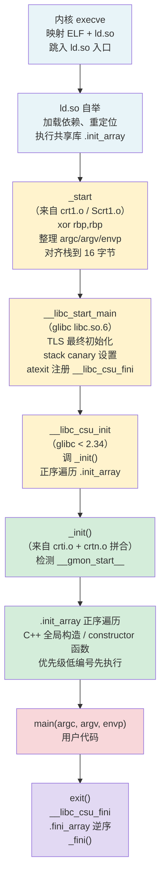
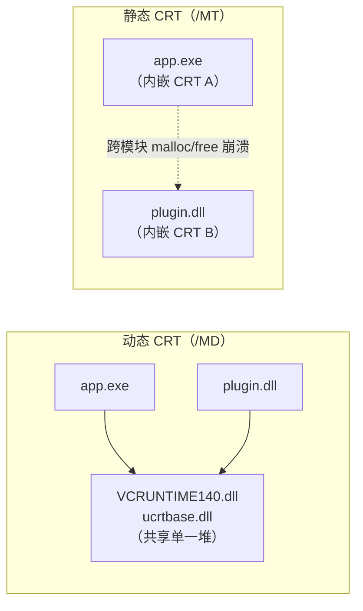

# 链接器详解（12）· 链接器与C运行时

> [!abstract] TL;DR
> - **你写的 `main` 并不是进程的真正起点**：链接器悄悄拼入了 `crt1.o`/`crti.o`/`crtbegin.o`/`crtend.o`/`crtn.o` 这五个启动文件，它们共同构建出 `_start → __libc_start_main → main` 这条启动链路。
> - **CRT 文件的链接顺序是硬约束**：`crti.o` 必须在所有用户 `.o` 之前，`crtn.o` 必须在最后——它们分别提供 `.init` 的函数序言和尾声，顺序错误会产生不可执行的残缺函数。
> - **`-nostartfiles`/`-nostdlib`/`-nodefaultlibs` 可以选择性剥离 CRT**，用于裸机（baremetal）或 freestanding 环境，但调用者必须自行提供 `_start` 等入口和运行时支撑。
> - **静态 CRT vs 动态 CRT**（Windows）：`/MT` 把 CRT 代码并入 `.exe`/`.dll`，`/MD` 引用 `VCRUNTIME*.dll`——混用会导致堆不一致、双重析构等灾难性问题。
> - **三平台殊途同归**：Linux 用 `glibc/musl` 提供 `crt1.o` + `__libc_start_main`；macOS 用 `libSystem` 内嵌的启动支持（`LC_MAIN` 入口，`dyld` 直接跳 `main`）；Windows 用 MSVC CRT 的 `mainCRTStartup`/`WinMainCRTStartup`。

本篇聚焦**链接器与 C 运行时的交界面**：哪些文件被悄悄链入、它们做了什么、链接顺序为何重要、以及在非标准环境下如何裸用链接器。启动链路的运行期流程在 [[14.动态链接与加载器详解/02.程序加载全景.md]] 中已有完整全景图，本篇从**链接期视角**补全那张图的"静态拼装"侧；初始化函数的调用机制与顺序语义详见 [[14.动态链接与加载器详解/11.初始化与析构顺序.md]]。

---

## 概述与定位

### "你没写的代码"从哪来

执行 `gcc hello.c -o hello` 时，链接器实际处理的输入远不止 `hello.o`。加上 `-v` 可以看到真实命令：

```bash
gcc -v hello.c -o hello
```

```text
# 示例输出（代表性，非本机实跑，各发行版路径略有差异）
/usr/libexec/gcc/x86_64-linux-gnu/14/collect2 \
  ...
  /usr/lib/x86_64-linux-gnu/crt1.o        ← CRT 启动
  /usr/lib/x86_64-linux-gnu/crti.o        ← .init 序言
  /usr/lib/gcc/.../crtbegin.o             ← C++ .init_array 开头标记
  hello.o                                 ← 用户代码
  -lgcc -lgcc_s -lc -lgcc -lgcc_s        ← 运行时支撑库
  /usr/lib/gcc/.../crtend.o              ← C++ .init_array 结尾标记
  /usr/lib/x86_64-linux-gnu/crtn.o        ← .init 尾声
```

> [!warning] 示例输出为示意
> 路径随发行版、GCC 版本而变；`/usr/lib/x86_64-linux-gnu/` 在 Debian/Ubuntu 系下典型，Fedora/Arch 等路径不同。实际以自己机器的 `gcc -v` 输出为准。

这五个 `.o` 文件——`crt1.o`、`crti.o`、`crtbegin.o`、`crtend.o`、`crtn.o`——就是"你没写但链接器悄悄拼入"的 CRT 启动文件，本篇的核心主题。

### 本篇在系列中的位置

| 维度 | 本篇聚焦 | 相邻篇章 |
|---|---|---|
| CRT 文件的静态拼装 | `crt1.o` 等来自哪里、链接顺序约束 | 节合并布局见 [[05.节的合并与布局]] |
| 运行期启动链路 | `_start → __libc_start_main → main` 完整时序 | 全景图见 [[14.动态链接与加载器详解/02.程序加载全景.md]] |
| 初始化器调用机制 | `.init_array` 谁来触发、顺序语义 | 详见 [[14.动态链接与加载器详解/11.初始化与析构顺序.md]] |
| `.init` 节本身 | `_init` 函数的拼合与角色 | 详见 [[11.ELF文件详解/41.init节.md]] |
| 上一篇 | 增量与并行链接加速 | [[11.增量与并行链接]] |
| 下一篇 | 链接错误排查实战 | [[13.链接错误排查]] |

---

## 原理与机制

### CRT 启动文件全谱

Linux/glibc 的 CRT 启动文件由两个来源分工：

| 文件 | 来自 | 职责 |
|---|---|---|
| `crt1.o` | glibc | 提供 `_start` 符号（ELF `e_entry` 真正指向的入口）；负责调 `__libc_start_main` |
| `Scrt1.o` | glibc | PIE（`-pie`）和共享库使用，含 position-independent `_start` |
| `rcrt1.o` | glibc | `-static-pie` 时使用（静态 PIE） |
| `gcrt1.o` | glibc | `-pg` 性能剖析时使用 |
| `crti.o` | glibc | 向 `.init` 节贡献 **函数序言**（`_init` prologue），向 `.fini` 节贡献 `_fini` prologue |
| `crtn.o` | glibc | 向 `.init` 节贡献 **函数尾声**（`_init` epilogue），向 `.fini` 节贡献 `_fini` epilogue |
| `crtbegin.o` | **GCC** | 向 `.init_array` 写入 C++ 全局构造函数列表的**起始标记**；维护 `__init_array_start` |
| `crtbeginS.o` | **GCC** | 共享库/PIE 版 `crtbegin.o`（`S` = Shared） |
| `crtbeginT.o` | **GCC** | 完全静态链接版 `crtbegin.o`（`T` = static） |
| `crtend.o` | **GCC** | 向 `.init_array` 写入列表的**结束标记**；维护 `__init_array_end` |
| `crtendS.o` | **GCC** | 共享库/PIE 版 `crtend.o` |

> [!note] glibc 与 GCC 各管一块
> `crt1.o`/`crti.o`/`crtn.o` 来自 glibc（`/usr/lib/...`），`crtbegin.o`/`crtend.o` 来自 GCC 自身（`/usr/lib/gcc/<arch>/<ver>/`）。两者协作：glibc 提供 `_start` 和 `__libc_start_main`，GCC 提供 C++ 构造函数列表的边界符号。

### 链接顺序：为何是硬约束

CRT 文件对链接顺序的依赖比普通库更强，原因是 `.init` / `.fini` 节的"碎片拼合"机制：

`.init` 节是由多个目标文件的 `.init` 片段**按链接顺序无缝拼接**而成的完整函数 `_init`：

```
.init 节最终内容：
  [crti.o  → 函数序言：sub $0x8, %rsp   ]
  [crtbegin.o → 可选初始化代码              ]
  [用户 .o  → 通过 __attribute__((constructor)) 放入的片段]
  [crtn.o  → 函数尾声：add $0x8, %rsp; ret]
```

如果 `crtn.o` 的 `ret` 先于 `crti.o` 的 prologue 被链接，拼出来的函数就会是"先 ret 后 prologue"——根本不是合法函数体，运行时直接崩溃。

**正确顺序（链接器命令行视角）**：

```
crt1.o  crti.o  crtbegin.o
    [所有用户 .o]
    [所有 -l 库]
crtend.o  crtn.o
```

`gcc` 驱动自动维护这一顺序；只有直接调 `ld` 时才可能破坏它。

### CRT 启动链路详解

从内核跳入 `_start`，到 `main` 第一行代码，Linux 下的精确路径：



> **图解**：蓝色 = 内核/ld.so 阶段（CRT 文件不直接参与）；黄色 = `crt1.o` 提供的 `_start` 和 glibc 的 `__libc_start_main`；绿色 = `crti.o`/`crtn.o`/`crtbegin.o`/`crtend.o` 共同构建的初始化器链；红色 = 用户 `main`；紫色 = 析构路径。

**glibc 2.34+ 的变化**：`__libc_csu_init` / `__libc_csu_fini` 从 `libc.a` 中彻底删除。`__libc_start_main` 通过 `DT_INIT_ARRAY` / `DT_FINI_ARRAY` 动态标签直接驱动，`_start` 对 `__libc_start_main` 传 `NULL` 而非 `__libc_csu_init` 地址。三段式结构（`_start → __libc_start_main → main`）不变，只是中间层更扁平。与 [[14.动态链接与加载器详解/02.程序加载全景.md]] 的全景图口径一致。

### `.init` 的开合：`crti.o` 与 `crtn.o` 的夹心

这是 CRT 设计中最精妙（也最脆弱）的一处。`.init` 节的内容在磁盘上来自多个不同目标文件的 `.init` 片段，链接器按输入顺序拼接，最终形成单一完整的 `_init` 函数体：

```nasm
; 最终 .init 节的汇编（拼合结果，示意）
_init:
    sub  $0x8, %rsp        ; ← crti.o 贡献：函数序言（prologue）
    ; ...crtbegin.o 等中间文件的可选初始化片段...
    add  $0x8, %rsp        ; ← crtn.o 贡献：函数尾声（epilogue）
    ret
```

`crti.o` 的 `.init` 片段只有 prologue，没有 `ret`；`crtn.o` 的 `.init` 片段只有 epilogue + `ret`。中间的内容由 `crtbegin.o` 和其他目标文件填充。**这三段必须首尾相接，顺序错误则 `ret` 出现在 prologue 之前，函数体非法**，会在运行时立即崩溃。

详细的节结构与 `DT_INIT` 驱动机制见 [[11.ELF文件详解/41.init节.md]]。

### `.init_array` 的串联：`crtbegin.o` 与 `crtend.o`

与 `.init` 的"拼函数体"不同，`.init_array` 是**函数指针数组**。链接器通过 `__init_array_start` 和 `__init_array_end` 这两个符号确定数组的边界：

- `crtbegin.o` 在 `.init_array` 节里写入一个**哨兵**（通常是 `-1`/`0xffffffffffffffff`），并定义 `__init_array_start` 指向数组起始
- `crtend.o` 定义 `__init_array_end` 指向数组结束
- 用户代码通过 `__attribute__((constructor))` 或 C++ 全局对象，让编译器把函数指针放入 `.init_array.NNNNN` 节（带优先级后缀），链接器按优先级数字升序合并

```
.init_array 最终布局（链接后）：
  [crtbegin.o 哨兵]
  [.init_array.00065 条目]   ← 优先级 65（框架/库使用）
  [.init_array.00100 条目]   ← 优先级 100
  [.init_array.00101 条目]   ← 用户最低安全优先级
  [.init_array 无序条目]      ← 无优先级，按链接顺序
  [crtend.o 哨兵 / 结束标记]
```

`__libc_start_main`（或 `__libc_csu_init`）通过遍历 `[__init_array_start, __init_array_end)` 区间，依次调用所有函数指针。

---

## 三平台对照

| 维度 | Linux（glibc/musl） | macOS（libSystem） | Windows（MSVC CRT） |
|---|---|---|---|
| 真正入口符号 | `_start`（`crt1.o`，`e_entry`） | `_main` / dyld 直接处理 `LC_MAIN` | `mainCRTStartup` / `WinMainCRTStartup` |
| CRT 启动文件 | `crt1.o` + `crti.o` + `crtbegin.o` + `crtend.o` + `crtn.o` | 内嵌于 `libSystem.B.dylib`（不需额外 `.o`） | `crt0.obj`（静态） / `crt0d.obj`（调试） / 内嵌于 MSVCRT |
| 向 main 传参 | `__libc_start_main(main, argc, argv, init, fini, ...)` | dyld 直接调 `_main(argc, argv, envp, apple)` | `mainCRTStartup` 解析 PEB 后调 `main` |
| `.init_array` 触发者 | `__libc_start_main → __libc_csu_init`（旧）/ glibc 直接（2.34+） | dyld 遍历 `__mod_init_func` | `_initterm`（`mainCRTStartup` 内，遍历 `.CRT$XC*`） |
| C++ 全局析构 | `.fini_array` + `__cxa_atexit` | `__mod_term_func` + `__cxa_atexit` | `.CRT$XP*`/`.CRT$XT*` + `atexit` |
| 剥离 CRT | `-nostartfiles` / `-nostdlib` | `-nostdlib`（需自提 `_main`） | `/NODEFAULTLIB` + 手写入口点 |

### Linux：musl 与 glibc 的差异

musl libc 同样提供 `crt1.o`/`crti.o`/`crtn.o`，但 `crtbegin.o`/`crtend.o` 仍来自 GCC。musl 的 `__libc_start_main` 签名与 glibc 相同，但内部实现更精简：不初始化 NSS、不处理安全审计钩子，启动开销更小。musl 静态二进制的 `_start` 直接内联了 `__libc_start_main` 的部分逻辑，无需外部调用，产物极小。

### macOS：`LC_MAIN` 重塑了 CRT

macOS 从 10.8 起引入 `LC_MAIN` 加载命令，彻底改变了启动模型：

- **旧模型（`LC_UNIXTHREAD`）**：程序自带 `_start`，与 Linux 类似；CRT 代码（`crt1.o`）链入二进制。
- **新模型（`LC_MAIN`，默认）**：`LC_MAIN.entryoff` 直接指向 `_main`（即用户 `main` 的地址），dyld 完成所有初始化后直接跳入 `_main`，**CRT 启动文件不再需要额外的 `.o` 文件**，对应逻辑已移入 `libSystem.B.dylib` 内部。

这意味着 macOS 上 `-nostartfiles` 的意义与 Linux 不同：macOS 不需要额外的 CRT `.o`，`-nostartfiles` 主要影响 `-lSystem` 是否被默认链入。

### Windows：`mainCRTStartup` 与 CRT 节组

Windows MSVC CRT 的启动入口是 `mainCRTStartup`（控制台程序）或 `WinMainCRTStartup`（GUI 程序），由链接器通过 `/ENTRY:` 选项或默认规则确定。`mainCRTStartup` 做的事情等价于 Linux 的 `__libc_start_main`：

```
mainCRTStartup
  → _heap_init()            // 初始化 CRT 堆
  → _initterm(__xi_a, __xi_z)  // 遍历 .CRT$XI* → C 初始化
  → _initterm(__xc_a, __xc_z)  // 遍历 .CRT$XC* → C++ 全局构造
  → _configure_narrow_argv() / GetCommandLineA()
  → main(argc, argv, envp)
  → exit(_main_ret)
      → _initterm(__xp_a, __xp_z) // 遍历 .CRT$XP* → 预终止器
      → _initterm(__xt_a, __xt_z) // 遍历 .CRT$XT* → 终止器（C++ 全局析构）
```

Windows 用**节名排序**替代了 Linux 的专用节类型：`.CRT$XCA` ... `.CRT$XCZ` 里的函数指针按节名字母顺序被链接器排列，`_initterm` 遍历首尾指针依次调用。这与 Linux `.init_array.NNNNN` 的思路类似，只是依靠字母排序而非数字优先级。

---

## 数据结构 / 流程详解

### `_start` 的精确汇编（x86-64 Linux）

```nasm
; _start（crt1.o，来自 glibc sysdeps/x86_64/start.S，示意）
_start:
    xor    ebp, ebp              ; rbp = 0，标记调用栈最外层帧（unwinder 底）
    mov    r9,  [rsp]            ; rdi = rtld_fini（ld.so 传来的析构回调）
    pop    rsi                   ; argc（内核压在栈顶）
    mov    rdx, rsp              ; argv（argc 弹出后 rsp 即指向 argv[0]）
    and    rsp, -16              ; 对齐栈到 16 字节（System V ABI 要求）
    push   rax                   ; 凑对齐（各版本实现略有差异）
    push   rsp                   ; stack_end 参数
    xor    r8, r8                ; fini = NULL（glibc 2.34+ 传 NULL）
    xor    rcx, rcx              ; init = NULL（glibc 2.34+ 传 NULL）
    mov    rdi, offset main      ; main 函数指针
    call   __libc_start_main@PLT ; 永不返回
    hlt                          ; 防御性指令（不应执行到此）
```

> [!warning] 示例输出为示意
> 以上汇编为概念示意；glibc 2.34 前的实现在 `rcx` 传 `__libc_csu_init` 地址、`r8` 传 `__libc_csu_fini` 地址。实际指令因 glibc 版本、架构、PIE 模式而异，以 `objdump -d -j .text crt1.o` 的真实输出为准。

### `__libc_start_main` 参数概览

```c
// glibc 旧版（< 2.34）概念原型
int __libc_start_main(
    int  (*main)(int, char **, char **), // 用户 main
    int    argc,
    char **argv,
    void (*init)(void),                  // __libc_csu_init（旧）
    void (*fini)(void),                  // __libc_csu_fini（旧）
    void (*rtld_fini)(void),             // ld.so 清理回调
    void  *stack_end
);

// glibc 2.34+ 实际传参
// init = NULL, fini = NULL
// 链接器/ld.so 直接经 DT_INIT_ARRAY 驱动初始化器
```

### CRT 节与 `.dynamic` 标签映射

| 节 | 对应 `DT_*` 标签 | 内容 | 由谁触发 |
|---|---|---|---|
| `.init` | `DT_INIT` | `_init` 函数体（crti.o + crtn.o 拼合） | ld.so（共享库）/ `__libc_csu_init`（主程序旧） |
| `.init_array` | `DT_INIT_ARRAY` / `DT_INIT_ARRAYSZ` | 函数指针数组（C++ 构造 / constructor） | ld.so（共享库）/ `__libc_csu_init` / `__libc_start_main`（主程序） |
| `.fini` | `DT_FINI` | `_fini` 函数体 | `exit()` → `__libc_csu_fini` |
| `.fini_array` | `DT_FINI_ARRAY` / `DT_FINI_ARRAYSZ` | 函数指针数组（逆序调用） | `exit()` → `__libc_csu_fini` / `__libc_start_main` |

---

## 代码与命令

### 实操：`gcc -v` 看链入的 CRT 文件

```bash
# 最简示例：看 gcc 实际传给链接器什么
echo 'int main(){return 0;}' > t.c
gcc -v t.c -o t 2>&1 | grep -E '(crt|\.o )' | head -20
```

```text
# 示例输出（代表性，非本机实跑）
/usr/lib/x86_64-linux-gnu/crt1.o
/usr/lib/x86_64-linux-gnu/crti.o
/usr/lib/gcc/x86_64-linux-gnu/14/crtbegin.o
t.o
/usr/lib/gcc/x86_64-linux-gnu/14/crtend.o
/usr/lib/x86_64-linux-gnu/crtn.o
```

> [!warning] 示例输出为示意
> 路径随发行版和 GCC 版本而变。用 `gcc -v` 而非 `gcc -###`，后者只打印命令不执行；路径中的 `14` 是 GCC 版本号，实际以系统安装版本为准。

### 实操：查看 `_start` 的来源

```bash
nm -u t | grep _start         # 查看符号引用（无需链接 crt 时会 undefined）
nm /usr/lib/x86_64-linux-gnu/crt1.o | grep _start  # 确认 _start 来自 crt1.o
objdump -d /usr/lib/x86_64-linux-gnu/crt1.o        # 反汇编看 _start 实现
```

```text
# 示例输出（代表性，非本机实跑）
0000000000000000 T _start
                 U __libc_start_main
                 U main
```

> [!warning] 示例输出为示意
> `T` = 已定义文本符号；`U` = 未定义（由 libc 和用户代码提供）。`crt1.o` 定义 `_start` 并引用 `__libc_start_main` 和 `main`，完整体现了"CRT 是 `_start` 到 `main` 的桥"。

### `-nostartfiles`：剥离 CRT 启动文件

> [!warning] 危险操作：剥离 CRT 后必须自提入口
> 下述操作仅在裸机/嵌入式/内核开发场景合理。普通应用程序**不要**使用这些选项，否则链接器找不到 `_start`，产物无法运行。

```bash
# -nostartfiles：不链入 crt1.o / crti.o / crtn.o / crtbegin.o / crtend.o
# 但仍链接默认库（libc、libgcc 等）
gcc -nostartfiles entry.o -o bare_app

# -nodefaultlibs：不链接任何默认库（libc/libgcc/...）
# 但仍链入 CRT 启动文件
gcc -nodefaultlibs hello.o -lc -o app  # 手动指定需要的库

# -nostdlib：等同 -nostartfiles + -nodefaultlibs 合集
# 完全不链入任何 CRT 文件和默认库
gcc -nostdlib entry.o kernel_support.o -o freestanding
```

**裸机入口示例（freestanding）**：

```c
// entry.c：自提 _start，不依赖任何 CRT
// 编译：gcc -nostdlib -static entry.c -o bare
// 注意：这里没有 __libc_start_main，直接用 syscall

__attribute__((noreturn))
void _start(void) {
    // 直接用 Linux syscall exit(0)
    // x86-64: rax=60(exit), rdi=status
    __asm__ volatile (
        "xor %%edi, %%edi\n"   // status = 0
        "mov $60, %%eax\n"     // syscall nr = exit
        "syscall\n"
        ::: "rax", "rdi"
    );
    __builtin_unreachable();
}
```

> [!warning] 裸机入口陷阱
> - 不能调用任何依赖 CRT 初始化的函数（如 `printf`、`malloc` 等）——堆未初始化、`errno` 未设置。
> - C++ 全局对象的构造函数**不会自动执行**（没有 `.init_array` 遍历机制），可能导致全局对象处于未初始化状态被访问，产生 UB 甚至崩溃。
> - 栈对齐、TLS 等也需要自行保证，或选择不使用相关功能。

---

## 静态 CRT vs 动态 CRT（Windows）

这是 Windows 开发中最常见的 CRT 坑之一。MSVC 提供两种链接模式：

| 选项 | 模式 | CRT 代码位置 | 产物大小 | 多运行时问题 |
|---|---|---|---|---|
| `/MT`（MT = Multi-thread Static） | **静态 CRT** | 并入 `.exe`/`.dll` | 较大（+几百 KB） | 每个模块独立堆 |
| `/MTd` | 静态 CRT 调试版 | 并入 `.exe`/`.dll` | 更大 | 每个模块独立堆 |
| `/MD`（MD = Multi-thread DLL） | **动态 CRT** | 依赖 `VCRUNTIME*.dll`/`ucrtbase.dll` | 较小 | 共享单一运行时堆 |
| `/MDd` | 动态 CRT 调试版 | 依赖调试版 `*.dll` | 中等 | 共享单一运行时堆 |

### 混用 `/MT` 与 `/MD` 的灾难

这是 Windows 上最臭名昭著的链接陷阱：

```
主程序 exe  → 用 /MD 编译（依赖 VCRUNTIME140.dll）
插件 dll    → 用 /MT 编译（自带独立 CRT 代码）
```

问题发生在任何**跨模块资源传递**时：

```c
// 在 exe 侧（/MD 的堆）分配
char *buf = malloc(100);
plugin_free(buf);  // ← 在 dll 侧（/MT 的堆）释放！

// 两个模块的堆管理器完全独立
// dll 侧的 free() 试图释放一个它不认识的指针
// → Windows 堆损坏、崩溃、或静默内存泄漏
```

**根因**：`/MT` 使每个模块都有独立的 CRT 堆（`HeapCreate` 创建各自的堆），跨堆 `free` 是未定义行为。`/MD` 所有模块共享同一个 `ucrtbase.dll` 管理的堆，跨模块分配/释放安全。

**规则**：一个进程内所有模块（exe + dll）**必须统一使用 `/MD` 或统一使用 `/MT`**，绝对不能混用。现代 Windows 开发默认推荐 `/MD`。



---

## 陷阱与进阶

### 陷阱 1：`-nostdlib` 链接 C++ 的隐患

```bash
# 看似能编译，但 C++ 全局对象不构造
g++ -nostdlib -static cpp_bare.cpp -o broken
```

不链入 `crtbegin.o`/`crtend.o` 时，`__init_array_start`/`__init_array_end` 符号缺失，编译器生成的 C++ 全局构造调用永远不会被遍历执行。全局对象处于"零初始化（zero-init）"状态，`vtable` 指针、成员变量均为默认值，任何虚函数调用都可能访问无效地址。

### 陷阱 2：静态 PIE 的 CRT 差异

```bash
gcc -static-pie hello.c -o hello_spie
```

静态 PIE 使用 `rcrt1.o`（而非 `crt1.o`），因为 `_start` 需要在没有 ld.so 的情况下自行处理 `RELATIVE` 重定位（内核把基址信息通过 auxv `AT_BASE` 传入）。`crtbeginT.o` 替代 `crtbegin.o`，因为静态 PIE 的 `.init_array` 不经过 ld.so 触发，而是由内嵌的启动代码直接遍历。

### 陷阱 3：`-Wl,--wrap` 与 CRT 符号的干扰

用 `--wrap=malloc` 替换分配器时，注意 CRT 内部（`crt1.o`、`crtbegin.o`）可能在 `_start` 极早阶段就调用了 `malloc`（如为 `argv` 字符串分配空间），早于用户的 wrap 实现完成初始化。在 wrap 实现中调用 `__real_malloc` 而非递归调 `malloc` 是正确做法。

### 使用 `readelf` 验证 CRT 拼合

```bash
# 验证 _start 确实来自 crt1.o
readelf -s /usr/lib/x86_64-linux-gnu/crt1.o | grep _start

# 验证 .init 节的来源（需要链接后查看）
objdump -d -j .init ./hello

# 验证 .init_array 的边界符号
nm hello | grep init_array
```

```text
# 示例输出（代表性，非本机实跑）
0000000000000000 T _start

0000000000403e18 d __init_array_start
0000000000403e28 d __init_array_end
```

> [!warning] 示例输出为示意
> `__init_array_start`/`__init_array_end` 是链接时生成的合成符号，地址随 ASLR 和布局策略变化。

---

## 小结

1. **CRT 启动文件是链接器悄悄做的事**：`crt1.o`（`_start`）/ `crti.o`（`.init` prologue）/ `crtbegin.o`（`.init_array` 起始标记）/ `crtend.o`（`.init_array` 结束标记）/ `crtn.o`（`.init` epilogue）共同构建了从内核跳入到 `main` 的完整桥梁。`gcc -v` 可以看到它们被悄悄传入链接器。
2. **链接顺序是硬约束**：`crti.o` 必须最前、`crtn.o` 必须最后——`.init` 节的函数体由多碎片按顺序拼合而成，顺序错误导致残缺函数体，运行时崩溃。
3. **启动链路三段式**：`_start`（crt1.o）→ `__libc_start_main`（libc）→ 初始化器（`.init`/`.init_array`）→ `main`。glibc 2.34+ 中间层更扁平，但三段式结构不变。与 [[14.动态链接与加载器详解/02.程序加载全景.md]] 全景图口径一致。
4. **`-nostartfiles`/`-nostdlib` 用于裸机**：剥离 CRT 后必须自行提供 `_start` 等入口，C++ 全局构造不会自动执行，适用于内核/嵌入式/freestanding 场景。
5. **Windows `/MT` vs `/MD` 是大坑**：同一进程内所有模块必须统一 CRT 模式，混用导致多堆并存、跨模块 `free` 触发堆损坏；现代项目统一用 `/MD`。
6. **三平台殊途同归**：机制不同（Linux crt1.o / macOS LC_MAIN / Windows mainCRTStartup），但目的相同——在用户 `main` 执行前完成运行时环境搭建、C++ 全局构造、标准库初始化。

---

## 相关阅读

- **`.init` 节的拼合机制与 `_init` 函数**：[[11.ELF文件详解/41.init节.md]]
- **初始化器的调用顺序与析构语义**：[[14.动态链接与加载器详解/11.初始化与析构顺序.md]]
- **`_start` 到 `main` 的三平台全景时序**：[[14.动态链接与加载器详解/02.程序加载全景.md]]
- **节的合并与布局（`.init_array` 节组排序原理）**：[[05.节的合并与布局]]
- **上一篇：增量与并行链接**：[[11.增量与并行链接]]
- **下一篇：链接错误排查**：[[13.链接错误排查]]

---

⬅️ 上一篇 [[11.增量与并行链接]] ｜ 🏠 [[00.链接器详解总览]] ｜ 下一篇 [[13.链接错误排查]] ➡️
