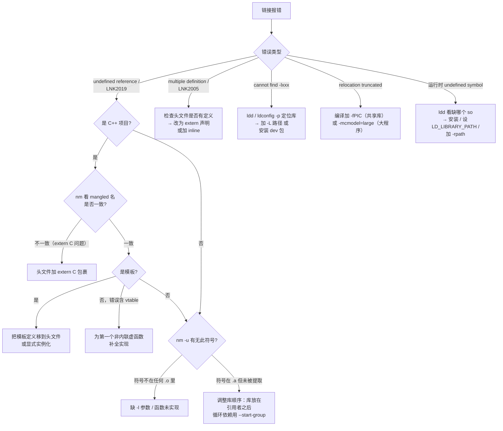

# 链接器详解（13）· 链接错误排查

> [!abstract] TL;DR
> - 链接错误只有几类根因：**符号找不到（undefined）**、**符号冲突（multiple definition）**、**库/路径没给链接器看见**、**地址范围放不下（relocation truncated）**。
> - 每条错误信息都包含"错误类型 + 引用方 + 缺失符号"三要素，学会解读就能直接定位根因，不用盲目 Google。
> - 诊断工具链：`nm` 看符号表、`readelf -s` 看动态符号、`-Wl,--trace-symbol=foo` 追踪单个符号全生命周期、`-Wl,--verbose` 看链接器每一步决策。
> - 三平台错误代码映射：GNU ld `undefined reference` ↔ MSVC `LNK2019`；GNU ld `multiple definition` ↔ MSVC `LNK2005`；GNU ld 最终 `cannot link` ↔ MSVC `LNK1120`。

本篇是「链接器详解」第 13 篇，承接 [[12.链接器与C运行时]] 对运行时启动链路的讲解，以**"错误信息 → 根因 → 修法"**为主线，整理实战中最高频的链接错误排查手册。每种错误均给出：错误现象原文、根因分析、最小复现、修法、以及三平台（GNU ld/LLD/MSVC link）的错误信息对照。

---

## 概述与定位

链接期错误通常比编译期错误更难定位，原因有三：

1. **报错位置不在源码行**：链接器操作的是 `.o` 文件（已无行号），错误信息显示的是"目标文件 + 符号名"，不是"源文件第 N 行"。
2. **跨文件依赖**：引用方和定义方可能分散在数十个目标文件与库中，需要"全局视野"才能看清依赖关系。
3. **顺序敏感**：静态库的按需提取语义（见 [[04.静态库]]）导致链接命令中参数顺序错误时，库成员被静默跳过，报错看似"符号不存在"，实为"库没被扫到"。

本篇的组织结构：

```
错误类型
 ├── undefined reference / LNK2019     ← 最常见，根因最多
 ├── multiple definition / LNK2005     ← ODR 违反
 ├── cannot find -lxxx                 ← 库路径缺失
 ├── undefined symbol（运行时）         ← 动态库缺失
 └── relocation truncated to fit       ← 代码模型不匹配
```

---

## 诊断工具速查

在深入每类错误之前，先掌握诊断工具——很多错误看一眼工具输出就能定位。

### `nm`：查目标文件/库的符号表

```bash
# 查 .o 文件里哪些符号未定义（U = undefined）
nm -u foo.o

# 查 .a 里哪个成员定义了某个符号
nm -A libfoo.a | grep 'T my_func'

# 显示解码后的 C++ 符号名（demangle）
nm --demangle foo.o
```

`nm` 输出格式：`地址  类型  名称`。关键类型：`T`（.text 定义）、`U`（未定义引用）、`W`（弱符号定义）、`w`（弱未定义）、`D`（已初始化数据）、`B`（BSS）、`C`（COMMON 暂定义）。

> [!warning] 示例输出为示意
> 本机为 Windows，以下工具输出为 Linux 环境示意，非实跑结果。

```
0000000000000000 T add
                 U printf
0000000000000010 W __cxa_pure_virtual
```

### `readelf -s`：查 ELF 符号表（比 `nm` 更底层）

```bash
# 查静态符号表（.symtab，strip 后消失）
readelf -s foo.o

# 查动态符号表（.dynsym，运行时可见）
readelf -s --wide libfoo.so

# 只看动态符号
readelf --dyn-syms libfoo.so
```

动态库缺失时，`readelf --dyn-syms` 能确认导出符号集，比 `ldd` 更精确。

### `-Wl,--trace-symbol=foo`：追踪单个符号

```bash
gcc main.o -lfoo -Wl,--trace-symbol=add -o prog
```

> [!warning] 示例输出为示意

```
libfoo.a(foo.o): definition of add
main.o: reference to add
```

链接器会打印符号在哪个文件定义、在哪个文件被引用，即使最终链接成功也会输出——可用来验证"链接器确实看见了这个符号"。

### `-Wl,--verbose`：观察链接器全程决策

```bash
gcc main.o -lfoo -Wl,--verbose 2>&1 | less
```

可以看到链接脚本的使用、每个 `.a` 成员的提取情况、`-L` 路径搜索顺序。信息量大，建议配合 `grep` 过滤。

### `c++filt`：手工 demangle C++ 符号

```bash
echo '_ZN3Foo3barEv' | c++filt
# 输出：Foo::bar()
```

MSVC 下用 `undname.exe`：

```cmd
undname ?bar@Foo@@QEAAXXZ
```

---

## 错误一：`undefined reference to 'foo'`

### 错误现象

```
/usr/bin/ld: main.o: in function `main':
main.c:(.text+0x15): undefined reference to `foo'
collect2: error: ld returned 1 exit status
```

MSVC 等价：

```
main.obj : error LNK2019: unresolved external symbol foo referenced in function main
fatal error LNK1120: 1 unresolved externals
```

LLD 输出（格式更紧凑）：

```
ld.lld: error: undefined symbol: foo
>>> referenced by main.c:5 (main.c:(main))
```

### 根因与修法

`undefined reference` 本质是：**链接器扫完所有输入后，符号表里仍有"被引用但无定义"的 UND 条目**。根因可分五类：

---

#### 1-A 符号拼写/签名不一致

最小复现：

```c
// foo.c
void Foo() { }

// main.c
void foo();   // 小写，拼错
int main() { foo(); return 0; }
```

```bash
gcc main.c foo.c -o prog
# → undefined reference to `foo'
```

修法：检查大小写、参数类型是否完全一致（C 链接按精确名字匹配，C++ 还包含类型编码到 mangled name 里）。

诊断：

```bash
nm foo.o | grep -i foo
# 0000000000000000 T Foo   ← 注意大写
```

---

#### 1-B C++ name mangling / 缺 `extern "C"`

C++ 编译器会把函数名编码为 mangled name，包含命名空间、参数类型等信息。当 C++ 代码调用纯 C 编译的函数（或反过来），双方对符号名的预期不一致，就报 `undefined reference`。

最小复现：

```c
// util.c（用 gcc 编译的 C 文件）
int add(int a, int b) { return a + b; }
```

```cpp
// main.cpp（用 g++ 编译）
// 忘记加 extern "C"
int add(int a, int b);
int main() { return add(1, 2); }
```

```bash
gcc -c util.c -o util.o
g++ main.cpp util.o -o prog
# → undefined reference to `add(int, int)'
# （g++ 把 add 编译成 _Z3addii，而 util.o 里是裸的 add）
```

修法：在 C++ 头文件中用 `extern "C"` 声明 C 函数：

```cpp
// util.h
#ifdef __cplusplus
extern "C" {
#endif

int add(int a, int b);

#ifdef __cplusplus
}
#endif
```

反向场景（C 代码调 C++ 函数）同理：C++ 端要在定义处加 `extern "C"`，或提供 C 包装层。

诊断：

```bash
nm util.o | grep add
# 0000000000000000 T add      ← C 风格，无 mangle

nm main.o | grep add
# U _Z3addii                  ← C++ mangle 后的名字
```

```bash
nm main.o | c++filt | grep add
# U add(int, int)
```

---

#### 1-C 库顺序错误（最高频陷阱）

链接器从左到右单遍扫描。**静态库必须放在引用它的目标文件之后**，否则扫到库时未决符号集为空，库成员被跳过，最终报 `undefined reference`。详细原理见 [[04.静态库]]。

最小复现：

```bash
# 错误顺序：库在目标文件之前
gcc -lm main.o -o prog
# → undefined reference to `sqrt'

# 正确顺序：库在目标文件之后
gcc main.o -lm -o prog
```

修法：

1. 调整顺序：所有 `-l` 放在目标 `.o` 之后。
2. 循环依赖时用 `--start-group`/`--end-group`：

```bash
gcc main.o -Wl,--start-group -lfoo -lbar -Wl,--end-group -o prog
```

CMake 中：

```cmake
target_link_libraries(myapp PRIVATE foo bar)
# CMake 自动处理顺序；若有循环依赖可重复列出：
target_link_libraries(myapp PRIVATE foo bar foo)
```

---

#### 1-D 缺少 `-l` 参数（库根本没告诉链接器）

最小复现：

```c
#include <math.h>
int main() { double x = sqrt(2.0); return 0; }
```

```bash
gcc main.c -o prog
# → undefined reference to `sqrt'
# 原因：math 库需要显式 -lm（glibc 历史原因，部分发行版已将 libm 合并入 libc）
```

修法：加上 `-lm`：

```bash
gcc main.c -lm -o prog
```

常见需要显式链接的库：`-lm`（数学）、`-lpthread`（线程）、`-ldl`（dlopen/dlsym）、`-lrt`（realtime，较旧内核）、`-lstdc++`（C++ runtime，用 gcc 而非 g++ 链接 C++ 程序时需要）。

---

#### 1-E 模板实例化缺失（C++ 特有）

C++ 函数模板/类模板只有在**实例化点**才生成目标代码。若模板定义在 `.cpp` 文件（而非头文件），调用方 `.o` 里只有声明没有实例化，链接时找不到定义。

最小复现：

```cpp
// tmpl.h
template<typename T>
T max_val(T a, T b);   // 只有声明

// tmpl.cpp
#include "tmpl.h"
template<typename T>
T max_val(T a, T b) { return a > b ? a : b; }
// 问题：定义在 .cpp 里，编译此文件时不知道谁会用 int/double 版本
// 所以生成的 tmpl.o 里没有任何实例化

// main.cpp
#include "tmpl.h"
int main() { return max_val(1, 2); }
// main.o 里有对 _Z7max_valIiET_S0_S0_ 的引用，但 tmpl.o 里没有定义
```

```bash
g++ main.cpp tmpl.cpp -o prog
# → undefined reference to `int max_val<int>(int, int)'
```

修法（三选一）：

1. **把模板定义放到头文件**（最常用，C++ 标准库全部如此）：

```cpp
// tmpl.h
template<typename T>
T max_val(T a, T b) { return a > b ? a : b; }
```

2. **显式实例化**（若要把实现藏在 `.cpp` 里，但只支持已知的 T 集合）：

```cpp
// tmpl.cpp 末尾
template int max_val<int>(int, int);
template double max_val<double>(double, double);
```

3. **`extern template` + 显式实例化**（大型项目减少重复实例化开销）：

```cpp
// 头文件里声明外部实例化，告诉编译器"别在本 TU 实例化"
extern template int max_val<int>(int, int);
```

---

#### 1-F vtable 未定义（`undefined reference to 'vtable for Foo'`）

C++ 多态类的 vtable 由编译器生成，但它放在**定义了类的第一个非内联虚函数**的那个 `.o` 文件里。如果这个函数只有声明没有定义，整个 vtable 都不存在。

最小复现：

```cpp
// foo.h
class Foo {
public:
    virtual ~Foo();
    virtual void bar();
};

// foo.cpp —— 忘了实现 bar()
Foo::~Foo() {}   // 只实现了析构，bar() 没有定义

// main.cpp
#include "foo.h"
int main() { Foo* p = new Foo(); delete p; }
```

```bash
g++ main.cpp foo.cpp -o prog
# → undefined reference to `vtable for Foo'
# → undefined reference to `typeinfo for Foo'
```

> [!warning]
> 错误信息说的是 `vtable for Foo`，而真正缺的是 `Foo::bar()` 的实现。这是 C++ 编译器的"设计决定"：vtable 生成规则是"放到第一个非内联虚函数定义所在的 TU"，哪个虚函数缺了定义，链接器就看不到那个 TU 的 vtable。

修法：为所有纯虚函数提供实现（即使函数体为空），或把没有实现的虚函数声明为纯虚（`= 0`）：

```cpp
// 方案一：给 bar() 一个实现
void Foo::bar() {}

// 方案二：声明为纯虚（前提：Foo 可以成为抽象类）
virtual void bar() = 0;
```

---

## 错误二：`multiple definition of 'foo'`

### 错误现象

```
/usr/bin/ld: foo.o: in function `global_init':
(.text+0x0): multiple definition of `init_count';
/usr/bin/ld: bar.o:(.text+0x0): first defined here
collect2: error: ld returned 1 exit status
```

MSVC 等价：

```
foo.obj : error LNK2005: init_count already defined in bar.obj
fatal error LNK1120: 1 unresolved externals
```

### 根因与修法

---

#### 2-A 头文件里有函数/变量定义（最常见）

最小复现：

```c
// config.h
int g_timeout = 30;   // ← 错误：定义而非声明

// a.c
#include "config.h"
// a.o 里有 g_timeout 定义

// b.c
#include "config.h"
// b.o 里也有 g_timeout 定义
// → multiple definition
```

修法：头文件只放**声明**，定义放到一个 `.c`/`.cpp` 文件：

```c
// config.h
extern int g_timeout;   // 声明

// config.c
int g_timeout = 30;     // 唯一定义
```

C++17 引入了 `inline` 变量，可以在头文件中定义而不违反 ODR：

```cpp
// C++17 及以上
inline int g_timeout = 30;   // 多个 TU 包含，链接器自动折叠为一份
```

---

#### 2-B ODR 违反（One Definition Rule）

C++ ODR 要求：同一符号在整个程序中**最多只有一个定义**（`inline`/模板实例化/COMDAT 除外）。常见陷阱：

```cpp
// utils.h（被多个 .cpp 包含）
struct Config { int x; };   // class/struct 定义可以多处包含（每个 TU 一份），这本身是合法的
void helper() { }           // 非 inline 函数定义放在头文件 → 每个包含的 TU 都有一份定义 → ODR 违反
```

修法：非 inline 函数定义不能放在头文件；若需要放，必须加 `inline`：

```cpp
inline void helper() { }  // 合法：inline 函数的多重定义由链接器折叠（COMDAT）
```

---

#### 2-C `-fcommon` 与 COMMON 暂定义的历史行为

较旧的 GCC 版本（和 C89 时代）对未初始化全局变量使用 COMMON 暂定义（`.symtab` 里类型 `C`），多个 `.o` 里的同名 COMMON 符号会被链接器**静默合并**为一个，而不是报错。GCC 10 起默认改为 `-fno-common`，同名未初始化全局变量报 `multiple definition`。

```bash
# 恢复旧行为（临时兼容老代码）
gcc -fcommon main.c foo.c -o prog
```

> [!warning]
> `-fcommon` 是兼容旧代码的应急手段，不要新代码用它。正确做法是把定义集中到一个文件，其余用 `extern` 声明。

---

## 错误三：`cannot find -lxxx`

### 错误现象

```
/usr/bin/ld: cannot find -lfoo: No such file or directory
```

LLD：

```
ld.lld: error: unable to find library -lfoo
```

MSVC 等价：

```
LINK : fatal error LNK1181: cannot open input file 'foo.lib'
```

### 根因与修法

链接器按 `-L` 指定的路径列表（加上系统默认路径 `/usr/lib`、`/usr/local/lib` 等）搜索 `libfoo.so` 或 `libfoo.a`，找不到就报此错。

常见原因：

| 原因 | 解决 |
|---|---|
| 库未安装 | `apt install libfoo-dev` / `yum install libfoo-devel` 等 |
| 安装到了非默认路径 | `-L/path/to/lib` 或 `PKG_CONFIG_PATH` |
| 库名大小写错误 | Linux 区分大小写：`libPNG.a` ≠ `libpng.a` |
| 只有 `-lbar`，但库叫 `libbar.so.2`（只有版本化 so，无裸符号链接） | `ldconfig` 更新缓存，或 `ln -s libbar.so.2 libbar.so` |

```bash
# 查找库文件实际位置
ldconfig -p | grep libfoo

# 查 pkg-config 给出的路径和标志
pkg-config --libs --cflags libfoo

# 手动指定搜索路径
gcc main.o -L/opt/mylib/lib -lfoo -o prog
```

CMake 中：

```cmake
find_library(FOO_LIB foo PATHS /opt/mylib/lib)
target_link_libraries(myapp PRIVATE ${FOO_LIB})
```

---

## 错误四：运行时 `undefined symbol`（动态库缺失/版本不匹配）

### 错误现象

程序能链接，但运行时报：

```
./prog: error while loading shared libraries: libfoo.so.1: cannot open shared object file: No such file or directory
```

或：

```
./prog: symbol lookup error: ./prog: undefined symbol: foo_init
```

### 根因与修法

动态库在**链接时**存在（提供了符号声明），但在**运行时**找不到或版本不对。动态链接器（`ld.so`）在运行时按以下顺序搜索 `.so`：

1. `DT_RPATH`（嵌入在 ELF 中，已逐渐废弃）
2. `LD_LIBRARY_PATH` 环境变量
3. `DT_RUNPATH`（嵌入在 ELF 中，推荐方式）
4. `/etc/ld.so.cache`（由 `ldconfig` 维护）
5. `/lib`、`/usr/lib` 等系统默认路径

诊断：

```bash
# 查看程序运行时需要哪些动态库，哪些找不到
ldd ./prog

# 调试加载过程（打印每步搜索）
LD_DEBUG=libs ./prog 2>&1 | head -50
```

> [!warning] 示例输出为示意

```
ldd 输出示意：
        linux-vdso.so.1 (0x00007ffd2e3a0000)
        libfoo.so.1 => not found              ← 找不到
        libc.so.6 => /lib/x86_64-linux-gnu/libc.so.6 (0x00007f...)
```

修法：

```bash
# 方案一：安装到系统路径后更新缓存
sudo cp libfoo.so.1 /usr/local/lib/
sudo ldconfig

# 方案二：临时设置 LD_LIBRARY_PATH（不适合生产）
export LD_LIBRARY_PATH=/opt/mylib/lib:$LD_LIBRARY_PATH
./prog

# 方案三：链接时用 -rpath 把搜索路径烧进 ELF（推荐用于打包分发）
gcc main.o -L/opt/mylib/lib -lfoo -Wl,-rpath,/opt/mylib/lib -o prog

# 查看已烧进的 rpath
readelf -d prog | grep RUNPATH
```

**版本不匹配**（`SONAME` 对不上）：

```bash
# 链接时找到的是 libfoo.so.1，但系统安装的是 libfoo.so.2
objdump -p prog | grep NEEDED
# NEEDED libfoo.so.1
ls /usr/lib/libfoo*
# /usr/lib/libfoo.so.2   ← 版本不一致
```

修法：安装正确版本，或重新链接到可用版本，或用 `ln -s` 创建兼容符号链接（慎用，ABI 兼容性需自行确认）。

---

## 错误五：重定位放不下 / 不可用（`truncated to fit` 与 PC32 against shared object）

### 错误现象

```
/usr/bin/ld: foo.o: relocation R_X86_64_PC32 against symbol `large_array' can not be used when making a shared object; recompile with -fPIC
```

或：

```
/usr/bin/ld: foo.o: relocation R_X86_64_32 against `.data' out of range: 2305843009213693952 is not in [0, 4294967296]
relocation truncated to fit: R_X86_64_32 against `.data'
```

### 根因与修法

重定位类型对**偏移量的宽度有限制**：`R_X86_64_32` 只能表示 32 位偏移（±2GB 或 0–4GB），若符号地址超出该范围（大型可执行/共享库加载地址很高），就无法填入。详细重定位类型计算见 [[06.链接期重定位]]。

两种常见场景：

**场景 A：代码模型不匹配**

x86-64 默认使用 `small` 代码模型（假设代码和数据都在前 2GB），但程序特别大或映射到高地址时需改用 `medium`/`large`：

```bash
# 指定代码模型（编译时）
gcc -mcmodel=large -c foo.c -o foo.o
gcc -mcmodel=large main.o foo.o -o prog
```

**场景 B：位置无关代码（共享库必须 -fPIC）**

共享库加载地址不确定，任何绝对地址引用都必须经由 GOT 间接（见 [[11.ELF文件详解/17.got节.md]]），用 `R_X86_64_PC32` 直接引用外部符号不允许：

```bash
# 修法：编译共享库时加 -fPIC
gcc -fPIC -c foo.c -o foo.o
gcc -shared foo.o -o libfoo.so
```

---

## 决策树：遇到链接错误怎么排查



---

## 三平台错误信息对照

| 错误类型 | GNU ld | LLD | MSVC link |
|---|---|---|---|
| 符号未定义 | `undefined reference to 'foo'` | `undefined symbol: foo` | `LNK2019: unresolved external symbol` |
| 最终链接失败（因未决符号） | `ld returned 1 exit status` | （同上，无独立编号） | `LNK1120: N unresolved externals` |
| 多重定义 | `multiple definition of 'foo'` | `duplicate symbol: foo` | `LNK2005: foo already defined in bar.obj` |
| 找不到库 | `cannot find -lfoo` | `unable to find library -lfoo` | `LNK1181: cannot open input file 'foo.lib'` |
| 重定位越界 | `relocation truncated to fit` | `relocation R_X86_64_32 out of range` | （PE 无精确等价；超大映像见 `/LARGEADDRESSAWARE`） |
| 运行时库缺失（动态） | `cannot open shared object file` | 同 GNU | `The specified module could not be found` （依赖 DLL 缺失） |

**MSVC 特有点**：

- `LNK2019` 包含符号的完整修饰名（decorated name），可用 `undname.exe` 解码。
- `LNK2005` 对应 COMDAT folding：`/OPT:ICF` 可强制合并相同函数体，但多重定义通常是源代码问题，不能靠链接器选项掩盖。
- Windows 动态库（`.dll`）缺失在运行时由 OS 加载器报 `0xc0000135`（`STATUS_DLL_NOT_FOUND`）或弹出系统对话框，而非进程 stderr。

**macOS ld64 特有点**：

```
Undefined symbols for architecture x86_64:
  "_foo", referenced from:
      _main in main.o
ld: symbol(s) not found for architecture x86_64
```

macOS 链接器要求符号名前加下划线（C ABI 规范）；跨架构（arm64/x86_64 Universal Binary）时还会出现"符号存在但架构不匹配"的情况，需用 `lipo -info` 查库支持的架构。

---

## 三平台诊断工具对照

| 功能 | Linux | macOS | Windows |
|---|---|---|---|
| 查符号表 | `nm` / `readelf -s` | `nm` / `otool -l` | `dumpbin /SYMBOLS foo.obj` |
| 查动态依赖 | `ldd` | `otool -L` | `dumpbin /DEPENDENTS foo.exe` |
| demangle | `c++filt` | `c++filt` / `xcrun swift-demangle` | `undname.exe` |
| 追踪符号 | `-Wl,--trace-symbol=foo` | `-Wl,-why_load` | `/VERBOSE:LIB` |
| 详细链接日志 | `-Wl,--verbose` | `-Wl,-v` | `/VERBOSE` |
| 查库内符号 | `nm -A libfoo.a` | `nm -A libfoo.a` | `dumpbin /LINKERMEMBER libfoo.lib` |

---

## 实战：一次完整排查示例

**场景**：`main.cpp` 调用 `libcrypto` 里的 `EVP_MD_CTX_new`，链接报 `undefined reference`。

**第一步**：确认库是否安装、在哪里：

```bash
ldconfig -p | grep libcrypto
# libcrypto.so.3 (libc6,x86-64) => /usr/lib/x86_64-linux-gnu/libcrypto.so.3
# 有，但没有裸 libcrypto.so（只有版本化 so）？
ls /usr/lib/x86_64-linux-gnu/libcrypto.so
# ls: cannot access '...libcrypto.so': No such file or directory
# → 缺 dev 包（libssl-dev / openssl-devel）
```

```bash
sudo apt install libssl-dev
# 安装后有了 libcrypto.so -> libcrypto.so.3 的符号链接
```

**第二步**：确认链接命令包含 `-lcrypto` 并在 `.o` 之后：

```bash
gcc main.o -lcrypto -o prog   # 顺序正确
```

**第三步**：确认符号名（排查 C/C++ 混编问题）：

```bash
nm -u main.o | grep EVP
# U EVP_MD_CTX_new    ← C 风格，说明已加了 extern "C" 或用的是 C 头文件

nm libcrypto.so | grep EVP_MD_CTX_new
# 000000000007f2a0 T EVP_MD_CTX_new    ← 定义存在
```

**第四步**：链接成功后验证运行时依赖：

```bash
ldd prog | grep crypto
# libcrypto.so.3 => /usr/lib/x86_64-linux-gnu/libcrypto.so.3
```

---

## 小结

| 错误 | 最常见根因 | 一行诊断 |
|---|---|---|
| `undefined reference` | 库顺序错 / 缺 `-l` / extern C 漏加 | `nm -u *.o` 看哪个 UND 没被满足 |
| `multiple definition` | 头文件里有定义 / ODR 违反 | `nm -A *.o \| grep ' T foo'` 看多个 T |
| `cannot find -lxxx` | 库未装 / 路径未给 | `ldconfig -p \| grep libfoo` |
| 运行时 `undefined symbol` | 动态库路径未配置 / SONAME 版本不对 | `ldd ./prog` 看 `not found` |
| `relocation truncated` | 共享库漏 `-fPIC` / 代码模型选小了 | 报错里的重定位类型名就是线索 |
| vtable undefined | 第一个非内联虚函数未实现 | 找到缺实现的虚函数名，加定义 |
| 模板 undefined reference | 模板定义藏在 `.cpp` 里 | 把定义移到头文件 |

链接错误的本质是**符号集合的集合论问题**：引用集合与定义集合的差集非空就报错，重复元素报冲突。所有排查思路归根结底是：**找到引用的符号名和实际定义的符号名，确认它们完全一致，且双方都在链接器的视野里，且顺序正确**。

---

## 相关阅读

- **符号与解析算法基础**：[[03.符号与符号解析]]
- **静态库按需提取与链接顺序**：[[04.静态库]]
- **链接期重定位类型详解**：[[06.链接期重定位]]
- **C 运行时与启动链路**：[[12.链接器与C运行时]]
- **三平台链接器能力横评**：[[14.三平台链接器对比]]
- **运行时符号查找（动态链接视角）**：[[14.动态链接与加载器详解/06.符号解析与符号查找.md]]
- **GOT 与位置无关代码**：[[11.ELF文件详解/17.got节.md]]
- **重定位机制（加载期）**：[[14.动态链接与加载器详解/07.重定位机制详解.md]]
- **编译器工具链参考**：[[41.Compiler/00.编译器完整参考 - 总索引.md]]
- **CMake 链接目标配置**：[[42.Cmake/00 - CMake 完整技术教程 - 总索引.md]]

---

⬅️ 上一篇 [[12.链接器与C运行时]] ｜ 🏠 [[00.链接器详解总览]] ｜ 下一篇 [[14.三平台链接器对比]] ➡️
