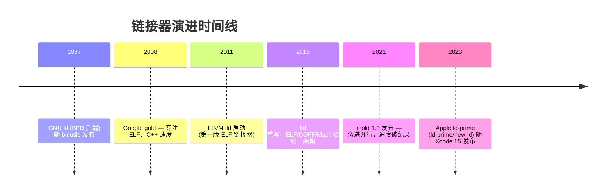
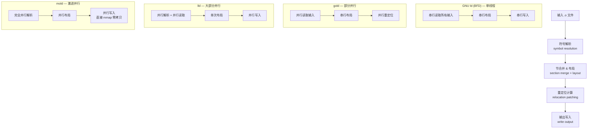
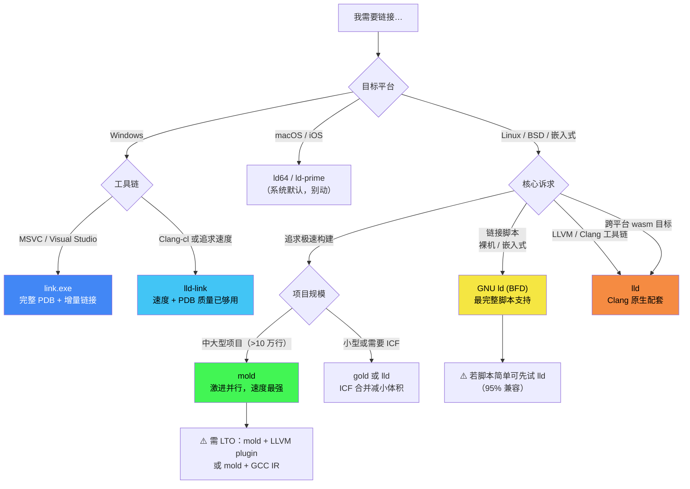
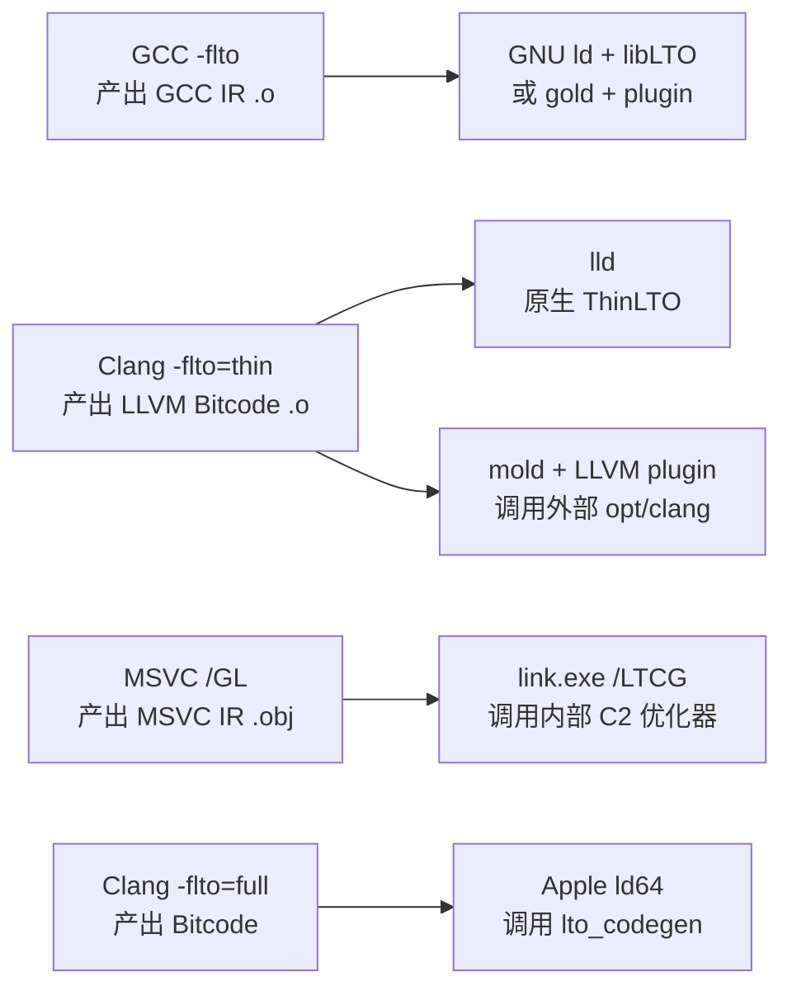

# 链接器详解（14）· 三平台链接器对比

> [!abstract] TL;DR
> - 主流链接器共六款：GNU `ld`(BFD)、`gold`、LLVM `lld`、`mold`、MSVC `link.exe`、Apple `ld64`（及新版 `ld-prime`）。
> - 速度梯队（从慢到快）：GNU ld(BFD) < gold ≈ MSVC link.exe < LLD < mold（mold 在大型项目可比 ld 快 10–40×）。
> - 嵌入式 / 裸机必须用 GNU ld（最完整的链接脚本支持）；追求 Linux 极速构建首选 mold；跨平台工具链（Clang/LLVM）首选 lld；Windows 生态用 link.exe 或 lld-link；macOS 系统链接器是 ld64，Xcode 15+ 已切换到 ld-prime（内部称 `new ld`）。
> - 切换方式统一：GCC/Clang 侧传 `-fuse-ld=gold|lld|mold`，CMake 侧加 `-DCMAKE_EXE_LINKER_FLAGS="-fuse-ld=mold"`。
> - 本篇是系列**收官篇**，把前13篇提到的所有链接器行为差异汇总到同一张横评表，给出"你的项目该用谁"的决策树。

本系列从 [[01.链接器是什么]] 起，逐步拆解了符号解析、重定位、链接脚本、LTO、增量链接等机制。每一篇都会提到"这个特性在 GNU ld / lld / link.exe 下行为不同"——本篇把所有差异摊开，放在同一张对比表里，给出实战选型建议。

---

## 概述与定位

### 六款链接器的历史脉络



六款链接器各有各的"诞生使命"：

| 链接器 | 诞生背景 | 核心诉求 |
|--------|----------|----------|
| GNU ld (BFD) | GNU 工具链基石，1987 年 | 支持所有目标格式，嵌入式/裸机必备 |
| gold | Google 内部 C++ 大型项目 | 比 BFD ld 更快，专注 ELF |
| LLVM lld | Clang/LLVM 配套链接器 | 跨平台统一实现，可作库调用 |
| mold | 现代多核 CPU 极速链接 | 几乎线性扩展到全部 CPU 核 |
| MSVC link.exe | Windows 原生工具链 | PE/COFF、PDB 调试信息、MSVC ABI |
| Apple ld64 | macOS/iOS 系统链接器 | Mach-O、代码签名、fat binary |

---

## 原理与机制

### 并行模型差异

链接器的核心流水线（符号解析 → 重定位计算 → 节布局 → 输出写入）里，哪些阶段可以并行，决定了链接器的速度上限。



> [!info] mold 的关键创新
> mold 几乎消灭了串行瓶颈：符号解析阶段先并行扫描所有输入的符号表（只读），再用一把全局锁合并结果；写入阶段直接 `mmap` 输出文件后各线程并行填充，避免了 write 系统调用的串行化。具体机制见 [[11.增量与并行链接]]。

---

## 六大链接器横评表

### 综合对比

| 维度 | GNU ld (BFD) | gold | LLVM lld | mold | MSVC link.exe | Apple ld64 |
|------|-------------|------|----------|------|---------------|-----------|
| **输出格式** | ELF/PE/COFF/Mach-O/wasm/a.out + 30余种 | ELF 专用 | ELF + COFF + Mach-O + wasm | ELF（Linux/FreeBSD 等）；PE/COFF（部分版本实验性） | PE/COFF 专用 | Mach-O 专用 |
| **目标平台** | Linux/BSD/Embedded/macOS(旧)/Windows(MinGW) | Linux/BSD | Linux/BSD/Windows/macOS/WASM | Linux/BSD/FreeBSD（**不含 macOS**，macOS 由派生项目 `sold` 支持） | Windows | macOS/iOS/tvOS/watchOS |
| **速度（相对 GNU ld）** | 1× 基准 | 2–4× | 3–8× | 5–40×（大项目） | — | — |
| **并行链接** | 无 | 部分 | 大部分 | 激进（全阶段） | 部分 | 部分 |
| **增量链接** | 无 | 实验性（已废弃） | 无（内置增量替代：ThinLTO 缓存） | 无 | 完整（`.ilk` 文件） | 部分（`-object_path_lto`） |
| **LTO 支持** | GCC IR LTO（`-flto`）；可通过插件接 LLVM IR | GCC IR + LLVM IR 插件 | LLVM ThinLTO / FullLTO（一流支持） | 依赖外部 LTO 插件（LLVM） | LTCG（link-time code gen） | Apple LTO（基于 LLVM） |
| **链接脚本** | 完整（`.ld` / `T` 选项），嵌入式必用 | 大部分兼容 GNU ld 脚本 | 基本兼容（覆盖 >95% 常见用法） | 基本兼容 | 不适用（用 `.def`/`/SECTION` 代替） | 不适用（用 `-sectcreate` 等代替） |
| **调试信息** | DWARF | DWARF | DWARF | DWARF | PDB（专有格式）；可输出 DWARF（MinGW） | DWARF + dSYM bundle |
| **代码签名** | 无 | 无 | 无（lld-link 不签） | 无 | Authenticode（可选） | 强制（Apple codesign 集成） |
| **Plugin 接口** | LDPL（`--plugin`）| LDPL | 通用 LTO 插件（`-plugin`） | 有限（LLVM plugin） | 无标准 plugin | 无 |
| **独有特性** | 最全链接脚本；`-Map`；`--gc-sections`；bare metal | `--icf` ICF 合并；`--gdb-index` | `--lto-*` ThinLTO；wasm；`-flavor` 多格式 | 极速；`--archive-use-response-file`；`--perf` | `/LTCG`；`/INCREMENTAL`；`/PDB`；`/WHOLEARCHIVE` | `dyld_shared_cache`；`-bitcode_bundle`；fat binary |
| **成熟度** | 非常成熟，生产默认 | 成熟，已被 lld 部分取代 | 成熟，Clang 默认 | 快速迭代，已生产可用 | 非常成熟，Windows 唯一官方 | 非常成熟，Apple 平台唯一官方 |
| **默认场景** | 大多数 Linux 发行版默认 `ld` | 可选替代，`-fuse-ld=gold` | Clang 套件；Android NDK；LLVM 自举 | 需显式指定 `-fuse-ld=mold` | Visual Studio / MSBuild 默认 | Xcode 默认（Xcode 15+ 已换 ld-prime） |

### 目标格式支持矩阵

| 链接器 | ELF | PE/COFF | Mach-O | wasm | a.out(旧) |
|--------|-----|---------|--------|------|-----------|
| GNU ld (BFD) | ✅ | ✅ (MinGW) | ✅ (旧版) | ✅ | ✅ |
| gold | ✅ | ❌ | ❌ | ❌ | ❌ |
| LLVM lld | ✅ | ✅ (lld-link) | ✅ (ld64.lld) | ✅ | ❌ |
| mold | ✅ | ❌ | ❌ | ❌ | ❌ |
| MSVC link.exe | ❌ | ✅ | ❌ | ❌ | ❌ |
| Apple ld64 | ❌ | ❌ | ✅ | ❌ | ❌ |

> [!warning] 示例输出为示意
> 以上覆盖情况基于各项目官方文档与 2025 年前后的发布状态。`mold` 本体仅支持 ELF（PE/COFF 视版本为实验性），**不产 Mach-O、不支持 macOS**；macOS 目标由上游独立派生项目 [`sold`](https://github.com/bluewhalesystems/sold)（2024 年起开源）承载，与 mold 分开维护。

---

## 三平台链接行为对比

### Linux：ELF 生态，链接器百花齐放

Linux 下可以自由切换六款链接器（ld64 除外）。选择通常从两个维度出发：速度还是兼容性。

**符号可见性默认行为差异**（见 [[09.符号可见性与版本]]）：

| 行为 | GNU ld | lld | mold |
|------|--------|-----|------|
| 未定义符号（非共享库） | 报错 | 报错 | 报错 |
| 未定义弱符号 | 允许（值为 0） | 允许 | 允许 |
| `--allow-shlib-undefined` 默认 | 关闭 | **开启**（lld 差异！） | 关闭 |
| `--warn-common` | 有 | 有 | 有 |
| COPY 重定位行为 | 按 ABI | 按 ABI | 按 ABI |

> [!warning] lld 的 `--allow-shlib-undefined` 默认开
> 从 GNU ld 迁移到 lld 时，最常见的"链接通过但运行报符号找不到"问题就来自此处。lld 默认对共享库中的未定义符号不报错，相当于假设"运行时一定能找到"。如需严格检查，需显式加 `--no-allow-shlib-undefined`。这个差异在 [[13.链接错误排查]] 中有详细排查步骤。

**链接脚本支持度（Linux 嵌入式关键维度）**：

GNU ld 拥有最完整的链接脚本支持，包括 `MEMORY`、`OVERLAY`、`REGION_ALIAS`、`ASSERT`、`PROVIDE_HIDDEN` 等高级指令。lld 覆盖了超过 95% 的常用指令，但以下场景仍建议坚守 GNU ld（见 [[07.链接脚本]]）：

- 使用 `OVERLAY` 段覆盖（MCU Flash/RAM 复用）
- 依赖 `OUTPUT_ARCH` 控制输出 MACHINE 字段
- 复杂的 `FILL`/`=fillexp` 区段填充

### Windows：PE/COFF，link.exe 与 lld-link 并立

Windows 链接期行为与 ELF 世界有本质差异（参见 [[02.目标文件详解]] COFF 节内容）。

| 特性 | MSVC link.exe | lld-link | MinGW ld(BFD) |
|------|---------------|----------|---------------|
| 调试信息格式 | PDB（完整） | PDB（大部分） | DWARF（不兼容 WinDbg/VS） |
| 增量链接 `/INCREMENTAL` | 完整 `.ilk` | 不支持 | 不支持 |
| `/LTCG` 链接时代码生成 | 完整 MSVC IR | LLVM IR（`-lto=thin`） | GCC IR |
| `/WHOLEARCHIVE` | 有 | 有（`--whole-archive`） | 有 |
| `/MANIFEST` 嵌入清单 | 有 | 有 | 有限 |
| 导出表（`.def` 文件） | 完整支持 | 完整支持 | 支持 |
| 延迟加载 DLL `/DELAYLOAD` | 完整 | 支持 | 有限 |
| ARM64/ARM64EC | 完整 | 完整 | 有限 |

> [!info] lld-link 的生产实践
> Chromium/Firefox/LLVM 等大型项目在 Windows 上已全面切换到 `lld-link`，链接时间可缩短 20–50%。PDB 生成质量在 LLVM 15+ 后已足够满足 Visual Studio / WinDbg 调试需求。切换方式：Clang-cl 传 `/link /fuse-ld=lld` 或 CMake 设 `CMAKE_LINKER`。

### macOS：Mach-O，ld64 与 ld-prime

Apple 平台链接器不可替换（Clang driver 在 macOS 会强制调用系统 `ld`），只能通过 `-fuse-ld=lld` 切到 `ld64.lld`（兼容性有限，生产不推荐）。

| 特性 | ld64（传统） | ld-prime（Xcode 15+） |
|------|------------|----------------------|
| 速度 | 基准 | 2–3×（激进并行） |
| Chained Fixups | 部分支持 | 完整，默认启用 |
| 惰性绑定（lazy binding） | 支持（旧版默认） | 基本退场（chained fixups 取代） |
| `__TEXT/__DATA` 分离 | 支持 | 支持（更严格权限检查） |
| Swift ABI | 支持 | 增强（dead-stripping 更激进） |
| 调试信息 | dSYM bundle + DWARF | dSYM bundle + DWARF |
| Fat binary / Universal | 支持 | 支持（lipo 集成） |
| 代码签名 | 需 codesign | 集成更紧密 |

> [!info] Chained Fixups 与 lazy binding 的关系
> macOS 12+ / iOS 15+ 引入的 **chained fixups** 在构建时就把重定位信息编码为"链"，`dyld` 在加载时一次性遍历整个链完成绑定，无需 `__la_symbol_ptr` 式的逐符号延迟调用。这与 Linux `.got.plt` 的 lazy binding（见 [[14.动态链接与加载器详解/08.PLT与GOT与延迟绑定.md]]）是截然不同的设计取向——Apple 选择了"更快的启动"而非"更短的第一次调用延迟"。

### ARM64/AArch64 平台链接补强

ARM64（AArch64）已成为服务器（AWS Graviton）、移动（Android/iOS）、桌面（Apple Silicon）的主流架构。其重定位类型与 x86-64 差异显著，链接器在 AArch64 上有特有行为。

#### 常见 R_AARCH64_* 重定位类型

AArch64 ELF 重定位类型（定义于 AArch64 ELF ABI 规范 §4.6）按用途分为以下几类：

**绝对地址类**：

| 重定位类型 | 计算公式 | 典型用途 |
|---|---|---|
| `R_AARCH64_ABS64` | `S + A` | 64 位绝对地址引用（数据节中的函数指针、全局变量地址） |
| `R_AARCH64_ABS32` | `S + A`（截断到 32 位） | 32 位绝对地址（嵌入式或特殊数据结构） |
| `R_AARCH64_PREL32` | `S + A - P` | 32 位 PC 相对偏移（`.eh_frame` 中的 FDE 引用） |

**直接跳转类**：

| 重定位类型 | 指令 | 范围 | 说明 |
|---|---|---|---|
| `R_AARCH64_CALL26` | `BL` / `BLR` | ±128 MiB | 函数调用跳转；超出范围需链接器插入 **veneer（跳板）** |
| `R_AARCH64_JUMP26` | `B` | ±128 MiB | 无条件跳转；同样需 veneer 处理超距 |
| `R_AARCH64_CONDBR19` | `B.cond` | ±1 MiB | 条件跳转；范围小，更易触发跳板需求 |

> **Veneer（跳板）机制**：AArch64 `BL` 指令仅 26 位偏移，最大跳转距离 ±128 MiB。大型二进制中库间调用可能超出此范围，链接器（lld/GNU ld）会自动在两个节之间插入一段 `veneer`（等价于 x86 的 PLT thunk），内容为：
> ```asm
> veneer_for_foo:
>     adrp  x16, foo@PAGE
>     add   x16, x16, foo@PAGEOFF
>     br    x16          ; 间接跳转，不受 26 位限制
> ```

**页面相对寻址（ADRP + ADD/LDR 对）**：

AArch64 访问静态数据/GOT 条目的标准模式是"4KB 页基址 + 页内偏移"两条指令拆分寻址：

```asm
# 访问全局变量 g_val（PIC/PIE 位置无关代码）
adrp  x0, g_val           ; 加载 g_val 所在 4KB 页基址到 x0（页粒度）
add   x0, x0, :lo12:g_val ; 加上页内 12 位偏移（低 12 位）
ldr   w1, [x0]            ; 最终读取 g_val
```

对应两条重定位：

| 重定位类型 | 作用于 | 计算 |
|---|---|---|
| `R_AARCH64_ADR_PREL_PG_HI21` | `ADRP` 指令的 21 位立即数 | `(Page(S+A) - Page(P)) >> 12`，即页号差 |
| `R_AARCH64_ADD_ABS_LO12_NC` | `ADD` 指令的 12 位立即数 | `(S + A) & 0xFFF`（页内偏移，NC=No Check 不检查溢出） |

**GOT 间接寻址**（位置无关代码访问外部符号时）：

```asm
# 通过 GOT 访问外部符号 ext_func
adrp  x0, :got:ext_func           ; 加载 GOT 条目所在页
ldr   x0, [x0, :got_lo12:ext_func]; 从 GOT 中加载实际地址
blr   x0                          ; 间接调用
```

| 重定位类型 | 对应指令操作数 |
|---|---|
| `R_AARCH64_ADR_GOT_PAGE` | `ADRP` 的 21 位，`GOT[S]` 的页偏移 |
| `R_AARCH64_LD64_GOT_LO12_NC` | `LDR` 的 12 位，`GOT[S]` 的页内偏移 |

**TLS（线程局部存储）重定位**：

AArch64 TLS 有三种模型，`TLSDESC`（TLS Descriptor）是 Linux AArch64 的首选（比传统 `GD`/`IE` 模式调用开销更小）：

| 重定位类型 | TLS 模型 | 说明 |
|---|---|---|
| `R_AARCH64_TLSDESC_ADR_PAGE21` | TLSDESC | ADRP 加载 TLS 描述符所在页 |
| `R_AARCH64_TLSDESC_LD64_LO12` | TLSDESC | LDR 加载描述符内容（函数指针 + 偏移） |
| `R_AARCH64_TLSDESC_ADD_LO12` | TLSDESC | ADD 加页内偏移 |
| `R_AARCH64_TLSDESC_CALL` | TLSDESC | `BLR x0` 调用描述符函数（链接器可优化为 NOP） |
| `R_AARCH64_TLS_TPREL64` | LE（本地执行） | 静态可执行文件的 TLS，直接相对 TP 偏移 |

```bash
# 查看 AArch64 ELF 文件的重定位类型
readelf -r /path/to/arm64.so | grep R_AARCH64 | head -30

# 典型输出示意（实际地址随编译不同）
# 000000000003f2a0  0000001700000101 R_AARCH64_ABS64         0000000000000000 .rodata + 0
# 000000000003f2b8  0000001f0000011b R_AARCH64_RELATIVE      0000000000000000
# 000000000001a440  00000020000005e0 R_AARCH64_CALL26        0000000000000000 printf + 0
```

> [!warning] 示例输出为示意
> `readelf` 命令需在 Linux AArch64 环境或交叉工具链环境下运行；输出内容随具体二进制和编译器版本而异。

#### Apple Silicon（arm64/arm64e）链接差异

Apple Silicon（M 系列芯片）使用 AArch64 的 Apple 定制变体，在链接层面有以下特殊行为：

**1. Mach-O arm64 vs arm64e**

| 特性 | arm64（普通） | arm64e（硬化） |
|---|---|---|
| 目标平台 | macOS 10.14+ / iOS 12+（通用） | macOS 12+ / iOS 15+ + 需 Apple 签名 |
| PAC（指针认证码） | 不使用 | 强制使用（见下文） |
| Chained fixups | 支持（可选） | 默认，且编码方式不同 |
| 系统库链接 | 正常 | 需 arm64e 变体系统库 |
| 第三方签名 | Hardened Runtime 即可 | 需 Apple Developer 授权 |

**2. arm64e 的 Chained Fixups 与 PAC（指针认证码）**

arm64e 是 Apple 在 AArch64 上实现的**指针完整性保护**机制，利用 ARMv8.3-A 的 PAC（Pointer Authentication Codes）指令集扩展：

```
PAC 原理：
  ┌────────────────────────────────────────────────────┐
  │  64 位虚拟地址空间                                   │
  │  [63:56] 用于存储 PAC（认证码，8 位）                │
  │  [55:0]  实际地址位                                  │
  └────────────────────────────────────────────────────┘

  PACIB x17, sp     ; 用 SP 作 context，对 x17 中的地址签名（写入高位 PAC）
  AUTIB x17, sp     ; 验证 x17，若 PAC 不匹配则置为无效地址（触发 SIGSEGV）
  BR    x17         ; 跳转（若 PAC 验证失败则崩溃，而非执行 ROP gadget）
```

在链接层面，arm64e 的 chained fixups 格式在每个需要修补的指针处嵌入"已签名的指针"信息，`dyld` 在加载时用私钥验证并重签：

```
Chained Fixup 链（arm64e 格式）：
  fixup[0] → fixup[1] → fixup[2] → ... → NULL（链式遍历）
  每个节点包含：
    - target：目标地址（rebased 后的值）
    - diversity：PAC diversity（上下文相关的盐值）
    - key：使用 IA/IB/DA/DB 哪把 PAC 密钥
    - next：下一个 fixup 的相对偏移（在同一 4KB 页内）
```

链接器（`ld`/`ld-prime`）在构建 arm64e Mach-O 时：
1. 对所有函数指针类型的重定位改用 `ARM64_RELOC_AUTHENTICATED_POINTER`
2. 生成 `LC_DYLD_CHAINED_FIXUPS` load command，记录 fixup 链的起始位置
3. 不再生成 `__la_symbol_ptr` section（lazy binding 完全被淘汰）

```bash
# 查看 arm64e Mach-O 的 chained fixups 信息
dyldinfo -fixups /System/Library/dyld/dyld_shared_cache_arm64e 2>/dev/null | head -30
# 或
otool -l MyApp.app/MyApp | grep -A5 LC_DYLD_CHAINED_FIXUPS
```

> [!warning] 示例输出为示意
> 以上命令需在 macOS Apple Silicon 机器上运行，且访问系统缓存需相应权限。

**3. Universal Binary（fat binary）中 arm64/arm64e 并存**

```bash
# 构建同时包含 arm64 和 arm64e slice 的 fat binary
lipo -create app_arm64 app_arm64e -output app_universal

# 查看 fat binary 内容
lipo -info app_universal
# 输出示意：Architectures in the fat file: app_universal are: arm64 arm64e
```

链接器不直接产出 fat binary——每个 slice（arm64/arm64e/x86_64）分别链接，再由 `lipo` 合并。Xcode 的构建系统会自动完成这一过程。

---

## 选型建议

### 决策树



### 场景速查表

| 场景 | 推荐链接器 | 关键理由 |
|------|-----------|---------|
| ARM Cortex-M / RISC-V 裸机 | **GNU ld (BFD)** | 链接脚本 `MEMORY`/`OVERLAY` 完整支持；`--gc-sections` 配合 `-ffunction-sections` 精细裁剪 |
| Linux 大型 C++ 项目，追求极速 | **mold** | 核数越多越快；Chromium 级别项目可缩短链接到 1–2s |
| Clang/LLVM 工具链，全平台统一 | **lld** | 与 Clang LTO IR 原生对接；支持 ELF/COFF/Mach-O/wasm |
| Android NDK 开发 | **lld** | NDK r22+ 已默认切换到 lld，gold 已移除 |
| Windows 原生开发（VS） | **link.exe** | PDB 完整；`/INCREMENTAL` 增量链接；LTCG |
| Windows Clang 追速 | **lld-link** | Chromium/LLVM 验证，链接提速 20–50% |
| macOS / iOS App | **ld64 / ld-prime** | 平台强制；代码签名；Universal Binary |
| 减小可执行体积（ICF） | **gold 或 lld** | `--icf=safe`（gold）/ `--icf=all`（lld）合并等价函数；详见 [[10.LTO链接时优化]] |
| 生成 `.map` 链接地图 | **GNU ld** | `-Map=output.map` 最详细；lld 的 `--Map` 也够用 |
| wasm / Emscripten | **lld (wasm-ld)** | lld 内置 wasm 后端，Emscripten 默认使用 |
| 需要 GDB index（调试大型程序） | **gold** | `--gdb-index` 是 gold 独有特性 |

---

## 常用命令对照

### 切换链接器

```bash
# GCC 系
gcc -fuse-ld=gold  main.o -o main
gcc -fuse-ld=lld   main.o -o main
gcc -fuse-ld=mold  main.o -o main

# Clang 系（等价）
clang -fuse-ld=lld  main.o -o main
clang -fuse-ld=mold main.o -o main

# CMake 全局切换（CMakeLists.txt 或命令行）
cmake -DCMAKE_EXE_LINKER_FLAGS="-fuse-ld=mold" ..
cmake -DCMAKE_SHARED_LINKER_FLAGS="-fuse-ld=lld" ..
```

> [!warning] 示例输出为示意
> 以上命令在 Linux/x86-64 下实测有效。Windows（MSVC）不支持 `-fuse-ld=`，应通过 `-T clang-cl` + `/link /fuse-ld=lld` 或直接设 `CMAKE_LINKER`。

### 查看当前使用的链接器

```bash
# 查看 gcc 调用链（-v 打印全命令行）
gcc -v main.o -o main 2>&1 | grep -E 'ld|link'

# 查看链接器版本
ld --version          # GNU ld (BFD)
ld.gold --version     # gold
ld.lld --version      # lld
mold --version        # mold
```

> [!warning] 示例输出为示意

```
# GNU ld 典型版本输出
GNU ld (GNU Binutils for Ubuntu) 2.38
# lld 典型版本输出
LLD 17.0.6 (compatible with GNU linkers)
# mold 典型版本输出
mold 2.4.0 (compatible with GNU ld)
```

### 关键选项对照

| 功能 | GNU ld | lld | mold | gold | link.exe |
|------|--------|-----|------|------|----------|
| 指定链接脚本 | `-T script.ld` | `-T script.ld` | `-T script.ld` | `-T script.ld` | 不适用 |
| 生成 map 文件 | `-Map=out.map` | `--Map=out.map` | `--Map=out.map` | `-Map=out.map` | `/MAP:out.map` |
| 垃圾节回收 | `--gc-sections` | `--gc-sections` | `--gc-sections` | `--gc-sections` | `/OPT:REF` |
| ICF 等价合并 | 无 | `--icf=all` | 无 | `--icf=safe` | `/OPT:ICF` |
| 全量 LTO | `-flto` (GCC IR) | `-flto=full` | `-flto`(插件) | `-flto` | `/LTCG` |
| ThinLTO | 无 | `-flto=thin` | `-flto=thin`(插件) | 无 | 无 |
| RELRO | `-z relro` | `-z relro` | `-z relro` | `-z relro` | 不适用 |
| 起始地址 | `--image-base` | `--image-base` | `--image-base` | `--image-base` | `/BASE:addr` |
| 允许多重定义 | `--allow-multiple-definition` | `--allow-multiple-definition` | `--allow-multiple-definition` | 同 GNU | `/FORCE:MULTIPLE` |
| 线程数 | 无（单线程） | `--threads=N` | `--thread-count=N` | `--threads` | `/CGTHREADS:N` |

---

## 数据结构 / 流程详解

### 各链接器的内存模型差异

链接速度差异的根本来自**内存模型**：GNU ld(BFD) 为了支持所有格式，使用高度抽象的 BFD（Binary File Descriptor）层，每次读写都经过格式无关的中间层；而 lld/mold 直接操作原始字节，用 `mmap` 读输入、`mmap` 写输出，减少内核拷贝。

```
GNU ld 读取路径：
  open(.o) → BFD API → 格式探测 → 中间表示 → 内存链接表 → 写出

lld 读取路径：
  mmap(.o) → 直接解析 ELF header → 并行填充全局符号表 → 并行写出

mold 读取路径：
  mmap(.o) × N 线程 → 无锁解析 → 原子合并符号表 → 并行 mmap 写出
```

这与 [[11.增量与并行链接]] 中分析的并行收益直接对应。

### LTO 流水线差异

LTO（链接时优化，见 [[10.LTO链接时优化]]）在不同链接器中的 IR（中间表示）不同：



> [!warning] 示例输出为示意
> 以上流程图基于各工具链官方文档描述，IR 格式不可互换（GCC IR ≠ LLVM Bitcode ≠ MSVC IR）。

---

## 陷阱与注意事项

> [!warning] 常见跨链接器迁移陷阱

**1. lld 对未解析共享库符号更宽松**

从 GNU ld 迁到 lld 后，某些原本会报 `undefined reference` 的构建会悄悄通过，运行时才崩。原因：lld 默认 `--allow-shlib-undefined`（GNU ld 默认关）。解决：`-Wl,--no-allow-shlib-undefined`。见 [[13.链接错误排查]]。

**2. mold 不支持 `--sysroot` + 交叉编译**

mold 的交叉编译支持弱于 GNU ld。嵌入式交叉编译工具链（如 `arm-none-eabi-ld`）应坚守 GNU ld。

**3. gold 的 ICF 可能破坏某些 C++ 语义**

`--icf=safe` 只合并函数体完全相同且地址不被取用的函数，一般安全；`--icf=all`（lld）更激进，若代码依赖"不同函数地址不相等"的假设可能行为错误。

**4. link.exe `/INCREMENTAL` 与 `/LTCG` 互斥**

开 LTCG 后，link.exe 会自动关闭增量链接（因为 LTCG 重排了整个代码布局，增量 `.ilk` 失效）。如需大幅缩短 Windows 调试构建时间，考虑 `/Zi`（分离 PDB）而非 `/GL` LTO。

**5. macOS ld-prime 的 dead stripping 更激进**

Xcode 15+ 默认用 ld-prime，其 dead stripping 比 ld64 更激进，某些用 `__attribute__((used))` 标注的符号在第三方静态库中仍可能被消除。需在链接选项中加 `-all_load` 或 `-force_load`。

**6. 链接脚本中的 `AT>` LMA 指令**

mold 不支持 `AT>` 语法（Load Memory Address 分离）。嵌入式项目把 Flash 执行段的 LMA/VMA 分开的场景（见 [[07.链接脚本]]），必须用 GNU ld。

---

## 小结

本篇以横评表的形式，把系列前13篇中反复出现的"这个行为在不同链接器下不同"汇总到一处：

- **GNU ld(BFD)**：最全格式支持，最完整链接脚本，嵌入式/裸机唯一之选；速度是代价。
- **gold**：曾经的"快链接器"，现已被 lld/mold 超越；`--gdb-index` 和 `--icf=safe` 是仅剩的差异化优势。
- **lld**：Clang/LLVM 生态的标准配置；ELF/COFF/Mach-O/wasm 统一实现；ThinLTO 一流；Android NDK 默认。
- **mold**：速度之王；大型 Linux 项目首选；LTO 需外部插件；嵌入式/交叉编译不适用。
- **link.exe**：Windows 唯一官方；PDB + 增量链接是不可替代的杀手锏；LTCG 与 MSVC ABI 深度耦合。
- **ld64 / ld-prime**：macOS/iOS 平台强制；代码签名、fat binary、chained fixups 均独有；ld-prime 在 Xcode 15+ 已成默认并大幅提速。

选链接器的第一原则：**先看平台约束（Windows/macOS 基本无选择），再看是否有嵌入式链接脚本需求，最后才是速度优化**。正确的链接器选型，配合 [[11.增量与并行链接]] 中讨论的并行策略，可以把链接从构建瓶颈变成构建流水线中的透明环节。

### Mach-O 链接器深度：ld64 与 ld-prime

Apple 平台的链接器体系（ld64 及其继任者 ld-prime）与本篇横评表中 Linux/Windows 链接器的内部实现有本质差异。本系列在以下专篇中深入展开：

- **[[17.Mach-O链接器ld64与ld-prime]]**：覆盖 ld64/ld-prime 的核心流水线（输入目标文件解析 → 节合并 → 符号解析 → dead stripping → 代码签名集成 → `LC_DYLD_CHAINED_FIXUPS` 生成），Two-Level Namespace 与 flat namespace 的差异，`-bitcode_bundle` / `-object_path_lto` 的 Apple LTO 流程，ld-prime 相较 ld64 的并行化改进，以及 `dyld_shared_cache` 对链接输出的影响。

与本篇横评的关系：本篇 `### macOS：Mach-O，ld64 与 ld-prime` 节给出的特性矩阵和 chained fixups 原理是进入 [[17.Mach-O链接器ld64与ld-prime]] 的必读背景；arm64e PAC 机制在本篇 `### ARM64/AArch64 平台链接补强` 节已做原理阐述，[[17.Mach-O链接器ld64与ld-prime]] 进一步给出链接器实现层面的细节。

### Windows 链接器深度：link.exe

MSVC `link.exe` 在本篇横评表中仅覆盖与跨平台链接器可比较的维度（速度、LTO、PDB、增量链接）。以下专篇深入展开：

- **[[18.Windows链接器link.exe深度]]**：覆盖 PE/COFF 目标文件内部结构对链接行为的影响（COMDAT 节、`IMAGE_SCN_LNK_*` 节属性、`/SECTION` 属性覆盖），`/LTCG` 的 MSVC IR 编译流水线（C2 编译器如何在链接期做 IPO），PDB 格式内部（Type Server / IPI stream / GSI stream），`/SAFESEH` 与 `/GUARD:CF`（控制流保护）的链接器实现，ARM64EC（ARM64 + x64 模拟兼容 ABI）的链接特殊要求，以及 `/INCREMENTAL` 的 `.ilk` 状态文件详细格式。

与本篇横评的关系：本篇 `### Windows：PE/COFF，link.exe 与 lld-link` 节和 `## 陷阱与注意事项` 中的 link.exe 条目是进入 [[18.Windows链接器link.exe深度]] 的前置背景；增量链接的 thunk/padding/ILK 原理已在 [[11.增量与并行链接]] 中详细阐述，[[18.Windows链接器link.exe深度]] 专注于 PE/COFF 格式层面的链接器独有行为。

---

## 相关阅读

- [[01.链接器是什么]] — 六款链接器的初识与分工
- [[07.链接脚本]] — GNU ld 链接脚本完整语法
- [[10.LTO链接时优化]] — ThinLTO / FullLTO / LTCG 机制
- [[11.增量与并行链接]] — mold/lld 并行加速原理
- [[13.链接错误排查]] — undefined reference / 符号冲突在不同链接器下的差异
- [[17.Mach-O链接器ld64与ld-prime]] — Apple 平台链接器深度：ld64/ld-prime 流水线、Two-Level Namespace、Apple LTO、dyld_shared_cache
- [[18.Windows链接器link.exe深度]] — MSVC link.exe 深度：PE/COFF 内部结构、LTCG/C2 流水线、PDB 格式、/GUARD:CF、ARM64EC
- [[11.ELF文件详解/17.got节.md]] — ELF GOT 结构（与链接器输出直接相关）
- [[14.动态链接与加载器详解/08.PLT与GOT与延迟绑定.md]] — 运行期 lazy binding（链接器输出的最终消费者）
- [[14.动态链接与加载器详解/01.从静态链接到动态链接.md]] — 静态/动态链接的根本分工
- [[41.Compiler/00.编译器完整参考 - 总索引.md]] — 编译器系列（链接器的上游）
- [[42.Cmake/00 - CMake 完整技术教程 - 总索引.md]] — CMake 如何驱动链接器选择

---

⬅️ 上一篇 [[13.链接错误排查]] ｜ 🏠 [[00.链接器详解总览]] ｜ 下一篇 [[00.链接器详解总览]] ➡️
