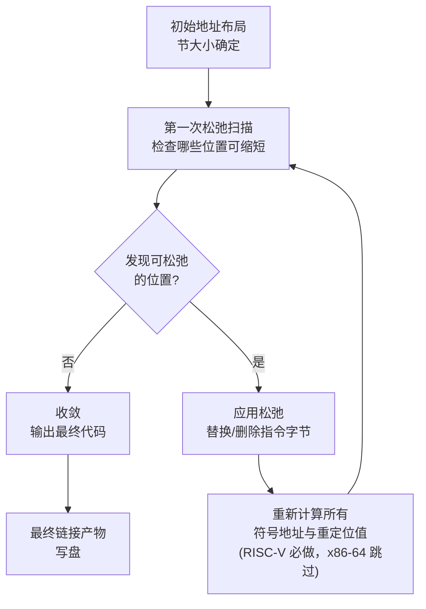

# 链接器详解（15）· 链接器松弛（Linker Relaxation）

## 概述与定位

> [!abstract] TL;DR
> - **链接器松弛（Linker Relaxation）**：链接器在完成地址布局后，把"悲观生成的长指令序列"替换为更短、更快的等价形式——因为编译器写代码时还不知道最终地址，只能生成覆盖所有距离的通用指令；等到链接期地址确定，若实际距离短到可用更短指令覆盖，就值得替换。
> - **x86-64 GOTPCRELX**：当外部符号对本模块可见（定义在同一 DSO 内），`mov foo@GOTPCREL(%rip)` 这条经 GOT 的间接寻址可被松弛为直接 `lea` 或 `mov`，消除一次内存间接。
> - **RISC-V 松弛最复杂**：`R_RISCV_RELAX` 标记许可、`auipc+jalr` 可松弛为单条 `jal`、`hi20/lo12` 地址对可整体缩短。最棘手之处：松弛**删除字节**，导致后续所有地址全部偏移，需要迭代重算直到收敛。
> - **ARM64 松弛**：`ADRP+ADD` 访问 PC±4 GiB 内数据，若符号在 PC±4 KiB 内可合并为单条 `ADR`。
> - **关闭方式**：传 `-Wl,--no-relax` 给链接器，保留原始指令序列（有利于调试/反向工程，也是确认松弛产生行为差异的标准手段）。

本篇在「链接器详解」系列中承接 [[14.三平台链接器对比]]（链接器差异概览），向前与 [[06.链接期重定位]] 深度交织（松弛本质是"先重定位、后改指令、再重定位"的循环），为 [[16.链接器插件API与LTO]] 中插件影响重定位的讨论铺路。

| 维度 | 本篇聚焦 | 相邻篇 |
|---|---|---|
| 上游 | 重定位类型与地址布局 | [[06.链接期重定位]]、[[05.节的合并与布局]] |
| 核心 | 松弛机制、平台差异、迭代收敛 | 本篇 |
| 下游 | 插件改变代码生成影响松弛 | [[16.链接器插件API与LTO]] |
| 相关 | 三平台链接器特性对比 | [[14.三平台链接器对比]] |

---

## 原理与机制

### 编译器的"悲观"假设

编译器在翻译一个函数调用或数据访问时，并不知道最终的链接地址——它只知道当前 TU（翻译单元）内部的相对布局，对于外部符号更是一无所知。为了生成**正确但不一定最优**的代码，编译器通常选择**覆盖最大距离**的指令形式：

- RISC-V：`auipc + jalr`（2 条，加载 PC±2 GiB 内任意地址后跳转）而非单条 `jal`（1 条，仅覆盖 PC±1 MiB）。
- ARM64：`ADRP + ADD`（2 条，覆盖 PC±4 GiB 对齐页）而非单条 `ADR`（1 条，仅覆盖 PC±1 MiB）。
- x86-64：`mov foo@GOTPCREL(%rip), %rax`（经 GOT，覆盖外部符号任意位置）而非 `lea foo(%rip), %rax`（直接 PC-relative，仅当符号在同一 DSO 内才合法）。

等到链接器把全部目标文件收齐并完成布局，**实际符号距离**才能确定。若距离允许使用更短的指令，替换就是合理的——这就是松弛的动机。

### 松弛与重定位的关系

松弛必须与重定位协同工作。松弛并非独立的后处理步骤，而是嵌入在重定位的处理循环中：

1. **初始布局**：链接器按节大小做第一次地址分配。
2. **松弛扫描**：遍历所有带松弛标记的重定位条目（如 `R_RISCV_RELAX`），判断能否缩短。
3. **应用松弛**：替换指令并删除或修改字节。
4. **重新布局**（仅 RISC-V 需要）：删字节导致偏移变化，需重新计算所有受影响的符号地址和重定位值。
5. **收敛检测**：若某轮没有任何变化则停止，否则回到步骤 2。

x86-64 的 GOTPCRELX 松弛不改变字节数（用等长指令替换），因此**不需要迭代**，是"静态松弛"。RISC-V 松弛改变字节数，是**迭代松弛**，这是两者最根本的区别。



---

## 结构/算法/伪代码详解

### x86-64：GOTPCRELX 松弛

#### 背景：GOT 间接寻址的代价

在 PIC/PIE 模式下，访问外部符号（或防止链接器看到的符号被加载器重定向）时，编译器生成经 GOT 的间接路径：

```asm
; 编译器生成（悲观）：
mov    foo@GOTPCREL(%rip), %rax   ; 从 GOT 加载 foo 的地址
mov    (%rax), %eax               ; 再解引用
```

对应的重定位条目类型为 `R_X86_64_GOTPCREL`，但 GCC/Clang 从 PSABI v1.6+ 起改为生成 `R_X86_64_GOTPCRELX`（32 位指令前无 REX 前缀）或 `R_X86_64_REX_GOTPCRELX`（有 REX 前缀），这两者正是**给链接器松弛准备的变体**。

#### 松弛条件与替换规则

链接器检查重定位目标符号是否满足：
1. 符号定义在同一可执行文件或同一 DSO 内（即**本地可见**），且
2. 符号无 `STV_PROTECTED` 以外的特殊可见性限制，且
3. 链接器确认**不会**通过 `LD_PRELOAD` 等机制被覆盖（对于非抢占符号，即 `STB_LOCAL` 或 `STB_GLOBAL` 且命令行明确不导出）。

满足条件时，依据指令编码做如下替换（以常见指令为例）：

| 原始（经 GOT） | 松弛后（直接） | 说明 |
|---|---|---|
| `mov foo@GOTPCREL(%rip), %rax` + `R_X86_64_REX_GOTPCRELX` | `lea foo(%rip), %rax` | 取符号地址 |
| `call *foo@GOTPCREL(%rip)` + `R_X86_64_GOTPCRELX` | `call foo` + `R_X86_64_PC32` | 间接调用→直接调用 |
| `jmp *foo@GOTPCREL(%rip)` + `R_X86_64_GOTPCRELX` | `jmp foo` + `R_X86_64_PC32` | 间接跳转→直接跳转 |
| `test %rax, foo@GOTPCREL(%rip)` + `R_X86_64_GOTPCRELX` | `test %rax, $imm` | 测试指令特殊处理 |

注意：`mov` 类的松弛把"从 GOT 槽加载地址"改成"直接计算地址的 lea"，字节编码会变（`8B` 变 `8D`），但总长度不变（仍是 7 字节，含 REX + opcode + ModRM + disp32）。因此 x86-64 的 GOTPCRELX 松弛**不改变节的总大小**。

#### 验证松弛效果

```bash
# 编译（-fPIC 强制 GOT 路径）
gcc -O2 -fPIC -c foo.c -o foo.o

# 查看编译期重定位（应含 GOTPCRELX）
readelf -r foo.o | grep GOTPCRELX

# 链接（默认开启松弛）
gcc -shared foo.o -o libfoo.so

# 查看链接后是否 GOT 条目减少
readelf -r libfoo.so | grep GLOB_DAT
objdump -d libfoo.so | grep -A2 lea   # 找 lea 替换后的指令

# 对比：关闭松弛
gcc -shared foo.o -o libfoo_norelax.so -Wl,--no-relax
```

### RISC-V 松弛详解

RISC-V 松弛是目前主流平台中**最复杂**的松弛实现，原因在于它会改变节的字节数，从而引发连锁的地址重算。

#### R_RISCV_RELAX 标记机制

RISC-V 采用**配对标记**的设计：编译器为每一对"可松弛指令序列"额外生成一条 `R_RISCV_RELAX` 重定位条目，附着在同一偏移或紧邻偏移上，作为"我允许你松弛这里"的标志。没有 `R_RISCV_RELAX` 标记的重定位，链接器**禁止**对其做缩短处理——这样可以应对内联汇编、`__builtin_return_address` 等场景中人为固定了布局的情况。

典型松弛类型对（重定位 + 标记）：

| 实际重定位 | 配套标记 | 描述 |
|---|---|---|
| `R_RISCV_CALL` / `R_RISCV_CALL_PLT` | `R_RISCV_RELAX` | `auipc+jalr` 可松弛为 `jal` |
| `R_RISCV_HI20` + `R_RISCV_LO12_I` | `R_RISCV_RELAX`（两条各一） | 地址高20位+低12位对，整体可缩短或消除 |
| `R_RISCV_TPREL_HI20` + `R_RISCV_TPREL_LO12_I` | `R_RISCV_RELAX` | TLS 本地访问的松弛 |

#### auipc+jalr → jal 松弛

`auipc+jalr` 是 RISC-V 的通用调用序列，覆盖 PC±2 GiB：

```asm
# 松弛前（2 条指令，8 字节）
auipc  ra, %hi(foo)       # R_RISCV_CALL + R_RISCV_RELAX
jalr   ra, %lo(foo)(ra)
```

若链接完成后 `foo` 距当前 PC 在 ±1 MiB 以内（`jal` 的 21 位有符号偏移范围），链接器可替换为：

```asm
# 松弛后（1 条指令，4 字节）
jal    ra, foo            # R_RISCV_JAL（新生成，直接偏移）
nop                       # 有时用 nop 填充保持对齐，也可能直接删除
```

若选择**删除** 4 字节（无 nop 填充），节的大小减少 4 字节，**后续所有符号的地址全部偏移**。

#### hi20/lo12 地址对松弛

访问全局变量的通用序列（GP 相对访问是 RISC-V 另一条路，此处讨论 PC-relative）：

```asm
# 松弛前（2 条，8 字节）
auipc  a0, %hi(global_var)   # R_RISCV_HI20 + R_RISCV_RELAX
lw     a0, %lo(global_var)(a0) # R_RISCV_LO12_I + R_RISCV_RELAX
```

若 `global_var` 与当前 PC 的高 20 位相同（即偏移 < 4 KiB 且页号相同），`auipc` 生成的高位与 PC 本身的高位完全相同，`auipc` 等价于无操作，可被删除，只留低 12 位偏移指令：

```asm
# 松弛后（1 条，4 字节）
lw     a0, offset(pc_base)    # 用某种 PC-relative load 等价（具体取决于扩展）
```

实际上 RISC-V 标准 ISA 的 `lw` 没有直接 PC-relative 形式，这里的松弛通常是利用 `gp`（全局指针寄存器）做 GP-relative 访问，或者在地址差可以用 `addi` + 基址寄存器表达时消除 `auipc`。不同版本的 lld/GNU ld 对此处理细节不同。

#### R_RISCV_ALIGN 与对齐约束

RISC-V 的 `.align N` 汇编指令会生成 `R_RISCV_ALIGN` 重定位条目，记录"此处必须对齐到 2^N 字节"。当松弛**删除字节**后，原本满足对齐的位置可能不再满足。链接器必须在松弛后**重新插入 NOP 填充**以恢复对齐要求，这些 NOP 又可能被下一轮松弛再次删除——这正是迭代收敛的必要性来源。

```
初始：
  偏移 0: auipc+jalr (8B)   [R_RISCV_CALL + R_RISCV_RELAX]
  偏移 8: .align 4           [R_RISCV_ALIGN，要求对齐到 4B]
  偏移 8: addi ...

第1轮松弛：删除 auipc，只留 jal (4B)
  偏移 0: jal (4B)
  偏移 4: .align 4           [偏移 4 已对齐，无需 NOP]
  偏移 4: addi ...
  → 节减少 4 字节，后续地址全变，需要重算

第2轮：重算后再次扫描，无可松弛项 → 收敛
```

#### 迭代收敛的代价与实现

每一轮松弛都需要完整遍历所有重定位条目并重算所有相关地址，这在大型项目中可能耗时显著。实现上的常见优化：

- **单调性保证**：每轮松弛只能**缩短**节（删除或替换为等长/更短指令），不能增长。因此地址只会减小，迭代必然收敛，不会无限循环。
- **增量更新**：维护"偏移差量表"，记录每轮每个松弛点删除的字节数，用累积差量快速计算新偏移，无需完整重扫所有节字节。
- **分区**：某些实现将只读节和代码节分开处理，减少依赖扇出。

### ARM64 ADRP+ADD / ADRP+LDR 合并松弛

ARM64 通常用两条指令序列访问任意 PC 相对地址：

```asm
# 访问地址（松弛前，2 条，8 字节）
adrp   x0, :pg_hi21:foo    # 加载页基址，覆盖 PC±4 GiB（对齐到 4K 页）
add    x0, x0, :lo12:foo   # 加低 12 位偏移
```

若 `foo` 距离当前 PC 在 `ADR` 的覆盖范围（±1 MiB，21 位有符号偏移）以内，可松弛为单条：

```asm
# 松弛后（1 条，4 字节）
adr    x0, foo
```

类似地，对于内存加载：

```asm
# 松弛前（ADRP + LDR，2 条）
adrp   x0, :pg_hi21:foo
ldr    x1, [x0, :lo12:foo]

# 松弛后（若距离够小，可合并为 PC-relative LDR，1 条）
ldr    x1, foo              # PC-relative load（覆盖 ±1 MiB）
```

ARM64 的松弛**不改变节大小**（两条 4 字节指令替换为一条 4 字节指令 + 一条 NOP，或链接器填充对齐 NOP），因此同样是"静态松弛"，无需迭代。但并非所有 ARM64 链接器实现都会做此优化——lld 对 AArch64 的松弛实现相对保守，GNU ld 略积极。

---

## 工具视角与实战

### 查看松弛效果（RISC-V）

```bash
# 编译（RV64GC，默认开启 relax）
riscv64-linux-gnu-gcc -O2 -c foo.c -o foo.o

# 查看目标文件中的松弛标记
riscv64-linux-gnu-readelf -r foo.o | grep -E "CALL|RELAX|HI20|LO12"
# 预期：每个 CALL 后面紧跟一个 RISCV_RELAX，偏移相同

# 链接
riscv64-linux-gnu-gcc foo.o -o foo

# 反汇编，观察是否出现单条 jal
riscv64-linux-gnu-objdump -d foo | grep jal

# 关闭松弛
riscv64-linux-gnu-gcc foo.o -o foo_norelax -Wl,--no-relax
riscv64-linux-gnu-objdump -d foo_norelax | grep -E "auipc|jalr"
# 对比：no-relax 版本中所有调用仍是 auipc+jalr 两条
```

### 查看 x86-64 GOTPCRELX 松弛

```bash
gcc -O2 -fPIC -shared bar.c -o libbar.so

# 查看 GOT 条目数量（松弛后应减少）
readelf -r libbar.so | grep GLOB_DAT
readelf -r libbar.so | grep JUMP_SLOT

# 反汇编找 lea（松弛后替换 mov+GOT 的特征）
objdump -d libbar.so | grep -B2 lea | head -40

# 关闭松弛对比
gcc -O2 -fPIC -shared bar.c -o libbar_norelax.so -Wl,--no-relax
# 关闭后 GLOB_DAT 数量应增加，反汇编中出现更多 mov rax,[rip+GOT_OFFSET]
```

### 松弛对二进制大小的影响

| 平台 | 松弛节省量估算 | 主要来源 |
|---|---|---|
| RISC-V RV64 | 每次 `auipc+jalr→jal` 节省 4 B；大型程序可节省 5-15% 代码体积 | 函数调用、GP-relative 数据访问 |
| x86-64 | 0 字节（指令等长替换），减少 GOT 条目 + 消除运行期内存访问 | GOTPCRELX → 消除 GOT slot |
| ARM64 | 每次 `ADRP+ADD→ADR` 节省 4 B（或保留 NOP），典型节省 1-3% | 数据访问 |

### `-Wl,--no-relax` 的使用场景

| 场景 | 说明 |
|---|---|
| 调试崩溃时对比二进制 | 松弛改变指令，有时掩盖编译器/汇编器 bug；关闭后可验证"原始"代码是否正确 |
| 嵌入式固定布局 | 某些 ROM 固件要求精确字节位置；松弛改变偏移导致链接后地址预期失效 |
| 验证松弛是否是 bug 来源 | 若打开松弛时行为异常、关闭后正常，则问题在松弛路径 |
| 逆向/安全分析 | 关闭松弛后反汇编与源汇编一一对应，更易溯源 |

---

## 安全性与正确使用

### 正确使用：松弛的前提条件

**符号可见性设置正确**是 x86-64 GOTPCRELX 松弛的首要条件。若将一个实际上会被 `LD_PRELOAD` 覆盖的符号错误标记为本地（`-Bsymbolic`、`visibility=hidden`），链接器松弛会把 GOT 间接改成直接访问，运行时 `LD_PRELOAD` 的覆盖完全失效——调用方绕过了 GOT，直接跳到链接时的符号地址，拦截器不再生效。

```bash
# 危险示例：-Bsymbolic 使所有本模块定义的符号不可被抢占
gcc -shared -Bsymbolic malloc_hook.c -o libhook.so
# 链接器会松弛掉所有本地调用的 GOT 间接，
# 若有依赖本模块"对外可被替换"的函数，松弛后替换机制失效
```

**推荐做法**：只对明确不需要被 `LD_PRELOAD` 覆盖的符号设置 `visibility=hidden`，而不要对整个 DSO 使用 `-Bsymbolic`。

### 陷阱：RISC-V 松弛与地址相关的内联汇编

若内联汇编中手工计算了与某条指令的字节偏移（如某些 Linux 内核的 `__ex_table` 异常表记录了指令的精确地址），松弛删除字节后这些手工偏移会失效。

解决方案：
1. 在内联汇编中对该指令前后添加 `.option norelax` / `.option relax` 保护：
   ```asm
   .option norelax
   auipc t0, 0     # 不允许松弛这条
   .option relax
   ```
2. 用 `R_RISCV_RELAX` 标记的缺失来告知链接器：没有 `RELAX` 标记的位置链接器不会松弛。

### 逆向影响：指令与源汇编的对应性

松弛后，反汇编输出与编译器输出的汇编（`-S`）**不再完全对应**：

- 编译器输出 `auipc+jalr`，但链接后二进制中是 `jal`。
- 编译器输出 `adrp+add`，但链接后可能是 `adr`。
- 行号信息（`.debug_line`）通常仍正确，但指令数和字节偏移会变化。

这对使用"记录指令偏移"来实现的特性有影响：
- **Linux `__ex_table`（内核异常表）**：记录每条可能触发异常的指令地址和其处理程序地址，依赖精确偏移，RISC-V 内核需在链接脚本/汇编中特别处理松弛区域。
- **Coverage instrumentation**：某些插桩工具在编译时记录指令地址，松弛后地址变化会导致覆盖率数据不准确——通常通过让链接器重新产生地址表来解决，但工具链支持程度不一。
- **调试器单步**：GDB 依赖 `.debug_line` 的 PC 范围，松弛后 PC 范围缩小（删了字节），GDB 通常能正确处理，但过老版本的 GDB 偶有计算错误。

### 松弛与链接顺序

RISC-V 松弛的迭代次数**依赖输入文件顺序和节布局**：同一套源码、不同链接顺序可能产生不同的松弛结果（迭代次数/最终字节数）。这在构建复现性（reproducible builds）场景下需要注意：使用固定的链接顺序、固定的随机种子（若链接器有地址随机化选项）以确保每次构建产物的字节完全相同。

---

## 小结

1. **松弛的本质**：把"编译期悲观生成的长指令序列"在链接期地址确定后替换为等价的短序列，是链接期优化的重要手段。
2. **x86-64 GOTPCRELX 松弛**：不改变字节数，无需迭代；核心是把经 GOT 的间接寻址改为直接 PC-relative，消除运行期内存间接，前提是符号对本模块可见且不可被抢占。
3. **RISC-V 松弛**：最复杂的实现——`R_RISCV_RELAX` 标记必须显式存在；`auipc+jalr→jal` 和 `hi20/lo12 对`松弛会**删除字节**；删字节→后续地址全变→需迭代扫描直到收敛；`R_RISCV_ALIGN` 的对齐约束在每轮松弛后都要重新检查。
4. **ARM64 松弛**：`ADRP+ADD→ADR` / `ADRP+LDR→LDR` 等不改变节大小（等长替换或填 NOP），无需迭代，各链接器实现积极程度不同。
5. **关闭方式**：`-Wl,--no-relax`；常用于调试、嵌入式固定布局、逆向分析对比。
6. **安全陷阱**：`-Bsymbolic` + GOTPCRELX 可导致 `LD_PRELOAD` 拦截失效；RISC-V 内联汇编中的精确偏移在松弛后可能失效，需用 `.option norelax` 保护。

---

## 相关阅读

- **重定位类型详解（本篇上游）**：[[06.链接期重定位]]
- **节的合并与布局**：[[05.节的合并与布局]]
- **三平台链接器对比**：[[14.三平台链接器对比]]
- **链接器插件与 LTO**：[[16.链接器插件API与LTO]]
- **ELF GOT 节结构**：[[11.ELF文件详解/17.got节.md]]
- **符号可见性与 -Bsymbolic**：[[03.符号与符号解析]]
- **链接脚本与地址控制**：[[07.链接脚本]]

---

⬅️ 上一篇 [[14.三平台链接器对比]] ｜ 🏠 [[00.链接器详解总览]] ｜ 下一篇 [[16.链接器插件API与LTO]] ➡️
