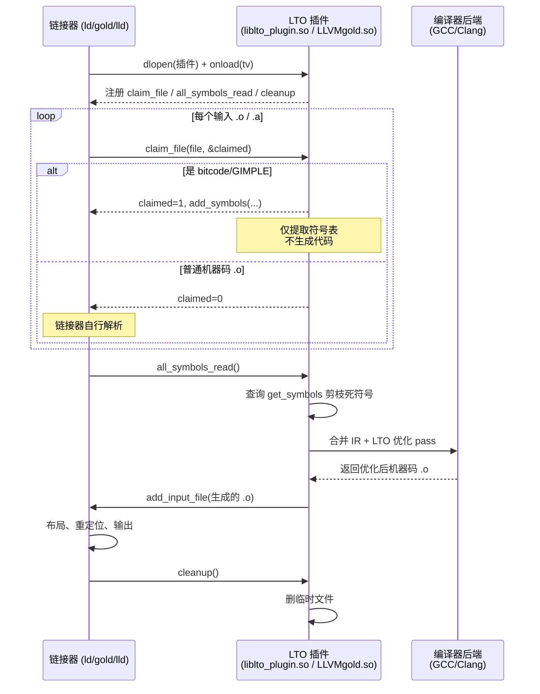

# 链接器详解（16）· 链接器插件 API 与 LTO

## 概述与定位

> [!abstract] TL;DR
> - **GNU 链接器插件 API（LDPL）**：一套 C 函数指针接口，允许第三方插件以共享库形式加载进 ld.bfd / gold / lld，拦截链接器的关键阶段（`claim_file`、`all_symbols_read`、`cleanup`）并替换或增补目标文件的处理——这是 LTO 的实现基础。
> - **LTO 的运作机制**：编译器把 LLVM bitcode（Clang）或 GIMPLE IR（GCC）嵌入 `.o` 文件；链接器遇到这类文件时回调插件（`liblto_plugin.so` / `LLVMgold.so`），插件把所有 bitcode/GIMPLE 汇总交给编译器做跨翻译单元优化（内联、常量传播、死码消除），再把生成的真实机器码 `.o` 交回链接器完成布局和重定位。
> - **claim 机制**：插件通过 `claim_file` hook 声明"我认领这个文件，链接器不要直接读它"，之后在 `all_symbols_read` hook 完成代码生成，最后把生成的目标文件"还给"链接器。
> - **与 `--gc-sections`/ICF 的交互**：LTO 插件生成最终 `.o` 后，链接器才能做 Dead Section Elimination 和 ICF，顺序至关重要，错误的插件实现会导致过早 GC 删掉仍需 LTO 的符号。

本篇承接 [[15.链接器松弛]]（链接器如何在产出最终代码前做指令级优化），向前关联 [[10.LTO链接时优化]]（LTO 原理与使用层面的讲解），同时与 [[03.符号与符号解析]]（符号全局视图是 LTO 内联的前提）深度交织。

| 维度 | 本篇聚焦 | 相邻篇 |
|---|---|---|
| 上游 | 松弛、重定位、符号解析 | [[15.链接器松弛]]、[[06.链接期重定位]]、[[03.符号与符号解析]] |
| 核心 | 插件 API 机制 + LTO 插件化实现 | 本篇 |
| 交叉 | LTO 使用与优化效果 | [[10.LTO链接时优化]] |
| 下游 | Mach-O 链接器对比 | [[17.Mach-O链接器ld64与ld-prime]] |

---

## 原理与机制

### 为什么需要链接器插件

传统编译器与链接器的职责划分非常清晰：编译器把 C/C++ 翻译成机器码的 `.o` 文件，链接器把一堆 `.o` 缝合成可执行文件。这个划分的代价是**翻译单元（TU）间的优化机会丢失**：

- 函数 `foo` 在 `a.c` 里定义，`b.c` 里调用。编译 `b.c` 时，编译器看不到 `foo` 的实现，无法内联。
- 若 `foo` 的某个参数在所有调用点都是常量，编译器无法做跨 TU 的常量折叠。
- `a.c` 中定义的某个全局变量只被 `a.c` 自己访问，但编译器无法证明"外部没有人用它"，因此不能删掉。

LTO 的目标是让编译器在链接阶段获得**全局视图**，然后在这个视图上做优化。早期实现是把所有源文件合并成一个巨大的 `.c` 再编译（unity build），显然不实用。现代 LTO 的正确做法是：

1. 每个 `.c` 独立编译，但编译产物不是机器码，而是**中间表示（IR）**（LLVM bitcode 或 GCC GIMPLE）嵌入到 `.o` 里。
2. 链接时，链接器通过插件把所有 IR 汇总给编译器后端，由编译器做跨 TU 优化后再生成机器码。
3. 链接器拿到机器码 `.o` 后继续正常流程（布局、重定位、输出）。

这个"链接器调用编译器"的协作需要一个**标准化接口**——这就是 LDPL（GNU Linker Plugin API）的由来。

### GNU 链接器插件 API 的历史与现状

LDPL 最初由 Google 工程师为 gold 链接器设计，后被 ld.bfd 和 lld 跟进实现，是目前 Linux 生态中跨链接器的事实标准插件接口。核心头文件为 `<plugin-api.h>`（binutils 源码树中的 `include/plugin-api.h`）。

支持情况：
- **ld.bfd**（binutils GNU ld）：通过 `--plugin=<so>` 加载，支持完整 LDPL v1–v3 语义。
- **gold**（Google ld）：LDPL 的发源地，支持最完整。
- **lld**（LLVM ld）：支持 LDPL 的核心 hook，足以运行 LTO 插件；部分高级 hook 行为略有差异。
- **mold**：从 v2.x 起加入插件支持，但仍以 LLVM ThinLTO 原生支持为主。

---

## 结构/算法/伪代码详解

### LDPL 插件加载流程

链接器通过 `dlopen` 加载插件共享库，然后调用插件导出的入口函数 `onload`：

```c
// 插件必须导出此入口
enum ld_plugin_status onload(struct ld_plugin_tv *tv);
```

`tv`（transfer vector）是一个以 `LDPT_NULL` 结尾的 `{tag, value}` 数组，链接器通过它把自己的**服务函数指针**传递给插件（"你想注册 hook 就调这个函数"），同时也接收插件返回的函数指针（"我要注册这些 hook"）。

典型 `tv` 中的 tag：

| Tag | 方向 | 含义 |
|---|---|---|
| `LDPT_REGISTER_CLAIM_FILE_HOOK` | 链接器→插件 | 插件调用此函数注册 `claim_file` 回调 |
| `LDPT_REGISTER_ALL_SYMBOLS_READ_HOOK` | 链接器→插件 | 注册 `all_symbols_read` 回调 |
| `LDPT_REGISTER_CLEANUP_HOOK` | 链接器→插件 | 注册 `cleanup` 回调 |
| `LDPT_ADD_SYMBOLS` | 链接器→插件 | 插件调用此函数向链接器声明自己文件的符号 |
| `LDPT_GET_SYMBOLS` | 链接器→插件 | 插件查询某符号最终是否被用到（用于 dead-stripping） |
| `LDPT_ADD_INPUT_FILE` | 链接器→插件 | 插件把生成的临时 `.o` 交还给链接器 |
| `LDPT_OPTION` | 链接器→插件 | 传递命令行中 `-plugin-opt=...` 的选项 |
| `LDPT_OUTPUT_NAME` | 链接器→插件 | 最终输出文件名（供插件命名临时文件） |
| `LDPT_LINKER_OUTPUT` | 链接器→插件 | 输出类型（可执行/共享库/可重定位） |

`onload` 完成后，插件持有链接器服务函数的指针，链接器持有插件 hook 的指针——双向注册完成。

### claim_file hook

```c
enum ld_plugin_status claim_file_handler(
    const struct ld_plugin_input_file *file,
    int *claimed
);
```

链接器每读取一个输入文件，就调用所有已注册的 `claim_file` 回调。插件检查 `file` 的 magic bytes 或其他标识，决定是否认领：

```c
// 伪代码：LTO 插件的 claim_file 实现
ld_plugin_status claim_file_handler(const ld_plugin_input_file *f, int *claimed) {
    // 读取文件头，检查是否是 LLVM bitcode
    // bitcode 文件以 0x42 0x43 0xC0 0xDE 开头（"BC"）
    // 或者是 ar 归档中含 bitcode 成员
    if (!is_bitcode(f->fd, f->offset, f->filesize)) {
        *claimed = 0;
        return LDPS_OK;  // 不认领，让链接器自己处理
    }

    *claimed = 1;  // 认领此文件，链接器不再直接解析它
    
    // 解析 bitcode，提取符号表（不做代码生成）
    Module *m = parse_bitcode(f->fd, f->offset, f->filesize);
    
    // 向链接器声明该 bitcode 模块导出的符号
    ld_plugin_symbol syms[...];
    for (auto &sym : m->global_symbols()) {
        syms[i] = { sym.name, LDPK_DEF, sym.visibility, ... };
    }
    add_symbols_func(f->handle, sym_count, syms);
    
    // 把模块存储起来，等 all_symbols_read 时再做代码生成
    pending_modules.push_back({f->handle, m});
    return LDPS_OK;
}
```

关键点：`claim_file` 阶段**只提取符号表，不生成代码**。这时链接器刚收集完输入文件，还没开始符号解析，代码生成太早——很多符号可能会被 `--gc-sections` 删除，提前生成是浪费。

### all_symbols_read hook

```c
enum ld_plugin_status all_symbols_read_handler(void);
```

当链接器完成全部输入文件的读取和符号解析后，调用此 hook。这是 LTO 代码生成的**正确时机**：

```c
// 伪代码：LTO 插件的 all_symbols_read 实现
ld_plugin_status all_symbols_read_handler() {
    // 查询每个符号是否真正被用到（被链接器标记为 needed）
    for (auto &pending : pending_modules) {
        for (auto &sym : pending.module->global_symbols()) {
            ld_plugin_symbol_resolution res;
            get_symbols_func(pending.handle, 1, &sym_entry, &res);
            if (res == LDPR_PREEMPTED_REG || res == LDPR_UNUSED) {
                // 符号被更高优先级定义抢占，或根本没人用
                // → 可以从 IR 中删掉，减少后续优化的工作量
                mark_dead(sym);
            }
        }
    }

    // 合并所有 bitcode 模块到一个 LLVMContext（Full LTO）
    // 或按依赖关系分成若干 ThinLTO partition
    auto merged_module = link_modules(pending_modules);

    // 触发跨 TU 的 IR 优化 pass（内联、常量传播、loop unroll 等）
    run_lto_optimization(merged_module, lto_options);

    // 代码生成：IR → 机器码，产生临时 .o
    std::vector<std::string> output_files;
    codegen(merged_module, &output_files);

    // 把生成的 .o 交还给链接器
    for (auto &f : output_files) {
        add_input_file_func(f.c_str());
    }
    return LDPS_OK;
}
```

此时链接器已完成符号解析，插件可以知道哪些符号真正被使用（通过 `get_symbols` 查询 `LDPR_USED`），从而在代码生成时裁剪无用符号，避免把整个程序的 IR 全部优化。

### cleanup hook

```c
enum ld_plugin_status cleanup_handler(void);
```

链接完成后（无论成功或失败）调用，用于删除临时文件、释放资源。

### 插件时序总览



### GCC 与 Clang 的插件共享库

| 工具链 | 插件库名 | 加载方式 |
|---|---|---|
| GCC（任意链接器） | `liblto_plugin.so`（GCC 安装目录下） | `ld -plugin=$(gcc --print-file-name=liblto_plugin.so)` |
| Clang + ld.bfd/gold | `LLVMgold.so`（LLVM 构建产物） | `clang -flto -fuse-ld=gold`（自动传 -plugin）；或手动 `ld --plugin=LLVMgold.so` |
| Clang + lld | 无插件（lld 内建 LTO 支持） | `clang -flto -fuse-ld=lld` |
| Clang ThinLTO + lld | 无插件（lld 内建） | `clang -flto=thin -fuse-ld=lld` |

lld 的特殊性：lld 是 LLVM 项目的一部分，直接与 LLVM IR 处理库静态链接，不需要通过插件接口加载外部 `.so`——LTO 对 lld 来说是"内建功能"而非"插件扩展"。但 lld 仍然实现了 LDPL 接口，以便在某些场景下兼容加载 `LLVMgold.so` 或其他第三方插件。

### Full LTO vs ThinLTO 在插件层的差异

**Full LTO**（`-flto` 默认）：
- `all_symbols_read` 阶段把所有 bitcode 模块合并成**单个** LLVM Module，在整个程序范围内做优化。
- 优化粒度最细（全局内联、全局 devirtualization），但内存占用极大，编译时间随代码量呈超线性增长。
- 代码生成串行（单个 Module），难以并行化。

**ThinLTO**（`-flto=thin`）：
- `claim_file` 阶段提取每个模块的**精简摘要（Summary）**，而非完整 IR。
- `all_symbols_read` 阶段依据摘要构建**跨模块调用图**，识别哪些函数需要导入（被其他模块内联）。
- 代码生成**并行**：每个原始 `.o` 仍然独立优化，只按需导入其他模块的符号定义（"剪枝导入"）。
- 内存占用和编译时间大幅改善，通常只损失 5-10% 的优化效果相对于 Full LTO。

```
Full LTO 内存峰值：  O(程序总 IR 大小)
ThinLTO 内存峰值：   O(单模块 IR + 导入函数 IR)   ≈ O(单模块 × 几倍)
```

### 自定义链接器插件开发要点

开发一个简单的自定义插件需要：

1. **链接 `<plugin-api.h>` 并实现 `onload`**：从 binutils 或 LLVM 源码取头文件，编译为共享库（`-fPIC -shared`）。

2. **正确处理 `claim_file` 的幂等性**：同一个文件可能被多次传入（ar 归档的每个成员都单独传）；对于不认识的文件格式必须把 `*claimed` 置 0 并返回 `LDPS_OK`，绝不能静默忽略。

3. **`add_symbols` 必须精确**：声明的符号集合（名字、类型、可见性、强弱）必须与最终生成代码的实际符号完全一致，否则链接器符号解析结果与代码生成结果不符，产生 undefined reference 或重复定义。

4. **临时文件路径安全**：`add_input_file` 传入的文件必须在 `cleanup` 之前一直存在；多进程并行编译时注意临时文件名避免冲突。

5. **支持 `-plugin-opt=<KEY>=<VALUE>` 传参**：通过 `LDPT_OPTION` 从链接命令行接收选项，而不是硬编码行为。

```c
// 最小插件骨架（伪代码）
#include <plugin-api.h>
#include <string.h>

static ld_plugin_add_symbols add_symbols;
static ld_plugin_add_input_file add_input_file;

static ld_plugin_status claim_file_cb(
    const ld_plugin_input_file *file, int *claimed) {
    // 检查 magic，决定是否认领
    *claimed = 0;
    return LDPS_OK;
}

static ld_plugin_status all_symbols_read_cb(void) {
    return LDPS_OK;
}

static ld_plugin_status cleanup_cb(void) {
    return LDPS_OK;
}

enum ld_plugin_status onload(struct ld_plugin_tv *tv) {
    ld_plugin_register_claim_file  reg_claim = NULL;
    ld_plugin_register_all_symbols_read reg_asr = NULL;
    ld_plugin_register_cleanup     reg_cleanup = NULL;

    for (; tv->tv_tag != LDPT_NULL; ++tv) {
        switch (tv->tv_tag) {
        case LDPT_REGISTER_CLAIM_FILE_HOOK:
            reg_claim = tv->tv_u.tv_register_claim_file; break;
        case LDPT_REGISTER_ALL_SYMBOLS_READ_HOOK:
            reg_asr = tv->tv_u.tv_register_all_symbols_read; break;
        case LDPT_REGISTER_CLEANUP_HOOK:
            reg_cleanup = tv->tv_u.tv_register_cleanup; break;
        case LDPT_ADD_SYMBOLS:
            add_symbols = tv->tv_u.tv_add_symbols; break;
        case LDPT_ADD_INPUT_FILE:
            add_input_file = tv->tv_u.tv_add_input_file; break;
        default: break;
        }
    }
    if (reg_claim)   reg_claim(claim_file_cb);
    if (reg_asr)     reg_asr(all_symbols_read_cb);
    if (reg_cleanup) reg_cleanup(cleanup_cb);
    return LDPS_OK;
}
```

---

## 工具视角与实战

### 验证 LTO 插件是否生效

```bash
# GCC Full LTO：编译时生成含 GIMPLE 的 .o
gcc -O2 -flto -c foo.c -o foo.o bar.c -o bar.o

# 查看 .o 中的 GIMPLE 节（LTO 产物的特征节）
readelf -S foo.o | grep '.gnu.lto'
# 预期看到 .gnu.lto_.inline 等节名

# 链接（ld.bfd 自动加载 liblto_plugin.so）
gcc -O2 -flto foo.o bar.o -o prog

# 若想显式传插件
LTO_PLUGIN=$(gcc --print-file-name=liblto_plugin.so)
ld -plugin "$LTO_PLUGIN" -plugin-opt=mcpu=native foo.o bar.o -o prog_manual \
   $(gcc -print-file-name=crtbegin.o) $(gcc -print-file-name=crtend.o) \
   -lc --dynamic-linker /lib64/ld-linux-x86-64.so.2

# Clang ThinLTO with lld（内建，无插件文件）
clang -O2 -flto=thin -fuse-ld=lld foo.c bar.c -o prog_thin

# 查看 ThinLTO 摘要节
llvm-dis foo.o.tmp -o - 2>/dev/null | head -20  # 摘要不易直接 dis，用以下方式
llvm-nm --plugin=LLVMgold.so foo.o  # 通过插件读取 bitcode 中的符号
```

### 验证 LTO 优化效果（跨 TU 内联）

```c
// a.c
static int helper(int x) { return x * 2 + 1; }
int compute(int n) { return helper(n); }

// b.c
extern int compute(int n);
int main() { return compute(3); }
```

```bash
# 不开 LTO：main 中 compute 是 call，compute 中 helper 已内联但 compute 本身是外部符号
gcc -O2 a.c b.c -o no_lto
objdump -d no_lto | grep -A10 '<main>:'
# 预期：call compute@plt 或 call compute（通过重定位）

# 开 LTO：整个调用链被内联，main 直接变成 return 7
gcc -O2 -flto a.c b.c -o with_lto
objdump -d with_lto | grep -A5 '<main>:'
# 预期：mov $7, %eax; ret（compile-time 求值，完全内联）
```

### --gc-sections 与插件的顺序依赖

`--gc-sections` 在链接器中的时机：

1. 链接器收集所有输入文件（包括被 claim 的 bitcode）。
2. 插件的 `claim_file` 声明符号（但此时机器码还没生成）。
3. **此时 GC 不能运行**——GC 需要的是机器码中的段引用图，bitcode 的符号只有名字和类型，没有段引用信息。
4. 插件 `all_symbols_read` 生成机器码、`add_input_file` 交还 `.o`。
5. **GC 在此刻运行**，基于真实段引用图删掉死段。

若链接器实现把 GC 放在 `claim_file` 阶段之后、`all_symbols_read` 之前（即在 bitcode 被替换为机器码之前），就会错误地把被 bitcode 模块引用的符号当作"无人引用"而删除——这是 LTO 插件实现中最常见的 bug 之一。

正确的链接器应当**推迟 GC 到 `all_symbols_read` 之后**。可以通过检查最终产物大小（关闭 LTO 后应变大，而非变小为异常）或用 `nm -u prog` 检查是否有意外的未定义符号来验证。

### ICF（Identical Code Folding）与插件

ICF 把字节完全相同的函数段合并为一个，减少代码体积。ICF 同样必须在 `all_symbols_read`（即 LTO 代码生成）之后运行，否则合并的是 bitcode 的"壳符号"而非真实机器码，无效。

```bash
# 开启 ICF（gold / lld）
clang -flto=thin -fuse-ld=lld -Wl,--icf=all -O2 foo.c bar.c -o prog
# lld 的 ICF 在 LTO 代码生成完成后进行，顺序正确
```

---

## 安全性与正确使用

### 插件加载的安全隐患

链接器插件通过 `dlopen` 在链接器**同进程内**加载，运行在完全相同的权限下。这意味着：

- 若构建系统允许用户指定任意 `--plugin=<path>`，恶意插件可以在编译时执行任意代码（claim_file 和 all_symbols_read 都运行在链接器进程里）。
- 在 CI/CD 环境中，应严格限制 `--plugin=` 路径只允许指向受信任位置（如包管理器安装的系统目录），拒绝项目本地任意路径。

### LTO 与 `__attribute__((used))` / `__attribute__((visibility))`

LTO 的死码消除比单 TU 的 `-ffunction-sections + --gc-sections` 更激进：

- `__attribute__((used))` 标记可防止编译器在单 TU 内删除符号，但**不能阻止 LTO 全局视图下的死符号删除**（如果没有任何入口引用该符号）。
- 若需要在 LTO 下保留某符号（如某个 `.so` 的导出函数、某个嵌入式中断向量），必须同时使用 `__attribute__((visibility("default")))` 确保符号对外可见，或在链接脚本中用 `KEEP()` 保留对应的节。
- 插件在 `claim_file` 时通过 `LDPR_PREEMPTED_REG` / `LDPR_USED` 状态感知符号是否被使用，并据此裁剪——因此插件自身也参与死符号判断，行为正确与否直接影响最终产物的完整性。

### 正确使用 ThinLTO 缓存

ThinLTO 支持**编译缓存**（`-Wl,--thinlto-cache-dir=<dir>`）：对于未变化的模块，直接复用上次缓存的机器码 `.o`，大幅提升增量编译速度。使用时的注意事项：

```bash
# 开启 ThinLTO 缓存
clang -flto=thin -fuse-ld=lld \
  -Wl,--thinlto-cache-dir=/tmp/thinlto-cache \
  -Wl,--thinlto-cache-policy=cache_size=10%:cache_size_bytes=5g \
  -O2 foo.c bar.c -o prog
```

陷阱：
- 缓存目录跨编译器版本或编译器标志变化时**必须清空**；旧缓存的 bitcode IR 格式可能与新编译器不兼容，导致链接崩溃或生成错误代码。
- 在 reproducible builds 场景下，缓存引入了隐式状态，需要禁用（`-Wl,--thinlto-cache-dir=` 置空）或纳入哈希计算。

### 插件与地址消毒工具（ASan/MSan）的交互

ASan/MSan 的插桩在编译时完成，LTO 阶段可能对插桩代码做进一步内联，**通常不产生问题**，但：

- `-fsanitize=address -flto` 组合下，若 LTO 把某个跨 TU 函数内联进调用者，内联后的边界检查代码仍然存在，不会被优化掉——这是正确行为。
- 若 ASan 的 runtime 库本身以 LTO 方式编译（少见），需确保 ASan runtime 符号不被 LTO 死码消除，通常通过 `-Wl,--whole-archive -lasan -Wl,--no-whole-archive` 保留。

---

## 小结

1. **LDPL 是 LTO 的基础设施**：`onload`→`claim_file`→`all_symbols_read`→`cleanup` 四阶段 hook 把编译器的 IR 优化能力无缝嵌入链接流程，ld.bfd / gold / lld 均支持这套接口。
2. **claim 机制解耦符号声明与代码生成**：插件在 `claim_file` 时只声明符号（让链接器知道"我有这些符号"），在 `all_symbols_read` 时才真正生成机器码——这保证了链接器符号解析的全局性，同时避免过早生成被死码消除删掉的代码。
3. **Full LTO vs ThinLTO**：Full LTO 合并单 Module，优化最彻底但内存/时间开销高；ThinLTO 按摘要分区并行，工程实用性更强，lld 内建支持无需插件文件。
4. **GC 与 ICF 必须在代码生成后**：`--gc-sections` 和 ICF 依赖真实机器码的段引用图，必须在 LTO 插件完成代码生成并把 `.o` 交还链接器之后才能运行；否则会错误删除仍需使用的符号。
5. **安全注意**：插件在链接器同进程中运行、拥有完整权限；构建系统应限制插件路径；LTO 死码消除比 GC-sections 更激进，需配合 `visibility("default")` 或 `KEEP()` 保留必要符号；ThinLTO 缓存跨版本必须清空。

---

## 相关阅读

- **LTO 原理与使用详解**：[[10.LTO链接时优化]]
- **链接器松弛（本篇上游）**：[[15.链接器松弛]]
- **符号与符号解析**：[[03.符号与符号解析]]
- **节的合并与布局**：[[05.节的合并与布局]]
- **链接脚本 KEEP() 与死码消除**：[[07.链接脚本]]
- **三平台链接器对比**：[[14.三平台链接器对比]]
- **Mach-O 链接器 ld64 与 ld-prime**：[[17.Mach-O链接器ld64与ld-prime]]

---

⬅️ 上一篇 [[15.链接器松弛]] ｜ 🏠 [[00.链接器详解总览]] ｜ 下一篇 [[17.Mach-O链接器ld64与ld-prime]] ➡️
