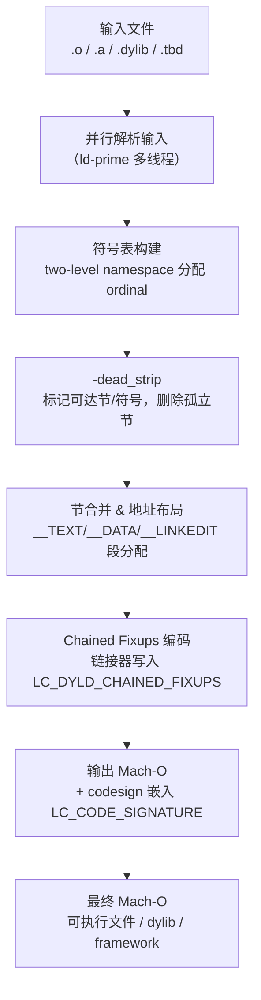

# 链接器详解（17）· Mach-O 链接器 ld64 与 ld-prime

## 概述与定位

> [!abstract] TL;DR
> - **ld64** 是 Apple 自研链接器，随 Xcode 发布，处理 Mach-O 格式目标文件，自 2005 年起逐渐取代旧版 `ld`。
> - **ld-prime**（又称 `ld_prime`，内部代号 `ld_new`）自 Xcode 15（2023）起成为**默认链接器**，在 ld64 架构基础上引入大规模并行化，冷链接速度提升 2～5 倍，增量链接也明显加快。
> - Mach-O 链接的核心特色：**two-level namespace**（符号来源 dylib 编码进二进制）、**chained fixups**（`LC_DYLD_CHAINED_FIXUPS` 把 rebase/bind 编码进指针链）、**dead_strip**（-dead_strip 静态消除未引用代码）、**fat/universal binary**（单文件多架构）。
> - 与 ELF/GNU ld 的最大差异：无 `.plt`/`.got` 独立节概念（用 `__stubs`/`__got` 等 Mach-O section 替代）；dyld 与链接器高度协同设计；codesign 作为链接后强制步骤嵌入工作流。

本篇处于「链接器详解」系列**平台专项**板块，紧接 [[16.链接器插件API与LTO]]（通用扩展机制），与 [[12.Mach-O文件详解/00.Mach-O文件详解总览]] 互补——Mach-O 文件格式由彼篇细讲，本篇聚焦链接器如何**生成**这些结构。

| 维度 | 本篇聚焦 | 相邻篇 |
|---|---|---|
| 链接器历史 | ld64 → ld-prime 演进 | 本篇 |
| Mach-O 格式 | 链接器生成视角 | [[12.Mach-O文件详解/00.Mach-O文件详解总览]] |
| 运行期加载 | dyld chained fixups 执行 | [[14.动态链接与加载器详解/22.macOS_dyld与chained_fixups]] |
| Windows 对照 | link.exe 深度 | [[18.Windows链接器link.exe深度]] |

---

## 原理与机制

### Apple 链接器历史：ld64 → ld-prime

Apple 平台的链接器经历了几次重大迭代：

- **cctools ld（~2005 年前）**：基于传统 Unix `ld`，单线程，直接处理 Mach-O `.o`，不支持 universal binary 自动构建，性能和功能均受限。
- **ld64（2005—2023）**：由 Apple 工程师 Nick Kledzik 主导重写，C++ 实现，完整支持 Mach-O、fat binary、two-level namespace、dead strip、`LC_DYLD_INFO` 等现代特性。随 Xcode 4–14 分发，是 macOS / iOS 开发事实标准。ld64 虽逐步引入多线程（I/O 并行），但**核心符号解析与节合并仍单线程**，大型项目冷链接耗时可达数十秒。
- **ld-prime（Xcode 15，2023—）**：Apple 从零设计的全新链接器，**整个流水线多线程并行**：输入文件解析、符号表构建、节合并、fixup 生成均可并发。基准测试中，调试构建（-O0）速度提升约 2 倍，Release 构建（含 LTO）提升可达 5 倍。ld-prime 完全兼容 ld64 命令行接口，输出完全等价的 Mach-O，但内部实现是独立代码库。
- **退出策略**：Apple 提供 `-ld_classic` 回退到 ld64，用于排查 ld-prime 可能的边缘差异，但 ld64 长期将被移除。

ld-prime 的并行化关键点：
1. **并行输入解析**：同时读取并解析所有 `.o`/`.a` 文件，建立符号表。
2. **并发节合并**：各输出 section 的内容拼接可在不同线程执行。
3. **fixup 并行计算**：chained fixups 的编码（见后文）在多核上按段并行计算。
4. **增量模式**：对未改变的目标文件复用上次解析结果，进一步缩短增量链接时间。

### Two-Level Namespace

**Two-level namespace** 是 Mach-O 最重要的符号可见性机制，与 ELF 的 flat namespace 有根本区别。

#### ELF flat namespace（对比）

ELF 共享库导出的符号进入**全局符号表**，`dlopen` 加载的任意库都能"看到"先前已加载库的符号，且后加载的符号会被先加载的同名符号遮蔽（interposition）。这带来灵活性但也引入不确定性——符号来源取决于加载顺序。

#### Mach-O two-level namespace

每个**未定义符号**（`N_UNDF`）在 Mach-O 二进制的符号表中都携带**库的序号**（library ordinal），编码在 `n_desc` 字段的高 8 位。dyld 根据此序号直接定位到对应 dylib，不扫描其他库。

链接器构建 two-level 引用的流程：
1. 链接器遍历 `-framework`、`-lxxx`、`-dylib_file` 等输入，为每个 dylib 分配**顺序编号**（ordinal 1, 2, 3…）。
2. 对每个未定义符号，在候选 dylib 列表中查找第一个声明该符号的 dylib，写入 ordinal。
3. 生成 `LC_LOAD_DYLIB` command，按 ordinal 顺序列出所有依赖 dylib（路径 + `install_name`）。

```
// otool -L /usr/bin/python3 示意
/usr/lib/libSystem.B.dylib  (ordinal 1)
/System/Library/Frameworks/Foundation.framework/Foundation  (ordinal 2)
...
```

Two-level namespace 的优势：
- **消除符号冲突**：两个 dylib 可以有同名函数，互不干扰。
- **加载速度更快**：dyld 无需扫描全局符号表，直接跳到对应 dylib 查找。
- **可重现性**：符号解析结果不依赖加载顺序。

例外情况：`-flat_namespace` 选项可强制回退到 flat namespace（主要用于旧版兼容或某些插件架构），`DYLD_FORCE_FLAT_NAMESPACE` 环境变量亦可运行期触发。

### Chained Fixups（`LC_DYLD_CHAINED_FIXUPS`）

现代 Mach-O 二进制（iOS 13.4+ 部署目标 / macOS 11+）默认使用 **chained fixups** 格式，取代旧式 `LC_DYLD_INFO` 的 rebase/bind opcode 流。

#### 旧式 LC_DYLD_INFO 机制

旧式方案把 rebase（调整内部指针基址）和 bind（外部符号绑定）编码为 ULEB128 opcode 序列，存放在 `__LINKEDIT` 中。dyld 在启动时顺序**解释**这些 opcode，逐一修正指针，时间复杂度 O(fixup 数量)，对大型 app 启动时间影响显著。

#### Chained Fixups 原理

Chained fixups 把所有需要修正的指针**原地编码**为特殊值，形成一条链表：

1. **起始页表**：`LC_DYLD_CHAINED_FIXUPS` 指向一个结构头（`dyld_chained_fixups_header`），头部包含页起始偏移数组，记录每个内存页中**第一个需修正指针**的偏移。
2. **链式编码**：每个指针位置存放的不是真实地址，而是一个编码字（`dyld_chained_ptr_64_rebase` 或 `dyld_chained_ptr_64_bind`），其中：
   - 高位字段：**next** 偏移（指向本页下一个 fixup，单位为 4 或 8 字节倍数）。
   - 中位字段：target/addend（rebase 时存虚拟地址偏移；bind 时存符号导入表索引）。
   - 低位 bit：区分 rebase/bind 类型。
3. **dyld 遍历**：dyld 从每页第一个 fixup 出发，沿链表 next 跳转，直到 next=0 结束。

```
链式编码示意（64-bit rebase，PAC-aware）：
bits[63]     = 0（非 PAC）
bits[62:32]  = next_offset（到同页下一 fixup 的偏移 / stride）
bits[31:0]   = high8 + target（地址低 32 位 + 8 位高位）
```

链接器（ld64/ld-prime）在输出阶段**负责写入这些编码指针**，取代旧式单独的 opcode 流。这样：
- `__DATA`/`__DATA_CONST` 中所有需要 rebase/bind 的指针直接原地可枚举，dyld 无需单独维护 opcode 缓冲区。
- 页粒度起始偏移表使 dyld 可以**并行处理不同页**的 fixup，大幅加速 app 启动。
- 与 `__DATA_CONST` 配合：fixup 完成后该 segment 设为只读，提升安全性。

详细 dyld 执行侧机制见 [[14.动态链接与加载器详解/22.macOS_dyld与chained_fixups]]。

---

## 结构/算法/伪代码详解

### ld64/ld-prime 链接流程



### Dead Strip（-dead_strip）算法

`-dead_strip` 是 Mach-O 链接器的静态死代码消除，比 ELF 的 `--gc-sections` 粒度更细：

1. **入口根集合**：可执行文件以 `main` 为根；dylib 以所有导出符号为根；Objective-C / Swift 代码中 `+load`、`+initialize` 方法及 category 注册信息自动标记为根（因为 ObjC runtime 会直接访问这些节）。
2. **可达性传播**：从根符号出发，沿引用图广度优先标记：函数调用、全局变量初始化、vtable 条目等都构成引用边。Mach-O 中每个 section 可包含多个 **atom**（逻辑代码/数据单元，由链接器内部维护），死代码消除在 atom 粒度执行。
3. **删除未标记 atom**：未被标记为可达的 atom 从节中移除，链接器不将其写入输出文件。
4. **结果**：最终 `__TEXT,__text` 只包含被实际调用的函数机器码，显著减小包体。

关键限制：
- 若符号使用 `__attribute__((used))` 或通过汇编 `.globl` 显式引用，不参与 dead strip。
- ObjC `+load` 方法、类/分类注册（`__DATA,__objc_classlist` 等）默认不被 strip，因为 runtime 通过节扫描访问，而非直接符号引用。

### 伪代码：chained fixups 写入（链接器端）

```
function emit_chained_fixups(output_segments):
    fixup_header = new dyld_chained_fixups_header()
    
    for each page P in DATA/DATA_CONST segments:
        page_fixups = collect_fixup_sites(P)    // 收集本页所有需 rebase/bind 的指针位置
        sort_by_offset(page_fixups)
        
        prev = null
        for site in page_fixups:
            encoded = encode_fixup(site)        // rebase: 写入 target 地址偏移
                                                 // bind:   写入 import table index
            if prev != null:
                // 把 next_offset 写回 prev 指针高位
                prev.raw[62:32] = (site.offset - prev.offset) / stride
            write_ptr(site.offset, encoded)
            prev = site
        
        fixup_header.page_starts[P] = page_fixups[0].offset  // 记录首个 fixup 偏移
    
    emit LC_DYLD_CHAINED_FIXUPS pointing to fixup_header
```

### Install Name 与 RPATH 机制

**Install name**（`-install_name`）是 dylib 写入自身 `LC_ID_DYLIB` 的路径字符串。当其他二进制链接该 dylib 时，链接器把这个路径写入 `LC_LOAD_DYLIB`，dyld 在运行时用此路径加载。常见形式：

- `/usr/lib/libfoo.1.dylib`（绝对路径，系统库）
- `@rpath/Foo.framework/Foo`（rpath 相对，App 内嵌 framework 标准写法）
- `@executable_path/../Frameworks/Foo.dylib`（可执行文件相对路径）

**RPATH**（`-rpath`）向二进制写入 `LC_RPATH` 条目，dyld 在搜索 `@rpath/...` 时依次尝试所有 `LC_RPATH`。Xcode 默认为 App target 添加 `$(BUILT_PRODUCTS_DIR)` 和 `@executable_path/../Frameworks`。

**`-exported_symbols_list`**：文本文件，每行一个符号名（支持通配符），链接器据此过滤 dylib 的导出符号表，未列出的符号不导出（设为 `__private_extern__`/`N_PEXT`）。比 `-unexported_symbols_list` 更适合精确白名单管控 API 面。

---

## 工具视角与实战

### 常用工具速查

| 工具 | 作用 | 示例 |
|---|---|---|
| `otool -l` | 查看所有 Load Command | `otool -l ./MyApp` |
| `otool -L` | 查看 dylib 依赖（含 ordinal） | `otool -L ./libfoo.dylib` |
| `nm -m` | 查看符号表及 two-level 库来源 | `nm -m ./MyApp \| grep " U "` |
| `dyldinfo -fixups` | 查看 fixup 类型（rebase/bind） | `dyldinfo -fixups ./MyApp` |
| `llvm-objdump -d` | 反汇编（支持 ARM64/x86-64） | `llvm-objdump -d ./MyApp` |
| `lipo -info` | 查看 fat binary 所含架构 | `lipo -info ./libfoo.a` |
| `lipo -create` | 合并多架构 | `lipo -create arm64.o x86_64.o -output fat.o` |
| `codesign -d -vvv` | 查看签名信息 | `codesign -d -vvv ./MyApp` |
| `xcrun ld -v` | 查看当前 ld 版本（ld64/ld-prime） | `xcrun ld -v 2>&1` |

### 使用 ld-prime / 回退到 ld64

```bash
# Xcode 15+ 默认使用 ld-prime，无需任何额外参数
xcodebuild ...

# 临时回退到 ld64 排查问题
xcodebuild OTHER_LDFLAGS="-ld_classic" ...

# 命令行直接调用，指定版本
xcrun -sdk macosx ld -ld_new ...   # 强制 ld-prime
xcrun -sdk macosx ld -ld_classic ...  # 强制 ld64
```

### Dead Strip 实战

```bash
# 链接可执行文件，启用 dead_strip
ld -dead_strip main.o libfoo.a -o myapp -lSystem

# 查看被保留的 section（排除死代码后）
nm -n myapp | head -30

# 编译时确保 section-per-function（-ffunction-sections 对 macOS/ld64 同样有效）
clang -ffunction-sections -fdata-sections main.c -c -o main.o
ld -dead_strip main.o -o myapp -lSystem
```

### Fat/Universal Binary 构建

```bash
# 分别编译 arm64 和 x86_64
clang -arch arm64  -c foo.c -o foo_arm64.o
clang -arch x86_64 -c foo.c -o foo_x86_64.o

# 链接各架构输出
ld -arch arm64  foo_arm64.o  -o foo_arm64  -lSystem
ld -arch x86_64 foo_x86_64.o -o foo_x86_64 -lSystem

# 用 lipo 合成 fat binary
lipo -create foo_arm64 foo_x86_64 -output foo_fat

# Xcode 构建系统通过 ARCHS 变量自动处理多架构，底层同此逻辑
```

### Codesign 集成流程

macOS/iOS 要求所有可执行文件、dylib、framework 都必须有有效签名。Xcode 构建流水线在链接后自动执行签名：

```
clang ... -o MyApp.app/Contents/MacOS/MyApp
↓
codesign --sign "Developer ID Application: ..." \
         --entitlements MyApp.entitlements \
         MyApp.app/Contents/MacOS/MyApp
```

链接器本身在输出 Mach-O 时会分配 `LC_CODE_SIGNATURE` Load Command 并预留签名空间（`__LINKEDIT,__code_signature` section），`codesign` 工具填入实际哈希树（code directory + signature blob）。对于 iOS，Xcode 在设备安装前还会执行额外的资源签名。

从 Apple Silicon (arm64e) 开始，Pointer Authentication Code (PAC) 与签名联动：函数指针在存入内存时由硬件签名，dyld 和内核验证 PAC，链接器输出的 chained fixups 需携带 PAC 感知的编码格式（`DYLD_CHAINED_PTR_ARM64E`）。

### 导出符号控制实战

```bash
# 创建导出符号白名单
cat > exports.txt << 'EOF'
_MyPublicAPI
_MyOtherPublicAPI
EOF

# 链接 dylib，只导出白名单符号
ld -dynamiclib \
   -install_name @rpath/libfoo.dylib \
   -exported_symbols_list exports.txt \
   foo.o -o libfoo.dylib -lSystem

# 验证导出
nm -m libfoo.dylib | grep "external"
```

---

## 安全性与正确使用

### Install Name 错误配置陷阱

最常见的 macOS dylib 部署错误之一是 `install_name` 配置不当：

- **陷阱**：dylib 使用绝对路径 `/Users/bob/build/libfoo.dylib` 作为 install name，导致其他机器运行时 dyld 找不到该路径（`dyld: Library not loaded`）。
- **正确做法**：App 内嵌 framework 使用 `@rpath/Foo.framework/Foo`，并确保 App bundle 里有对应的 `LC_RPATH`。系统库使用 `/usr/lib/` 或 `/System/Library/Frameworks/`。

### Two-Level Namespace 与符号冲突

Two-level namespace 消除了大多数符号冲突，但有一个重要边缘场景：

- **同一 dylib 被多路径加载**：若 `@rpath/Foo` 和 `/usr/local/lib/Foo` 实际上是同一文件的两个路径，dyld 可能将其视为两个不同库而**加载两次**，导致全局状态（单例、锁、静态变量）出现两份实例。使用 `DYLD_PRINT_LIBRARIES=1` 可诊断。
- **解决**：规范化所有 install name，确保同一 dylib 只通过一条路径引用。

### Dead Strip 与 ObjC/Swift 注意点

- Swift 的 `@_silgen_name` 或 `@_cdecl` 标注的函数若未被 Swift 侧引用，可能被 dead strip 删除，导致 C/ObjC 层调用崩溃。
- ObjC category 方法通过 runtime 扫描节而非直接引用加载，若对应的 `.o` 未被其他符号引用，链接器可能将整个 `.o` 判定为"无引用"而忽略（即使 `-ObjC` 标志可强制加载含 ObjC 代码的所有对象文件，`-force_load` 则更强制地加载整个静态库）。

### -arch 与 Universal Binary 的 ABI 陷阱

- `arm64e`（Apple Silicon with PAC）与 `arm64`（标准 ARM64）是**不同 ABI**，不能混用。第三方静态库若只提供 `arm64` 切片，在 arm64e 设备上仍可运行（dyld 会兼容降级），但失去 PAC 保护。
- 构建 Universal Binary 时，两个切片应使用**完全一致的 SDK 和部署目标**，否则 `lipo` 合成后可能一个切片因最低系统版本不匹配而无法在目标系统运行。

### 与 GNU ld / ELF 链接的差异对照

| 维度 | macOS ld64/ld-prime（Mach-O） | GNU ld / LLD（ELF） |
|---|---|---|
| 符号命名 | C 符号前加 `_` 前缀（`printf` → `_printf`） | 无前缀（`printf`） |
| PLT 等价物 | `__TEXT,__stubs` + `__DATA_CONST,__got` | `.plt` + `.got.plt` |
| 外部符号绑定 | dyld 延迟/立即绑定，chained fixups 组织 | ld.so，`.rela.plt` / `.rela.dyn` |
| Namespace | Two-level（默认） | Flat（全局符号表） |
| 死代码消除 | `-dead_strip`（atom 粒度） | `--gc-sections`（section 粒度） |
| 多架构 | `lipo` 合成 fat binary | 各架构独立二进制 |
| 增量链接 | ld-prime 内置增量缓存 | GNU ld 无；Gold/LLD 有部分支持 |
| 调试信息 | dSYM bundle（外置），`-dsym` 生成 | DWARF 内嵌或 `.debug_*` 分离 |
| 导出控制 | `-exported_symbols_list`（白名单） | version script / `--export-dynamic-symbol` |
| 脚本控制 | 无 ld script 支持（有限 `-segaddr`） | 完整 linker script 支持 |

---

## 小结

ld64 与 ld-prime 构成 Apple 平台链接工具链的核心。ld-prime 通过全流程并行化显著提升了大型项目的链接速度，而整个工具链的独特之处在于与 macOS/iOS 运行时的深度协同设计：two-level namespace 使符号解析确定性更强、更快；chained fixups 把 rebase/bind 信息直接编码进数据指针，减少 dyld 启动开销；dead_strip 在 atom 粒度上消除未引用代码；fat/universal binary 在单文件内容纳多架构切片。理解这些机制不仅有助于优化 App 包体与启动速度，也是排查 `dyld: Library not loaded`、符号冲突、签名失败等运行时问题的基础。

---

## 相关阅读

- **Mach-O 文件格式全览**：[[12.Mach-O文件详解/00.Mach-O文件详解总览]]
- **dyld chained fixups 运行期执行**：[[14.动态链接与加载器详解/22.macOS_dyld与chained_fixups]]
- **链接器插件 API 与 LTO（上一篇）**：[[16.链接器插件API与LTO]]
- **Windows link.exe 深度（下一篇）**：[[18.Windows链接器link.exe深度]]
- **链接期重定位基础**：[[06.链接期重定位]]
- **符号与符号解析**：[[03.符号与符号解析]]
- **节的合并与布局**：[[05.节的合并与布局]]

---

⬅️ 上一篇 [[16.链接器插件API与LTO]] ｜ 🏠 [[00.链接器详解总览]] ｜ 下一篇 [[18.Windows链接器link.exe深度]] ➡️
