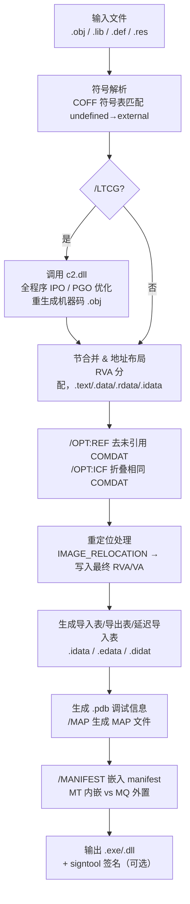
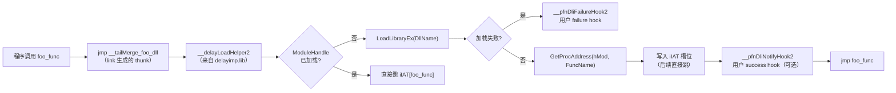

# 链接器详解（18）· Windows 链接器 link.exe 深度

## 概述与定位

> [!abstract] TL;DR
> - **link.exe** 是 MSVC 工具链附带的 Windows 专属链接器，输入 COFF `.obj` 文件和 import library `.lib`，输出 PE/COFF 可执行文件（`.exe`）、DLL 或静态库（`.lib`）。
> - **/DELAYLOAD** 实现**延迟加载 DLL**：首次调用函数时才由 `__delayLoadHelper2` 触发 `LoadLibrary`+`GetProcAddress`，应用程序可设 success/failure hook 拦截。
> - **/LTCG**（链接时代码生成）使链接器驱动跨编译单元的 IPO 优化，结合 **/LTCG:PGO** 还能把运行期 profile 数据反馈到 MSVC IR 优化。
> - **`/OPT:REF`** 移除未引用函数/数据，**`/OPT:ICF`** 折叠内容相同的节，二者组合是 Release 构建标配，可将包体减少 15%–40%。
> - **/INCREMENTAL** 通过 thunk 机制实现增量链接，加速开发迭代；发布构建应关闭以获得最小体积。

本篇处于「链接器详解」系列**平台专项**板块，紧接 [[17.Mach-O链接器ld64与ld-prime]]，从 macOS/Mach-O 转向 Windows/PE-COFF 视角，与 [[16.链接器插件API与LTO]] 的通用 LTO 机制互补（MSVC LTCG 是 Windows 专有实现）。

| 维度 | 本篇聚焦 | 相邻篇 |
|---|---|---|
| Windows 链接器 | link.exe 完整机制 | 本篇 |
| macOS 链接器 | ld64/ld-prime | [[17.Mach-O链接器ld64与ld-prime]] |
| 通用 LTO | LLVM ThinLTO/LTO | [[16.链接器插件API与LTO]] |
| PE/COFF 格式 | 节结构/重定位 | [[11.ELF文件详解]] 对照参考 |

---

## 原理与机制

### link.exe 概览

MSVC link.exe 随 Visual Studio / Build Tools 分发（位于 `%VSINSTALLDIR%\VC\Tools\MSVC\<ver>\bin\Hostx64\x64\link.exe`），是 Windows 官方 C/C++ 开发的默认链接器。其主要职责：

1. **输入处理**：读取 `.obj`（COFF 格式，含机器码 + 重定位表 + 符号表）、`.lib`（静态库 = COFF 目标文件 ar 归档，或 import library = 包含 DLL 导入存根）。
2. **符号解析**：在所有输入文件的 COFF 符号表中匹配未定义符号（`IMAGE_SYM_UNDEFINED`）与外部定义符号（`IMAGE_SYM_EXTERNAL`）。
3. **节合并 & 地址布局**：把各 `.obj` 的同类节（`.text`, `.data`, `.rdata`, `.bss`…）合并，按 PE 规范分配 RVA（相对虚拟地址）。
4. **重定位处理**：处理 COFF 重定位条目（`IMAGE_RELOCATION`），把 `.obj` 中的占位地址替换为最终 RVA/VA。
5. **生成导入表 / 导出表**：处理 `/DEF` 或 `__declspec(dllexport)`，生成 `IMAGE_EXPORT_DIRECTORY`；处理 import library，生成 `IMAGE_IMPORT_DESCRIPTOR`。
6. **可选阶段**：LTCG（重新编译 IR）、调试信息生成（`.pdb`）、清单嵌入（`/MANIFEST`）、codesign（SDK `signtool`）。

### /DELAYLOAD 延迟加载机制

`/DELAYLOAD:foo.dll` 告诉链接器：**不要在进程启动时加载 foo.dll，而是在首次调用其导出函数时才加载**。

#### 普通导入 vs 延迟导入

| 维度 | 普通导入（`IMAGE_IMPORT_DESCRIPTOR`） | 延迟导入（`IMAGE_DELAYLOAD_DESCRIPTOR`） |
|---|---|---|
| 加载时机 | 进程启动，Windows loader 统一加载 | 首次调用时，`__delayLoadHelper2` 按需加载 |
| 失败处理 | 进程无法启动（`STATUS_DLL_NOT_FOUND`） | 可通过 failure hook 捕获，返回替代值 |
| 内存开销 | 启动即分配 | 按需分配（未调用的函数不占 DLL 内存） |
| 适用场景 | 核心依赖 | 可选特性 DLL、插件、平台特定 API |

#### 延迟加载数据结构

链接器在 `.rdata` 中生成 `IMAGE_DELAYLOAD_DESCRIPTOR`（延迟导入描述符），包含：
- `DllNameRVA`：DLL 名称字符串的 RVA。
- `ModuleHandleRVA`：存放 `HMODULE` 的 RVA（首次加载后填充，供后续调用判断已加载）。
- `ImportAddressTableRVA`（iIAT）：延迟 IAT 的 RVA——首次调用前所有槽指向 `__delayLoadHelper2` 分支跳板；加载后被真实函数地址替换。
- `ImportNameTableRVA`（iINT）：函数名/序号表。
- `BoundImportAddressTableRVA`（iBound）：绑定后缓存（可选）。
- `UnloadInformationTableRVA`：卸载支持（可选，需 `/DELAY:UNLOAD`）。

#### 首次调用流程

```
call foo_in_delayed_dll
  ↓（thunk 跳转）
__delayLoadHelper2(pDelayDescriptor, pIATEntry)
  ↓
LoadLibraryEx("foo.dll", ...)
  ↓
GetProcAddress(hModule, "foo_func")
  ↓ 写入 iIAT 槽位
jmp foo_func  ← 后续直接跳，不再经过 helper
```

#### Success / Failure Hook

```cpp
// 注册 failure hook（DLL 加载失败时调用）
FARPROC WINAPI myFailureHook(unsigned dliNotify, PDelayLoadInfo pdli) {
    if (dliNotify == dliFailLoadLib) {
        // pdli->szDll = 失败的 DLL 名
        // 可返回替代 HMODULE 或 nullptr（触发 SE 异常）
        return (FARPROC)LoadLibraryA("fallback.dll");
    }
    return nullptr;
}
// link with /DELAYLOAD:target.dll delayimp.lib
ExternC const PfnDliHook __pfnDliFailureHook2 = myFailureHook;
```

`delayimp.lib` 提供 `__delayLoadHelper2` 实现，需显式链接。可通过 `__pfnDliNotifyHook2`（成功钩子）和 `__pfnDliFailureHook2`（失败钩子）自定义行为。

### .def 模块定义文件

`.def` 文件（Module Definition File）是描述 DLL 导出行为的文本格式，通过 `/DEF:foo.def` 传给链接器：

```
LIBRARY  "foo"
EXPORTS
    FooPublicAPI          @1               ; 导出并分配序号 1
    FooInternalHelper     @2 NONAME        ; 按序号导出，不进名称表（NONAME）
    FooAlias = FooPublicAPI                ; 别名导出
    DATA_SYMBOL DATA                       ; 数据符号导出（需标注 DATA）
```

关键指令：
- `LIBRARY`：声明 DLL 名，影响生成的 import library 的 DLL 名字段。
- `EXPORTS`：导出列表，每行一个符号，可指定序号（`@N`）、`NONAME`（按序号、不入名称表，减小导出表体积）、`PRIVATE`（内部使用，不进 import library）。
- 序号导出（`NONAME`）在游戏/嵌入式场景常见，可大幅缩减 `.rdata` 导出名称字符串区域。

与 `__declspec(dllexport)` 对比：`.def` 文件允许控制序号和别名，源码无侵入；`dllexport` 简洁但会导出装饰名（name mangling），需配合 `extern "C"` 或 `#pragma comment(linker, ...)` 抑制。

### Import Library 与 __declspec(dllimport)

**Import library**（`.lib`）不包含实际机器码，而是一系列 COFF 目标文件存根（stub），每个存根对应 DLL 的一个导出函数：

```
foo.lib 内部结构：
  ├── 归档成员 1：DLL 名字符串（"foo.dll"）
  ├── 归档成员 2：foo_func 的导入存根 COFF
  │     包含未定义符号 __imp_foo_func（指向 IAT 槽）
  │     包含 thunk 函数：call __imp_foo_func 的间接调用
  └── 归档成员 N：...
```

**`__declspec(dllimport)`** 告诉编译器对函数调用生成**间接调用**（`call [__imp_foo_func]`），而不是直接调用（`call foo_func`）：

```cpp
// 无 dllimport（对静态库函数）
call foo_func          ; 直接调用，链接器填入 RVA

// 有 dllimport（DLL 导入）
call QWORD PTR [__imp_foo_func]  ; 间接通过 IAT 槽调用
```

间接调用避免了一次 PLT 跳板（ELF 中的 `call foo@plt → PLT → [GOT]` 链路），Windows 将 IAT 直接嵌入 `.idata` 节，调用路径仅一次间接寻址。

### /LTCG：链接时代码生成

`/LTCG` 把 MSVC 编译器后端（`c2.dll`）嵌入链接阶段，在链接器掌握全部 `.obj` 输入后执行**跨模块 IPO**（过程间优化）：

```
编译（/GL 标志）：
  cl /GL foo.c → foo.obj（内含 MSIL/IR，非完整机器码）

链接（/LTCG）：
  link /LTCG foo.obj bar.obj → 链接器调用 c2.dll 
  → 跨模块内联、常量传播、虚函数去虚化
  → 生成最终机器码
```

`/GL`（全程序优化）是编译侧对应标志，输出"IR obj"而非完整机器码。

#### LTCG 变体

| 标志 | 含义 |
|---|---|
| `/LTCG` | 完整 LTCG，最慢但优化最彻底 |
| `/LTCG:INCREMENTAL` | 增量 LTCG，只重新优化变更模块，加速迭代构建 |
| `/LTCG:PGINSTRUMENT` | PGO 插桩构建：在代码中插入计数器，运行后产生 `.pgc` profile 文件 |
| `/LTCG:PGOPTIMIZE` | PGO 优化构建：读取 `.pgd`（合并后的 profile），据此指导内联/分支预测/代码布局 |
| `/LTCG:PGUPDATE` | 用新 profile 更新已有 PGO 优化构建，无需完整重编 |

**PGO 工作流**：
1. `link /LTCG:PGINSTRUMENT` → 产出插桩可执行文件。
2. 运行代表性测试场景，生成 `.pgc` 文件。
3. `pgomgr /merge *.pgc foo.pgd` 合并 profile。
4. `link /LTCG:PGOPTIMIZE /PGDATABASE:foo.pgd` → 产出 PGO 优化二进制。

### /OPT:REF 与 /OPT:ICF

这两个标志是 Release 构建的标配优化，Release 配置（`/MD /O2`）中 Visual Studio 默认启用。

**`/OPT:REF`**（Reference elimination）：链接器遍历所有 COFF `COMDAT`节（每个函数/数据单独一个 COMDAT，需编译时加 `/Gy`/`/Gw`），标记从入口可达的节，删除不可达的。效果类似 ELF `--gc-sections`。

**`/OPT:ICF`**（Identical COMDAT Folding）：把**内容完全相同**的 COMDAT 节合并为一个，所有引用重定向到保留节。减少代码/数据重复（模板实例化、inline 函数重复体）。`/OPT:ICF=N` 可指定迭代轮数（每轮折叠为下一轮创造新的相同节机会）。

```bash
# Release 构建标配
cl /O2 /GL /Gy /Gw foo.c bar.c
link /LTCG /OPT:REF /OPT:ICF foo.obj bar.obj /OUT:app.exe
```

注意：`/OPT:ICF` 会使**非虚函数的地址比较**失去意义（两个不同函数可能同地址），若代码依赖函数指针地址唯一性需关闭或谨慎使用。

### /INCREMENTAL：增量链接与 thunk

**增量链接**（`/INCREMENTAL`，Debug 配置默认启用）使链接器在重链接时**只处理变更的目标文件**，大幅加速开发迭代。

#### Thunk 机制

增量链接的关键技术是**increment thunk（增量跳板）**：

1. 链接器为每个函数预留一个 5 字节 `jmp rel32` thunk，thunk 与函数体相邻，函数体则分配在一个**预留的过大节**（padding）中。
2. 首次链接：thunk 跳转到函数体起始地址。
3. 重链接时，若函数体大小改变、超出原有空间：链接器把新函数体写到 padding 区，只更新 thunk 的跳转目标——**无需重写所有调用点的重定位**。

```
调用点: call FooThunk      ; 调用点不变
FooThunk: jmp [Foo_impl]   ; thunk 只更新这一处
Foo_impl: ...               ; 新函数体写到 padding 区
```

**代价**：每个调用多一次 `jmp`，轻微性能损失，且可执行文件体积增大（padding 占用空间）。发布构建应使用 `/INCREMENTAL:NO` 消除这些开销。

---

## 结构/算法/伪代码详解

### link.exe 链接流程



### /DELAYLOAD 延迟解析流程详解



### MAP 文件（/MAP）

`/MAP` 生成 `.map` 文件，列出：

```
Address        Publics by Value         Rva+Base         Lib:Object
0001:00000000  _main                    0000000140001000 main.obj
0001:00000060  _foo                     0000000140001060 foo.obj
...
 Static symbols
0001:000000A0  $LN3                     00000001400010A0 foo.obj
```

MAP 文件对手工分析崩溃地址（无 .pdb 时）极有价值：把 crash address 减去 `ImageBase`（通常 `0x140000000` 64位）得 RVA，在 MAP 中查找最近 Public symbol。

### ARM64EC 混合执行

ARM64EC（Emulation Compatible）是 Windows 11 on ARM 特有的 ABI，允许 ARM64 原生代码与 x64 模拟代码在**同一进程内**混合调用：

- **ARM64EC .obj** 含原生 ARM64 机器码，标记为 `IMAGE_FILE_MACHINE_ARM64EC`。
- **x64 .obj** 经 ARM64EC 工具链编译，生成 x64 机器码 + 特殊 EC（Entry/Exit）thunk。
- link.exe 构建 ARM64EC DLL 时，为每个导出函数生成**调用约定转换 thunk**，x64 模拟器调用时经 thunk 进入原生 ARM64EC 代码，反之亦然。
- 导入库（`.lib`）和 PE 导出表均包含 ARM64EC 和 x64 两套入口地址。

ARM64EC 使 ISV 可以逐模块迁移：应用程序主体保持 x64 模拟，将性能关键的 DLL 率先编译为 ARM64EC，无需整体迁移。

---

## 工具视角与实战

### 常用工具速查

| 工具 | 作用 | 示例 |
|---|---|---|
| `dumpbin /imports` | 查看导入表（含延迟导入） | `dumpbin /imports app.exe` |
| `dumpbin /exports` | 查看导出表 | `dumpbin /exports foo.dll` |
| `dumpbin /relocations` | 查看 `.obj` 重定位条目 | `dumpbin /relocations foo.obj` |
| `dumpbin /headers` | 查看 PE 头信息 | `dumpbin /headers app.exe` |
| `dumpbin /disasm` | 反汇编指定节 | `dumpbin /disasm:text app.exe` |
| `dumpbin /map` | 简略符号映射（不如 /MAP 详细） | `dumpbin /map app.exe` |
| `link /dump /all` | 等价 dumpbin 全输出 | `link /dump /all foo.dll` |
| `editbin /DELAYLOAD` | 事后为现有 PE 添加延迟导入（高级） | `editbin /DELAYLOAD:foo.dll app.exe` |

### DELAYLOAD 实战

```cpp
// foo.h
#pragma comment(lib, "foo.lib")
#pragma comment(lib, "delayimp.lib")
extern "C" __declspec(dllimport) int FooFunc(int x);

// main.cpp
#include <windows.h>
#include <delayimp.h>

// failure hook：找不到 DLL 时返回虚拟句柄
FARPROC WINAPI myFailHook(unsigned notify, PDelayLoadInfo pdli) {
    if (notify == dliFailLoadLib &&
        strcmp(pdli->szDll, "optional.dll") == 0) {
        // 返回一个替代模块或 nullptr（触发 SE 异常）
        return (FARPROC)GetModuleHandleA("fallback.dll");
    }
    return nullptr;
}
ExternC const PfnDliHook __pfnDliFailureHook2 = myFailHook;

int main() {
    // FooFunc 在首次调用前 optional.dll 未被加载
    if (SomeCondition()) {
        int r = FooFunc(42);  // ← 此处触发延迟加载
    }
}
```

链接命令（cl/link）：
```
cl /EHsc main.cpp /link /DELAYLOAD:optional.dll foo.lib delayimp.lib
```

### LTCG + PGO 工作流实战

```batch
:: 第一步：插桩构建
cl /O2 /GL /Gy *.cpp
link /LTCG:PGINSTRUMENT /OUT:app_instr.exe *.obj

:: 第二步：运行代表性测试场景（每次运行生成一个 .pgc 文件）
app_instr.exe --scenario benchmark
app_instr.exe --scenario typical_user

:: 第三步：合并 profile
pgomgr /merge app_instr!1.pgc app_instr!2.pgc app_instr.pgd

:: 第四步：PGO 优化构建
link /LTCG:PGOPTIMIZE /PGDATABASE:app_instr.pgd /OUT:app_pgo.exe *.obj
```

### 导出控制：.def vs __declspec

```cpp
// 方案1：源码标注（简洁但有名称修饰风险）
extern "C" __declspec(dllexport) int MyAPI(int x);

// 方案2：.def 文件（无侵入，可控序号和别名）
// foo.def:
// EXPORTS
//     MyAPI  @1
//     MyAPI2 @2 NONAME

// 链接
link /DLL /DEF:foo.def foo.obj /OUT:foo.dll
```

### link.exe 与 lld-link 对照

| 维度 | link.exe（MSVC） | lld-link（LLVM） |
|---|---|---|
| 性能 | 成熟，LTCG 与编译器深度集成 | 通常更快，尤其并行阶段 |
| LTCG | 调用 `c2.dll`，完整 MSVC IPO | 使用 LLVM ThinLTO |
| PDB 生成 | 完整支持 | 支持（使用 LLVM 的 CodeView 实现） |
| /DELAYLOAD | 完整支持，含 hook API | 支持（兼容 MSVC delayimp.lib） |
| ARM64EC | 完整支持 | 部分支持（持续完善） |
| /OPT:ICF | 支持 | 支持（`--icf=all`） |
| 调试信息格式 | CodeView + PDB | 同 |
| 与 GNU ld 差异 | 不支持 linker script；无 `.interp` 节；PE 加载器取代 ld.so | — |

---

## 安全性与正确使用

### /DELAYLOAD 的安全陷阱

- **DLL 搜索路径劫持（DLL Hijacking）**：延迟加载调用的是 `LoadLibraryEx` 带 `LOAD_WITH_ALTERED_SEARCH_PATH` 或默认搜索顺序，恶意 DLL 若位于应用程序目录或 PATH 前段，可能被优先加载。缓解：使用 `/DELAYLOAD` 配合 `SetDllDirectory("")` 收窄搜索路径，或在 failure hook 中验证 DLL 路径/签名。
- **Failure Hook 返回非 NULL**：若 failure hook 返回替代句柄，后续 `GetProcAddress` 依然在替代 DLL 上执行，替代 DLL 若无目标函数则引发 `GetProcAddress` 失败。确保替代 DLL 导出相同接口。
- **卸载支持（`/DELAY:UNLOAD`）**：用 `__FUnloadDelayLoadedDLL2` 主动卸载延迟加载的 DLL，但只有在所有函数调用均已退出后才能安全卸载；否则 iIAT 槽位仍保留已卸载模块的函数指针，下次调用崩溃。

### /OPT:ICF 与函数地址唯一性

`/OPT:ICF` 会把**内容完全相同**的函数合并为同一地址，破坏以下假设：

```cpp
bool isOriginal(void* funcPtr) {
    return funcPtr == (void*)&FunctionA;  // 折叠后 FunctionA == FunctionB
}
```

标准未要求不同函数有不同地址，但实践中部分框架（如某些 C++ ABI 实现、`typeid` 依赖虚表地址唯一性）可能依赖此假设。规避：`/OPT:NOICF` 或把函数标为 `__declspec(noinline) __declspec(noalias)` 使其内容独特化（插入 `__noop()`）。

### /INCREMENTAL 的已知局限

- 增量链接生成的可执行文件**不能保证最小体积**，padding 区域可占额外 10%–30% 空间。
- 若在同一增量链接会话中累积太多修改，链接器可能退化为**全量重链接**（输出 LNK4075 警告）。
- `/INCREMENTAL` 与 `/LTCG` 不兼容，两者同时指定时 LTCG 优先，增量链接静默禁用。

### .def 文件与 NONAME 的兼容性

- 按序号导出（`NONAME`）的函数无法通过 `GetProcAddress(hDll, "FuncName")` 获取，只能通过 `GetProcAddress(hDll, MAKEINTRESOURCE(ordinal))` 获取。若外部调用方使用名称查找，会得到 `nullptr`，导致 AV。
- 更改序号值会破坏已有二进制的按序号导入，必须视为 ABI breaking change。

### 与 GNU ld/ELF 的主要差异

| 维度 | link.exe（PE/COFF，Windows） | GNU ld / LLD（ELF，Linux） |
|---|---|---|
| 外部函数调用方式 | `call [__imp_foo]`（间接 IAT） | `call foo@plt`（PLT thunk → GOT） |
| 运行期加载器 | Windows Loader（kernel32）统一加载所有 DLL | ld.so（glibc）按需解析 |
| 延迟绑定 | 需显式 `/DELAYLOAD`（默认立即绑定） | 默认延迟绑定（lazy binding via PLT） |
| ASLR 基址修正 | PE `.reloc` 节（基址重定位表，4KB 页 WORD 位图） | ELF `.rela.dyn` RELATIVE 条目 |
| 符号 namespace | 平坦（同名符号按链接顺序覆盖） | 平坦；POSIX 扩展：version script 分版本 |
| 死代码消除粒度 | COMDAT（/Gy/Gw）+ /OPT:REF | COMDAT section + --gc-sections |
| 相同折叠 | /OPT:ICF | --icf=all（lld）/ Gold 部分支持 |
| 调试信息 | CodeView (.pdb)，外置 | DWARF（内嵌或 .debug 分离文件） |
| 链接脚本 | 不支持（有限 /BASE /SECTION 替代） | 完整 linker script |
| LTO | MSVC LTCG（c2.dll IPO）+ PGO | LLVM ThinLTO / GCC LTO |

---

## 小结

link.exe 是 Windows 原生 C/C++ 开发不可回避的链接器，其独特性集中在几个方面：`/DELAYLOAD` 把 DLL 加载时机推迟到首次调用，配合 failure/success hook 实现健壮的可选依赖管理；`.def` 文件提供无侵入的导出控制，序号导出可显著收窄公开 API 面；`/LTCG` 与 MSVC 编译器后端深度集成，实现完整跨模块 IPO 和 PGO 反馈优化；`/OPT:REF,ICF` 在 COMDAT 粒度上删除未引用符号和折叠相同代码，是 Release 包体优化的主力手段；`/INCREMENTAL` 通过 thunk 机制加速开发循环。与 ELF 体系最核心的差异在于调用约定（IAT 直接间接调用 vs PLT thunk）、默认绑定策略（立即 vs 延迟）以及 ASLR 修正格式（`.reloc` vs `.rela.dyn`）。理解这些机制是在 Windows 平台排查链接错误、优化构建性能与二进制体积的基础。

---

## 相关阅读

- **Mach-O 链接器 ld64/ld-prime（上一篇）**：[[17.Mach-O链接器ld64与ld-prime]]
- **下一篇**：[[19.ThinArchive与Map文件]]
- **链接器插件 API 与 LTO**：[[16.链接器插件API与LTO]]
- **链接期重定位（基础）**：[[06.链接期重定位]]
- **符号与符号解析**：[[03.符号与符号解析]]
- **节的合并与布局**：[[05.节的合并与布局]]

---

⬅️ 上一篇 [[17.Mach-O链接器ld64与ld-prime]] ｜ 🏠 [[00.链接器详解总览]] ｜ 下一篇 [[19.ThinArchive与Map文件]] ➡️
