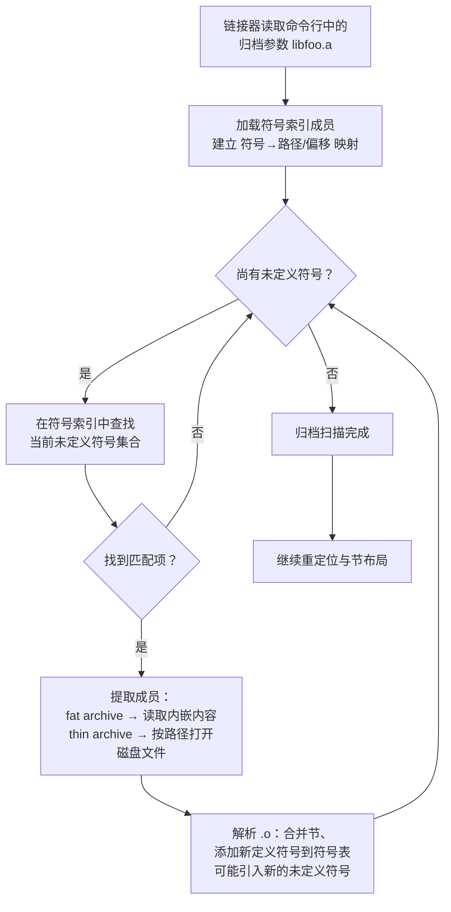
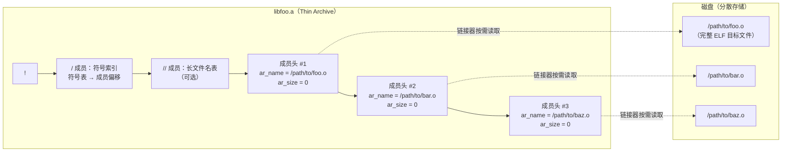

# 链接器详解（19）· Thin Archive 与 Map 文件

## 概述与定位

> [!abstract] TL;DR
> - **Thin Archive**（瘦归档）是 GNU `ar` 的一种变体格式：归档文件本身**不复制**成员的对象内容，只存储成员的**文件路径引用**；链接器按需直接从磁盘读取对应的 `.o`，从而在大型构建中大幅节省磁盘空间与 I/O 时间。
> - 与普通 `.a` 归档（包含完整成员内容）的本质差异在于：thin archive 是**索引 + 路径**，普通 archive 是**索引 + 内容**；thin archive 依赖成员文件在原位置存在，跨目录移动或打包分发时需特别处理。
> - **Map 文件**（`ld -Map=out.map` / MSVC `link /MAP`）是链接器在生成可执行文件的同时输出的**节与符号地址清单**，完整记录每个输入 `.o` 对最终二进制节的贡献、每个符号的最终虚拟地址、`--gc-sections` 删除了哪些节、哪些符号触发了哪个归档成员被拉入。
> - Map 文件是诊断**节膨胀**、**符号冲突**、**死代码确认**与**链接依赖追踪**的核心工具；结合 `--cref` 选项可生成交叉引用表，彻底厘清符号与目标文件之间的引用关系。
> - GNU ld、LLD、MSVC link.exe 三家 map 文件格式各有差异，但核心字段趋于统一；现代工具 `bloaty`、`nm`、`llvm-nm` 等可在 map 文件之外提供更结构化的尺寸分析视角。

本篇属于「链接器详解」系列的工具与诊断板块，承接 [[18.Windows链接器link.exe深度]]（MSVC 链接模型）、呼应 [[09.静态库与归档]] 和 [[03.符号与符号解析]]，帮助读者在真实的大型工程中快速定位体积与链接问题。

| 维度 | 本篇聚焦 | 相邻篇 |
|---|---|---|
| 上游 | 静态库归档格式与符号解析 | [[09.静态库与归档]]、[[03.符号与符号解析]] |
| 核心 | Thin Archive 结构 + Map 文件字段与诊断 | 本篇 |
| 下游 | 链接脚本对节布局的精细控制 | [[07.链接脚本]] |
| 工具链视角 | MSVC 链接器参数体系 | [[18.Windows链接器link.exe深度]] |
| 节合并与地址 | 节合并完成后的地址分配 | [[05.节的合并与布局]] |

---

## 原理与机制

### 普通归档（Fat Archive）的结构回顾

GNU `ar` 生成的普通静态库 `.a` 本质上是一个**顺序拼接的 ar 文件容器**。其整体结构如下：

```
!<arch>\n                      ← 魔数（8 字节）
/  [符号索引成员]               ← GNU 扩展：全局符号表
//  [长文件名成员（可选）]       ← 处理超过 15 字节的文件名
[成员头 60 字节]                ← 每个 .o 的元数据
[成员内容]                      ← .o 的完整二进制内容
[成员头]
[成员内容]
...
```

符号索引成员（`/`）存放了"符号名 → 成员文件偏移"的映射，使链接器能在不读取所有内容的前提下快速定位哪个 `.o` 定义了某个符号。

每个成员头（`ar_hdr`，60 字节）包含：

| 字段 | 字节数 | 说明 |
|---|---|---|
| `ar_name` | 16 | 成员文件名（超长时存 `/偏移` 形式） |
| `ar_date` | 12 | 最后修改时间（Unix 时间戳字符串） |
| `ar_uid` / `ar_gid` | 各 6 | 用户/组 ID（Windows 上通常为 0） |
| `ar_mode` | 8 | 文件权限（八进制字符串） |
| `ar_size` | 10 | 成员内容字节数 |
| `ar_fmag` | 2 | 结束标记 `` `\n `` |

**成员内容**即被完整嵌入：这正是"fat archive"得名之处——归档文件体积等于所有 `.o` 之和加上元数据开销。

---

### Thin Archive 的核心思想

Thin Archive 由 GNU `ar` 扩展引入，主要目的是服务于**超大型项目构建**（如 LLVM、Chromium、Linux kernel 模块集合）。其关键创新在于：

**成员头的 `ar_name` 字段改为存储 `.o` 文件的路径**，而**成员内容字段大小为 0**——归档文件本身不包含任何对象代码，只存储一张"路径索引 + 符号地址"表。

魔数也略有不同：thin archive 在文件头的特定位置携带 `T` 标记（具体实现依工具链版本而异，`llvm-ar` 使用独立的内部标记位）。

创建 thin archive：

```bash
# GNU ar：--thin 选项
ar --thin rcs libfoo.a foo.o bar.o baz.o

# LLVM ar（llvm-ar）：-T 选项（thin 语义相同）
llvm-ar -rcT libfoo.a foo.o bar.o baz.o

# 查看归档内容
ar tv libfoo.a          # 普通归档：显示成员大小
ar tvT libfoo.a         # thin 归档：成员大小显示为 0，路径为实际磁盘路径
```

链接器（`ld` / `lld`）在处理 thin archive 时的流程：

1. 读取归档头，识别 `T` 标记，知晓这是 thin archive。
2. 读取符号索引（`/` 成员），建立"符号名 → 成员路径"映射。
3. 符号解析阶段，当某个未定义符号在此归档中匹配到，直接按**路径**打开对应的 `.o` 文件，读取其完整内容进行链接。
4. 不需要的成员（符号未被引用）完全不读取，节省 I/O。

---

### 按需提取成员：符号解析循环

链接器对归档库（无论 fat 还是 thin）的扫描策略是相同的：**线性扫描符号索引，按需拉取成员**。



这个循环有一个重要性质：**归档库只扫描一次**（按命令行顺序）。如果库 A 的某个成员引用了库 B 中的符号，而库 B 在命令行中出现在库 A 之前，则链接时会报"未定义符号"错误。

解决方案：
- 重新排列命令行顺序（依赖靠右放）。
- 使用 `--start-group libA.a libB.a --end-group`（GNU ld）或 `--{start,end}-group`（等价），让链接器反复扫描该组直到无新符号被解析。
- 使用 `--whole-archive libfoo.a --no-whole-archive`：强制拉入归档中的全部成员，不做按需筛选（常用于插件框架或需要保留所有初始化代码的场景）。

---

### Thin Archive 的可移植性问题

Thin archive 依赖成员文件在**构建时的绝对或相对路径**仍然可访问，这带来若干实际陷阱：

**相对路径的歧义**：`ar` 在创建 thin archive 时，若使用相对路径添加成员（如 `ar --thin rcs ../../lib/libfoo.a obj/foo.o`），归档中记录的是相对于**归档文件所在目录**的路径。如果后续在不同目录调用链接器，路径解析可能失败。

**跨机器分发失败**：不同机器的构建目录不同，thin archive 直接打包给他人使用时，链接器找不到成员 `.o`，报 `No such file or directory`。分发时必须：
- 将 thin archive 转换为 fat archive：`ar --thin → ar（不带 --thin）`，或使用 `objcopy`。
- LLVM 工具链：`llvm-ar --flatten` 可将 thin archive 展开为 fat archive。

**`--sysroot` 与 thin archive**：在交叉编译场景下，`--sysroot` 不会自动重写 thin archive 中记录的绝对路径，需要额外的路径重映射或构建系统支持。

---

### LLD 对 Thin Archive 的支持

LLD（LLVM 链接器）自版本 4.0 起完整支持 GNU thin archive 格式：

- 读取由 `llvm-ar -T` 或 `ar --thin` 创建的归档。
- 按需解析路径，与 GNU ld 行为一致。
- 对于 LLVM Bitcode 成员（LTO 场景），thin archive + bitcode `.o` 是 ThinLTO 工作流的标准搭配：归档只存路径，LTO 后端按需读取 bitcode 执行跨文件优化，极大减少内存峰值。

`llvm-ar` 默认行为：不带 `-T` 时创建 fat archive；带 `-T` 时创建 thin archive。`llvm-ar` 的 `-s` 选项添加符号索引（等同 GNU ar 的 `s` modifier），thin archive 也需要符号索引才能被链接器按需检索。

---

## 结构/算法/伪代码详解

### Thin Archive 内部结构图示



符号索引成员（`/`）的二进制结构（GNU 扩展格式）：

```
[4 字节 big-endian]   符号条目总数 N
[N × 4 字节]          第 i 个符号所在成员的文件偏移（在归档文件内）
[N × NUL 终止字符串]  符号名称（按条目顺序排列）
```

对于 thin archive，"成员的文件偏移"指向的是**成员头**，成员头中的 `ar_name` 字段给出磁盘路径，`ar_size=0` 表示无嵌入内容。

---

### 链接器读取 Thin Archive 的伪代码

```python
def link_thin_archive(archive_path, undefined_syms, symbol_table):
    ar = open_archive(archive_path)
    magic = ar.read(8)
    assert magic == b"!<arch>\n"

    # 读取全局符号索引
    sym_index = parse_symbol_index(ar)  # 符号名 → 成员头偏移

    changed = True
    while changed:  # 反复扫描直到稳定（--start-group 语义）
        changed = False
        for sym in list(undefined_syms):
            if sym in sym_index:
                member_offset = sym_index[sym]
                member_hdr = ar.read_member_header(member_offset)

                if is_thin_archive(ar):
                    # thin archive：路径在 ar_name 字段，ar_size == 0
                    obj_path = resolve_path(archive_path, member_hdr.ar_name)
                    obj_data = open_and_read(obj_path)  # 直接读磁盘文件
                else:
                    # fat archive：内容紧跟成员头
                    obj_data = ar.read(member_hdr.ar_size)

                new_syms = parse_object_and_merge(obj_data, symbol_table)
                undefined_syms -= new_syms.defined
                undefined_syms |= (new_syms.referenced - symbol_table.all_defined)
                changed = True
```

关键差异仅在 `is_thin_archive` 分支：thin 路径走一次额外的磁盘 `open()`，fat 路径直接在归档文件内 `seek+read`。在 NFS 或远程文件系统上，thin archive 可能因额外的文件系统调用带来延迟；在本地 SSD 构建环境中，差异可以忽略不计。

---

## 工具视角与实战

### Map 文件：字段含义与生成

Map 文件是链接器生成的**人类可读的地址映射报告**，记录链接决策的完整结果。生成命令：

```bash
# GNU ld
ld -o app main.o libfoo.a -Map=app.map

# GCC 传递 -Map 给链接器
gcc -o app main.c -Wl,-Map=app.map

# Clang / LLD
clang -o app main.c -Wl,-Map,app.map

# MSVC link.exe
link /MAP:app.map /OUT:app.exe main.obj libfoo.lib
```

---

### GNU ld Map 文件结构解析

GNU ld map 文件的典型结构分为以下几个区段：

**（1）归档成员使用列表**

```
Archive member included to satisfy reference by file (symbol)

libfoo.a(bar.o)           main.o (bar_func)
libfoo.a(baz.o)           libfoo.a(bar.o) (baz_helper)
```

每一行说明：哪个归档成员**因为哪个文件引用了哪个符号**而被拉入链接。这是诊断"为何我的二进制里有这个模块"的直接依据。

**（2）内存段映射（Memory Map）**

```
.text           0x0000000000401000   0x2340
 .text          0x0000000000401000    0x120 /usr/lib/crt1.o
 .text          0x0000000000401120    0x80  main.o
 .text          0x00000000004011a0    0x40  libfoo.a(bar.o)
 .text          0x00000000004011e0    0x60  libfoo.a(baz.o)
```

字段含义：

| 字段 | 说明 |
|---|---|
| 节名（列1） | 输出节的名称（如 `.text`、`.data`、`.rodata`） |
| VMA（列2） | 虚拟内存地址（Virtual Memory Address），运行时地址 |
| 大小（列3） | 该输入节或符号占用的字节数 |
| 来源（列4） | 贡献此内容的 `.o` 文件（含归档名） |

某些链接脚本还会输出 LMA（Load Memory Address，加载地址），在嵌入式系统中 VMA 与 LMA 可以不同：LMA 是 ROM/Flash 中的存储地址，VMA 是运行时 RAM 中的执行地址。

**（3）符号地址表（Linker Symbols）**

```
0x0000000000401120                main
0x00000000004011a0                bar_func
0x0000000000404020                __bss_start
0x0000000000404020                _edata
0x0000000000404028                _end
```

`__bss_start`、`_edata`、`_end` 等是链接器自动生成的边界符号，常在启动代码中用于初始化 `.bss` 段（清零）或 C++ 全局构造函数调用（`__init_array_start`/`__init_array_end`）。

---

### LLD Map 文件

LLD 的 map 文件格式与 GNU ld 类似但有细微差异：

- 节膨胀列表格式更紧凑，来源目标文件直接跟在输入节名后面。
- LLD 不会像 GNU ld 那样输出"归档成员满足引用"列表，但 `--why-extract=` 选项（LLD 13+）提供等价信息：

```bash
lld -o app main.o libfoo.a --why-extract=why.txt
```

`why.txt` 每行格式：`<archive> <member> <symbol> <引用来源文件>`，语义与 GNU ld map 文件的归档引用段相同。

---

### MSVC link.exe Map 文件

MSVC 的 map 文件（`/MAP`）分段如下：

```
 Address         Publics by Value              Rva+Base               Lib:Object

 0001:00000000   _main                      00401000 f   main.obj
 0001:00000030   _bar_func                  00401030 f   libfoo.lib:bar.obj

 entry point at        0001:00000000

 Static symbols

 0001:00000060   _static_helper             00401060 f   main.obj
```

MSVC map 文件的 `Address` 字段格式为 `节编号:节内偏移`，而非 VMA，需要结合节基址（`Rva+Base`）才能得到运行时地址。`f` 标记表示该符号是函数（function），`i` 表示数据（data）。MSVC map 文件不直接显示"哪个 .obj 贡献了多少字节到某节"的细粒度信息，需借助 `/VERBOSE` 链接选项获取详细日志。

---

### 用 Map 文件诊断节膨胀

节膨胀（section bloat）指某个节（通常是 `.rodata` 或 `.text`）比预期大得多。诊断步骤：

```bash
# 1. 生成 map 文件
gcc -o app main.c -Wl,-Map=app.map -Wl,--gc-sections

# 2. 从 map 文件中提取 .rodata 贡献排行
grep "\.rodata" app.map | awk '{print $3, $4}' | sort -rn | head -20
```

也可以编写脚本解析 map 文件，按来源 `.o` 汇总各节贡献：

```python
import re, collections

# 解析 GNU ld map 文件的节贡献行
section_contributions = collections.defaultdict(int)
pattern = re.compile(
    r'^\s+\.\w+\s+(0x[0-9a-f]+)\s+(0x[0-9a-f]+)\s+(.+\.o)'
)
with open("app.map") as f:
    for line in f:
        m = pattern.match(line)
        if m:
            size = int(m.group(2), 16)
            obj = m.group(3).strip()
            section_contributions[obj] += size

for obj, size in sorted(section_contributions.items(),
                        key=lambda x: -x[1])[:20]:
    print(f"{size:8d}  {obj}")
```

---

### 用 Map 文件确认 `--gc-sections` 效果

`--gc-sections` 让链接器删除没有被任何引用链可达的节（每个函数/数据对象编译时需用 `-ffunction-sections -fdata-sections`）。Map 文件中被删除的节以特殊标记显示：

```
# GNU ld --gc-sections 在 map 文件中的删除记录示例
Discarded input sections

 .text.unused_func
                0x0000000000000000       0x28 libfoo.a(unused.o)
 .rodata.big_table
                0x0000000000000000      0x400 libfoo.a(tables.o)
```

通过对比有无 `--gc-sections` 的 map 文件，可以精确量化死代码体积。

---

### `--cref` 交叉引用表

```bash
gcc -o app main.c libfoo.a -Wl,-Map=app.map -Wl,--cref
```

`--cref` 在 map 文件末尾附加一张交叉引用表：

```
Cross Reference Table

Symbol                                            File
bar_func                                          libfoo.a(bar.o)
                                                  main.o
```

每个符号的第一行是**定义文件**，后续行是**引用该符号的文件列表**。这对于理解"为何某个 `.o` 被拉入"、追踪意外依赖链极为有效。

---

### 现代替代工具：bloaty 与 nm

**`bloaty`**（Google 开源）：直接分析 ELF/Mach-O 二进制，按文件/符号/节维度呈现尺寸树形视图，无需 map 文件：

```bash
bloaty app -- app_baseline  # diff 两个版本的尺寸变化
bloaty -d compileunits app  # 按编译单元分析贡献
bloaty -d symbols app       # 按符号分析体积
```

**`nm` / `llvm-nm`**：列出符号大小与类型，配合 `--print-size --size-sort` 可快速找到最大符号：

```bash
nm --print-size --size-sort --radix=d app | tail -20
```

**`size`**：快速显示各段总大小：

```bash
size app
   text    data     bss     dec     hex filename
  12456     512    1024   14048    36e0 app
```

这些工具与 map 文件互补：map 文件侧重**链接决策溯源**（为何拉入、地址是什么），现代工具侧重**量化分析**（谁占得最多、优化潜力在哪）。

---

## 安全性与正确使用

### Thin Archive 的正确使用与陷阱

**构建系统集成要点**

Thin archive 最适合在**构建树内部使用**，作为中间产物。CMake、Bazel 等构建系统在内部使用 thin archive 时，会保证归档文件与成员 `.o` 的相对路径稳定。不应将 thin archive 作为对外交付的库文件。

**陷阱一：`install(TARGETS)` 分发 thin archive**

如果 CMake 的 `install` 规则将 thin archive 直接安装到目标目录，而成员 `.o` 未一并安装，链接器在安装位置无法找到成员文件，报路径解析失败。解决方案：将 thin archive 转换为 fat archive 后再安装，或改用 CMake 的 `OBJECT` 库目标（直接链接对象文件集合，无需归档）。

**陷阱二：`ar` 版本不一致**

旧版 `ar`（binutils < 2.19）不支持 `--thin`，会静默创建空归档或报错。交叉编译工具链中 `ar` 与 `ld` 版本需匹配：用 `llvm-ar -T` 创建的 thin archive 应配合 `lld` 使用，而非旧版 GNU ld。

**陷阱三：并行构建的竞争写入**

同一目录下多个构建规则向同一 thin archive 追加成员（`ar --thin rs libfoo.a new.o`）可能产生竞争条件，因为 `ar` 更新符号索引是非原子操作。正确做法：构建系统在全部 `.o` 完成后一次性创建归档，而非增量追加。Ninja 和 Make 的默认行为通常符合此要求，但自定义构建脚本需注意。

**陷阱四：LTO + Thin Archive 的路径锁定**

ThinLTO 场景下，bitcode `.o` 在 thin archive 中的路径被固化到 LTO 缓存 key 中。如果构建目录发生变化（CI 机器路径不同），缓存失效率极高，需配合 `-fdebug-prefix-map` 或 CMake 的 `CMAKE_BUILD_RPATH` 等机制规范化路径。

---

### Map 文件的正确使用与陷阱

**陷阱一：地址在 PIE / ASLR 下无意义**

Map 文件中的 VMA 是**链接时假设的基址**下计算的地址（默认通常为 `0x400000` 对 ET_EXEC，或 `0x0` 对 PIE）。PIE 可执行文件运行时 ASLR 会随机偏移，map 文件中的地址与运行时实际地址相差一个随机 delta，不能直接用于调试时的断点地址（应使用 DWARF 调试信息或 `/proc/<pid>/maps` 获取运行时基址）。

**陷阱二：`--gc-sections` 与 map 文件节偏移**

`--gc-sections` 删除节后，map 文件中其余节的地址会相应移动，未启用此选项生成的 map 文件与启用后的 map 文件中地址不可直接比较。

**陷阱三：LLD map 文件与 GNU ld map 文件的格式差异**

解析脚本若直接移植 GNU ld map 的正则表达式到 LLD map 上，往往失配。LLD 的节行格式将节名、VMA、大小、来源放在不同列宽，且"归档成员引用"段不存在（需改用 `--why-extract=`）。

**正确实践：将 map 文件纳入 CI 尺寸监控**

在 CI 流水线中，每次构建生成 map 文件并通过脚本提取各关键节（`.text`、`.rodata`、`.data`、`.bss`）的总大小，与基线进行 diff，超过阈值时报警。这是嵌入式与移动端项目控制二进制体积膨胀最低成本的手段。

---

## 小结

Thin Archive 与 Map 文件是链接器工具链中两个性质相反但互补的设施：

- **Thin Archive** 作用于**输入侧**：减少归档体积、加速构建，但以成员文件路径可访问为前提。它适合用于大型项目构建树的内部中间产物，不适合对外分发。使用时核心注意点是路径稳定性、工具链版本匹配和避免并行写入竞争。

- **Map 文件**作用于**输出侧**：让链接决策透明化，记录节地址、符号来源、归档成员引用关系和死代码删除情况。它是节膨胀诊断、符号冲突排查和依赖链追踪的第一工具，应当在任何关注二进制体积的项目中常态化生成与监控。

两者结合使用时，可以在构建期（thin archive 加速生成 `.a`）与产物分析期（map 文件解析链接结果）形成完整的可见性闭环。在现代工具链生态中，`bloaty`、`llvm-nm`、`--why-extract=` 等工具进一步补充了 map 文件在量化分析与跨版本 diff 方面的不足。

---

## 相关阅读

- **静态库与归档基础**：[[09.静态库与归档]]
- **符号解析与归档扫描顺序**：[[03.符号与符号解析]]
- **节的合并与布局（地址分配）**：[[05.节的合并与布局]]
- **链接脚本（精细控制节地址与 LMA/VMA）**：[[07.链接脚本]]
- **`--gc-sections` 与节裁剪**：[[10.垃圾节消除与gc-sections]]
- **Windows 链接器 link.exe**：[[18.Windows链接器link.exe深度]]
- **链接器总览**：[[00.链接器详解总览]]
- **ELF 节结构详解**：[[11.ELF文件详解/00.ELF文件详解总索引.md]]
- **ThinLTO 与 LTO 优化**：[[16.LTO链接时优化]]

---

⬅️ 上一篇 [[18.Windows链接器link.exe深度]] ｜ 🏠 [[00.链接器详解总览]]
