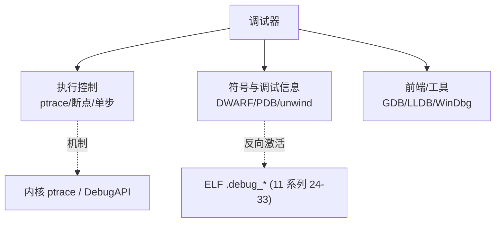

# 调试器原理与实战 · 系列总览

> 作者原创系列，共 **19** 篇。系统拆解调试器的底层机制（`ptrace`/断点/单步）、调试信息（DWARF/PDB/栈展开）、主流工具（GDB/LLDB/WinDbg/x64dbg），并落到反调试对抗与**手写一个 mini 调试器**。本系列**反向激活** [[11.ELF文件详解/24.debug节|ELF 的 .debug_* (DWARF) 一族]]，并与 [[14.动态链接与加载器详解/00.动态链接与加载器总览|动态链接与加载器]]、[[32.hooks/00.总览|Hook 技术]] 互补。

## 一、基础

| # | 章节 | 说明 |
| --- | --- | --- |
| 01 | [[01.调试器是什么]] | 调试器分类、架构、调试信息与被调试者的关系 |

## 二、调试机制

| # | 章节 | 说明 |
| --- | --- | --- |
| 02 | [[02.ptrace原理]] | Linux `ptrace`：attach、读写寄存器/内存、拦截信号 |
| 03 | [[03.断点原理]] | 软件断点 `int3`(0xCC)、硬件断点(DR0-7)、内存断点 |
| 04 | [[04.单步与执行控制]] | 单步(TF 标志)、continue、step over/into、观察点 |

## 三、符号与调试信息

| # | 章节 | 说明 |
| --- | --- | --- |
| 05 | [[05.调试信息DWARF]] | DWARF：`.debug_info`/`.debug_line`，地址↔源码↔变量 |
| 06 | [[06.PDB与Windows符号]] | PDB 格式、CodeView、符号服务器 |
| 07 | [[07.栈回溯unwind]] | 调用栈展开、`.eh_frame`/CFI、帧指针 vs 无帧指针 |

## 四、调试器实战

| # | 章节 | 说明 |
| --- | --- | --- |
| 08 | [[08.GDB原理与实战]] | GDB 架构、命令、Python API、远程协议 |
| 09 | [[09.LLDB原理与实战]] | LLDB 架构、与 GDB 对比、Python 脚本 |
| 10 | [[10.WinDbg与x64dbg]] | Windows 调试：WinDbg/x64dbg、调试 API |

## 五、进阶

| # | 章节 | 说明 |
| --- | --- | --- |
| 11 | [[11.调试器与反调试]] | 反调试技术与对抗（分析视角） |
| 12 | [[12.手写mini调试器]] | `ptrace` + 断点 + 单步，实现一个最小调试器 |
| 13 | [[13.远程与内核调试]] | gdbserver、kgdb、内核调试概念 |

## 六、进阶调试专题

| # | 章节 | 说明 |
| --- | --- | --- |
| 14 | [[14.Sanitizer调试]] | ASan/TSan/MSan/UBSan：影子内存、报错解读、与 GDB 结合 |
| 15 | [[15.eBPF动态调试]] | bpftrace/BCC、uprobe/USDT、生产环境低开销观测 |
| 16 | [[16.rr时间旅行调试]] | record/replay、反向执行、chaos 模式、对比 WinDbg TTD |
| 17 | [[17.JTAG与OpenOCD硬件调试]] | JTAG/SWD、探针选型、OpenOCD、硬件断点资源限制 |
| 18 | [[18.崩溃转储分析]] | Linux coredump / Windows minidump / macOS panic 符号化 |
| 19 | [[19.macOS内核调试]] | lldb + KDK、kdp-remote 双机、kext/panic 符号化 |

## 调试器的三大支柱

> 一句话：调试器 = **控制被调试进程的执行**（ptrace/断点/单步）+ **把地址翻译回源码**（DWARF/PDB）+ **友好的前端**。读完本系列，你能自己写一个。
