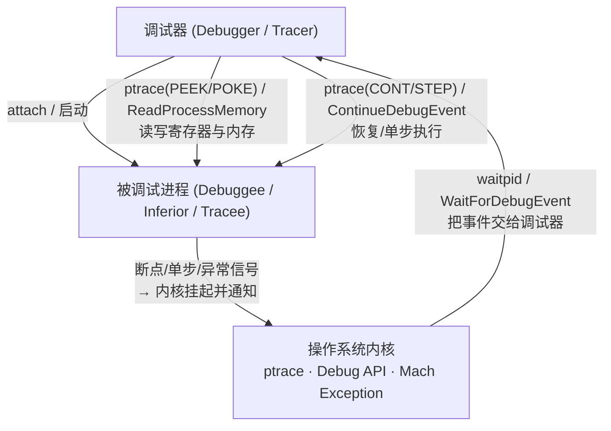
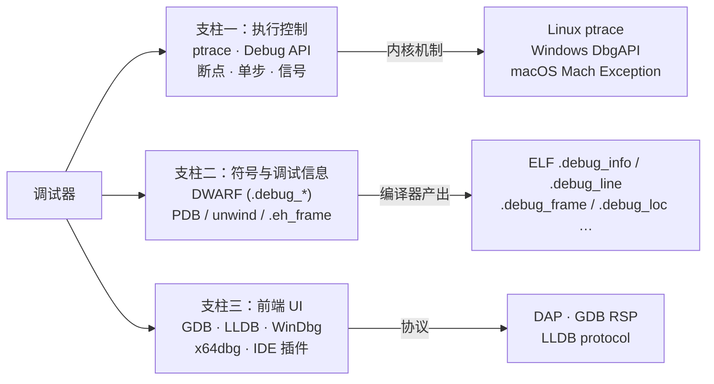
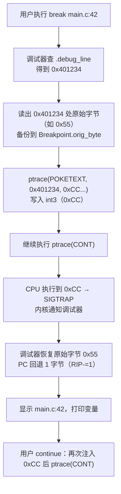
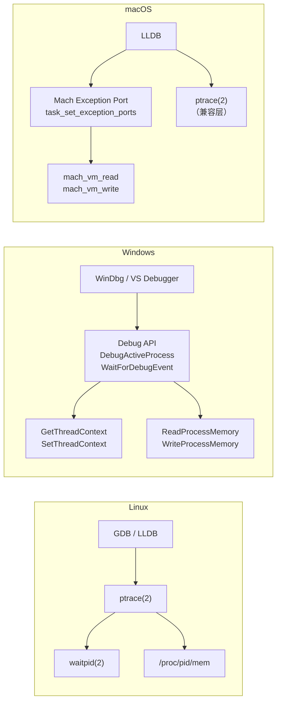

# 调试器原理与实战（1）· 调试器是什么

> [!abstract] TL;DR
> - 调试器是**控制程序执行 + 翻译地址为源码**的工具，两件事缺一不可。
> - 三大支柱：**执行控制**（ptrace / Debug API / mach exception）、**调试信息**（DWARF / PDB）、**前端 UI**（GDB / LLDB / WinDbg）。
> - 调试信息从编译时的 `-g` 标志来，落到 ELF 的 `.debug_*` 节（DWARF），Windows 的 `.pdb` 文件，或 macOS/dSYM bundle。
> - 操作系统的调试设施是调试器的根基：Linux `ptrace`、Windows Debug API、macOS Mach exception + ptrace 兼容层。
> - 本系列路线图：基础 → 机制（ptrace/断点/单步）→ 符号（DWARF/PDB/unwind）→ 工具（GDB/LLDB/WinDbg）→ 进阶（反调试/手写 mini 调试器/内核调试）。

---

## 概述与定位

### 什么是调试器

程序运行时崩溃，你怎么知道是哪一行出了问题？最原始的办法是 `printf`；稍微进阶一点是写日志；而真正的"时光机"是**调试器（Debugger）**。

一个调试器至少做两件事：

1. **控制被调试进程的执行**：让它在任意点暂停（断点）、单步前进、读写它的寄存器和内存。
2. **把机器地址翻译回人类可读的信息**：将 `0x401234` 这样的指令地址，还原为 `src/main.c:42 int x = foo();`，并告诉你此时各局部变量的值。

只有执行控制、没有符号翻译，你得到的只是一个十六进制转储器。只有符号翻译、没有执行控制，那只是一个反汇编器。**两者结合**，才是真正的调试器。

### 被调试进程（Debuggee / Inferior）

调试器把自己调试的目标进程称为 **debuggee**（GDB 文档另用 *inferior* 这个词——一个进程在多个 inferior 下可表现为多线程或多进程调试）。

二者的关系是**非对称的主从结构**：

- 调试器是**tracer（追踪者）**，拥有向操作系统请求"暂停目标/读写其地址空间/注入信号"的特权。
- 被调试进程是**tracee（被追踪者）**，在调试器的控制下运行，每次收到信号或触发断点时被内核挂起，将控制权交还给调试器。



> [!warning] 示例输出为示意
> 以上 Mermaid 图描述的是逻辑流程，非特定工具的实际输出。

---

## 调试器分类

### 按抽象层次：源码级 vs 汇编级

| 维度 | 源码级调试器 | 汇编级调试器 |
|---|---|---|
| 定位粒度 | 源码行号 / 变量名 | 机器指令地址 / 寄存器 |
| 依赖调试信息 | 必须有 DWARF / PDB | 无需调试信息（可选） |
| 典型工具 | GDB、LLDB、Visual Studio Debugger | x64dbg、OllyDbg、r2（radare2） |
| 主要场景 | 开发调试 | 逆向工程、恶意软件分析 |

两者并不互斥：GDB/LLDB 在有调试信息时工作在源码级，在没有时自动退化为汇编级。x64dbg 也能通过加载 PDB/调试符号获得一定源码级能力。

### 按位置：本地 vs 远程

**本地调试器**：调试器与被调试进程运行在同一台机器（同一内核）上。这是最常见的模式，`gdb ./a.out` 即本地调试。

**远程调试器**：调试器与被调试进程分属不同机器（或不同内核），通过网络协议通信。典型场景：

- 嵌入式/单板机：设备资源不够运行完整 GDB，在设备上跑 `gdbserver`，在 PC 上跑 GDB。
- 容器/VM 内程序调试。
- 内核调试：`kgdb` + 串口/KDNET，调试器在宿主，被调试内核在客机。

协议上，GDB 使用 **GDB Remote Serial Protocol (RSP)**，LLDB 实现兼容 RSP 的 `lldb-server`，WinDbg 远程内核模式使用 KDNET/USB/串口。

### 按特权级：用户态 vs 内核态

**用户态调试器**（User-mode Debugger）：调试用户空间进程，不能直接访问内核结构。所有调试操作经由系统调用（`ptrace`、`DebugBreak`）向内核请求。GDB、LLDB、WinDbg（用户模式）均属此类。

**内核态调试器**（Kernel Debugger）：调试内核本身或内核模块。需要额外硬件或特殊协议（JTAG、KVM、串口）。典型工具：Linux `kgdb`/`kdb`、Windows WinDbg（内核模式）、macOS lldbmacros/KDK。

### 按时间：实时调试 vs 时间旅行调试

**实时调试（Live Debugging）**：调试器与程序同步运行，暂停/恢复均作用于当前状态。这是默认模式。

**时间旅行调试（Time-Travel Debugging / Record and Replay）**：先对程序执行过程做**全量录制**（记录所有内存写入、系统调用、中断），形成执行日志；调试时可以**向前和向后**单步，回到任意历史状态。

| 工具 | 平台 | 机制 |
|---|---|---|
| WinDbg TTD（Time Travel Debugging） | Windows | 二进制插桩记录每条指令 |
| `rr`（Mozilla Record and Replay） | Linux | `perf_event` 硬件计数器 + 确定性回放 |
| UndoDB | Linux | 动态插桩（商业） |
| QEMU `replay` | 跨平台 | 虚拟机层记录 |

`rr` 的核心思路：用硬件性能计数器精确统计非确定性事件（如信号到达时间、I/O），回放时依照原始顺序确定性地重放，使得整个执行过程可以在任意位置双向单步。

---

## 调试器三大支柱



### 支柱一：执行控制

执行控制是调试器的**动力系统**——没有它，调试器只是个文本解析器。

**断点（Breakpoint）**：调试器在目标地址写入 `int3`（`0xCC`）指令（软件断点），CPU 执行到此触发 `SIGTRAP`（Linux）或调试异常（Windows），内核把控制权交给调试器。详见 `[[02.ptrace原理]]` 与第 03 篇。

**单步（Single Step）**：调试器设置 x86 EFLAGS 的 TF（Trap Flag）位，CPU 每执行一条指令就触发 `SIGTRAP`，调试器在此收到通知，可逐指令推进。

**内存/寄存器读写**：调试器可以在被调试进程暂停时，读取或修改其任意内存和寄存器——这是"查看变量值"和"修改运行时状态"的基础。

### 支柱二：符号与调试信息

执行控制给了你"暂停在 `0x401234`"的能力，但没有调试信息，你不知道这对应哪行源码、此时 `x` 的值是多少、调用栈是什么。

**DWARF**（Debug With Arbitrary Record Formats）是 Linux/macOS ELF 与 Mach-O 下的主流调试信息标准。它嵌入在 ELF 文件的 `.debug_*` 节族中（详见 [[11.ELF文件详解/24.debug节.md]]），包含：

- `.debug_info`：所有类型、函数、变量信息的 DIE 树
- `.debug_line`：PC 地址 ↔ 源码行号的映射表（行号状态机）
- `.debug_loc` / `.debug_loclists`：变量在不同 PC 范围内的运行时位置（寄存器 or 内存偏移）
- `.debug_frame` / `.eh_frame`：栈展开规则（CFI），支持 `backtrace`

**PDB**（Program Database）是 Windows 平台（MSVC/Clang-CL）对应的调试信息格式，存储在独立的 `.pdb` 文件中，通过符号服务器（Symbol Server）按需下载。

**调试信息从哪来**：编译时加 `-g` 标志（GCC/Clang），或 MSVC 的 `/Zi` / `/ZI`，编译器才会在目标文件中生成调试节。不带 `-g` 的 release 构建，`.debug_*` 节根本不存在，调试器只能看到汇编。


> [!warning] 示例输出为示意
> 上图为逻辑流程示意，地址 `0x401234` 等为虚构示例，非实际运行输出。

### 支柱三：前端 UI

调试器的前端决定**用户体验**，与底层机制分离：

- **CLI**：GDB、LLDB 的原生命令行界面；灵活、可脚本化（GDB Python API / LLDB Python SB API）。
- **TUI**：GDB 的 `layout src` 模式，在终端内并排显示源码与汇编。
- **IDE 集成**：VS Code 通过 **DAP（Debug Adapter Protocol）** 与调试后端通信，一套 UI 对接多种后端（cppdbg/CodeLLDB/cortex-debug）。
- **专用 GUI**：x64dbg（逆向向）、IDA Pro 内置调试器（反汇编向）、WinDbg（Windows 内核/用户态）。

---

## 操作系统提供的调试设施

### 三平台对照

| 维度 | Linux | Windows | macOS |
|---|---|---|---|
| 用户态调试核心 API | `ptrace(2)` 系统调用 | Windows Debug API：`DebugActiveProcess` / `WaitForDebugEvent` / `ContinueDebugEvent` | Mach exception port + `ptrace(2)`（兼容层） |
| 调试事件获取 | `waitpid(2)` | `WaitForDebugEvent` | `mach_msg` 接收 exception |
| 内存读写 | `ptrace(PTRACE_PEEKDATA/POKEDATA)` 或 `/proc/<pid>/mem` | `ReadProcessMemory` / `WriteProcessMemory` | `mach_vm_read` / `mach_vm_write` |
| 寄存器读写 | `ptrace(PTRACE_GETREGS/SETREGS)` | `GetThreadContext` / `SetThreadContext` | `thread_get_state` / `thread_set_state` |
| 单步机制 | `ptrace(PTRACE_SINGLESTEP)` 设 TF 位 | `CONTEXT.EFlags |= 0x100` 后 `ContinueDebugEvent` | Mach exception `EXC_BREAKPOINT` 单步 |
| 硬件断点 | `ptrace(PTRACE_SETREGS)` 写 DR0–DR7 | `CONTEXT.Dr0`–`CONTEXT.Dr7` | `thread_set_state`（debug 寄存器） |
| 内核调试 | `kgdb` / `kdb` + 串口/KGDB-over-USB | WinDbg 内核模式 + KDNET/COM/USB | lldb + KDK（Kernel Debug Kit）|
| 主流调试器 | GDB、LLDB | WinDbg、Visual Studio Debugger、x64dbg | LLDB、GDB（Homebrew） |

### Linux ptrace

`ptrace` 是 Linux 调试机制的**唯一根基**（`strace`、`GDB`、`rr`、`AddressSanitizer` 都经由它）。

调用原型：

```c
#include <sys/ptrace.h>
long ptrace(enum __ptrace_request request, pid_t pid,
            void *addr, void *data);
```

关键请求（`request`）：

| 请求 | 作用 |
|---|---|
| `PTRACE_ATTACH` | 附加到已运行进程（向其发 `SIGSTOP`） |
| `PTRACE_TRACEME` | 子进程声明"我愿被父进程调试"（`fork` + `exec` 启动时） |
| `PTRACE_PEEKTEXT` / `PTRACE_POKETEXT` | 读/写被调试进程的代码内存（用于注入 `int3`） |
| `PTRACE_PEEKDATA` / `PTRACE_POKEDATA` | 读/写被调试进程的数据内存 |
| `PTRACE_GETREGS` / `PTRACE_SETREGS` | 读/写通用寄存器（`user_regs_struct`） |
| `PTRACE_CONT` | 恢复执行（可附带注入的信号号） |
| `PTRACE_SINGLESTEP` | 单步执行一条指令后再次暂停 |
| `PTRACE_DETACH` | 解除附加，被调试进程恢复正常运行 |
| `PTRACE_SYSCALL` | 在每个 syscall 的入口/出口暂停（`strace` 的核心） |

`ptrace` 要求调试器与被调试者有亲属关系（`fork` 所得子进程）或满足 `ptrace_scope`（`/proc/sys/kernel/yama/ptrace_scope`）权限检查。

### Windows Debug API

Windows 没有 `ptrace` 等价的单一系统调用，而是提供了一套**调试 API**：

```c
// 附加到已运行进程
DebugActiveProcess(pid);

// 事件循环
DEBUG_EVENT dbgEvent;
while (WaitForDebugEvent(&dbgEvent, INFINITE)) {
    switch (dbgEvent.dwDebugEventCode) {
        case EXCEPTION_DEBUG_EVENT:
            // 断点、单步、访问违例等
            break;
        case CREATE_PROCESS_DEBUG_EVENT:
            // 进程创建
            break;
        // ... 其他事件
    }
    ContinueDebugEvent(dbgEvent.dwProcessId,
                       dbgEvent.dwThreadId,
                       DBG_CONTINUE);
}
```

内存读写通过 `ReadProcessMemory` / `WriteProcessMemory`；线程上下文（寄存器）通过 `GetThreadContext` / `SetThreadContext` 操作 `CONTEXT` 结构体。

### macOS Mach Exception

macOS 调试架构以 **Mach exception port** 为核心，而非 Unix 信号：

- 进程的异常（访问违例、断点、算术错误）通过 Mach 消息投递到注册了 exception handler 的 Mach port。
- 调试器通过 `task_set_exception_ports` 将自己注册为目标进程的 exception handler，此后所有异常都发到调试器。
- LLDB 在 macOS 上同时使用 Mach exception（主路）和 `ptrace`（兼容层，用于某些寄存器访问）。
- 内存访问：`mach_vm_read_overwrite` / `mach_vm_write`，比 Linux `ptrace PEEK/POKE` 效率更高（批量传输）。

---

## 数据结构与关键流程

### 调试器内部核心对象

| 对象 | 作用 |
|---|---|
| `Inferior` / `Process` | 被调试进程的抽象：PID、地址空间映射、共享库列表 |
| `Thread` | 被调试线程：TID、寄存器快照、当前 PC |
| `Breakpoint` | 断点：地址、原始字节备份（被 `0xCC` 替换前的字节）、条件、命中计数 |
| `SymbolFile` | 调试信息源：DWARF 解析器绑定到的文件，提供 `addr → src:line` 映射 |
| `Frame` | 调用栈帧：基于 CFI / `.eh_frame` 展开得到的每一层帧 |

### 断点的完整生命周期



> [!warning] 示例输出为示意
> 以上流程图中地址 `0x401234`、字节值 `0x55` 均为示意，非实际程序输出。

### 调试信息管道：从 `-g` 到"变量值"

1. **编译期**：`gcc -g` 让编译器在 `.o` 文件中生成 `.debug_info`（DIE 树，含变量的 `DW_AT_location`）、`.debug_line`（行号状态机）、`.debug_frame`（栈展开 CFI）等节——详见 [[11.ELF文件详解/24.debug节.md]]。
2. **链接期**：链接器合并各目标文件的 `.debug_*` 节，修正节内偏移，写入最终可执行文件。加载地址在 [[14.动态链接与加载器详解/02.程序加载全景.md]] 中详述。
3. **运行时**：调试器在 attach 后，读取可执行文件（及已加载 DSO）的 `.debug_*` 节，建立"地址 → 源码行 + 变量位置"的内部索引。
4. **暂停时**：调试器读取当前 PC，查 `.debug_line` 得到源码行；读取 `rbp`/`rsp`，按 `.debug_frame` CFI 规则展开调用栈；查 `.debug_info` 的 `DW_AT_location`（通常是 `DW_OP_fbreg -8`），用当前帧基址计算出变量实际地址，再 `ptrace(PEEKDATA)` 读出变量值。

---

## 三平台调试设施对照（详细）



> [!warning] 示例输出为示意
> 三平台架构图为概念示意，非工具实际输出。

---

## 实操：第一次用 GDB 感受三大支柱

```c
// hello.c
#include <stdio.h>
int add(int a, int b) { return a + b; }
int main() {
    int x = add(3, 4);
    printf("x = %d\n", x);
    return 0;
}
```

```bash
# 编译：-g 生成 DWARF 调试信息
gcc -g -o hello hello.c

# 启动 GDB（支柱三：前端）
gdb hello
```

```text
# 示例 GDB 会话（示意，非本机实跑）
(gdb) break main           # 设断点（支柱一：执行控制）
Breakpoint 1 at 0x401148: file hello.c, line 5.
                                              ↑ 支柱二：.debug_line 告诉 GDB 地址对应行号

(gdb) run
Breakpoint 1, main () at hello.c:5
5           int x = add(3, 4);

(gdb) step                 # 单步进入（支柱一）
add (a=3, b=4) at hello.c:3
3       int add(int a, int b) { return a + b; }

(gdb) info locals          # 查看局部变量（支柱二：.debug_info DW_AT_location）
a = 3
b = 4

(gdb) backtrace            # 调用栈（支柱二：.debug_frame CFI 展开）
#0  add (a=3, b=4) at hello.c:3
#1  0x0000000000401160 in main () at hello.c:5
```

> [!warning] 示例输出为示意
> 以上 GDB 输出为代表性示意，地址值（`0x401148` 等）为虚构，实际值因编译环境而异，本机（Windows）未实跑 Linux 工具。

---

## 本系列路线图


| 阶段 | 篇章 | 关键词 |
|---|---|---|
| **基础** | 01 | 分类、架构、OS 调试设施、调试信息来源 |
| **调试机制** | 02–04 | `ptrace`、`int3`/DR0-7、TF 单步、step-over |
| **符号与调试信息** | 05–07 | DWARF DIE / 行号状态机 / PDB / CFI unwind |
| **主流工具** | 08–10 | GDB Python API / LLDB SB API / WinDbg 脚本 |
| **进阶** | 11–13 | 反调试对抗、手写 mini 调试器、远程/内核调试 |

---

## 小结

- **调试器 = 执行控制 + 符号翻译**，三大支柱（执行控制 / 调试信息 / 前端）共同构成完整调试体验。
- **OS 调试设施**是根基：Linux `ptrace`、Windows Debug API、macOS Mach exception，本质上都提供"暂停进程 + 读写其状态 + 获取异常事件"三项能力。
- **调试信息从 `-g` 来**：不加 `-g` 的 release 构建没有 `.debug_*` 节，调试器只能看汇编。`.debug_*` 节族（DWARF）的详细结构见 [[11.ELF文件详解/24.debug节.md]]。
- **调试信息消费路径**：编译器写 `.debug_*` → 链接器合并 → 程序加载（见 [[14.动态链接与加载器详解/02.程序加载全景.md]]）→ 调试器读取 → 地址翻译为源码行 + 变量值。
- 下一篇 [[02.ptrace原理]] 将把 `ptrace` 每个请求的内核实现细节和使用陷阱全部拆开。

---

## 相关阅读

- **DWARF 调试信息总览**：[[11.ELF文件详解/24.debug节.md]]
- **DWARF 行号状态机**：[[11.ELF文件详解/27.debug_line节.md]]
- **DIE 树与变量信息**：[[11.ELF文件详解/26.debug_info节.md]]
- **栈展开 CFI**：[[11.ELF文件详解/46.eh_frame节.md]]、[[11.ELF文件详解/32.debug_frame节.md]]
- **程序加载全景**（调试信息加载入口）：[[14.动态链接与加载器详解/02.程序加载全景.md]]
- **GOT/PLT 与延迟绑定**（调试动态链接程序的上下文）：[[14.动态链接与加载器详解/08.PLT与GOT与延迟绑定.md]]
- **下一篇**：[[02.ptrace原理]]

---

⬅️ 上一篇 [[00.调试器原理与实战总览]] ｜ 🏠 [[00.调试器原理与实战总览]] ｜ 下一篇 [[02.ptrace原理]] ➡️
