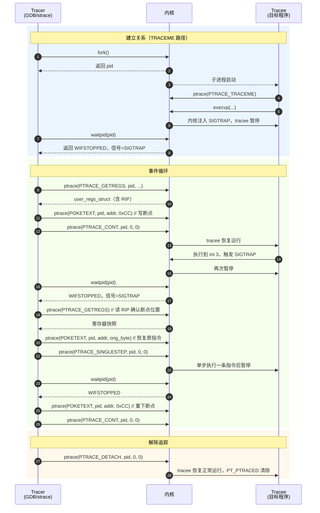

# 调试器原理与实战（2）· ptrace原理

> [!abstract] TL;DR
> - **`ptrace(2)` 是 Linux 调试器的基石**：一个进程（tracer）通过它可以完全控制另一个进程（tracee）的执行——读写内存、读写寄存器、单步、拦截系统调用。
> - **两条进入路径**：子进程自陈（`fork` + `PTRACE_TRACEME` + `exec`，GDB 的 `run` 命令走这条）；或附加运行中进程（`PTRACE_ATTACH`/`PTRACE_SEIZE`，GDB 的 `attach <pid>` 走这条）。
> - **核心循环**：tracee 每次停下（收到信号、单步完成、syscall 边界）时内核把它挂住，tracer 用 `waitpid` 收割状态，检查停下原因，操作内存/寄存器，再用 `PTRACE_CONT`/`PTRACE_SINGLESTEP` 放行。
> - **三平台一句话**：Linux 用 `ptrace(2)`；Windows 用 `DebugActiveProcess` + `WaitForDebugEvent` 事件循环；macOS 表面有 `ptrace` 但功能受限，底层依靠 Mach 异常端口（`task_get_exception_ports`）。
> - **安全门槛**：Yama LSM 的 `/proc/sys/kernel/yama/ptrace_scope` 在多数发行版默认值 `1`，限制"非父进程"的附加；容器/沙箱环境常设为 `2` 或 `3`。

本篇是系列第 2 篇。[[01.调试器是什么]] 给出了"调试器做什么"的整体图景，本篇向下一层：**Linux 上调试器底层具体靠什么系统调用实现控制**。理解 `ptrace` 是后续断点（[[03.断点原理]]）、单步、系统调用拦截乃至整个 mini 调试器的地基。涉及反调试与注入视角，可与 [[32.hooks/03-linux-hook.md]] 的 ptrace 注入节对读；进程如何被加载到可调试状态，参见 [[14.动态链接与加载器详解/02.程序加载全景.md]]。

---

## 概述与定位

### ptrace 是什么

`ptrace(2)` 是 Linux 内核提供的**进程追踪**系统调用，签名为：

```c
#include <sys/ptrace.h>

long ptrace(enum __ptrace_request request, pid_t pid,
            void *addr, void *data);
```

它既是调试器（GDB/LLDB on Linux）的核心原语，也是 `strace`（系统调用追踪）、`ltrace`（库函数追踪）、动态分析框架（frida on Android、pin、valgrind 的部分路径）的实现基础，甚至是 [[32.hooks/03-linux-hook.md]] 中"给运行中进程注入共享库"的手段。

`ptrace` 是一个**多路复用**系统调用：`request` 参数决定具体操作。主要请求分为五类：

| 类别 | 请求 | 用途 |
|---|---|---|
| 建立关系 | `PTRACE_TRACEME`、`PTRACE_ATTACH`、`PTRACE_SEIZE` | 让 tracer 获得对 tracee 的控制权 |
| 内存读写 | `PEEKTEXT`/`PEEKDATA`、`POKETEXT`/`POKEDATA` | 读写 tracee 虚拟内存 |
| 寄存器 | `GETREGS`/`SETREGS`、`GETREGSET`/`SETREGSET` | 读写 tracee 通用/浮点寄存器 |
| 执行控制 | `CONT`、`SINGLESTEP`、`SYSCALL`、`DETACH` | 控制 tracee 继续执行的模式 |
| 信息查询 | `GETSIGINFO`、`GETEVENTMSG`、`GETFPREGS` | 获取停止原因、浮点状态等 |

---

## 原理与机制

### tracer / tracee 关系

`ptrace` 建立一对一的控制关系：

- **tracer**：发出 `ptrace` 请求的调试进程（通常是 GDB、strace 等）。
- **tracee**：被追踪的目标进程。一个 tracee **同时只能有一个 tracer**；多个调试器同时 attach 同一进程会以 `EPERM` 失败。

内核为 tracee 设置一个内部标志（`PT_PTRACED`），此后 tracee 每次收到信号时，内核会先把它**暂停**（状态变为 `TASK_TRACED`）而不是直接投递信号，并通知 tracer 用 `waitpid` 来取状态。这是所有调试能力的根基。

### 路径一：子进程自陈（PTRACE_TRACEME）

GDB 执行 `run` 命令的底层流程：

```c
pid_t pid = fork();
if (pid == 0) {
    /* 子进程：声明自己愿意被追踪 */
    ptrace(PTRACE_TRACEME, 0, NULL, NULL);
    /* exec 后内核自动暂停（SIGTRAP），等待 tracer */
    execvp(argv[0], argv);
} else {
    /* 父进程：等待子进程在 exec 后的第一次停止 */
    waitpid(pid, &status, 0);
    /* 可以在这里设置选项、下断点，然后 CONT */
    ptrace(PTRACE_SETOPTIONS, pid, 0,
           PTRACE_O_EXITKILL | PTRACE_O_TRACESYSGOOD);
    /* ... 进入 waitpid 事件循环 */
}
```

`PTRACE_TRACEME` 的语义：

1. 子进程调用后，设置自己的 `PT_PTRACED` 标志。
2. 随后的 `execvp` 成功时，内核自动向子进程发送 `SIGTRAP`，使其停下（等待 tracer 的第一次 `waitpid`）。
3. 这一停止点正好落在**新程序第一条指令执行之前**（此时新镜像刚装载完成、动态链接器 `ld.so` 尚未运行，控制权还没真正交给用户程序；`ld.so` 的自举与初始化发生在这个停止点之后，细节见 [[14.动态链接与加载器详解/02.程序加载全景.md]]），是调试器设置初始断点的窗口。

### 路径二：附加运行中进程（PTRACE_ATTACH / PTRACE_SEIZE）

GDB 执行 `attach <pid>` 时：

```c
/* ATTACH：立即发送 SIGSTOP 停止 tracee */
ptrace(PTRACE_ATTACH, target_pid, NULL, NULL);
waitpid(target_pid, &status, 0);   /* 等它真正停下 */

/* 或者更新的 SEIZE：附加但不立刻停 */
ptrace(PTRACE_SEIZE, target_pid, NULL, PTRACE_O_TRACESYSGOOD);
ptrace(PTRACE_INTERRUPT, target_pid, NULL, NULL);   /* 稍后再停 */
waitpid(target_pid, &status, 0);
```

`PTRACE_ATTACH` 与 `PTRACE_SEIZE` 的差异：

| 维度 | `PTRACE_ATTACH` | `PTRACE_SEIZE` |
|---|---|---|
| 停止方式 | 立即发 `SIGSTOP`，tracee 在下一个安全点停下 | 不发 `SIGSTOP`，tracee 继续运行直到 `PTRACE_INTERRUPT` |
| 从 stop 恢复 | `PTRACE_CONT`（正常恢复） | `PTRACE_CONT` 或 `PTRACE_LISTEN`（针对组停信号） |
| 适用场景 | 传统附加，兼容性好 | 需要精细控制"何时才真正停"的工具（perf、frida 等）|
| 内核版本 | 远古 | Linux 3.4+ |

### Mermaid：tracer-tracee 交互时序



> **图解**：蓝色区是建立关系，绿色区是典型事件循环（设断点 → 命中 → 检查 → 单步跨过 → 恢复），橙色区是 detach。注意"ptrace 操作"和"waitpid 收割"必须交替进行——内核在 tracee 停止后等 tracer 响应，tracer 发出下一个控制请求必须先确认 tracee 已停下。

---

## 三平台对照

| 维度 | Linux（ptrace） | Windows（Debug API） | macOS（Mach 异常 + ptrace） |
|---|---|---|---|
| 建立追踪 | `PTRACE_TRACEME` / `PTRACE_ATTACH` / `PTRACE_SEIZE` | `DebugActiveProcess(pid)` 或 `CreateProcess(..., DEBUG_PROCESS, ...)` | `ptrace(PT_ATTACHEXC, pid)` + `task_get_exception_ports`；`PT_ATTACH` 基本弃用 |
| 事件等待 | `waitpid(pid, &status, 0)` | `WaitForDebugEvent(&event, INFINITE)` | `mach_msg()` 在异常处理端口等消息 |
| 事件类型 | `WIFSTOPPED`/`WIFEXITED`/`WIFSIGNALED`；信号号区分 SIGTRAP/SIGSTOP/SIGSEGV 等 | `CREATE_PROCESS_DEBUG_EVENT`、`EXCEPTION_DEBUG_EVENT`（含断点、单步）、`EXIT_PROCESS_DEBUG_EVENT` 等 | `EXC_BREAKPOINT`、`EXC_BAD_ACCESS`、`EXC_ARITHMETIC` 等 Mach 异常类型 |
| 读内存 | `PTRACE_PEEKTEXT/DATA`（每次 1 word）或 `/proc/<pid>/mem`（批量） | `ReadProcessMemory(hProc, addr, buf, len, &read)` | `mach_vm_read_overwrite(task, addr, size, buf, &out)` |
| 写内存 | `PTRACE_POKETEXT/DATA` 或 `/proc/<pid>/mem` | `WriteProcessMemory(hProc, addr, buf, len, &written)` | `mach_vm_write(task, addr, data, size)` |
| 读写寄存器 | `PTRACE_GETREGS`/`SETREGS`（`user_regs_struct`） | `GetThreadContext(hThread, &ctx)` / `SetThreadContext(hThread, &ctx)` | `thread_get_state(thread, x86_THREAD_STATE64, &state, &count)` |
| 单步 | `PTRACE_SINGLESTEP`（内核自动设 TF 标志位） | `ctx.EFlags |= 0x100` (TF) + `SetThreadContext` + `ContinueDebugEvent(DBG_CONTINUE)` | `thread_set_state` 设 `rflags.TF` + 回复 Mach 异常消息 |
| 系统调用拦截 | `PTRACE_SYSCALL`（进/出各停一次） | 无内置机制，需内核驱动或 ETW | `PT_SYSCALL`（macOS ptrace 子集，支持但能力有限） |
| 继续执行 | `PTRACE_CONT`（传信号号决定是否投递给 tracee） | `ContinueDebugEvent(pid, tid, DBG_CONTINUE / DBG_EXCEPTION_NOT_HANDLED)` | 回复 Mach 消息（`MACH_MSGH_BITS_REMOTE` 方向） |
| 解除追踪 | `PTRACE_DETACH`（tracee 继续） | `DebugActiveProcessStop(pid)` | `ptrace(PT_DETACH, pid, ...)` |
| 代表工具 | GDB、strace、frida（Linux）、perf | WinDbg、x64dbg、Visual Studio Debugger | LLDB（Mach 路径）、Instruments |

### Linux：ptrace 的优劣

**优势**：接口统一简单（一个系统调用覆盖所有操作）、无需额外权限（同 UID 可 attach）、`waitpid` 天然集成信号模型。

**劣势**：每次读写内存需一次系统调用（`PEEKTEXT` 一次只读一个机器字），批量读写性能差；多线程 tracee 时每个线程都需要单独追踪；`PTRACE_SINGLESTEP` 在 x86 之外某些架构需软件模拟。

### Windows：Debug API 的特点

Windows 调试模型更高层——`WaitForDebugEvent` 返回的事件结构（`DEBUG_EVENT`）已经把"断点命中"、"单步完成"、"模块加载"等封装成不同 `dwDebugEventCode`，调试器不需要自己解析信号号。`EXCEPTION_DEBUG_EVENT` 里的 `ExceptionCode` 对应 `EXCEPTION_BREAKPOINT`（int 3）、`EXCEPTION_SINGLE_STEP`（TF=1）等。内存读写通过 `ReadProcessMemory`/`WriteProcessMemory`，一次可读任意字节，效率远高于逐 word 的 `PEEKTEXT`。

### macOS：Mach 异常端口

macOS 内核（XNU）的调试通道以 **Mach 消息**为核心，而非 POSIX 信号：

1. 调试器调用 `task_get_exception_ports` 把目标进程的异常消息路由到自己控制的 Mach 端口。
2. 目标触发断点（`EXC_BREAKPOINT`）、内存错误（`EXC_BAD_ACCESS`）等时，内核向该端口发消息，目标线程挂起等待回复。
3. 调试器 `mach_msg` 接收消息，操作内存/寄存器，回复消息决定如何恢复（继续、单步、终止）。

macOS 的 `ptrace` 系统调用保留了 `PT_ATTACHEXC`（把异常通道切到 ptrace 机制）、`PT_GETREGS`/`PT_SETREGS` 等子集，但 Apple 沙箱（`com.apple.security.cs.debugger` 权限）和 SIP（System Integrity Protection）对调试权限有严格限制——这也是 LLDB 在 macOS 上主要走 Mach 异常路径的根因。

---

## 数据结构 / 流程详解

### user_regs_struct：x86-64 寄存器快照

`PTRACE_GETREGS` / `PTRACE_SETREGS` 使用 `<sys/user.h>` 定义的结构体：

```c
struct user_regs_struct {
    unsigned long long r15, r14, r13, r12;
    unsigned long long rbp, rbx;
    unsigned long long r11, r10, r9, r8;
    unsigned long long rax, rcx, rdx, rsi, rdi;
    unsigned long long orig_rax;   /* syscall 号（syscall 拦截用）*/
    unsigned long long rip;        /* 指令指针——断点命中时 rip = int3后一字节 */
    unsigned long long cs;
    unsigned long long eflags;     /* 含 TF（Trap Flag，单步控制）*/
    unsigned long long rsp, ss;
    unsigned long long fs_base, gs_base;
    unsigned long long ds, es, fs, gs;
};
```

调试器最常用的字段：

- **`rip`**：命中 `int 3` 断点时，`rip` 已推进到 `int 3` 的**下一字节**（因为 `int 3` 是单字节指令 `0xCC`，CPU 执行后 rip 自增 1）。调试器必须把 `rip - 1` 设回去再恢复。
- **`eflags`** 的第 8 位（TF，Trap Flag）：置 1 后 CPU 每执行一条指令就触发 `#DB` 调试异常（单步）。`PTRACE_SINGLESTEP` 在内部就是内核帮你置 TF 后 `CONT`。
- **`orig_rax`**：进入系统调用时，内核把系统调用号保存到这里（`rax` 此时存返回值），`PTRACE_SYSCALL` 停下时据此判断是哪个 syscall。

现代内核也支持 `PTRACE_GETREGSET` / `PTRACE_SETREGSET`（传 `iovec` + `NT_PRSTATUS` 等 note 类型），比 `GETREGS` 更通用，可以读浮点/AVX 寄存器、支持跨架构调试器。

### PEEKTEXT/POKETEXT vs /proc/\<pid\>/mem

`PTRACE_PEEKTEXT` 每次仅读一个机器字（x86-64 上 8 字节），且每次都是一次系统调用，读大块内存（如整段代码、堆）效率极差。现代调试器更多使用：

```c
/* /proc/<pid>/mem：批量读取 tracee 虚拟内存 */
char path[64];
snprintf(path, sizeof(path), "/proc/%d/mem", tracee_pid);
int fd = open(path, O_RDWR);
pread(fd, buf, nbytes, (off_t)target_addr);   /* 读 nbytes 字节 */
pwrite(fd, patch, 1, (off_t)target_addr);     /* 写断点字节 0xCC */
close(fd);
```

`/proc/<pid>/mem` 的要求：
- 操作者必须已是该进程的 tracer（否则内核拒绝 `pread`/`pwrite`）。
- tracee 必须处于 stopped 状态（否则读到的内容可能与执行不一致）。
- 偏移量必须是有效映射地址，否则 `EIO`。

GDB 内部同时维护两种路径：addr 对齐时走 `PEEKTEXT`，需要读大块或不对齐时走 `/proc/<pid>/mem`。

### waitpid 状态解析

`waitpid` 返回后，用宏检查 `status` 值：

```c
int status;
pid_t w = waitpid(tracee_pid, &status, 0);

if (WIFSTOPPED(status)) {
    int sig = WSTOPSIG(status);           /* 停止信号号 */
    if (sig == SIGTRAP) {
        /* 断点/单步/exec/syscall 停止 */
        int event = (status >> 16) & 0xFF;   /* ptrace 扩展事件 */
        if (event == PTRACE_EVENT_EXEC)  { /* 新程序加载完成 */ }
        if (event == PTRACE_EVENT_FORK)  { /* 子进程被创建 */ }
        if (event == PTRACE_EVENT_EXIT)  { /* 即将退出 */ }
    } else if (sig == SIGSTOP) {
        /* ATTACH 后的初始停止，或 PTRACE_INTERRUPT 触发 */
    }
    /* 继续 or 单步 */
    ptrace(PTRACE_CONT, tracee_pid, NULL, (void*)(long)forwarded_sig);
} else if (WIFEXITED(status)) {
    printf("Tracee exited with code %d\n", WEXITSTATUS(status));
} else if (WIFSIGNALED(status)) {
    printf("Tracee killed by signal %d\n", WTERMSIG(status));
}
```

`PTRACE_CONT` 的第四个参数是**可选的"转发信号"**：传 0 表示"不把停止的信号投递给 tracee"（调试器消费掉），传信号号则投递（用于"把 SIGSEGV 真的发给目标"等场景）。这是调试器实现"信号穿透"（pass/nopass）功能的接口。

### 核心执行控制请求

| 请求 | 语义 | 常见用途 |
|---|---|---|
| `PTRACE_CONT` | 恢复 tracee，遇信号再停 | 断点之间自由运行 |
| `PTRACE_SINGLESTEP` | 恢复但只执行一条指令（内核置 TF） | 逐指令调试、跨过断点的"先单步再重下" |
| `PTRACE_SYSCALL` | 恢复到下一个系统调用进入/退出时停止 | strace 拦截系统调用 |
| `PTRACE_SYSEMU` | 仿真模式：在 syscall 入口停止，不执行 | qemu-user、seccomp 沙箱实现 |
| `PTRACE_DETACH` | 解除追踪，tracee 恢复正常执行 | detach / 让程序自由运行 |
| `PTRACE_KILL` | 向 tracee 发 SIGKILL | 强制终止 |

---

## 代码与示例

### 最小 C 框架：fork + TRACEME + exec 路径

```c
/*
 * mini_tracer.c ── 最小 ptrace 调试框架（x86-64 Linux）
 * 用法: ./mini_tracer /bin/ls
 * 效果: 在 ls 执行期间拦截每条系统调用并打印系统调用号
 */
#include <sys/ptrace.h>
#include <sys/wait.h>
#include <sys/user.h>
#include <unistd.h>
#include <stdio.h>
#include <stdlib.h>

int main(int argc, char *argv[]) {
    if (argc < 2) { fprintf(stderr, "usage: %s <prog>\n", argv[0]); return 1; }

    pid_t pid = fork();
    if (pid < 0) { perror("fork"); return 1; }

    if (pid == 0) {
        /* ── 子进程（tracee）──────────────── */
        ptrace(PTRACE_TRACEME, 0, NULL, NULL);
        execvp(argv[1], argv + 1);   /* exec 后内核自动 SIGTRAP */
        perror("execvp"); _exit(1);
    }

    /* ── 父进程（tracer）──────────────── */
    int status;
    waitpid(pid, &status, 0);   /* 等 exec 后的初始 SIGTRAP */

    /* 设置 PTRACE_O_TRACESYSGOOD：系统调用停止时 WSTOPSIG 返回 SIGTRAP|0x80 */
    ptrace(PTRACE_SETOPTIONS, pid, 0, PTRACE_O_TRACESYSGOOD);

    while (1) {
        /* 让 tracee 运行到下一个 syscall 进/出边界 */
        ptrace(PTRACE_SYSCALL, pid, NULL, NULL);
        waitpid(pid, &status, 0);

        if (WIFEXITED(status) || WIFSIGNALED(status)) break;

        if (WIFSTOPPED(status) && (WSTOPSIG(status) == (SIGTRAP | 0x80))) {
            struct user_regs_struct regs;
            ptrace(PTRACE_GETREGS, pid, NULL, &regs);
            /* orig_rax = syscall 号（syscall 入口），rax = 返回值（syscall 出口）*/
            printf("syscall %lld\n", (long long)regs.orig_rax);
        }
    }
    printf("Tracee exited.\n");
    return 0;
}
```

> [!warning] 示例输出为示意
> 上述代码在 Linux x86-64 编译运行，`gcc mini_tracer.c -o mini_tracer && ./mini_tracer /bin/ls`，会在终端打印 ls 执行期间调用的系统调用号（如 `execve=59`、`openat=257`、`write=1` 等）。输出数量、顺序随 libc 版本与内核版本变化，不代表固定值。本机为 Windows，示例为 Linux 原理示意，不可在本机直接运行。

### 最小 C 框架：PTRACE_ATTACH 附加运行中进程

```c
/*
 * mini_attach.c ── attach 到运行中进程，读取 RIP 后立即 detach
 * 用法: sudo ./mini_attach <pid>
 */
#include <sys/ptrace.h>
#include <sys/wait.h>
#include <sys/user.h>
#include <unistd.h>
#include <stdio.h>
#include <stdlib.h>

int main(int argc, char *argv[]) {
    pid_t pid = atoi(argv[1]);
    int status;

    if (ptrace(PTRACE_ATTACH, pid, NULL, NULL) < 0) {
        perror("PTRACE_ATTACH"); return 1;
    }
    waitpid(pid, &status, 0);          /* 等 SIGSTOP 到位 */

    struct user_regs_struct regs;
    ptrace(PTRACE_GETREGS, pid, NULL, &regs);
    printf("pid %d stopped at RIP = 0x%llx\n", pid, (unsigned long long)regs.rip);

    ptrace(PTRACE_DETACH, pid, NULL, NULL);   /* 恢复运行 */
    return 0;
}
```

> [!warning] 示例输出为示意
> 此代码需要 root 或 `ptrace_scope=0` 环境。真实输出如 `pid 12345 stopped at RIP = 0x7f3abc123456`，地址因 ASLR 每次不同。

---

## ptrace_scope：Yama LSM 安全限制

> [!warning] 默认配置即可能拒绝 attach
> Ubuntu 22.04 LTS、Debian 12 等发行版默认 `ptrace_scope=1`，**`PTRACE_ATTACH` 只允许父进程（或 root）**；非父进程 attach 会得到 `EPERM`。开发调试时遇到此问题，可临时改为 `0`，但生产机上不要这样做。

`/proc/sys/kernel/yama/ptrace_scope` 的四个级别：

| 值 | 限制 | 场景 |
|---|---|---|
| `0` | 无限制，同 UID 均可 attach | 开发机、旧版内核默认值 |
| `1` | 只允许 attach 自己的子进程（或有 `CAP_SYS_PTRACE`）| Ubuntu/Debian 发行版默认 |
| `2` | 只允许有 `CAP_SYS_PTRACE` 的进程（root 专属）| 高安全服务器 |
| `3` | 完全禁用 ptrace，重启才能恢复 | 容器/沙箱内核配置 |

临时修改（需 root）：

```bash
# 改为 0，允许同 UID 任意 attach（开发调试用）
echo 0 | sudo tee /proc/sys/kernel/yama/ptrace_scope
```

永久修改（写入 sysctl.conf）：

```text
# /etc/sysctl.d/10-ptrace.conf
kernel.yama.ptrace_scope = 0
```

此外还有两点限制值得注意：

- **setuid/setgid 程序**：即使 `ptrace_scope=0`，attach setuid 程序也通常需要 root。
- **seccomp 过滤**：部分容器运行时（Docker 默认 seccomp profile）会过滤 `ptrace` 系统调用本身，使其在容器内不可用，与 Yama 是独立的两道门。

---

## 实操：strace 内部走的就是这条路

```bash
strace -p <pid>
```

`strace` 本质上就是上面「最小 C 框架」里 `PTRACE_SYSCALL` 循环的完整实现，还额外做了：

- 解析 `orig_rax` 映射到系统调用名（靠编译期嵌入的 syscall table）。
- 解析参数寄存器（`rdi/rsi/rdx/rcx/r8/r9`）并格式化打印（字符串、flags、fd 等）。
- 区分 syscall 进/出（进入时 `rax` 是调用号，退出时 `orig_rax` 是调用号、`rax` 是返回值）。
- 处理多线程（`-f` 模式：给所有子线程也设 `PTRACE_O_TRACECLONE`）。

```text
# 示例输出（代表性，非本机实跑）
$ strace /bin/ls /tmp
execve("/bin/ls", ["/bin/ls", "/tmp"], 0x... /* 42 vars */) = 0
brk(NULL)                               = 0x55e...
openat(AT_FDCWD, "/etc/ld.so.cache", O_RDONLY|O_CLOEXEC) = 3
fstat(3, {st_mode=S_IFREG|0644, st_size=...}) = 0
...
write(1, "file1\nfile2\n", 12)           = 12
+++ exited with 0 +++
```

> [!warning] 示例输出为示意
> 真实 strace 输出随内核版本、libc 版本、文件系统状态而变化，地址、大小、系统调用顺序均非固定值，以本机实跑为准。

---

## 小结

1. **`ptrace` = 内核提供的"上帝模式"接口**：任何断点、单步、寄存器检视、内存读写，都通过它完成。理解它就理解了 Linux 上一切调试器的工作方式。
2. **两条建立路径**：`PTRACE_TRACEME`（子进程主动声明）用于启动调试；`PTRACE_ATTACH`/`PTRACE_SEIZE`（外部附加）用于运行中进程。两者最终都进入同一个 `waitpid` + `ptrace` 控制循环。
3. **核心循环结构**：tracee 停下 → `waitpid` 收割 → 检查原因 → 操作内存/寄存器 → 发出下一个执行控制请求。这个结构是 [[03.断点原理]] 里"命中断点后单步恢复"机制的直接载体。
4. **内存读写两种方式**：`PEEKTEXT`/`POKETEXT` 简单但每次一个 word；`/proc/<pid>/mem` 批量高效，是 GDB 等工具的首选路径。
5. **三平台机制各异**：Linux 的 `ptrace` 最裸、最统一；Windows Debug API 封装了更多事件类型；macOS 走 Mach 异常端口路径，受 SIP/沙箱限制最严格。
6. **`ptrace_scope` 是第一道防线**：生产环境默认值 `1` 会让非父进程 `PTRACE_ATTACH` 失败；反调试检测（`[[03.断点原理]]` 之后会讲）也常利用这一点。

---

## 相关阅读

- **下游：断点是怎么实现的** → [[03.断点原理]]
- **上游：调试器的整体定位** → [[01.调试器是什么]]
- **ptrace 注入共享库的完整示例** → [[32.hooks/03-linux-hook.md]]（第 3 节"ptrace 给运行中进程注入"）
- **进程被加载到可调试状态的全过程** → [[14.动态链接与加载器详解/02.程序加载全景.md]]
- **DWARF 调试信息（符号篇基础）** → [[11.ELF文件详解/24.debug节.md]]
- **栈展开（unwind，调用栈显示的基础）** → [[11.ELF文件详解/46.eh_frame节.md]]
- **手册**：`man 2 ptrace`、`man 5 proc`（`/proc/<pid>/mem` 的 `ptrace` 依赖说明）

---

⬅️ 上一篇 [[01.调试器是什么]] ｜ 🏠 [[00.调试器原理与实战总览]] ｜ 下一篇 [[03.断点原理]] ➡️
