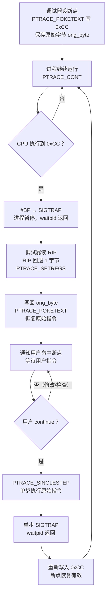

# 调试器原理与实战（3）· 断点原理

> [!abstract] TL;DR
> - **软件断点**：把目标指令的首字节替换为 `int3`（`0xCC`），CPU 执行到时触发 `#BP` 异常 → `SIGTRAP`；调试器捕获后把原字节写回、把 RIP 回退 1 字节，可选单步执行原指令再重新埋下 `0xCC`。代价极低，可设无数个。
> - **硬件断点**：用 CPU 提供的调试寄存器 `DR0–DR3`（存地址）+ `DR7`（控制：启用位 / 触发条件 / 操作数长度），最多同时 4 个，可不修改代码内存、适用于 ROM/只读页面，也是**数据观察点**的实现基础。
> - **内存断点 / 观察点**：用 `mprotect` 去除页面读/写权限，访问时触发 `SIGSEGV`，调试器截获后恢复权限再做检查；或直接用硬件 DR 的写/读写触发类型，效率更高。
> - **条件断点**：命中普通断点后在调试器侧求值条件表达式，不满足则透明继续——是纯软件叠加层，不是独立的 CPU 机制。
> - **三平台**：Linux 用 `ptrace(PTRACE_POKETEXT/…)` 读写断点字节 + DR；Windows 用 `WriteProcessMemory` + `SetThreadContext(CONTEXT.Dr*)` ；macOS 用 `vm_write` + `thread_set_state`；ARM 用 `BRK` 指令替代 `int3`，硬件观察点靠 CP14/AArch64 debug 寄存器。

本篇聚焦"断点是怎么做到的"——从机器码层面的 `0xCC`，到 CPU 异常/信号传递，到调试器的命中-恢复-重埋循环，再到硬件调试寄存器的控制位布局，以及三平台的差异。与 [[02.ptrace原理]] 联读效果最好：ptrace 是"控制接口"，本篇是"断点的载荷"。

---

## 概述与定位

断点是调试器最核心的原语。它让程序在特定位置"暂停"，把控制权交还调试器，同时保证程序状态（寄存器、内存、栈）可被检查、可被修改、可被恢复继续。

断点的实现横跨三个层次：

| 层次 | 机制 | 代表 |
|---|---|---|
| CPU/硬件 | 断点异常 `#BP`，调试寄存器 DR0-DR7，页表权限 | `int3`、`DR7`、`mprotect` |
| 内核/OS | 异常 → 信号 `SIGTRAP`/调试事件，`ptrace` 捕获 | `waitpid`、`DebugActiveProcess` |
| 调试器 | 原字节管理、地址表、条件求值、命中后恢复 | GDB `break`、WinDbg `bp` |

理解这三层的分工，是读懂 GDB 源码、逆向分析调试器行为、以及正确实现反调试检测的基础。

本篇与系列的位置：

| 依赖 | 说明 |
|---|---|
| [[02.ptrace原理]] | 提供 `PTRACE_PEEKTEXT`/`POKETEXT` 读写目标内存，以及信号拦截的完整上下文 |
| [[04.单步与执行控制]] | 断点命中后"单步执行原指令再重埋"依赖 `TF` 单步机制 |
| [[21.Asm/00 总览.md]] | x86/ARM/RISC-V 指令编码与寄存器基础，理解 `int3`/`BRK`/`DR*` 所在的指令集层 |
| [[14.动态链接与加载器详解/08.PLT与GOT与延迟绑定.md]] | 动态库函数断点涉及 PLT 桩，理解 GOT 槽位变化可解释为何某些断点要设在 PLT 而非符号真实地址 |

---

## 原理与机制

### 软件断点：用 `0xCC` 替换首字节

#### 机制核心

x86/x86-64 提供了一条单字节指令 `INT3`，操作码 **`0xCC`**（硬事实，不可更改）。它的语义是"触发断点异常 `#BP`（向量 3）"。调试器利用这条指令，把目标地址处原有指令的**首字节**替换为 `0xCC`，当 CPU 执行到时：

1. CPU 执行 `0xCC`，触发 `#BP` 异常。
2. 内核把异常转换为 `SIGTRAP` 信号，投递给被调试进程。
3. 因为目标进程正被 `ptrace` 跟踪（参见 [[02.ptrace原理]]），信号被内核自动拦截，进程暂停，调试器的 `waitpid()` 返回。
4. 调试器判断是断点命中（`WSTOPSIG == SIGTRAP`），根据当前 RIP（此时已指向 `0xCC` 之后，即原指令首字节 + 1）**回退 RIP 一字节**，使其重新指向原指令地址。
5. 调试器把保存的原始首字节**写回**目标内存，恢复原始代码。
6. 向用户呈现"命中断点"，等待指令。
7. 若用户继续执行（`continue`）：调试器开启 `PTRACE_SINGLESTEP` 单步执行一条指令（这步执行的是原始指令），在单步 SIGTRAP 返回后**重新把 `0xCC` 写回**，维持断点有效性，再 `PTRACE_CONT` 让进程继续。

> [!warning]
> 步骤 7 的"单步再重埋"是软件断点最容易踩坑的环节。漏掉重埋会导致断点只命中一次；在多线程场景下，另一个线程可能在步骤 5（写回原字节）到步骤 7（重埋 `0xCC`）之间的空隙里经过该地址，导致"幻影跳过"。GDB 为此在多线程停止期间暂停所有线程（`stop-all-threads`）。

#### 命中-恢复-重埋 循环



> 图中 E 步"RIP 回退 1 字节"是因为 x86 架构在 `#BP` 触发时，CPU 将**异常返回地址指向 `INT3` 之后**（即原指令首字节 + 1），调试器必须手动减 1 才能让后续执行从原指令起点重新开始。这与 ARM 的 `BRK` 不同（ARM 异常返回地址指向 `BRK` 本身）。

#### 原始字节的管理

调试器必须维护一张**断点表**，记录每个断点的地址与被替换的原始字节：

```c
/* 最小断点管理结构（示意） */
typedef struct breakpoint {
    uintptr_t addr;       /* 断点虚拟地址 */
    uint8_t   orig_byte;  /* 被替换的原始首字节 */
    bool      enabled;
    struct breakpoint *next;
} breakpoint_t;
```

如果不保存 `orig_byte`，恢复时将无从恢复，导致程序崩溃或行为错乱。同一地址设两次断点时，第二次 `POKETEXT` 读出的"原始字节"已经是 `0xCC`，保存的就是错的——调试器必须判断地址是否已有断点。

---

### 一个最小的软件断点实现（C + ptrace）

下面是可运行的最小示例，展示"设断点 → 命中 → 恢复 → 重埋"的完整骨架：

```c
#include <sys/ptrace.h>
#include <sys/types.h>
#include <sys/wait.h>
#include <sys/user.h>
#include <unistd.h>
#include <stdint.h>
#include <stdio.h>

/* 在 child 进程的 addr 处设软件断点，orig 存原始字节 */
static uint8_t set_breakpoint(pid_t child, uintptr_t addr) {
    long word = ptrace(PTRACE_PEEKTEXT, child, (void *)addr, NULL);
    uint8_t orig = (uint8_t)(word & 0xFF);
    /* 把最低字节替换为 0xCC，其余字节不动 */
    long patched = (word & ~0xFFL) | 0xCCL;
    ptrace(PTRACE_POKETEXT, child, (void *)addr, (void *)patched);
    return orig;  /* 调用方保存 orig，用于后续恢复 */
}

/* 命中后：恢复原字节 + RIP 回退 1 */
static void handle_hit(pid_t child, uintptr_t addr, uint8_t orig) {
    /* 1. 把 orig_byte 写回 */
    long word = ptrace(PTRACE_PEEKTEXT, child, (void *)addr, NULL);
    long restored = (word & ~0xFFL) | (long)orig;
    ptrace(PTRACE_POKETEXT, child, (void *)addr, (void *)restored);

    /* 2. RIP 回退 1 字节 */
    struct user_regs_struct regs;
    ptrace(PTRACE_GETREGS, child, NULL, &regs);
    regs.rip -= 1;   /* x86-64 专用；ARM 无需此步 */
    ptrace(PTRACE_SETREGS, child, NULL, &regs);
}

/* 重埋：单步执行原始指令后，把断点重写 */
static void reinstall_breakpoint(pid_t child, uintptr_t addr, uint8_t orig) {
    /* 单步执行一条指令（原始指令） */
    ptrace(PTRACE_SINGLESTEP, child, NULL, NULL);
    int status;
    waitpid(child, &status, 0);   /* 等单步 SIGTRAP */
    /* 重新埋下 0xCC */
    set_breakpoint(child, addr);  /* orig 已写回，现在再替换回 0xCC */
    /* 注意：set_breakpoint 返回的新 orig 依然是原指令字节，调用方需更新存储 */
}
```

> [!warning] 示例输出为示意
> 上述代码仅展示核心逻辑，省略错误处理、多断点管理及多线程竞态保护。真实调试器（如 GDB 的 `infrun.c`）在此基础上处理的边界情况远不止于此。

`PTRACE_PEEKTEXT` 和 `PTRACE_POKETEXT` 以**一个机器字（8 字节，x86-64）**为粒度读写目标进程内存（参见 [[02.ptrace原理]] 的系统调用接口细节）。`int3` 只需修改 1 字节，但必须按字对齐读出整个字、仅替换最低字节后写回，保证不破坏相邻字节。

---

### 硬件断点：调试寄存器 DR0–DR7

x86/x86-64 提供了一组**专用调试寄存器**，不需要修改目标代码内存，由 CPU 在执行/访问匹配地址时自动触发 `#DB`（调试异常，向量 1）。

#### 寄存器布局

| 寄存器 | 宽度 | 用途 |
|---|---|---|
| `DR0` | 64 位 | 硬件断点地址 0 |
| `DR1` | 64 位 | 硬件断点地址 1 |
| `DR2` | 64 位 | 硬件断点地址 2 |
| `DR3` | 64 位 | 硬件断点地址 3 |
| `DR4` | 64 位 | 已废弃（别名 DR6） |
| `DR5` | 64 位 | 已废弃（别名 DR7） |
| `DR6` | 64 位 | 调试状态（命中位 B0–B3，单步位 BS，任务切换 BT） |
| `DR7` | 64 位 | 调试控制（启用、条件类型、长度） |

同时最多设 **4 个**硬件断点（`DR0–DR3` 四个地址槽）。

#### DR7 控制字段详解

`DR7` 的位分配决定每个断点"是否启用"、"何时触发"、"操作数宽度"：

```
DR7 位布局（仅关键字段，x86-64）：
 位 0 (L0) — 本地启用断点 0（当前任务有效）
 位 1 (G0) — 全局启用断点 0（所有任务有效）
 位 2 (L1) — 本地启用断点 1
 位 3 (G1)
 位 4 (L2)
 位 5 (G2)
 位 6 (L3)
 位 7 (G3)
 位 16-17 (R/W0) — 断点 0 触发条件：00=执行, 01=写, 10=I/O读写, 11=读/写
 位 18-19 (LEN0) — 断点 0 操作数长度：00=1字节, 01=2字节, 10=8字节(64位), 11=4字节
 位 20-21 (R/W1)
 位 22-23 (LEN1)
 ... 以此类推至 DR3 对应的位 28-31
```

调试器设置硬件断点的步骤（Linux 举例）：

1. 把目标地址写入 `DR0`–`DR3` 中一个空闲槽，用 `PTRACE_POKEUSER(DR0_offset, addr)`。
2. 在 `DR7` 设置对应的 `L_n` 启用位（通常用本地启用）、`R/W_n` 条件、`LEN_n` 长度，用 `PTRACE_POKEUSER(DR7_offset, dr7_value)`。
3. 目标进程执行时，CPU 在执行/访问匹配地址时触发 `#DB` → `SIGTRAP`（`SI_KERNEL`，或 `si_code == TRAP_HWBKPT`）。
4. 调试器查 `DR6`（`PTRACE_PEEKUSER(DR6_offset)`）的 `B0–B3` 位确认哪个槽命中。

#### 触发条件类型

| R/W 值 | 触发时机 | 典型用途 |
|---|---|---|
| `00` 执行（execution） | CPU 取指到该地址时 | 等同软件断点，但不修改代码内存，可用于 ROM/只读页 |
| `01` 写（write watchpoint） | CPU 向该地址写入时 | 追踪变量被谁修改 |
| `11` 读/写（read/write watchpoint） | CPU 读或写该地址时 | 追踪变量访问（读写均触发） |
| `10` I/O 读/写 | I/O 端口访问（Ring 0，调试器少用） | 内核驱动调试 |

> [!warning]
> 硬件执行断点（R/W=`00`）的触发时机是"**取指时**"，不是"执行时"，这意味着它在**指令开始执行前**就触发，`RIP` 此时正好指向该地址，**不需要** `RIP -= 1`（这与 `0xCC` 软件断点触发后 RIP 已前进 1 字节的情形不同）。

---

### 内存断点 / 观察点

内存断点（memory breakpoint，也叫观察点 watchpoint）用于在任意内存地址**被访问或修改时**暂停程序，不依赖于具体指令地址。有两种实现路径：

#### 路径 A：硬件 DR 观察点（首选）

直接用 DR0–DR3 的 R/W=`01`（写）或 `11`（读/写）模式，设好地址和长度（LEN 决定监控 1/2/4/8 字节），CPU 自动在访问时触发 `#DB`。

优点：零内存修改，精确到字节，不影响目标程序速度。
限制：同时最多 4 个（DR0–DR3 四槽被所有断点共享）。

#### 路径 B：页保护观察点（软件，无限个）

当硬件 DR 不够用（或目标平台无硬件观察点），调试器可用操作系统页面权限实现：

1. 调用 `mprotect(page_addr, page_size, PROT_NONE)` 去除目标页的所有访问权限。
2. 目标进程访问该页时，MMU 触发访问权限错误 → 内核发 `SIGSEGV`（`si_code == SEGV_ACCERR`）。
3. 调试器拦截 `SIGSEGV`，检查 `si_addr` 是否是被观察的地址，若是则暂停程序报告命中。
4. 命中处理后，用 `mprotect` 恢复权限，单步执行一条指令后再次去除权限（与软件断点的重埋逻辑相同）。

缺点：以页为粒度，同一页内其他变量的访问也会触发，调试器需筛选；频繁的 `mprotect` + 信号往返代价较高。

---

### 条件断点

条件断点不是独立的 CPU 机制，它是调试器在**普通断点命中后的软件叠加层**：

```
命中断点 → 调试器求值条件表达式（读取目标寄存器/内存作为变量）
    ├── 条件为真 → 暂停，通知用户
    └── 条件为假 → 透明继续（写回 orig_byte，重埋 0xCC，PTRACE_CONT）
```

由于每次命中都要切换到调试器进程做表达式求值，在热点路径上条件不满足时，条件断点的性能开销等于"每次经过都发生一次进程间切换 + 求值"，在循环内非常昂贵。GDB 的 `dprintf`（动态 printf）以及追踪点（tracepoint）是为此场景提供的低开销替代方案。

---

## 三平台对照

| 维度 | Linux（ptrace + GDB） | Windows（DebugAPI + WinDbg） | macOS（Mach API + LLDB） |
|---|---|---|---|
| 软件断点写入 | `ptrace(PTRACE_POKETEXT, pid, addr, word)` | `WriteProcessMemory(hProcess, addr, &0xCC, 1, ...)` | `vm_write(task, addr, &0xCC, 1)` |
| 软件断点读出 | `ptrace(PTRACE_PEEKTEXT, pid, addr, NULL)` | `ReadProcessMemory` | `vm_read` |
| 硬件断点 DR 设置 | `ptrace(PTRACE_POKEUSER, pid, DR_offset, val)` | `GetThreadContext` / `SetThreadContext`（`CONTEXT.Dr0–Dr7`） | `thread_get_state` / `thread_set_state`（`x86_debug_state64_t`） |
| 断点触发通知 | `waitpid` 返回，`WSTOPSIG==SIGTRAP` | `WaitForDebugEvent`：`EXCEPTION_DEBUG_EVENT`，`EXCEPTION_BREAKPOINT (0x80000003)` | `mach_msg` 等待 Mach exception 消息，`EXC_BREAKPOINT` |
| RIP 回退 | 调试器手动 `-= 1`（`PTRACE_SETREGS`） | Windows 调试事件中 `ExceptionAddress` 已指向 `int3` 地址，无需手动回退（Kernel 已处理） | LLDB 在命中后自动回退 |
| ARM 软件断点 | `BRK #0`（AArch64，4 字节，`0xD4200000`）；异常返回地址 = BRK 自身，无需 RIP-= 1 | `__debugbreak()`（编译器内建，MSVC 生成 `int3` 或 `udf #0xfe`） | LLDB 在 arm64 使用 `BRK #1`（`0xD4200020`） |
| 硬件观察点（x86） | DR 设置同上，`si_code == TRAP_HWBKPT` | `SetThreadContext` 设 Dr7；`EXCEPTION_SINGLE_STEP (0x80000004)` 触发 | Mach `EXC_BREAKPOINT`，subcode 区分 |
| 页保护观察点 | `mprotect` + 拦截 `SIGSEGV` | `VirtualProtect` + 拦截 `EXCEPTION_ACCESS_VIOLATION` | `vm_protect` + 拦截 `EXC_BAD_ACCESS` |

### Linux 详解

Linux 下所有操作走 `ptrace`，这是 [[02.ptrace原理]] 的核心主题。软件断点读写用 `PTRACE_PEEKTEXT`/`PTRACE_POKETEXT`（按字粒度）；硬件断点读写 DR 寄存器用 `PTRACE_PEEKUSER`/`PTRACE_POKEUSER`（访问 `user` 结构里的 `u_debugreg[0..7]`，Linux 头文件 `<sys/user.h>` 给出偏移）。

### Windows 详解

Windows 调试 API 不用 `ptrace`，而是：
- `DebugActiveProcess(pid)` attach。
- `WaitForDebugEvent(&de, INFINITE)` 等待调试事件。
- 断点触发为 `EXCEPTION_DEBUG_EVENT`，`de.u.Exception.ExceptionRecord.ExceptionCode == EXCEPTION_BREAKPOINT`。
- 单步为 `EXCEPTION_SINGLE_STEP`（`TF` 标志被 Windows 内核自动在异常后清除）。
- 硬件断点通过 `GetThreadContext` 读出 `CONTEXT.Dr0–Dr7`，修改后 `SetThreadContext` 写回；无需 ptrace。

> [!warning] 示例输出为示意
> 本节 Windows API 调用仅为说明接口形态，未在本机实际运行（本机为 Windows 但无被调试 ELF 目标进程）。

### macOS 详解

macOS 使用 Mach 异常机制，ptrace 仅作为兼容接口（lldb 在内部走 `task_for_pid` + Mach exception port）：
- 注册 `exception_port` 处理 `EXC_BREAKPOINT`。
- `vm_write` 写入 `0xCC`（x86-64 macOS）或 `BRK #1`（arm64）。
- 内存权限用 `vm_protect`（类比 `mprotect`）。

### ARM 架构的差异

ARM 没有 x86 的 `int3` 单字节指令，软件断点通过插入专用指令实现：

| 模式 | 指令 | 编码 | 说明 |
|---|---|---|---|
| AArch64 | `BRK #imm` | 4 字节，`0xD4200000 \| (imm << 5)` | 触发 `EXC_BREAKPOINT` / `SIGTRAP`，imm 供调试器区分来源 |
| AArch32 (ARM 状态) | `BKPT #imm` | 4 字节，`0xE1200070 \| ...` | ARM 硬件断点指令 |
| AArch32 (Thumb 状态) | `BKPT #imm` | 2 字节，`0xBExx` | Thumb 编码更短 |

ARM 异常触发后，异常返回地址（ELR_EL1）**指向 `BRK` 指令本身**，调试器**不需要** RIP -= 1 这一步，可直接执行原始指令（先把 `BRK` 替换回原指令，单步即可）。

ARM 硬件观察点由 CP14（AArch32）/ 系统寄存器（AArch64 `DBGBCR_EL1`/`DBGWCR_EL1`/`DBGWVR_EL1` 等）实现，个数依核心而定（通常 4–8 个），通过 `PTRACE_GETREGSET(NT_ARM_HW_WATCH, ...)` / `PTRACE_SETREGSET` 设置。

---

## 数据结构 / 流程详解

### 调试器内部断点表

一个可运行的最小断点管理器需要：

```c
#define MAX_BP 64

typedef enum { BP_SW, BP_HW } bp_type_t;
typedef enum { HW_EXEC=0, HW_WRITE=1, HW_RW=3 } hw_cond_t;

typedef struct {
    uintptr_t  addr;         /* 断点地址 */
    bp_type_t  type;         /* 软件/硬件 */
    uint8_t    orig_byte;    /* 软件断点保存的原始首字节 */
    bool       enabled;
    bool       has_cond;     /* 是否有条件表达式 */
    char      *condition;    /* 条件表达式字符串（NULL = 无条件） */
    /* 硬件断点专用 */
    int        dr_slot;      /* DR0–DR3 槽号（-1 = 未使用） */
    hw_cond_t  hw_cond;      /* 触发条件 */
    int        hw_len;       /* 1/2/4/8 字节 */
} breakpoint_t;

static breakpoint_t bp_table[MAX_BP];
static int          hw_slot_used[4];  /* DR0–DR3 是否已被占用 */
```

断点命中时的完整处理流程（调试器侧）：

```
waitpid 返回
    → 读 RIP（PTRACE_GETREGS）
    → RIP - 1 是否在 bp_table？
        是（软件断点命中）：
            → handle_hit()：写回 orig_byte，RIP -= 1
            → 检查 has_cond：求值条件
                → 不满足：reinstall_breakpoint() 后 PTRACE_CONT（透明继续）
                → 满足（或无条件）：通知用户暂停
        否：
            → 检查 DR6 的 B0–B3（PTRACE_PEEKUSER DR6）
                → 对应槽有断点：硬件断点命中，通知用户（无需 RIP 回退）
                → 否：非调试器断点的 SIGTRAP（如 raise(SIGTRAP)），按信号转发
```

### `PTRACE_POKETEXT` 的字对齐细节

`PTRACE_PEEKTEXT` 和 `PTRACE_POKETEXT` 要求地址**机器字对齐**（x86-64 为 8 字节对齐）。当断点地址 `addr` 不是 8 字节对齐时，需要对齐到字边界：

```c
uintptr_t aligned = addr & ~(sizeof(long) - 1);
int byte_offset   = addr - aligned;
long word = ptrace(PTRACE_PEEKTEXT, child, (void *)aligned, NULL);
uint8_t orig = (uint8_t)((word >> (byte_offset * 8)) & 0xFF);
long mask     = ~(0xFFL << (byte_offset * 8));
long patched  = (word & mask) | (0xCCL << (byte_offset * 8));
ptrace(PTRACE_POKETEXT, child, (void *)aligned, (void *)patched);
```

这段逻辑在"手写 mini 调试器"篇（[[12.手写mini调试器]]）会完整实现。

### DR7 的精确位操作

设置 DR0 为执行断点的 DR7 写法（其他槽类似）：

```c
/* 启用 DR0 本地执行断点 */
/* L0=1, G0=0, R/W0=00(exec), LEN0=00(1字节) */
/* DR7 第 0 位 = L0, 16-17 位 = R/W0, 18-19 位 = LEN0 */
uint64_t dr7 = current_dr7;
dr7 |=  (1ULL << 0);   /* L0 = 1: 启用 DR0 本地 */
dr7 &= ~(3ULL << 16);  /* R/W0 = 00: 执行 */
dr7 &= ~(3ULL << 18);  /* LEN0 = 00: 1字节 */
ptrace(PTRACE_POKEUSER, child, offsetof(struct user, u_debugreg[7]), (void *)dr7);

/* 设置 DR0 写观察点（4字节变量）: R/W0=01, LEN0=11 */
dr7 |=  (1ULL << 16);  /* R/W0 bit0 = 1 → 01 = 写 */
dr7 &= ~(2ULL << 16);  /* R/W0 bit1 = 0 */
dr7 |=  (3ULL << 18);  /* LEN0 = 11 → 4字节 */
```

> [!warning]
> DR7 的 `L0`/`G0` 位在进程切换时内核会自动清除 `G_n` 全局位（防止跨任务调试）。调试器通常只使用 `L_n`（本地启用）位，并在每次 `PTRACE_CONT` 前重新写 DR7 确保断点有效。

---

## 陷阱与常见错误

> [!warning] 七类高频踩坑

1. **忘记 RIP -= 1（软件断点，x86）**：`waitpid` 返回后直接 `PTRACE_CONT`，RIP 指向 `0xCC` 后的指令，程序行为异常；ARM 上反之，不需要回退却错误地减了。
2. **多线程下漏掉重埋**：一个线程命中断点、另一个线程在窗口期经过同地址，软件断点"消失"，此后该地址不再触发。需要停止所有线程再重埋，或用硬件断点规避。
3. **断点地址跨字边界的 POKETEXT**：`0xCC` 可能需要修改两个对齐字——这种情况少见但真实存在于跨页边界的指令；需要分两次 PEEKTEXT/POKETEXT。
4. **硬件 DR 槽耗尽后无提示**：最多 4 个 DR 槽，超过时静默失败（DR7 不生效）。实践中需要 fallback 到软件断点或报错。
5. **条件断点性能陷阱**：循环内不满足条件的条件断点每次迭代都触发进程切换，在千万次循环里等价于"永久卡住"。改用 `watchpoint` 或 `tracepoint`。
6. **`.dynamic` 段注入的调试检测**：某些反调试代码在启动时检查 `/proc/self/mem` 或 `ptrace(PTRACE_TRACEME)` 返回值；软件断点导致的 `SIGTRAP` 有时也被反调试代码捕获。见 [[11.调试器与反调试]]。
7. **PLT 断点与动态绑定**：对动态库函数设断点，若 GOT 槽尚未绑定，断点应设在 PLT 桩（`foo@plt`）而非符号真实地址。理解 PLT/GOT 延迟绑定（[[14.动态链接与加载器详解/08.PLT与GOT与延迟绑定.md]]）可避免"为什么我在 `puts` 设了断点却没命中"的困惑。

---

## 小结

1. **软件断点 = `0xCC` 替换 + 命中-恢复-重埋**：代价是每次命中都要进出内核（ptrace 往返），但可设无数个，最为常用。管理的核心是原始字节表 `orig_byte`，以及 x86 上命中后 RIP 必须回退 1 字节。
2. **硬件断点 = DR0–DR3 + DR7 控制字**：最多 4 个，不修改代码内存，是数据观察点的最优实现路径；`R/W` 字段决定执行/写/读写三种触发模式，`LEN` 字段决定监控宽度。
3. **内存断点 = `mprotect` 页权限去除 + `SIGSEGV` 截获**：精度为页，多个变量共页时有假触发，但可突破 DR 槽的 4 个限制。
4. **条件断点是软件叠加层**：命中后求值，不满足就透明重埋继续，代价是每次命中必须切回调试器。
5. **三平台接口不同，机制相通**：Linux `ptrace`、Windows `SetThreadContext`、macOS `thread_set_state`，对应同一份 CPU 调试寄存器；`0xCC` 在 x86 三平台通用，ARM 改为 `BRK` 指令且无需 RIP 回退。

---

## 相关阅读

- **ptrace 接口（调试器的控制通道）**：[[02.ptrace原理]]
- **单步与执行控制（TF 标志、step over/into）**：[[04.单步与执行控制]]
- **汇编指令集与寄存器基础（int3/BRK/DR 所在的指令集层）**：[[21.Asm/00 总览.md]]
- **PLT/GOT 延迟绑定（动态库函数断点的正确位置）**：[[14.动态链接与加载器详解/08.PLT与GOT与延迟绑定.md]]
- **DWARF 调试信息（如何把断点地址映射回源码行）**：[[11.ELF文件详解/24.debug节.md]]
- **反调试与断点检测（被调试方如何对抗 0xCC）**：[[11.调试器与反调试]]
- **手写 mini 调试器（断点完整实现）**：[[12.手写mini调试器]]
- **ARM 调试寄存器与多架构调试**：[[21.Asm/41 调试与性能剖析.md]]

---

⬅️ 上一篇 [[02.ptrace原理]] ｜ 🏠 [[00.调试器原理与实战总览]] ｜ 下一篇 [[04.单步与执行控制]] ➡️
