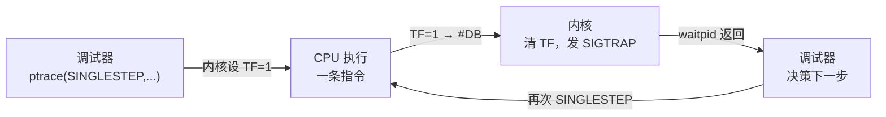
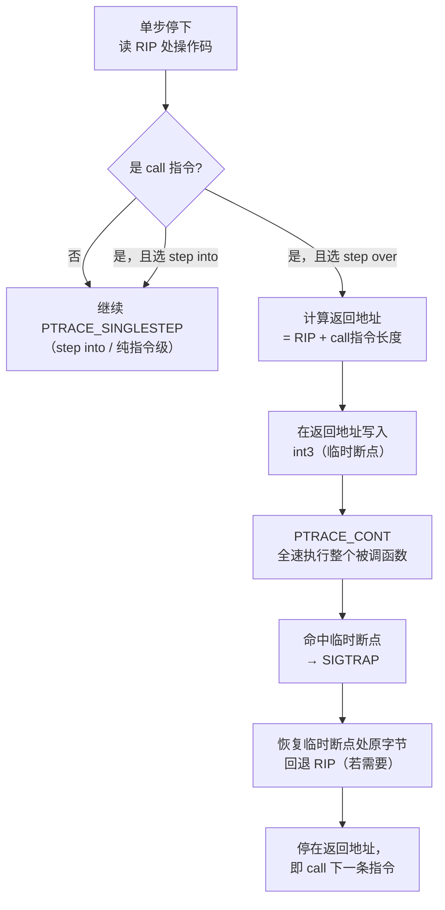
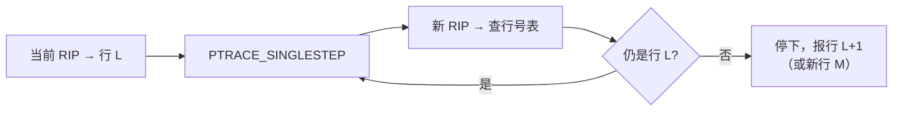

# 调试器原理与实战（4）· 单步与执行控制

> [!abstract] TL;DR
> - **指令级单步**：调试器向内核请求 `PTRACE_SINGLESTEP`，内核在 EFLAGS 设置 TF（Trap Flag），CPU 执行一条指令后自动触发 `#DB`（调试异常），内核把它转化为 `SIGTRAP` 送给 tracee，调试器捕获后再决策下一步。
> - **step over vs step into**：遇到 `call` 指令时，step into 继续单步进入被调函数；step over 则在返回地址设临时断点，然后 `PTRACE_CONT` 让 tracee 全速跑过整个被调函数体，到临时断点停下——避免单步每条指令的性能损耗。返回地址由[[22.调用规约/00.总览.md|调用规约]]保证，调用者预留帧/`ret` 弹栈时 CPU 自动读取。
> - **源码级 next/step**：借助 DWARF 行号表（[[05.调试信息DWARF]]），把多条指令聚合为"同一行"，调试器在行边界才停下，用户感知的是"一行一行走"。
> - **观察点（watchpoint）**：利用硬件调试寄存器 DR0–DR3 监视某内存地址的读/写/执行，数据变化时 CPU 自动抛 `#DB`，不需要在每条指令后检查——性能几乎为零代价。
> - **信号转发**：`PTRACE_CONT(pid, sig)` 的第二个参数决定是否把信号送给 tracee；`sig=0` 吞掉信号，`sig=原始信号` 透传——调试器必须仔细处理，否则 tracee 的信号处理逻辑会静默失效。

本篇是「调试器原理与实战」系列第四篇，直接承接 [[03.断点原理]]（断点命中 → `SIGTRAP` 到达调试器），重点拆解**命中断点后怎么走**：指令级步进、函数级跳过、源码行聚合，以及观察点与信号转发。下一篇 [[05.调试信息DWARF]] 将详解调试器如何把裸指令地址翻译为源码行号——那正是"源码级单步"的信息来源。

---

## 概述与定位

### 执行控制的四个层次

| 层次 | 粒度 | 实现机制 | GDB 命令 |
|---|---|---|---|
| 指令级单步（step into） | 一条机器指令 | `PTRACE_SINGLESTEP` + TF | `stepi` / `si` |
| 指令级跨越（step over） | 一条指令（跳过 call） | 临时断点 + `PTRACE_CONT` | `nexti` / `ni` |
| 源码行单步（step into） | 一行源码 | 行号表聚合指令单步 | `step` / `s` |
| 源码行跨越（step over） | 一行源码（跳过函数调用） | 行号表 + 临时断点 + cont | `next` / `n` |

还有两个常用的"执行到目标"操作：

- **run-to-cursor**：在光标行临时设断点，`PTRACE_CONT` 全速跑到那里。
- **finish（step out）**：在当前函数的**返回地址**设临时断点，`PTRACE_CONT` 跑出函数体。

> [!warning] 示例输出为示意
> 本节所有 `(gdb)` 提示符与输出均为代表性示意，非本机 Linux 实跑。

---

## 原理与机制

### 指令级单步：EFLAGS.TF 与 #DB

x86/x64 CPU 有一个专门为调试设计的 EFLAGS 位——**Trap Flag（TF，第 8 位）**。当 TF=1 时，CPU 在执行完**当前一条指令**后立即触发 **#DB（调试异常，向量 1）**，然后 TF 被 CPU 自动清零，阻止无限连续触发。

Linux 内核将 `#DB` 转化为 `SIGTRAP` 发给 tracee，父进程（调试器）通过 `waitpid()` 捕获到停止事件，再决策下一步。

```c
// 最小单步循环（Linux，伪代码级可编译 C）
#include <sys/ptrace.h>
#include <sys/wait.h>
#include <sys/user.h>
#include <stdio.h>

void single_step_loop(pid_t child) {
    int wstatus;
    struct user_regs_struct regs;

    while (1) {
        // 让 tracee 执行一条指令后停下
        ptrace(PTRACE_SINGLESTEP, child, 0, 0);
        waitpid(child, &wstatus, 0);

        if (WIFEXITED(wstatus)) break;   // tracee 已退出

        // 读取停止时的寄存器
        ptrace(PTRACE_GETREGS, child, 0, &regs);
        printf("RIP = 0x%llx\n", (unsigned long long)regs.rip);

        // 此处可检查 RIP 是否命中某个地址，决定是否 break
    }
}
```

> [!warning] 示例输出为示意
> `PTRACE_SINGLESTEP` 在 Linux x86-64 上可直接使用；ARM/AArch64 内核实现上则通过软件单步模拟（在下条指令插 `#BP`）而非 TF 硬件位。

**TF 的生命周期**：



### continue：PTRACE_CONT 与信号转发

`PTRACE_CONT` 让 tracee 全速运行直到下一个停止事件（断点/信号/ptrace 事件）。它的第四个参数 `data` 是**信号编号**，含义如下：

| `data` 值 | 效果 |
|---|---|
| `0` | **吞掉**到达调试器的信号，tracee 不感知 |
| `SIGXXX`（原始信号） | **透传**给 tracee，tracee 的 signal handler 正常执行 |

这是调试器信号处理的核心抉择。典型场景：tracee 收到 `SIGALRM` → ptrace 将其拦截并暂停 tracee，调试器通过 `waitpid` 返回（`WSTOPSIG(status)` 为 `SIGALRM`，原始信号号原样保留）→ 调试器检查信号编号 → 若是应用逻辑信号，则 `PTRACE_CONT(pid, SIGALRM)` 透传；若是断点/单步等调试事件，`WSTOPSIG` 才是 `SIGTRAP`，此时 `PTRACE_CONT(pid, 0)` 将其吞掉。

```c
// 信号透传示例
int wstatus;
waitpid(child, &wstatus, 0);
if (WIFSTOPPED(wstatus)) {
    int sig = WSTOPSIG(wstatus);
    if (sig == SIGTRAP) {
        // 调试器自己的断点/单步事件，不透传
        ptrace(PTRACE_CONT, child, 0, 0);
    } else {
        // 应用信号，透传给 tracee
        ptrace(PTRACE_CONT, child, 0, sig);
    }
}
```

> [!warning] 信号吞掉的陷阱
> 若调试器对所有停止事件都用 `PTRACE_CONT(pid, 0)`，tracee 会**永远收不到**定时器、I/O 等信号，导致程序行为与非调试时不同——这是常见的"调试时正常、不调试时崩"的根源之一。调试器必须仔细鉴别信号来源。

---

## 三平台对照

| 维度 | Linux | Windows | macOS |
|---|---|---|---|
| 单步请求 | `ptrace(PTRACE_SINGLESTEP, ...)` | `SetThreadContext` 设 `EFLAGS.TF=1` 后 `ContinueDebugEvent` | `thread_set_state` 设 `__eflags.TF=1`（x86）；AArch64 靠 `MDE` 位 |
| 单步信号/事件 | `SIGTRAP`（`waitpid` 捕获） | `EXCEPTION_SINGLE_STEP`（`WaitForDebugEvent` 返回 `EXCEPTION_DEBUG_EVENT`） | Mach 异常 `EXC_BREAKPOINT` |
| TF 硬件支持 | x86/x64 有；ARM 内核软件模拟 | x86/x64 有；ARM 靠硬件单步模式 | 同 Linux |
| 信号/异常透传 | `ptrace(PTRACE_CONT, pid, 0, sig)` | `ContinueDebugEvent(pid, tid, DBG_EXCEPTION_NOT_HANDLED)` | `mach_port` 转发 |
| 观察点 | `ptrace(PTRACE_POKEUSER, ...)` 写 DR0–DR7 | `SetThreadContext` 修改 `CONTEXT.Dr0–Dr7` | `thread_set_state` |
| 硬件观察点数量 | 4 个（DR0–DR3） | 4 个（DR0–DR3） | 4 个（x86）；AArch64 最多 16 个 |

---

## 数据结构与流程详解

### step over vs step into 决策

当调试器执行单步后，发现当前 RIP 对应的指令是 `call`（操作码 `0xE8`/`0xFF` 等），它需要决策：进入还是跳过？



**返回地址计算**：对于近调用 `call rel32`（操作码 `0xE8`），指令长度固定为 5 字节，所以返回地址 = 当前 RIP（`call` 指令地址）+ 5。对于间接调用 `call *rax`（`0xFF /2`），长度 2–7 字节不等，需要反汇编解码。这与[[22.调用规约/00.总览.md|调用规约]]的约定一致：`call` 指令把返回地址压栈，`ret` 弹出跳回——调试器正是利用这一确定行为在返回地址埋伏。

> [!warning] 递归与尾调用的边界
> step over 依赖"临时断点命中 = 当前函数返回"的假设。若被跨越的函数内部有无限递归或尾调用优化（`jmp` 而非 `call`），临时断点可能在意料之外的地方触发，调试器需检查帧深度或函数地址加以鉴别。

### 源码级单步：行号表聚合

源码级 `next` / `step` 的本质是"把多条指令单步聚合成一行"。流程如下：

1. 从 DWARF 的 `.debug_line`（见 [[05.调试信息DWARF]]）中查询当前 RIP 对应的源码行 *L*。
2. 执行指令级单步（或在函数体内 step over）直到 RIP 落在**不同于 *L* 的行**。
3. 若新行仍在同一函数内 → 停下，汇报给用户；若新行已跳出函数（step out 场景）→ 按 step into / step over 规则决定是否跟入。



行号表由编译器（如 `gcc -g`）生成，记录每条指令地址到 `(文件, 行号, 列号)` 的映射，详见 [[11.ELF文件详解/27.debug_line节.md]]。内联函数会产生多个"同地址"的行号条目，调试器需处理内联展开的层叠。

### 观察点（Watchpoint）：硬件 DR 寄存器

软件断点（`int3`）只能监视**代码执行**；若要监视某变量什么时候被写（或读），需要**硬件观察点**，它利用 CPU 的调试寄存器：

| 寄存器 | 功能 |
|---|---|
| `DR0`–`DR3` | 4 个监视地址（每个独立） |
| `DR6` | 调试状态寄存器（哪个 DR 触发了 `#DB`） |
| `DR7` | 调试控制寄存器（每个 DR 的使能位、条件、长度） |

`DR7` 的关键字段（每 DR 占 4 位条件 + 2 位长度）：

| 条件（`Condition`，2 位） | 含义 |
|---|---|
| `00` | 执行断点（相当于硬件执行断点） |
| `01` | 写观察点（数据被写入时触发） |
| `10` | I/O 断点（仅 Ring 0 有效） |
| `11` | 读写观察点（读或写时均触发） |

| 长度（`LEN`，2 位） | 监视范围 |
|---|---|
| `00` | 1 字节 |
| `01` | 2 字节 |
| `10` | 8 字节（64 位模式） |
| `11` | 4 字节 |

在 Linux 上，调试器通过 `ptrace(PTRACE_POKEUSER, pid, offset_of_DR0 + i*8, addr)` 写入 DR0–DR3，再写 DR7 使能，内核将其注入 tracee 的线程上下文。触发后通过 DR6 的 `Bn` 位（B0–B3）判断是哪个观察点命中。

```c
// 设置 DR0 为写观察点（示意，实际偏移见 <sys/user.h>）
// DR0 = 监视地址
ptrace(PTRACE_POKEUSER, child, offsetof(struct user, u_debugreg[0]), watch_addr);
// DR7 = 使能 DR0 局部（L0=1），条件=写（01），长度=4字节（11）
// DR7[1:0]=01(L0 enable), DR7[17:16]=01(write), DR7[19:18]=11(4bytes)
unsigned long dr7 = 0x00010001UL;   // 简化示意，实际位字段见手册
ptrace(PTRACE_POKEUSER, child, offsetof(struct user, u_debugreg[7]), dr7);
```

> [!warning] 示例输出为示意
> 上述 DR7 值为教学示意，实际位布局须参照《Intel 64 and IA-32 Architectures SDM》Volume 3，Chapter 17 及内核 `<sys/user.h>` 中的 `u_debugreg` 偏移。

### run-to-cursor 与 finish

- **run-to-cursor**：调试器在目标地址写入 `int3`（同[[03.断点原理]]的临时断点机制），执行 `PTRACE_CONT`，命中后删除临时断点、恢复原字节。
- **finish（step out）**：
  1. 读取当前帧的返回地址（通过栈帧指针 `rbp` 或 DWARF CFI 展开，见 [[07.栈回溯unwind]]）。
  2. 在返回地址设临时 `int3` 断点。
  3. `PTRACE_CONT`，等命中后删除临时断点。

finish 本质上与 step over 共享同一套"临时断点 + cont"基础设施，区别只在于临时断点的目标地址来源：step over 从 call 指令后的下一字节算，finish 从栈帧中读出真实返回地址。

---

## 代码与示例

### GDB 指令级 vs 源码级单步

```text
# 加载带调试信息的二进制
(gdb) file ./demo
(gdb) break main
(gdb) run

# 指令级单步（step into 一条汇编）
(gdb) stepi
0x0000555555555161 in main ()
=> 0x0000555555555161 <main+1>:  push   %rbp

# 指令级 step over（跳过 call foo 整个函数）
(gdb) nexti
0x000055555555516a in main ()

# 源码级 step into（进入被调函数）
(gdb) step
foo (x=42) at demo.c:5

# 源码级 step over（跳过函数调用，停在下一行）
(gdb) next
8       return result;

# 设置写观察点
(gdb) watch g_counter
Hardware watchpoint 2: g_counter

(gdb) continue
Hardware watchpoint 2: g_counter
Old value = 0
New value = 1
0x0000555555555178 in increment () at demo.c:12

# 跑到光标处（run-to-cursor）
(gdb) tbreak demo.c:20
Temporary breakpoint 3 at 0x5555555551a0
(gdb) continue

# 跑出当前函数
(gdb) finish
Run till exit from #0  foo (x=42) at demo.c:5
main () at demo.c:9
```

> [!warning] 示例输出为示意
> 上述地址与行号为代表性示意，并非本机实跑输出。

### WinDbg 对应命令

```text
# 指令级单步（step into）
t

# 指令级 step over
p

# 源码级 step into
ts

# 源码级 step over
ps (或直接 p 在源码模式)

# 设置写观察点
ba w4 <address>     # break on access, write, 4 bytes

# run-to-cursor
g <address>

# finish（跑出当前函数）
gu
```

> [!warning] 示例输出为示意
> 以上 WinDbg 命令非本机 Windows Kernel Debug 环境实跑。

### x64dbg / LLDB 对照

| 操作 | GDB | LLDB | x64dbg |
|---|---|---|---|
| 指令级 step into | `stepi` / `si` | `thread step-inst` / `si` | F7 |
| 指令级 step over | `nexti` / `ni` | `thread step-inst-over` / `ni` | F8 |
| 源码级 step into | `step` / `s` | `thread step-in` / `s` | F7（源码模式） |
| 源码级 step over | `next` / `n` | `thread step-over` / `n` | F8（源码模式） |
| finish（step out） | `finish` | `thread step-out` / `f` | Ctrl+F9 |
| run-to-cursor | `tbreak + continue` | `thread until <line>` | F4 |
| 写观察点 | `watch <var>` | `watchpoint set variable <var>` | 右键→硬件断点 |
| continue | `continue` / `c` | `process continue` / `c` | F9 |

---

## 陷阱与注意事项

> [!warning] 单步在系统调用边界的行为
> 在 `syscall` 指令上执行 `PTRACE_SINGLESTEP`，Linux 默认会在 `syscall` **入口**和**出口**各停一次（通过 `PTRACE_O_TRACESYSGOOD` 可进一步控制）。调试器若未预期两次停止，会误以为执行了两条指令，导致行号计算偏移。

> [!warning] 多线程下的单步
> `PTRACE_SINGLESTEP` 只对**指定 tid** 生效，其他线程仍在运行。若被调试程序是多线程，"step over 一个锁"可能永远等不到对端线程释放，造成死锁。GDB 的 `set scheduler-locking on` 可冻结其他线程，但这本身又改变了时序行为。

> [!warning] 内联函数的行号跳跃
> 内联展开后，`next` 有时会让 RIP 在同一"逻辑行"内跳入/跳出内联体，用户看到源码行号跳来跳去。这是 DWARF 行号表中 `is_stmt`（statement）标志与内联标记共同作用的结果，属正常现象，不是调试器 bug。

---

## 小结

| 机制 | 硬件基础 | ptrace 请求 | 适用场景 |
|---|---|---|---|
| 指令级单步 | EFLAGS.TF → #DB → SIGTRAP | `PTRACE_SINGLESTEP` | 精确追踪每条指令 |
| continue | — | `PTRACE_CONT(pid, sig)` | 全速运行到下一事件 |
| step over | 临时 int3 断点 | `PTRACE_CONT` | 跨越函数调用 |
| step into | EFLAGS.TF | `PTRACE_SINGLESTEP` | 进入被调函数 |
| 源码级行步 | DWARF 行号表 + TF | 循环 `PTRACE_SINGLESTEP` | 面向用户的源码调试 |
| 观察点 | DR0–DR3 → #DB | `PTRACE_POKEUSER`（写 DR） | 监视变量读写 |
| run-to-cursor | 临时 int3 断点 | `PTRACE_CONT` | 跑到指定位置 |
| finish | 临时 int3 断点（返回地址） | `PTRACE_CONT` | 跑出当前函数 |

执行控制是调试器最核心的用户体验——用户按 `n` / `s` 感受"一行一行走"，底层是内核、CPU 硬件、DWARF 符号信息三者的精密配合。[[03.断点原理]] 提供了"停下来"的能力，本篇把"怎么走"讲透，[[05.调试信息DWARF]] 则回答"走到哪里算一步"。

---

## 相关阅读

- 断点机制：[[03.断点原理]]
- ptrace 系统调用：[[02.ptrace原理]]
- DWARF 行号表（源码行映射）：[[05.调试信息DWARF]]、[[11.ELF文件详解/27.debug_line节.md]]
- 调试信息总览：[[11.ELF文件详解/24.debug节.md]]
- 栈帧与 finish 实现基础：[[07.栈回溯unwind]]、[[11.ELF文件详解/46.eh_frame节.md]]
- 调用规约（返回地址保证）：[[22.调用规约/00.总览.md]]
- 手写 mini 调试器：[[12.手写mini调试器]]

⬅️ 上一篇 [[03.断点原理]] ｜ 🏠 [[00.调试器原理与实战总览]] ｜ 下一篇 [[05.调试信息DWARF]] ➡️
