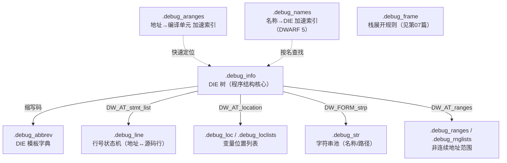
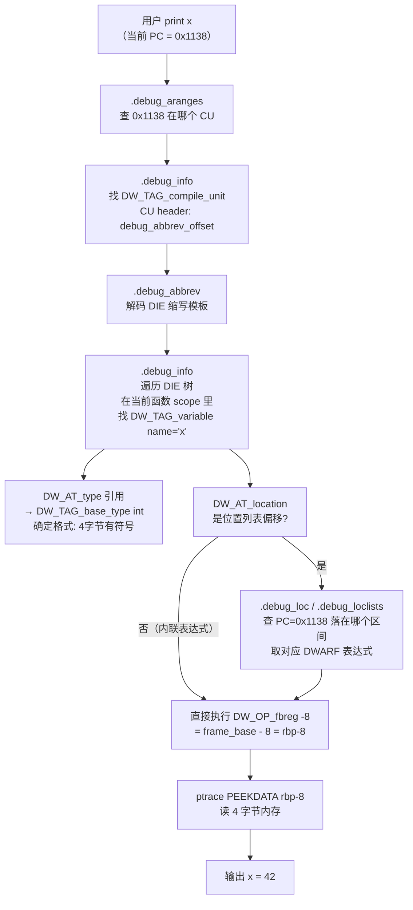

# 调试器原理与实战（5）· 调试信息DWARF

> [!abstract] TL;DR
> - **DWARF 是什么**：二进制里嵌入的"源码地图"，把指令地址翻译回"文件:行:变量"。编译器用 `-g` 生成；调试器读它实现"在第 23 行打断点"、"查看变量 x 的值"。
> - **三节分工**：`.debug_info` 存 **DIE 树**（程序的函数/变量/类型结构）、`.debug_line` 存**行号状态机字节码**（地址 ↔ 源码行的双向映射）、`.debug_abbrev` 存压缩模板（DIE 的"字典"）。
> - **关键机制**：`DW_OP_*` 表达式动态描述"变量此刻在哪个寄存器或栈位置"；位置列表（`.debug_loc`/`.debug_loclists`）让这个描述随 PC 变化。
> - **查找链**：地址 → `.debug_aranges`/`.debug_names` 定位编译单元 → `.debug_info` DIE 树找变量 → `DW_AT_location` 算真实位置。
> - **三平台**：Linux/macOS 都用 DWARF（嵌入 ELF/Mach-O 的 `.debug_*` 节）；Windows 用 PDB（完全不同的格式，见 [[06.PDB与Windows符号]]）。
> - **与上篇呼应**：[[04.单步与执行控制]] 的"步进在源码行粒度上聚合"，其依据正是 `.debug_line` 行号表的 `is_stmt` 标志。

本篇从**调试器的消费视角**讲透 DWARF——不是"文件格式大全"，而是"调试器怎么靠它把 `0x401136` 变成 `main.c:23` 再变成 `int x = 42`"。ELF 格式本身已在 [[11.ELF文件详解/24.debug节.md]]、[[11.ELF文件详解/26.debug_info节.md]]、[[11.ELF文件详解/27.debug_line节.md]] 详述；本篇互补其视角，聚焦**调试器的解析流程与 DWARF 的运行期语义**。

---

## 概述与定位

### 为什么需要 DWARF

机器码是优化器的产物——变量被塞进寄存器、循环被展开、函数被内联。CPU 执行的指令序列与你写的 C/C++ 代码之间，早已不是一一对应。**调试器要做的，就是在这团乱麻里重建源码视图**。

DWARF（Debugging With Attributed Record Formats）是 ELF 体系下这个问题的标准答案：编译器用 `-g` 把源码结构、类型系统、变量位置、行号映射都编码进二进制，以 `.debug_*` 节的形式随二进制发布（或按 Split DWARF 方案剥离到单独 `.dwo` 文件）。调试器拿到二进制，先读 DWARF，才能：

1. 把用户写的 `break main.c:23` 转换为机器地址，再调用 `ptrace`/`DebugActiveProcess` 往那里写 `0xCC`。
2. 在 `SIGTRAP` 打断后，把 PC 寄存器的值翻译回"你在 `main.c` 第 23 行"并显示对应源码。
3. 用 `print x` 时，知道 `x` 是 `int`、此刻存在 `rbp-8` 处，读那个内存位置并格式化显示。

### `-g` 选项的影响

```bash
# -g2（默认级别，等同 -g）：完整 DWARF，含行号/变量/类型
gcc -g main.c -o main_debug

# -g1：仅行号+函数名，无局部变量信息
gcc -g1 main.c -o main_g1

# -g3：额外含宏定义（DW_TAG_macro_unit）
gcc -g3 main.c -o main_g3

# -O2 + -g：开优化同时保留调试信息（变量可能被优化消失）
gcc -O2 -g main.c -o main_optdebug

# Split DWARF：调试信息剥离到 .dwo，加快链接
gcc -g -gsplit-dwarf main.c -o main  # 同时产出 main.dwo
```

> [!warning] 示例输出为示意
> 本篇所有命令输出均为代表性示意，非本机实跑。地址、偏移随工具链版本和编译选项变化，读者应在自己的 Linux 环境中复现。

---

## 原理与机制

### 各 `.debug_*` 节的分工总览

DWARF 用一批节协作，而不是一个整体。`.debug_info` 是**中心节点**，其他节都被它直接或间接引用：



| 节名 | 调试器用它做什么 | 详解入口 |
|------|-----------------|----------|
| `.debug_info` | 读程序结构：函数地址范围、变量名/类型/位置 | [[11.ELF文件详解/26.debug_info节.md]] |
| `.debug_line` | 地址 ↔ 源文件:行（断点计算、单步聚合） | [[11.ELF文件详解/27.debug_line节.md]] |
| `.debug_abbrev` | 解码 DIE 的压缩格式 | 本篇下节 |
| `.debug_str` | 存函数名/变量名/文件路径的字符串池 | 本篇下节 |
| `.debug_aranges` | 地址范围→编译单元的 O(log n) 查找 | 下节 |
| `.debug_names` | 名称/类型→DIE 偏移，`(gdb) ptype Foo` 所用 | 下节 |
| `.debug_loc` / `.debug_loclists` | 变量位置随 PC 变化的列表 | 本篇 DWARF 表达式节 |
| `.debug_frame` | 栈展开规则（CFI），见 [[07.栈回溯unwind]] | — |

---

## `.debug_info` 的 DIE 树：程序结构的骨架

### 什么是 DIE

**DIE（Debugging Information Entry）** 是 DWARF 的基本信息单元，类比 XML 元素。每个 DIE 有：

- **`DW_TAG_*`**：标签，声明"这是什么"（函数、变量、类型…）
- **`DW_AT_*` 属性**：描述"具体细节"（名称、地址、类型引用…）

DIE 以树形组织：编译单元（`DW_TAG_compile_unit`）是根，函数（`DW_TAG_subprogram`）是其子，函数内的局部变量（`DW_TAG_variable`）是函数的子。

```text
DW_TAG_compile_unit  [main.c]
  DW_AT_name: "main.c"
  DW_AT_comp_dir: "/home/user/proj"
  DW_AT_low_pc: 0x1129
  DW_AT_high_pc: 0x1160
  DW_AT_stmt_list: 0x0      ← 指向 .debug_line 中该 CU 的行号程序

  DW_TAG_base_type  [偏移 0x7a]
    DW_AT_name: "int"
    DW_AT_byte_size: 4
    DW_AT_encoding: DW_ATE_signed

  DW_TAG_subprogram  [main 函数]
    DW_AT_name: "main"
    DW_AT_low_pc: 0x1129    ← 函数代码起始地址
    DW_AT_high_pc: 0x1160   ← 函数代码结束地址
    DW_AT_frame_base: DW_OP_call_frame_cfa  ← 帧基址

    DW_TAG_variable  [局部变量 x]
      DW_AT_name: "x"
      DW_AT_type: <0x7a>    ← 引用上面 int 类型的 DIE
      DW_AT_location: DW_OP_fbreg -8  ← x 在 rbp-8 处
```

### 调试器如何用 DIE 树

当用户执行 `break main`：

1. 调试器在 `.debug_info` 里遍历所有 CU，找 `DW_TAG_subprogram` 且 `DW_AT_name == "main"` 的 DIE。
2. 从 `DW_AT_low_pc` 取到函数入口地址 `0x1129`。
3. 再查 `.debug_line`（见下节），找到 `0x1129` 对应 `main.c:1`，向后走到函数体第一条语句的地址。
4. 在该地址写 `int3`（0xCC）完成断点。

当用户执行 `print x`（此时 PC 在 `main` 内部）：

1. 调试器找到当前 CU 和当前 `DW_TAG_subprogram`。
2. 在该 subprogram 的子 DIE 中找 `DW_TAG_variable` 且 `DW_AT_name == "x"`。
3. 读 `DW_AT_type` 引用，沿类型 DIE 链确定 `x` 是 4 字节有符号整型。
4. 读 `DW_AT_location`，得到 `DW_OP_fbreg -8`，计算 `frame_base - 8 = rbp - 8`。
5. 读那个内存地址的 4 字节，格式化输出。

### 重要 DW_TAG 与 DW_AT 速查

| DW_TAG | 表示什么 | 调试器何时用 |
|--------|---------|-------------|
| `DW_TAG_compile_unit` | 一个翻译单元（.c 文件） | 定位 CU，取 `DW_AT_stmt_list` 找行号程序 |
| `DW_TAG_subprogram` | 函数/方法 | 断点到函数名，调用栈帧名 |
| `DW_TAG_inlined_subroutine` | 内联函数实例 | 调用栈显示内联层 |
| `DW_TAG_variable` | 变量（全局/局部/静态） | `print`/`watch` |
| `DW_TAG_formal_parameter` | 函数形参 | 显示参数值 |
| `DW_TAG_base_type` | int/char/float 等 | 格式化输出 |
| `DW_TAG_structure_type` | 结构体 | `print struct_var` 展开成员 |
| `DW_TAG_pointer_type` | 指针类型 | `print ptr` 显示地址和解引用 |
| `DW_TAG_lexical_block` | 花括号作用域块 | 确定变量的生存范围 |

| DW_AT | 值类型 | 用途 |
|-------|--------|------|
| `DW_AT_name` | 字符串 | 符号名称 |
| `DW_AT_low_pc` / `DW_AT_high_pc` | 地址 | 函数/CU 的代码范围 |
| `DW_AT_type` | DIE 引用 | 指向类型描述 DIE |
| `DW_AT_location` | DWARF 表达式或位置列表偏移 | 变量运行时位置 |
| `DW_AT_stmt_list` | `.debug_line` 偏移 | 找到该 CU 的行号程序 |
| `DW_AT_frame_base` | DWARF 表达式 | 计算帧基址（用于 `DW_OP_fbreg`） |
| `DW_AT_abstract_origin` | DIE 引用 | 内联实例引用原始函数定义 |
| `DW_AT_decl_file` / `DW_AT_decl_line` | 索引/整数 | 声明位置 |

---

## `.debug_abbrev` 与 `.debug_str`：压缩层

### 缩写机制

`.debug_info` 中每个 DIE 不直接存"这是 `DW_TAG_subprogram`、有 `DW_AT_name`、有 `DW_AT_low_pc`…"这类字符串，而是只存一个 ULEB128 整数——**缩写码**。缩写码在 `.debug_abbrev` 里查到对应模板：

```text
.debug_abbrev（模板定义）：
  缩写码 2 → DW_TAG_subprogram has_children=yes
    DW_AT_name        DW_FORM_strp        ← 4字节偏移，到 .debug_str 取字符串
    DW_AT_external    DW_FORM_flag_present ← 0字节，存在即为 true
    DW_AT_low_pc      DW_FORM_addr        ← 8字节地址
    DW_AT_high_pc     DW_FORM_data8       ← 8字节长度（相对 low_pc）
    DW_AT_frame_base  DW_FORM_exprloc     ← ULEB128长度+表达式字节流
    ...结束标记...

.debug_info 中的 DIE 字节流：
  [0x02]          ← 缩写码 2（一个字节）
  [0x00000048]    ← DW_AT_name: .debug_str 偏移 0x48，取字符串 "main"
                  ← DW_AT_external: 不存字节（DW_FORM_flag_present）
  [0x00001129]    ← DW_AT_low_pc: 8字节地址
  [0x00000037]    ← DW_AT_high_pc: 55字节（相对 low_pc 的长度）
  [0x01][0x9c]    ← DW_AT_frame_base: 1字节表达式，DW_OP_call_frame_cfa
```

这套机制使大型程序的 DIE 字节流比"全量存储"小 3-5 倍。

### 字符串池 `.debug_str`

所有符号名、文件路径、类型名都集中在 `.debug_str`，DIE 属性只存 4 字节偏移（`DW_FORM_strp`）。相同的名字（如所有 `int` 类型的名称字符串 `"int"`）只存一次，消除大量重复。

DWARF 5 进一步把行号程序里的目录名/文件名也单独放进 `.debug_line_str`，并新增 `.debug_str_offsets` 做间接索引，以支持 Split DWARF（`.dwo` 文件）场景。

---

## `.debug_line` 的行号状态机：断点与单步的依据

### 为什么是"状态机"而不是"表"

一个函数的机器码可能对应几十行源码，直接存"每条指令→文件:行"的映射表会极其庞大。`.debug_line` 改用**字节码程序**驱动一台状态机来生成这张表——通常一条特殊操作码（1字节）就能表达"地址前进 N 字节、行号前进 M 行"，压缩率极高。

状态机维护一组寄存器：`address`（当前指令地址）、`file`（当前文件索引）、`line`（当前行号）、`column`、`is_stmt`（是否是推荐断点位置）等。执行完一段字节码后，`is_stmt=true` 的行就是调试器应当把断点对齐到的逻辑行。

### 操作码三分类

| 类别 | 字节值范围 | 典型代表 |
|------|-----------|---------|
| 扩展操作码（DW_LNE_*） | 以 `0x00` 开头 | `DW_LNE_set_address`（设置绝对地址）、`DW_LNE_end_sequence` |
| 标准操作码（DW_LNS_*） | `1` 到 `opcode_base-1` | `DW_LNS_copy`（提交行映射）、`DW_LNS_advance_pc`、`DW_LNS_advance_line` |
| 特殊操作码 | `opcode_base` 到 `255` | **1字节同时完成"地址+N字节、行+M、提交"** |

特殊操作码的解码公式（以 GCC 典型参数 `line_base=-5, line_range=14, opcode_base=13` 为例）：

```text
adjusted      = opcode - opcode_base
addr_advance  = adjusted / line_range    ← 地址步进量（×min_instruction_length）
line_advance  = line_base + (adjusted % line_range)
```

一条字节 `0x21`（decimal 33）→ `adjusted=20` → `addr_advance=1字节`，`line_advance=1行`，提交。这就是编译器为相邻行、相邻指令能用 1 字节编码的原因。

### 断点到行：调试器的计算步骤

以"在 `main.c` 第 7 行打断点"为例：


**单步聚合**（step over 一"源码行"）的依据也是这张表：调试器在 `SIGTRAP` 后查当前 PC 对应的行号，若行号未变（如内联的片段），继续单步；直到行号变了才停下来——这就是 [[04.单步与执行控制]] 里"行粒度步进"的底层机制。`is_stmt` 标志进一步告诉调试器哪些地址是"语义上的语句起点"，避免停在序言/尾声中间的非语句指令上。

### 实战：读解码后的行号表

```bash
readelf --debug-dump=decodedline main
```

```text
# 示例输出（代表性，非本机实跑）
CU: main.c:
File name    Line  Starting address  Stmt
main.c          1          0x1129     x   ← 函数入口（序言前）
main.c          4          0x112d     x   ← 第一条语句（序言结束后）
main.c          5          0x1135     x
main.c          6          0x113d     x
main.c          7          0x1145     x
main.c          8          0x1155     x
```

> [!warning] 示例输出为示意
> 地址为示意值，`Stmt` 列（`x` 表示 `is_stmt=true`）是调试器选择断点位置的依据，非 `x` 的行通常是编译器内部产生的辅助指令。

---

## DWARF 表达式与位置列表：变量在哪里

### DW_OP_* 表达式机器

变量的位置往往不是固定地址——寄存器分配后它可能在寄存器里，优化后它可能被消除。DWARF 用**基于操作数栈的字节码表达式**（`DW_OP_*`）来描述"给定当前 CPU 状态，如何计算变量地址或值"：

```text
典型情景与表达式：

1. 局部变量在栈上（rbp-8）：
   DW_AT_location: DW_OP_fbreg -8
   → 计算：frame_base + (-8) = 变量地址
   （frame_base 由 DW_AT_frame_base 的 DW_OP_call_frame_cfa 给出）

2. 变量被优化进寄存器（rdi，DWARF 寄存器编号 5）：
   DW_AT_location: DW_OP_reg5 DW_OP_stack_value
   → 变量的值就是 rdi 寄存器当前的内容，无内存地址

3. 全局变量（固定地址）：
   DW_AT_location: DW_OP_addr 0x601020
   → 变量地址就是 0x601020

4. 结构体成员（指针 ptr 指向的 offset 8 处）：
   DW_AT_data_member_location: 8
   → 成员地址 = 结构体基址 + 8
```

| DW_OP_* | 语义 | 典型用途 |
|---------|------|---------|
| `DW_OP_fbreg SLEB128` | frame_base + 偏移 | 栈上局部变量（最常见） |
| `DW_OP_reg0`…`DW_OP_reg31` | 压入对应寄存器值 | 仅存寄存器中的变量 |
| `DW_OP_breg0`…`DW_OP_breg31` | 寄存器值 + 偏移 | 寄存器相对寻址 |
| `DW_OP_addr addr` | 压入绝对地址 | 全局/静态变量 |
| `DW_OP_deref` | 解引用栈顶（读内存） | 指针解引用 |
| `DW_OP_stack_value` | 标记栈顶是值本身而非地址 | 纯寄存器变量（无内存） |
| `DW_OP_piece N` | 值的前 N 字节在当前位置 | 拆分到多个寄存器的变量 |
| `DW_OP_call_frame_cfa` | CFA（规范帧地址）| 帧基址定义 |
| `DW_OP_entry_value expr` | 函数入口时刻的值（DWARF 5）| 优化后参数追溯 |

### 位置列表：随 PC 变化的位置

优化编译器会把变量在函数不同阶段放在不同地方——函数入口在 `rdi`，某行之后被 spill 到 `rbp-16`，再往后又被消除。DWARF 用**位置列表**描述这种动态性：

```text
.debug_loclists（DWARF 5 格式）中某变量的位置列表：
  [0x1129, 0x1135)  →  DW_OP_reg5           ← 此地址范围内，变量在 rdi
  [0x1135, 0x1150)  →  DW_OP_fbreg -16     ← 此范围内，变量在 rbp-16
  [0x1150, 0x1160)  →  (无位置，变量已消除)
```

`DW_AT_location` 属性使用 `DW_FORM_sec_offset` 时，值是 `.debug_loclists`（DWARF 5）或 `.debug_loc`（DWARF 4）里位置列表的偏移。调试器在每次暂停时，先取当前 PC，然后在位置列表里查"当前 PC 落在哪个区间"，再执行对应的 DWARF 表达式算出变量地址。

这就是为什么对同一个变量，在函数开始和中间断点的 `print x` 可能给出不同的内存地址——并不是 BUG，而是 DWARF 如实反映了优化后的寄存器分配情况。

---

## 调试器的完整查找链

把上面三层合在一起，从"用户输入一条 GDB 命令"到"拿到变量值"：



> [!note] `.debug_names` 加速名称查找
> DWARF 5 引入的 `.debug_names` 节（类似 `.debug_pubnames` 的升级版）是一个哈希加速索引，把符号名直接映射到 DIE 偏移，免去遍历全部 CU 的线性扫描。GDB 9+、LLVM 都支持此索引，大型程序（数千 CU）下 `break ClassName::method` 的响应时间可从秒级降到毫秒级。

---

## Split DWARF 与 `.dwo` 文件

大型 C++ 工程的 `.debug_*` 节体积往往超过代码本身。**Split DWARF**（`-gsplit-dwarf`）把大部分调试信息剥离出来：

```text
链接阶段（快）：
  main.o 只含"骨架 CU"（Skeleton CU，DW_UT_skeleton）
  骨架 CU 极小：只有 DW_AT_dwo_name（指向 .dwo 文件）、DW_AT_dwo_id（唯一 ID）
  链接器无需处理完整 DIE 树 → 链接速度大幅提升

调试阶段（需要时才加载）：
  GDB/LLDB 按 DW_AT_dwo_name 找到 main.dwo
  main.dwo 是标准 ELF，含完整 DIE 树（.debug_info.dwo 等节）
  通过 DW_AT_dwo_id 对齐骨架与完整信息
```

```bash
# 编译产出 main（含骨架 CU）+ main.dwo（完整调试信息）
gcc -g -gsplit-dwarf main.c -o main

# 多个 .dwo 打包为单一发布文件
llvm-dwp -o main.dwp main.dwo helper.dwo

# GDB 自动查找 .dwo（按 .dwo 文件路径或 debuginfod）
gdb ./main
```

> [!warning] 示例输出为示意
> 上述命令行在支持 `-gsplit-dwarf` 的 GCC 8+/Clang 5+ 上有效，`.dwp` 打包需要 `llvm-dwp` 或 `dwp`（binutils）。

---

## 三平台对照

| 维度 | Linux（ELF） | macOS（Mach-O） | Windows（PE/COFF） |
|------|-------------|-----------------|-------------------|
| 调试信息标准 | **DWARF**（嵌入 `.debug_*` 节） | **DWARF**（嵌入 `__DWARF` segment 下的各节） | **PDB**（独立 `.pdb` 文件）+ CodeView |
| 编译器生成选项 | `gcc/clang -g` | `clang -g` | MSVC `/Zi`（外部 PDB）或 `/Z7`（嵌入） |
| 节名格式 | `.debug_info`、`.debug_line`… | `__debug_info`、`__debug_line`…（Mach-O 节名下划线） | N/A（PDB 是独立文件格式，不嵌入 PE） |
| 分离调试信息 | Split DWARF（`.dwo`）+ debuginfod | `dsymutil` 生成 `.dSYM` bundle（内含 DWARF） | 链接期生成 `.pdb`，符号服务器分发 |
| 工具链 | `readelf --debug-dump`、`llvm-dwarfdump`、`objdump --dwarf` | `dsymutil`、`dwarfdump`、`llvm-dwarfdump` | `dia2dump`、`cvdump`、WinDbg `.sympath` |
| 调试器 | GDB、LLDB | LLDB（主）、GDB | WinDbg、VS Debugger、x64dbg（见第10篇） |
| 变量位置描述 | DWARF 表达式（`DW_OP_*`） | 同左（DWARF 兼容） | PDB 的 CodeView 记录（`S_REGREL32`、`S_REGISTER` 等） |

macOS 的 `.dSYM` 本质是一个目录 bundle（`main.dSYM/Contents/Resources/DWARF/main`），里面是标准 DWARF——和 Linux 读一样的格式，只是节名用 Mach-O 约定（前缀 `__`）。因此 `llvm-dwarfdump` 在两个平台完全通用。

Windows PDB 与 DWARF 完全不同（独立格式、私有历史、符号服务器生态），将在 [[06.PDB与Windows符号]] 专篇详述。

---

## 数据结构速览

### 编译单元头（DWARF 4 vs 5 对比）

```c
/* DWARF 4 编译单元头（32-bit DWARF） */
struct DWARF4_CU_Header {
    uint32_t unit_length;       /* 本 CU 总字节（不含自身） */
    uint16_t version;           /* = 4 */
    uint32_t debug_abbrev_offset; /* .debug_abbrev 偏移 */
    uint8_t  address_size;      /* 目标机地址宽度（通常 8） */
    /* DIE 字节流紧随其后 */
};

/* DWARF 5 编译单元头（32-bit DWARF，注意字段顺序变化！） */
struct DWARF5_CU_Header {
    uint32_t unit_length;       /* 本 CU 总字节 */
    uint16_t version;           /* = 5 */
    uint8_t  unit_type;         /* DW_UT_compile=0x01 等 */
    uint8_t  address_size;      /* 目标机地址宽度 */
    uint32_t debug_abbrev_offset; /* .debug_abbrev 偏移 */
    /* 骨架/分裂 CU 时还有 dwo_id（uint64）*/
};
```

DWARF 5 把 `unit_type` 和 `address_size` 提前到 `debug_abbrev_offset` 之前——这让解析器无需先读缩写表就能知道 CU 类型，对 Split DWARF 的处理至关重要。

### DIE 在字节流中的布局

```text
字节流（每个 DIE）：
  [ULEB128 abbrev_code]  ← 0 = 父 DIE 的子序列结束符
  [attr_value_1]         ← 字节宽度由 .debug_abbrev 中对应 DW_FORM 决定
  [attr_value_2]
  ...

若缩写声明 has_children=yes，紧随其后是子 DIE 序列，
最后以 abbrev_code=0 的单字节终结。

整棵 DIE 树在字节流中是深度优先前序遍历展开：
  CU_DIE → subprogram_DIE → variable_DIE → [0x00] → [0x00]
```

---

## 实操：工具箱

> [!warning] 示例输出为示意
> 下列命令在 Linux 环境执行，输出内容为代表性示意。Windows 建议用 WSL 或交叉工具链的 `llvm-dwarfdump`；macOS 原生支持 `dwarfdump` 和 `llvm-dwarfdump`。

### readelf：标准 binutils 方案

```bash
# 列出二进制的所有 .debug_* 节
readelf -S main | grep debug

# dump DIE 树（最常用，等同 objdump --dwarf=info）
readelf --debug-dump=info main

# 解码后的行号映射表（可读格式）
readelf --debug-dump=decodedline main

# 原始行号程序字节码（研究状态机时用）
readelf --debug-dump=rawline main

# 变量位置列表
readelf --debug-dump=loc main

# 帧展开规则 CFI
readelf --debug-dump=frames main

# .debug_abbrev 缩写模板
readelf --debug-dump=abbrev main
```

### llvm-dwarfdump：更友好的 LLVM 方案

```bash
# dump .debug_info（格式比 readelf 更清晰）
llvm-dwarfdump --debug-info main

# dump 行号表
llvm-dwarfdump --debug-line main

# 验证 DWARF 内部一致性（发现损坏的 DIE 引用）
llvm-dwarfdump --verify main

# 按地址查对应源码位置（直接"翻译" 0x1136 是哪一行）
llvm-dwarfdump --lookup 0x1136 main
```

`--lookup` 是调试器内部 "地址→源码行" 查找流程的命令行版，可用于快速验证 DWARF 是否正确。

### objdump：等效替代

```bash
objdump --dwarf=info    main   # 等同 readelf --debug-dump=info
objdump --dwarf=decodedline main
objdump --dwarf=rawline main
```

### GDB 内查看 DWARF 效果

```bash
gdb ./main
(gdb) info functions main        # 用 DWARF 列出函数名和地址
(gdb) info locals                # 在断点处，列出当前帧所有局部变量（来自 DIE 树）
(gdb) info address x             # 查变量 x 的地址（来自 DW_AT_location）
(gdb) ptype MyStruct             # 打印类型定义（来自 DW_TAG_structure_type）
(gdb) maintenance info sections  # 显示所有节，验证 .debug_* 节已加载
```

```text
# 示例输出（代表性，非本机实跑）
(gdb) info locals
x = 42
y = <optimized out>    ← y 的 DW_AT_location 在当前 PC 无有效位置列表区间
```

---

## 陷阱与注意

> [!warning] `-O2 -g` 下变量"消失"或"值不正确"
> 开启优化后，编译器可能把局部变量完全消除（常量折叠）、放进寄存器（无内存地址）或在不同阶段改变位置。DWARF 会如实记录，调试器显示 `<optimized out>` 或不准确的值是正常现象，不是 BUG。可用 `DW_OP_entry_value`（DWARF 5）追溯函数入口时的参数值，但优化带走的局部变量无法可靠恢复。

> [!warning] `DW_AT_high_pc` 在 DWARF 4 的含义变化
> DWARF 4 中 `DW_AT_high_pc` 可以是绝对地址（`DW_FORM_addr`）或相对 `DW_AT_low_pc` 的字节长度（`DW_FORM_data*`）。解析器必须检查 `DW_FORM` 才能决定如何解读，不能假定总是绝对地址——这是手写 DWARF 解析器时最常见的 BUG 来源。

> [!warning] DWARF 4 vs DWARF 5 文件表索引从 1/0 开始的差异
> DWARF 4：`.debug_line` 的文件名表索引从 **1** 开始，目录表同理。DWARF 5：从 **0** 开始，且第 0 项固定是主源文件/编译目录。混用版本的工具链（如旧 GCC + 新 GDB）可能因此导致源文件路径解析偏移一个位置。

> [!warning] Split DWARF 的路径查找依赖
> `-gsplit-dwarf` 生成的骨架 CU 中，`DW_AT_dwo_name` 存的是 `.dwo` 文件的**构建时路径**（通常是绝对路径或相对构建目录的路径）。把可执行文件拷贝到其他机器调试时，`.dwo` 必须在相同路径下，否则调试器找不到它。解决方案：用 `llvm-dwp` 打包成 `.dwp`，或配置 `debuginfod` 服务。

---

## 小结

1. **DWARF = "地址 ↔ 源码" 的完整映射**：编译器用 `-g` 把程序结构（函数/变量/类型）和位置信息（地址↔源码行↔变量存储位置）编码为多节协作的二进制格式，调试器读它重建源码视图。
2. **DIE 树（`.debug_info`）是核心**：`DW_TAG_*` 描述程序结构，`DW_AT_*` 属性描述细节，调试器据此把"变量名"翻译成"内存/寄存器地址 + 类型格式"。
3. **行号状态机（`.debug_line`）是断点的依据**：字节码驱动的状态机以极高压缩率存储"指令地址 ↔ 文件:行"映射，`is_stmt` 标志决定断点应落在哪条指令，`prologue_end` 标志帮调试器跳过函数序言。这是 [[04.单步与执行控制]] 行粒度单步的底层支撑。
4. **DWARF 表达式（`DW_OP_*`）处理优化**：变量位置不是固定地址，而是依赖当前 CPU 状态的字节码表达式；位置列表让这个描述随 PC 变化，如实反映寄存器分配情况。
5. **查找链**：地址 → `.debug_aranges` → 编译单元 → `.debug_abbrev` 解码 → `.debug_info` DIE 树 → 变量位置表达式 → 读内存。
6. **Split DWARF 加速构建**：剥离大部分调试信息到 `.dwo`，骨架 CU 极小，链接速度大幅提升，调试时按需加载。
7. **三平台**：Linux/macOS 都用 DWARF，共用工具链；Windows 用完全不同的 PDB 格式，详见 [[06.PDB与Windows符号]]。

---

## 相关阅读

- **DWARF 格式底层**（互补视角，本篇之前必看）：[[11.ELF文件详解/24.debug节.md]]、[[11.ELF文件详解/26.debug_info节.md]]、[[11.ELF文件详解/27.debug_line节.md]]
- **行粒度单步的依赖（上篇）**：[[04.单步与执行控制]]
- **Windows 的对应物（下篇）**：[[06.PDB与Windows符号]]
- **栈展开与 .debug_frame**：[[07.栈回溯unwind]]（`.debug_frame`/`.eh_frame` 在 [[11.ELF文件详解/32.debug_frame节.md]] 有详解）
- **位置列表的底层节**：[[11.ELF文件详解/33.debug_loc节.md]]

---

⬅️ 上一篇 [[04.单步与执行控制]] ｜ 🏠 [[00.调试器原理与实战总览]] ｜ 下一篇 [[06.PDB与Windows符号]] ➡️
