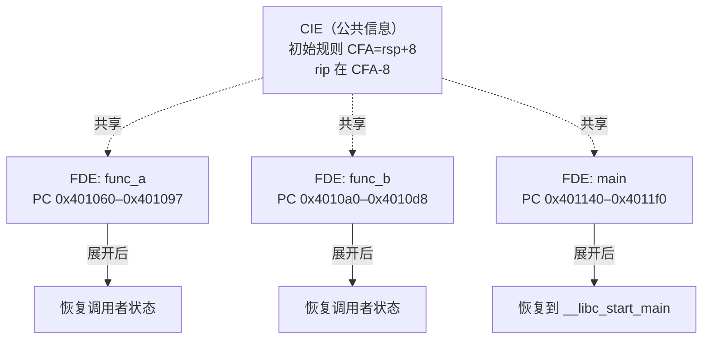
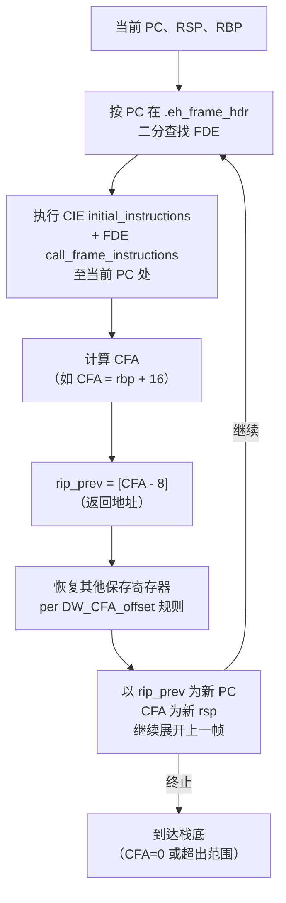
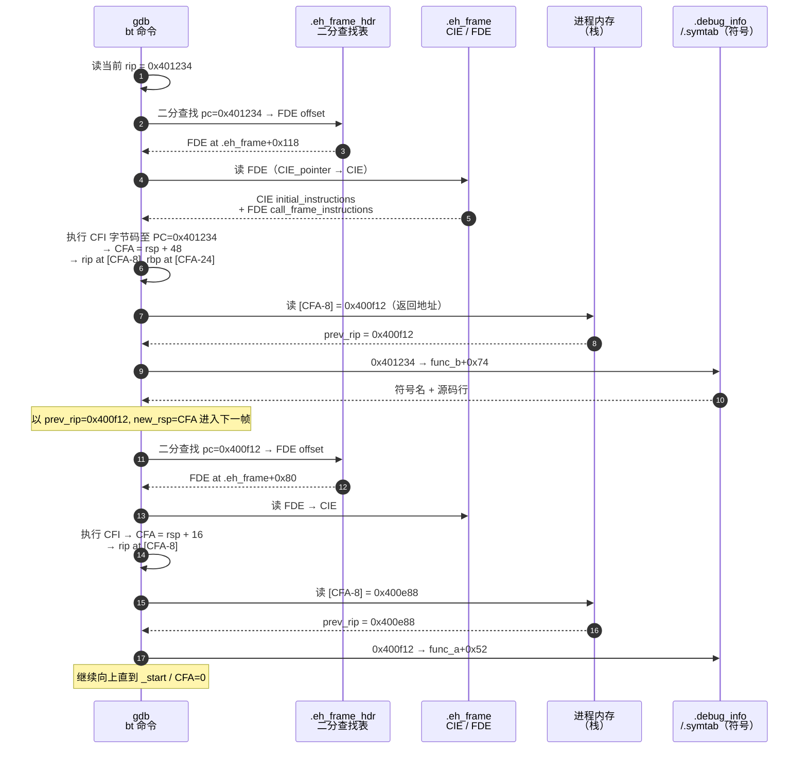

# 调试器原理与实战（7）· 栈回溯unwind

> [!abstract] TL;DR
> - **核心问题**：调试器执行 `bt`（backtrace）时，它如何从当前 `rip`/`rsp` 一路"往上爬"，还原出完整调用链？这个过程叫**栈展开（stack unwind）**。
> - **帧指针法**：最简单——沿 `rbp` 链逐帧跳跃：`[rbp]` 存上一帧 rbp，`[rbp+8]` 存返回地址。优点：实现极简；缺点：`-O2 -fomit-frame-pointer` 后 rbp 不再是帧指针，链断裂。
> - **CFI 法（主流）**：编译器把每条指令处"如何找到调用者寄存器"编进 `.eh_frame`/`.debug_frame` 里（DWARF CFI：CIE + FDE + `DW_CFA_*` 指令）。调试器/libunwind 按当前 PC 查表，解算出 CFA 和各保存寄存器位置，逐帧恢复。这正是 `-O2` 无帧指针时仍能 `bt` 的底气。
> - **Windows x64**：用 `.pdata`（`RUNTIME_FUNCTION` 数组）+ `.xdata`（`UNWIND_INFO`）实现表驱动展开，与 DWARF CFI 并行思路、不同编码。
> - **加速**：`.eh_frame_hdr` 中存放 PC→FDE 的二分查找表，O(log n) 定位目标 FDE。
> - **边角**：信号帧（signal trampoline）需特殊 CIE augmentation `S`；内联函数产生虚拟帧；Windows x64 的 leaf function 无展开信息（靠调用约定约束 rsp）。

---

## 概述与定位

调试器回溯调用栈（backtrace）是工程师最日常的调试动作之一。它看起来简单，背后却需要调试器正确解析复杂的展开元数据，才能在优化后的二进制里还原出逻辑调用链。本篇系统拆解三个层次：

1. **帧指针法**——原理直白，局限清晰；
2. **DWARF CFI 法**——Linux/macOS 的工业级方案，呼应 [[11.ELF文件详解/46.eh_frame节.md]] 和 [[11.ELF文件详解/32.debug_frame节.md]]；
3. **Windows x64 表驱动展开**——`.pdata`/`.xdata` 方案，与 DWARF 并行。

栈展开在调用规约层面有基础约束，见 [[22.调用规约/00.总览.md]]；`gdb bt` 的具体工作流见 [[08.GDB原理与实战]]；符号对应参见 [[06.PDB与Windows符号]]。

---

## 原理与机制

### 为什么回溯困难

调用栈在内存中是连续增长的区域，但要从中"还原调用链"，需要知道：

- 当前帧在哪里结束（帧边界）？
- 调用者的 `rip`（返回地址）保存在栈的哪个位置？
- 调用者的 `rbp`、`rbx`、`r12` 等被保存寄存器在哪？

`-O0` 有帧指针时这很简单；`-O2` 之后帧指针被省略，rsp 在函数体内随 push/alloca 动态变化，没有固定的帧边界标记。这就是为什么需要 DWARF CFI 这样的精确元数据。

### 帧指针法（rbp 链）

x86-64 System V ABI 有帧指针时，标准函数序言如下：

```asm
; 函数入口，caller 已执行 call（压返回地址到栈）
push   rbp          ; 保存调用者 rbp
mov    rbp, rsp     ; 建立本帧帧指针
sub    rsp, 0x20    ; 为局部变量分配栈空间
```

此后，从任意位置出发，栈结构如下（地址从高到低）：

```
...（调用者帧）
[rbp + 8]   = 返回地址（call 压入）
[rbp + 0]   = 调用者保存的 rbp    ← rbp 链的"链接"
[rbp - 8]   = 本帧局部变量/保存寄存器
...
```

回溯算法：

```python
# 伪代码：帧指针法栈回溯
def backtrace_frame_pointer(rbp, rip):
    frames = []
    while rbp != 0:
        ret_addr = memory[rbp + 8]   # 返回地址
        frames.append(resolve_symbol(rip))
        rip  = ret_addr
        rbp  = memory[rbp + 0]       # 上移到调用者帧
    return frames
```

**优点**：实现极简，无需任何调试信息。  
**缺点**：`-fomit-frame-pointer`（GCC/Clang `-O2` 默认开启）后，rbp 作为通用寄存器使用，不再维护帧链，此法失效。内核代码也常省略帧指针。

与调用规约的关系见 [[22.调用规约/00.总览.md]] 第四节——callee-saved 寄存器约定保证了 rbp 若被保存则可信，但 `-fomit-frame-pointer` 使其根本不被保存成帧指针。

### CFI 法——DWARF 栈展开

#### 核心思想

编译器在生成机器码的同时，把"每条指令执行完毕后，调用者寄存器保存在哪里"以**差分字节码**（`DW_CFA_*` 指令）的形式写入 `.eh_frame`（运行时可用）或 `.debug_frame`（仅调试时可用）。展开时，libunwind/调试器按当前 PC 查找并执行这段字节码，重建"调用者视角"。

详细格式参见 [[11.ELF文件详解/46.eh_frame节.md]] 和 [[11.ELF文件详解/32.debug_frame节.md]]；本篇从调试器使用角度剖析。

#### CFA（Canonical Frame Address）

CFA 是 DWARF 的核心概念：**被调函数入口时，调用者 RSP 的值**，即 `call` 指令执行后、返回地址刚压栈时调用者 rsp 所指地址。所有寄存器的恢复规则都以 CFA 为基准偏移表达。

```
x86-64 函数入口：
  CFA = rsp + 8       （call 压了 8 字节返回地址）
  返回地址 rip = [CFA - 8]
  调用者 rbp = [CFA - 16]  （若 push rbp 了）
```

#### CIE / FDE 数据结构

`.eh_frame` 节是一系列 CFI 记录的线性拼接：

- **CIE（Common Information Entry）**：多个函数共享的"公共头"，定义初始规则（如 `CFA = rsp+8, rip 在 CFA-8`）及 `code_alignment_factor`/`data_alignment_factor`/`return_address_register` 等元参数。
- **FDE（Frame Descriptor Entry）**：描述具体函数（或代码段）的 `[PC_begin, PC_begin + PC_range)` 范围内的展开规则变化，通过 `CIE_pointer` 引用其 CIE，并在 `call_frame_instructions` 中记录差分 `DW_CFA_*` 字节码。



#### 典型函数的 CFI 指令序列

以带帧指针的 x86-64 函数为例：

```
# CIE 初始规则（函数 call 后、第一条指令执行前）：
#   CFA = rsp + 8
#   rip 在 CFA-8（即 [rsp+0] = 返回地址）

# push rbp  （1字节）
DW_CFA_advance_loc: 1
DW_CFA_def_cfa_offset: 16    # CFA = rsp + 16（rsp 减了 8）
DW_CFA_offset: r6(rbp) at cfa-16  # rbp 旧值存于 [rsp]

# mov rbp, rsp  （3字节）
DW_CFA_advance_loc: 3
DW_CFA_def_cfa_register: r6(rbp)  # CFA 切换为 rbp+16（rbp 稳定）

# ... 函数体（rsp 可任意变化，CFA 仍由 rbp 定义）

# pop rbp; ret
DW_CFA_advance_loc: ...
DW_CFA_def_cfa: r7(rsp) ofs 8    # 尾声：恢复为 rsp 基准
DW_CFA_restore: r6(rbp)          # rbp 恢复初始规则
```

对于 `-fomit-frame-pointer` 的无帧指针函数，CFA 始终由 `rsp + 偏移` 表达，每次 push/sub rsp 都触发 `DW_CFA_def_cfa_offset` 更新。FDE 指令更密集，但逻辑相同。

#### 逐帧展开流程



#### .eh_frame_hdr 二分查找

直接线性扫描 `.eh_frame` 定位 FDE 是 O(n)，对大型程序不可接受。`.eh_frame_hdr` 节（SHF_ALLOC，运行时可见）存放：

- `.eh_frame` 节的起始地址；
- FDE 数量；
- 按 PC 地址排序的 `(PC_begin, FDE_offset)` 二元组数组。

libunwind/GCC 展开器通过此表做 **O(log n) 二分查找**，迅速定位目标 FDE。`PT_GNU_EH_FRAME` 程序头段让动态链接器在加载时知道 `.eh_frame_hdr` 的位置。

```
.eh_frame_hdr 布局（示意）：
  version = 1
  eh_frame_ptr_enc / fde_count_enc / table_enc
  eh_frame_ptr = <.eh_frame 节地址>
  fde_count = N
  table[0] = (pc_0, fde_offset_0)
  table[1] = (pc_1, fde_offset_1)
  ...（按 pc 递增排列，支持二分）
```

---

## 三平台对照

### Linux / macOS（DWARF CFI）

| 维度 | Linux x86-64 | macOS x86-64/arm64 |
|------|-------------|-------------------|
| 展开元数据节 | `.eh_frame` (SHF_ALLOC) + `.debug_frame` (-g) | `__TEXT,__eh_frame` / compact unwind (`__TEXT,__unwind_info`) |
| 索引加速 | `.eh_frame_hdr` + `PT_GNU_EH_FRAME` | `__TEXT,__unwind_info` 直接包含二级索引 |
| 运行时展开器 | `libgcc_s.so` / `libunwind.so` 的 `_Unwind_*` | `libSystem` 内置 libunwind |
| CIE_id 标识 | `.eh_frame` 中 CIE_id=0 标识 CIE | 相同 |
| 格式规范 | Itanium C++ ABI + LSB Core Generic | 相同（arm64 有 compact unwind 优先） |
| `backtrace()` 底层 | `_Unwind_Backtrace` 调 libunwind | 同，兼支持 compact unwind |

macOS arm64 上 compact unwind 格式更紧凑（每帧 4 字节 encoding），libunwind 优先用它，fallback 到 DWARF CFI。

### Windows x64（表驱动展开）

Windows x64 完全不用 DWARF，而是在 PE 文件中以两个节实现表驱动展开：

#### `.pdata`（`RUNTIME_FUNCTION` 数组）

每个有展开信息的函数对应一条 12 字节记录：

```c
typedef struct _RUNTIME_FUNCTION {
    DWORD BeginAddress;      // 函数起始 RVA
    DWORD EndAddress;        // 函数结束 RVA（开区间）
    DWORD UnwindInfoAddress; // UNWIND_INFO 的 RVA（位于 .xdata）
} RUNTIME_FUNCTION;
```

`.pdata` 节按 `BeginAddress` 升序排列，展开时同样二分查找定位当前 PC。

#### `.xdata`（`UNWIND_INFO`）

每个 `RUNTIME_FUNCTION` 指向一个 `UNWIND_INFO` 结构：

```c
typedef struct _UNWIND_INFO {
    BYTE Version : 3;          // 必须为 1
    BYTE Flags   : 5;          // UNW_FLAG_EHANDLER/UHANDLER/CHAININFO
    BYTE SizeOfProlog;         // 函数序言字节数
    BYTE CountOfCodes;         // UNWIND_CODE 数组长度
    BYTE FrameRegister : 4;    // 帧寄存器（0=无，非零=寄存器号）
    BYTE FrameOffset   : 4;    // 帧寄存器相对 RSP 的偏移（×16）
    UNWIND_CODE UnwindCode[];  // 展开代码数组
    // 若 Flags & UNW_FLAG_CHAININFO：尾接另一个 RUNTIME_FUNCTION
    // 若 Flags & UNW_FLAG_EHANDLER：尾接 Exception Handler RVA + 语言特定数据
} UNWIND_INFO;
```

`UNWIND_CODE` 是 2 字节的"mini 指令"，描述序言中每条修改栈指针或保存寄存器的操作（`UWOP_PUSH_NONVOL`、`UWOP_ALLOC_LARGE`、`UWOP_SAVE_NONVOL`、`UWOP_SET_FPREG` 等），与 DWARF `DW_CFA_*` 类比。

#### Windows x64 与 DWARF CFI 对照

| 维度 | DWARF CFI（Linux/macOS） | Windows x64 表驱动 |
|------|--------------------------|-------------------|
| 函数索引表 | `.eh_frame_hdr`（RVA 二元组数组） | `.pdata`（`RUNTIME_FUNCTION` 数组） |
| 帧描述详情 | `.eh_frame` FDE + `DW_CFA_*` 字节码 | `.xdata` `UNWIND_INFO` + `UNWIND_CODE` 数组 |
| 指令编码粒度 | 差分 PC + 寄存器规则增量 | 序言内每条指令一个 `UNWIND_CODE` |
| CFA 概念 | 显式 CFA + 偏移规则 | 隐式：RSP 或帧寄存器 + 偏移 |
| 运行时展开器 | `_Unwind_*` / libunwind | `RtlUnwindEx` / `__C_specific_handler` 等 |
| 异常处理集成 | `personality` + `.gcc_except_table`（LSDA） | Exception Handler + `__CxxFrameHandler4` |
| leaf function | 需要 FDE（empty 也行） | **不需要** `.pdata` 条目（ABI 约束 RSP 对齐且不变） |
| chained unwind | 无（直接线性） | `UNW_FLAG_CHAININFO` 链接多段 `UNWIND_INFO` |

**Windows x64 leaf function**（无 prologue、不修改 RSP 的叶函数）不需要任何展开信息，展开器直接读 `[RSP]` 得到返回地址——这是 Windows x64 ABI 的一项重要设计节省。

---

## 数据结构 / 流程详解

### 一次完整的 `gdb bt` 展开过程

以下以 Linux x86-64、`-O2 -fomit-frame-pointer` 编译为例（最能体现 CFI 价值的场景）：



### 信号帧（Signal Trampoline）

当进程收到信号时，内核在用户栈上构建一个 `sigframe`，并把 `sa_restorer`（信号返回蹦床，如 `__restore_rt`）的地址作为"返回地址"压栈——但这个"调用者"根本不在正常调用链里，CFI 规则完全不同。

解决方案：内核信号蹦床的 `.eh_frame` CIE augmentation 中加 `S` 标志，告知展开器"此 FDE 描述信号帧"，返回地址不能直接减 1（正常函数展开时 `rip-1` 以落在 call 指令范围内），且寄存器保存位置在 `sigcontext` 结构体中，需要特殊恢复逻辑。

```
信号帧 CIE augmentation：含 'S' → signal frame
展开时：registers 从 [rsp + offset_of_sigcontext] 读取
        (不依赖标准的 CFA+偏移规则)
```

GDB 通过识别信号蹦床代码模式（`mov $__NR_rt_sigreturn, %eax; syscall` 序列）或读 `S` augmentation，知道当前帧是信号帧并正确跳过。

### 内联函数的虚拟帧

编译器 inline 展开后，内联体的机器码与 caller 混在一起，没有独立栈帧。DWARF `.debug_info` 中用 `DW_TAG_inlined_subroutine` 节点记录内联位置，GDB 在展开时读取这些节点，在 backtrace 输出中插入"虚拟帧"（inline frame），让用户看到完整的逻辑调用链，而物理上只有一个真实栈帧。

```
gdb bt 输出示例（含内联虚拟帧）：
#0  memcpy ()              ← 真实帧
#1  0x00401234 in do_copy  ← 内联虚拟帧（inline subroutine）
#2  0x00401200 in process_data
#3  0x004011a0 in main
```

---

## 实操

### readelf 查看 `.eh_frame`

> [!warning] 示例输出为示意
> 以下输出在 Linux x86-64 环境下运行，本机为 Windows，属代表性示例，非本机实跑。

```bash
# 解析所有 CIE/FDE，逐字段显示
readelf --debug-dump=frames a.out

# 输出示意：
# The section .eh_frame contains:
#
# 00000000 0000001c 00000000 CIE "zR" cf=1 df=-8 ra=16
#   DW_CFA_def_cfa: r7 (rsp) ofs 8
#   DW_CFA_offset: r16 (rip) at cfa-8
#   DW_CFA_nop
#   DW_CFA_nop
#
# 00000020 0000004c 00000024 FDE cie=00000000 pc=00401060..004010a0
#   DW_CFA_advance_loc: 1 to 00401061
#   DW_CFA_def_cfa_offset: 16
#   DW_CFA_offset: r6 (rbp) at cfa-16
#   DW_CFA_advance_loc: 3 to 00401064
#   DW_CFA_def_cfa_register: r6 (rbp)
#   ...
```

```bash
# 以"解释后矩阵"形式展示每 PC 处的完整规则
readelf --debug-dump=frames-interp a.out

# 查看 .eh_frame_hdr 的二分查找表
readelf --debug-dump=frames a.out | grep -A3 eh_frame_hdr
readelf -e a.out | grep -A2 GNU_EH_FRAME
```

### gdb backtrace 实操

> [!warning] 示例输出为示意
> 以下为代表性 GDB 会话示意，非本机实跑。

```bash
gcc -O2 -g -o demo demo.c      # -O2 省略帧指针，-g 保留 DWARF 符号
gdb ./demo
(gdb) run
# ...程序运行至断点/崩溃...
(gdb) bt                        # GDB 用 .eh_frame 展开（非帧指针法）
# #0  leaf_func () at demo.c:12
# #1  0x0000000000401234 in middle_func () at demo.c:28
# #2  0x0000000000400f12 in main () at demo.c:45
(gdb) bt full                   # 同时显示各帧局部变量
(gdb) info frame                # 显示当前帧 CFA / 寄存器恢复信息
# Stack frame at 0x7fffffffde20:
#  rip = 0x401234 in leaf_func; saved rip = 0x400f12
#  called by frame at 0x7fffffffde40
#  source language c.
#  Arglist at 0x7fffffffde18, args:
#  Locals at 0x7fffffffde18, Previous frame's sp is 0x7fffffffde20
(gdb) info registers rip rsp rbp  # 查看当前帧寄存器
```

对 `-fomit-frame-pointer` 编译的程序，`bt` 依然正常，因为 GDB 走 CFI 路径（非帧指针链）。若连 `.eh_frame` 也没有（如内核模块、手写汇编），可用 `set backtrace limit N` 限制深度防止死循环。

### Windows 查看 `.pdata`

> [!warning] 示例输出为示意
> 以下为 Windows 工具示意，非本机实跑。

```cmd
:: dumpbin 查看 .pdata（RUNTIME_FUNCTION 数组）
dumpbin /unwindinfo demo.exe

:: 示意输出：
:: Function Table (5)
::     Begin  End    Info
::     004010 00401a 004020   ->  SizeOfProlog=14
::                              CountOfCodes=6
::                              FrameRegister=none
::                              UWOP(0): PUSH_NONVOL RBX offset=1
::                              UWOP(1): ALLOC_SMALL 0x28 offset=5
```

WinDbg 中：

```windbg
.kf        ; 完整 kernel-mode 调用栈（含展开信息）
kv         ; verbose backtrace（显示每帧展开细节）
!uniqstack ; 所有线程调用栈去重
```

---

## 陷阱与注意事项

| 场景 | 问题 | 解决 |
|------|------|------|
| `-fomit-frame-pointer` | 帧指针法失效，必须依赖 CFI | 确保 `.eh_frame` 存在（gcc 默认生成） |
| `strip --strip-all` | 删 `.eh_frame` → 运行时 C++ 异常失效，backtrace 失效 | 只用 `--strip-debug` 保留 `.eh_frame` |
| 汇编手写函数 | 无 CFI 指令 → GDB 无法回溯 | 加 `.cfi_startproc`/`.cfi_endproc` 及相关伪指令 |
| 信号处理函数 | 正常 CFI 规则不适用 | 内核蹦床已有 `S` augmentation；用户自定义 handler 遵循正常 ABI |
| Windows leaf function | 无 `.pdata` 条目 | 正常——ABI 约束 RSP 不变，展开器直接读 `[RSP]` |
| 内联函数 | 物理上无独立帧 | GDB 用 `.debug_info` `DW_TAG_inlined_subroutine` 插入虚拟帧 |
| alloca/VLA | RSP 动态变化，CFA 不能靠 rsp+固定偏移 | 编译器切换 `DW_CFA_def_cfa_register rbp`（或 `DW_CFA_def_cfa_expression`） |
| 尾调用优化 | 被优化掉的帧在 backtrace 中消失 | 已知局限；DWARF 无法重建已销毁的帧 |

---

## 小结

栈回溯看似是"打印一个列表"，本质是**按展开元数据逐帧重建调用者寄存器状态**：

- **帧指针法**：`rbp` 链，简单但脆弱，`-O2` 后失效；
- **DWARF CFI 法**：编译器把每 PC 处的寄存器保存位置以 `DW_CFA_*` 字节码编入 `.eh_frame`/`.debug_frame`，展开器/调试器按 PC 查 `.eh_frame_hdr` 二分索引、解算 CFA 和各寄存器，逐帧"爬栈"，是现代 Linux/macOS 的工业方案；
- **Windows x64 表驱动**：`.pdata`（`RUNTIME_FUNCTION`）+ `.xdata`（`UNWIND_INFO`/`UNWIND_CODE`），与 DWARF 并行思路不同格式，leaf function 无需条目；
- **边角**：信号帧靠 `S` augmentation 特判；内联函数用 `.debug_info` 虚拟帧补全逻辑调用链。

理解展开机制，既是读懂 `bt` 输出的前提，也是手写汇编时正确插入 `.cfi_*` 伪指令、保证 C++ 异常与 profiler 正常工作的必要基础。

---

## 相关阅读

- **ELF 运行时展开格式**：[[11.ELF文件详解/46.eh_frame节.md]]
- **调试版展开格式**：[[11.ELF文件详解/32.debug_frame节.md]]
- **调用规约（寄存器保存约定）**：[[22.调用规约/00.总览.md]]
- **Windows 符号与 PDB**：[[06.PDB与Windows符号]]
- **GDB 实战（bt 命令详解）**：[[08.GDB原理与实战]]
- **DWARF 调试信息总览**：[[11.ELF文件详解/24.debug节.md]]

---

⬅️ 上一篇 [[06.PDB与Windows符号]] ｜ 🏠 [[00.调试器原理与实战总览]] ｜ 下一篇 [[08.GDB原理与实战]] ➡️
